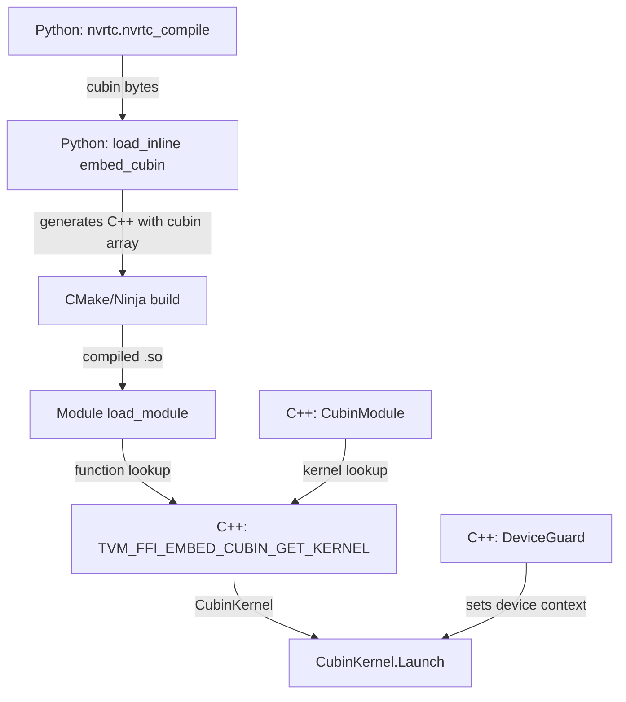

# CUDA Utilities (Cubin Launcher, DeviceGuard, NVRTC)

**TL;DR**.
- Header-only CUDA utilities in `tvm/ffi/extra/cuda/` for loading and launching CUDA kernels from cubin binaries, with RAII device context management.
- `CubinModule`/`CubinKernel` wraps the CUDA Driver API for cubin loading and kernel dispatch with 2.4x lower launch overhead than Triton.
- `DeviceGuard` provides PyTorch-style RAII device context switching for multi-GPU workloads.
- Python-side `tvm_ffi.cpp.nvrtc` compiles CUDA source to cubin via NVRTC, and `embed_cubin` parameter in `load_inline()` enables embedding cubin blobs into JIT-compiled C++ modules.

## Problem Statement

### Background
- GPU kernel libraries need to launch precompiled cubin kernels efficiently, but the raw CUDA Driver API is verbose and error-prone (module loading, function lookup, launch configuration).
- Multi-GPU dispatch requires careful device context management to avoid launching kernels on the wrong device.
- Runtime compilation via NVRTC produces cubin blobs that need to be embedded into host-side C++ for deployment.

### Solution
- A header-only C++ layer (`cubin_launcher.h`) wrapping `cuModuleLoadData`, `cuModuleGetFunction`, and `cuLaunchKernel` with cached kernel lookup and RAII module lifetime.
- `DeviceGuard` (`device_guard.h`) saves/restores the CUDA context around a scope using `cuCtxSetCurrent`.
- CMake `EmbedCubin.cmake` and Python `embed_cubin.py` generate C++ source files containing cubin data as byte arrays, with macros for declaring and accessing embedded cubins.

### Goals
- Minimal launch overhead: avoid per-call module loading or function lookup (kernel caching).
- RAII-based resource management for device context and cubin modules.
- Cross-platform cubin embedding (CMake for static builds, Python for JIT `load_inline`).
- Non-goal: kernel compilation (delegated to NVRTC or external toolchains).

## Design

The CUDA utilities form a layered design:



### Key Classes, Fields and Interfaces

```python
class CubinModule:
    """Wraps a loaded CUDA module from cubin binary data."""
    _module: CUmodule  # CUDA driver module handle

    def __init__(self, cubin_data: bytes):
        """Load cubin into CUDA driver module."""
        # Interacts with: cuModuleLoadData (CUDA Driver API)
        # Invariant: CUDA context must be current when constructing
        # Extension: could support PTX loading via cuModuleLoadDataEx

    def __getitem__(self, kernel_name: str) -> CubinKernel:
        """Get kernel function by name."""
        # Interacts with: cuModuleGetFunction
        # Invariant: kernel_name must exist in cubin; raises on failure

    def __del__(self):
        """Unload CUDA module."""
        # Interacts with: cuModuleUnload

class CubinKernel:
    """Handle to a kernel function within a CubinModule."""
    _function: CUfunction  # CUDA kernel handle

    def Launch(self, args: list[void_ptr], grid: dim3, block: dim3,
               stream: CUstream, shared_mem_bytes: int = 0) -> CUresult:
        """Launch kernel on specified stream."""
        # Interacts with: cuLaunchKernel (CUDA Driver API)
        # Invariant: args must match kernel parameter layout exactly
        # Invariant: grid/block dimensions must be within device limits

class dim3:
    """CUDA grid/block dimensions."""
    x: int = 1
    y: int = 1
    z: int = 1

class DeviceGuard:
    """RAII guard for CUDA device context switching."""
    _prev_ctx: CUcontext  # saved context, restored on destruction

    def __init__(self, device_id: int):
        """Save current context, switch to device_id's primary context."""
        # Interacts with: cuCtxGetCurrent, cuDeviceGet,
        #   cuDevicePrimaryCtxRetain, cuCtxSetCurrent
        # Invariant: device_id must be valid CUDA device ordinal
        # Extension: similar to c10::cuda::CUDAGuard in PyTorch

    def __del__(self):
        """Restore previous CUDA context."""
        # Interacts with: cuCtxSetCurrent(_prev_ctx)

# Macro: TVM_FFI_EMBED_CUBIN(name)
# Declares external cubin data generated by embed_cubin.py or EmbedCubin.cmake:
#   extern const unsigned char __tvm_ffi_cubin_##name[];
#   extern const unsigned int __tvm_ffi_cubin_##name##_size;
# Interacts with: generated .cc file containing byte array

# Macro: TVM_FFI_EMBED_CUBIN_GET_KERNEL(name, kernel_name)
# Returns CubinKernel with lazy-initialized CubinModule (thread-safe via static):
#   static CubinModule mod(__tvm_ffi_cubin_##name, __tvm_ffi_cubin_##name##_size);
#   return mod[kernel_name];
# Interacts with: CubinModule, CubinKernel
# Invariant: module initialized once per name, kernel cached

# Macro: TVM_FFI_CHECK_CUDA_DRIVER_ERROR(result)
# Asserts CUresult == CUDA_SUCCESS, throws via TVM_FFI_THROW on failure
# Interacts with: TVM_FFI_THROW (0004-error-propagation)

# Macro: TVM_FFI_CHECK_CUDA_RUNTIME_ERROR(result)
# Asserts cudaError_t == cudaSuccess
# Interacts with: TVM_FFI_THROW (0004-error-propagation)

# Python API:
def nvrtc_compile(source: str, name: str = "kernel.cu",
                  options: list[str] | None = None) -> bytes:
    """Compile CUDA source to cubin via NVRTC."""
    # Interacts with: nvrtcCreateProgram, nvrtcCompileProgram, nvrtcGetCUBIN
    # Invariant: CUDA toolkit with NVRTC must be installed
    # Extension: could add PTX output option
```

### Contracts, Assumptions and Invariants
- **CUDA context must be current** when constructing `CubinModule` or using `DeviceGuard`. The driver API is context-dependent.
- **Kernel argument layout must match exactly** — `CubinKernel.Launch` passes `void*[]` directly to `cuLaunchKernel` with no type checking.
- **Static kernel caching** — `TVM_FFI_EMBED_CUBIN_GET_KERNEL` uses function-local statics, so the module is loaded once per embedded cubin name. Thread-safe via C++11 static initialization guarantees.
- **Module unload hazard** — if a `CubinModule` is destroyed while kernel executions are in-flight, behavior is undefined. The static caching pattern avoids this for embedded cubins.

### Extension Points
- Custom cubin sources (Triton, CUTLASS, handwritten PTX) can be compiled externally and passed through `embed_cubin` or loaded dynamically via `CubinModule`.
- `load_inline()` accepts `embed_cubin: dict[str, bytes]` to embed multiple cubin blobs in one module.
- New CUDA utilities (e.g., occupancy calculators) can be added as additional headers in `tvm/ffi/extra/cuda/`.

### Usage Examples

#### Compile and launch a CUDA kernel via Python
**Context**: JIT-compile a CUDA kernel, embed it in a C++ module, and call from Python.
```python
import torch
from tvm_ffi.cpp import nvrtc, load_inline

# Compile CUDA kernel to cubin
cuda_src = 'extern "C" __global__ void add_one(float* x, float* y, int n) { int i = blockIdx.x*blockDim.x+threadIdx.x; if(i<n) y[i]=x[i]+1; }'
cubin = nvrtc.nvrtc_compile(cuda_src)

# C++ wrapper using embedded cubin
cpp = '''
#include <tvm/ffi/extra/cuda/cubin_launcher.h>
#include <tvm/ffi/function.h>
TVM_FFI_EMBED_CUBIN(my_cubin);
void AddOne(tvm::ffi::TensorView x, tvm::ffi::TensorView y) {
  static auto kernel = TVM_FFI_EMBED_CUBIN_GET_KERNEL(my_cubin, "add_one");
  int64_t n = x.size(0);
  void *xp = x.data_ptr(), *yp = y.data_ptr();
  void* args[] = {&xp, &yp, &n};
  tvm::ffi::dim3 grid((n+255)/256), block(256);
  kernel.Launch(args, grid, block, /*stream=*/nullptr);
}
TVM_FFI_DLL_EXPORT_TYPED_FUNC(add_one, AddOne);
'''
mod = load_inline("my_mod", cuda_sources=cpp, embed_cubin={"my_cubin": cubin})
x = torch.randn(1024, device="cuda"); y = torch.empty_like(x)
mod.add_one(x, y)
assert torch.allclose(y, x + 1)
```

#### Multi-GPU dispatch with DeviceGuard
**Context**: Launch a kernel on a specific GPU device.
```cpp
#include <tvm/ffi/extra/cuda/device_guard.h>
#include <tvm/ffi/extra/cuda/cubin_launcher.h>

void DispatchKernel(int device_id, void* args[], int n) {
  tvm::ffi::DeviceGuard guard(device_id);  // switches to device
  static auto kernel = TVM_FFI_EMBED_CUBIN_GET_KERNEL(my_cubin, "compute");
  tvm::ffi::dim3 grid((n+255)/256), block(256);
  kernel.Launch(args, grid, block, /*stream=*/nullptr);
  // guard destructor restores previous device context
}
```

## Alternatives & Trade-offs
### Header-only vs compiled library
- Pros: zero build integration cost — just include the header. No link dependency beyond CUDA driver.
- Cons: CUDA Driver API headers must be available at compile time. Module initialization happens at first use, adding latency to the first kernel launch.

### CUDA Driver API vs Runtime API
- Pros: Driver API allows loading cubin from memory without file I/O. Finer control over context and module management.
- Cons: More verbose than Runtime API. Requires explicit context management (hence `DeviceGuard`).

## Related Work
### Design Records
- 0003-function-system — `TVM_FFI_DLL_EXPORT_TYPED_FUNC` used to export kernel wrappers
- 0004-error-propagation — `TVM_FFI_THROW` used by CUDA error-checking macros
- 0011-module-system — `load_module()` / `load_inline()` for loading compiled extensions, `TVMFFIEnvGetStream` for stream access
- 0013-load-inline — `load_inline()` extended with `embed_cubin` parameter

### Evidence Matrix
- CubinModule/CubinKernel/dim3 API, embed macros -> `d49effdb` (cubin launcher)
- DeviceGuard, base.h error macros -> `cdfd0410` (DeviceGuard)
- Kernel library guide docs -> `db53ce4f` (docs), `803cdc84` (docs update)
- Plus 2 supporting commits: `a999de6e` (clang-tidy), `8dbd2811` (f8e8m0 version fix)
