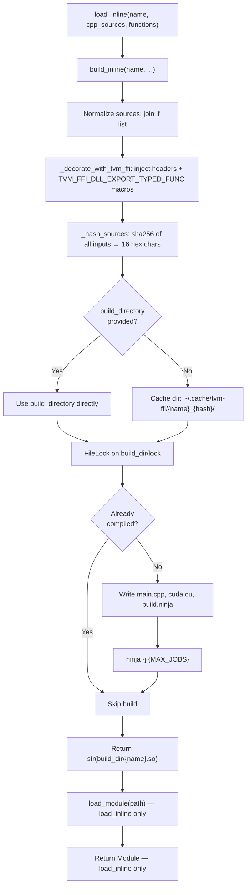

# load_inline — JIT Compilation of C++/CUDA Source

**TL;DR**
- `tvm_ffi.cpp.load_inline()` JIT-compiles inline C++/CUDA source strings into a shared library via Ninja and loads it as a `ffi.Module`, with content-hash-based caching under `~/.cache/tvm-ffi`.
- `tvm_ffi.cpp.build_inline()` is the compilation-only entry point (commit 4fcf94f6): same parameters as `load_inline`, returns `str` (path to compiled `.so`/`.dll`) instead of a `Module`. `load_inline` is now a thin wrapper: `load_module(build_inline(...))`.
- `tvm_ffi.cpp.build()` and `tvm_ffi.cpp.load()` (commit c897e4c) accept file paths (`.cc`/`.cu`) instead of source strings, mirroring `torch.utils.cpp_extension.load`. They share the common `_build_impl()` helper with inline variants.
- The interface mirrors `torch.utils.cpp_extension.load_inline`: `cpp_sources`/`cuda_sources` accept `str | list[str]`; `functions` accepts `str | Sequence[str] | Mapping[str, str]` where mapping values are docstrings (not aliases — exported name must match source function name).
- The build pipeline injects `TVM_FFI_DLL_EXPORT_TYPED_FUNC` macros via `_decorate_with_tvm_ffi`, so each exported function gets a `__tvm_ffi_` prefixed C symbol loadable by `LibraryModuleObj::GetSymbolWithSymbolPrefix`.
- The source file was renamed from `load_inline.py` to `extension.py` (commit c897e4c) to reflect the broader scope.

## Problem Statement

### Background
Testing and prototyping C++/CUDA FFI extensions required a full CMake build cycle: write `.cc` file, add to `CMakeLists.txt`, build, install, load from Python. For rapid iteration (e.g., testing a new kernel in a Jupyter notebook), this cycle was too heavy.

### Solution
A Python-level JIT compilation function that takes C++ source strings, generates a Ninja build file, compiles to `.so`, and loads it as a `Module` — all in one call. Caching by content hash avoids recompilation when source hasn't changed.

### Goals
- One-call compilation: source string in, `Module` out.
- Content-hash caching for deterministic rebuild avoidance.
- Cross-platform: Linux, macOS, and Windows (MSVC).
- CUDA support with auto-detected architecture.
- Non-goal: incremental compilation or dependency tracking beyond content hashing.

## Design



### Key Classes, Fields and Interfaces

```python
# python/tvm_ffi/cpp/extension.py (renamed from load_inline.py in commit c897e4c)

# ─── File-path-based API (commit c897e4c) ────────────────────────────────────

def build(
    name: str,
    sources: Sequence[str | Path],
    extra_cflags: Sequence[str] | None = None,
    extra_ldflags: Sequence[str] | None = None,
    extra_include_paths: Sequence[str] | None = None,
    build_directory: str | None = None,
    with_cuda: bool = False,
    functions: Mapping[str, str] | None = None,
) -> str:
    """Compile C++/CUDA source files (file paths) into a shared library, return path.
    # Invariant: sources are paths to .cc/.cu files (not raw strings)
    # Interacts with: _build_impl (shared with build_inline), build_ninja, find_cuda_home
    # Extension: mirrors torch.utils.cpp_extension.load interface
    """
    ...

def load(
    name: str,
    sources: Sequence[str | Path],
    extra_cflags: Sequence[str] | None = None,
    extra_ldflags: Sequence[str] | None = None,
    extra_include_paths: Sequence[str] | None = None,
    build_directory: str | None = None,
    with_cuda: bool = False,
    functions: Mapping[str, str] | None = None,
) -> Module:
    """Compile and load C++/CUDA source files as an ffi.Module.
    # Thin wrapper: return load_module(build(...))
    # Interacts with: build(), ffi.load_module()
    """
    ...


# ─── Inline source API (existing) ────────────────────────────────────────────

def build_inline(
    name: str,
    *,
    cpp_sources: Sequence[str] | str | None = None,
    cuda_sources: Sequence[str] | str | None = None,
    functions: Mapping[str, str] | Sequence[str] | str | None = None,
    extra_cflags: Sequence[str] | None = None,
    extra_cuda_cflags: Sequence[str] | None = None,
    extra_ldflags: Sequence[str] | None = None,
    extra_include_paths: Sequence[str] | None = None,
    build_directory: str | None = None,
) -> str:
    """NEW (commit 4fcf94f6): Compile C++/CUDA module from inline source; return the .so path.
    # Invariant: same caching and build logic as old load_inline implementation
    # Invariant: returned path = str((build_dir / f"{name}{ext}").resolve())
    # Invariant: exported_name == function_name_in_source (no aliasing)
    # Invariant: cache key = sha256(sources + functions + all flags)[:16]
    # Invariant: FileLock serializes concurrent builds of the same cache slot
    # Interacts with: _decorate_with_tvm_ffi, _hash_sources, _build_ninja, FileLock
    # Extension: caller controls when/whether to load the library via tvm_ffi.load_module(path)
    """
    ...

def load_inline(
    name: str,
    *,
    cpp_sources: Sequence[str] | str | None = None,
    cuda_sources: Sequence[str] | str | None = None,
    functions: Mapping[str, str] | Sequence[str] | str | None = None,
    extra_cflags: Sequence[str] | None = None,
    extra_cuda_cflags: Sequence[str] | None = None,
    extra_ldflags: Sequence[str] | None = None,
    extra_include_paths: Sequence[str] | None = None,
    build_directory: str | None = None,
) -> Module:
    """JIT-compile C++/CUDA source strings and load as a Module.
    Now a thin wrapper: return load_module(build_inline(...))
    # API-compatible with prior callers — return type unchanged (Module)
    # Interacts with: build_inline (compilation), load_module (DSO loading)
    """
    return load_module(build_inline(name=name, ...))

# python/tvm_ffi/cpp/__init__.py
# New export: from .load_inline import build_inline, load_inline

def _decorate_with_tvm_ffi(source: str, functions: Mapping[str, str]) -> str:
    """Prepend tvm/ffi headers and append export macros.
    Auto-injected headers (commit 742b16e5 added tvm/ffi/container/tensor.h):
      #include <tvm/ffi/function.h>
      #include <tvm/ffi/container/tensor.h>   # NEW in commit 742b16e5 — enables tvm::ffi::Tensor
      #include <tvm/ffi/dtype.h>
      #include <tvm/ffi/error.h>
      #include <tvm/ffi/extra/c_env_api.h>
    For each func_name in functions:
      appends: TVM_FFI_DLL_EXPORT_TYPED_FUNC(func_name, func_name);
    # Invariant: exported name == source name (self-alias)
    # Invariant: users may freely use tvm::ffi::Tensor in inline sources without extra includes
    # Interacts with: TVM_FFI_DLL_EXPORT_TYPED_FUNC (function.h), __tvm_ffi_ symbol prefix
    """
    ...

def _hash_sources(cpp_source, cuda_source, functions, *flags) -> str:
    """sha256 over all inputs; truncated to 16 hex chars.
    # Invariant: sorted function names — reordering doesn't cause cache miss
    """
    ...

def _generate_ninja_build(name, build_dir, with_cuda, ...) -> str:
    """Generate build.ninja content.
    # Invariant: default C++ flags = [-std=c++17, -fPIC, -O2] on POSIX; [/std:c++17] on Windows (MSVC)
    # Invariant: CUDA arch from nvidia-smi or TVM_FFI_CUDA_ARCH_LIST env var
    # Invariant: links libtvm_ffi on all platforms (non-Windows: -ltvm_ffi_shared; Windows: import lib)
    """
    ...

# python/tvm_ffi/utils/lockfile.py

class FileLock:
    """Cross-platform advisory file lock (fcntl on POSIX, msvcrt on Windows).
    # Invariant: non-reentrant — same process must not acquire() twice without release()
    # Invariant: lock tied to file descriptor; released when fd closed
    """
    lock_file_path: str

    def __enter__(self) -> FileLock: ...   # calls blocking_acquire()
    def __exit__(self, *) -> bool: ...     # calls release(); returns False
    def acquire(self) -> bool: ...         # non-blocking; True if acquired
    def blocking_acquire(self, timeout=None, poll_interval=0.1) -> bool: ...
    def release(self) -> None: ...
    # Interacts with: fcntl.flock(LOCK_UN) on POSIX, msvcrt.locking(LK_UNLCK) on Windows
```

### Environment Variables

| Variable | Purpose | Default |
|----------|---------|---------|
| `TVM_FFI_CACHE_DIR` | Override default cache directory | `~/.cache/tvm-ffi` |
| `TVM_FFI_CUDA_ARCH_LIST` | Space-separated CUDA architectures (e.g., `"8.9 9.0a"`) | Auto-detect via `nvidia-smi` |
| `MAX_JOBS` | Ninja parallelism | System default |
| `CXX` | C++ compiler override | System default |
| `CUDA_HOME` / `CUDA_PATH` | CUDA install path | Auto-detect |

### Contracts, Assumptions and Invariants

- The `functions` parameter's exported names must exactly match C++ function names in the source. The old aliasing behavior (`{"export_name": "source_name"}`) was removed in commit 825aeb9; mapping values are now reserved for docstrings.
- `build_directory` bypasses the hash-based cache entirely. When set, no content-hash directory is created; the caller manages the build directory lifecycle.
- The cache directory layout is: `{TVM_FFI_CACHE_DIR}/{name}_{hash16}/` containing `main.cpp`, optionally `cuda.cu`, `build.ninja`, `lock`, and `{name}.so`.
- `_decorate_with_tvm_ffi` applies `functions` to `cpp_sources` by default. When `cpp_sources` is empty (CUDA-only case, commit 1ce0f6fa8f7e), the export decorators are instead applied to `cuda_source`, enabling CUDA functions to be exported directly without a C++ shim.
- On Windows (commit 4383b1a6), the `_build_ninja()` function delegates to `_run_command_in_dev_prompt()` which locates Visual Studio via `vswhere.exe` and wraps the ninja invocation as `cmd.exe /c VsDevCmd.bat -arch=x64 & ninja ...`. This ensures MSVC `cl.exe` and linker tools are on PATH. Raises `RuntimeError` if no VS installation is found.
- The Ninja build links against `libtvm_ffi_shared` on all platforms (macOS fix in commit 4ffbc88, Windows fix in commit 2df07e5).

### Failure Modes
- Missing Ninja: `load_inline` calls `subprocess.run(["ninja", ...])`. If Ninja is not installed, a `FileNotFoundError` is raised. Mitigation: `pyproject.toml` includes `ninja` as a dependency.
- CUDA compilation without GPU: `nvidia-smi` call fails. Mitigation: set `TVM_FFI_CUDA_ARCH_LIST` explicitly.
- Concurrent builds with the same cache key: `FileLock` serializes access. If the lock file is corrupted (e.g., NFS), `blocking_acquire` may timeout.

### Extension Points
- Add new compiler flags via `extra_cflags` / `extra_cuda_cflags` / `extra_ldflags`.
- Custom include paths via `extra_include_paths`.
- The `build_directory` parameter enables CI/CD pipelines to manage build artifacts explicitly.

### Usage Examples

#### Basic C++ inline module
**Context**: JIT-compiling a CPU kernel for quick testing.

```python
import tvm_ffi
import numpy as np

mod = tvm_ffi.cpp.load_inline(
    name="hello",
    cpp_sources=r"""
        // tvm::ffi::Tensor available without extra #include (commit 742b16e5 added tensor.h to preamble)
        void add_one_cpu(tvm::ffi::Tensor x, tvm::ffi::Tensor y) {
            for (int i = 0; i < x->shape[0]; ++i)
                ((float*)y->data)[i] = ((float*)x->data)[i] + 1;
        }
        // Old pattern (still works but less idiomatic):
        // void add_one_cpu(DLTensor* x, DLTensor* y) { ... }
    """,
    functions=["add_one_cpu"],
)
x = np.array([1, 2, 3], dtype=np.float32)
y = np.empty_like(x)
mod.add_one_cpu(x, y)
np.testing.assert_equal(x + 1, y)
```

**Cross-layer trace**: `cpp_sources` string -> `_decorate_with_tvm_ffi` injects `#include <tvm/ffi/function.h>` + `TVM_FFI_DLL_EXPORT_TYPED_FUNC(add_one_cpu, add_one_cpu)` -> Ninja compiles to `hello.so` with symbol `__tvm_ffi_add_one_cpu` -> `load_module("hello.so")` opens via `DSOLibrary` -> `mod.add_one_cpu` dispatches through `Module.GetFunction("add_one_cpu")` -> `GetSymbolWithSymbolPrefix("add_one_cpu")` -> `GetSymbol("__tvm_ffi_add_one_cpu")` -> packed call.

#### File-path-based build and load (commit c897e4c)
**Context**: Building from external `.cc` source files rather than inline strings.

```python
from tvm_ffi import cpp

# Compile from file paths
lib_path = cpp.build(
    name="my_kernel",
    sources=["kernel.cc", "utils.cc"],
    with_cuda=True,
)

# Or compile+load in one step
mod = cpp.load(
    name="my_kernel",
    sources=["kernel.cc"],
    functions={"add": "Adds two integers"},
)
fn = mod.get_function("add")
result = fn(1, 2)  # == 3
```

**Cross-layer trace**: `sources=["kernel.cc"]` -> `_build_impl` reads file contents -> `_decorate_with_tvm_ffi` injects export macros -> Ninja compiles -> `load_module(path)` -> `Module.get_function("add")` -> packed call.

#### Multiple sources with explicit build directory
**Context**: debugging a build by preserving intermediate files.

```python
mod = tvm_ffi.cpp.load_inline(
    name="multi",
    cpp_sources=[source_a, source_b],
    functions=["kernel_a", "kernel_b"],
    build_directory="./debug_build",  # skips hash-cache
)
```

### Evolution Timeline

| Phase | Commit | Change |
|-------|--------|--------|
| v1 | 83805ec | Initial `load_inline` with `cpp_source`/`cuda_source`/`cpp_functions`/`cuda_functions` params; alias-based export (exported_name != source_name) |
| v2 | 825aeb9 | Interface aligned to torch: `cpp_sources`/`cuda_sources`/`functions` (unified); no aliasing; `build_directory` param added |
| v3 | 1b07159 | CUDA stream getter simplified: `torch._C._cuda_getCurrentRawStream` replaces JIT-compiled helper |
| v4 | 742b16e5 | `tvm/ffi/container/tensor.h` added to auto-injected preamble; `tvm::ffi::Tensor` is now first-class in inline C++ sources |
| bugfix | 1ce0f6fa | CUDA-only export: when `cpp_sources` is empty, `functions` export decorators apply to `cuda_source` instead |
| bugfix | 4383b1a6 | Windows: `_run_command_in_dev_prompt` via `vswhere.exe` + `VsDevCmd.bat -arch=x64` for correct MSVC environment |
| bugfix | 2df07e5 | Windows: MSVC flags, .dll extension, import-lib linking, OEM encoding |
| bugfix | 4ffbc88 | macOS: link libtvm_ffi in non-Windows linker flags |
| v5 | 4fcf94f6 | Extract `build_inline` as compilation-only entry point returning path; `load_inline` delegates to it |
| v6 | c897e4c | Rename `load_inline.py` to `extension.py`; add file-path `build()`/`load()` APIs sharing `_build_impl` with inline variants |

## Implementation Notes

- The CUDA stream getter evolution is relevant because the old `load_torch_get_current_cuda_stream` function itself used `torch.utils.cpp_extension.load_inline` internally — making the FFI's own `load_inline` a replacement for that dependency. Commit 1b07159 removes this indirect dependency entirely by using `torch._C._cuda_getCurrentRawStream` directly.
- Default C++ flags are platform-dependent: POSIX gets `-std=c++17 -fPIC -O2`; Windows MSVC gets `/std:c++17`. The shared library extension is `.so` on Linux, `.dylib` on macOS, `.dll` on Windows.

## Alternatives & Trade-offs

### Alternative A: Reuse `torch.utils.cpp_extension.load_inline`
- Pros: Battle-tested; handles CUDA compilation well.
- Cons: Hard PyTorch dependency; doesn't inject `TVM_FFI_DLL_EXPORT_TYPED_FUNC`; doesn't produce `Module`-loadable `.so` files.

### Alternative B: CMake-based JIT compilation
- Pros: Full CMake feature set (find_package, generator expressions).
- Cons: Much slower for single-file compilation; overkill for inline source strings; Ninja is simpler and faster for this use case.

## Related Design Docs & ADRs
- `.knowledge/design-records/0011-module-system.md` — `load_module`, `Module.GetFunction`, `GetSymbolWithSymbolPrefix`
- `.knowledge/design-records/0004-function-system.md` — `TVM_FFI_DLL_EXPORT_TYPED_FUNC` macro
- `.knowledge/design-records/0013-python-package.md` — `find_include_path`, `find_dlpack_include_path`, `tvm_ffi.cpp` subpackage

## Evidence Matrix

| Commit | Contribution |
|--------|-------------|
| 83805ec | Initial load_inline, FileLock, tvm_ffi.cpp/tvm_ffi.utils subpackages |
| 825aeb9 | Interface aligned to torch conventions: cpp_sources/cuda_sources/functions, build_directory |
| 742b16e5 | tvm/ffi/container/tensor.h added to preamble; all examples updated to tvm::ffi::Tensor |
| 1ce0f6fa | CUDA-only export: functions applied to cuda_source when cpp_sources empty |
| 4383b1a6 | Windows: _run_command_in_dev_prompt via vswhere.exe + VsDevCmd.bat; xfail markers removed |
| 2df07e5 | Windows platform support (MSVC flags, .dll extension) |
| 4ffbc88 | macOS platform support (libtvm_ffi linking) |
| c897e4c | Rename load_inline.py → extension.py; add file-path build()/load() APIs |
| plus 2 supporting commits | 1b07159 (CUDA stream getter simplified), 236e9e9 (ninja dependency) |
