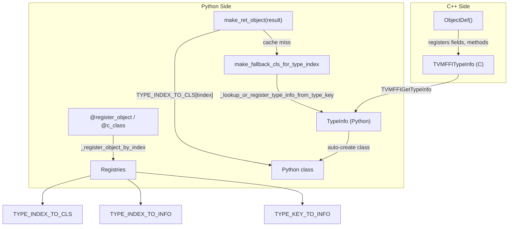

# FFI Python Type System (TypeInfo, Dispatch Tables, Auto-Proxy)

**TL;DR**.
- The Python-side type system provides `TypeInfo`, `TypeField`, and `TypeMethod` dataclasses that mirror C-level `TVMFFITypeInfo`/`TVMFFIFieldInfo`/`TVMFFIMethodInfo`, enabling pure-Python introspection of FFI-registered types.
- A triple-indexed registry (`TYPE_INDEX_TO_INFO` + `TYPE_KEY_TO_INFO` + `TYPE_CLS_TO_INFO`) plus a parallel `TYPE_INDEX_TO_CLS` list provide O(1) dispatch from type indices to Python classes, powering the `make_ret_object` hot path. `TYPE_CLS_TO_INFO` (6897a5f5) enables reverse lookup from Python class to TypeInfo.
- When a C++ object with no `@register_object` binding is returned to Python, `make_fallback_cls_for_type_index` auto-generates a fully functional proxy class with reflection-derived fields, methods, and parent chain -- replacing the old bare-`Object` fallback.
- Public introspection APIs: `get_registered_type_keys()` (8fcd9245) lists all registered type keys, `_lookup_type_attr()` (4edf4f30) accesses per-type attribute columns from Python.

## Problem Statement
### Background
- C++ objects returned to Python need to be wrapped in the correct Python class. The old system used a flat `OBJECT_TYPE` list (`type_index -> type`) and fell back to `Object` with a warning for unregistered types, losing all field/method access.
- Python had no way to introspect FFI type metadata (fields, methods, type hierarchy) at runtime without calling back into C.

### Solution
- `TypeInfo` wraps all per-type metadata in a Python dataclass: type_cls, type_index, type_key, fields, methods, parent_type_info, type_ancestors.
- `make_ret_object` looks up `TYPE_INDEX_TO_CLS[tindex]` (direct list index, zero Python attribute accesses on the hot path). On cache miss, `make_fallback_cls_for_type_index` recursively creates stub classes from reflection data.
- The `@register_object` decorator and `@c_class` decorator both populate the registries, converging on the same `TypeInfo`-based dispatch.

### Goals
- O(1) type dispatch on every FFI object return (the hottest Python-side path).
- Pure-Python introspection of C++ type metadata (fields, methods, hierarchy).
- Automatic proxy class creation for unregistered types (no lost functionality).
- Non-goal: supporting types without reflection registration (these still fall back to `Object`).

## Design



### Key Classes, Fields and Interfaces

```python
# --- Cython type info classes (type_info.pxi) ---

class FieldGetter:
    """Cython cdef class wrapping TVMFFIFieldGetter for direct byte-offset field read."""
    # cdef fields: getter (TVMFFIFieldGetter), offset (int64)
    def __call__(self, obj: Object) -> Any: ...
    # Interacts with: Object.chandle (byte-offset arithmetic)
    # Invariant: result.type_index initialized to kTVMFFINone before call

class FieldSetter:
    """Cython cdef class wrapping TVMFFIFieldSetter for direct byte-offset field write."""
    # cdef fields: setter (TVMFFIFieldSetter), offset (int64)
    def __call__(self, obj: Object, value: Any) -> None: ...
    # Interacts with: TVMFFIPyCallFieldSetter, TVMFFIPyArgSetterFactory_

@dataclasses.dataclass(eq=False)
class TypeField:
    """Description of a single reflected field on an FFI-backed type."""
    name: str
    doc: str | None
    size: int
    offset: int
    frozen: bool          # True when field lacks kTVMFFIFieldFlagBitMaskWritable
    metadata: dict[str, Any]   # Always has "type_schema" key; may have user keys (28fe3cc7)
    getter: FieldGetter
    setter: FieldSetter
    dataclass_field: Field | None = None  # Python-side default metadata for @c_class
    # Invariant: getter and setter are always non-None (asserted in __post_init__)
    # Invariant: metadata["type_schema"] is always present (set by ObjectDef.RegisterField)

    def as_property(self, cls: type) -> property: ...
    # Extension: generates a property with fget/fset, respects frozen flag
    # Interacts with: register_object -> _add_class_attrs, c_class decorator

@dataclasses.dataclass(eq=False)
class TypeMethod:
    """Description of a single reflected method on an FFI-backed type."""
    name: str
    doc: str | None
    func: object          # The underlying FFI Function object
    metadata: dict[str, Any]   # Always has "type_schema" key; may have user keys (28fe3cc7)
    is_static: bool       # True when flags & kTVMFFIFieldFlagBitMaskIsStaticMethod

    def as_callable(self, cls: type) -> Callable: ...
    # Creates a properly wrapped Python callable (instance or static)
    # Sets __module__, __name__, __qualname__, __doc__
    # Interacts with: _member_method_wrapper (in type_info.pxi)

@dataclasses.dataclass(eq=False)
class TypeInfo:
    """Aggregated type information for building a proxy class."""
    type_cls: type | None       # None for types not yet bound to a Python class
    type_index: int
    type_key: str
    type_ancestors: list[int]   # Ancestor type_index values
    fields: list[TypeField]
    methods: list[TypeMethod]
    parent_type_info: TypeInfo | None
    # Invariant: parent_type_info auto-resolved in __post_init__ from type_ancestors

    def __post_init__(self):
        """Auto-resolve parent_type_info from type_ancestors[-1]."""
        # Interacts with: _lookup_or_register_type_info_from_type_key
    # Extension: parent_type_info enables inheritance-aware introspection and auto-proxy creation

# --- TypeSchema (type_info.pxi, 28fe3cc7, dd4fb0ae) ---

@dataclasses.dataclass(repr=False)
class TypeSchema:
    """Structured parse of a TVM FFI JSON schema string."""
    origin: str                    # e.g. "Callable", "Array", "List", "Map", "Dict", "int", "str"
    args: tuple[TypeSchema, ...] = ()
    # NOTE (7786133): origin now preserves container identity:
    #   "ffi.Array" -> "Array", "ffi.List" -> "List",
    #   "ffi.Map" -> "Map", "ffi.Dict" -> "Dict"
    #   (was collapsing to "list"/"dict" before 7786133)
    # Interacts with: _TYPE_SCHEMA_ORIGIN_CONVERTER in type_info.pxi

    def __post_init__(self) -> None:
        # Normalizes unparameterized list -> list(Any), dict -> dict(Any, Any)
        ...

    def __repr__(self) -> str:
        return self.repr(ty_map=None)

    def repr(self, ty_map: Callable[[str], str] | None = None) -> str:
        """Render human-readable string, optionally remapping origin names."""
        # Extension: pass ty_map to customize for stub generation, docs, etc.
        ...

    def convert(self, value: object) -> CAny:
        """Convert value to match this schema, returning CAny owned value (2885cf8, 5f5ca5a).
        # Returns CAny (not Python object); call .to_py() to recover Python value.
        # For object types: dispatches through __ffi_convert__ C++ TypeAttr (5f5ca5a).
        # Failure raises TypeError (exception-based, not sentinel-based after 5f5ca5a).
        # Interacts with: _TypeConverter, __ffi_convert__ TypeAttr column, CAny
        """

    def try_convert(self, value: object) -> tuple[bool, CAny | str]:
        """Non-throwing conversion: returns (True, CAny) or (False, error_msg) (754f41d).
        # Interacts with: _type_convert_impl
        """

    def check_value(self, value: object) -> None:
        """Validate that value matches schema, raising TypeError on mismatch (754f41d)."""

    @staticmethod
    def from_json_obj(obj: dict[str, Any]) -> TypeSchema: ...
    @staticmethod
    def from_json_str(s: str) -> TypeSchema: ...
    # Invariant: "Variant" -> "Union", "Optional" -> "Optional", "ffi.Function" -> "Callable"
    # Interacts with: TypeField.metadata["type_schema"], TypeMethod.metadata["type_schema"]

# --- CAny Owned Value Wrapper (object.pxi, 2885cf8) ---

cdef class CAny:
    """Cython extension type owning a TVMFFIAny value with proper ref-counting (2885cf8)."""
    cdef TVMFFIAny cdata
    def __init__(self, value=None): ...
        # Packs value via TVMFFIPyPyObjectToFFIAny + TVMFFIAnyViewToOwnedAny
    def type_index(self) -> int: ...     # TVM FFI type index
    def to_py(self) -> object: ...       # Convert back to Python object
    # Invariant: owns the TVMFFIAny value; DecRef on dealloc for object types
    # Interacts with: TypeSchema.convert (returns CAny), TVMFFIPyArgSetterFactory_
    # Extension: enables zero-copy passing of pre-marshaled values to C functions

# --- Type Converter (type_converter.pxi, replaces type_check.pxi in 5f5ca5a) ---

cdef class _TypeConverter:
    """Dispatch node for type conversion with C function-pointer dispatch.
    # Each TypeSchema builds one _TypeConverter at construction time.
    # convert() returns CAny; failure raises TypeError (exception-based, not sentinel).
    # For Object types: dispatches through __ffi_convert__ C++ TypeAttr column (5f5ca5a).
    # Eager protocol normalization: __tvm_ffi_object__, __tvm_ffi_value__, ObjectConvertible.asobject()
    # Interacts with: TypeSchema._converter, __ffi_convert__ TypeAttr, CAny
    """
    subs: tuple  # sub-_TypeConverters for composite types
    # Extension: new origin types register converters by extending type_converter.pxi

cdef inline bint _is_object_instance(int32_t obj_tindex, int32_t target_tindex):
    """C-level isinstance check via TVMFFIGetTypeInfo ancestor chain (754f41d).
    # Zero Python overhead — walks C data structures directly.
    # Interacts with: TVMFFIGetTypeInfo, TVMFFITypeInfo.type_ancestors
    """

def get_global_func_metadata(name: str) -> dict[str, Any]: ...
    # Get metadata dict of a registered global function (always has "type_schema" key).
    # Delegates to C++ global 'ffi.GetGlobalFuncMetadata'.

# --- Registries (object.pxi module-level) ---

# TYPE_INDEX_TO_INFO: list[TypeInfo | None]  -- indexed by type_index
# TYPE_INDEX_TO_CLS: list[type | None]       -- cdef list, parallel to TYPE_INDEX_TO_INFO
#   Invariant: len(TYPE_INDEX_TO_CLS) == len(TYPE_INDEX_TO_INFO) at all times
# TYPE_KEY_TO_INFO: dict[str, TypeInfo]      -- indexed by type_key
# TYPE_CLS_TO_INFO: dict[type, TypeInfo]     -- reverse index: Python class -> TypeInfo (6897a5f5)
#   Invariant: populated alongside TYPE_INDEX_TO_CLS in _update_registry and _set_type_cls

# --- Registration functions (object.pxi) ---

def _register_object_by_index(type_index: int, type_cls: type) -> TypeInfo: ...
    # Populates TYPE_INDEX_TO_INFO, TYPE_INDEX_TO_CLS, and TYPE_KEY_TO_INFO
    # Interacts with: _type_info_create_from_type_key, _update_registry

def _lookup_or_register_type_info_from_type_key(type_key: str) -> TypeInfo: ...
    # Cache-on-first-access; creates TypeInfo with type_cls=None if not registered
    # Also registers into TYPE_INDEX_TO_INFO/CLS via _update_registry

def _set_type_cls(type_info: TypeInfo, type_cls: type) -> None: ...
    # Bind a Python class to an already-registered TypeInfo slot
    # Invariant: asserts type_info.type_cls is None before overwriting
    # Extension: enables deferred class registration (register TypeInfo first, bind later)

def _type_cls_to_type_info(type_cls: type) -> TypeInfo | None: ...
    # Reverse-lookup: given a Python class, return its TypeInfo or None
    # Interacts with: TYPE_CLS_TO_INFO registry (6897a5f5)

def _update_registry(type_index: int, type_key: str, type_info: TypeInfo,
                     type_cls: type | None) -> None: ...
    # Centralized update of all four registries (including TYPE_CLS_TO_INFO)

def _lookup_type_attr(type_index: int, attr_key: str) -> Any: ...
    # Look up a per-type attribute column by type index and key string (4edf4f30)
    # Interacts with: TVMFFIGetTypeAttrColumn (C API), TVMFFITypeAttrColumn.data[]
    # Returns None if column is NULL or type_index >= column.size

def get_registered_type_keys() -> Sequence[str]: ...
    # Get all type keys registered to TVM-FFI (8fcd9245)
    # Interacts with: global function "ffi.GetRegisteredTypeKeys", TypeTable
    # Extension: useful for stub generation, introspection tools, debugging

# --- Auto-proxy creation (object.pxi) ---

def make_fallback_cls_for_type_index(type_index: int) -> type:
    """Auto-create a Python proxy class for an unregistered C++ object type.
    Recursively creates parent classes if needed."""
    # 1. _lookup_or_register_type_info_from_type_key(type_key)
    # 2. If parent_type_info.type_cls is None, recurse for parent
    # 3. Create class inheriting from parent_type_info.type_cls
    # 4. Apply fields via TypeField.as_property, methods via TypeMethod.as_callable
    # 5. _set_type_cls(type_info, cls)
    # Invariant: each unregistered type triggers this slow path exactly once
    # Extension: override by calling register_object() before first return

# --- Hot-path dispatch (object.pxi) ---

def make_ret_object(result: TVMFFIAny) -> object:
    """Dispatch returned object to the correct Python class."""
    # 1. tindex = result.type_index (from C header)
    # 2. cls = TYPE_INDEX_TO_CLS[tindex]  (direct list index, zero attribute access)
    # 3. If cls is None: cls = make_fallback_cls_for_type_index(tindex)
    # 4. obj = cls.__new__(cls); obj.chandle = result.v_obj
    # Interacts with: Function.__call__ return path, PyNativeObject.__from_tvm_ffi_object__
```

### Contracts, Assumptions and Invariants
- **Registry lockstep**: `TYPE_INDEX_TO_CLS` and `TYPE_INDEX_TO_INFO` must always have the same length. Both are grown together in `_update_registry`. `TYPE_CLS_TO_INFO` is updated in the same function.
- **Registration ordering**: Built-in Cython classes are registered in `core.pyx` in strict base-before-derived order (Object, Error, DataType, Device, String, Bytes, Tensor, Function) to ensure `TypeInfo.parent_type_info` resolves correctly (6897a5f5).
- **One-time fallback**: `make_fallback_cls_for_type_index` creates a class exactly once per unregistered type_index. Subsequent returns reuse the cached `TYPE_INDEX_TO_CLS[tindex]` entry.
- **Parent-before-child**: Auto-proxy creation recurses to create parent classes before child classes. `parent_type_info.type_cls` must be non-None before creating the child.
- **TypeField/TypeMethod immutability**: Once created, TypeField and TypeMethod instances are not modified. Their `as_property`/`as_callable` methods create new Python descriptors.

### Extension Points
- **Deferred class registration**: `_set_type_cls` allows binding a Python class to a TypeInfo that was created without one (e.g., by `_lookup_or_register_type_info_from_type_key`). Used by `@c_class` and auto-proxy.
- **Custom proxy classes**: Users can call `@register_object` before any FFI returns to override the auto-generated proxy with a hand-written class.
- **TypeInfo introspection**: `_lookup_or_register_type_info_from_type_key(type_key)` gives pure-Python access to field/method metadata for any registered C++ type.

### Usage Examples

#### Introspecting a C++ type from Python
**Context**: A C++ type was registered with `ObjectDef<T>` but may or may not have a Python `@register_object` binding.
```python
from tvm_ffi.core import _lookup_or_register_type_info_from_type_key, TypeInfo

info: TypeInfo = _lookup_or_register_type_info_from_type_key("testing.TestCxxClassBase")
print(f"type_key={info.type_key}, type_index={info.type_index}")
for field in info.fields:
    print(f"  field {field.name}: frozen={field.frozen}, offset={field.offset}")
for method in info.methods:
    print(f"  method {method.name}: is_static={method.is_static}")
```

#### Auto-proxy for unregistered types
**Context**: A C++ function returns an object whose type has no `@register_object` Python binding.
```python
import tvm_ffi

# C++ defines TestUnregisteredObject with fields v1, v2 and methods
# but no @register_object in Python.
obj = tvm_ffi.testing.make_unregistered_object()
# Auto-generated proxy class created on first return:
assert type(obj).__name__ == "TestUnregisteredObject"
assert obj.v1 == 41          # inherited field
assert obj.v2 == 42          # own field
assert obj.get_v2_plus_two() == 44  # own method
```

#### TypeSchema type conversion (754f41d)
**Context**: Validating and converting Python values against FFI type schemas at runtime.
```python
from tvm_ffi.core import TypeSchema

schema = TypeSchema("Optional", (TypeSchema("int"),))
ok, val = schema.try_convert(42)     # (True, 42)
ok, err = schema.try_convert("bad")  # (False, "cannot convert str to int")
schema.check_value(None)             # OK (Optional allows None)
schema.convert(42)                   # returns 42
schema.convert("bad")                # raises TypeError
```

### Evolution Timeline
| Commit | Change | Significance |
|--------|--------|--------------|
| 53b2e00e | Introduced TypeInfo/TypeField/TypeMethod, TYPE_INDEX_TO_INFO/TYPE_KEY_TO_INFO | Foundation: Python-side type metadata |
| 035975a7 | Added TYPE_INDEX_TO_CLS parallel list, _set_type_cls | Perf: zero-attribute-access hot path |
| d68c8d8d | Fixed null-dereference in make_ret_object for unregistered types | Robustness |
| 98cb8af4 | Auto-proxy creation via make_fallback_cls_for_type_index, TypeMethod.as_callable, TypeInfo.type_ancestors | Feature: no more lost functionality for unregistered types |

## Implementation Notes
- `TYPE_INDEX_TO_CLS` is a Cython `cdef` list for maximum access speed on the hot path. The old path through `TYPE_INDEX_TO_INFO[tindex].type_cls` required one Python attribute access per return; the new path is a single list index.
- `make_fallback_cls_for_type_index` uses `type()` to dynamically create a class inheriting from the parent's class. It sets `__slots__ = ()`, `__tvm_ffi_type_info__`, `__doc__`, `__name__`, `__qualname__`, and applies all fields/methods from the TypeInfo.
- `_member_method_wrapper` was moved from `registry.py` to `type_info.pxi` (Cython) so that `TypeMethod.as_callable` can use it without a Python module import.

## Alternatives & Trade-offs
### Dual Registry (TYPE_INDEX_TO_INFO + TYPE_INDEX_TO_CLS) vs. Single
- Pros: Hot path avoids Python attribute access entirely (list index only). TypeInfo kept for introspection.
- Cons: Must keep two lists in lockstep. Denormalization adds invariant maintenance burden.
### Auto-Proxy vs. Warning + Fallback to Object
- Pros of auto-proxy: No lost functionality. Users can immediately access fields and methods. Matches expectation that C++ types are usable from Python.
- Cons: First return of each unregistered type incurs class creation cost. Auto-generated classes lack custom Python methods.

## Evidence
| Commit | Scope | Contribution |
|--------|-------|-------------|
| 53b2e00e | python/ffi-bindings, ffi/reflection | TypeInfo/TypeField/TypeMethod, dual registry |
| 035975a7 | python/ffi-bindings | TYPE_INDEX_TO_CLS, _set_type_cls |
| d68c8d8d | python/ffi-bindings | Fixed null-dereference for unregistered types |
| 98cb8af4 | python/ffi-bindings, ffi/c-api | Auto-proxy creation, TypeMethod.as_callable, type_ancestors |
| Plus 4 supporting commits (785e8ca1 .pyi stubs, c86235cd removed unused OBJECT_INDEX, 8e471b01 read-after-free fix, 000e1970 always_inline hints) |
| 28fe3cc7 | python/ffi-bindings, ffi/reflection | Added `metadata: dict[str, Any]` to TypeField/TypeMethod; added `TypeSchema` Python class; added `get_global_func_metadata` |
| dd4fb0ae | python/ffi-bindings | Added `TypeSchema.repr(ty_map)` for customizable rendering; normalized unparameterized list/dict defaults |
| 77861331 | python/ffi-bindings, python/stub-generation | `TypeSchema.origin` now preserves distinct container identity (Array/List/Map/Dict) via `_TYPE_SCHEMA_ORIGIN_CONVERTER` |
| 6897a5f5 | python/ffi-bindings | Added `TYPE_CLS_TO_INFO` reverse registry, `_type_cls_to_type_info()`, centralized registration ordering in `core.pyx` |
| 4edf4f30 | python/ffi-bindings, ffi/c-api | Exposed `_lookup_type_attr()` for Python-side TypeAttrColumn access |
| 8fcd9245 | ffi/object, python/ffi-bindings | Added `get_registered_type_keys()` API; registered `ffi.GetRegisteredTypeKeys` global function |
| 754f41d3 | python/ffi-bindings | `_TypeConverter` cdef class, `TypeSchema.convert`/`try_convert`/`check_value`, `_is_object_instance` |
| 2885cf8b | python/ffi-bindings | `CAny` owned-value wrapper; `TypeSchema.convert` returns `CAny` |
| 5f5ca5ab | ffi/reflection, python/ffi-bindings | Rewrite `type_check.pxi` -> `type_converter.pxi`; `__ffi_convert__` dispatch; exception-based errors |

## Related Design Docs & ADRs
- [0007-reflection.md](0007-reflection.md) -- C++ reflection system (TVMFFITypeInfo/FieldInfo/MethodInfo) that Python TypeInfo mirrors
- [0012-python-package.md](0012-python-package.md) -- Python package structure, register_object, TVMFFIPyCallManager
- [0003-object-system.md](0003-object-system.md) -- Object header layout and type hierarchy
- [0016-python-dataclasses.md](0016-python-dataclasses.md) -- @c_class decorator that builds on TypeInfo
