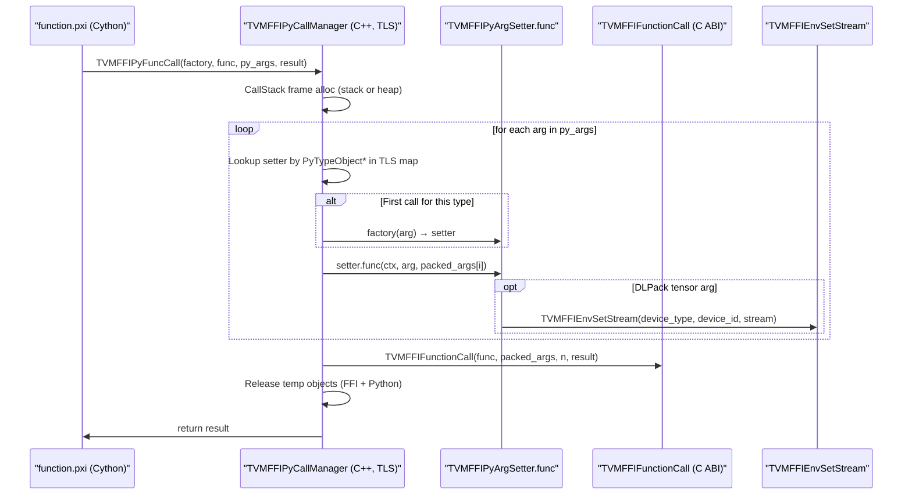

# Python FFI Call Dispatch — TVMFFIPyCallManager

**TL;DR**
- Replaces the Cython `make_args` if-chain with a C++-backed `TVMFFIPyCallManager` that caches a per-`PyTypeObject*` setter function, eliminating repeated `isinstance` checks on every FFI call.
- Three cooperating types: `TVMFFIPyCallContext` (per-call state: packed arg workspace, stream/device, temp object lifetimes), `TVMFFIPyArgSetter` (function-pointer + optional `DLPackExchangeAPI` struct for one Python type), and `TVMFFIPyArgSetterFactory` (builds a setter given an example argument).
- An optional PyTorch C extension (`_optional_torch_c_dlpack.py`) provides a unified `DLPackExchangeAPI` for `torch.Tensor`, replacing the former three separate function pointers (`DLPackFromPyObject`/`DLPackToPyObject`/`DLPackTensorAllocator`) with a single versioned struct (commit 22a78943).

## Problem Statement

### Background
Before commit 38d2cdaa, every call to a TVM FFI function from Python went through a Cython-level `make_args` function that used a long `if isinstance(a, int): ... elif isinstance(a, float): ...` chain to convert each argument from Python to `TVMFFIAny`. For hot paths (e.g., tensor operations called thousands of times per inference), this per-call isinstance chain was a significant overhead.

Additionally, DLPack exchange required calling back into Python's `__dlpack__` protocol, which is slower than a direct C-level conversion for framework types like `torch.Tensor`.

### Solution
Move argument dispatch to C++ (`tvm_ffi_python_helpers.h`, embedded in the Cython build). A thread-local `unordered_map<PyTypeObject*, TVMFFIPyArgSetter>` caches a setter per Python type. The first call for a given type invokes a `TVMFFIPyArgSetterFactory` to build the setter; subsequent calls perform only a hash-map lookup and a direct function-pointer call. DLPack exchange is accelerated via optionally-compiled C extensions registered on the type object.

### Goals
- O(1) dispatch after first call to a given Python type (no isinstance).
- Extensible: new Python types (e.g., framework tensors) register their own factory without modifying the core Cython.
- Optional fast path: the torch C extension is compiled lazily and loaded only when torch is present.
- GIL-release: FFI calls can release the GIL for long-running kernels (`func.release_gil` attribute).
- Non-goal: async invocation or coroutine support.

## Design

### Call Flow



### Key Classes, Fields and Interfaces

```python
# ─── python/tvm_ffi/cython/tvm_ffi_python_helpers.h ─────────────────────────

class TVMFFIPyCallStack:
    """Thread-local call stack storage for argument workspace and extra temporaries.
    Extracted from TVMFFIPyCallManager::CallStack inner class in commit 3dd7a817.
    # Invariant: args_stack is never reallocated after construction (capacity fixed at 4K page)
    # Invariant: extra_temp_py_objects_stack is unbounded (vector, grows as needed)
    # Interacts with: TVMFFIPyCallContext (borrows pointer on each call frame)
    """
    args_stack: List[TVMFFIAny]              # capacity = 4096 / sizeof(TVMFFIAny)
    args_stack_top: int
    extra_temp_py_objects_stack: List[PyObject*]  # overflow bucket for value-protocol temporaries


class TVMFFIPyCallContext:
    """Per-call RAII frame: allocates arg workspace from TVMFFIPyCallStack on construction,
    releases workspace and all temporary objects on destruction.
    CHANGED (commit 3dd7a817): promoted from plain struct to RAII class with constructor/destructor.
    """
    packed_args: TVMFFIAny*       # points into args_stack or heap (if overflow)
    device_type: int              # -1 if no device detected
    device_id: int
    stream: void*                 # captured stream handle for this call
    dlpack_c_exchange_api: const DLPackExchangeAPI*  # nullptr if no framework tensor in args
    # RENAMED (commit 539364726): c_dlpack_exchange_api → dlpack_c_exchange_api
    # Invariant: if non-null, managed_tensor_allocator (when present) is set as env tensor allocator
    # Interacts with: TVMFFIPyArgSetter (setter writes it), make_ret
    call_stack: TVMFFIPyCallStack*  # back-pointer to owning stack (NEW, commit 3dd7a817)
    temp_ffi_objects: void**      # TVMFFIObjectHandle[] to DecRef after call
    num_temp_ffi_objects: int
    temp_py_objects: void**       # PyObject*[] to Py_DecRef after call
    num_temp_py_objects: int
    # Invariant: destructor also drains extra_temp_py_objects_stack entries since construction
    # Interacts with: TVMFFIPyCallStack, TVMFFIEnvSetStream


class TVMFFIPyArgSetter:
    """Cached setter for one Python type → TVMFFIAny conversion.
    Built once by TVMFFIPyArgSetterFactory; reused for all subsequent calls with same type.
    """
    func: (ctx: TVMFFIPyCallContext*, arg: PyObject*, out: TVMFFIAny*) -> int
    # Returns 0 on success, -1 + PyErr on failure.
    dlpack_c_exchange_api: const DLPackExchangeAPI*  # nullable; points to class-level singleton struct
    # RENAMED (commit 539364726): c_dlpack_exchange_api → dlpack_c_exchange_api
    # Invariant: func(ctx, arg, out) writes a valid TVMFFIAny into out
    # Interacts with: TVMFFIPyCallContext (temp object tracking, stream detection)


# ─── DLPackExchangeAPI struct (dlpack/dlpack.h — DLPack proposal #175, commit 22a78943) ─────
class DLPackExchangeAPIHeader:
    version: DLPackVersion          # DLPACK_MAJOR/MINOR_VERSION at construction
    prev_api: DLPackExchangeAPIHeader*  # linked list for versioned API chain; nullptr for first

class DLPackExchangeAPI:
    """Unified struct bundling all DLPack exchange operations for one tensor framework.
    Stored as a class-level static singleton; exposed via __dlpack_c_exchange_api__ on the tensor CLASS.
    RENAMED (commit 539364726): attribute __c_dlpack_exchange_api__ → __dlpack_c_exchange_api__
    Replaces three separate typedefs: DLPackFromPyObject, DLPackToPyObject, DLPackTensorAllocator.
    """
    header: DLPackExchangeAPIHeader
    managed_tensor_allocator: Callable  # allocates managed tensor for output; was DLPackTensorAllocator
    managed_tensor_from_py_object_no_sync: Callable  # was DLPackFromPyObject (no longer fills env_stream)
    managed_tensor_to_py_object_no_sync: Callable    # was DLPackToPyObject
    dltensor_from_py_object_no_sync: Callable | None  # NEW: non-owning DLTensor view
    current_work_stream: Callable | None  # NEW: explicit stream query, replaces env_stream* out-param
    # Invariant: all function pointers may be nullptr (capability absent); callers must check
    # Registration on tensor class (commit 539364726 rename + commit 7f3bb771 capsule upgrade):
    #   BEFORE: TensorType.__c_dlpack_exchange_api__ = struct_ptr_as_int  (raw int)
    #   AFTER:  TensorType.__dlpack_c_exchange_api__ = PyCapsule("dlpack_exchange_api")
    # Backward compat: _check_and_update_dlpack_c_exchange_api() bridges old → new name on addon load.
    # Backward compat: _get_dlpack_exchange_api() in tensor.pxi accepts both int and PyCapsule.
    # Invariant: attribute is read from CLASS (type(arg)), not from the instance
    # Invariant: capsule name must be b"dlpack_exchange_api" when PyCapsule form is used
    # Interacts with: TVMFFIPyArgSetterFactory_ (reads on first call per type),
    #                 TVMFFIPyArgSetterDLPackExchangeAPI_ (the setter that uses it)

# PyCapsule extraction helper (commit 7f3bb771):
cdef int _get_dlpack_exchange_api(
    dlpack_exchange_api_obj: object,   # int or PyCapsule("dlpack_exchange_api")
    out_ptr: const DLPackExchangeAPI**,
) -> int:
    """Extract DLPackExchangeAPI* from either int (legacy) or PyCapsule form.
    # Invariant: capsule name b"dlpack_exchange_api" verified via PyCapsule_IsValid
    # Backward compat: int form still accepted; integer is reinterpret_cast to DLPackExchangeAPI*
    # Interacts with: pycapsule.PyCapsule_IsValid, pycapsule.PyCapsule_GetPointer
    """
    ...

# STREAM DETECTION CHANGE (commit 22a78943):
# BEFORE: DLPackFromPyObject(arg, &managed, &env_stream) — stream filled as out-param in conversion call
# AFTER:  managed_tensor_from_py_object_no_sync(arg, &managed)  # pure conversion, no stream
#         if device != CPU and first device seen:
#             current_work_stream(dev_type, dev_id, &stream)    # explicit stream query

# typedef int (*TVMFFIPyArgSetterFactory)(PyObject* arg, TVMFFIPyArgSetter* out)
# Given an example arg, produce a TVMFFIPyArgSetter valid for all objects of the same PyType.
# Invariant: factory is called at most once per distinct PyTypeObject*; result is cached.
#
# Dispatch priority in TVMFFIPyArgSetterFactory_ (checked in order):
# 1. isinstance(arg, Tensor/TensorView)            → TVMFFIPyArgSetterTensor_
# 2. isinstance(arg, ObjectRValueRef)              → TVMFFIPyArgSetterObjectRValueRef_
# 3. hasattr(type(arg), "__tvm_ffi_object__")      → TVMFFIPyArgSetterFFIObjectCompatible_  [commit 8873700a]
#    OLD: hasattr(type(arg), "__tvm_ffi_tensor__") → TVMFFIPyArgSetterFFITensorCompatible_  [commit 4bc89254]
# 4. hasattr(type(arg), "__dlpack_c_exchange_api__") → TVMFFIPyArgSetterDLPackExchangeAPI_ [commit 22a78943]
#    RENAMED (commit 539364726): __c_dlpack_exchange_api__ → __dlpack_c_exchange_api__
#    OLD: hasattr(arg, "__c_dlpack_from_pyobject__") (instance-level, not class-level)
# 5. hasattr(type(arg), "__cuda_stream__")         → TVMFFIPyArgSetterCUDAStream_           [commit b0537f04]
# 6. isinstance(arg, torch.Tensor)                 → TVMFFIPyArgSetterTorchFallback_
# 7. hasattr(arg_class, "__dlpack__")              → TVMFFIPyArgSetterDLPack_               [was: hasattr(arg, "__dlpack__")]
# 8. hasattr(arg, "__tvm_ffi_env_stream__")        → TVMFFIPyArgSetterEnvStream_
# 9. isinstance(arg, ctypes.c_void_p)              → TVMFFIPyArgSetterCVoidP_
# 10. hasattr(arg_class, "__tvm_ffi_opaque_ptr__") → TVMFFIPyArgSetterFFIOpaquePtrCompatible_ [commit 42e06128]
# 11. hasattr(arg_class, "__dlpack_data_type__")   → TVMFFIPyArgSetterDLPackDataTypeProtocol_ [commit 5e648f05]
#     → numpy.dtype check is separate and comes before this
# 12. hasattr(arg_class, "__dlpack_device__") AND NOT hasattr(arg_class, "__dlpack__")
#                                                  → TVMFFIPyArgSetterDLPackDeviceProtocol_  [commit 0f8bf9fc]
#     Invariant: __dlpack__ exclusion prevents tensor objects being misdispatched as devices
# 13. isinstance(arg, numbers.Integral)             → TVMFFIPyArgSetterIntegral_   [commit c1df05f]
#     Handles numeric ABCs like numpy.int64, custom int types via <long long> cast
# 14. isinstance(arg, numbers.Real)                 → TVMFFIPyArgSetterReal_       [commit c1df05f]
#     Handles numeric ABCs like numpy.float32, custom float types via <double> cast
# 15. hasattr(arg_class, "__tvm_ffi_value__")       → TVMFFIPyArgSetterFFIValueProtocol_  [commit 3dd7a817]
#     Calls arg.__tvm_ffi_value__() to obtain the actual FFI-compatible value;
#     pushes result to extra_temp_py_objects_stack; re-dispatches generically (recursive)
# 16. callable(arg)                                → TVMFFIPyArgSetterCallable_
# ... scalars, None, str, bytes, bool, int, float, int/float lists, Object subclasses ...
#
# Invariant: __cuda_stream__ checked BEFORE torch.Tensor and __dlpack__ because CUDA stream
#            objects may be subclasses of str, which would be misdispatched.
# Invariant: all checks on CLASS (type(arg)), not on the instance — consistent with DLPack exchange API.
# Invariant: __tvm_ffi_opaque_ptr__ checked AFTER ctypes.c_void_p, BEFORE callable fallback.
#
# Dtype arg setters (commit d77606a):
# TVMFFIPyArgSetterDTypeFromTorch_  — torch.dtype → DLDataType via TORCH_DTYPE_TO_DTYPE lookup
# TVMFFIPyArgSetterDTypeFromNumpy_  — numpy.dtype → DLDataType via NUMPY_DTYPE_TO_DTYPE lookup
# Both registered in TVMFFIPyArgSetterFactory_ so torch.dtype/numpy.dtype pass directly as FFI args.
# TORCH_DTYPE_TO_DTYPE / NUMPY_DTYPE_TO_DTYPE populated in dtype.pxi at import time.
# torch float8/float4 dtypes guarded behind hasattr(torch, ...) for torch < 2.8 (commits b03cc78, eb5492a).
# ml_dtypes >= 0.5 entries (int2, uint2, float8_e3m4, etc.) are conditionally registered behind
#   hasattr(ml_dtypes, "int2") guard (commit 9574e9d0). Core always-present dtypes (int4, uint4,
#   bfloat16, float8_e4m3*) remain unconditional.

# ─── New protocol setters (commit 4bc89254 / 8873700a / b0537f04) ─────────────

def TVMFFIPyArgSetterFFIObjectCompatible_(handle, ctx, py_arg, out) -> int:
    """Setter for objects that implement __tvm_ffi_object__() -> Object.
    OLD name: TVMFFIPyArgSetterFFITensorCompatible_ (committed 4bc89254 as __tvm_ffi_tensor__,
              generalized to any Object in commit 8873700a).
    """
    obj: Object = py_arg.__tvm_ffi_object__()  # was: __tvm_ffi_tensor__() returning Tensor only
    temp_chandle = obj.chandle
    out.type_index = TVMFFIObjectGetTypeIndex(temp_chandle)  # was: hardcoded kTVMFFITensor
    out.v_ptr = temp_chandle
    if Py_REFCNT(obj) == 1:
        # obj is temporary — IncRef and push to temp stack to keep alive during call
        TVMFFIObjectIncRef(temp_chandle)
        TVMFFIPyPushTempPyObject(ctx, temp_chandle)  # was: TVMFFIPyPushTempFFIObject
    # Interacts with: TVMFFIPyCallContext temp lifecycle, TVMFFIPyArgSetterFactory dispatch
    # Invariant: returned Object must have a valid chandle; any Object subclass is accepted

def TVMFFIPyArgSetterCUDAStream_(handle, ctx, py_arg, out) -> int:
    """Setter for objects implementing the CUDA stream protocol: __cuda_stream__() -> tuple[str, int]."""
    cu_stream_tuple = py_arg.__cuda_stream__()  # returns (type_str, stream_ptr_as_int)
    out.type_index = kTVMFFIOpaquePtr  # = 4
    out.v_ptr = <void*>cu_stream_tuple[1]  # the stream handle as void*
    # Invariant: caller must keep the stream alive; FFI does NOT take ownership
    # Interacts with: kTVMFFIOpaquePtr (opaque pointer type), TypeTraits<void*>

def TVMFFIPyArgSetterFFIOpaquePtrCompatible_(handle, ctx, py_arg, out) -> int:
    """Setter for objects implementing __tvm_ffi_opaque_ptr__() -> int. [commit 42e06128]
    Any Python object exposing this duck-typed protocol is marshalled as kTVMFFIOpaquePtr (4).
    """
    out.type_index = kTVMFFIOpaquePtr  # = 4
    out.v_ptr = <void*><long long>py_arg.__tvm_ffi_opaque_ptr__()
    # Invariant: returned int must be a valid C pointer value; no lifetime management by FFI
    # Invariant: checked AFTER ctypes.c_void_p, BEFORE callable fallback
    # Interacts with: TVMFFIPyArgSetterFactory_ dispatch, kTVMFFIOpaquePtr wire type
    # Extension: implement on DSL wrapper classes that hold opaque C struct pointers

def TVMFFIPyArgSetterDLPackDataTypeProtocol_(handle, ctx, py_arg, out) -> int:
    """Setter for objects implementing __dlpack_data_type__() -> tuple[int,int,int]. [commit 5e648f05]
    Converts to kTVMFFIDataType (5) by unpacking (type_code, bits, lanes).
    """
    dtype_tuple = py_arg.__dlpack_data_type__()  # (type_code, bits, lanes)
    out.type_index = kTVMFFIDataType  # = 5
    out.v_dtype = DLDataType(dtype_tuple[0], dtype_tuple[1], dtype_tuple[2])
    # Invariant: tuple must have exactly 3 ints
    # Interacts with: dtype.from_dlpack_data_type(), numpy.dtype setter (checked first)

def TVMFFIPyArgSetterDLPackDeviceProtocol_(handle, ctx, py_arg, out) -> int:
    """Setter for objects implementing __dlpack_device__() -> tuple[int,int]. [commit 0f8bf9fc]
    Only matched when object does NOT also have __dlpack__ (to avoid tensor misdispatch).
    """
    device_tuple = py_arg.__dlpack_device__()  # (device_type, device_index)
    out.type_index = kTVMFFIDevice  # = 6
    TVMFFIDLDeviceFromIntPair(device_tuple[0], device_tuple[1], &out.v_device)
    # Invariant: __dlpack__ exclusion — objects with __dlpack__ are tensors, not devices
    # Interacts with: TVMFFIDLDeviceFromIntPair C helper, kTVMFFIDevice wire type

# ─── Numeric ABC setters (commit c1df05f) ────────────────────────────────────

def TVMFFIPyArgSetterIntegral_(handle, ctx, py_arg, out) -> int:
    """Setter for numbers.Integral subclasses (e.g. numpy.int64, custom int types). [commit c1df05f]
    Uses <long long> Cython cast for correctness with ABC subclasses.
    """
    out.type_index = kTVMFFIInt
    out.v_int64 = <long long>py_arg
    # Invariant: handles any type registered with numbers.Integral ABC
    # Interacts with: TVMFFIPyCallManager setter cache, keyed on PyTypeObject*

def TVMFFIPyArgSetterReal_(handle, ctx, py_arg, out) -> int:
    """Setter for numbers.Real subclasses (e.g. numpy.float32, custom float types). [commit c1df05f]
    Uses <double> Cython cast.
    """
    out.type_index = kTVMFFIFloat
    out.v_float64 = <double>py_arg
    # Invariant: handles any type registered with numbers.Real ABC

# Also renamed in this batch: TVMFFIPyArgSetterFFIObjectCompatible_ → TVMFFIPyArgSetterFFIObjectProtocol_

# Module-level singletons (commit cfff30bd):
_DISPATCH_TYPE_KEEP_ALIVE: set
# Purpose: holds a strong Python reference to every type added to the dispatch map.
# Invariant: once a type is inserted it is NEVER removed.
# Invariant: populated before any cache lookup via TVMFFIPyArgSetterFactory_.
# Interacts with: TVMFFIPyArgSetterFactory_ (type inserted before caching setter)
# Note: prevents stale PyTypeObject* reuse when locally-defined classes are GC'd.

_DISPATCH_TYPE_KEEP_ALIVE_LOCK: threading.Lock
# Purpose: serializes writes to _DISPATCH_TYPE_KEEP_ALIVE.
# Invariant: must be held whenever mutating _DISPATCH_TYPE_KEEP_ALIVE.
# Note: anticipates free-threaded CPython (PEP 703); currently redundant under the GIL.


class TVMFFIPyCallManager:
    """Thread-local dispatch cache + stack allocator for FFI call dispatch.
    One instance per OS thread; never shared across threads.
    All hot-path functions are marked TVM_FFI_INLINE (commit 000e197):
      [[gnu::always_inline]] on GCC/Clang, [[msvc::forceinline]] on MSVC.
      TVM_FFI_INLINE is defined locally in tvm_ffi_python_helpers.h with #ifndef guard
      so base_details.h definition wins when included.
    CHANGED (commit 3dd7a817): TVMFFIPyCallManager::CallStack inner class extracted to
    TVMFFIPyCallStack standalone struct; TVMFFIPyCallContext promoted to RAII class.
    """
    # TLS singleton:
    @staticmethod
    def ThreadLocal() -> TVMFFIPyCallManager*: ...

    # Call stack (commit 3dd7a817: promoted from inline inner class to standalone type):
    call_stack_: TVMFFIPyCallStack  # owned; args_stack and extra_temp_py_objects_stack live here

    # Per-type cache (populated lazily on first call):
    dispatch_map: unordered_map[PyTypeObject*, TVMFFIPyArgSetter]

    # REMOVED (commit 3dd7a817): class CallStack(TVMFFIPyCallContext) inner class
    # Replaced by: TVMFFIPyCallStack standalone struct + TVMFFIPyCallContext RAII constructor
    # The TVMFFIPyCallContext constructor now takes TVMFFIPyCallStack* and allocates the frame.

    def Call(
        setter_factory: TVMFFIPyArgSetterFactory,
        func_handle: void*,
        py_arg_tuple: tuple,
        result: TVMFFIAny*,
        c_api_ret_code: int*,
        release_gil: bool = True,
    ) -> int:
        # 1. Alloc CallStack frame (stack-inline or heap)
        # 2. For each arg: lookup/build setter in dispatch_map; call setter.func
        # 3. Optionally release GIL (if release_gil=True)
        # 4. Call TVMFFIFunctionCall(func_handle, packed_args, n, result)
        # 5. Re-acquire GIL; release temps; return 0/-1
        # Interacts with: TVMFFIFunctionCall (C ABI), TVMFFIEnvSetStream (stream injection)

    def SetField(factory, field_setter, field_ptr, py_arg, c_api_ret_code) -> int: ...
    def PyObjectToFFIAny(factory, py_arg, out, c_api_ret_code) -> int: ...


# ─── Free functions called from Cython (function.pxi) ────────────────────────

def TVMFFIPyFuncCall(
    setter_factory: TVMFFIPyArgSetterFactory,
    func_handle: void*,
    py_arg_tuple: tuple,
    result: TVMFFIAny*,
    c_api_ret_code: int*,
) -> int:
    """Main entry point replacing make_args + TVMFFIFunctionCall in Cython FuncCall()."""
    # Interacts with: TVMFFIPyCallManager.Call()

def TVMFFIPyCallFieldSetter(factory, field_setter, field_ptr, py_arg, c_api_ret_code) -> int: ...
def TVMFFIPyPyObjectToFFIAny(factory, py_arg, out, c_api_ret_code) -> int: ...
def TVMFFIPyGetDispatchMapSize() -> int: ...
    # Returns number of distinct Python types in the TLS dispatch cache (for debugging)

# Helpers for setters to push temporaries into the current call context:
def TVMFFIPyPushTempFFIObject(ctx: TVMFFIPyCallContext*, arg: TVMFFIObjectHandle) -> None: ...
    # Invariant: called only during setter.func execution within active CallStack
def TVMFFIPyPushTempPyObject(ctx: TVMFFIPyCallContext*, arg: PyObject*) -> None: ...

# ─── __tvm_ffi_value__ protocol (commit 3dd7a817) ─────────────────────────────

cdef int TVMFFIPyArgSetterFFIValueProtocol_(
    handle: TVMFFIPyArgSetter*,
    ctx: TVMFFIPyCallContext*,
    py_arg: PyObject*,
    out: TVMFFIAny*,
) -> int:
    """Setter for classes that implement __tvm_ffi_value__().
    Calls arg.__tvm_ffi_value__() to obtain an FFI-compatible value;
    pushes the result to extra_temp_py_objects_stack so its refcount is managed;
    then re-dispatches via TVMFFIPySetArgumentGenericDispatcher (recursive).

    # Invariant: result of __tvm_ffi_value__() must itself be FFI-convertible
    # Invariant: nested __tvm_ffi_value__ chains are supported (recursive generic dispatch)
    # Invariant: result lifetime managed by extra_temp_py_objects_stack until frame destructor
    # Interacts with: TVMFFIPyPushExtraTempPyObject, TVMFFIPySetArgumentGenericDispatcher
    # Extension: implement __tvm_ffi_value__ on any Python wrapper to make it passable as FFI arg
    """

def TVMFFIPyPushExtraTempPyObject(ctx: TVMFFIPyCallContext*, arg: PyObject*) -> None:
    """Push a Python object into the extra temporaries overflow bucket.
    # Invariant: must only be called during a live TVMFFIPyCallContext frame
    # Interacts with: TVMFFIPyCallStack.extra_temp_py_objects_stack, Py_IncRef/Py_DecRef
    """

def TVMFFIPySetArgumentGenericDispatcher(
    setter_factory: TVMFFIPyArgSetterFactory,
    ctx: TVMFFIPyCallContext*,
    py_arg_tvm_ffi_value: PyObject*,
    out: TVMFFIAny*,
) -> int:
    """Re-invoke the generic dispatch on an already-unwrapped value.
    # Used by TVMFFIPyArgSetterFFIValueProtocol_ after calling __tvm_ffi_value__()
    # Delegates to TVMFFIPyCallManager::ThreadLocal()->SetArgument()
    # Invariant: py_arg_tvm_ffi_value is the result of __tvm_ffi_value__(); caller owns lifetime
    """
```

### Optional Torch C Extension (`_optional_torch_c_dlpack`)

```python
# python/tvm_ffi/_optional_torch_c_dlpack.py
def load_torch_c_dlpack_extension() -> Any | None:
    """Compile and load a C++ extension that registers fast DLPack converters on torch.Tensor.
    Call once at startup when torch is available.
    Compilation is CUDA-conditional: adds -DBUILD_WITH_CUDA and cuda include paths only when
    torch.cuda.is_available(). Extension name: "c_dlpack" (was "to_dlpack" before 4dee97f1b647).

    Returns None early in two cases (commit 33738534):
    1. torch is not importable — no compilation attempted.
    2. torch.Tensor already has __dlpack_c_exchange_api__ (newer PyTorch provides it natively).
    This forward-compatibility guard avoids redundant JIT compilation on newer PyTorch versions.
    RENAMED (commit 539364726): checks and sets __dlpack_c_exchange_api__ (was __c_dlpack_exchange_api__).
    Backward compat via _check_and_update_dlpack_c_exchange_api(): if old name found, copies to new name.
    """
    # Early exits:
    #   if import torch fails: return None
    #   if _check_and_update_dlpack_c_exchange_api(torch.Tensor): return None  # native or upgraded
    # Registers on torch.Tensor's CLASS object (not instance):
    #   torch.Tensor.__dlpack_c_exchange_api__ = PyCapsule("dlpack_exchange_api", TorchDLPackExchangeAPI::Global())
    # OLD (pre-22a78943): registered three separate attrs:
    #   __c_dlpack_from_pyobject__, __c_dlpack_to_pyobject__, __c_dlpack_tensor_allocator__
    # Interacts with: TVMFFIPyArgSetterFactory (reads __c_dlpack_exchange_api__ from CLASS)
    # Invariant: idempotent — safe to call multiple times

class TorchDLPackExchangeAPI(DLPackExchangeAPI):
    """C++ singleton; populates all five DLPackExchangeAPI function pointers for torch.Tensor."""
    # managed_tensor_from_py_object_no_sync → TorchDLPackManagedTensorFromPyObjectNoSync
    # managed_tensor_to_py_object_no_sync   → TorchDLPackManagedTensorToPyObjectNoSync
    # managed_tensor_allocator              → TorchDLPackManagedTensorAllocator
    # dltensor_from_py_object_no_sync       → TorchDLPackDLTensorFromPyObjectNoSync (new, non-owning)
    # current_work_stream                   → TorchDLPackCurrentWorkStream (extracted from DLPackFromPyObject)

# After load_torch_c_dlpack_extension():
# - torch.Tensor args use TorchDLPackExchangeAPI (C-level) via __c_dlpack_exchange_api__ on class
# - FFI return value Tensors are auto-converted to torch.Tensor via managed_tensor_to_py_object_no_sync
# - Stream is detected via current_work_stream (not via env_stream* out-param as before)
```

### `func.release_gil` Attribute

```python
# Set on any tvm_ffi.Function object:
func: tvm_ffi.Function = tvm_ffi.get_global_func("some.kernel")
func.release_gil = False  # default is True for all functions

# When release_gil=True (default):
#   TVMFFIPyCallManager::Call() releases the GIL before TVMFFIFunctionCall and re-acquires after.
#   Allows Python threads to run during kernel execution.
# When release_gil=False:
#   GIL is held throughout the kernel call.
#   Use for short-running functions where GIL acquire/release overhead dominates.
# Interacts with: TVMFFIPyCallManager::Call(), Cython FuncCall/FuncCall3
```

### Contracts, Assumptions and Invariants

- `TVMFFIPyCallManager` is thread-local; one instance per OS thread. Never access from another thread.
- `TVMFFIPyArgSetterFactory` is invoked at most once per `PyTypeObject*` per thread. The result is cached indefinitely. All types that enter the dispatch map are kept alive via `_DISPATCH_TYPE_KEEP_ALIVE` (commit cfff30bd) — stale-key reuse due to GC is actively prevented. Memory cost is O(num_distinct_types); acceptable since the number of distinct types dispatched through FFI is small in practice.
- `_DISPATCH_TYPE_KEEP_ALIVE: set` holds strong Python references to every type object ever added to the dispatch map. `_DISPATCH_TYPE_KEEP_ALIVE_LOCK: threading.Lock` serializes writes for future free-threaded CPython (PEP 703) compatibility. Once a type enters the set it is NEVER removed.
- `CallStack` has a fixed inline capacity (`TVMFFI_PY_CALL_STACK_SIZE`); exceeding it allocates a heap buffer. This bounds stack usage for typical call sizes.
- `DLPackExchangeAPI.managed_tensor_from_py_object_no_sync` must NOT fill a stream; stream is queried separately via `current_work_stream(dev_type, dev_id, &stream)` only for non-CPU tensors (commit 22a78943 separation).
- `TVMFFIPyPushTempFFIObject`/`TVMFFIPyPushTempPyObject` must be called only from within `setter.func` while a `CallStack` frame is active. Calling after frame destruction is UB.
- For nested container arguments (list/tuple of Tensor), the inner setters are called recursively. Temp object lifetime tracking ensures correct release order regardless of nesting depth.

### Failure Modes

- If `TVMFFIPyArgSetterFactory` returns -1 for an unrecognized type, the entire call fails with a `TypeError`. Known types: `int`, `float`, `bool`, `None`, `str`, `bytes`, `Object`/ObjectRef subclasses, `torch.Tensor` (if extension loaded), `numpy.ndarray`, objects with `__tvm_ffi_object__()`, `__cuda_stream__()`, `__c_dlpack_exchange_api__`, `__dlpack__`.
- If `DLPackFromPyObject` fails (e.g., tensor on unsupported device), the setter returns -1 and `PyErr` is set.
- GIL release happens unconditionally when `release_gil=True`, even for very short calls. Set `release_gil=False` on functions that execute in < a few microseconds to avoid overhead.

### Extension Points

- Register a new Python type: implement a `TVMFFIPyArgSetterFactory` that returns a `TVMFFIPyArgSetter` for objects of that type, then ensure the factory is passed to `TVMFFIPyFuncCall` / `TVMFFIPyCallFieldSetter`. The dispatch cache handles caching automatically.
- Enable fast DLPack for a new tensor framework: construct a `DLPackExchangeAPI` struct (one static singleton per type), set `TensorType.__c_dlpack_exchange_api__ = PyCapsule("dlpack_exchange_api")` on the CLASS (commit 7f3bb771; raw int still accepted for backward compat). The attribute must be set on the class, not the instance. Use `_create_dlpack_exchange_api_capsule(ptr_as_int)` from `_optional_torch_c_dlpack.py` to create the capsule from a raw pointer.
- Zero-copy FFI Object pass-through: implement `__tvm_ffi_object__(self) -> Object` on a wrapper class (commit 8873700a). Any `ffi.Object` subclass (not just `Tensor`) is accepted. Supersedes the former Tensor-specific `__tvm_ffi_tensor__` protocol.
- CUDA stream pass-through: implement `__cuda_stream__(self) -> tuple[str, int]` (commit b0537f04). Stream handle is passed as `kTVMFFIOpaquePtr` (void*); caller owns the stream lifetime.

### Usage Examples

#### End-to-end call path (C++ definition → Python dispatch)

```python
# C++ side: registered via GlobalDef (commit 7b813f8bc6a5 syntax):
# TVM_FFI_STATIC_INIT_BLOCK() {
#   reflection::GlobalDef().def("my.add_one", [](tvm::ffi::Tensor x, tvm::ffi::Tensor y) { ... });
# }

# Python side:
import tvm_ffi
import torch

# Optional: load fast torch C extension once at startup
tvm_ffi._optional_torch_c_dlpack.load_torch_c_dlpack_extension()

add_one = tvm_ffi.get_global_func("my.add_one")
# add_one.release_gil = True  (default — GIL released during kernel)

x = torch.tensor([1.0, 2.0, 3.0], device="cuda")
y = torch.empty_like(x)
add_one(x, y)
# TVMFFIPyFuncCall dispatches:
#   arg 0: lookup torch.Tensor setter → TorchDLPackFromPyObject (C fast path)
#   arg 1: same setter reused (same PyTypeObject*)
#   releases GIL → TVMFFIFunctionCall → re-acquires GIL
#   releases temp DLManagedTensorVersioned objects
```

#### Inspecting the dispatch cache size

```python
# Internal debugging (Cython-accessible):
from tvm_ffi import core
size = core._TVMFFIPyGetDispatchMapSize()
print(f"Dispatch cache has {size} entries")
```

#### Enabling fast DLPack for a custom tensor type (DLPackExchangeAPI protocol)

```python
# Step 1: Define a C++ struct inheriting DLPackExchangeAPI (one singleton per type):
# struct MyExchangeAPI : public DLPackExchangeAPI {
#     MyExchangeAPI() {
#         header.version.major = DLPACK_MAJOR_VERSION;
#         header.version.minor = DLPACK_MINOR_VERSION;
#         header.prev_api = nullptr;
#         managed_tensor_from_py_object_no_sync = MyFromPyObject;  // no stream side-effect
#         managed_tensor_to_py_object_no_sync   = MyToPyObject;
#         managed_tensor_allocator              = MyAllocator;
#         current_work_stream                   = MyGetStream;    // separate stream query
#         dltensor_from_py_object_no_sync       = nullptr;        // optional
#     }
#     static const DLPackExchangeAPI* Global() { static MyExchangeAPI inst; return &inst; }
# };
# int64_t MyExchangeAPIPtr() { return (int64_t)MyExchangeAPI::Global(); }

# Step 2: Register on the Python class (once at startup):
setattr(MyTensor, "__c_dlpack_exchange_api__", my_ext.MyExchangeAPIPtr())
# TVMFFIPyArgSetterFactory detects __c_dlpack_exchange_api__ on type(arg) automatically.
```

#### Using the __tvm_ffi_object__ protocol for zero-copy Object pass-through

```python
import tvm_ffi

class CompactObject:
    """Any Python class wrapping a tvm_ffi.Object can pass through FFI via __tvm_ffi_object__."""
    def __init__(self, backend_obj):
        self.backend_obj = backend_obj

    def __tvm_ffi_object__(self):
        return self.backend_obj   # must be a tvm_ffi.Object (any subclass, including Tensor)

x = tvm_ffi.convert([])          # x is a tvm_ffi.Array (Object subclass)
y = CompactObject(x)
test_echo = tvm_ffi.get_global_func("testing.echo")
z = test_echo(y)  # TVMFFIPyArgSetterFFIObjectCompatible_ dispatches; z.__chandle__() == x.__chandle__()
```

#### Using the __cuda_stream__ protocol

```python
import ctypes, tvm_ffi

class MyDummyStream:
    def __init__(self, stream: int):
        self.stream = stream

    def __cuda_stream__(self) -> tuple[str, int]:
        return ("cuda", self.stream)

stream = MyDummyStream(1)
echo = tvm_ffi.get_global_func("testing.echo")
y = echo(stream)
# → dispatched via TVMFFIPyArgSetterCUDAStream_; out.type_index = kTVMFFIOpaquePtr, out.v_ptr = (void*)1
assert isinstance(y, ctypes.c_void_p) and y.value == 1
```

#### Using the __tvm_ffi_value__ protocol for transparent domain-object dispatch (commit 3dd7a817)

**Context**: wrapping domain objects (NamedTuples, dataclasses, custom containers) so they pass through FFI without explicit unwrapping at every call site.

```python
import tvm_ffi

class ValueProtocol:
    """Any class implementing __tvm_ffi_value__ is passable directly as an FFI argument."""
    def __init__(self, value):
        self.value = value

    def __tvm_ffi_value__(self):
        return self.value  # must itself be FFI-compatible (int, list, Object, etc.)

fecho = tvm_ffi.get_global_func("testing.echo")
assert fecho(ValueProtocol(10)) == 10
assert tuple(fecho(ValueProtocol([1, 2, 3]))) == (1, 2, 3)

# Nested chains are supported — recursive generic dispatch unwraps automatically:
nested = ValueProtocol(ValueProtocol(ValueProtocol(10)))
assert fecho(nested) == 10

# Dispatch trace:
# TVMFFIPyArgSetterFactory_ → hasattr(ValueProtocol, "__tvm_ffi_value__") → True
# → TVMFFIPyArgSetterFFIValueProtocol_ setter cached for ValueProtocol type
# On call: arg.__tvm_ffi_value__() → result pushed to extra_temp_py_objects_stack
#          → TVMFFIPySetArgumentGenericDispatcher re-dispatches result generically
#          → result's lifetime managed by TVMFFIPyCallContext destructor
```

## Implementation Notes

- `tvm_ffi_python_helpers.h` is a C++ header (not a `.cc` file) that is `#include`'d by `core.pyx` at Cython build time. It is not a standalone compilation unit. This places it adjacent to the Cython extension without requiring a separate CMake target.
- The dispatch map is `std::unordered_map<PyTypeObject*, TVMFFIPyArgSetter>`. `PyTypeObject*` is used as the key because it is unique per Python type object and stable for the lifetime of the type (not the instance). Types created in a tight loop (e.g., anonymous classes) could cause cache growth but this is not a practical concern.
- DLPack type names changed: `DLPackPyObjectExporter` → `DLPackFromPyObject` → replaced by `DLPackExchangeAPI.managed_tensor_from_py_object_no_sync` (commits 4dee97f1, 22a78943). Field names in `TVMFFIPyArgSetter`/`TVMFFIPyCallContext`: `c_dlpack_exporter` → `c_dlpack_from_pyobject` → `c_dlpack_exchange_api`.
- `TVMFFIPyArgSetterDLPackCExporter_` renamed to `TVMFFIPyArgSetterDLPackExchangeAPI_` (commit 22a78943); setter now reads the class attribute `__c_dlpack_exchange_api__` (integer pointer) and stores it in `TVMFFIPyArgSetter.c_dlpack_exchange_api`.
- `__tvm_ffi_tensor__` protocol (commit 4bc89254) was immediately generalized to `__tvm_ffi_object__` (commit 8873700a) and the setter renamed from `TVMFFIPyArgSetterFFITensorCompatible_` to `TVMFFIPyArgSetterFFIObjectCompatible_`. The generalization changed the type index from hardcoded `kTVMFFITensor` to a dynamic `TVMFFIObjectGetTypeIndex(chandle)` call.

## Alternatives & Trade-offs

### Alternative A: Pure-Python dispatch (pre-commit 38d2cdaa)
- Pros: No C++ header dependency; easy to debug.
- Cons: `isinstance` checked on every call for every arg; significant overhead on hot paths with many small calls.

### Alternative B: Python singledispatch registry
- Pros: Standard Python mechanism; extensible.
- Cons: Still a Python-level dict lookup + function call per arg; GIL must be held for dict access; no way to carry per-call state (stream, temp objects) without thread-locals.

### Decision Record: C++ Header vs. Separate Shared Library

**Decision**: Implement dispatch as a C++ header (`tvm_ffi_python_helpers.h`) included in the Cython build rather than a separate shared library.

**Drivers**: (1) Must share `PyTypeObject*` identity with the Cython extension's Python interpreter instance — a separate `.so` would have a separate copy of the map. (2) Template/inline functions for argsetters must be in a single compilation unit with Cython's `cdef extern` declarations. (3) Adding a separate library would complicate the wheel layout with no benefit.

**Alternatives considered**:
- Separate `tvm_ffi_helpers.so`: Rejected — separate address space means separate TLS dispatch map; any type registered from Cython would not be visible.
- Pure Python dict (`PyObject* type -> setter_fn`): Rejected — see Alternative A/B above.

**Consequences**: Changes to `tvm_ffi_python_helpers.h` require recompiling the Cython extension. The header is tightly coupled to `function.pxi` and `tensor.pxi`; the API surface of the free functions (`TVMFFIPyFuncCall`, etc.) is effectively the Cython↔C++ contract.

## Related Design Docs & ADRs
- `.knowledge/design-records/0001-c-abi.md` — `TVMFFIFunctionCall`, `TVMFFIAny`, `TVMFFISafeCallType`
- `.knowledge/design-records/0012-env-api.md` — `TVMFFIEnvSetStream`, `TVMFFIEnvSetTensorAllocator`, `DLPackTensorAllocator`; `__tvm_ffi_env_stream__` protocol
- `.knowledge/design-records/0013-python-package.md` — Python package Cython architecture; `function.pxi` call path
- `.knowledge/design-records/0007-containers.md` — `Tensor`/DLPack types used as arg/return values

## Evidence Matrix

| Commit | Contribution |
|--------|-------------|
| 38d2cdaa | Introduces TVMFFIPyCallManager, TVMFFIPyCallContext, TVMFFIPyArgSetter, tvm_ffi_python_helpers.h; replaces make_args if-chain |
| f81ab9c25ae4 | Adds DLPackTensorAllocator, DLPackFromPyObject/ToPyObject typedefs; _optional_torch_c_dlpack.py; func.release_gil |
| cfff30bd | Adds _DISPATCH_TYPE_KEEP_ALIVE + lock; prevents stale PyTypeObject* cache slot reuse on GC'd types |
| 22a78943 | Replaces three DLPack ptrs with DLPackExchangeAPI struct; stream detection via current_work_stream; TVMFFIPyCallContext/ArgSetter consolidated to c_dlpack_exchange_api |
| 4bc89254 | Adds __tvm_ffi_tensor__ protocol + TVMFFIPyArgSetterFFITensorCompatible_ (temp lifetime guard) |
| 8873700a | Renames __tvm_ffi_tensor__ → __tvm_ffi_object__ (generalized to any Object); setter uses dynamic type index |
| b0537f04 | Adds __cuda_stream__ protocol + TVMFFIPyArgSetterCUDAStream_; fixes __dlpack__ instance→class check |
| 80bd4d83 | Polyfills __cuda_stream__ on torch.cuda.Stream for older PyTorch versions |
| c1df05f | Adds TVMFFIPyArgSetterIntegral_/TVMFFIPyArgSetterReal_ for numbers.Integral/Real ABC dispatch |
| 6c85e56 | CUstream compat path: ctypes.c_void_p extraction for cuda.bindings.driver.CUstream |
| 7f3f872 | from_dlpack prefers DLPackExchangeAPI over __dlpack__ protocol |
| 7f3bb771 | __c_dlpack_exchange_api__ upgraded to PyCapsule("dlpack_exchange_api"); _get_dlpack_exchange_api backward-compat helper; _create_dlpack_exchange_api_capsule for old int-form addons |
| plus 2 supporting commits | db987299f74a (__tvm_ffi_env_stream__ protocol), 4dee97f1b647 (DLPack type rename) |
