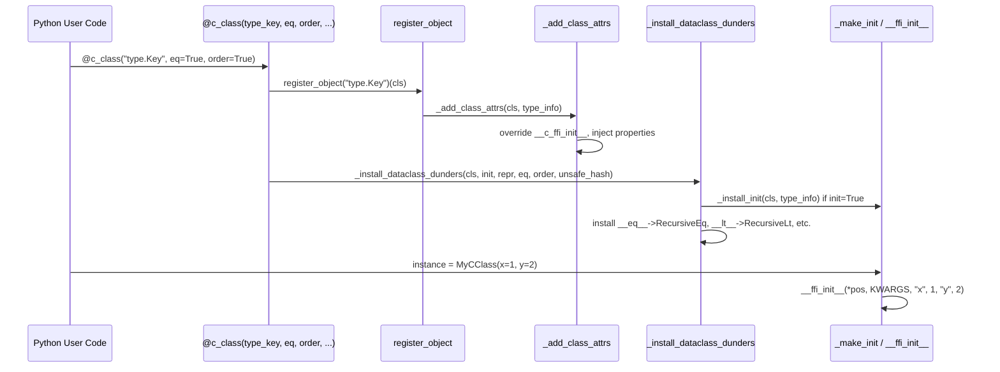

# FFI Python Dataclasses (`@c_class`)

**TL;DR**.
- `@c_class(type_key, *, init, repr, eq, order, unsafe_hash)` is a `@dataclass_transform`-decorated wrapper around `register_object(type_key)` that installs structural dunders from C++ recursive operations (e5f3af7). With `eq=True`, `__eq__`/`__ne__` delegate to `RecursiveEq`; `order=True` installs `__lt__`/`__le__`/`__gt__`/`__ge__` via `RecursiveLt`/`Le`/`Gt`/`Ge`; `unsafe_hash=True` installs `__hash__` via `RecursiveHash`; `repr=True` uses `ReprPrint`; `init=True` generates `__init__` from C++ reflection.
- `Object.__ffi_init__()` is the canonical Python method for invoking C++ constructors. `_make_init` in `registry.py` generates a Python `__init__` with proper positional/keyword-only signatures derived from C++ reflection metadata, using the KWARGS calling convention (b1abaeac). `register_object` now also calls `_install_init` universally (6973d22), so all FFI-registered objects get a proper `__init__`.
- Classes must explicitly inherit from `Object`. User-defined dunders in the class body are never overwritten by the decorator.

## Problem Statement
### Background
- C++ types registered with `ObjectDef<T>` have fields and constructors visible through reflection. Previously (v1), Python bindings used a complex `field()`/`Field`/`KW_ONLY` infrastructure with exec()-based `__init__` codegen to mirror Python `dataclasses` patterns. This duplicated C++ reflection metadata in Python and was fragile.

### Solution
- After b97ff1a, `@c_class(type_key)` is a thin pass-through to `register_object(type_key)`. All Python-side field descriptors, default factories, and kw_only logic have been removed. C++ reflection is the single source of truth for field metadata.
- `Object.__ffi_init__(*args)` wraps `self.__init_handle_by_constructor__(type(self).__c_ffi_init__, *args)`, providing a clean API surface.
- `_add_class_attrs` always overrides `__c_ffi_init__` per type (not just when absent), preventing derived classes from inheriting a base-class constructor with the wrong field count.

### Goals
- Minimal decorator that registers Python classes against C++ type keys.
- `Object.__ffi_init__` as the canonical constructor path.
- Non-goal (before b1abaeac): Python-side defaults or keyword-only parameter control. After b1abaeac, defaults and keyword-only args are derived from C++ reflection metadata and wired via `_make_init`.

## Design



### Key Classes, Fields and Interfaces

```python
# --- python/tvm_ffi/dataclasses/c_class.py (simplified in b97ff1a) ---

@dataclass_transform(eq_default=False, order_default=False)
def c_class(
    type_key: str,
    *,
    init: bool = True,          # auto __init__ from C++ reflection via _make_init
    repr: bool = True,          # __repr__ via ReprPrint
    eq: bool = False,           # __eq__/__ne__ via RecursiveEq
    order: bool = False,        # __lt__/__le__/__gt__/__ge__ via RecursiveLt/Le/Gt/Ge
    unsafe_hash: bool = False,  # __hash__ via RecursiveHash (unsafe with mutable fields)
) -> Callable[[type], type]:
    """Register Python class against C++ type key and install structural dunders (e5f3af7).
    # Delegates to: register_object(type_key) + _install_dataclass_dunders
    # Interacts with: register_object, _install_dataclass_dunders, _make_init
    # Invariant: class must explicitly inherit from Object
    # Invariant: user-defined dunders in class body are never overwritten
    # Extension: @dataclass_transform enables IDE/type-checker support for field inference
    """
    ...

def _install_dataclass_dunders(cls, type_info, init, repr, eq, order, unsafe_hash) -> None:
    """Install structural dunders on a @c_class-decorated Python class (e5f3af7).
    # Calls: _install_init (if init=True)
    # Installs __repr__ -> ReprPrint (if repr=True and no user __repr__)
    # Installs __eq__/__ne__ -> RecursiveEq with _is_comparable guard (if eq=True)
    # Installs __lt__/__le__/__gt__/__ge__ -> RecursiveLt/Le/Gt/Ge (if order=True)
    # Installs __hash__ -> RecursiveHash (if unsafe_hash=True)
    # Interacts with: _ffi_api.RecursiveEq/Lt/Le/Gt/Ge/Hash, ReprPrint
    """

def _is_comparable(lhs: Any, rhs: Any) -> bool:
    """isinstance guard for __eq__/__lt__: returns NotImplemented for unrelated types."""
    # Interacts with: _install_dataclass_dunders
    # Invariant: prevents cross-type comparisons from returning True/False silently

# Re-introduced Field descriptor for Python-defined types (e3333e2):
class Field:
    """Descriptor for a field in a Python-defined TVM-FFI type (e3333e2).
    NOT for C++ types (those use C++ reflection metadata directly).
    Used by @py_class decorator to define fields on Python-defined FFI types."""
    name: str
    ty: TypeSchema          # type schema for conversion
    default: Any            # or MISSING sentinel
    default_factory: Callable  # or MISSING sentinel
    init: bool              # include in __init__
    kw_only: bool           # keyword-only in __init__
    repr: bool              # include in __repr__
    hash: bool              # include in RecursiveHash
    compare: bool           # include in RecursiveEq/Lt
    # Interacts with: TypeSchema.convert, py_class decorator
    # Invariant: default and default_factory are mutually exclusive
    # Extension: mirrors Python dataclasses.field() semantics

# REMOVED in b97ff1a for C++ types (was python/tvm_ffi/dataclasses/field.py, _utils.py):
# - field(default, init, kw_only) — old C++ proxy field()
# - Field descriptor class (old version for C++ classes)
# - KW_ONLY sentinel
# - MISSING sentinel
# - fill_dataclass_field(), type_info_to_cls(), _get_all_fields(), method_init()
# - exec()-based __init__ code generation
# All Python-side field infrastructure deleted. C++ reflection is single source of truth.

# --- python/tvm_ffi/registry.py — _add_class_attrs fix (b97ff1a) ---

def _add_class_attrs(type_cls: type, type_info: TypeInfo) -> None:
    """Inject FFI field properties and methods into a Python class.
    BEFORE b97ff1a: __c_ffi_init__ set only if not hasattr(type_cls, name)
        => derived class inherits base constructor (wrong field count)
    AFTER b97ff1a: __c_ffi_init__ always overridden per type
        => each type gets its own constructor matching its C++ field count.
    # Interacts with: register_object, c_class
    # Invariant: __c_ffi_init__ always fresh per type (same pattern as __ffi_shallow_copy__)
    """
    ...

# --- python/tvm_ffi/cython/object.pxi ---

class Object:
    def __ffi_init__(self, *args) -> None:
        """Call the C++ constructor registered as __ffi_init__ via reflection."""
        self.__init_handle_by_constructor__(type(self).__c_ffi_init__, *args)
        # Interacts with: __c_ffi_init__ (renamed from __ffi_init__ at registration)
        # Interacts with: __init_handle_by_constructor__ (existing Cython method)
```

### Contracts, Assumptions and Invariants
- **`__ffi_init__` / `__c_ffi_init__` rename**: C++ methods named `__ffi_init__` are always renamed to `__c_ffi_init__` on the Python class. `Object.__ffi_init__()` is the Python-side instance method that delegates to `__c_ffi_init__`. This prevents name collision.
- **Always-override `__c_ffi_init__`**: After b97ff1a, `_add_class_attrs` always overrides `__c_ffi_init__` for each type, even if already present from a parent class. This ensures each type's constructor matches its own C++ field count. Failure mode before this fix: derived class inheriting base constructor with fewer fields would crash or produce corrupt objects.
- **Explicit Object inheritance**: Classes decorated with `@c_class` must explicitly inherit from `Object` (or a subclass). Without this, the metaclass `_ObjectSlotsMeta` (49a5d71) will not inject `__slots__`.
- **KWARGS-based constructor (b1abaeac)**: After b1abaeac, `_make_init` generates a Python `__init__` that supports both positional and keyword-only arguments, derived from C++ reflection field metadata (`c_init`, `c_kw_only`, `c_has_default` on `TypeField`). The generated `__init__` packs args as `(*pos, KWARGS_SENTINEL, key, val, ...)` and delegates to `self.__ffi_init__()`. `inspect.Signature` is attached for introspection. This replaces the previous positional-only constructor.

### Extension Points
- **Custom `__init__`**: Users can define their own `__init__` that calls `self.__ffi_init__(...)` with transformed arguments. This is now the only way to add argument transformation or defaults.
- **Inheritance**: `@c_class`-decorated classes can inherit from other `@c_class` bases, mirroring C++ inheritance. Each derived type gets its own `__c_ffi_init__` override.
- **`py_class` decorator**: For Python-defined FFI dataclasses with richer Python-side features (defaults, keyword-only, structural equality), see the `py_class` system which was introduced separately from `c_class`.
- **Structural dunder opt-in**: `eq=True` enables `RecursiveEq`-based `__eq__`; `order=True` enables `RecursiveLt/Le/Gt/Ge`-based ordering; `unsafe_hash=True` enables `RecursiveHash`-based `__hash__`. These are opt-in to follow Python dataclass conventions.

### Usage Examples

#### `@c_class` with structural dunders (e5f3af7)
**Context**: Register a C++ type with structural equality, ordering, and hashing.
```python
from tvm_ffi.dataclasses import c_class
from tvm_ffi import Object

@c_class("my.Point", eq=True, unsafe_hash=True, order=True)
class Point(Object):
    x: float
    y: float

p1 = Point(1.0, 2.0)
p2 = Point(1.0, 2.0)
assert p1 == p2                     # RecursiveEq field-by-field
assert hash(p1) == hash(p2)         # RecursiveHash consistency
assert Point(0.0, 0.0) < p1         # RecursiveLt lexicographic
assert p1 != Point(3.0, 4.0)        # __ne__ from eq=True
# Unrelated type comparison returns NotImplemented (not False):
assert (p1 == "string") == False     # via NotImplemented -> False
```

#### Basic `@c_class` usage (after b97ff1a simplification)
**Context**: Register a Python class against a C++ type key.
```python
from tvm_ffi.dataclasses import c_class
from tvm_ffi import Object

@c_class("testing.TestCxxClassBase")
class TestCxxClassBase(Object):
    pass  # __init__ calls C++ constructor positionally via __c_ffi_init__

obj = TestCxxClassBase(1, 2)  # positional args in C++ field order
assert obj.v_i64 == 1
assert obj.v_i32 == 2

@c_class("testing.TestCxxClassDerived")
class TestCxxClassDerived(TestCxxClassBase):
    pass

obj = TestCxxClassDerived(1, 2, 3.0, 8.0)  # all fields positional
obj.v_f64 = 9.0  # property setter forwards to C++
```

#### Custom `__init__` with argument transformation
**Context**: Pre-process arguments before forwarding to C++.
```python
@c_class("testing.TestCxxClassBase")
class TestCxxClassBase(Object):
    def __init__(self, v_i64: int, v_i32: int) -> None:
        self.__ffi_init__(v_i64 + 1, v_i32 + 2)  # transform before C++ init
```

#### `__repr__` delegation to ffi.ReprPrint (b648c5d6)
**Context**: `__repr__` delegates to `ffi.ReprPrint`. Per-field exclusion uses C++ `Repr(false)` InfoTrait.
```python
@c_class("testing.TestCxxClassDerived")
class TestCxxClassDerived(TestCxxClassBase):
    pass

obj = TestCxxClassDerived(123, 456, 4.0, 8.0)
repr(obj)
# => "testing.TestCxxClassDerived(v_i64=123, v_i32=456, v_f64=4.0, v_f32=8.0)"
```

### Decision Record: Thin Pass-Through vs. Rich Python Descriptors
**Decision drivers**: Whether to maintain Python-side field descriptors duplicating C++ reflection metadata.

#### Alternative A: Rich Python-side descriptors (v1, removed in b97ff1a)
- Pros: Dataclass-like syntax with defaults, keyword-only parameters, selective constructor inclusion.
- Cons: Duplicated C++ reflection in Python (210 LOC `_utils.py` + 169 LOC `field.py` + 190 LOC `c_class.py`). Fragile: Python and C++ metadata could diverge. exec()-based codegen harder to debug.

#### Alternative B: Thin register_object wrapper (v2, chosen in b97ff1a)
- Pros: Single source of truth (C++ reflection). Dramatically simpler (~36 LOC). No metadata duplication. `_add_class_attrs` always overrides `__c_ffi_init__` per type, preventing constructor inheritance bugs.
- Cons: No Python-side defaults or keyword-only args from `c_class`. Users needing these features use `py_class` instead.

**Rationale**: The Python-side descriptor infrastructure was maintenance burden with little value since C++ reflection already provides field metadata. The `py_class` system (introduced separately) provides richer Python-side features for Python-defined types.

### Evolution Timeline
| Commit | Change | Significance |
|--------|--------|--------------|
| c01dadf3 | `reflection::init<T, Args...>`, `__ffi_init__` naming | C++ foundation for constructor registration |
| e98b94e1 | `@c_class` decorator, `field()`/`Field`, `Object.__ffi_init__()` | v1: rich descriptor system |
| daeb235a | Added `field(init=...)`, exec()-based code generation | v1: selective constructor inclusion |
| 3a5bf5e | Added `c_class(kw_only=...)`, `KW_ONLY` sentinel | v1: keyword-only params |
| b648c5d6 | Removed `repr` from c_class/field; __repr__ delegates to ffi.ReprPrint | Simplification: repr handled by C++ |
| b97ff1ae | **Breaking**: Removed field(), Field, KW_ONLY, MISSING, exec() codegen; c_class = register_object | v2: thin pass-through |
| 6b39efbf | C++ auto-init via ObjectDef destructor; lowercase reflection traits (`kw_only`, `init`, etc.) | v3: C++ auto-init foundation |
| b1abaeac | Python `_make_init`/`_make_init_signature` wires C++ __ffi_init__ to Python __init__ with KWARGS | v3: full Python __init__ from C++ reflection |
| e5f3af7b | `@c_class(eq, order, unsafe_hash, repr, init)` with `_install_dataclass_dunders`, `@dataclass_transform` | v4: structural dunder installation |
| 6973d225 | `register_object` calls `_install_init` universally; `InitFieldInfo` for stubgen | v4: universal __init__ wiring |

## Implementation Notes
- After b97ff1a, `c_class` is ~36 lines: it calls `register_object(type_key)` which triggers `_add_class_attrs` to inject field properties and `__c_ffi_init__`. The deleted `_utils.py` (210 LOC), `field.py` (169 LOC), and original `c_class.py` (190 LOC) are no longer needed.
- `_add_class_attrs` now always overrides `__c_ffi_init__` for each type. This is the same pattern used by `__ffi_shallow_copy__` -- unconditional per-type override prevents incorrect constructor inheritance from parent classes.

## Alternatives & Trade-offs
### @c_class (thin) vs. Manual @register_object
- Pros of @c_class: Slightly more readable intent. `kwargs` parameter reserved for future features.
- Cons: Marginal value over bare `@register_object(type_key)` -- the decorator is essentially a one-line alias.
### c_class vs. py_class
- `c_class`: For C++-defined types. Thin wrapper around `register_object`. No Python-side defaults or keyword-only args.
- `py_class`: For Python-defined FFI dataclasses. Supports defaults, structural equality/hashing, auto-generated `__ffi_init__`. Use `py_class` when Python-side features are needed.

## Evidence
| Commit | Scope | Contribution |
|--------|-------|-------------|
| c01dadf3 | ffi/reflection, python | `reflection::init<T>`, `__ffi_init__` convention |
| e98b94e1 | python/dataclasses, ffi/reflection | `@c_class`, `field()`, `Object.__ffi_init__()` (v1) |
| daeb235a | python/dataclasses, ffi/reflection | `field(init=...)`, exec()-based code generation (v1) |
| 3a5bf5e | python/dataclasses, ffi/reflection | `c_class(kw_only=...)`, `KW_ONLY` sentinel (v1) |
| b648c5d6 | python/dataclasses, ffi/extra | Removed `repr` from c_class/field; __repr__ delegates to ffi.ReprPrint |
| b97ff1ae | python/dataclasses, python/ffi-bindings | **Breaking**: removed field()/Field/KW_ONLY/MISSING/exec() codegen; c_class = register_object (v2) |
| 6b39efbf | ffi/reflection, ffi/c-api | C++ auto-init via ObjectDef destructor; lowercase traits; field flag bits 7-10 |
| b1abaeac | python/ffi-bindings, python/dataclasses | `_make_init`/`_make_init_signature` for KWARGS-based Python __init__ |
| e5f3af7b | python/dataclasses, python/ffi-bindings | `@c_class(eq, order, unsafe_hash)`, `_install_dataclass_dunders`, `@dataclass_transform` |
| 6973d225 | python/ffi-bindings, python/stub-generation | `register_object` universal `_install_init`; `InitFieldInfo` for stubgen |
| e3333e28 | ffi/reflection, python/dataclasses | Re-introduced `Field` descriptor for Python-defined types; `CreateEmptyObject`/__ffi_new__ fallback |

Plus 2 supporting commits: b5dd851f (field TypeVar fix), 40e9c833 (Field refactor for mypy), plus dad4c402 (regression tests).

## Related Design Docs & ADRs
- [0007-reflection.md](0007-reflection.md) -- C++ `ObjectDef<T>` that c_class reads from
- [0015-python-type-system.md](0015-python-type-system.md) -- TypeInfo/TypeField/TypeMethod that c_class consumes
- [0012-python-package.md](0012-python-package.md) -- Python package structure, register_object, Object base class
- [0023-repr-print.md](0023-repr-print.md) -- ffi.ReprPrint now handles all __repr__ (replacing c_class exec()-based codegen)
- [0024-dataclass-ops.md](0024-dataclass-ops.md) -- Auto-init system and KWARGS protocol
