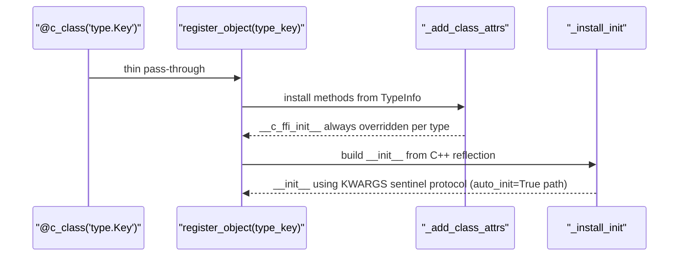

# Python Dataclass Proxy — `@c_class` Decorator

**TL;DR**
- As of commit b97ff1ae, `@c_class(type_key)` is a thin alias for `register_object(type_key)`. The decorated class must explicitly inherit from `Object`. All Python-side field descriptor infrastructure (`field()`, `Field`, `KW_ONLY`, `method_init`, `type_info_to_cls`, bijection validation) was deleted.
- The `__init__` is now installed by `_install_init` in `registry.py`, which delegates either to a C++ auto-generated `__ffi_init__` (when `auto_init=True` in method metadata) or to the raw C++ `__ffi_init__` directly.
- `_add_class_attrs` in `registry.py` always overrides `__c_ffi_init__` per type (not inherited), preventing the derived-class constructor masking bug.

## Problem Statement

### Background
Before the simplification (commit b97ff1ae), `@c_class` maintained a parallel Python-side field descriptor system (`field()`, `Field`, `KW_ONLY`, bijection invariant, `exec()`-based `__init__` codegen) that duplicated C++ reflection metadata. This caused several bugs — most importantly, derived classes could inherit a base class's `__c_ffi_init__` when `_add_class_attrs` skipped the override, leading to silent constructor argument mismatches.

With the C++ side gaining auto-init via `ObjectDef<T>` destructor (commit 6b39efbf) and a proper KWARGS sentinel protocol (commit b1abaeac), the Python-side descriptor machinery became redundant.

### Solution
`@c_class` delegates entirely to `register_object`, which invokes `_install_init` to build a Python `__init__` from C++ reflection metadata. Per-field control (init=False, kw_only, default_value) is now declared via C++ traits (`refl::init(false)`, `refl::kw_only(true)`, `refl::default_value`) rather than Python `field()` calls.

### Goals
- Declarative: `@c_class("type.Key")` is the only annotation needed.
- Explicit inheritance: decorated class must inherit from `Object` (or a subclass).
- C++ controls defaults, init-inclusion, kw-only — via reflection traits.
- Non-goal: runtime Python-side field addition beyond what C++ reflection declares.

## Design

### Decorator Pipeline (Current)



### Key Classes, Fields and Interfaces

```python
# python/tvm_ffi/dataclasses/c_class.py

def c_class(type_key: str, **kwargs: Any) -> Callable[[_T], _T]:
    """Thin wrapper: delegates directly to register_object(type_key).
    kwargs accepted for forward compatibility; currently unused.
    # Invariant: decorated class must explicitly inherit from Object (or subclass)
    # Invariant: __init__ is positional-only for legacy __ffi_init__ (non-auto-init)
    #            OR uses full keyword support when __ffi_init__ has auto_init=True
    # Interacts with: register_object, _add_class_attrs, _install_init
    # Extension: future keyword args can be wired without breaking callers
    """
    return register_object(type_key)

# --- REMOVED public API (deleted in commit b97ff1ae) ---
# field()             — Python-side field descriptor
# Field               — descriptor class
# KW_ONLY             — keyword-only sentinel annotation
# MISSING             — missing-value sentinel (was in dataclasses, now lives in core.pyx)
# c_class(init=...)   — removed parameter
# c_class(kw_only=...) — removed parameter

# --- registry.py ---

def _add_class_attrs(type_cls: type, type_info: TypeInfo) -> type:
    """Install methods from TypeInfo onto type_cls.
    # CRITICAL INVARIANT: __c_ffi_init__ is ALWAYS overridden per type (commit b97ff1ae).
    # Reason: derived classes must NOT inherit a base class's __c_ffi_init__ (different arg count).
    # Interacts with: Object.__ffi_init__ bridge (calls self.__c_ffi_init__)
    """
    for method in type_info.methods:
        name = method.name
        if name in ("__ffi_shallow_copy__", "__c_ffi_init__"):
            setattr(type_cls, name, method.as_callable(type_cls))  # always override
        elif not hasattr(type_cls, name):
            setattr(type_cls, name, method.as_callable(type_cls))
    # __tvm_ffi_type_info__ is now set BEFORE _add_class_attrs runs (commit b1abaeac ordering fix)

def _install_init(cls: type, *, enabled: bool) -> None:
    """Install __init__ from C++ reflection, or a TypeError guard if none exists.
    # No-op if '__init__' already in cls.__dict__
    # No-op if __tvm_ffi_type_info__ absent
    # Path 1 (auto_init=True):  __ffi_init__.metadata['auto_init'] True
    #   → setattr(__init__, _make_init(cls, type_info))
    #   → __init__ uses KWARGS sentinel protocol, full kw support via TypeField.c_init/c_kw_only
    # Path 2 (manual __ffi_init__): ffi_init_method exists but auto_init not True
    #   → setattr(__init__, cls.__ffi_init__)  # positional args
    # Path 3: no __ffi_init__, not PyNativeObject
    #   → install TypeError-raising guard with actionable message
    # Path 4: enabled=False → install TypeError-raising guard
    # Interacts with: _make_init(), TypeMethod.metadata['auto_init'], core.PyNativeObject
    """
    ...

def _make_init(type_cls: type, type_info: TypeInfo) -> Callable[..., None]:
    """Build Python __init__ delegating to __ffi_init__ via KWARGS sentinel protocol.
    Called only when __ffi_init__.metadata['auto_init'] == True.
    # Invariant: signature derived from TypeInfo.fields filtered by TypeField.c_init=True
    # Invariant: sets __signature__, __qualname__, __module__ on synthesized __init__
    # Interacts with: core.KWARGS sentinel, TypeField.c_init/c_kw_only/c_has_default
    """
    kwargs_obj = core.KWARGS
    def __init__(self: Any, *args: Any, **kwargs: Any) -> None:
        ffi_args: list[Any] = list(args)
        ffi_args.append(kwargs_obj)          # KWARGS sentinel signals start of kw section
        for key, val in kwargs.items():
            ffi_args.append(key)             # alternating key/value pairs
            ffi_args.append(val)
        self.__ffi_init__(*ffi_args)
    __init__.__signature__ = _make_init_signature(type_info)
    return __init__

def _make_init_signature(type_info: TypeInfo) -> inspect.Signature:
    """Build inspect.Signature by walking TypeInfo parent chain (parent-first).
    # Invariant: fields with c_init=False excluded
    # Invariant: required positional before optional positional; required kw before optional kw
    # Invariant: c_kw_only=True → KEYWORD_ONLY parameter kind
    # Interacts with: TypeInfo.parent_type_info chain, TypeField.c_init/c_kw_only/c_has_default
    """
    ...

# Bridge method on Object (cython/object.pxi)
class Object:
    def __ffi_init__(self, *args: Any) -> None:
        """Delegate to __c_ffi_init__ (type-specific C++ constructor).
        # Invariant: __c_ffi_init__ is always type-specific (never inherited, per _add_class_attrs fix)
        # Interacts with: Object.__init_handle_by_constructor__
        """
        self.__init_handle_by_constructor__(type(self).__c_ffi_init__, *args)
```

### Contracts, Assumptions and Invariants
- **Explicit `Object` inheritance** (post b97ff1ae): `@c_class`-decorated classes must inherit from `Object` (or a subclass). The old auto-rebase-to-Object via `type_info_to_cls` is gone.
- **`__c_ffi_init__` always-override**: `_add_class_attrs` always sets `__c_ffi_init__` per type, preventing derived classes from inheriting a base class constructor with a different argument count.
- **No bijection invariant**: `@c_class` no longer validates that Python annotations match C++ fields 1:1. Mismatches are caught at runtime when the C++ method is called.
- **`__tvm_ffi_type_info__` ordering**: since commit b1abaeac, `__tvm_ffi_type_info__` is set *before* `_add_class_attrs` runs (was after). This ensures method resolution sees the type info during installation.
- **`auto_init` path**: when C++ registers `ObjectDef<T>` without explicit `refl::init<Args...>()`, the destructor auto-generates `__ffi_init__` with `auto_init=True` metadata (commit 6b39efbf). This enables `_make_init` to build a typed `__init__` with full keyword support. When `refl::init<Args...>()` is explicit, `auto_init` may be True or absent depending on the registration.
- **Failure mode**: if `type_key` is not registered in C++ reflection, `register_object` raises at class decoration time. Mitigation: ensure `ObjectDef<T>()` runs in a `TVM_FFI_STATIC_INIT_BLOCK` before Python import.

### Extension Points
- **`__post_init__` hook**: `_install_init` calls `self.__post_init__()` after `self.__ffi_init__(...)` if the method is defined on the class. Allows Python-side validation or derived field computation.
- **Custom `__init__`**: if the class body defines `__init__`, `_install_init` does not generate one. The custom `__init__` can call `self.__ffi_init__(...)` manually.
- **C++ field traits**: per-field `init`, `kw_only`, and `default_value` are controlled via `refl::init(false)`, `refl::kw_only(true)`, `refl::default_value(...)` C++ traits — not Python `field()`.

### Usage Examples

#### Defining a C++ class and its Python proxy (current pattern)
**Context**: Cross-layer workflow with auto-generated `__init__` from C++ reflection.

```cpp
// C++ side: use ObjectDef without explicit refl::init<> — destructor auto-generates __ffi_init__
TVM_FFI_STATIC_INIT_BLOCK({
    namespace refl = tvm::ffi::reflection;
    refl::ObjectDef<MyNodeObj>()
        .def_rw("value",     &MyNodeObj::value)
        .def_rw("tag",       &MyNodeObj::tag,   refl::kw_only(true))
        .def_rw("cache_key", &MyNodeObj::cache_key,
                refl::init(false), refl::default_value(-1));
    // ObjectDef destructor fires: RegisterAutoInit(type_index_)
    // → registers __ffi_init__ with auto_init=True metadata
});
```

```python
# Python: @c_class delegates to register_object; _install_init builds __init__
from tvm_ffi.dataclasses import c_class
from tvm_ffi.core import Object

@c_class("mylib.MyNode")
class MyNode(Object):
    value: int
    tag: str
    cache_key: int
    # __init__(self, value: int, *, tag: str) synthesized from C++ reflection
    # cache_key excluded (refl::init(false)); kw_only for tag

node = MyNode(42, tag="hello")   # value=42, tag="hello", cache_key=-1 (C++ default)
assert node.value == 42
assert node.tag == "hello"
assert node.cache_key == -1
```

#### Derived class — inherited constructor masking bug (before/after)
**Context**: Shows why `_add_class_attrs` must always override `__c_ffi_init__`.

```python
# BEFORE commit b97ff1ae (bug):
# DerivedClass inherits Base.__c_ffi_init__ → wrong field count → silent corruption
# hasattr(DerivedClass, "__c_ffi_init__") is True (inherited) → skip override

# AFTER (fixed): always set __c_ffi_init__ per type
@c_class("testing.TestCxxClassDerived")
class TestCxxClassDerived(TestCxxClassBase):
    v_f64: float
    v_f32: float
    # Correct: _add_class_attrs always sets TestCxxClassDerived.__c_ffi_init__
    # Old bug: would have used TestCxxClassBase.__c_ffi_init__ (2 args instead of 4)

obj = TestCxxClassDerived(1, 2, 3.5, 4.5)  # positional for legacy (non-auto-init)
```

#### Auto-init with KWARGS sentinel protocol
**Context**: How `_make_init` translates Python kwargs to C++ KWARGS convention.

```python
# Low-level: _make_init builds this pattern internally:
node.__ffi_init__(42)                         # positional call
node.__ffi_init__(42, core.KWARGS, "tag", "x") # keyword call with KWARGS sentinel
# Python __init__ signature: (self, value: int, *, tag: str = ...)
# maps to: self.__ffi_init__(value, KWARGS, "tag", tag)
```

### Evolution Timeline

| Commit | Change |
|--------|--------|
| `c01dadf` | `refl::init<T,...>` template + `__ffi_init__` convention |
| `e98b94e` | Initial `@c_class`, `field()`, `Field`, `method_init` codegen |
| `daeb235` | `field(init=False)` + exec()-based `method_init`; four-bucket codegen |
| `3a5bf5e` | `kw_only`, `KW_ONLY` sentinel, `c_class(kw_only=True)` |
| `b648c5d6` | `method_repr` removed; repr moves to C++ ReprPrint |
| `e5f3af7b` | `@c_class` gains `eq`, `order`, `unsafe_hash`; `_install_dataclass_dunders` |
| `6973d225` | `register_object` auto-wires `__init__` from `__ffi_init__` |
| `6b39efbf` | `ObjectDef<T>` destructor auto-generates `__ffi_init__` with `auto_init=True` |
| `b97ff1ae` | **Major simplification**: `field()`, `Field`, `KW_ONLY`, `method_init`, `type_info_to_cls` deleted; `@c_class` becomes thin `register_object` alias; `_add_class_attrs` always overrides `__c_ffi_init__` |
| `b1abaeac` | `_make_init`/`_make_init_signature`/`core.KWARGS` added; `_install_init` distinguishes auto_init path |

## Implementation Notes
- `c_class.py` reduced from 190 to 36 lines in commit b97ff1ae.
- `_utils.py` (210 LOC) and `field.py` (169 LOC) deleted entirely.
- The `typing_extensions.dataclass_transform` annotation was removed along with the descriptor infrastructure.
- `tvm_ffi.dataclasses` still exports `c_class` and `_install_dataclass_dunders` at module level.

## Alternatives & Trade-offs

### Python-side field descriptor system (removed)
- Pros: Full Python-side control (keyword args, defaults, repr opt-out, bijection checks).
- Cons: Duplicated C++ reflection metadata; exec()-based codegen is fragile; bijection validation rejected valid asymmetric designs; derived-class masking bug.

### Current thin-alias approach
- Pros: Single source of truth (C++ reflection); no duplication; simpler code path.
- Cons: Less Python-idiomatic — no `field()` API; defaults/kw-only must be declared in C++.

## Related Design Docs & ADRs
- `0006-reflection.md` — `ObjectDef<T>`, `refl::init(false)`, `refl::kw_only(true)`, `TypeInfo`/`TypeField`/`TypeMethod`
- `0013-python-package.md` — `@register_object`, `_add_class_attrs`, `_install_init`, `_make_init`, `core.KWARGS`
- `0002-object-system.md` — `Object` as required base class
- `0029-py-class.md` — `@py_class` for Python-defined FFI types (companion to `@c_class`)
- `0030-repr-print.md` / `0031-dataclass-ops.md` — C++ ReprPrint, RecursiveEq/Hash for `_install_dataclass_dunders`
