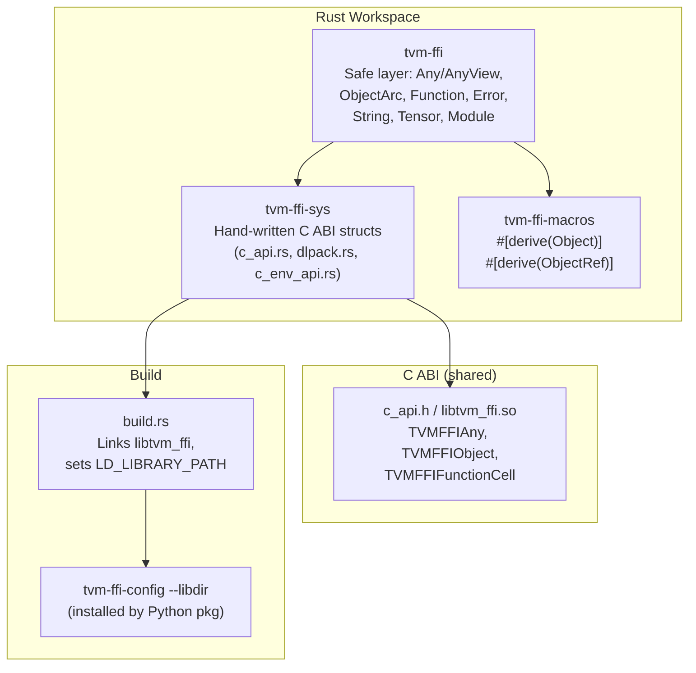

# Rust FFI Bindings

**TL;DR**.
- A Rust workspace (`tvm-ffi`, `tvm-ffi-sys`, `tvm-ffi-macros`) provides ABI-compatible Rust bindings to the TVM FFI C ABI, enabling Rust code to both expose and consume FFI-compatible shared libraries.
- The `AnyCompatible` trait mirrors C++ `TypeTraits<T>`, unsafe traits `ObjectCore`/`ObjectRefCore` mirror the C++ Object/ObjectRef hierarchy, and `ObjectArc<T>` is the ref-counted smart pointer -- together forming the Rust equivalent of the complete C++ type-erased value + object system.
- Proc-macros `#[derive(Object)]`/`#[derive(ObjectRef)]` and helper macros (`tvm_ffi_dll_export_typed_func!`, `into_typed_fn!`, `bail!`, `check_safe_call!`) minimize boilerplate, covering the full define-register-call round-trip.

## Problem Statement
### Background
- The C++ FFI core and Python bindings serve two of three target languages. Rust is needed as a systems-level alternative for performance-critical libraries and CUDA kernel dispatchers.
- The C ABI (`c_api.h`) is already stable and language-neutral, but raw `extern "C"` FFI in Rust requires manual ref-count management, unsafe pointer casts, and boilerplate that is error-prone.

### Solution
- A three-crate workspace: `tvm-ffi-sys` (raw C ABI structs and function declarations, hand-written), `tvm-ffi` (safe ergonomic layer with traits and macros), and `tvm-ffi-macros` (proc-macros for deriving object traits).
- Hand-written C ABI mirror (not bindgen) for control over `AtomicU64` fields, `#[repr(C)]` layouts, and the sync obligation with `c_api.h`.

### Goals
- ABI-compatible Rust types that can pass values, objects, and functions across the C ABI boundary to/from C++ and Python.
- Ergonomic derive macros so defining a new Rust FFI type is comparable in effort to the C++ macro pattern.
- Non-goal: Rust-side reflection or field registration (reflection is C++-only; Rust types participate as consumers).

## Design



### Key Classes, Fields and Interfaces

```python
# ======================================================================
# tvm-ffi-sys: Raw C ABI mirror (hand-written, NOT bindgen)
# ======================================================================

class TVMFFIObject:  # repr(C), 24 bytes
    """Rust mirror of C TVMFFIObject header."""
    combined_ref_count: AtomicU64  # lower 32 = strong, upper 32 = weak
    type_index: i32
    __padding: u32
    deleter: Optional[extern "C" fn(*mut c_void, i32)]
    # Invariant: combined_ref_count uses same bit-packing as C++ header
    # Invariant: AtomicU64 (not split fields) to match single-atomic DecRef fast path

class TVMFFIAny:  # repr(C), 16 bytes
    """Union of type_index + value payload."""
    type_index: i32
    # Union: v_int64, v_float64, v_ptr, v_bytes, v_dtype, v_device, ...
    # Invariant: type_index determines active union field

class TVMFFIFunctionCell:  # repr(C)
    safe_call: TVMFFISafeCallType  # C ABI entry: fn(handle, *args, num_args, *result) -> i32
    cxx_call: *mut c_void          # C++ fast-path (NULL for non-C++ functions)

# Constants mirroring C++ COMBINED_REF_COUNT_* values:
# COMBINED_REF_COUNT_STRONG_ONE = 1u64
# COMBINED_REF_COUNT_WEAK_ONE = 1u64 << 32
# COMBINED_REF_COUNT_BOTH_ONE = STRONG_ONE | WEAK_ONE
# COMBINED_REF_COUNT_MASK_U32 = 0xFFFFFFFF

# All C ABI functions declared as extern "C" { fn TVMFFIFunctionCall(...) -> i32; }
# Interacts with: c_api.h (must stay in sync manually)

# ======================================================================
# tvm-ffi: Safe ergonomic layer
# ======================================================================

class AnyView:
    """Non-owning 16-byte view of a TVMFFIAny. Lifetime-parameterized in Rust."""
    # Interacts with: AnyCompatible (conversion), Function.call_packed (arg type)
    # Invariant: must not outlive the TVMFFIAny it references
    # Invariant: type_index determines active union field
    def try_as(self) -> Optional[T]: ...
        # Interacts with: AnyCompatible.check_any_strict + copy_from_any_view_after_check

class Any:
    """Owning ref-counted TVMFFIAny value."""
    # Interacts with: AnyCompatible (conversion), ObjectArc (inc/dec_ref via unsafe_)
    # Invariant: Clone calls inc_ref for object types (type_index >= kTVMFFIStaticObjectBegin)
    # Invariant: Drop calls dec_ref for object types
    def try_as(self) -> Optional[T]: ...
    @staticmethod
    def from_raw_ffi_any(data: TVMFFIAny) -> Any: ...  # unsafe: takes ownership
    @staticmethod
    def into_raw_ffi_any(this: Any) -> TVMFFIAny: ...  # unsafe: releases ownership
    # Extension: impl From<T> for Any where T: AnyCompatible

class AnyCompatible:
    """Trait (unsafe): enables a Rust type to interconvert with TVMFFIAny.
    Mirrors C++ TypeTraits<T>."""
    # Interacts with: AnyView.try_as, Any.try_as, #[derive(ObjectRef)] generated impls
    # Extension: unsafe impl AnyCompatible for MyType { ... }
    def copy_to_any_view(src: Self, data: *mut TVMFFIAny): ...   # unsafe
    def move_to_any(src: Self, data: *mut TVMFFIAny): ...        # unsafe, consumes src
    def check_any_strict(data: *TVMFFIAny) -> bool: ...          # unsafe
    def copy_from_any_view_after_check(data: *TVMFFIAny) -> Self: ...  # unsafe
    def move_from_any_after_check(data: *mut TVMFFIAny) -> Self: ...   # unsafe
    def try_cast_from_any_view(data: *TVMFFIAny) -> Result[Self, ()]: ... # unsafe
    def type_str() -> str: ...
    # Invariant: copy_from_any_view_after_check MUST NOT be called unless check_any_strict returns true
    # Invariant: move_from_any_after_check consumes ownership -- caller must use ManuallyDrop

# Built-in AnyCompatible impls: bool, i64, f64, String, ObjectRef types, DLDataType, DLDevice

class ObjectCore:
    """Unsafe trait: marks a #[repr(C)] struct as an FFI object."""
    TYPE_KEY: str                    # e.g., "ffi.Function", "my.MyObj"
    def type_index() -> i32: ...     # uses LazyLock + TVMFFITypeKeyToIndex for dynamic types
    def object_header_mut(this: *mut Self) -> *mut TVMFFIObject: ...  # unsafe
    # Invariant: first field must physically be (or chain to) a TVMFFIObject for ABI compat
    # Interacts with: ObjectArc (allocation/deallocation), #[derive(Object)] macro

class ObjectCoreWithExtraItems(ObjectCore):
    """Unsafe trait: declares trailing items after the struct body (e.g., String, Shape, Tensor)."""
    ExtraItem: Type
    def extra_items_count(this: *Self) -> usize: ...
    def extra_items(this: *Self) -> Slice[ExtraItem]: ...       # unsafe, pointer arithmetic
    def extra_items_mut(this: *mut Self) -> MutSlice[ExtraItem]: ...  # unsafe
    # Invariant: allocation size = size_of::<Self>() + count * size_of::<ExtraItem>()
    # Interacts with: ObjectArc.new_with_extra_items (allocates trailing data)

class ObjectArc[T: ObjectCore]:
    """Arc-like smart pointer for FFI objects. repr(C), NonNull."""
    ptr: NonNull[T]
    # Invariant: ptr is always non-null, heap-allocated via std::alloc::alloc
    # Invariant: Clone increments strong ref (atomic add COMBINED_REF_COUNT_STRONG_ONE)
    # Invariant: Drop decrements -- if strong hits 0 AND no weak refs, runs deleter + dealloc
    # Interacts with: unsafe_::inc_ref, unsafe_::dec_ref (atomic ref-count operations)
    # Extension: ObjectArc::new_with_extra_items for trailing-data objects (String, Shape, Tensor)
    def new(data: T) -> ObjectArc[T]: ...
    def new_with_extra_items(data: T, extra_count: usize) -> ObjectArc[T]: ...
    def from_raw(ptr: *const T) -> ObjectArc[T]: ...   # unsafe, takes ownership
    def into_raw(this: ObjectArc[T]) -> *const T: ...   # unsafe, releases ownership
    def strong_count(this: *ObjectArc[T]) -> usize: ...

class ObjectRefCore:
    """Unsafe trait: marks a struct as an ObjectRef with a data: ObjectArc<ContainerType> field."""
    ContainerType: ObjectCore
    def data(this: *Self) -> *ObjectArc[ContainerType]: ...
    def into_data(this: Self) -> ObjectArc[ContainerType]: ...
    def from_data(data: ObjectArc[ContainerType]) -> Self: ...
    # Interacts with: AnyCompatible (generated by #[derive(ObjectRef)])
    # Interacts with: ObjectArc (shared ownership)

class Function:
    """ABI-stable owned function wrapping FunctionObj (safe_call + cxx_call)."""
    data: ObjectArc[FunctionObj]
    # Interacts with: AnyView/Any (packed args), global registry, Module.get_function
    # Invariant: safe_call C ABI: fn(handle, *TVMFFIAny, num_args, *mut TVMFFIAny) -> i32
    def call_packed(self, packed_args: Slice[AnyView]) -> Result[Any]: ...
    def call_tuple(self, args: T) -> Result[Any]: ...         # T: TupleAsPackedArgs
    def call_tuple_with_len(self, args: T) -> Result[Any]: ...  # const LEN, stack-allocated
    @staticmethod
    def get_global(name: str) -> Result[Function]: ...
    @staticmethod
    def register_global(name: str, func: Function) -> Result[()]: ...
    @staticmethod
    def from_packed(func: Fn(Slice[AnyView]) -> Result[Any]) -> Function: ...
    @staticmethod
    def from_typed(func: F) -> Function: ...  # F: AsPackedCallable<I, O>
    @staticmethod
    def from_extern_c(handle, safe_call, deleter) -> Function: ...

class Error:
    """ABI-stable Error ref wrapping ErrorObj (kind + message + backtrace)."""
    data: ObjectArc[ErrorObj]
    # Interacts with: check_safe_call! macro, TVMFFIErrorCreate/MoveFromRaised/SetRaised
    # Invariant: backtrace stored most-recent-call-first (matches C++ convention)
    def new(kind: ErrorKind, message: str, traceback: str) -> Error: ...
    @staticmethod
    def from_raised() -> Error: ...      # moves TLS raised error
    @staticmethod
    def set_raised(error: *Error): ...   # stores into TLS
    def with_appended_backtrace(this: Error, backtrace: str) -> Error: ...

class Module:
    """ABI-stable Module ref for dynamic library loading."""
    # Interacts with: Function.get_global("ffi.ModuleLoadFromFile") and ("ffi.ModuleGetFunction")
    # Extension: mirrors C++ ModuleObj; loads via __tvm_ffi_<name> symbol prefix
    @staticmethod
    def load_from_file(file_name: str) -> Result[Module]: ...
    def get_function(self, name: str) -> Result[Function]: ...

# ======================================================================
# Rust Container Types
# ======================================================================

class ArrayObj:
    """#[repr(C)] FFI object mirroring C++ ArrayObj layout. Trailing TVMFFIAny elements (d0d0e2f)."""
    object: Object
    data: "*mut c_void"          # Pointer to start of element buffer
    size: i64
    capacity: i64
    data_deleter: "Optional[extern 'C' fn(*mut c_void)]"
    # Invariant: data == address of trailing TVMFFIAny items after allocation
    # Invariant: ExtraItem = TVMFFIAny, extra_items_count = size
    # Interacts with: ObjectCoreWithExtraItems (trailing item allocation)

class Array(Generic[T]):  # T: AnyCompatible + Clone
    """Rust generic array ref wrapping ArrayObj. First Rust container using ObjectCoreWithExtraItems (d0d0e2f)."""
    data: ObjectArc[ArrayObj]
    _marker: PhantomData[T]
    # Interacts with: ObjectRefCore (data/into_data/from_data pattern)
    # Interacts with: AnyCompatible (Any/AnyView round-trip via type_index kTVMFFIArray)
    # Invariant: elements stored as raw TVMFFIAny in trailing items; typed access via T::try_cast_from_any_view
    # Extension: implement new container types following this ObjectCoreWithExtraItems + ObjectRefCore pattern

    def new(items: Vec[T]) -> "Array[T]": ...
    def len(self) -> usize: ...
    def is_empty(self) -> bool: ...
    def get(self, index: usize) -> "Result[T, Error]": ...
        # Invariant: bounds-checked, returns IndexError on OOB
    def iter(self) -> "ArrayIterator[T]": ...
    def __index__(self, index: usize) -> AnyView: ...
        # Invariant: panics on OOB (not Result-based)

    # AnyCompatible impl for Array<T>:
    #   check_any_strict: type_index == kTVMFFIArray AND (T == Any OR all elements pass T::check_any_strict)
    #   try_cast_from_any_view: fast path (strict check + copy ref) OR slow path (element-by-element)
    #   Pattern: recursive AnyCompatible type checking for generic containers

# Bugfix in Any::into_raw_ffi_any (d0d0e2f):
#   Old: let raw = this.data;  // this is dropped, decrementing refcount -> double-free
#   New: let this = ManuallyDrop::new(this); let raw = this.data;  // ownership transferred, no drop

# Proc-macro expansion pseudocode:
#
# #[derive(Object)] on FooObj generates:
#   unsafe impl ObjectCore for FooObj {
#       const TYPE_KEY: &str = <from #[type_key = "..."] attribute>;
#       fn type_index() -> i32 {
#           // If #[type_index(TVMFFITypeIndex::kTVMFFIXxx)] present: return const
#           // Otherwise: LazyLock calling TVMFFITypeKeyToIndex(TYPE_KEY)
#       }
#       unsafe fn object_header_mut(this: &mut Self) -> &mut TVMFFIObject {
#           // returns &mut this.<first_field>.<chain_to_TVMFFIObject>
#       }
#   }
#
# #[derive(ObjectRef)] on FooRef generates:
#   unsafe impl ObjectRefCore for FooRef { ContainerType = FooObj; ... }
#   unsafe impl AnyCompatible for FooRef {
#       // check_any_strict: type_index match or IsInstance via ancestor table
#       // copy_from_any_view_after_check: inc_ref + ObjectArc::from_raw
#       // move_from_any_after_check: ObjectArc::from_raw (no inc_ref)
#       // copy_to_any_view: sets type_index + v_ptr
#       // move_to_any: into_raw (transfers ownership)
#   }
```

### Contracts, Assumptions and Invariants
- **ABI sync obligation**: `tvm-ffi-sys/src/c_api.rs` is hand-written (not bindgen). Every struct layout, constant value, and extern function signature must be manually kept in sync with `include/tvm/ffi/c_api.h`. This is a deliberate trade-off for control over `AtomicU64` field access and `#[repr(C)]` precision.
- **First-field chain invariant**: Any struct implementing `ObjectCore` must have its first field be (or chain to) `TVMFFIObject`. The `#[derive(Object)]` proc-macro enforces this at compile time by following the first field recursively.
- **Ref-count protocol**: `ObjectArc<T>` uses the same atomic `combined_ref_count` protocol as C++ `ObjectPtr<T>`. Strong refs in lower 32 bits, weak in upper 32. The fast path (no external weak refs) completes with a single atomic subtract-and-compare. Mixing Rust and C++ `ObjectArc`/`ObjectPtr` on the same object is safe as long as both use the C ABI atomic operations.
- **Build dependency**: `tvm-ffi-config --libdir` (installed by the Python package) is a hard build dependency. `build.rs` calls it to discover `libtvm_ffi.so` location and sets platform-specific library paths (`LD_LIBRARY_PATH`/`DYLD_LIBRARY_PATH`/`PATH`).
- **No Rust-side reflection**: Rust types do not register fields or methods with the reflection system. They participate in the FFI as consumers (calling C++ functions, loading modules) and as ABI-compatible object types (via `ObjectCore`), but not as reflection sources.

### Extension Points
- **New Rust object types**: Implement via `#[derive(Object)]` on a `#[repr(C)]` struct + `#[derive(ObjectRef)]` on the ref wrapper. Dynamic type index registration happens automatically via `LazyLock` + `TVMFFITypeKeyToIndex`.
- **New `AnyCompatible` impls**: Add `unsafe impl AnyCompatible for NewType` to enable conversion to/from `Any`/`AnyView`. Helper macros `impl_try_from_any!` and `impl_arg_into_ref!` reduce boilerplate.
- **Custom packed functions**: Use `Function::from_typed(closure)` where the closure implements `AsPackedCallable`. The trait auto-generates argument unpacking for 0-8 arguments via macro pattern matching.
- **DLL export from Rust**: Use `tvm_ffi_dll_export_typed_func!(name, func)` to expose a Rust function as an FFI-loadable symbol (`__tvm_ffi_<name>`).

### Usage Examples

#### Exposing a Rust Function as an FFI Module
**Context**: Writing a CUDA/CPU kernel in Rust, compiling to a shared library, and loading it from Rust or Python.
```rust
// --- Library side: export a typed function ---
use tvm_ffi::*;

fn add_one_cpu(x: &Tensor, y: &Tensor) -> Result<()> {
    let x_data = x.as_slice::<f32>()?;
    let y_data = y.as_mut_slice::<f32>()?;
    for i in 0..x_data.len() {
        y_data[i] = x_data[i] + 1.0;
    }
    Ok(())
}
// Generates: pub unsafe extern "C" fn __tvm_ffi_add_one_cpu(handle, args, num_args, result) -> i32
tvm_ffi_dll_export_typed_func!(add_one_cpu, add_one_cpu);

// --- Consumer side: load and call ---
let lib = Module::load_from_file("target/release/libadd_one.so")?;
let func = lib.get_function("add_one_cpu")?;
let typed = into_typed_fn!(func, Fn(&Tensor, &Tensor) -> Result<()>);
let x = Tensor::from_slice(&[1.0f32, 2.0, 3.0], &[3])?;
let y = Tensor::from_slice(&[0.0f32; 3], &[3])?;
typed(&x, &y)?;
// y now contains [2.0, 3.0, 4.0]
```

#### Defining a Custom Object Type with Derive Macros
**Context**: Creating a new Rust-defined FFI object that can be passed across the C ABI boundary.
```rust
use tvm_ffi::*;

#[repr(C)]
#[derive(Object)]                    // generates unsafe impl ObjectCore
#[type_key = "my.MyObj"]             // registered dynamically via LazyLock
struct MyObj {
    object: Object,                  // first field MUST chain to TVMFFIObject
    value: i64,
}

#[derive(Clone, ObjectRef)]         // generates ObjectRefCore + AnyCompatible
struct MyRef {
    data: ObjectArc<MyObj>,          // Arc-like ref-counted pointer
}

// Create, convert to Any, and round-trip back
let arc = ObjectArc::new(MyObj { object: Object::new(), value: 42 });
let my_ref = MyRef { data: arc };
let any = Any::from(my_ref.clone());          // AnyCompatible::move_to_any
let back: MyRef = any.try_as().unwrap();      // AnyCompatible::try_cast_from_any_view
assert_eq!(back.data.value, 42);
```

### Decision Record

#### Why Hand-Written C ABI Structs Instead of Bindgen?

**Decision drivers**: The Rust bindings need exact control over `TVMFFIObject.combined_ref_count` as `AtomicU64` (bindgen would generate a plain `u64`), need `#[repr(C)]` on every struct with exact field ordering, and need to handle the union layout of `TVMFFIAny` precisely.

**Alternative A: Use bindgen to auto-generate from `c_api.h`**
- Pros: Automatic sync with C header changes. Less manual maintenance.
- Cons: Bindgen output lacks `AtomicU64` for ref counts (generates `u64`, losing atomicity). Cannot control derive attributes or trait impls. Union handling in bindgen is fragile. Would need extensive post-processing.

**Alternative B: Hand-written structs in `tvm-ffi-sys` (chosen)**
- Pros: Full control over atomic types, repr layout, and derives. Can add helper methods directly on C ABI types. Precise `#[repr(C)]` with explicit padding.
- Cons: Manual sync obligation with `c_api.h` -- changes to the C header must be manually mirrored. Risk of drift if not tested.

**Rejection rationale for A**: The `AtomicU64` requirement for `combined_ref_count` is a hard constraint -- incorrect atomicity would cause data races in multi-threaded code. Bindgen cannot produce this without post-processing that would be as complex as hand-writing the structs. The sync risk is mitigated by CI tests that exercise cross-language ref-count round-trips.

## Implementation Notes
- `tvm-ffi-sys/build.rs` calls `tvm-ffi-config --libdir` to discover `libtvm_ffi.so`, emits `cargo:rustc-link-search=native=<dir>` and `cargo:rustc-link-lib=dylib=tvm_ffi`, and sets platform-specific library path env vars for `cargo run`/`cargo test`.
- `ObjectArc::new()` allocates via `std::alloc::alloc` (not `Box`) because trailing-data objects need custom-sized allocations. `new_with_extra_items` computes layout as `size_of::<T>() + extra_count * size_of::<ExtraItem>()`.
- `CallbackFunctionObjImpl<F>` is a `#[repr(C)]` struct with `FunctionObj` as its first field plus the Rust closure `F`. This allows the deleter to correctly drop the closure when the function object is freed. The `safe_call` function pointer is set to `Self::invoke_callback` which reconstructs `&Self` from the handle pointer.
- `into_typed_fn!(func, Fn(T0, T1, ...) -> Result<O>)` supports 0-8 arguments via macro pattern matching. Each variant calls `func.call_tuple_with_len::<N, _>(args)` with a stack-allocated argument array, then `?.try_into()?` for the return type conversion.

## Alternatives & Trade-offs
### Single Crate vs. Three-Crate Workspace
- Pros of three crates: `tvm-ffi-sys` can be used by advanced users who want raw C ABI access. Proc-macros must be in a separate crate (Rust requirement). Clear layering.
- Cons: More complex dependency graph. Users must coordinate versions across three crates.

### Trait-Based Type System vs. Enum-Based
- Pros of traits (`AnyCompatible`, `ObjectCore`): Open extension -- users add new types by implementing traits. Matches the C++ `TypeTraits` pattern.
- Cons: Requires `unsafe` impl for correctness. More complex than a closed enum. Compiler cannot exhaustively check all cases.

## Evidence
| Commit | Scope | Contribution |
|--------|-------|-------------|
| 09477ce | rust/ffi-bindings, rust/ffi-sys, rust/ffi-macros | Initial bringup: full Rust workspace with AnyCompatible, ObjectCore/ObjectRefCore, ObjectArc, Function, Error, Module, String, Tensor, Shape, derive macros, export macros |
| d0d0e2f | rust/ffi-bindings, ffi/containers | Added Rust `Array<T>` / `ArrayObj` with recursive AnyCompatible type checking; fixed `Any::into_raw_ffi_any` double-free via ManuallyDrop |

## Related Design Docs & ADRs
- [0001-c-abi.md](0001-c-abi.md) -- C ABI that `tvm-ffi-sys` mirrors in Rust
- [0002-any-value-system.md](0002-any-value-system.md) -- `AnyView`/`Any` + `TypeTraits<T>` pattern that `AnyCompatible` mirrors
- [0003-object-system.md](0003-object-system.md) -- Object/ObjectRef/ObjectPtr hierarchy that `ObjectCore`/`ObjectRefCore`/`ObjectArc` mirrors
- [0004-function-system.md](0004-function-system.md) -- Function system that Rust `Function` wraps
- [0005-error-protocol.md](0005-error-protocol.md) -- Error protocol that Rust `Error` wraps
- [0011-module-system.md](0011-module-system.md) -- Module system that Rust `Module` consumes
- [0013-packaging.md](0013-packaging.md) -- `tvm_ffi_dll_export_typed_func!` mirrors the C++ export macro; `tvm-ffi-config` build dependency
