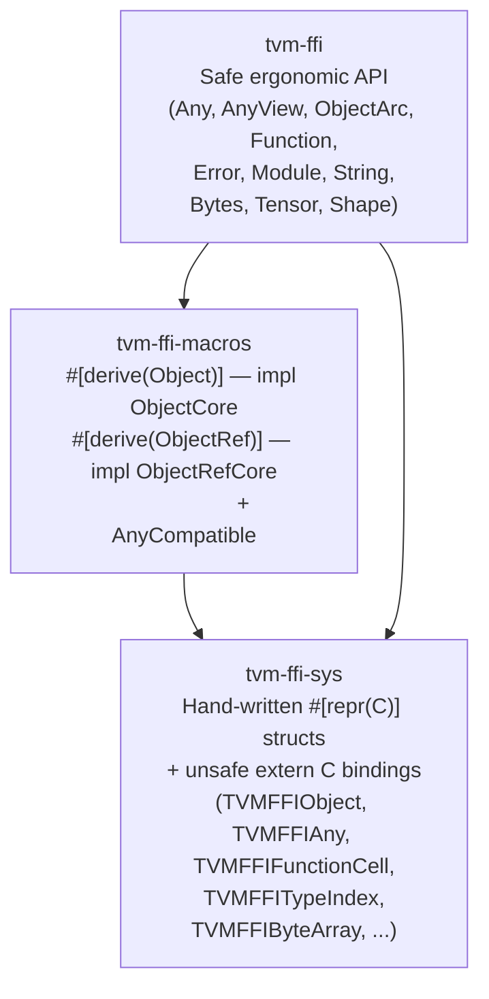
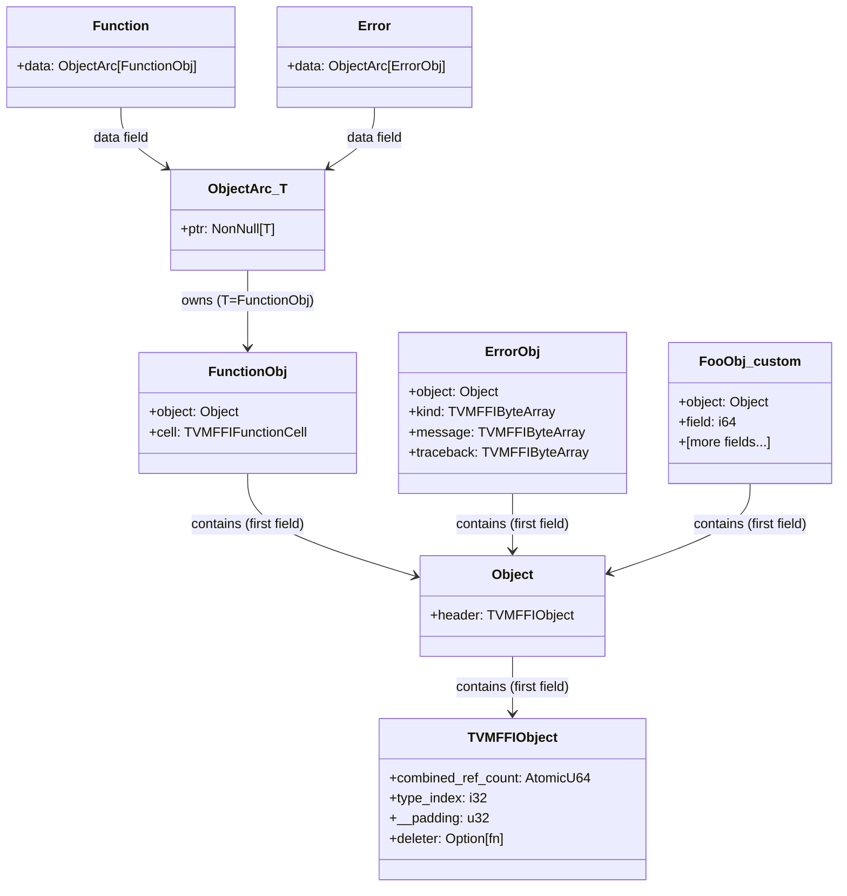

# Rust Language Binding Layer

**TL;DR**
- TVM FFI ships a three-crate Rust workspace (`rust/`): `tvm-ffi-sys` (hand-written unsafe C ABI mirror), `tvm-ffi` (safe ergonomic API), and `tvm-ffi-macros` (proc-macro derive helpers). No bindgen — the structs are authored manually to control `AtomicU64` semantics for `combined_ref_count`.
- Every core C++/Python abstraction has a Rust equivalent that shares the same `TVMFFIObject` ref-count protocol and `TVMFFIAny` 16-byte wire layout, enabling Rust objects to be passed through C++ `Function.call_packed` and vice versa without a separate marshaling layer.
- The `AnyCompatible` unsafe trait is the Rust analog of C++ `TypeTraits<T>` and is the single customization point for making any Rust type passable through `Any`/`AnyView`. `#[derive(Object)]` / `#[derive(ObjectRef)]` are the Rust analogs of `TVM_FFI_DECLARE_OBJECT_INFO` / `TVM_FFI_DEFINE_OBJECT_REF_METHODS`.

## Problem Statement

### Background
C++ and Python bindings existed from day one. The C ABI (0001-c-abi) is stable enough that a third language binding can be written against it without touching the C++ headers. Rust's ownership model and unsafe/safe split make it a natural fit for a binding that exposes a fully safe API over an unsafe C ABI layer.

### Solution
A three-crate workspace isolates concerns: `tvm-ffi-sys` owns all `unsafe extern "C"` declarations and `#[repr(C)]` struct mirrors. `tvm-ffi` wraps these in safe Rust types. `tvm-ffi-macros` eliminates boilerplate for new Object/ObjectRef types.

### Goals
- Full ABI compatibility with C++ objects: Rust `ObjectArc<T>` uses the same `combined_ref_count` lower/upper 32-bit split as C++ `ObjectPtr<T>`.
- Safe API: the only `unsafe` code lives in `tvm-ffi-sys` and the `object::unsafe_` module. All public APIs in `tvm-ffi` are safe.
- Extensible: downstream crates define new object types by annotating a struct with `#[derive(Object)]` + `#[type_key = "..."]`.
- Non-goal: Rust-native async or threading model; the binding is synchronous, matching the C++ API.

## Design

### Crate Workspace Layout



### Key Classes, Fields and Interfaces

```python
# ── tvm-ffi-sys ───────────────────────────────────────────────────────────────
# Hand-written mirror of the C ABI (include/tvm/ffi/c_api.h).
# No bindgen: authored manually to use AtomicU64 for combined_ref_count.

class TVMFFITypeIndex(IntEnum):  # repr(i32)
    kTVMFFINone = 0; kTVMFFIInt = 1; kTVMFFIBool = 2; kTVMFFIFloat = 3
    kTVMFFIDLTensorPtr = 7; kTVMFFIRawStr = 8
    kTVMFFIStaticObjectBegin = 64
    kTVMFFIStr = 65; kTVMFFIBytes = 66; kTVMFFIError = 67
    kTVMFFIFunction = 68; kTVMFFIShape = 69; kTVMFFITensor = 70
    kTVMFFIArray = 71; kTVMFFIMap = 72; kTVMFFIModule = 73
    # Invariant: type_index >= kTVMFFIStaticObjectBegin ⇒ ref-counted object

class TVMFFIObject:  # repr(C); first 24 bytes of every heap object
    combined_ref_count: AtomicU64  # lower 32 = strong count, upper 32 = weak count
    type_index: i32
    __padding: u32   # always 0
    deleter: Option[unsafe extern "C" fn(*mut c_void, i32)]
    # Interacts with: ObjectArc::inc_ref/dec_ref, object::unsafe_::object_deleter_for_new
    # Invariant: must always be the first field of every ObjectCore struct

class TVMFFIAny:  # repr(C); 16-byte wire layout (same as C++)
    type_index: i32
    small_str_len: i32   # also called zero_padding for non-small-str cases
    data_union: TVMFFIAnyUnion  # v_int64, v_float64, v_obj (*mut TVMFFIObject), v_ptr, etc.
    # Invariant: small_str_len MUST be 0 for all non-small-str types
    # Interacts with: AnyView/Any (wraps this), AnyCompatible (reads/writes data_union)


# ── tvm-ffi/any ──────────────────────────────────────────────────────────────

class AnyView:  # repr(C), Copy, lifetime 'a
    """Non-owning type-erased value; borrowed, cannot outlive the source value."""
    data: TVMFFIAny
    _phantom: PhantomData['a]  # lifetime binding to borrowed value

    def type_index(self) -> i32: ...   # reads data.type_index
    def try_as(self, T: AnyCompatible) -> Option[T]:
        # Strict non-coercing check: T::check_any_strict(&data)
        # Interacts with: AnyCompatible::copy_from_any_view_after_check
        ...
    def try_from(self, view: AnyView) -> Result[T]:
        # Coercing: AnyCompatible::try_cast_from_any_view(&view.data)
        ...
    # Invariant: must not outlive the value whose data it points to
    # Interacts with: Function::call_packed (packed_args: &[AnyView])

class Any:  # repr(C), NOT Copy, owns the value
    """Owned type-erased value; calls dec_ref on Drop if type_index >= kTVMFFIStaticObjectBegin."""
    data: TVMFFIAny

    def type_index(self) -> i32: ...
    def try_as(self, T: AnyCompatible) -> Option[T]: ...  # strict, same as AnyView
    # Drop: if type_index >= kTVMFFIStaticObjectBegin → unsafe_::dec_ref(data.v_obj)
    # From<T>: AnyCompatible::move_to_any(src, &mut data)
    # Interacts with: Function (return value), Error path (TLS slot)


# ── tvm-ffi/object ────────────────────────────────────────────────────────────

class Object:  # repr(C); base of all object nodes
    header: TVMFFIObject
    # unsafe impl ObjectCore for Object:
    #   const TYPE_KEY = "ffi.Object"
    #   fn type_index() → kTVMFFIStaticObjectBegin as i32
    #   fn object_header_mut(&mut self) → &mut self.header

trait ObjectCore:  # unsafe trait
    """Marks a #[repr(C)] struct as a TVM FFI object node."""
    TYPE_KEY: str  # e.g. "ffi.Function"
    def type_index() -> i32: ...   # static (via #[type_index(...)]) or lazy LazyLock
    def object_header_mut(this: &mut Self) -> &mut TVMFFIObject: ...
    # Invariant: first field must be a parent ObjectCore struct (forms an inheritance chain)
    # Extension: implement via #[derive(Object)] + #[type_key = "..."] attributes

class ObjectArc(T: ObjectCore):  # repr(C)
    """Arc-like shared ownership over an object node. Uses TVMFFIObject's combined_ref_count."""
    ptr: NonNull[T]

    def new(value: T) -> ObjectArc[T]: ...      # allocates + sets combined_ref_count to BOTH_ONE
    def from_raw(ptr: *mut T) -> ObjectArc[T]: ... # adopts; does NOT inc_ref
    def as_raw(arc: &Self) -> *mut T: ...           # borrows; does NOT inc_ref
    def into_raw(arc: Self) -> *mut T: ...          # releases; does NOT dec_ref
    # Clone: inc_ref via unsafe_::inc_ref
    # Drop: unsafe_::dec_ref; when strong drops to 0, deleter(ptr, kStrong)
    # Interacts with: ObjectCore, unsafe_::inc_ref/dec_ref/object_deleter_for_new
    # Invariant: combined_ref_count lower 32 bits = strong count; upper 32 = weak count
    # Invariant: no weak-ptr API exposed yet (unlike C++ WeakObjectPtr)

trait ObjectRefCore:  # unsafe trait
    """Wraps ObjectArc for use with AnyCompatible. Not user-facing."""
    type ContainerType: ObjectCore
    def data(this: &Self) -> &ObjectArc[Self.ContainerType]: ...
    def into_data(this: Self) -> ObjectArc[Self.ContainerType]: ...
    def from_data(data: ObjectArc[Self.ContainerType]) -> Self: ...
    # Extension: implement via #[derive(ObjectRef)] on a struct with `data: ObjectArc<FooObj>`


# ── tvm-ffi/type_traits ──────────────────────────────────────────────────────

trait AnyCompatible:  # unsafe trait
    """Customization point for Any ↔ T conversion. Rust analog of C++ TypeTraits<T>."""
    def copy_to_any_view(src: &Self, data: &mut TVMFFIAny): ...
    def move_to_any(src: Self, data: &mut TVMFFIAny): ...
    def check_any_strict(data: &TVMFFIAny) -> bool: ...        # strict, no coercion
    def copy_from_any_view_after_check(data: &TVMFFIAny) -> Self: ...
    def move_from_any_after_check(data: &mut TVMFFIAny) -> Self: ...
    def try_cast_from_any_view(data: &TVMFFIAny) -> Result[Self, ()]: ...  # coercing
    def get_mismatch_type_info(data: &TVMFFIAny) -> String: ...
    def type_str() -> String: ...
    # Interacts with: AnyView::try_as (strict), TryFrom<AnyView> (coercing)
    # Extension: unsafe impl AnyCompatible for MyType to make it passable through Any


# ── tvm-ffi/function ──────────────────────────────────────────────────────────

class FunctionObj:  # repr(C), #[derive(Object)], #[type_key = "ffi.Function"]
    object: Object
    cell: TVMFFIFunctionCell  # { safe_call: TVMFFISafeCallType, cxx_call: *mut c_void }

class Function:  # #[derive(Clone, ObjectRef)]
    """Type-erased callable; wraps FunctionObj with call_packed semantics."""
    data: ObjectArc[FunctionObj]

    def call_packed(self, packed_args: &[AnyView]) -> Result[Any]:
        # Calls cell.safe_call(handle, args_ptr, num_args, result_ptr)
        # Stack buffer: 4 AnyView slots before heap spill in call_tuple
        ...
    def call_tuple(self, args: TupleType) -> Result[Any]:
        # Small-vector opt: stack buffer of STACK_LEN=4, heap spill if more
        ...
    def call_tuple_with_len(self, LEN: const, args: TupleType) -> Result[Any]:
        # Const-LEN version: no small-vec overhead, [AnyView::new(); LEN] on stack
        ...
    def from_packed(f: Fn(&[AnyView]) -> Result[Any]) -> Function: ...
    def from_typed(f: F) -> Function where F: AsPackedCallable[I, O]:
        # Wraps typed closure in from_packed via AsPackedCallable machinery (0-8 typed args)
        ...
    def get_global(name: &str) -> Result[Function]: ...
    def register_global(name: &str, func: Function) -> Result[()]: ...
    # from_typed uses AsPackedCallable + impl_as_packed_callable! macro (0-8 args)
    # Interacts with: global registry (TVMFFIFunctionGetGlobal/SetGlobal), AnyCompatible


# ── tvm-ffi/error ────────────────────────────────────────────────────────────

class Error:
    """Rust Error backed by C++ ErrorObj via TLS error slot."""
    data: ObjectArc[ErrorObj]

    def new(kind: ErrorKind, message: String, traceback: String) -> Error: ...
    def from_raised() -> Error:  # reads TLS slot after safe_call returns -1
        # Calls TVMFFIErrorMoveFromRaised
        ...
    def set_raised(error: &Error):  # writes TLS slot before returning -1
        # Calls TVMFFIErrorSetRaised
        ...
    # Implements std::error::Error + Display
    # Interacts with: check_safe_call! macro, bail! macro, 0005-error-system protocol

class ErrorKind:
    """Newtype &'static str for error kind names."""
    # Predefined: VALUE_ERROR, TYPE_ERROR, RUNTIME_ERROR, ATTRIBUTE_ERROR, KEY_ERROR, INDEX_ERROR
    # Custom: ErrorKind("my.CustomError")
    # Interacts with: bail!, ensure! macros


# ── tvm-ffi/extra/module ─────────────────────────────────────────────────────

class Module:
    """Dynamic library wrapper; uses LazyLock for global function lookups."""
    data: ObjectArc[ModuleObj]  # type index kTVMFFIModule = 73

    def load_from_file(file_name: &str) -> Result[Module]:
        # Gets "ffi.ModuleLoadFromFile" from global registry on first call (LazyLock)
        ...
    def get_function(name: &str) -> Result[Function]:
        # Gets "ffi.ModuleGetFunction" from global registry on first call (LazyLock)
        ...
    # Interacts with: global function registry, 0011-module-system


# ── tvm-ffi/collections/array ──────────────────────────────────────────────
# (commit d0d0e2f)

class ArrayObj:
    """#[repr(C)] mirror of C++ ffi::ArrayObj. Layout must match exactly."""
    object: Object           # TVMFFIObject header
    data: *mut c_void        # pointer to element buffer (TVMFFIAny items after header)
    size: i64
    capacity: i64
    data_deleter: Option[Callable[[*mut c_void], None]]
    # Invariant: elements stored inline after ArrayObj header (ObjectCoreWithExtraItems<ExtraItem=TVMFFIAny>)
    # Interacts with: ObjectArc::new_with_extra_items, C++ Array<T> layout, 0007-containers

class Array(Generic[T]):
    """Safe mutable Rust Array container. T must be AnyCompatible + Clone."""
    data: ObjectArc[ArrayObj]
    _marker: PhantomData[T]
    # Invariant: T must be AnyCompatible + Clone; ref-counts managed on get/push/remove

    def new(items: Vec[T]) -> Array[T]: ...
    def len(self) -> usize: ...
    def is_empty(self) -> bool: ...
    def get(self, idx: usize) -> Optional[T]: ...  # calls inc_ref
    def push(self, item: T) -> None: ...            # may reallocate
    def pop(self) -> Optional[T]: ...               # calls dec_ref
    def insert(self, idx: usize, item: T) -> None: ...
    def remove(self, idx: usize) -> T: ...
    def clear(self) -> None: ...                    # calls dec_ref on all elements
    # AnyCompatible roundtrip: Array<T> <-> Any <-> AnyView
    # Implements: ObjectRefCore, FromIterator<T>, Extend<T>, Index<usize>
    # Interacts with: AnyCompatible::inc_ref/dec_ref, ObjectRefCore
    # Extension: implement AnyCompatible for new element types to use as Array<NewType>

# Bug fix in any.rs (commit d0d0e2f):
# Any::into_raw_ffi_any now wraps self in ManuallyDrop to prevent double-drop
```

### Macro Expansions

```python
# #[derive(Object)] on FooObj ────────────────────────────────────────────────
# Generates: unsafe impl ObjectCore for FooObj
#   const TYPE_KEY = "my.Foo"               (from #[type_key = "my.Foo"])
#   fn type_index() -> i32:
#     if #[type_index(TVMFFITypeIndex::kXxx)] present:
#       return kXxx as i32              (static constant, zero overhead)
#     else:
#       static TYPE_INDEX: LazyLock<i32> = LazyLock::new(||
#           TVMFFITypeKeyToIndex(&TVMFFIByteArray::from_str("my.Foo"), &mut idx)  → idx
#       )
#       return *TYPE_INDEX              (lazy one-time lookup)
#   fn object_header_mut(&mut self) -> &mut TVMFFIObject:
#     # delegates transitively to first field's object_header_mut
#     # ensures the first field is itself an ObjectCore (compile-time check)
#     ParentType::object_header_mut(&mut self.<first_field>)

# #[derive(ObjectRef)] on Foo (with `data: ObjectArc<FooObj>`) ────────────────
# Generates:
#   unsafe impl ObjectRefCore for Foo:
#     type ContainerType = FooObj
#     fn data(&self) -> &ObjectArc<FooObj>: { &self.data }
#     fn into_data(self) -> ObjectArc<FooObj>: { self.data }
#     fn from_data(d: ObjectArc<FooObj>) -> Foo: { Foo { data: d } }
#   unsafe impl AnyCompatible for Foo:
#     fn copy_to_any_view(src: &Foo, out: &mut TVMFFIAny):
#       out.type_index = FooObj::type_index()
#       out.data_union.v_obj = ObjectArc::as_raw(&src.data) as *mut TVMFFIObject
#       # NOTE: does NOT inc_ref — AnyView borrows
#     fn check_any_strict(data: &TVMFFIAny) -> bool:
#       data.type_index == FooObj::type_index()   # exact type check only
#     fn copy_from_any_view_after_check(data: &TVMFFIAny) -> Foo:
#       unsafe_::inc_ref(data.data_union.v_obj)    # inc_ref because AnyView doesn't own
#       Foo { data: ObjectArc::from_raw(v_obj as *mut FooObj) }
#     fn move_to_any + move_from_any_after_check:
#       move_to_any: transfers ownership (no inc_ref)
#       move_from_any: does NOT inc_ref (already owned by Any)
#   impl TryFrom<AnyView<'_>> for Foo (via AnyCompatible::try_cast_from_any_view)
#   impl TryFrom<Any> for Foo
```

### Function Call Path — from_typed macro expansion

```python
# impl_as_packed_callable!(2; T0, T1) generates:
# impl<Fun, T0, T1, Out> AsPackedCallable<(T0, T1), Out> for Fun
# where Fun: Fn(T0, T1) -> Result<Out>, Any: From<Out>, T0/T1: ArgTryFromAnyView
#
#   fn call_packed(&self, packed_args: &[AnyView]) -> Result<Any>:
#     ensure!(packed_args.len() == 2, ...)
#     let mut iter = packed_args.iter().enumerate()
#     let (i0, v0) = iter.next(); let a0 = T0::try_from_any_view(v0, i0)?
#     let (i1, v1) = iter.next(); let a1 = T1::try_from_any_view(v1, i1)?
#     let ret = self(a0, a1)?
#     Ok(Any::from(ret))
```

### Object Inheritance Chain Diagram



### Build Integration

```python
# rust/tvm-ffi-sys/build.rs:
#   LIBDIR = output of `tvm-ffi-config --libdir`
#   cargo:rustc-link-search=native={LIBDIR}
#   cargo:rustc-link-lib=tvm_ffi_shared
#   cargo:rerun-if-env-changed=TVM_FFI_CONFIG_PATH
#
# CARGO_FEATURE_EXAMPLE feature flag (tvm-ffi/build.rs):
#   If set: also links example shared library for integration tests
#
# CI: cargo test runs after `uv pip install -e .` so libtvm_ffi_shared.so is available
```

## Contracts, Assumptions and Invariants

- The `#[repr(C)]` layout of `TVMFFIObject`, `TVMFFIAny`, `TVMFFIFunctionCell`, and `TVMFFIShapeCell` in `tvm-ffi-sys` **must match** the C++ headers exactly. Any header change that shifts offsets requires a corresponding `tvm-ffi-sys` update.
- Every `ObjectCore` struct **must have its first field be another `ObjectCore` type** (chain terminates at `Object`). This invariant is checked at compile time in the `#[derive(Object)]` expansion by `fn assert_impl::<BaseType>()`.
- `combined_ref_count` uses native Rust `AtomicU64`. This matches C++'s `std::atomic<uint64_t>` with relaxed semantics for inc_ref (Relaxed) and acquire/release for dec_ref (Release on store, Acquire for re-read before deleter call) — matching the C++ TVM FFI protocol.
- `AnyView<'a>` is `Copy`: it does **not** call `inc_ref` on construction or `dec_ref` on drop. Callers must ensure the underlying value outlives all `AnyView` instances that borrow it.
- `#[derive(ObjectRef)]`'s `copy_from_any_view_after_check` always calls `inc_ref` before constructing the `ObjectArc`, because `AnyView` does not own the ref. `move_from_any_after_check` does **not** `inc_ref`, because `Any` already owns the ref.
- `Function::call_tuple` uses a `STACK_LEN = 4` threshold: `≤4` args use a stack `[AnyView; 4]` array; `>4` args spill to a heap `Vec`. This is a performance contract — changing `STACK_LEN` changes the heap-allocation boundary.
- `tvm-ffi-sys` does not use bindgen — it is hand-written. This is a maintenance cost acknowledged by the design; the C ABI is small enough (< 200 lines) that manual authoring is tractable.

### Failure Modes

- If `tvm-ffi-sys` layout diverges from the C++ header (e.g., after a C++ ABI change): silent memory corruption at the first `ObjectArc` dereference. Mitigation: `static_assert_eq!(std::mem::size_of::<TVMFFIObject>(), 24)` in `tvm-ffi-sys`.
- `Function::get_global` returns `Err(RUNTIME_ERROR)` (not `None`) when the function name is not registered. Callers must distinguish "not registered" from runtime errors explicitly.
- `ObjectArc::from_raw` adopts a pointer without inc_ref. Calling it twice on the same pointer will double-drop. Correct usage pattern: exclusively from `TVMFFIObjectHandle` return values where the C ABI transfers ownership.
- If `#[type_key]` is omitted on a `#[derive(Object)]` struct: compile error ("Expect #[type_key = ...] attribute") from proc-macro.
- GCC 8.x compile error in `TypeTraits<IntEnum>` was fixed (commit `5fba9e8`) by introducing a two-step `is_integeral_enum_v<T>` helper — not a Rust issue but affects C++ code that Rust links against.

### Extension Points

- Implement `AnyCompatible` for any new Rust type to make it passable as a function argument or return value.
- Use `#[derive(Object)]` + `#[type_key = "..."]` to define new heap object types that interop with C++ `ObjectRef` subclasses.
- Implement `ObjectCoreWithExtraItems` for types with tail-allocated data (e.g., Shape, Tensor store inline `int64_t[]` after the struct).

## Usage Examples

### Register and call a typed function from Rust

**Context**: exposing a Rust function to the global registry so it can be called from C++ or Python.

```rust
use tvm_ffi::{Function, Result, Any, AnyView, bail, RUNTIME_ERROR};

// Create from typed closure (0-8 args via impl_as_packed_callable! macro)
let add = Function::from_typed(|x: i64, y: i64| -> Result<i64> { Ok(x + y) });

// Call via packed convention (2-arg path: call_tuple_with_len)
let result: i64 = add.call_tuple((1i64, 2i64))
    .unwrap()
    .try_into()
    .unwrap();
assert_eq!(result, 3);

// Register in global registry (accessible from C++ / Python via get_global_func)
Function::register_global("my.add", add).unwrap();

// Retrieve from registry and call
let f = Function::get_global("my.add").unwrap();
let r: i64 = f.call_tuple((10i64, 20i64)).unwrap().try_into().unwrap();
assert_eq!(r, 30);
```

### Define a new Object type (analog of TVM_FFI_DECLARE_OBJECT_INFO)

**Context**: creating a custom heap object that can be passed through `Any` cross-language.

```rust
use tvm_ffi::{Object, ObjectArc, Any};
use tvm_ffi::derive::{Object as DeriveObject, ObjectRef};

#[repr(C)]
#[derive(DeriveObject)]
#[type_key = "my.Foo"]          // lazy LazyLock lookup via TVMFFITypeKeyToIndex
pub struct FooObj {
    object: Object,              // MUST be first field — checked at compile time
    pub value: i64,
}

#[derive(Clone, ObjectRef)]
pub struct Foo {
    data: ObjectArc<FooObj>,    // MUST be named `data` — checked by ObjectRef derive
}

// Construct
let arc = ObjectArc::new(FooObj { object: Object::new(), value: 42 });
let foo = Foo { data: arc };

// Pack into Any (calls AnyCompatible::move_to_any generated by #[derive(ObjectRef)])
let any = Any::from(foo);

// Unpack — strict type check
let back: Foo = any.try_into().unwrap();
assert_eq!(back.data.value, 42);
```

### Load a shared library and call an exported kernel

**Context**: loading a `tvm_ffi.cpp.build_inline()` compiled `.so` and invoking a TensorView kernel.

```rust
use tvm_ffi::{Module, Tensor, Result};

let lib = Module::load_from_file("add_one_cpu.so").unwrap();
let add_one = lib.get_function("add_one_cpu").unwrap();

// Tensor creation from slice (Rust helper)
let x = Tensor::from_slice(&[0.0f32, 1.0, 2.0, 3.0], &[4]).unwrap();
let y = Tensor::zeros(&[4], tvm_ffi::dtype::f32()).unwrap();

// Call via packed convention (Tensor → AnyView via AnyCompatible)
let result = add_one.call_tuple((&x, &y)).unwrap();
// y now contains [1.0, 2.0, 3.0, 4.0]
```

## Implementation Notes

- `tvm-ffi-sys/src/c_api.rs` is the single source of truth for all `unsafe extern "C"` function declarations. No code in `tvm-ffi` should call C ABI functions directly — all calls go through `tvm-ffi-sys`.
- `object::unsafe_` submodule contains `inc_ref`, `dec_ref`, and `object_deleter_for_new` as `unsafe fn` — these are the three operations that touch the `combined_ref_count` directly. The module is intentionally hidden from the public API.
- **Soundness fixes** (commit 8255069): `Tensor::data_as_slice_mut(&self)` changed to `data_as_slice_mut(&mut self)` to enforce borrow exclusivity (was aliased mutable reference — UB). `StreamContext::with_stream(handle)` and `Function::from_extern_c(handle, safe_call, deleter)` now `unsafe fn` since callers must uphold pointer validity that the function cannot verify.
- `TVMFFIFieldInfo::setter` in `rust/tvm-ffi-sys/src/c_api.rs` changed from `TVMFFIFieldSetter` (fn pointer) to `*mut c_void` to accommodate FunctionObj-based setters (commit 4bb487ef).
- The `impl_as_packed_callable!` macro is instantiated for 0 through 8 typed arguments. Functions with >8 typed args must use `from_packed` directly.
- `CallbackFunctionObjImpl<F>` is an internal struct that extends `FunctionObj` in-place with a Rust closure `F`. The repr(C) layout ensures `FunctionObj` occupies the first bytes, so a pointer to `CallbackFunctionObjImpl<F>` is safely cast to a pointer to `FunctionObj`.

## Alternatives & Trade-offs

### Alternative A: bindgen for tvm-ffi-sys
- Pros: Automatically stays in sync with C headers; no manual maintenance.
- Cons: `combined_ref_count` is `uint64_t` in C but needs Rust `AtomicU64` for correct memory ordering — bindgen would generate `u64`, which is unsound for concurrent access. Manual authoring is necessary.

### Alternative B: A single crate (no sys/safe split)
- Pros: Simpler dependency tree.
- Cons: The `unsafe extern "C"` declarations and the safe API live in the same crate, making it harder to audit which code is unsafe and which is not. The sys/safe split follows standard Rust ecosystem practice (`*-sys` crates).

### Alternative C: Ref-counted via Rust std::sync::Arc
- Pros: No custom ref-count protocol.
- Cons: `Arc<T>` allocates a separate heap block for the `strong/weak` counts, making the layout incompatible with `TVMFFIObject`'s embedded `combined_ref_count`. Sharing objects cross-language requires the same memory layout.

## Related Design Docs & ADRs

- `.knowledge/design-records/0001-c-abi.md` — `TVMFFIObject` 24-byte layout, `TVMFFIAny`, type indices; `tvm-ffi-sys` mirrors these
- `.knowledge/design-records/0002-object-system.md` — `combined_ref_count` protocol, strong/weak deleter flags
- `.knowledge/design-records/0003-any-anyview.md` — `AnyView`/`Any` 16-byte layout, `as<T>()` vs `cast<T>()`
- `.knowledge/design-records/0004-function-system.md` — packed call convention `(handle, *args, num_args, *result) → i32`
- `.knowledge/design-records/0005-error-system.md` — TLS error slot, `-1` return code protocol
- `.knowledge/design-records/0008-type-traits.md` — C++ `TypeTraits<T>` is the conceptual counterpart to Rust `AnyCompatible`
- `.knowledge/design-records/0011-module-system.md` — `"ffi.ModuleLoadFromFile"` / `"ffi.ModuleGetFunction"` global names
- `.knowledge/design-records/0007-containers.md` — C++ `Array<T>` layout that Rust `ArrayObj` mirrors

## Evidence Matrix

| Commit | Contribution |
|--------|-------------|
| d0d0e2f | Adds `Array<T>` Rust container (`ArrayObj` + mutation API + `AnyCompatible`); fixes `Any::into_raw_ffi_any` double-drop with `ManuallyDrop` |
