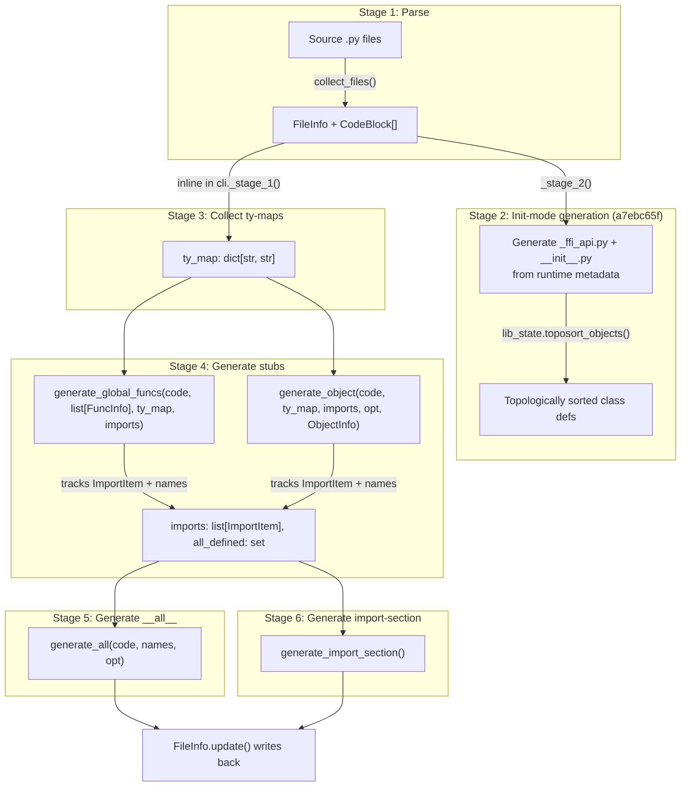

# FFI Stub Generation (`tvm-ffi-stubgen`)

**TL;DR**.
- `tvm-ffi-stubgen` is a CLI tool that scans Python source files for special comment markers and fills them with type stubs derived from the TVM FFI runtime registry. This replaces hand-written `.pyi` sidecar files with inline stubs co-located with runtime code.
- The tool is architected as a **6-stage pipeline** (1af6d9f9, 92e150b9, a7ebc65f): (1) parse all files into `FileInfo`/`CodeBlock` structures, (2) init-mode generation of `_ffi_api.py` and `__init__.py` from runtime metadata (a7ebc65f), (3) collect file-level `ty-map` directives, (4) generate stubs for global/object blocks while tracking type usage, (5) generate `__all__` export lists, (6) auto-generate `import-section` blocks from collected usage.
- Eight block kinds are supported: `global/<prefix>[@import_from]` (function stubs), `object/<type_key>` (field + method stubs), `ty-map` (file-level type remapping), `__all__` (auto-generated export lists), `import-section` (renamed from `import`, auto-generated imports), `import-object` (explicit custom imports, a7ebc65f), `export/<submodule>` (re-export boilerplate, a7ebc65f).
- Field annotations are emitted at class-body level (runtime-visible PEP 526); method stubs remain inside `TYPE_CHECKING` guards. Instance methods use `self` instead of positional `_0: ClassName` parameters.

## Problem Statement
### Background
- FFI global functions and object types are registered in C++ and accessed from Python via `get_global_func` and `@register_object`. Without type stubs, Python type checkers see only `*args: Any -> Any` signatures, losing all type safety.
- Hand-written `.pyi` files drift from the C++ source as APIs evolve, requiring manual synchronization.

### Solution
- Comment-based markers in `.py` files delineate regions where stubs are auto-generated. Running `tvm-ffi-stubgen` reads the runtime registry and overwrites the stub blocks in-place.
- The tool is idempotent: re-running produces the same output.
- The staged pipeline ensures all files are parsed before any code generation begins, enabling cross-file `ty-map` collection and type usage tracking for import generation.

### Goals
- Zero-drift type annotations for all FFI-registered APIs.
- Inline stubs (no separate `.pyi` files) for better co-location and discoverability.
- Auto-generated imports: the `import` directive eliminates manual import maintenance.
- Extensible: downstream packages use the same marker convention in their own `.py` files.
- Non-goal: generating stubs for Python-only code (only FFI-registered elements).

## Design



### Key Classes, Fields and Interfaces

```python
# === file_utils.py (new in 1af6d9f9) ===

class CodeBlock:
    """Parsed stub block from source file."""
    kind: Literal["global", "object", "ty-map", "import", "__all__", None]
    param: str                   # e.g., "testing" for global/testing, type_key for object
    lineno_start: int
    lineno_end: int | None
    lines: list[str]             # mutable; generate_* functions write here
    indent: int                  # property, derived from first line
    # Interacts with: codegen.generate_global_funcs(), codegen.generate_object(),
    #                 codegen.generate_all(), codegen.generate_imports()
    # Invariant: kind must be in {"global", "object", "ty-map", "import", "__all__", None}
    # Extension: add new block kinds by extending the if/elif chain in from_begin_line()

    @staticmethod
    def from_begin_line(lineno: int, line: str) -> CodeBlock: ...

class FileInfo:
    """Parsed file with its code blocks."""
    path: Path
    lines: tuple[str, ...]
    code_blocks: list[CodeBlock]
    # Interacts with: collect_files(), cli._stage_2()

    def update(self, show_diff: bool, dry_run: bool) -> bool: ...
    # Invariant: writes back only if lines changed; respects dry_run flag

    @staticmethod
    def from_file(file: Path) -> FileInfo | None: ...
    # Invariant: returns None for files with skip-file marker or no stub markers

def collect_files(paths: list[Path]) -> list[FileInfo]: ...
    # Interacts with: path_walk() for Python <3.12 compat

# === utils.py (refactored codegen helpers, 92e150b9) ===

class NamedTypeSchema(TypeSchema):
    """A TypeSchema augmented with a name for code generation."""
    name: str
    # Interacts with: FuncInfo.gen(), ObjectInfo.gen_fields(), ObjectInfo.gen_methods()
    # Invariant: inherits TypeSchema(origin, args) and adds name

class FuncInfo:
    """Wraps a function's schema and member-flag for codegen."""
    schema: NamedTypeSchema
    is_member: bool
    # Interacts with: codegen.generate_global_funcs(), ObjectInfo.gen_methods()
    # Extension: add new fields (e.g., decorator list) for richer stub output

    @staticmethod
    def from_global_name(name: str) -> FuncInfo: ...
        # Interacts with: registry.get_global_func_metadata()

    def gen(self, ty_map: Callable[[str], str], indent: int) -> str: ...
        # Replaces: codegen.generate_func_signature() (removed)
        # Invariant: member funcs emit "self" as first param, not "_0: Type"

class InitFieldInfo:
    """A field that participates in the auto-generated __init__ (6973d22)."""
    name: str
    schema: NamedTypeSchema
    kw_only: bool
    has_default: bool
    # Interacts with: ObjectInfo.init_fields, stub __init__ codegen

class ObjectInfo:
    """Wraps an object's fields and methods for codegen."""
    fields: list[NamedTypeSchema]
    methods: list[FuncInfo]
    init_fields: list[InitFieldInfo]   # fields in __init__ signature (6973d22)
    has_auto_init: bool                # C++ auto-registered __ffi_init__ (6973d22)
    has_c_init: bool                   # explicit refl::init<> registered (6973d22)
    # Interacts with: codegen.generate_object()

    @staticmethod
    def from_type_key(type_key: str) -> ObjectInfo: ...
        # Interacts with: core._lookup_or_register_type_info_from_type_key()
        # Invariant: method names mapped via consts.FN_NAME_MAP (e.g., __ffi_init__ -> __c_ffi_init__)
        # Invariant: init_fields populated from _parse_type_schema + TypeField metadata (6973d22)

    def gen_fields(self, ty_map: Callable, indent: int) -> list[str]: ...
    def gen_methods(self, ty_map: Callable, indent: int) -> list[str]: ...

# === codegen.py (refactored in 92e150b9) ===

def generate_global_funcs(code: CodeBlock, global_funcs: list[FuncInfo], fn_ty_map: Callable, opt: Options) -> None: ...
    # Mutates code.lines in-place; uses FuncInfo.gen() instead of generate_func_signature()

def generate_object(code: CodeBlock, fn_ty_map: Callable, opt: Options) -> None: ...
    # Delegates to ObjectInfo for field/method generation
    # Fields emitted OUTSIDE TYPE_CHECKING (PEP 526 runtime-visible)
    # Methods emitted INSIDE TYPE_CHECKING guard
    # Instance methods use "self" parameter
    # Interacts with: ObjectInfo.from_type_key()

def generate_all(code: CodeBlock, names: set[str], opt: Options) -> None: ...
    # Generates sorted, deduplicated __all__ list from collected names
    # Interacts with: cli._stage_2() which collects all_defined | ty_on_file
    # Invariant: names are stripped to last dotted component (e.g., "ffi.Array" -> "Array")

def generate_imports(code: CodeBlock, ty_used: set[str], opt: Options) -> None: ...
    # Auto-generates import block from collected type usage
    # Interacts with: consts.TY_TO_IMPORT, consts.MOD_MAP

# === analysis.py (refactored in 92e150b9) ===

def collect_global_funcs() -> dict[str, list[FuncInfo]]: ...
    # Renamed from _compute_global_func_tab(); handles ValueError on malformed names
    # Return type changed: was dict[str, list[str]], now dict[str, list[FuncInfo]]

# collect_ty_maps() -- REMOVED (inlined into cli._stage_1(), 92e150b9)

# === consts.py (new in 1af6d9f9) ===
TY_MAP_DEFAULTS: dict[str, str]  # Updated (77861331):
    # {"Array": "collections.abc.Sequence",          # immutable, COW
    #  "List":  "collections.abc.MutableSequence",   # mutable, shared-ref
    #  "Map":   "collections.abc.Mapping",           # immutable, COW
    #  "Dict":  "collections.abc.MutableMapping"}    # mutable, shared-ref
    # Was: {"list": ..., "dict": ...} — now uses distinct container origins
TY_TO_IMPORT: dict[str, str]  # Maps short names -> fully qualified import paths
MOD_MAP: dict[str, str]        # Maps type_key prefixes to Python module paths
FN_NAME_MAP: dict[str, str]    # {"__ffi_init__": "__c_ffi_init__"} (92e150b9)
    # Interacts with: ObjectInfo.from_type_key() -- centralizes method name mapping

# === utils.py (refactored from Options in stubgen.py) ===

class Options:
    """CLI options for stub generation."""
    dlls: list[str]       # Shared libraries to preload
    indent: int           # Extra indent spaces inside generated blocks (default: 4)
    files: list[str]      # Files/directories to process
    verbose: bool         # Verbose output (was: suppress_print, inverted)
    dry_run: bool         # Preview changes without writing
    # Interacts with: cli._stage_2(), codegen functions

# === Marker protocol (comment-based) ===
# # tvm-ffi-stubgen(begin): global/<prefix>   -- start global function stub block
# # tvm-ffi-stubgen(begin): object/<type_key>  -- start object stub block
# # tvm-ffi-stubgen(begin): __all__            -- start __all__ export list block (92e150b9)
# # tvm-ffi-stubgen(begin): import             -- start auto-import block
# # tvm-ffi-stubgen(ty-map): A.B -> C          -- file-level type remapping (NOTE: hyphen, not underscore)
# # tvm-ffi-stubgen(end)                       -- end stub block
# # tvm-ffi-stubgen(skip-file)                 -- skip entire file
# Invariant: begin/end must be balanced; nesting is forbidden
# Invariant: ty-map is file-level (outside blocks), not per-block
# Extension: downstream packages use these markers in their own .py files

# pyproject.toml entry point:
# [project.scripts]
# tvm-ffi-stubgen = "tvm_ffi.stub.cli:__main__"
#   (was: tvm_ffi.stub.stubgen:__main__)
```

### Contracts, Assumptions and Invariants
- **Balanced markers**: Every `tvm-ffi-stubgen(begin)` must have a matching `tvm-ffi-stubgen(end)`. Nesting is forbidden and raises a parse error.
- **Idempotency**: Re-running the tool on already-generated stubs produces identical output (deterministic ordering via sorted function/field names).
- **Fields outside TYPE_CHECKING**: Field annotations are emitted at class body level (PEP 526 runtime-visible attributes). This enables runtime introspection tools to see the annotations. Method stubs remain inside `TYPE_CHECKING` guards.
- **Default ty_map**: `list` renders as `collections.abc.Sequence` and `dict` renders as `collections.abc.Mapping` (fully qualified, matching Python typing conventions for covariant containers).
- **File-level ty-map scope**: `ty-map` directives are collected across ALL files in the first pass, not scoped per-block. This enables consistent type name rendering across multiple blocks in the same file.
- **Failure mode**: If a referenced global function or type_key is not registered at runtime, the tool logs a warning and skips the block. Missing `--dlls` preload causes all stubs to be empty.

### Extension Points
- **New block kinds**: Add a new `kind` case in `CodeBlock.from_begin_line()` and a corresponding generator in `codegen.py`.
- **Custom ty-map**: File-level `tvm-ffi-stubgen(ty-map): A -> B` directives let downstream packages rename types in generated output (e.g., `testing.SchemaAllTypes -> _SchemaAllTypes`).
- **`__all__` auto-generation**: The `__all__` block kind auto-generates export lists from registered names, keeping Python module exports in sync with C++ registrations.
- **Import auto-generation**: The `import` block kind auto-generates all imports needed by generated stubs, tracked via `ty_used` set during code generation.
- **Downstream adoption**: Any package that registers FFI functions/types can add stub markers to their `.py` files and run `tvm-ffi-stubgen` as a build step.

### Usage Examples

#### Using the `__all__` directive for export lists
**Context**: Auto-generating `__all__` from registered FFI names so Python module exports stay in sync with C++ registrations.
```python
# In python/tvm_ffi/_ffi_api.py:
__all__ = [
    # tvm-ffi-stubgen(begin): __all__
    # tvm-ffi-stubgen(end)
]

# After running `uv run tvm-ffi-stubgen python`, expands to:
__all__ = [
    # tvm-ffi-stubgen(begin): __all__
    "Array",
    "ArrayGetItem",
    "Map",
    "String",
    # ... (all registered global funcs and object types for this file)
    # tvm-ffi-stubgen(end)
]
```

#### Using the import directive with object stubs
**Context**: A downstream package wants auto-generated imports and object stubs.
```python
# In your_package/_ffi_api.py:

# tvm-ffi-stubgen(begin): import
# tvm-ffi-stubgen(end): import

# tvm-ffi-stubgen(ty-map): testing.SchemaAllTypes -> _SchemaAllTypes

# tvm-ffi-stubgen(begin): object/testing.TestIntPair
# tvm-ffi-stubgen(end)
```

After running `tvm-ffi-stubgen your_package/`, the import block expands to:
```python
# tvm-ffi-stubgen(begin): import
# fmt: off
# isort: off
from __future__ import annotations
from typing import Any, TYPE_CHECKING
if TYPE_CHECKING:
    from collections.abc import Mapping, Sequence
    from tvm_ffi import Object
# isort: on
# fmt: on
# tvm-ffi-stubgen(end)
```

And object blocks now emit fields at class-body level with `self` on methods:
```python
# tvm-ffi-stubgen(begin): object/testing.TestIntPair
# fmt: off
a: int
b: int
if TYPE_CHECKING:
    @staticmethod
    def __c_ffi_init__(_0: int, _1: int, /) -> Object: ...
    def sum(self, /) -> int: ...
# fmt: on
# tvm-ffi-stubgen(end)
```

#### Running from CLI
```bash
# Standard run:
uv run tvm-ffi-stubgen python/tvm_ffi/

# Dry run with verbose output:
uv run tvm-ffi-stubgen --verbose --dry-run python/tvm_ffi/

# With custom shared library preload:
uv run tvm-ffi-stubgen --dlls libtvm_runtime.so my_package/
```

### Decision Record

**Decision**: Refactor stubgen from monolithic single-file to staged pipeline.

**Drivers**: The monolithic `stubgen.py` (528 lines) mixed parsing, code generation, and file I/O in a single pass. Per-block `ty_map` scoping meant type remappings could not be shared across blocks in the same file. Import blocks had to be hand-written.

**Alternative A: Keep monolithic, add import directive as special case**
- Pros: Minimal code change.
- Cons: Increasingly fragile; file-level ty-map and import tracking impossible without two passes.

**Alternative B (chosen): Staged pipeline with structured IR**
- Pros: Clean separation of parsing (FileInfo/CodeBlock) from generation (codegen.py). Enables file-level ty-map collection before generation. Enables type usage tracking for import auto-generation. Each stage is independently testable.
- Cons: More files (5 modules instead of 1). Initial refactoring effort.

**Alternative C: AST-based parsing**
- Pros: More robust than comment-based markers.
- Cons: Overkill for the marker protocol. Would break compatibility with existing marker-based files.

## Implementation Notes
- The tool operates on plain text in five stages (92e150b9): (1) `collect_files()` reads all `.py` files and parses markers into `FileInfo`/`CodeBlock` structures, (2) ty-map collection is inlined into `cli._stage_1()` (the former `collect_ty_maps()` free function was removed), (3) `generate_global_funcs()`/`generate_object()` fill `CodeBlock.lines` while tracking `ty_used` and `all_defined`, (4) `generate_all()` fills `__all__` blocks from collected names, (5) `generate_imports()` produces the import block from `ty_used`.
- `collect_global_funcs()` now returns `dict[str, list[FuncInfo]]` (was `dict[str, list[str]]`), eagerly resolving metadata into `FuncInfo` objects. Code generation delegates to `FuncInfo.gen()` (replacing the removed `generate_func_signature()` free function).
- `generate_object()` delegates to `ObjectInfo.from_type_key()` which wraps field and method data into `NamedTypeSchema` and `FuncInfo` dataclasses. Method name mapping is centralized in `consts.FN_NAME_MAP`.
- `generate_all()` produces sorted, deduplicated `__all__` entries from names collected during stub generation. Names are stripped to their last dotted component (e.g., `"ffi.Array"` becomes `"Array"`).
- Instance method signatures use `self` as the first parameter instead of the old `_0: ClassName` convention, improving readability and IDE support.
- `TY_MAP_DEFAULTS` now uses fully qualified module paths and distinct container origins (77861331): `Array`->`Sequence`, `List`->`MutableSequence`, `Map`->`Mapping`, `Dict`->`MutableMapping`. Type checkers now enforce correct mutability contracts on generated stubs.
- Collision avoidance (77861331): `_type_suffix_and_record` in codegen checks if a generated type suffix matches an existing function name and generates an alias (e.g., `_StructuralKey`) to prevent shadowing.

## Alternatives & Trade-offs
### Inline Stubs vs. Sidecar `.pyi` Files
- Pros of inline: Co-located with runtime code, less drift. No separate file to maintain. `TYPE_CHECKING` guard ensures no runtime cost.
- Cons: Source files are longer. Merge conflicts if stub regions are large. Requires running the tool after any C++ API change.
### Comment-Based Markers vs. AST-Based Detection
- Pros of comment-based: Simple, language-agnostic within Python files. Works with any file structure.
- Cons: Fragile to manual editing inside stub blocks (overwritten on next run).
### Fields outside TYPE_CHECKING vs. inside
- Pros of outside (chosen): Runtime-visible annotations (PEP 526). Enables `__annotations__` introspection at runtime. Consistent with Python `dataclasses` convention.
- Cons: Fields exist at class body level, slightly altering class namespace. No practical issue since they are annotations, not assignments.

## Evidence
| Commit | Scope | Contribution |
|--------|-------|-------------|
| ea02e646 | python/stub-generation | Introduced `tvm-ffi-stubgen` CLI, marker protocol, global/object stub generation |
| 1af6d9f9 | python/stub-generation | Staged pipeline refactor: split into cli/codegen/file_utils/analysis/consts/utils; `import` directive; file-level `ty-map`; `self` parameter; fields outside TYPE_CHECKING |
| 92e150b9 | python/stub-generation | Added `__all__` block kind, 5-stage pipeline; refactored codegen into `FuncInfo`/`ObjectInfo`/`NamedTypeSchema` dataclasses; removed `collect_ty_maps()` and `generate_func_signature()`; changed `collect_global_funcs()` return type; added unit tests |
| a7ebc65f | python/stub-generation, python/packaging | Added `--init-*` flags for package bootstrapping, 6-stage pipeline, `lib_state.py` (replaces `analysis.py`), `ImportItem`/`InitConfig` dataclasses, `import-object`/`export` block kinds, `@import_from` syntax, `toposort_objects()`, `tvm_ffi.testing` subpackage |
| 77861331 | python/stub-generation, python/ffi-bindings | Distinct container origins in `TY_MAP_DEFAULTS` (Array/List/Map/Dict->ABC); collision avoidance in `_type_suffix_and_record` |
| 6973d225 | python/stub-generation, python/ffi-bindings | `InitFieldInfo`, `ObjectInfo.init_fields`/`has_auto_init`/`has_c_init`; `_parse_type_schema` |

## Related Design Docs & ADRs
- [0015-python-type-system.md](0015-python-type-system.md) -- TypeInfo/TypeField/TypeMethod that stubgen introspects
- [0007-reflection.md](0007-reflection.md) -- C++ reflection system powering type metadata queries
- [0004-function-system.md](0004-function-system.md) -- Global function registry queried for function signatures
