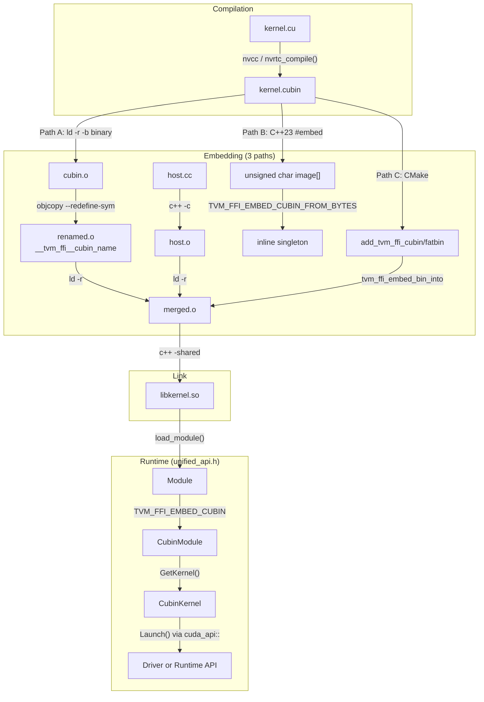

# FFI CUDA Extras (`tvm/ffi/extra/cuda/`)

**TL;DR**.
- A header-only C++ utility layer under `tvm/ffi/extra/cuda/` for CUDA kernel loading, launching, and device management. Four headers form a layered stack: `base.h` (pure-C++ `dim3` struct, no CUDA headers), `internal/unified_api.h` (compile-time switching between CUDA Driver API and Runtime API >= 12.8 via `cuda_api::` namespace), `cubin_launcher.h` (CUBIN module/kernel loading through unified types), and `device_guard.h` (RAII device switching).
- `dtype_trait<T>` template (`tvm/ffi/extra/dtype.h`) provides compile-time mapping from 25 C++ types (CPU, CUDA `__nv_*`, HIP `__hip_*`) to `DLDataType`. Python `tvm_ffi.cpp.to_cpp_dtype()` provides the inverse mapping with backend-aware dispatch.
- Python-side tooling: `tvm_ffi.cpp.nvrtc.nvrtc_compile()` for NVRTC compilation to CUBIN, `tvm_ffi.utils.embed_cubin` for merging CUBIN data into object files, and `embed_cubin` parameter on `build_inline`/`load_inline` for end-to-end JIT workflows.
- CMake utilities: declarative `add_tvm_ffi_cubin`, `add_tvm_ffi_fatbin`, and `tvm_ffi_embed_bin_into` target-based functions (replaced older imperative `tvm_ffi_generate_cubin`/`tvm_ffi_embed_cubin`).

## Problem Statement
### Background
- ML kernel libraries often ship pre-compiled CUDA kernels (CUBIN) alongside C++ host code. Developers needed a way to embed CUBIN data into shared libraries and load/launch kernels at runtime -- without requiring full CUDA Toolkit compilation of the host code.
- Multi-GPU systems require device context management. Without an RAII guard, developers must manually save/restore device indices around CUDA calls, which is error-prone and verbose.

### Solution
- `tvm::ffi::cuda_api` unified namespace (`internal/unified_api.h`) provides compile-time switching between CUDA Runtime API (>= 12.8) and Driver API via `TVM_FFI_CUBIN_LAUNCHER_USE_DRIVER_API` macro. All CUDA types (`StreamHandle`, `LibraryHandle`, `KernelHandle`, `ResultType`) resolve to the appropriate vendor types at compile time.
- `CubinModule` and `CubinKernel` use `cuda_api::` unified types to load CUBIN from embedded memory and launch kernels with arbitrary argument packs.
- `TVM_FFI_EMBED_CUBIN(name)` and `TVM_FFI_EMBED_CUBIN_FROM_BYTES(name, imageBytes)` macros generate singleton accessors for embedded CUBIN data, following the `__tvm_ffi__cubin_<name>` symbol naming convention. The `FROM_BYTES` variant supports C++23 `#embed` and `bin2c` workflows.
- `CUDADeviceGuard` saves the current CUDA device index on construction and restores it on destruction, with lazy-set optimization (no-op if target matches current).
- `dtype_trait<T>` provides compile-time C++ type to `DLDataType` mapping for CPU, CUDA, and HIP types. Python `to_cpp_dtype()` provides the reverse mapping.
- Python-side NVRTC compilation and binary embedding close the loop: compile CUDA source to CUBIN at runtime, embed into JIT-compiled shared libraries, load and call from Python.

### Goals
- Header-only C++ CUDA utilities (no compilation into `libtvm_ffi.so`; users link `CUDA::cudart` themselves).
- Portable across CUDA Driver and Runtime APIs (compile-time selection).
- Compile-time dtype mapping between C++ types and DLPack dtypes.
- End-to-end Python-driven CUBIN compilation and embedding.
- Declarative CMake integration for static build workflows.
- Non-goal: wrapping the full CUDA driver API beyond kernel loading and launching.

## Design



### Key Classes, Fields and Interfaces

```python
# === tvm/ffi/extra/cuda/base.h ===
# Pure C++ header -- NO CUDA headers included.

class dim3:
    """3D dimension for CUDA launch configuration."""
    x: int  # unsigned int, default 1
    y: int  # unsigned int, default 1
    z: int  # unsigned int, default 1
    # Extension: mirrors cuda dim3; accepts 1, 2, or 3 args
    # Note: moved from cubin_launcher.h to base.h (b16f11f6) to break CUDA header dependency

# === tvm/ffi/extra/cuda/internal/unified_api.h ===
# Compile-time switch: TVM_FFI_CUBIN_LAUNCHER_USE_DRIVER_API
# Auto-selects: CUDA >= 12.8 -> Runtime API (0), else Driver API (1)
# User override: define before including

# namespace tvm::ffi::cuda_api
StreamHandle  = "CUstream | cudaStream_t"    # based on API selection
DeviceHandle  = "CUdevice | int"
LibraryHandle = "CUlibrary | cudaLibrary_t"
KernelHandle  = "CUkernel | cudaKernel_t"
ResultType    = "CUresult | cudaError_t"
# Invariant: kSuccess == CUDA_SUCCESS or cudaSuccess depending on API

def LoadLibrary(library: "LibraryHandle*", image: "const void*") -> ResultType: ...
    # Interacts with: cuLibraryLoadData / cudaLibraryLoadData
def UnloadLibrary(library: LibraryHandle) -> ResultType: ...
def GetKernel(kernel: "KernelHandle*", library: LibraryHandle, name: str) -> ResultType: ...
def LaunchKernel(kernel: KernelHandle, args: "void**", grid: dim3, block: dim3,
                 stream: StreamHandle, dyn_smem_bytes: int = 0) -> ResultType: ...
    # Invariant: Driver API casts KernelHandle to CUfunction via reinterpret_cast
def GetDeviceHandle(device_id: int) -> DeviceHandle: ...
    # Invariant: Driver API calls cuDeviceGet; Runtime API returns device_id as-is
def GetDeviceCount(count: "int*") -> ResultType: ...
def GetDeviceAttribute(value: "int*", attr: "DeviceAttrType", device: DeviceHandle) -> ResultType: ...

# --- Extended launch for SM90+ cluster dimensions (adac5ebd) ---

def LaunchKernelEx(kernel: KernelHandle, args: "void**", config: "LaunchConfig") -> ResultType:
    """Extended kernel launch with pre-built LaunchConfig (SM90+ cluster support).
    # Driver API: cuLaunchKernelEx(&config, kernel, args, nullptr)
    # Runtime API: cudaLaunchKernelExC(&config, kernel, args)
    # Invariant: config must be built via ConstructLaunchConfig
    # Interacts with: CubinKernel.LaunchEx
    """
    ...

def ConstructLaunchConfig(
    kernel: KernelHandle, stream: StreamHandle,
    smem_size: "uint32_t", grid: dim3, block: dim3,
    cluster_dim: int,               # 1 = no cluster; >1 enables SM90 cluster
    config: "LaunchConfig",         # [out] populated by this call
    attr: "LaunchAttrType",         # [out] storage for cluster attribute (must outlive launch)
) -> ResultType:
    """Build a LaunchConfig with optional cluster dimensions for SM90+ Hopper GPUs.
    # When cluster_dim > 1: sets CU_LAUNCH_ATTRIBUTE_CLUSTER_DIMENSION / cudaLaunchAttributeClusterDimension
    # Invariant: attr must outlive the launch (config references it by pointer)
    # Interacts with: LaunchKernelEx, CubinKernel.LaunchEx
    """
    ...

# Macro split (10cb004): two distinct CUDA error check macros:
#
# Macro: TVM_FFI_CHECK_CUDA_ERROR (in base.h -- runtime-only)
# err: cudaError_t = stmt
# if err != cudaSuccess:
#     raise RuntimeError(f"CUDA Runtime Error: {cudaGetErrorName(err)} ({err}): {cudaGetErrorString(err)}")
# Interacts with: cudaGetErrorName, cudaGetErrorString, TVM_FFI_THROW(RuntimeError)
# Invariant: ONLY works with cudaError_t (Runtime API). NOT for CUresult (Driver API).
#
# Macro: TVM_FFI_CHECK_CUBIN_LAUNCHER_CUDA_ERROR (in unified_api.h -- unified Driver/Runtime)
# err: cuda_api::ResultType = stmt
# if err != cuda_api::kSuccess:
#     cuda_api::GetErrorString(err, &name, &desc)
#     raise RuntimeError(f"CUDA Error: {name} ({err}): {desc}")
# Interacts with: cuda_api::ResultType, cuda_api::kSuccess, cuda_api::GetErrorString
# Invariant: uses unified types -- works with EITHER Driver or Runtime API
# Invariant: scope restricted to cubin launcher code paths only

# === tvm/ffi/extra/cuda/device_guard.h ===

class CUDADeviceGuard:
    """RAII guard: saves current CUDA device on construction, restores on destruction."""
    original_device_index_: int
    target_device_index_: int
    # Invariant: default constructor deleted -- device_index is required
    # Invariant: if target == current, no cudaSetDevice calls are made (lazy-set optimization)
    # Invariant: destructor is noexcept(false) -- CUDA errors on restore will throw
    # Interacts with: cudaGetDevice, cudaSetDevice, TVM_FFI_CHECK_CUDA_ERROR (base.h, runtime-only)
    # Note: device_guard.h now includes base.h (not unified_api.h), reducing compile dependencies (10cb004)
    # Extension: analogous to c10::cuda::CUDAGuard in PyTorch

    def __init__(self, device_index: int) -> None: ...
    def __del__(self) -> None: ...  # restores original device if changed

# === tvm/ffi/extra/cuda/cubin_launcher.h ===

class CubinModule:
    """RAII wrapper around cuda_api::LibraryHandle for loading CUBIN from memory."""
    library_: "cuda_api::LibraryHandle"  # unified type
    # Invariant: non-copyable, movable. Library unloaded on destruction.
    # Interacts with: cuda_api::LoadLibrary, cuda_api::UnloadLibrary

    def __init__(self, data: "const char*") -> None: ...
    def __init__(self, data: "const unsigned char*") -> None: ...  # enables #embed / bin2c
    def __init__(self, data: "Bytes") -> None: ...
    def GetKernel(self, name: str) -> "CubinKernel": ...
    def GetKernelWithMaxDynamicSharedMemory(
        self, name: str, dynamic_smem_max: int = -1
    ) -> "CubinKernel": ...
        # Invariant: -1 means auto-compute max (device_max - kernel_static_smem)
    def __getitem__(self, name: str) -> "CubinKernel": ...

class CubinKernel:
    """Handle for a loaded CUDA kernel, ready to launch."""
    kernel_: "cuda_api::KernelHandle"  # unified type
    # Invariant: non-copyable, movable. No explicit cleanup needed.
    # Interacts with: cuda_api::GetKernel, cuda_api::LaunchKernel

    def __init__(self, library: "cuda_api::LibraryHandle", name: str) -> None: ...
    def Launch(
        self,
        args: "void**",
        grid: dim3,
        block: dim3,
        stream: "cuda_api::StreamHandle",  # unified type
        dyn_smem_bytes: int = 0,
    ) -> "cuda_api::ResultType": ...  # unified return type
        # Invariant: args[i] must point to the value, not be the value itself

    def LaunchEx(
        self,
        args: "void**",
        config: "cuda_api::LaunchConfig",
    ) -> "cuda_api::ResultType": ...
        # Extended launch with pre-built LaunchConfig (adac5ebd)
        # Interacts with: cuda_api::LaunchKernelEx, ConstructLaunchConfig
        # Extension: use for SM90+ cluster launches (multi-block cooperative execution)

    def SetMaxDynamicSharedMemory(self, max_bytes: int) -> None: ...

# Macro expansion (pseudocode for TVM_FFI_EMBED_CUBIN(name)):
# extern "C" const char __tvm_ffi__cubin_{name}[];
# extern "C" const char __tvm_ffi__cubin_{name}_end[];
# struct EmbedCubinModule_{name} {
#     CubinModule mod{__tvm_ffi__cubin_{name}};
#     static EmbedCubinModule_{name}* Global() { static auto* inst = new ...; return inst; }
# };
# Interacts with: embed_cubin utility (creates the __tvm_ffi__cubin_* symbols)

# Macro expansion (pseudocode for TVM_FFI_EMBED_CUBIN_FROM_BYTES(name, imageBytes)):
# struct EmbedCubinModule_{name} {
#     CubinModule mod{imageBytes};        # loads from unsigned char[]
#     static EmbedCubinModule_{name}* Global() { static inst; return &inst; }
# };
# Interacts with: CubinModule(const unsigned char*) constructor
# Extension: use with C++23 #embed or bin2c-generated arrays

# === tvm/ffi/extra/dtype.h (NEW) ===

class dtype_trait(Generic[T]):
    """Maps a C++ type T to its corresponding DLDataType at compile time."""
    value: DLDataType  # constexpr static
    # Interacts with: dlpack/dlpack.h (DLDataType, DLDataTypeCode enum)
    # Invariant: each specialization sets lanes=1 except packed types (e.g., __nv_fp4x2_e2m1 -> lanes=2)
    # Extension: specialize dtype_trait<T> for new vendor types

# Supported specializations (25 total):
# CPU: signed/unsigned char, short, int, long, long long; float, double; bool
# CUDA: __half, __nv_bfloat16, __nv_fp8_e4m3, __nv_fp8_e5m2, __nv_fp8_e8m0, __nv_fp4_e2m1, __nv_fp4x2_e2m1
# HIP: __hip_bfloat16, hip_bfloat16, __hip_fp8_e4m3, __hip_fp8_e4m3_fnuz, __hip_fp8_e5m2, __hip_fp8_e5m2_fnuz, __hip_fp4_e2m1, __hip_fp4x2_e2m1

# === Python: tvm_ffi.cpp.dtype (NEW) ===

def to_cpp_dtype(dtype_str: "str | torch.dtype") -> str:
    """Convert a dtype string or torch.dtype to its C++ type name.
    Backend-aware: checks CPU types first, then CUDA/ROCm types based on torch availability."""
    # Interacts with: CPU_DTYPE_MAP, CUDA_DTYPE_MAP, ROCM_DTYPE_MAP (lookup tables)
    # Invariant: strips "torch." prefix if present
    # Invariant: raises ValueError for unsupported dtype strings
    # Extension: add new entries to the dtype maps for new hardware types

# === Python: tvm_ffi.cpp.nvrtc ===

def nvrtc_compile(
    source: str,
    *,
    name: str = "kernel.cu",
    arch: str | None = None,
    extra_opts: Sequence[str] | None = None,
) -> bytes:
    """Compile CUDA source to CUBIN using NVRTC."""
    # Interacts with: cuda.bindings.nvrtc (requires cuda-python package)
    # Interacts with: cuda.bindings.driver (for auto-detecting GPU arch if arch=None)
    # Invariant: raises RuntimeError if cuda-python not installed

# === Python: tvm_ffi.utils.embed_cubin ===

def embed_cubin(
    cubin_path: Path,
    input_obj_path: Path,
    output_obj_path: Path,
    name: str,
    verbose: bool = False,
) -> None:
    """Embed CUBIN binary into an existing object file."""
    # Pipeline: ld -r -b binary -> objcopy --redefine-sym -> ld -r merge
    # Invariant: requires GNU binutils (ld, objcopy) in PATH
    # Invariant: Unix/Linux only (not Windows)

# === CMake: cmake/Utils/EmbedCubin.cmake (REFACTORED) ===

# NEW declarative target-based functions:
# add_tvm_ffi_cubin(<target> CUDA <source>)
#   Creates OBJECT library compiling .cu to .cubin
#   Interacts with: CMAKE_CUDA_ARCHITECTURES, ObjectCopyUtil.cmake
# add_tvm_ffi_fatbin(<target> CUDA <source>)
#   Creates OBJECT library compiling .cu to .fatbin
# tvm_ffi_embed_bin_into(<target> SYMBOL <name> BIN <binary>)
#   Embeds CUBIN/FATBIN into target via PRE_LINK commands
#   Interacts with: tvm_ffi.utils.embed_cubin (Python tool)
#
# REMOVED (b16f11f6): tvm_ffi_generate_cubin(), tvm_ffi_embed_cubin()
# NEW: CMAKE_CUDA_RUNTIME_LIBRARY defaults to Shared if unset
# NEW: cmake/Utils/ObjectCopyUtil.cmake -- script-mode .cu.o -> .cubin/.fatbin copy
#   Simulates CUDA_{CUBIN,FATBIN}_COMPILATION for cmake < 3.27
# Backward compat: EmbedCubin.cmake checks for both tvm_ffi::header and tvm_ffi_header
```

### Contracts, Assumptions and Invariants
- **Unified API compile-time selection**: `TVM_FFI_CUBIN_LAUNCHER_USE_DRIVER_API` defaults to 0 (Runtime API) for CUDA >= 12.8, 1 (Driver API) otherwise. User can override. A `static_assert` prevents selecting Runtime API on CUDA < 12.8.
- **Symbol naming convention**: Embedded CUBIN data uses `__tvm_ffi__cubin_<name>` and `__tvm_ffi__cubin_<name>_end` symbols. These are created by `ld -r -b binary` + `objcopy --redefine-sym` and consumed by `TVM_FFI_EMBED_CUBIN(name)`. The double-underscore `__tvm_ffi__` prefix places them in the internal symbol namespace (distinct from user-exported `__tvm_ffi_<func>` symbols).
- **CUBIN module lifetime**: `CubinModule` owns the `cuda_api::LibraryHandle`. Kernels obtained from it reference the library but do not extend its lifetime -- `CubinKernel` must not outlive its parent `CubinModule`. The singleton macros ensure the module lives for the process duration.
- **Launch argument layout**: `CubinKernel::Launch` takes `void** args` where each `args[i]` is a *pointer to* the argument value, not the value itself. This matches both `cudaLaunchKernel` and `cuLaunchKernel` conventions.
- **dtype_trait invariant**: Each `dtype_trait<T>` specialization sets `lanes=1` except for packed types (e.g., `__nv_fp4x2_e2m1` -> `lanes=2`). Forward-declares CUDA/HIP types to keep the header standalone.
- **Header-only, not in libtvm_ffi**: All CUDA extras are header-only. Users must link `CUDA::cudart` independently.
- **Platform limitations**: `embed_cubin` Python utility requires GNU binutils (`ld`, `objcopy`). Not available on Windows.
- **ROCm stream correctness** (37d0485b): On ROCm (HIP), `CurrentWorkStream` must use `c10::hip::getCurrentHIPStreamMasqueradingAsCUDA` (not the CUDA path). The Python-side `_optional_torch_c_dlpack.py` force-overrides the addon capsule on ROCm even if `__dlpack_c_exchange_api__` is already set, ensuring the corrected stream callback is active. This is gated by `BUILD_WITH_ROCM` preprocessor flag.
- **Cluster launch lifetime**: For `LaunchEx` with cluster dimensions (adac5ebd), the `LaunchAttrType` passed to `ConstructLaunchConfig` must outlive the `LaunchKernelEx` call (config references it by pointer).

### Extension Points
- **New CUDA utilities**: Add new headers under `tvm/ffi/extra/cuda/` that include `base.h` for the dim3 type and `internal/unified_api.h` for the error-checking macro.
- **Custom CUBIN sources**: The `embed_cubin` parameter on `build_inline` accepts arbitrary `Mapping[str, bytes]`, so CUBIN data can come from any source (NVRTC, nvcc, external compilers). The `FROM_BYTES` macro supports C++23 `#embed` and `bin2c` workflows.
- **Dynamic shared memory**: `GetKernelWithMaxDynamicSharedMemory` auto-computes max dynamic shared memory from the device and kernel's static usage.
- **New dtype mappings**: Specialize `dtype_trait<T>` for additional vendor types (e.g., Intel AMX). Add entries to Python dtype maps (`CPU_DTYPE_MAP`, `CUDA_DTYPE_MAP`, `ROCM_DTYPE_MAP`).

### Usage Examples

#### End-to-end: Compile CUDA kernel, embed CUBIN, launch from Python
**Context**: JIT workflow where CUDA source is compiled at runtime and embedded into a C++ host wrapper.
```python
from tvm_ffi import cpp
from tvm_ffi.cpp import nvrtc

# 1. Compile CUDA kernel to CUBIN
cuda_src = 'extern "C" __global__ void add_one(float* x, float* y, int n) { int i = ...; y[i] = x[i] + 1; }'
cubin = nvrtc.nvrtc_compile(cuda_src)

# 2. Write C++ host wrapper using TVM_FFI_EMBED_CUBIN
host_code = """
#include <tvm/ffi/extra/cuda/cubin_launcher.h>
TVM_FFI_EMBED_CUBIN(my_cubin);

void AddOne(tvm::ffi::TensorView x, tvm::ffi::TensorView y) {
  static auto kernel = TVM_FFI_EMBED_CUBIN_GET_KERNEL(my_cubin, "add_one");
  int64_t n = x.size(0);
  void* xp = x.data_ptr(); void* yp = y.data_ptr();
  int ni = static_cast<int>(n);
  void* args[] = {&xp, &yp, &ni};
  TVM_FFI_CHECK_CUDA_ERROR(
    kernel.Launch(args, tvm::ffi::dim3((n+255)/256), tvm::ffi::dim3(256), nullptr));
}
"""

# 3. JIT compile with embedded CUBIN
mod = cpp.load_inline("my_mod", cpp_sources=host_code,
                       functions=["AddOne"],
                       embed_cubin={"my_cubin": cubin},
                       extra_ldflags=["-lcudart"])
```

#### Using CUDADeviceGuard in a multi-GPU kernel wrapper
**Context**: An exported function receives tensors from a specific GPU device and needs to ensure CUDA operations target the correct device.
```cpp
#include <tvm/ffi/extra/cuda/device_guard.h>
#include <tvm/ffi/container/tensor.h>

void MatMul(ffi::TensorView a, ffi::TensorView b, ffi::TensorView out) {
  ffi::CUDADeviceGuard guard(a.device().device_id);
  // All CUDA calls here target a's device
  // ...
}  // Original device restored here
```

#### SM90+ Cluster Launch via LaunchEx (adac5ebd)
**Context**: Launching a kernel with cluster dimensions on Hopper GPUs (SM90+).
```cpp
CubinKernel kernel = module.GetKernel("my_cluster_kernel");
cuda_api::LaunchConfig config;
cuda_api::LaunchAttrType attr;  // must outlive the launch
cuda_api::ConstructLaunchConfig(
    kernel.GetHandle(), stream, shared_mem_bytes,
    {grid_x, 1, 1}, {block_x, 1, 1},
    /*cluster_dim=*/4,  // 4-block cluster for SM90
    config, attr);
kernel.LaunchEx(args.data(), config);
```

#### Embedding CUBIN from C++23 #embed byte array
**Context**: Modern C++ workflow using `TVM_FFI_EMBED_CUBIN_FROM_BYTES` for byte-array CUBIN data.
```cpp
#include <tvm/ffi/extra/cuda/cubin_launcher.h>

constexpr unsigned char image[]{
#embed "kernel_fatbin.fatbin"
};
TVM_FFI_EMBED_CUBIN_FROM_BYTES(env, image);

void Launch(cuda_api::StreamHandle stream) {
  static auto kernel = TVM_FFI_EMBED_CUBIN_GET_KERNEL(env, "add_one_cuda");
  void* args[] = {&x_ptr, &y_ptr, &n};
  TVM_FFI_CHECK_CUDA_ERROR(
      kernel.Launch(args, tvm::ffi::dim3(grid_size), tvm::ffi::dim3(256), stream));
}
```

#### CMake declarative build workflow
**Context**: Pre-compiled CUBIN integration via new target-based CMake functions.
```cmake
find_package(tvm_ffi CONFIG REQUIRED)
find_package(CUDAToolkit REQUIRED)
include(cmake/Utils/EmbedCubin.cmake)

add_tvm_ffi_fatbin(kernel_fatbin CUDA src/kernel.cu)
add_library(mylib SHARED src/lib.cc)
tvm_ffi_embed_bin_into(mylib SYMBOL env BIN "$<TARGET_OBJECTS:kernel_fatbin>")
target_link_libraries(mylib PRIVATE tvm_ffi::header CUDA::cudart)
```

#### dtype_trait: compile-time dtype lookup for kernel template instantiation
**Context**: Using `dtype_trait<T>` to select kernel specializations by DLPack dtype.
```cpp
#include <tvm/ffi/extra/dtype.h>

template <typename T>
void register_kernel() {
    DLDataType dt = tvm_ffi::dtype_trait<T>::value;
    // Use dt.code, dt.bits, dt.lanes to select kernel specialization
}

register_kernel<float>();           // -> {kDLFloat, 32, 1}
register_kernel<__nv_bfloat16>();   // -> {kDLBfloat, 16, 1}
```

#### Python to_cpp_dtype for JIT code generation
**Context**: Using `to_cpp_dtype()` to generate C++ kernel source with correct vendor types.
```python
from tvm_ffi.cpp import to_cpp_dtype

cpp_type = to_cpp_dtype("float16")       # "__half" (CUDA or ROCm)
cpp_type = to_cpp_dtype("torch.bfloat16") # "__nv_bfloat16" (CUDA) or "__hip_bfloat16" (ROCm)
source = f"void kernel({cpp_type}* data) {{ ... }}"
mod = cpp.load_inline("my_mod", cpp_sources=source, functions=["kernel"])
```

## Implementation Notes
- `CubinModule` uses the `cuda_api::` unified namespace, which resolves to CUDA Runtime Library API (`cudaLibraryLoadData`) on CUDA >= 12.8 or Driver API (`cuLibraryLoadData`) on older versions. The compile-time switch is `TVM_FFI_CUBIN_LAUNCHER_USE_DRIVER_API`.
- For the Driver API path, `CubinKernel::Launch` casts `CUkernel` to `CUfunction` via `reinterpret_cast` for `cuLaunchKernel`.
- The `embed_cubin` Python tool uses a multi-step pipeline: `ld -r -b binary` creates a relocatable object from raw binary, then `objcopy --redefine-sym` renames the auto-generated `_binary_*` symbols to the `__tvm_ffi__cubin_*` convention, and finally `ld -r` merges it with the host object.
- The Ninja build pipeline in `extension.py` adds two extra rules (`merge_objects`, `embed_cubin`) when `embed_cubin` is passed.
- `dtype_trait<T>` uses internal helper templates (`integer_trait<T>`, `float_trait<T>`) that auto-derive `DLDataTypeCode` and bit width from `sizeof(T)`. CUDA/HIP types are forward-declared, keeping the header standalone.

## Alternatives & Trade-offs
### Header-Only vs. Compiled into libtvm_ffi
- Pros of header-only (chosen): No CUDA dependency in the core library. Users only pay the CUDA linkage cost if they use these headers.
- Cons: Users must manage `CUDA::cudart` linkage themselves. Cannot ship pre-compiled utility functions.

### Decision Record
**Decision**: Use compile-time unified `cuda_api::` namespace with Driver/Runtime API switching rather than runtime API detection.

**Drivers**: Need to support CUDA versions before 12.8 (which lack Runtime Library API) while preferring the simpler Runtime Library API when available.

**Alternative A (chosen): Compile-time switching via `TVM_FFI_CUBIN_LAUNCHER_USE_DRIVER_API`**
- Pros: Zero runtime overhead. Type aliases resolve at compile time. `static_assert` catches invalid configurations. Clear error messages.
- Cons: Cannot switch API at runtime. Users targeting both old and new CUDA must compile separate builds or rely on the auto-detection macro.

**Alternative B: Runtime API detection via `dlsym`/function pointer loading**
- Pros: Single binary works across CUDA versions.
- Cons: Runtime overhead for every call. Complex error handling. Harder to debug type mismatches.
### Embedded CUBIN vs. PTX JIT
- Pros of embedded CUBIN (chosen): Deterministic performance (no JIT overhead at load time). Pre-compiled for target architecture.
- Cons: Must compile CUBIN per architecture. PTX JIT would allow a single build for all GPUs but adds startup latency.

### Decision Record
**Decision**: Use `__tvm_ffi__cubin_<name>` symbol naming and `ld -r` binary embedding rather than a custom binary format.

**Drivers**: Need a way to embed arbitrary binary data (CUBIN) into shared libraries that is toolchain-standard and does not require custom loaders.

**Alternative A (chosen): ld -r -b binary + objcopy rename**
- Pros: Uses standard toolchain. Symbols are regular ELF symbols accessible via `extern "C"`. Works with any linker. The `__tvm_ffi__cubin_*` prefix avoids collisions.
- Cons: Requires GNU binutils on the build machine. Not available on Windows (platform limitation documented).

**Alternative B: Custom binary section (.cubin) with custom loader**
- Pros: Would work on Windows too. Full control over format.
- Cons: Requires custom section parsing at load time. Non-standard. More code to maintain.

### Evolution Timeline
| Commit | Change | Significance |
|--------|--------|--------------|
| d49effdb | CubinModule, CubinKernel, dim3, macros, nvrtc_compile, embed_cubin, CMake utils | Foundation |
| cdfd0410 | CUDADeviceGuard, TVM_FFI_CHECK_CUDA_ERROR extraction | Device management |
| b16f11f6 | Unified `cuda_api::` namespace, `TVM_FFI_EMBED_CUBIN_FROM_BYTES`, declarative CMake, dim3 moved to base.h | Driver/Runtime API unification |
| c51e519b | `dtype_trait<T>`, `to_cpp_dtype()` | Compile-time dtype mapping |

## Evidence
| Commit | Scope | Contribution |
|--------|-------|-------------|
| d49effdb | ffi/extra/cuda, python/tvm_ffi/cpp | Foundation: CubinModule, CubinKernel, dim3, embed macros, nvrtc, CMake |
| cdfd0410 | ffi/extra/cuda | CUDADeviceGuard, TVM_FFI_CHECK_CUDA_ERROR extraction |
| b16f11f6 | ffi/extra/cuda, build/cmake | Unified cuda_api:: namespace, TVM_FFI_EMBED_CUBIN_FROM_BYTES, declarative CMake (add_tvm_ffi_cubin/fatbin/embed_bin_into), ObjectCopyUtil.cmake |
| c51e519b | ffi/extra, python/tvm_ffi/cpp | dtype_trait<T> header, to_cpp_dtype() Python function |
| 10cb004 | ffi/extra/cuda, build/ci | Split `TVM_FFI_CHECK_CUDA_ERROR` into runtime-only (base.h) and unified (TVM_FFI_CHECK_CUBIN_LAUNCHER_CUDA_ERROR in unified_api.h); device_guard.h now includes base.h only |
| 692a41a | ffi/extra/cuda | Fixed missing unified_api.h include in device_guard.h |
| adac5ebd | ffi/extra/cuda | `LaunchKernelEx`, `ConstructLaunchConfig`, `CubinKernel::LaunchEx` for SM90+ cluster dims |
| 37d0485b | python/ffi-bindings, ffi/extra/cuda | Fixed ROCm `CurrentWorkStream` to use HIP stream; force addon override on HIP |
| Plus 2 supporting commits: 803cdc84, db53ce4f (documentation) |

## Related Design Docs & ADRs
- [0005-error-protocol.md](0005-error-protocol.md) -- `TVM_FFI_THROW(RuntimeError)` used by `TVM_FFI_CHECK_CUDA_ERROR`
- [0006-containers.md](0006-containers.md) -- `TensorView` used in kernel wrapper signatures
- [0011-module-system.md](0011-module-system.md) -- `load_module()` loads the compiled shared library
- [0014-cpp-extension.md](0014-cpp-extension.md) -- `build_inline`/`load_inline` extended with `embed_cubin` parameter
- [0013-packaging.md](0013-packaging.md) -- `TVM_FFI_DLL_EXPORT_TYPED_FUNC` for host wrapper export, CMake `find_package`
