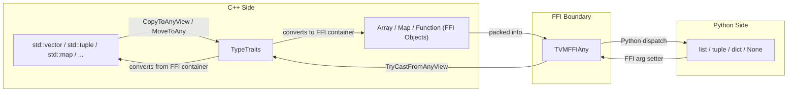

# FFI STL Container Bridge (`stl.h`)

**TL;DR**.
- `tvm/ffi/extra/stl.h` is an opt-in header providing `TypeTraits<T>` specializations for 8 C++ STL types (`std::vector`, `std::array`, `std::tuple`, `std::optional`, `std::variant`, `std::map`, `std::unordered_map`, `std::function`), enabling transparent conversion when crossing the FFI boundary.
- STL types are never stored directly in `TVMFFIAny` (`storage_enabled = false`). They always round-trip through intermediate FFI objects (`Array`, `Map`, `Function`), which means every crossing involves a copy.
- Users write vanilla C++ signatures with STL types and export via `TVM_FFI_DLL_EXPORT_TYPED_FUNC`; the FFI machinery handles conversion automatically. From Python, callers use native Python types (lists, tuples, dicts, None).

## Problem Statement
### Background
- The FFI type system (`TypeTraits<T>`) natively supports FFI container types (`Array`, `Map`, `Function`, etc.) but not C++ STL equivalents. Developers writing exported functions had to manually convert between STL and FFI types at every boundary.
- This created boilerplate and error-prone manual conversion code in every FFI export that wanted to use standard C++ types.

### Solution
- A header-only bridge that extends the `TypeTraits` protocol to STL types. Each STL type delegates to an existing FFI container type as the intermediate representation.
- An internal `STLTypeMismatch` exception serves as a sentinel for graceful fallback in nested type conversion attempts (caught by `TryCastFromAnyView`, never propagates to user code).

### Goals
- Zero boilerplate: users include one header and write standard C++ signatures.
- Transparent Python interop: Python callers use native types (list, tuple, dict, None).
- Non-goal: in-place storage of STL types in `TVMFFIAny` (always copy through FFI objects).
- Non-goal: mutable container round-trips (all conversions produce new FFI objects).

## Design



### Key Classes, Fields and Interfaces

```python
# --- Base class for all STL TypeTraits ---
class STLTypeTrait:
    """Base class disabling direct storage in TVMFFIAny."""
    storage_enabled: bool = False
    # Invariant: STL types ALWAYS round-trip through an intermediate FFI Object
    # Interacts with: TypeTraitsBase (parent)

# --- Internal sentinel ---
class STLTypeMismatch(Exception):
    """Caught by TryCastFromAnyView to signal type mismatch."""
    # Invariant: never propagates to user code
    # Interacts with: every STL TryCastFromAnyView catches this to return nullopt

# --- List-like types: all convert through ArrayObj ---

class TypeTraits_std_vector(Generic[T]):
    """Converts to/from Array. Variable length."""
    field_static_type_index = TypeIndex.kTVMFFIArray
    def CopyToAnyView(src: vector[T], out: AnyView_ptr) -> None: ...
        # Creates ArrayObj, copies each element via TypeTraits<T>::MoveToAny
    def TryCastFromAnyView(src: AnyView) -> Optional[vector[T]]: ...
        # Checks Array, casts each element via TypeTraits<T>::TryCastFromAnyView
    # Interacts with: ArrayObj.Empty, ArrayObj.MutableBegin

class TypeTraits_std_array(Generic[T, Nm]):
    """Converts to/from Array with compile-time length check."""
    field_static_type_index = TypeIndex.kTVMFFIArray
    # Invariant: Nm > 0 (static_assert). Array length must equal Nm on read-back.
    # Interacts with: ArrayObj.Empty, ArrayObj.MutableBegin

class TypeTraits_std_tuple(Generic[*Args]):
    """Converts to/from Array with per-element type check."""
    field_static_type_index = TypeIndex.kTVMFFIArray
    # Invariant: Array length must equal sizeof...(Args) on read-back.
    # Uses std::apply for correct move semantics (fixed in 88d5130d)
    # Interacts with: ArrayObj.Empty, ArrayObj.MutableBegin

# --- Optional: delegates to inner TypeTraits ---

class TypeTraits_std_optional(Generic[T]):
    """None maps to kTVMFFINone, value delegates to TypeTraits<T>."""
    # Invariant: TryCastFromAnyView returns optional<optional<T>>
    #   outer nullopt = cast failure, inner nullopt = the value is legitimately None
    # Interacts with: TypeTraits<T> (all methods delegated)

# --- Variant: tries alternatives in declaration order ---

class TypeTraits_std_variant(Generic[*Args]):
    """First matching alternative wins on read-back."""
    # Invariant: alternatives tried in declaration order; first CheckAnyStrict match wins
    # Extension: order alternatives most-specific to least-specific to avoid mis-dispatch
    # Interacts with: TypeTraits<Arg>::CheckAnyStrict for each alternative

# --- Map types: convert through MapObj ---

class TypeTraits_std_map(Generic[K, V]):
    """Converts to/from Map."""
    field_static_type_index = TypeIndex.kTVMFFIMap
    # Interacts with: MapObj.CreateFromRange<MapObj> (friend access required; templatized 5a6b211)

class TypeTraits_std_unordered_map(Generic[K, V]):
    """Converts to/from Map with reserve()."""
    field_static_type_index = TypeIndex.kTVMFFIMap
    # Interacts with: MapObj.CreateFromRange<MapObj> (friend access required; templatized 5a6b211)

# --- Function: wraps through TypedFunction ---

class TypeTraits_std_function(Generic[Ret, *Args]):
    """Wraps to/from TypedFunction."""
    field_static_type_index = TypeIndex.kTVMFFIFunction
    storage_enabled: bool = False
    # Interacts with: TypeTraits<TypedFunction<Ret(Args...)>> (proxied entirely)
```

### Contracts, Assumptions and Invariants
- **Copy semantics**: All conversions create new FFI objects. Modifying the original STL container after conversion does not affect the FFI object and vice versa.
- **Element type checking**: `TryCastFromAnyView` checks each element's type individually. A `vector<int>` will fail to cast from an `Array` containing a float.
- **Tuple move safety**: The fold expression in `CopyToTupleImpl` uses `std::apply` to unpack elements before forwarding, ensuring each element is moved exactly once (88d5130d fix).
- **Module-object lifetime**: When STL conversions produce FFI objects returned from module-loaded functions, the module must remain loaded until those objects are destroyed (or use `keep_module_alive=True` default).

### Extension Points
- Include `tvm/ffi/extra/stl.h` for automatic STL-FFI conversion.
- To add support for a new STL-like type, specialize `TypeTraits<T>` following the `STLTypeTrait` base class pattern: set `storage_enabled = false`, implement `CopyToAnyView`/`MoveToAny`/`TryCastFromAnyView`, and choose an intermediate FFI container.

### Usage Examples

#### C++ export with STL types, called from Python
**Context**: Define a function using nested STL types; the FFI bridge handles conversion automatically.
```cpp
#include <tvm/ffi/extra/stl.h>
#include <tvm/ffi/function.h>

auto sum_row(std::optional<std::vector<std::array<int, 2>>> arg)
    -> std::tuple<bool, std::vector<int>> {
  if (arg) {
    std::vector<int> result;
    for (const auto& row : *arg)
      result.push_back(row[0] + row[1]);
    return {true, result};
  }
  return {false, {}};
}
TVM_FFI_DLL_EXPORT_TYPED_FUNC(sum_row, sum_row);
```

```python
import tvm_ffi
mod = tvm_ffi.load_module("path/to/lib.so")
ok, sums = mod.sum_row([[1, 2], [3, 4]])   # -> (True, [3, 7])
result = mod.sum_row(None)                   # -> (False, [])
```

## Implementation Notes
- The `stl.h` header is under `tvm/ffi/extra/` (not core `tvm/ffi/`), signaling its opt-in nature. It is not included by any core header.
- A `friend` declaration was added to `MapObj` (now `MapBaseObj`, 5a6b211) to grant `TypeTraits` access to `CreateFromRange<MapObj>` for map conversions.
- `ListTemplate`/`MapTemplate` are internal tag types enabling shared conversion logic across list-like and map-like STL types respectively.
- The `std::function` specialization delegates entirely to `TypeTraits<TypedFunction<Sig>>` -- it does not implement its own conversion.

## Alternatives & Trade-offs
### Copy-through-FFI-object vs. Direct storage
- Pros of copy: Simpler implementation, no need to extend `TVMFFIAny` layout. FFI objects are already ref-counted and cross-language safe.
- Cons: Every boundary crossing copies the container. For large vectors, this can be expensive.
### STLTypeMismatch exception vs. return codes
- Pros of exception: Enables natural nested type checking (e.g., `optional<variant<int, string>>`). Code remains clean without threading error codes.
- Cons: Exception creation has overhead. Mitigated by catching at the outermost `TryCastFromAnyView` boundary.

## Evidence
| Commit | Scope | Contribution |
|--------|-------|-------------|
| c3fc8f7f | ffi/extra, ffi/type-traits | Introduced `stl.h` with 8 STL TypeTraits specializations |
| 88d5130d | ffi/extra/stl | Fixed use-after-move in tuple conversion via `std::apply` |
| 5a82940e | tests/python | Fixed module-object lifetime in STL test (scoped function pattern) |

## Related Design Docs & ADRs
- [0002-any-value-system.md](0002-any-value-system.md) -- TypeTraits protocol that stl.h extends
- [0006-containers.md](0006-containers.md) -- ArrayObj, MapObj used as intermediate representations
- [0004-function-system.md](0004-function-system.md) -- TypedFunction used by std::function bridge
- [0011-module-system.md](0011-module-system.md) -- Module lifetime rules for STL-converted objects
