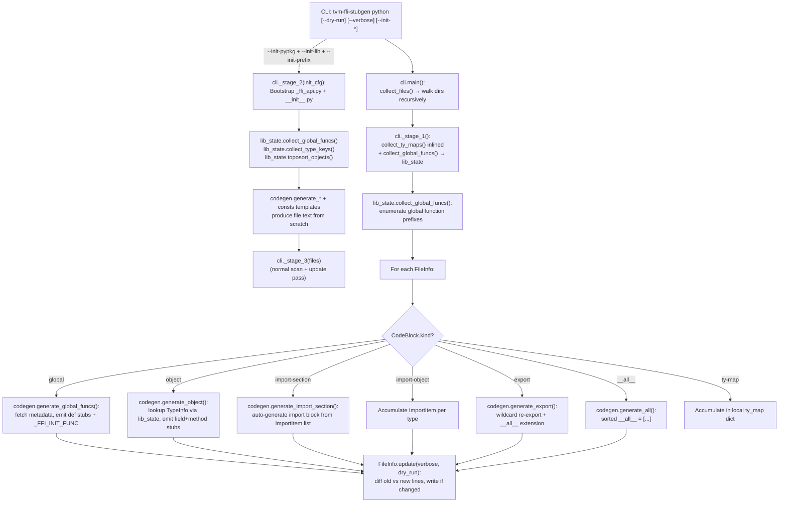

# Stub Generation — tvm-ffi-stubgen CLI

**TL;DR**
- `tvm-ffi-stubgen` is a CLI tool that scans `.py`/`.pyi` files for marker comments and fills enclosed blocks with `TYPE_CHECKING`-guarded stubs derived from TVM FFI's runtime reflection registry.
- Seven block kinds: `global/<prefix>` (global function signatures), `object/<type_key>` (fields + methods), `import-section` (auto-generated import blocks), `import-object` (per-type import injection), `export/<submod>` (wildcard re-export), `__all__` (auto-generated `__all__` export lists), `skip-file` (opt-out). A `ty_map` directive inside a block remaps type origin names in generated output.
- The tool consumes `TypeSchema` (0019), `TypeInfo`/`TypeField`/`TypeMethod` (0006/0013), and `get_registered_type_keys()` (0002) metadata — bridging the C++ reflection registry to Python type annotations with zero annotation drift.
- Seven-module staged pipeline: `consts.py` (marker constants, `FN_NAME_MAP`, template generators for `--init-*` mode), `file_utils.py` (parsing), `lib_state.py` (runtime metadata querying with `lru_cache`, `toposort_objects`), `codegen.py` (code generation), `utils.py` (`FuncInfo`/`ObjectInfo`/`NamedTypeSchema`/`ImportItem`/`InitConfig` IR), `cli.py` (tree-scanning CLI with `--init-*` bootstrap mode).
- `--init-*` bootstrap mode: providing `--init-pypkg`, `--init-lib`, `--init-prefix` triggers `_stage_2` which generates a complete `_ffi_api.py` + `__init__.py` pair for a new downstream FFI extension, discovering all registered types and global functions under the specified prefix.

## Problem Statement

### Background
Before commit ea02e646, Python stubs for TVM FFI objects and global functions were either absent or hand-authored. Every time a C++ field type or method signature changed, Python annotations would silently drift out of sync. The `# type: ignore[attr-defined]` comments in `_ffi_api.py` were a symptom of this gap.

### Solution
A marker-comment convention in `.py`/`.pyi` files paired with a CLI tool that queries the live TVM FFI registry and regenerates stub blocks in-place. The tool is idempotent: re-running on an already-generated file produces no changes.

### Goals
- Zero drift: stubs are regenerated from the same registry that drives runtime type checks.
- Opt-in via markers: no source file is modified without explicit `tvm-ffi-stubgen(begin):` markers.
- Invisible at runtime: all generated content is inside `if TYPE_CHECKING:` guards.
- Extensible via `ty_map`: downstream tools can remap concrete C++ type names to abstract Python protocols.

## Design

### Staged Pipeline Architecture



### Key Classes, Fields and Interfaces

```python
# ─── python/tvm_ffi/stub/consts.py ──────────────────────────────────────────
STUB_PREFIX    = "# tvm-ffi-stubgen("
STUB_BEGIN     = f"{STUB_PREFIX}begin):"
STUB_END       = f"{STUB_PREFIX}end)"
STUB_TY_MAP    = f"{STUB_PREFIX}ty-map):"
STUB_SKIP_FILE = f"{STUB_PREFIX}skip-file)"
STUB_IMPORT_OBJECT = f"{STUB_PREFIX}import-object):"
# NEW: per-type import injection; param is semicolon-separated (type_key, type_checking_only, alias)
# Invariant: STUB_BEGIN followed by "global/<prefix>", "object/<type_key>",
#            "import-section", "import-object", "export/<submod>", "__all__", or None

FN_NAME_MAP: dict[str, str] = {"__ffi_init__": "__c_ffi_init__"}
# Maps dunder method names from C++ reflection to Python stub aliases.
# Prevents C++ __ffi_init__ (FFI constructor) from shadowing Python's __init__.
# Interacts with: ObjectInfo.from_type_key() (method name aliasing during stub generation)
# Extension: add new entries to alias additional FFI dunder methods.

DEFAULT_SOURCE_EXTS = {".py", ".pyi"}

TY_MAP_DEFAULTS: dict[str, str]
# MERGED (commit b58c2e3d): old TY_TO_IMPORT dict absorbed into TY_MAP_DEFAULTS
# Maps: list → collections.abc.Sequence, dict → collections.abc.Mapping
#   AND: Any → typing.Any, Callable → typing.Callable, Object → tvm_ffi.Object,
#        Tensor → tvm_ffi.Tensor, dtype → tvm_ffi.dtype, Device → tvm_ffi.Device
# Invariant: default ty_map used as fallback for ALL type remapping (replaces separate TY_TO_IMPORT)

MOD_MAP = {"testing": "tvm_ffi.testing", "ffi": "tvm_ffi"}
# Interacts with: codegen type resolution — maps type key prefix to Python module

BUILTIN_TYPE_KEYS: set[str]
# NEW (commit b58c2e3d): type keys always considered "defined"; skipped in --init mode
# Contains: ffi.Bytes, ffi.Error, ffi.Function, ffi.Object, ffi.OpaquePyObject, ffi.String, ffi.Tensor

# Template generators for --init mode (produce scaffolding text written to new files)
def _prompt_globals(mod: str) -> str: ...        # global/ stub block skeleton
def _prompt_class_def(type_name, type_key, parent_type_name) -> str: ...  # class + object/ stub block
def _prompt_import_object(type_key, type_name) -> str: ...  # import-object directive line
PROMPT_IMPORT_SECTION: str   # ready-made import-section stub block text
PROMPT_ALL_SECTION: str      # ready-made __all__ stub block text


# ─── python/tvm_ffi/stub/file_utils.py ──────────────────────────────────────
STUB_BLOCK_KINDS: TypeAlias = Literal[
    "global", "object", "ty-map", "import-section", "import-object", "export", "__all__", None
]
# CHANGED (commit b58c2e3d): "import" → "import-section"; added "import-object", "export"

@dataclasses.dataclass
class CodeBlock:
    """A parsed stub block in a source file."""
    kind: STUB_BLOCK_KINDS
    param: str | tuple[str, ...]
    # CHANGED (commit b58c2e3d): was str; now str | tuple[str, ...]
    #   "global/<prefix>[@import_from]" → (prefix, import_from) tuple
    #   "import-object" → (type_key, type_checking_only, alias) 3-tuple
    #   "object/<type_key>" / "__all__" / "import-section" → plain str param
    lineno_start: int
    lineno_end: int | None
    lines: list[str]
    # Invariant: kind=None means a plain (non-stub) line outside any block
    # Interacts with: FileInfo, codegen.generate_global_funcs/generate_object/generate_import_section

    @property
    def indent(self) -> int: ...

    @staticmethod
    def from_begin_line(lineno: int, line: str) -> CodeBlock:
        # Invariant: raises ValueError for unknown stub types
        ...


@dataclasses.dataclass
class FileInfo:
    """Parsed metadata for a single .py file containing stub markers."""
    path: Path
    lines: tuple[str, ...]          # original file lines (immutable snapshot)
    code_blocks: list[CodeBlock]    # all blocks (stub + non-stub) in order
    # Interacts with: cli.main, codegen.generate_*

    def update(self, verbose: bool, dry_run: bool) -> bool:
        # RENAMED (commit b58c2e3d): show_diff → verbose
        # Invariant: only writes when generated content differs from current content
        # Invariant: idempotent — second run produces no change
        ...

    @staticmethod
    def from_file(file: Path) -> FileInfo | None:
        # Returns None if no markers found or skip-file present
        # Invariant: nested stubs (begin inside begin) raise ValueError
        ...


def collect_files(paths: list[Path]) -> list[FileInfo]:
    # Invariant: sorted by path for deterministic processing order
    # Interacts with: path_walk (compat wrapper for Path.walk on Python <3.12)
    ...


# ─── python/tvm_ffi/stub/lib_state.py (NEW — commit b58c2e3d; replaces analysis.py) ──
@functools.lru_cache(maxsize=None)
def object_info_from_type_key(type_key: str) -> ObjectInfo:
    """Cached ObjectInfo construction from a type key string."""
    # Interacts with: _lookup_or_register_type_info_from_type_key(), ObjectInfo.from_type_info()

def collect_global_funcs() -> dict[str, list[FuncInfo]]:
    # MOVED (commit b58c2e3d): was analysis.collect_global_funcs(files); now stateless
    # Interacts with: list_global_func_names(), get_global_func_metadata(), TypeSchema.from_json_str()

def collect_type_keys() -> dict[str, list[str]]:
    # NEW: used only in --init mode to enumerate objects to generate per prefix
    # Interacts with: GetRegisteredTypeKeys() (C++ binding)

def toposort_objects(type_keys: list[str]) -> list[ObjectInfo]:
    # NEW: returns ObjectInfo objects sorted by inheritance (parents before children)
    # Algorithm: Kahn's topological sort via heapq for deterministic ordering
    # Invariant: len(result) == len(unique type_keys) — no cycles in TVM FFI object hierarchy


# ─── python/tvm_ffi/stub/utils.py ───────────────────────────────────────────
@dataclasses.dataclass(init=False)
class NamedTypeSchema(TypeSchema):
    name: str
    def __init__(self, name: str, schema: TypeSchema) -> None: ...
    # Interacts with: TypeSchema.repr(), FuncInfo.gen(), ObjectInfo.gen_fields/gen_methods()

@dataclasses.dataclass
class FuncInfo:
    schema: NamedTypeSchema  # carries function signature as TypeSchema
    is_member: bool          # True for object methods; False for global functions

    @staticmethod
    def from_global_name(name: str) -> FuncInfo: ...
    # Invariant: schema.origin must be "Callable"

    def gen(self, ty_map: dict[str, str], indent: int) -> str: ...
    # Returns: "def <short_name>(_0: T0, ..., /) -> R: ..."
    # Invariant: uses FN_NAME_MAP for dunder aliasing before rendering

@dataclasses.dataclass
class ObjectInfo:
    fields: list[NamedTypeSchema]
    methods: list[FuncInfo]

    @staticmethod
    def from_type_key(type_key: str) -> ObjectInfo: ...
    # Interacts with: _lookup_or_register_type_info_from_type_key()

    def gen_fields(self, ty_map: dict[str, str], indent: int) -> list[str]: ...
    def gen_methods(self, ty_map: dict[str, str], indent: int) -> list[str]: ...
    # Invariant: method names pass through FN_NAME_MAP before output

@dataclasses.dataclass(frozen=True, eq=True)
class ImportItem:
    """A single import statement, concrete or TYPE_CHECKING-only. (NEW — commit b58c2e3d)"""
    mod: str
    name: str
    type_checking_only: bool = False
    alias: str | None = None
    # Normalizes: splits dotted name into (mod, name); applies MOD_MAP on mod
    # Properties: name_with_alias → "name as alias" or "name"; full_name → "mod.name"
    # Invariant: frozen so usable in sets; __str__ returns valid Python import statement
    # Interacts with: codegen.generate_import_section(), codegen._type_suffix_and_record()

@dataclasses.dataclass
class InitConfig:
    """Configuration for --init-* package bootstrapping mode. (NEW — commit b58c2e3d)"""
    pkg: str            # Python package name (wheel name), e.g. "my-ffi-extension"
    shared_target: str  # CMake target name for the .so, e.g. "my_ffi_extension"
    prefix: str         # Registry prefix to include, e.g. "my_ffi_extension."
    # Interacts with: cli._stage_2(), codegen.generate_*


# ─── python/tvm_ffi/stub/codegen.py ─────────────────────────────────────────
def generate_global_funcs(
    code: CodeBlock,
    global_funcs: list[FuncInfo],
    ty_map: dict[str, str],      # CHANGED (commit b58c2e3d): was Callable[[str], str]
    imports: list[ImportItem],   # NEW: accumulator for import-section generation
    opt: Options,
) -> None:
    # ADDED (commit b58c2e3d): emits _FFI_INIT_FUNC("prefix", __name__) before if TYPE_CHECKING
    # Invariant: __ffi_init__ is renamed to __c_ffi_init__ via FN_NAME_MAP (avoids Python __init__ conflict)
    # Invariant: static methods are preceded by @staticmethod
    # Invariant: all arguments are positional-only (_0, _1, /)
    # Interacts with: FuncInfo, ObjectInfo (via utils.py), TypeSchema (0019)
    ...

def generate_object(
    code: CodeBlock,
    ty_map: dict[str, str],      # CHANGED (commit b58c2e3d): was Callable[[str], str]
    imports: list[ImportItem],   # NEW
    opt: Options,
    obj_info: ObjectInfo,        # NEW: caller pre-fetches ObjectInfo (enables caching in lib_state)
) -> None: ...

def generate_import_section(
    code: CodeBlock,
    imports: list[ImportItem],   # CHANGED (commit b58c2e3d): was set[str] of dotted type names
    opt: Options,
) -> None:
    # RENAMED from generate_imports (commit b58c2e3d)
    # Splits imports into concrete + TYPE_CHECKING buckets; adds TYPE_CHECKING guard if needed
    ...

def generate_export(code: CodeBlock, submod: str, opt: Options) -> None:
    # NEW (commit b58c2e3d): "export/<submod>" block kind
    # Generates: from .<submod> import * + __all__ extension from submod.__all__
    ...

def generate_all(code: CodeBlock, names: set[str], opt: Options) -> None:
    # NEW (commit 92e150b9): Generate sorted __all__ = [...] within a stubgen block
    # Generates: __all__ = ["name1", "name2", ...] (sorted, within begin/end markers)
    ...


# ─── python/tvm_ffi/stub/cli.py ─────────────────────────────────────────────
class Options:
    """CLI options for stub generation."""
    dry_run: bool
    verbose: bool
    imports: list[str]        # NEW (commit b58c2e3d): modules to importlib.import_module before scanning
    dlls: list[str]           # CHANGED (commit b58c2e3d): parsed from semicolon-separated string, not nargs
    init: InitConfig | None   # NEW (commit b58c2e3d): set when --init-pypkg/--init-lib/--init-prefix all provided
    indent: int
    files: list[str]
    # NOTE: Options.ty_map removed (commit b58c2e3d) — ty_map is now a local dict in main()

def _stage_2(init_cfg: InitConfig, opts: Options, files_dir: Path) -> list[FileInfo]:
    """NEW (commit b58c2e3d): Bootstrap _ffi_api.py + __init__.py from registry introspection.
    # Uses lib_state.collect_global_funcs(), collect_type_keys(), toposort_objects()
    # Uses consts template generators: _prompt_globals, _prompt_class_def, etc.
    # Writes files; returns FileInfo list for subsequent _stage_3 pass
    # Invariant: BUILTIN_TYPE_KEYS objects always skipped (they're provided by tvm_ffi core)
    """
    ...

def main(argv: list[str] | None = None) -> None:
    """CLI entry point: collect_files → _stage_1 (ty-map) → [_stage_2 (init)] → _stage_3 (generate).
    # Registered as 'tvm-ffi-stubgen' in pyproject.toml [project.scripts]
    # Interacts with: file_utils.collect_files, lib_state.collect_global_funcs, codegen.*
    """
    ...
```

### Stub Block Wire Format

```
# ─── Global function stub ─────────────────────────────────────────────────
# tvm-ffi-stubgen(begin): global/my_ext      ← block start; prefix = "my_ext"
# tvm-ffi-stubgen(ty-map): my_ext.Foo -> Foo ← optional; may have multiple ty-map lines
if TYPE_CHECKING:
    # fmt: off
    def raise_error(_0: str, /) -> None: ...   ← generated stub
    # fmt: on
# tvm-ffi-stubgen(end)                          ← block end

# ─── Object stub ──────────────────────────────────────────────────────────
# tvm-ffi-stubgen(begin): object/testing.SchemaAllTypes
if TYPE_CHECKING:
    # fmt: off
    v_arr_int: Sequence[int]
    def add_int(_0: _SchemaAllTypes, _1: int, /) -> int: ...
    @staticmethod
    def make_with(_0: int, _1: float, _2: str, /) -> _SchemaAllTypes: ...
    # fmt: on
# tvm-ffi-stubgen(end)

# ─── __all__ directive (NEW in commit 92e150b9) ───────────────────────────
# tvm-ffi-stubgen(begin): __all__
# tvm-ffi-stubgen(end)
# After running stubgen, becomes:
# tvm-ffi-stubgen(begin): __all__
# __all__ = [
#     "Array",
#     "Dict",
#     "Function",
#     "List",
#     "Map",
#     ...
# ]
# tvm-ffi-stubgen(end)
#
# The list contains the sorted union of all registered type names and global function
# short names that belong to this file's prefix.

# ─── Import-section directive (renamed "import" → "import-section" in commit b58c2e3d) ──
# tvm-ffi-stubgen(begin): import-section
# tvm-ffi-stubgen(end)
# After running stubgen, becomes:
# tvm-ffi-stubgen(begin): import-section
# fmt: off
# isort: off
from __future__ import annotations
from typing import Any, Callable, TYPE_CHECKING
if TYPE_CHECKING:
    from collections.abc import Mapping, Sequence
    from tvm_ffi import Module
    from tvm_ffi.access_path import AccessPath
# isort: on
# fmt: on
# tvm-ffi-stubgen(end)

# ─── Import-object directive (NEW in commit b58c2e3d) ─────────────────────
# tvm-ffi-stubgen(import-object): ffi.Module;False;_ffi_Module
#  → generates: from tvm_ffi import Module as _ffi_Module
# Syntax: <type_key>;<type_checking_only>;<alias>  (alias optional)

# ─── Export directive (NEW in commit b58c2e3d) ────────────────────────────
# tvm-ffi-stubgen(begin): export/my_submodule
# tvm-ffi-stubgen(end)
# After running stubgen, becomes:
# tvm-ffi-stubgen(begin): export/my_submodule
# from .my_submodule import *
# if TYPE_CHECKING:
#     from .my_submodule import __all__ as _my_submodule__all__
#     __all__ = [*__all__, *_my_submodule__all__]
# tvm-ffi-stubgen(end)
```

### Contracts, Assumptions and Invariants

- All generated content is inside `if TYPE_CHECKING:` — invisible at runtime. The `# fmt: off` / `# fmt: on` guards prevent formatters from re-ordering arguments.
- `TY_MAP_DEFAULTS` remaps `list → Sequence`, `dict → Mapping`, and well-known types like `Object`, `Tensor`, `dtype`, `Device`, `Any`, `Callable`. Since commit b58c2e3d, the old `TY_TO_IMPORT` dict is gone — all remapping goes through `TY_MAP_DEFAULTS`.
- `__ffi_init__` (the C++ `__init__` for `@c_class` objects) is renamed `__c_ffi_init__` in stub output via `FN_NAME_MAP` to avoid colliding with Python's `__init__`.
- Global function stubs use positional-only syntax (`_0`, `_1`, `/`) since C++ parameters have no Python-accessible names.
- Argument names `_0`, `_1`, ... are synthetic — they are positional-only and not meant to be used as keyword arguments.
- `__all__` block kind generates a sorted `__all__ = [...]` list from the union of registered type keys and global function names matching the file's prefix. Sorted alphabetically for determinism.
- Since commit b58c2e3d, `generate_global_funcs` also emits `_FFI_INIT_FUNC("prefix", __name__)` before the `if TYPE_CHECKING:` guard, registering all functions from the C++ registry into the Python module at import time.
- `--dlls` flag: changed from nargs (space-separated positional args) to a single semicolon-separated string. Callers using `--dlls lib1.so lib2.so` must switch to `--dlls lib1.so;lib2.so`.
- Stage ordering in `cli.py`: stage 1 = ty-map collection; stage 2 (optional, `--init-*`) = bootstrap `_ffi_api.py` + `__init__.py`; stage 3 = update all scanned files.
- `BUILTIN_TYPE_KEYS` prevents re-generating stubs for TVM FFI core types (e.g., `ffi.Object`, `ffi.Function`) when bootstrapping a downstream extension — these are already provided by `tvm_ffi`.

### Extension Points
- New stub block kinds: add a new `kind` to `STUB_BLOCK_KINDS` literal, add a handler in the `CodeBlock.from_begin_line` parser, and extend the codegen dispatch to handle it.
- Custom type renderers: pass a custom `ty_map` dictionary in a `tvm-ffi-stubgen(ty-map):` directive inside the block.
- Downstream integration: use `--init-pypkg`/`--init-lib`/`--init-prefix` for one-shot bootstrap, then add `tvm-ffi-stubgen(begin): global/<their_prefix>` markers and run `tvm-ffi-stubgen` after rebuilds.
- New import resolution: extend `consts.TY_MAP_DEFAULTS` dict to add automatic import mappings for new types (the separate `TY_TO_IMPORT` no longer exists).

### Usage Examples

#### Adding stub blocks to a downstream `_ffi_api.py`

**Context**: A downstream FFI extension wants machine-generated stubs for its global functions.

```python
# examples/packaging/python/my_ffi_extension/_ffi_api.py
from typing import TYPE_CHECKING
import tvm_ffi
from .base import _LIB  # noqa: F401
tvm_ffi.init_ffi_api("my_ffi_extension", __name__)

# tvm-ffi-stubgen(begin): global/my_ffi_extension
if TYPE_CHECKING:
    # fmt: off
    def raise_error(_0: str, /) -> None: ...
    # fmt: on
# tvm-ffi-stubgen(end)
```

Run `uv run tvm-ffi-stubgen python` to regenerate all stubs across the tree, or target specific files.

#### Bootstrap a new extension package from scratch (`--init-*` mode)

**Context**: A new downstream FFI extension package needs `_ffi_api.py` + `__init__.py` generated automatically.

```bash
# After building libmy_ffi_extension.dylib:
tvm-ffi-stubgen examples/packaging/python \
  --dlls examples/packaging/build/libmy_ffi_extension.dylib \
  --init-pypkg  my-ffi-extension \
  --init-lib    my_ffi_extension \
  --init-prefix "my_ffi_extension."
```

Generated `_ffi_api.py` skeleton (produced by `_stage_2`):

```python
# tvm-ffi-stubgen(begin): import-section
from __future__ import annotations
from tvm_ffi import Object as _ffi_Object, init_ffi_api as _FFI_INIT_FUNC, register_object as _FFI_REG_OBJ
from tvm_ffi.libinfo import load_lib_module as _FFI_LOAD_LIB
from typing import TYPE_CHECKING
if TYPE_CHECKING:
    from tvm_ffi import Object
# tvm-ffi-stubgen(end)
LIB = _FFI_LOAD_LIB("my-ffi-extension", "my_ffi_extension")
# tvm-ffi-stubgen(begin): global/my_ffi_extension
# fmt: off
_FFI_INIT_FUNC("my_ffi_extension", __name__)
if TYPE_CHECKING:
    def raise_error(_0: str, /) -> None: ...
# fmt: on
# tvm-ffi-stubgen(end)
@_FFI_REG_OBJ("my_ffi_extension.IntPair")
class IntPair(_ffi_Object):
    # tvm-ffi-stubgen(begin): object/my_ffi_extension.IntPair
    if TYPE_CHECKING:
        a: int
        b: int
        def get_first(self, /) -> int: ...
    # tvm-ffi-stubgen(end)
```

#### Auto-generated import block (`import-section` directive)

**Context**: A module needs TYPE_CHECKING imports auto-derived from the types used in its stub blocks.

```python
# python/tvm_ffi/module.py
# tvm-ffi-stubgen(begin): import-section
# tvm-ffi-stubgen(end)
```

After running `uv run tvm-ffi-stubgen python`:

```python
# tvm-ffi-stubgen(begin): import-section
# fmt: off
# isort: off
from __future__ import annotations
from typing import Any, Callable, TYPE_CHECKING
if TYPE_CHECKING:
    from collections.abc import Mapping, Sequence
    from tvm_ffi import Module
    from tvm_ffi.access_path import AccessPath
# isort: on
# fmt: on
# tvm-ffi-stubgen(end)
```

#### Object stub block with ty_map (from tvm_ffi/testing.py)

**Context**: A `@register_object` class wants generated stubs for its C++ fields and methods.

```python
@register_object("testing.SchemaAllTypes")
class _SchemaAllTypes:
    # tvm-ffi-stubgen(begin): object/testing.SchemaAllTypes
    # tvm-ffi-stubgen(ty_map): testing.SchemaAllTypes -> _SchemaAllTypes
    if TYPE_CHECKING:
        # fmt: off
        v_arr_int: Sequence[int]
        v_map_str_int: Mapping[str, int]
        def add_int(_0: _SchemaAllTypes, _1: int, /) -> int: ...
        @staticmethod
        def make_with(_0: int, _1: float, _2: str, /) -> _SchemaAllTypes: ...
        # fmt: on
    # tvm-ffi-stubgen(end)
```

## Implementation Notes
- The `tvm_ffi.stub` subpackage contains 7 modules: `consts.py`, `file_utils.py`, `lib_state.py` (replaces `analysis.py`), `codegen.py`, `cli.py`, `utils.py`. The old monolithic `stubgen.py` (528 LOC) was deleted in commit 1af6d9f; `analysis.py` deleted in commit b58c2e3d.
- The CLI entry point is registered in `pyproject.toml` under `[project.scripts]` as `tvm-ffi-stubgen`.
- `--dlls` flag preloads shared libraries via `ctypes.CDLL` before scanning; accepts semicolon-separated values (e.g., `--dlls lib1.so;lib2.so`). Changed from nargs in commit b58c2e3d.
- `--imports` flag (new in b58c2e3d): modules to `importlib.import_module` before scanning — needed when the registry is populated by Python-registered functions in the extension package.
- `--dry-run` shows changes without writing; `--verbose` adds detailed output.
- `lib_state.py` wraps registry queries with `lru_cache` for performance in large trees; `object_info_from_type_key` is the cached entry point replacing uncached `ObjectInfo.from_type_key`.
- Type import resolution: `consts.TY_MAP_DEFAULTS` maps all well-known type names to dotted Python paths; `consts.MOD_MAP` maps type key prefixes (e.g., `"ffi"`) to Python module paths (e.g., `"tvm_ffi"`).

## Alternatives & Trade-offs

### Alternative A: `.pyi` stub file generation (mypy stubgen style)
- Pros: Separate from source; no markers needed.
- Cons: Stub files drift when library is rebuilt; requires separate tooling to keep in sync; doesn't co-locate the stub with the object definition.

### Alternative B: `__annotations__` injection at import time
- Pros: No markers; no CLI needed.
- Cons: Mutates runtime state; confuses type checkers; doesn't work for `if TYPE_CHECKING:` blocks.

## Related Design Docs & ADRs
- `.knowledge/design-records/0019-type-schema.md` — `TypeSchema`, `get_global_func_metadata` (primary data source)
- `.knowledge/design-records/0006-reflection.md` — `TypeInfo`, `TypeField`, `TypeMethod` (metadata source for object stubs)
- `.knowledge/design-records/0013-python-package.md` — `tvm_ffi.stub` subpackage, `list_global_func_names`, `get_global_func_metadata`

### Evolution Timeline

| Phase | Commit | Change |
|-------|--------|--------|
| v1 | ea02e646 | Monolithic `stubgen.py`: 3 block kinds (global, object, skip-file), `StubConfig`, `ty_map` |
| v2 | 1af6d9f | Refactored to 5-module staged pipeline: consts + file_utils + analysis + codegen + cli. New `import` directive. `--dry-run`/`--verbose` flags. Tree-scanning CLI |
| v3 | 92e150b9 | Added 6th module `utils.py` with `FuncInfo`/`ObjectInfo`/`NamedTypeSchema` intermediate IR. New `__all__` block kind. `FN_NAME_MAP` for dunder aliasing. `collect_global_funcs` return type promoted from `list[str]` to `list[FuncInfo]`. |
| v4 | b58c2e3d | Added `--init-pypkg/--init-lib/--init-prefix` bootstrap mode (`_stage_2`). Replaced `analysis.py` with `lib_state.py` (LRU-cached queries + `toposort_objects`). Promoted `ImportItem`/`InitConfig` to first-class IR in `utils.py`. New block kinds: `import-section` (renamed from `import`), `import-object`, `export/<submod>`. `TY_TO_IMPORT` merged into `TY_MAP_DEFAULTS`. `CodeBlock.param` widened to `str \| tuple`. `--dlls` changed to semicolon-separated. `Options.ty_map` removed (local var). New `--imports` flag. `generate_global_funcs` now emits `_FFI_INIT_FUNC(...)` call. |

## Evidence Matrix

| Commit | Contribution |
|--------|-------------|
| ea02e646 | Introduces stub/stubgen.py, tvm-ffi-stubgen CLI, StubConfig, all four marker constants, _generate_global/_generate_object |
| 8fcd924 | Adds `get_registered_type_keys()` used by stubgen to enumerate all registered types |
| 1af6d9f | Deletes monolithic stubgen.py; introduces 5-module pipeline (consts, file_utils, analysis, codegen, cli); adds `import` directive; `--dry-run`/`--verbose` flags |
| 92e150b9 | Adds 6th module `utils.py` (FuncInfo/ObjectInfo/NamedTypeSchema); new `__all__` block kind; FN_NAME_MAP dunder aliasing; collect_global_funcs return type promoted to list[FuncInfo] |
| b58c2e3d | `--init-*` bootstrap mode + `_stage_2`; `lib_state.py` replaces `analysis.py`; ImportItem/InitConfig IR; new block kinds (import-section, import-object, export); TY_TO_IMPORT merged; CodeBlock.param widened; --dlls semicolon-separated; generate_global_funcs emits _FFI_INIT_FUNC |
