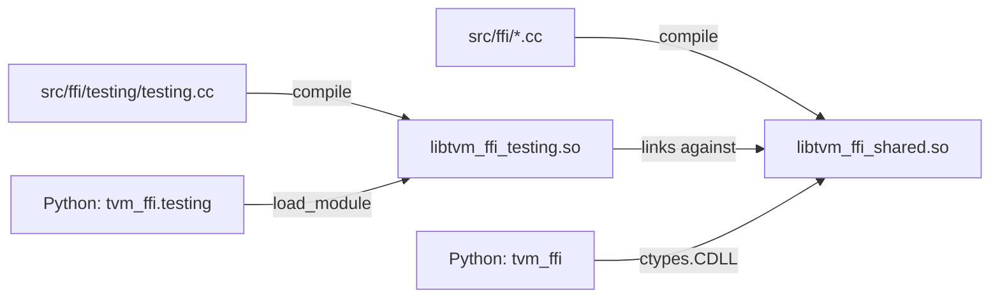
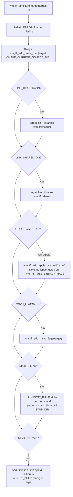

# Build System and Packaging

**TL;DR**
- TVM FFI ships as a pip-installable Python wheel (`tvm_ffi`) built with `scikit-build-core` + Cython. The build produces two shared libraries: `libtvm_ffi_shared` (core) and `libtvm_ffi_testing` (testing-only registered functions, separate from core to avoid polluting production builds).
- CMake config files are installed to `share/cmake/tvm_ffi/` for standard `find_package(tvm_ffi CONFIG REQUIRED)` discovery. Dynamic versioning uses `setuptools_scm` from git tags.
- CI runs on Linux x86_64 + aarch64, macOS arm64, Windows AMD64 with wheel builds for manylinux2014, manylinux_2_28, and macOS targets.

## Problem Statement

### Background
The project needs to produce a Python wheel that bundles C++ shared libraries, CMake config for downstream consumers, and Cython extensions. Testing utilities should not leak into production builds. CI must produce wheels for all supported platforms.

### Solution
- Two-library split: `libtvm_ffi_shared` (production) and `libtvm_ffi_testing` (testing). Both are CMake targets; testing links against shared.
- Standard CMake config layout (`share/cmake/tvm_ffi/`) enables `find_package` without manual path injection.
- `setuptools_scm` derives version from git tags; `editable.rebuild = false` in `pyproject.toml` prevents unwanted rebuilds in editable mode.

### Goals
- Single `uv pip install -e .` for development; `pip install tvm-ffi` for consumption.
- Standard CMake integration for downstream C++ projects.
- Reproducible CI wheel builds across platforms.
- Non-goal: support for platforms without shared library support.

## Design

### Library Split (commit da7007fd)



`libtvm_ffi_testing` holds testing-only globally registered functions (e.g., `testing.echo`, `testing.add_one`). It is loaded on demand when `tvm_ffi.testing` is imported, using `load_module(find_library_by_basename("tvm_ffi_testing"))`.

### CMake Config Layout (commit df04392)

```python
# Install destinations (after commit df04392):
# share/cmake/tvm_ffi/tvm_ffi-config.cmake
# share/cmake/tvm_ffi/Utils/Library.cmake
# share/cmake/tvm_ffi/Utils/TVMFFICFlags.cmake

# Python-side discovery:
def find_cmake_path() -> str:
    """First: share/cmake/tvm_ffi/ (pip install), then: ../../cmake (dev mode)."""
    # Interacts with: tvm-ffi-config --cmakedir, downstream find_package()
    # Invariant: standard layout takes priority over dev fallback
```

### Key Classes, Fields and Interfaces

```python
# python/tvm_ffi/libinfo.py
def find_library_by_basename(base: str) -> str:
    """Locate any companion shared library by base name. (commit da7007fd)
    Searches platform-specific candidate names across get_dll_directories().
    """
    # Invariant: base is bare name without 'lib' prefix or extension
    # Extension: use for any additional companion libraries (e.g., custom backends)

def find_libtvm_ffi() -> str:
    """Delegates to find_library_by_basename('tvm_ffi')."""

def find_cmake_path() -> str:
    """Returns share/cmake/tvm_ffi/ (pip) or ../../cmake (dev)."""

# CMake canary symbol:
# extern "C" int TVMFFITestingDummyTarget() -> 0
# Used by Rust tests to verify libtvm_ffi_testing link is correct.
# Interacts with: tvm-ffi-sys/c_api.rs (extern declaration)

# pyproject.toml settings:
# editable.rebuild = false  — no auto C rebuild in editable mode (commit df04392)
# setuptools_scm for dynamic versioning from git tags (commit ac63fb9b)
```

### Convenience Integration Functions (commit ccd19f82)

Two CMake convenience functions in `cmake/Utils/Library.cmake` reduce downstream boilerplate from ~50 lines to 3:



```python
# cmake/Utils/Library.cmake (pseudocode for reconstructibility)

def tvm_ffi_configure_target(
    target: str,
    LINK_SHARED: bool = True,   # link tvm_ffi::shared; FATAL_ERROR if target missing
    LINK_HEADER: bool = True,   # link tvm_ffi::header; FATAL_ERROR if target missing
    DEBUG_SYMBOL: bool = True,  # Apple: runs dsymutil post-build (always, regardless of libbacktrace flag)
    MSVC_FLAGS: bool = True,    # calls tvm_ffi_add_msvc_flags(target)
    STUB_DIR: str = "",         # if set, adds POST_BUILD stub-gen; absolute or relative to CMAKE_CURRENT_SOURCE_DIR
    STUB_INIT: bool = False,    # if ON, passes --init-lib/--init-pypkg/--init-prefix to stub CLI
    STUB_PKG: str = "",         # requires STUB_INIT=ON and STUB_DIR; default: SKBUILD_PROJECT_NAME or target name
    STUB_PREFIX: str = "",      # requires STUB_INIT=ON; default: "${STUB_PKG}."
) -> None:
    # Invariant: target must be an existing CMake target (FATAL_ERROR otherwise)
    # Invariant: STUB_PKG/STUB_PREFIX require both STUB_DIR and STUB_INIT=ON (FATAL_ERROR otherwise)
    # Always-on: tvm_ffi_add_prefix_map(target, CMAKE_CURRENT_SOURCE_DIR)
    # Interacts with: tvm_ffi::header CMake target, tvm_ffi::shared CMake target
    # Interacts with: tvm_ffi.stub.cli (Python -m tvm_ffi.stub.cli) for POST_BUILD stub-gen
    # Extension: add new optional behavior behind new ON/OFF keyword args following the same pattern

def tvm_ffi_install(
    target: str,
    DESTINATION: str = ".",     # relative to CMAKE_INSTALL_PREFIX
) -> None:
    # Apple: installs $<TARGET_FILE:target>.dSYM bundle (OPTIONAL — no failure if absent)
    # Non-Apple: no-op
    # Invariant: does NOT generate dSYMs — only installs them; pair with tvm_ffi_configure_target(DEBUG_SYMBOL=ON)
    # Interacts with: tvm_ffi_configure_target (must be called first for dSYM to exist)

# Behavioral change in existing function (commit ccd19f82):
# tvm_ffi_add_apple_dsymutil(target):
#   OLD: if (APPLE AND TVM_FFI_USE_LIBBACKTRACE)
#   NEW: if (APPLE)
#   Impact: dSYM generation now runs on Apple regardless of TVM_FFI_USE_LIBBACKTRACE flag
```

### Cross-Compilation Options (commits 0d157dc, 3b4a532, dcd07cf)

Two CMake options allow embedded/cross-compilation targets to skip system library linkage:

```python
# CMakeLists.txt — cross-compilation knobs
# option(TVM_FFI_USE_THREADS "Link against threads in shared lib" ON)
#   When ON (default): find_package(Threads REQUIRED) — hard fail if not found
#   When OFF: skip thread linkage entirely (-DTVM_FFI_USE_THREADS=OFF)
#   Invariant: default ON preserves existing behavior for desktop builds
#   Interacts with: tvm_ffi_shared, tvm_ffi_static targets (Threads::Threads linkage)

# option(TVM_FFI_USE_DL_LIBS "Link against dl libs in shared lib" ON)
#   When ON (default): links CMAKE_DL_LIBS if TVM_FFI_USE_EXTRA_CXX_API is also ON
#   When OFF: skip dl linkage entirely (-DTVM_FFI_USE_DL_LIBS=OFF)
#   Invariant: dl linkage requires TVM_FFI_USE_EXTRA_CXX_API AND CMAKE_DL_LIBS AND TVM_FFI_USE_DL_LIBS
#   Interacts with: TVM_FFI_USE_EXTRA_CXX_API (existing condition), TVM_FFI_USE_THREADS (sibling)
```

### Contracts, Assumptions and Invariants
- `libtvm_ffi_testing` links against `libtvm_ffi_shared` (never static).
- `tvm_ffi.testing` is NOT in `tvm_ffi.__all__` -- callers must import directly.
- `find_library_by_basename` raises `RuntimeError` if the library is not found.
- CMake `find_package(tvm_ffi)` works when Python's `sys.prefix` is in CMake search path.
- `editable.rebuild = false` means C++/Cython changes require explicit `uv pip install --force-reinstall -e .`.
- `TVM_FFI_USE_THREADS=ON` (default) makes Threads linkage REQUIRED (hard fail). `OFF` skips entirely (commit 3b4a532).
- `TVM_FFI_USE_DL_LIBS=ON` (default) links `CMAKE_DL_LIBS` only when `TVM_FFI_USE_EXTRA_CXX_API` is also enabled (commit dcd07cf).

### Extension Points
- Add new companion shared libraries by following the `libtvm_ffi_testing` pattern: create a CMake target, add a Python loader module using `find_library_by_basename`.
- Add new platform wheel targets by extending `cibuildwheel` configuration in `pyproject.toml`.

### Usage Examples

#### Loading the testing library from Python
**Context**: running integration tests that exercise C++ testing globals.

```python
# Importing tvm_ffi.testing eagerly loads the testing companion library:
import tvm_ffi.testing  # triggers: load_module(find_library_by_basename("tvm_ffi_testing"))

# All testing.* registered globals are now available:
f = tvm_ffi.get_global_func("testing.echo")
assert f(42) == 42
```

#### Downstream CMake integration (post commit ccd19f82)
**Context**: building a C++ extension that links against tvm_ffi with stub generation.

```cmake
find_package(tvm_ffi CONFIG REQUIRED)   # auto-discovered via sys.prefix
add_library(my_ffi_extension SHARED src/extension.cc)

# One-liner replaces ~40 lines of manual boilerplate:
# - links tvm_ffi::header + tvm_ffi::shared  (namespaced targets, commit a1cb7462)
# - applies prefix map + Apple dSYM + MSVC flags
# - adds POST_BUILD Python stub generation into ./python directory
tvm_ffi_configure_target(my_ffi_extension STUB_DIR "./python" STUB_INIT ON)

install(TARGETS my_ffi_extension DESTINATION .)
tvm_ffi_install(my_ffi_extension)   # installs dSYM bundle on Apple; no-op elsewhere
```

Without `tvm_ffi_configure_target`, the equivalent manual wiring required `~50` lines of CMake (explicit `target_link_libraries`, conditional platform checks, dsymutil commands, stub-gen POST_BUILD commands).

#### Header-only downstream (no Python stubs)

```cmake
find_package(tvm_ffi CONFIG REQUIRED)
add_library(my_cpp_lib STATIC src/mylib.cc)
tvm_ffi_configure_target(my_cpp_lib LINK_SHARED OFF)  # headers only, no runtime dep
```

#### Single-include umbrella header (post commit 8caa0cbe)
**Context**: downstream C++ code that wants all TVM-FFI core APIs with one include.

```cpp
// Before: multiple individual includes
#include <tvm/ffi/function.h>
#include <tvm/ffi/container/array.h>
#include <tvm/ffi/object.h>
// ...

// After: single umbrella include (excludes tvm/ffi/extra/ — platform-specific)
#include <tvm/ffi/tvm_ffi.h>
// Provides: any, base_details, c_api, cast, containers, dtype, error, function,
//           memory, object, optional, reflection (inc. overload.h), string, type_traits
// Does NOT include: tvm/ffi/extra/ (cuda/, stl.h, etc.)
```

The umbrella header is the recommended single entry point for new downstream code. Use `tvm/ffi/extra/` headers only when needed for platform-specific features.

## Implementation Notes
- CI wheel builds are triggered nightly (commit 39d675d5) with publish gated to manual `workflow_dispatch`.
- Python 3.8 support requires compatibility shims (`from __future__ import annotations`, `typing_extensions` for `TypeAlias`). Python 3.8 arm64 macOS wheels may have platform-specific constraints.
- `libbacktrace` symbols are hidden from the shared library's public symbol table via linker flags (commit 33b37685).
- Windows builds link `Python::SABIModule` or `Python::Module` explicitly and provide `InterlockedAdd64` fallback for ARM64 (commit 2002e28b).
- Version 0.1.0 was the first stable release (commit 792dc014); versioning policy is 0.X.Y during RFC stage.

## Alternatives & Trade-offs
### Alternative A: Single shared library with test globals
- Pros: Simpler build; no separate library to manage.
- Cons: Testing globals leak into production; `libtvm_ffi` binary grows with test code; symbol pollution risk.

### Alternative B: Header-only CMake config (no install)
- Pros: No install step needed; CMake `add_subdirectory` always works.
- Cons: Does not support `find_package` for pip-installed wheels; downstream projects must know the source path.

## Related Design Docs & ADRs
- `.knowledge/design-records/0011-module-system.md` — `load_module` used to load companion libraries
- `.knowledge/design-records/0013-python-package.md` — Python package structure, `libinfo.py`, `find_library_by_basename`
- `.knowledge/design-records/0015-load-inline.md` — JIT compilation (build_inline/load_inline)
- `.knowledge/design-records/0018-rust-binding.md` — Rust `tvm-ffi-sys/build.rs` links `libtvm_ffi_testing`
- `.knowledge/design-records/0020-stub-gen.md` — `tvm_ffi.stub.cli` invoked by STUB_DIR POST_BUILD hook in `tvm_ffi_configure_target`
- `.knowledge/design-records/0022-torch-dlpack-addon.md` — `addons/torch_c_dlpack_ext` optional addon with its own PEP 517 build backend and AOT wheel distribution

## Evidence Matrix

| Commit | Contribution |
|--------|-------------|
| da7007fd | Two-library split: libtvm_ffi_shared + libtvm_ffi_testing; find_library_by_basename |
| df04392 | CMake config layout in share/cmake/tvm_ffi/; find_cmake_path(); editable.rebuild=false |
| ac63fb9b | Dynamic versioning via setuptools_scm from git tags |
| ccd19f82 | tvm_ffi_configure_target + tvm_ffi_install convenience functions; tvm_ffi_add_apple_dsymutil no longer gated on TVM_FFI_USE_LIBBACKTRACE |
| a1cb746201412a943c29d942e6b2c29b36d97c48 | CMake target rename: tvm_ffi_header→tvm_ffi::header, tvm_ffi_shared→tvm_ffi::shared (namespaced form; BREAKING for direct target_link_libraries users) |
| 8caa0cbe70e369a525192be0e0f159702dacb71c | Umbrella header <tvm/ffi/tvm_ffi.h> aggregating all core APIs (excludes extra/) |
| 0d157dc | Threads linkage changed from REQUIRED to conditional (find_package(Threads) without REQUIRED) |
| 3b4a532 | TVM_FFI_USE_THREADS CMake option (default ON) for explicit thread linkage control |
| dcd07cf | TVM_FFI_USE_DL_LIBS CMake option (default ON) for explicit dl linkage control |
| ac80ea39 | CMake ALIAS targets `tvm_ffi::header/shared/static` added inside `tvm_ffi_add_target_from_obj`; closes gap for `FetchContent`/`add_subdirectory` source-dependency builds where no `find_package` was called |
| plus 4 supporting commits | CI wheel triggers, libbacktrace symbol hiding, Windows ARM64, version 0.1.0 |
