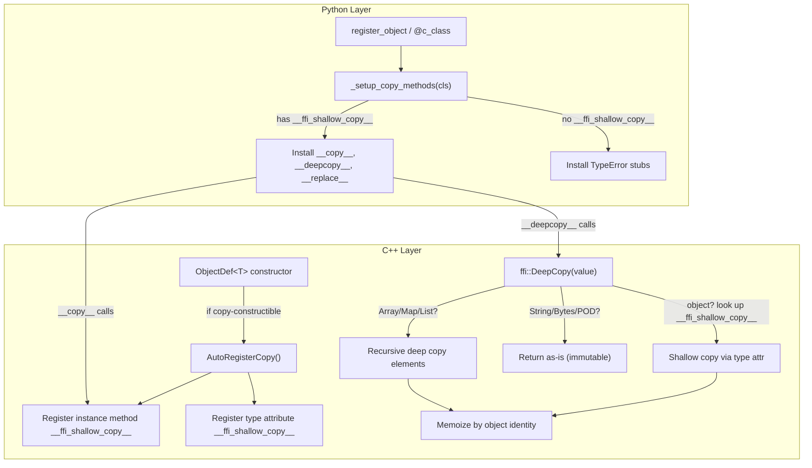

# FFI Deep Copy and Copy Protocol

**TL;DR**.
- `ffi::DeepCopy` provides a memoized graph-copy of `Any` values: shared references in the input graph remain shared in the output, and cycles are handled without infinite recursion. It recursively copies `Array`, `Map`, and `List`, treating `String`/`Bytes` as immutable terminals.
- `ObjectDef<T>` auto-registers `__ffi_shallow_copy__` for all copy-constructible reflected types, making C++ copy constructors accessible from Python and the DeepCopy engine without per-type boilerplate.
- Python-side `_setup_copy_methods()` installs `__copy__`/`__deepcopy__`/`__replace__` on FFI class proxies. Non-copyable types get `TypeError`-raising stubs, ensuring explicit failure rather than silent corruption.

## Problem Statement
### Background
- FFI objects are ref-counted, so Python's `copy.copy()` and `copy.deepcopy()` do not work out of the box: shallow copy would share the same C++ object (not a new instance), and `deepcopy` has no way to walk FFI object fields.
- Before this design, there was no uniform way to copy FFI objects or create modified copies (Python 3.13 `__replace__` / `copy.replace()`). Each type that wanted copy support needed manual implementation.

### Solution
- `DeepCopy` walks the value graph using reflection-registered `__ffi_shallow_copy__` type attributes, memoizing by object identity to preserve shared references and handle cycles.
- `ObjectDef` constructor detects `std::is_copy_constructible_v<Class>` and auto-registers both an instance method and a type attribute for shallow copy. No per-type registration needed.
- Python installation is centralized: `_setup_copy_methods()` is called from both `register_object()` and `@c_class`, deciding copy support based on whether `__ffi_shallow_copy__` is registered for the type.

### Goals
- Zero-boilerplate copy support for all copy-constructible C++ types with reflection.
- Memoized deep copy preserving shared references and cycles.
- Python `copy.copy()`/`copy.deepcopy()`/`copy.replace()` interop.
- Explicit `TypeError` for non-copyable types (never silent failure).
- Non-goal: custom deep-copy logic per type (types that need it should register `__data_to_json__`/`__data_from_json__` instead).

## Design



### Key Classes, Fields and Interfaces

```python
# C++ API (include/tvm/ffi/extra/dataclass.h — consolidated from deep_copy.h in 6b39efbf)
# Note: deep_copy.h has been removed from the public API. Use dataclass.h instead.
def DeepCopy(value: Any) -> Any:
    """Memoized graph-copy of any FFI value."""
    # Walk logic:
    #   1. POD (int, float, bool, device, dtype): return as-is
    #   2. String/Bytes: return as-is (immutable)
    #   3. Object: check memo; if seen, return memoized copy
    #      a. Look up type_attr "__ffi_shallow_copy__"
    #      b. If found: call it to get new object, memoize, recurse into fields
    #      c. If not found: raise RuntimeError("type X does not support copy")
    #   4. Array: shallow-copy array, recursively deep-copy each element
    #   5. Map: shallow-copy map, recursively deep-copy each key+value
    #   6. List: shallow-copy list, recursively deep-copy each element
    # Interacts with: TypeAttrColumn("__ffi_shallow_copy__"), StructuralEqual (similar walk pattern)
    # Invariant: shared references preserved — if A and B point to same object C, copies A' and B' point to same C'
    # Invariant: cycles handled — memoization prevents infinite recursion
    # Invariant: immutable terminals (String, Bytes) are NOT copied (shared)
    # Extension: new container types need explicit handling in DeepCopy implementation

# Well-known type attribute names (include/tvm/ffi/reflection/registry.h)
# type_attr::kInit = "__ffi_init__"
# type_attr::kShallowCopy = "__ffi_shallow_copy__"

# ObjectDef auto-registration (in constructor, after field/method registration):
# AutoRegisterCopy():
#   if std::is_copy_constructible_v<Class>:
#     instance_method = lambda(self: Class*) -> ObjectRef: make_object<Class>(*self)
#     register method "__ffi_shallow_copy__" on type
#     register type attr "__ffi_shallow_copy__" -> Function wrapper
#   else:
#     no-op (type is non-copyable)

# Python side (python/tvm_ffi/registry.py)
def _setup_copy_methods(type_cls: type, has_shallow_copy: bool,
                        *, is_container: bool = False) -> None:
    """Install copy dunder methods on an FFI class proxy."""
    # if has_shallow_copy:
    #   cls.__copy__ = lambda self: self.__ffi_shallow_copy__()
    #   cls.__deepcopy__ = lambda self, memo: ffi.DeepCopy(self)
    #   cls.__replace__ = _make_replace_method(cls)  # shallow copy + field override
    # else:
    #   cls.__copy__ = lambda self: raise TypeError("type X is not copyable")
    #   cls.__deepcopy__ = same
    #   cls.__replace__ = same
    # Interacts with: register_object/_add_class_attrs, c_class decorator
    # Invariant: __ffi_shallow_copy__ is always overridden (not inherited from parent class)

# Global function: registry["ffi.DeepCopy"] -> ffi::DeepCopy
```

### Contracts, Assumptions and Invariants
- **Copy-constructibility gate**: Only types whose C++ class is `std::is_copy_constructible_v` get automatic copy support. This is correct because the shallow copy invokes the C++ copy constructor.
- **Memoization by identity**: The memo table keys on object pointer identity, not structural equality. This ensures that shared references in the input remain shared in the output.
- **Immutable terminal optimization**: `String` and `Bytes` are immutable and not copied during deep copy; they are shared between original and copy. This is safe because mutation is impossible.
- **Non-copyable TypeError**: Types without `__ffi_shallow_copy__` raise `TypeError` immediately on `copy.copy()`/`copy.deepcopy()`. This is deliberate: types that hold external resources (file handles, CUDA streams) should not be silently duplicated.

### Extension Points
- **Custom shallow copy**: Override `__ffi_shallow_copy__` via `TypeAttrDef<T>` to customize per-type shallow copy logic (e.g., resetting transient caches).
- **New container types**: Any new container added to the FFI must add explicit handling in `DeepCopy` for recursive element copy.
- **__replace__ field override**: The generated `__replace__` method uses `__ffi_shallow_copy__` + field setter calls, supporting the Python 3.13 `copy.replace()` protocol and `dataclasses.replace()` pattern.

### Usage Examples

#### Copy and DeepCopy from Python
**Context**: Using standard Python `copy` module with FFI objects.
```python
import copy
import tvm_ffi

# Shallow copy: new C++ object via copy constructor
x = MyFFIObject(value=1)
y = copy.copy(x)       # creates new C++ object; y.value == 1 but y is not x

# Deep copy: preserves shared references
arr = tvm_ffi.Array([x, x])
arr2 = copy.deepcopy(arr)
assert arr2[0] is arr2[1]   # shared reference preserved in copy

# Dataclass-style replace (Python 3.13+ or via __replace__)
z = x.__replace__(value=2)  # shallow copy with field override
assert z.value == 2 and x.value == 1

# Non-copyable type raises TypeError explicitly
try:
    copy.copy(non_copyable_obj)
except TypeError:
    pass  # expected: type does not support copy
```

#### C++ Registration and DeepCopy
**Context**: How the auto-registration works and C++ DeepCopy usage.
```cpp
// ObjectDef auto-registers copy for copy-constructible types:
TVM_FFI_STATIC_INIT_BLOCK() {
    refl::ObjectDef<MyObj>()  // AutoRegisterCopy() called in constructor
        .def(refl::init<int>())
        .def_ro("value", &MyObj::value);
    // __ffi_shallow_copy__ now registered for MyObj (it is copy-constructible)
}

// C++ deep copy preserving shared references:
auto original = Array<MyObj>({a, a});  // a appears twice (shared ref)
Any copied = ffi::DeepCopy(original);
auto arr = copied.cast<Array<MyObj>>();
assert(arr[0].same_as(arr[1]));  // shared ref preserved in copy
```

## Implementation Notes
- `DeepCopy` uses a shared `ObjectGraphDFS` CRTP engine (consolidated in `src/ffi/extra/dataclass.cc`, 6b39efbf) with `ReprPrint`, `RecursiveHash`, and `RecursiveEq`/`Lt`/`Le`. The previous standalone `deep_copy.h` public header has been removed; the public entry point is now `include/tvm/ffi/extra/dataclass.h`.
- Containers (`Array`, `Map`, `List`) are deep-copied by creating a new container and recursively copying each element. Container identity is memoized so self-referencing containers (possible with `List`) don't cause infinite recursion.
- The `__replace__` method generated on Python classes creates a shallow copy and then applies keyword argument overrides by calling each field's setter. This mirrors `dataclasses.replace()` semantics.

## Alternatives & Trade-offs
### Auto-registration vs. Opt-in Copy
- Pros of auto: Zero boilerplate for the common case. Every copy-constructible reflected type Just Works with Python `copy` module.
- Cons: Types with expensive copy constructors pay registration cost at static init. Types holding non-owned resources may be accidentally copyable if their C++ class is copy-constructible.
### Memoized Deep Copy vs. Simple Recursive Copy
- Pros of memoized: Handles DAGs and cycles correctly. Preserves sharing semantics.
- Cons: O(n) memo table overhead. Not needed for tree-shaped data, but correctness requires it for the general case.

## Evidence
| Commit | Scope | Contribution |
|--------|-------|-------------|
| c73d61a4 | ffi/reflection, ffi/extra, python | Introduced `ffi::DeepCopy`, `__ffi_shallow_copy__` auto-registration, `_setup_copy_methods()`, `__copy__`/`__deepcopy__`/`__replace__` |
| 6b39efbf | ffi/extra | Consolidated deep_copy.cc into dataclass.cc; public header moved from `deep_copy.h` to `dataclass.h` |

## Related Design Docs & ADRs
- [0007-reflection.md](0007-reflection.md) -- ObjectDef, TypeAttrDef, and the `__ffi_shallow_copy__` auto-registration mechanism
- [0009-structural-eq-hash.md](0009-structural-eq-hash.md) -- Similar memoized graph-walk pattern used for structural comparison
- [0006-containers.md](0006-containers.md) -- Array, Map, List containers handled as recursive cases in DeepCopy
- [0016-python-dataclasses.md](0016-python-dataclasses.md) -- `@c_class` calls `_setup_copy_methods()` during class decoration
- [0024-dataclass-ops.md](0024-dataclass-ops.md) -- Unified dataclass.h public header (consolidated from deep_copy.h + repr_print.h)
