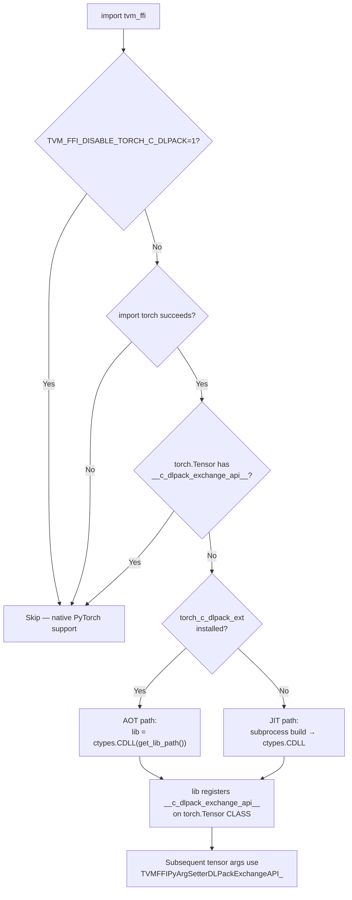

# Torch C DLPack Addon — JIT/AOT Build and Distribution

**TL;DR**
- A build script (`_build_optional_torch_c_dlpack.py`) compiles `libtorch_c_dlpack_addon.{so,dll}` — a C extension that patches older PyTorch versions to support the `DLPackExchangeAPI` protocol for fast, zero-copy tensor exchange.
- Build strategy is platform-split: Linux/macOS use a direct `$CXX` invocation (`_run_build_on_linux_like`); Windows uses Ninja (`_generate_ninja_build_windows`). Ninja is no longer required on non-Windows platforms.
- Two-tier loading: (1) probe for pre-built `torch_c_dlpack_ext` AOT wheel, (2) fall back to subprocess-based JIT compilation with `FileLock`-serialized concurrent build protection.
- The `__c_dlpack_exchange_api__` class attribute is now a `PyCapsule("dlpack_exchange_api")` rather than a raw integer pointer; backward-compat int-to-PyCapsule upgrade applied on load.
- Environment variables `DLPACK_EXTRA_CFLAGS`/`DLPACK_EXTRA_LDFLAGS` enable cross-compilation (e.g., riscv64 target), and `TVM_FFI_DISABLE_TORCH_C_DLPACK=1` suppresses the build entirely.

## Problem Statement

### Background
The `DLPackExchangeAPI` struct (see 0016-py-ffi-call-dispatch) enables C-level tensor exchange between TVM FFI and framework tensor types. Older PyTorch versions (pre-2.6) do not natively expose `__c_dlpack_exchange_api__` on `torch.Tensor`. Without this attribute, the FFI falls back to the slower Python-level `__dlpack__` protocol for every tensor argument conversion.

### Solution
A C++ extension (`libtorch_c_dlpack_addon`) constructs a `TorchDLPackExchangeAPI` singleton implementing all five `DLPackExchangeAPI` function pointers for `torch.Tensor`, then registers it as `torch.Tensor.__c_dlpack_exchange_api__`. This is compiled either ahead-of-time (AOT wheel) or just-in-time (subprocess JIT) and loaded via `ctypes.CDLL`.

### Goals
- Fast DLPack exchange for all supported PyTorch versions (including old ones without native support).
- Zero runtime overhead after initial load — the addon sets a class attribute once; all subsequent tensor conversions use the C fast path.
- AOT distribution via pip for CI/production environments where JIT compilation is impractical.
- Cross-compilation support for non-standard targets (e.g., riscv64).
- Non-goal: support for non-PyTorch tensor frameworks (those implement their own `DLPackExchangeAPI`).

## Design

### Two-Tier Loading Strategy



### Key Classes, Fields and Interfaces

```python
# python/tvm_ffi/utils/_build_optional_c_dlpack.py
# Standalone build script: python _build_optional_c_dlpack.py --build_dir <dir> [--build_with_cuda]

def main() -> None:
    """Entry point: parse args, invoke build_ninja, produce libtorch_c_dlpack_addon."""
    # Interacts with: argparse, build_ninja()

def _run_build_on_linux_like(
    build_dir: Path,
    libname: str,
    source_path: Path,
    extra_cflags: Sequence[str],
    extra_ldflags: Sequence[str],
    extra_include_paths: Sequence[str],
) -> None:
    """Compile and link in one step using $CXX (Linux/macOS only — commit 7a355c77).
    # Invariant: only called when not IS_WINDOWS
    # default_cflags: ["-std=c++17", "-fPIC", "-O3", "-fvisibility=hidden"]  (commit 7cd2e500)
    # default_ldflags on Linux: ["-shared", "-Wl,-rpath,$ORIGIN"]  (--no-as-needed removed commit 74f53c57)
    # Reads DLPACK_EXTRA_CFLAGS and DLPACK_EXTRA_LDFLAGS from environment
    # Interacts with: subprocess.run(), os.environ.get("CXX", "c++")
    # Extension: DLPACK_EXTRA_CFLAGS/DLPACK_EXTRA_LDFLAGS for cross-compilation
    """
    ...

def _generate_ninja_build_windows(
    build_dir: Path,
    libname: str,
    source_path: Path,
    extra_cflags: Sequence[str],
    extra_ldflags: Sequence[str],
    extra_include_paths: Sequence[str],
) -> None:
    """Generate build.ninja and invoke ninja (Windows only — commit 7a355c77).
    # Invariant: only called when IS_WINDOWS
    # Interacts with: build_ninja() from tvm_ffi.cpp.extension, tvm_ffi.libinfo.find_dlpack_include_path
    """
    ...

def get_torch_include_paths(build_with_cuda: bool) -> Sequence[str]:
    """Return PyTorch header paths; handles torch>=2.6 API change for include_paths().
    # Invariant: includes CUDA paths only when build_with_cuda=True
    """
    ...


# python/tvm_ffi/_optional_torch_c_dlpack.py
def load_torch_c_dlpack_extension() -> Any | None:
    """Two-tier loading: AOT wheel probe → JIT subprocess fallback.
    # Early exits:
    #   if import torch fails: return None
    #   if hasattr(torch.Tensor, "__c_dlpack_exchange_api__"): return None  # native support
    # Tier 1: try import torch_c_dlpack_ext; load ctypes.CDLL(get_lib_path())
    # Tier 2: subprocess JIT build via _build_optional_torch_c_dlpack.py
    # Post-load PyCapsule upgrade (commit 7f3bb771):
    #   if isinstance(torch.Tensor.__c_dlpack_exchange_api__, int):
    #       torch.Tensor.__c_dlpack_exchange_api__ = _create_dlpack_exchange_api_capsule(...)
    # Invariant: result stored in module-level variable to keep reference alive (prevents GC)
    # Invariant: FileLock serializes concurrent JIT builds
    # Invariant: built lib cached in ~/.cache/tvm-ffi/
    # Interacts with: TVMFFIPyArgSetterFactory_ (reads __c_dlpack_exchange_api__ from CLASS)
    """
    ...

def _create_dlpack_exchange_api_capsule(ptr_as_int: int) -> Any:
    """NEW (commit 7f3bb771): Wrap raw DLPackExchangeAPI* integer as PyCapsule('dlpack_exchange_api').
    # Interacts with: ctypes.pythonapi.PyCapsule_New
    # Invariant: capsule name must be b"dlpack_exchange_api" (checked by _get_dlpack_exchange_api in Cython)
    """
    ...


# addons/torch_c_dlpack_ext/torch_c_dlpack_ext/__init__.py
def get_lib_path() -> str:
    """Return path to the pre-built libtorch_c_dlpack_addon shared library.
    # Invariant: library must be bundled in the wheel's data directory
    # Interacts with: tvm_ffi._optional_torch_c_dlpack.load_torch_c_dlpack_extension (Tier 1)
    """
    ...


# addons/torch_c_dlpack_ext/build_backend.py
class BuildBackend:
    """PEP 517 custom build backend that calls _build_optional_torch_c_dlpack to compile
    the addon before packaging it into a wheel.
    # Invariant: wheel tagged with (python-version, pytorch-version) for compatibility
    # Interacts with: _build_optional_c_dlpack.main(), setuptools wheel builder
    """
    ...
```

### `from_dlpack` Exchange API Preference

```python
# python/tvm_ffi/cython/tensor.pxi (updated in commit 7f3f872)
def from_dlpack(src: Any) -> Tensor:
    """Convert any DLPack-compatible object to tvm_ffi.Tensor.
    # Preference ordering:
    #   1. __c_dlpack_exchange_api__ → DLPackExchangeAPI path (zero-copy, C-level)
    #   2. __dlpack__() → legacy Python protocol (allocates Python capsule)
    # Invariant: exchange API path is faster (no Python object creation)
    # Interacts with: DLPackExchangeAPI struct, TVMFFIPyCallManager setter cache
    """
    ...
```

### CUstream Compat Path

```python
# python/tvm_ffi/cython/function.pxi (added in commit 6c85e56)
def TVMFFIPyArgSetterStream_(handle, ctx, py_arg, out) -> int:
    """Setter for stream arguments.
    # Primary: __cuda_stream__ protocol (returns (type_str, stream_ptr_as_int))
    # Compat: if no __cuda_stream__, tries ctypes.c_void_p extraction
    #   Handles cuda.bindings.driver.CUstream which stores raw handle
    # Invariant: ctypes.c_void_p(0).value is None → must check is None before casting
    # Interacts with: TVMFFIEnvSetStream, ctypes.c_void_p null handling
    """
    ...
```

### Contracts, Assumptions and Invariants

- `TVM_FFI_DISABLE_TORCH_C_DLPACK=1` must be set by the build script before importing `tvm_ffi` to prevent recursive build attempts (the import itself triggers `load_torch_c_dlpack_extension()`).
- The AOT wheel is tagged with specific (python-version, pytorch-version) tuples. Installing a mismatched wheel fails silently at load time (C ABI mismatch); the JIT fallback catches this and rebuilds.
- The JIT build produces `libtorch_c_dlpack_addon.{so,dll}` in `~/.cache/tvm-ffi/`. The `FileLock` at `<build_dir>/lock` serializes concurrent builds from multiple Python processes.
- The module-level reference `_TORCH_C_DLPACK_LIB` must be kept alive; without it, the `ctypes.CDLL` object is GC'd and the shared library is unloaded, invalidating the `__c_dlpack_exchange_api__` pointer.
- `DLPACK_EXTRA_CFLAGS`/`DLPACK_EXTRA_LDFLAGS` are prepended (not appended) to the compile/link commands, allowing them to override defaults for cross-compilation.
- ROCm backend support (commit 752ac8e): torch tensor conversion checks `torch.version.hip` and maps to appropriate DLPack device type.
- CUDA availability check (commit 4fc83d7): uses both `torch.version.cuda` and `torch.cuda.is_available()` to determine whether to compile with CUDA support.

### Failure Modes
- **Torch not installed**: `load_torch_c_dlpack_extension()` returns `None` immediately. No error.
- **JIT compilation failure** (e.g., missing compiler, missing CUDA): The exception is caught and logged; `tvm_ffi` continues without the fast path, falling back to `__dlpack__` protocol.
- **Stale AOT wheel** (PyTorch version mismatch): `ctypes.CDLL` may fail to load. Fallback to JIT path.
- **Concurrent build race**: `FileLock` serializes; second process waits. If the lock file is corrupted, `blocking_acquire` may timeout.

### Extension Points
- New framework support: Follow the same pattern — build a `DLPackExchangeAPI` singleton, register on the framework's tensor CLASS.
- New platforms: Add platform-specific compiler flags via `DLPACK_EXTRA_CFLAGS`/`DLPACK_EXTRA_LDFLAGS`.
- New CUDA targets: Set `--build_with_cuda` in AOT builds or let JIT auto-detect.

### Usage Examples

#### AOT wheel installation (production)
**Context**: CI/production environment where JIT compilation is impractical.

```bash
# Install pre-built wheel matching your python+pytorch version:
pip install torch-c-dlpack-ext

# Verify:
python -c "import torch_c_dlpack_ext; print(torch_c_dlpack_ext.get_lib_path())"
# → /path/to/site-packages/torch_c_dlpack_ext/lib/libtorch_c_dlpack_addon.so

# Now tvm_ffi uses the pre-built lib at import time:
import tvm_ffi  # loads AOT lib, no JIT compilation
```

#### JIT build (development)
**Context**: First import on a machine with torch installed but no AOT wheel.

```python
import tvm_ffi  # auto-invokes load_torch_c_dlpack_extension()
# First import: subprocess JIT builds libtorch_c_dlpack_addon.so in ~/.cache/tvm-ffi/
# Subsequent imports: reuses cached .so (content-hash-based)

import torch
t = torch.tensor([1.0, 2.0])
tvm_t = tvm_ffi.from_dlpack(t)  # uses DLPackExchangeAPI fast path
```

#### Cross-compilation
**Context**: Building for a non-native target (e.g., riscv64).

```bash
export DLPACK_EXTRA_CFLAGS="--target=riscv64-unknown-linux-gnu --sysroot=/"
export DLPACK_EXTRA_LDFLAGS="--target=riscv64-linux-gnu --sysroot=/ -L/prefix/lib"
python _build_optional_c_dlpack.py --build_dir /tmp/dlpack_build
```

### Evolution Timeline

| Phase | Commit | Change |
|-------|--------|--------|
| v1 | e6a654a | Standalone Ninja-based build script, subprocess JIT replacing in-process `load_inline` |
| fix | bc2f408 | Keep ctypes.CDLL reference alive to prevent premature GC |
| fix | a06d0df | Remove python lib link flags on Linux |
| v2 | f703a0c | AOT wheel distribution infrastructure (`addons/torch_c_dlpack_ext/`) |
| fix | a5241e5 | Fix import path for pre-built wheel discovery |
| v3 | 6d8b134 | `DLPACK_EXTRA_CFLAGS`/`DLPACK_EXTRA_LDFLAGS` for cross-compilation |
| v4 | 7f3f872 | `from_dlpack` prefers `DLPackExchangeAPI` over `__dlpack__` |
| v5 | 752ac8e | ROCm backend support for torch tensor conversion |
| v6 | 7a355c77 | Linux/macOS switches from Ninja to direct `$CXX` invoke; Ninja now Windows-only |
| v7 | 7f3bb771 | `__c_dlpack_exchange_api__` canonical form upgraded from raw int to `PyCapsule("dlpack_exchange_api")`; int form still accepted for backward compat |

## Implementation Notes
- The build script lives in `python/tvm_ffi/utils/_build_optional_c_dlpack.py` and is also invocable as a standalone `python -m tvm_ffi.utils._build_optional_c_dlpack`.
- The AOT wheel package lives in `addons/torch_c_dlpack_ext/` with its own `pyproject.toml` and PEP 517 build backend (`build_backend.py`).
- Build optimization level is `-O3` (commit 8ee0e49).
- Windows builds use `vswhere.exe` for MSVC toolchain discovery.
- GitHub Actions workflows in `.github/workflows/` handle automated PyPI release of AOT wheels for Linux, macOS, and Windows.

## Alternatives & Trade-offs

### Alternative A: Inline `load_inline` for the addon (original approach)
- Pros: No separate build script; single function call.
- Cons: In-process compilation cannot set `TVM_FFI_DISABLE_TORCH_C_DLPACK=1` to prevent recursion; harder to AOT-distribute.

### Alternative B: Require users to install AOT wheels only (no JIT)
- Pros: Simpler; no runtime compilation.
- Cons: Requires pre-built wheel for every (python, pytorch, CUDA) combination; development experience suffers on unsupported combinations.

## Related Design Docs & ADRs
- `.knowledge/design-records/0016-py-ffi-call-dispatch.md` — `DLPackExchangeAPI` struct, `TVMFFIPyArgSetterFactory` dispatch, `TorchDLPackExchangeAPI`
- `.knowledge/design-records/0015-load-inline.md` — `build_ninja`, Ninja-based compilation infrastructure
- `.knowledge/design-records/0021-build-packaging.md` — wheel distribution, CI workflows
- `.knowledge/design-records/0013-python-package.md` — `find_dlpack_include_path`, library loading

## Evidence Matrix

| Commit | Contribution |
|--------|-------------|
| e6a654a | Standalone Ninja build script, subprocess JIT, TVM_FFI_DISABLE_TORCH_C_DLPACK guard |
| f703a0c | AOT wheel package (torch_c_dlpack_ext), PEP 517 build backend, two-tier loading |
| 6d8b134 | DLPACK_EXTRA_CFLAGS/LDFLAGS cross-compilation support |
| 7f3f872 | from_dlpack prefers DLPackExchangeAPI over __dlpack__ protocol |
| 6c85e56 | CUstream compat path for cuda-python driver streams |
| 752ac8e | ROCm backend support |
| 7a355c77 | Linux/macOS direct $CXX path; Ninja Windows-only; error reporting improved |
| 7f3bb771 | PyCapsule protocol for __c_dlpack_exchange_api__; backward-compat int upgrade |
| plus 7 supporting commits | bc2f408 (GC fix), a06d0df (Linux link fix), a5241e5 (import fix), 8ee0e49 (-O3), 5a87749 (torch fallback/dtype), 4fc83d7 (CUDA check), 74f53c57 (--no-as-needed removed), 7cd2e500 (-fvisibility=hidden) |
