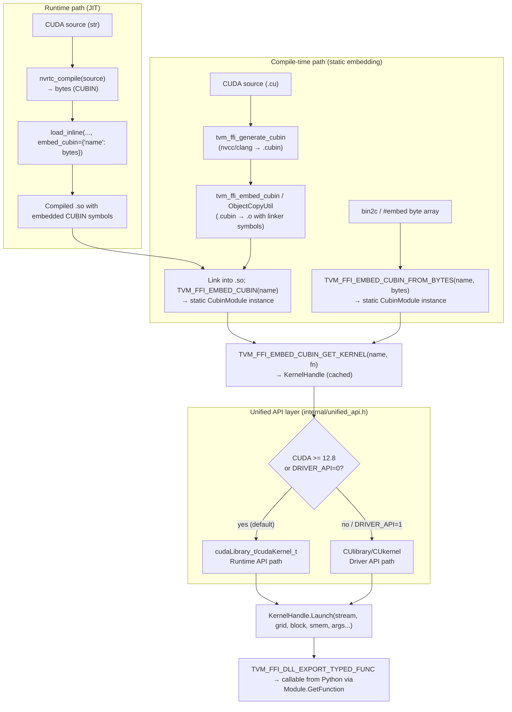

# CUDA Kernel Launching Infrastructure — CubinModule, DeviceGuard, and NVRTC

**TL;DR**
- `include/tvm/ffi/extra/cuda/` provides a self-contained CUDA kernel launching stack: `base.h` (error macro), `device_guard.h` (`CUDADeviceGuard` RAII), and `cubin_launcher.h` (`CubinModule` + `TVM_FFI_EMBED_CUBIN`/`TVM_FFI_EMBED_CUBIN_FROM_BYTES` for compile-time embedding). All three headers are independent of the TVM runtime — they depend only on `tvm/ffi/` and CUDA headers.
- `include/tvm/ffi/extra/cuda/internal/unified_api.h` is a compile-time API selector: on CUDA >= 12.8 it uses the Runtime API (`cudaLibrary_t`/`cudaKernel_t`); on older CUDA or when `TVM_FFI_CUBIN_LAUNCHER_USE_DRIVER_API=1` is set, it uses the Driver API (`CUlibrary`/`CUkernel`). The `tvm::ffi::dim3` struct was removed in favour of CUDA-native types exposed through this layer.
- `python/tvm_ffi/cpp/nvrtc.py` provides `nvrtc_compile()` for JIT CUDA compilation; `cmake/Utils/EmbedCubin.cmake` + `cmake/Utils/ObjectCopyUtil.cmake` and `python/tvm_ffi/utils/embed_cubin.py` cover the CMake/CLI compile-time path.
- The two launch paths (static embedded CUBIN vs. JIT NVRTC compile) both produce kernel handles and launch via `cuda_api::LaunchKernel()` identically.

## Problem Statement

### Background
TVM FFI's module system (`0011-module-system`) loads compiled `.so` files, but CUDA kernels require an additional abstraction: loading a CUBIN binary (GPU machine code), managing one `CUmodule` per GPU device, and launching with the Driver API instead of the Runtime API. Previously this boilerplate was duplicated in each project. Additionally, CUDA API errors needed consistent mapping to TVM FFI `RuntimeError` exceptions.

### Solution
A layered header-only design under `include/tvm/ffi/extra/cuda/`:
1. `base.h` — `TVM_FFI_CHECK_CUDA_ERROR(stmt)`: CUDA **runtime** API error macro (accepts `cudaError_t`; commit 10cb004 scoped this to runtime-only). Includes `<cuda_runtime.h>` and `<tvm/ffi/error.h>`.
2. `device_guard.h` — `CUDADeviceGuard`: RAII guard that saves and restores the current CUDA device. Includes `internal/unified_api.h` (commit 692a41a fixed a missing include).
3. `internal/unified_api.h` — `tvm::ffi::cuda_api` namespace: compile-time selector between CUDA Runtime API (CUDA >= 12.8) and CUDA Driver API, exposing uniform `LoadLibrary`/`LaunchKernel`/`GetKernel` wrappers. Defines `TVM_FFI_CHECK_CUBIN_LAUNCHER_CUDA_ERROR(stmt)` (renamed from `TVM_FFI_CHECK_CUDA_ERROR` in commit 10cb004) for unified driver/runtime error checking scoped to cubin launcher internals.
4. `cubin_launcher.h` — `CubinModule` backed by `cuda_api::LoadLibrary`; `TVM_FFI_EMBED_CUBIN(name)` for linker-symbol embedding; `TVM_FFI_EMBED_CUBIN_FROM_BYTES(name, bytes)` for byte-array embedding (bin2c / C++23 `#embed`); `TVM_FFI_EMBED_CUBIN_GET_KERNEL(name, fn)` for cached kernel lookup.

On the Python/build side:
- `nvrtc_compile()` compiles CUDA source to CUBIN bytes at runtime.
- `tvm_ffi_generate_cubin` + `tvm_ffi_embed_cubin` CMake functions automate the compile-time path; `cmake/Utils/ObjectCopyUtil.cmake` provides binary file embedding utilities shared across tools.
- `load_inline(..., embed_cubin={"name": bytes})` integrates JIT NVRTC output with the JIT compilation pipeline.

### Goals
- Zero-copy, zero-allocation kernel launch from C++, independent of CUDA version.
- Multi-GPU transparent: one `CubinModule` handles all device indices.
- Both compile-time (embed in `.so`) and runtime (NVRTC) CUBIN loading.
- Dual API backend: Runtime API on CUDA >= 12.8 (default); Driver API fallback on older CUDA or when forced.
- No TVM Runtime dependency — only TVM FFI headers and CUDA headers.
- Non-goal: schedule/graph execution; non-CUDA platforms.

## Design

### Architecture Overview



### Key Classes, Fields and Interfaces

```python
# ─── include/tvm/ffi/extra/cuda/base.h ──────────────────────────────────────

# Macro: TVM_FFI_CHECK_CUDA_ERROR(stmt)
# Evaluates stmt; if result != cudaSuccess:
#   TVM_FFI_THROW(RuntimeError) << cudaGetErrorName(err) << ": " << cudaGetErrorString(err)
# Interacts with: TVM_FFI_THROW (0005-error-system), cudaGetErrorName, cudaGetErrorString
# Invariant: stmt is evaluated exactly once
# Invariant: must be used for ALL cuda* runtime API calls in extra/cuda/ headers
# Extension: used by both CUDADeviceGuard and CubinModule


# ─── include/tvm/ffi/extra/cuda/device_guard.h ──────────────────────────────

class CUDADeviceGuard:
    """RAII guard: switches to target CUDA device on construction, restores on destruction.
    Avoids unnecessary cudaSetDevice calls when target == current.
    """
    target_device_index_: int    # device to switch TO
    original_device_index_: int  # device to restore on destruction

    def __init__(self, device_index: int) -> None:
        """Saves current device via cudaGetDevice; switches to device_index."""
        # Interacts with: TVM_FFI_CHECK_CUDA_ERROR, cudaGetDevice, cudaSetDevice
        # Invariant: only calls cudaSetDevice if device_index != original_device_index_

    def __del__(self) -> None:
        """Restores original device if it differs from target_device_index_."""
        # Invariant: destructor is noexcept(false) — CUDA errors in restore propagate as exceptions
        # Invariant: only restores if target_device_index_ != original_device_index_
    # Interacts with: CubinModule.get_kernel (wraps device switch before cuModuleGetFunction)


# ─── include/tvm/ffi/extra/cuda/internal/unified_api.h ──────────────────────
# namespace tvm::ffi::cuda_api
# (INTERNAL — included only by cubin_launcher.h; not a public header)

# Compile-time selector:
#   TVM_FFI_CUBIN_LAUNCHER_USE_DRIVER_API=0 (default when CUDA>=12.8):
#       LibraryHandle = cudaLibrary_t
#       KernelHandle  = cudaKernel_t
#   TVM_FFI_CUBIN_LAUNCHER_USE_DRIVER_API=1 (default when CUDA<12.8):
#       LibraryHandle = CUlibrary
#       KernelHandle  = CUkernel
# In both paths the same function names are used (template/macro dispatch).

def cuda_api_LoadLibrary(library: LibraryHandle*, data: const void*) -> None:
    """Load CUBIN/FATBIN bytes into a library handle.
    Runtime path: cudaLibraryLoadData.
    Driver path: cuLibraryLoadData.
    """
    # Interacts with: CubinModule.__init__ (calls this at load time)
    # Invariant: data must remain valid until cuda_api_UnloadLibrary is called

def cuda_api_GetKernel(library: LibraryHandle, name: str) -> KernelHandle:
    """Look up a kernel by name inside a loaded library handle.
    Runtime path: cudaLibraryGetKernel.
    Driver path: cuLibraryGetKernel.
    """
    # Interacts with: TVM_FFI_EMBED_CUBIN_GET_KERNEL macro

def cuda_api_LaunchKernel(
    kernel: KernelHandle,
    stream: CUstream | cudaStream_t,
    grid: dim3,
    block: dim3,
    shared_mem: unsigned,
    *args: Any,
) -> None:
    """Launch a kernel. Runtime path: cudaLaunchKernel. Driver path: cuKernelLaunch."""
    # Interacts with: TVMFFIEnvGetStream (0012-env-api) for default stream
    # Invariant: args void* array must match kernel's parameter layout


# ─── include/tvm/ffi/extra/cuda/cubin_launcher.h ────────────────────────────

class CubinModule:
    """Manages a CUBIN/FATBIN binary as a library handle.
    Loads on construction; caches kernel handles returned by GetKernel.
    """
    library_: LibraryHandle   # cudaLibrary_t or CUlibrary depending on CUDA version
    # Invariant: library_ loaded in constructor via cuda_api::LoadLibrary
    # Invariant: module must outlive all KernelHandles obtained from GetKernel
    # Invariant: relies on TVM_FFI_CHECK_CUDA_ERROR for all CUDA API calls

    def __init__(self, data: const void*, size: size_t) -> None:
        """data: pointer to CUBIN bytes (from linker symbols or inline byte array)."""
        # Interacts with: cuda_api::LoadLibrary (unified_api.h)
        # Interacts with: TVM_FFI_EMBED_CUBIN / TVM_FFI_EMBED_CUBIN_FROM_BYTES macros

    def GetKernel(self, name: str) -> KernelHandle:
        """Look up kernel by name. Returns cudaKernel_t or CUkernel."""
        # Interacts with: cuda_api::GetKernel (unified_api.h)
        # Extension: cache the returned KernelHandle; do not call per-launch


# Macro: TVM_FFI_EMBED_CUBIN(name)
# Declares external linker symbols and creates a static CubinModule instance.
# Expansion (pseudocode):
#   extern "C" {
#     extern const char __tvm_ffi__cubin_<name>[];         // start of CUBIN bytes
#     extern const char __tvm_ffi__cubin_<name>_end[];     // end of CUBIN bytes
#   }
#   static CubinModule <name>_module(
#       __tvm_ffi__cubin_<name>,
#       __tvm_ffi__cubin_<name>_end - __tvm_ffi__cubin_<name>
#   );
# The linker symbols are injected by tvm_ffi_embed_cubin (CMake) or embed_cubin.py (CLI).
# Interacts with: tvm_ffi_embed_cubin CMake function, embed_cubin.py CLI, CubinModule ctor
# Invariant: <name>_module is a translation-unit-local static

# Macro: TVM_FFI_EMBED_CUBIN_FROM_BYTES(name, imageBytes)  (NEW — commit b16f11f6)
# Creates a static CubinModule from an inline byte array (e.g. bin2c output or C++23 #embed).
# Expansion (pseudocode):
#   static CubinModule <name>_module(imageBytes, sizeof(imageBytes));
# Invariant: imageBytes must be accessible in the same translation unit
# Extension: use with constexpr arrays from bin2c or #embed to avoid the linker-symbol step

# Macro: TVM_FFI_EMBED_CUBIN_GET_KERNEL(name, kernel_name)  (NEW — commit b16f11f6)
# Retrieves a cached KernelHandle from the static CubinModule created by EMBED_CUBIN*.
# Expansion (pseudocode):
#   <name>_module.GetKernel(kernel_name)
# Invariant: caches the returned handle in a function-local static — safe to call each launch

# Note: tvm::ffi::dim3 struct was REMOVED (commit b16f11f6).
# Callers must use CUDA-native dim3 (from <cuda_runtime.h> or <vector_types.h>) or
# pass integral x/y/z values directly to cuda_api::LaunchKernel.


# ─── python/tvm_ffi/cpp/nvrtc.py ─────────────────────────────────────────────

def nvrtc_compile(
    source: str,
    *,
    name: str = "kernel.cu",
    arch: str | None = None,      # e.g. "sm_80"; auto-detected from cudaGetDeviceProperties if None
    extra_opts: Sequence[str] | None = None,
) -> bytes:
    """Compile CUDA C++ source to CUBIN bytes using NVRTC.
    Returns raw CUBIN bytes suitable for passing to embed_cubin or load_inline.
    """
    # Interacts with: ctypes-loaded NVRTC shared library, cudaGetDeviceProperties (arch detection)
    # Invariant: raises RuntimeError if nvrtcCompileProgram fails (includes log)
    # Extension: pass extra_opts for --use_fast_math, --fmad=false, etc.


# ─── cmake/Utils/EmbedCubin.cmake ────────────────────────────────────────────

# tvm_ffi_generate_cubin(OUTPUT <cubin> SOURCE <cu> [ARCH <sm_xx|native>] [OPTIONS ...])
#   → runs nvcc/clang to compile a .cu to .cubin
#   Interacts with: find_package(CUDA), CUDA_NVCC_FLAGS

# tvm_ffi_embed_cubin(OUTPUT <obj> SOURCE <cc> CUBIN <cubin> NAME <name>)
#   → uses objcopy to embed .cubin bytes into an .o file
#   → defines linker symbols __tvm_ffi__cubin_<name> and __tvm_ffi__cubin_<name>_end
#   Interacts with: TVM_FFI_EMBED_CUBIN macro (consumer of symbols)
#   Invariant: <cc> is a stub .cc file included to satisfy the objcopy embedding step


# ─── python/tvm_ffi/utils/embed_cubin.py (CLI) ───────────────────────────────

# python -m tvm_ffi.utils.embed_cubin --output-obj <obj> --input-obj <o> --cubin <cubin> --name <name>
# Python-side equivalent of tvm_ffi_embed_cubin CMake function.
# Used in JIT path: embed NVRTC-compiled CUBIN bytes into the inline-compiled .so.
# Interacts with: load_inline(embed_cubin={"name": bytes}) via _hash_sources extension (0015-load-inline)
```

### Macro Expansions

```python
# TVM_FFI_EMBED_CUBIN(my_kernels) expands to:

# 1. Declare linker symbols (provided by objcopy/ld embedding step):
extern_C_array: my_kernels_cubin_start = ...  # __tvm_ffi__cubin_my_kernels[]
extern_C_array: my_kernels_cubin_end = ...    # __tvm_ffi__cubin_my_kernels_end[]

# 2. Create a static CubinModule instance in translation-unit scope:
my_kernels_module = CubinModule(
    data=__tvm_ffi__cubin_my_kernels,
    size=__tvm_ffi__cubin_my_kernels_end - __tvm_ffi__cubin_my_kernels
)
# Invariant: my_kernels_module accessible from the same .cc file only (static linkage)
# Invariant: CUBIN data must be present at link time (CMake or embed_cubin.py)


# TVM_FFI_EMBED_CUBIN_FROM_BYTES(my_kernels, imageBytes) expands to:

# (imageBytes is an existing byte array, e.g. from bin2c or C++23 #embed)
my_kernels_module = CubinModule(
    data=static_cast<const void*>(imageBytes),
    size=sizeof(imageBytes)
)
# Invariant: imageBytes must be in scope in the same translation unit
# Invariant: no linker symbol step needed — the bytes are inline


# TVM_FFI_EMBED_CUBIN_GET_KERNEL(my_kernels, "kernel_fn") expands to:
# (returns cached function-local static KernelHandle)
static kernel_handle = my_kernels_module.GetKernel("kernel_fn")
return kernel_handle
# Invariant: function-local static — initialized once; safe to call each launch iteration
```

### Contracts, Assumptions and Invariants

- `TVM_FFI_CHECK_CUDA_ERROR(stmt)` evaluates `stmt` exactly once; on non-zero return it throws `RuntimeError`. All CUDA API calls inside `extra/cuda/` headers MUST use this macro — never check directly.
- `CUDADeviceGuard` skips `cudaSetDevice` when target equals current device, preventing spurious context switches. Its destructor is `noexcept(false)`, so CUDA errors during restore propagate as exceptions.
- `CubinModule` loads the CUDA module on construction (eager, not lazy) via `cuda_api::LoadLibrary`. The caller must keep the `CubinModule` alive as long as any `KernelHandle` from it is in use.
- The `TVM_FFI_EMBED_CUBIN` linker symbols `__tvm_ffi__cubin_<name>` / `__tvm_ffi__cubin_<name>_end` must be in scope at link time. If the `.o` produced by `tvm_ffi_embed_cubin` is not linked, the static initializer will crash at startup.
- `TVM_FFI_EMBED_CUBIN_FROM_BYTES` requires the byte array to be in scope in the same translation unit; no linker step needed.
- **BREAKING (commit b16f11f6)**: `tvm::ffi::dim3` has been removed. Callers using the old `ffi::dim3(x, y, z)` must switch to CUDA-native `dim3(x, y, z)` (from `<cuda_runtime.h>` or `<vector_types.h>`).
- `unified_api.h` is an internal header (under `internal/`): do not include it directly. Its API surface is stable only through `cubin_launcher.h` macros and `CubinModule`.
- `TVM_FFI_CUBIN_LAUNCHER_USE_DRIVER_API`: default is 0 on CUDA >= 12.8, 1 on CUDA < 12.8. Override at compile time if the Runtime API path is undesirable.
- `nvrtc_compile()` auto-detects GPU architecture via `cudaGetDeviceProperties` when `arch=None`. This requires at least one GPU to be present at compile time; pass explicit `arch` for cross-compilation.
- `cuda_api::LaunchKernel` queries the current thread's CUDA stream from `TVMFFIEnvGetStream` when `stream=None`. This integrates with TVM FFI's stream management (0012-env-api).

### Failure Modes

- **Missing CUBIN symbols at link time**: If the `.o` from `tvm_ffi_embed_cubin` is not linked, the `TVM_FFI_EMBED_CUBIN` macro's static initializer will reference undefined symbols — typically a link error, but can be a segfault at startup if the `.so` is loaded with `RTLD_LAZY`.
- **CUDA not available at NVRTC compile time**: `nvrtc_compile()` raises `RuntimeError` with the NVRTC log if compilation fails. Common cause: missing headers (`nvcuda.h`) or wrong `arch`.
- **Wrong CUDA version / wrong API path**: If `TVM_FFI_CUBIN_LAUNCHER_USE_DRIVER_API` is mismatched with the installed CUDA version (e.g., forcing Runtime API path on CUDA < 12.8), `cuda_api::LoadLibrary` will fail with a symbol-not-found error at load time.
- **dim3 removal migration error**: Code using `tvm::ffi::dim3` (removed in commit b16f11f6) will get a compile error: `tvm::ffi::dim3 is not a member of tvm::ffi`. Fix: use CUDA-native `dim3`.
- **CUDADeviceGuard destructor exception**: If restoring the device fails (e.g., device was reset between guard construction and destruction), the destructor throws. This is by design — silent corruption would be worse. Callers should not rely on device state after such an exception.

### Extension Points

- New CUDA utility headers under `extra/cuda/` should include `base.h` and use `TVM_FFI_CHECK_CUDA_ERROR` for all CUDA calls.
- Custom kernel launchers: call `CubinModule.get_kernel(device_id, name)` and pass the `CUfunction` to any CUDA launch API (not just `launch_kernel`).
- Non-NVRTC compilation: use `tvm_ffi_generate_cubin` with a custom compiler command to produce `.cubin` from PTX, LLVM IR, etc.
- The symbol naming convention `__tvm_ffi__cubin_<name>` is an extension of the `__tvm_ffi__` prefix convention established in `0011-module-system`.

### Usage Examples

#### Compile-time embedding: embed CUBIN in a kernel library

**Context**: A kernel library built with CMake embeds CUDA kernels at compile time.

```cmake
# CMakeLists.txt
find_package(tvm_ffi CONFIG REQUIRED)

tvm_ffi_generate_cubin(
    OUTPUT my_kernels.cubin
    SOURCE my_kernels.cu
    ARCH sm_80
)

tvm_ffi_embed_cubin(
    OUTPUT my_kernels_embedded.o
    SOURCE my_kernels_stub.cc
    CUBIN my_kernels.cubin
    NAME my_kernels
)

add_library(my_kernel_lib SHARED kernel_lib.cc my_kernels_embedded.o)
target_link_libraries(my_kernel_lib tvm_ffi)
```

```cpp
// kernel_lib.cc — use the embedded CUBIN
#include <tvm/ffi/extra/cuda/cubin_launcher.h>

TVM_FFI_EMBED_CUBIN(my_kernels);  // declares static my_kernels_module

// Export a kernel launcher as a standard FFI function
TVM_FFI_DLL_EXPORT_TYPED_FUNC(launch_add_one, [](ffi::TensorView x, ffi::TensorView out) {
    int device_id = x.device().device_id;
    ffi::CUDADeviceGuard guard(device_id);  // ensure on right device
    // TVM_FFI_EMBED_CUBIN_GET_KERNEL caches the handle in a function-local static
    static auto kernel = TVM_FFI_EMBED_CUBIN_GET_KERNEL(my_kernels, "add_one_kernel");
    // Note: use CUDA-native dim3 (tvm::ffi::dim3 was removed in commit b16f11f6)
    kernel.Launch(/*stream=*/nullptr, dim3(256), dim3(32), 0, x, out);
});
```

```python
# Python consumer — cross-layer: C++ define → Python call
import tvm_ffi

mod = tvm_ffi.load_module("my_kernel_lib.so")
launch = mod.get_function("launch_add_one", query_imports=True)
launch(x_tensor, out_tensor)
```

#### JIT path: compile CUBIN at runtime with NVRTC

**Context**: A Python script compiles a CUDA kernel at runtime and calls it without a separate build step.

```python
from tvm_ffi.cpp.nvrtc import nvrtc_compile
from tvm_ffi.cpp.extension import load_inline

cuda_source = """
__global__ void add_one(float* x, float* out, int n) {
    int i = blockIdx.x * blockDim.x + threadIdx.x;
    if (i < n) out[i] = x[i] + 1.0f;
}
"""

# Compile CUDA source to CUBIN bytes
cubin_bytes = nvrtc_compile(cuda_source, arch="sm_80")

# Embed in a JIT-compiled .so with load_inline
mod = load_inline(
    name="add_one_mod",
    cpp_source=cpp_wrapper_source,  # C++ wrapper that calls TVM_FFI_EMBED_CUBIN(my_kernel)
    embed_cubin={"my_kernel": cubin_bytes},
)
launch = mod.get_function("launch_add_one")
launch(x_tensor, out_tensor)
```

#### Embedding CUBIN from a bin2c byte array (TVM_FFI_EMBED_CUBIN_FROM_BYTES)

**Context**: A kernel is distributed as a pre-compiled byte array (from bin2c or C++23 `#embed`) without a separate `.cubin` file at link time.

```cpp
#include <tvm/ffi/extra/cuda/cubin_launcher.h>

// bin2c-generated or C++23 #embed:
constexpr unsigned char my_image[] = { 0x7f, 0x45, 0x4c, 0x46, /* ... */ };
TVM_FFI_EMBED_CUBIN_FROM_BYTES(my_kernels, my_image);

void LaunchMyKernel(cudaStream_t stream) {
    static auto kernel = TVM_FFI_EMBED_CUBIN_GET_KERNEL(my_kernels, "kernel_name");
    kernel.Launch(stream, dim3(32), dim3(256), /*smem=*/0, arg0, arg1);
}
```

This eliminates the `tvm_ffi_embed_cubin` CMake step (no `.cubin` + `.o` linker symbol plumbing) at the cost of a larger source file.

#### DeviceGuard RAII usage

**Context**: A kernel function must execute on the device of the input tensor, then restore the caller's device.

```cpp
#include <tvm/ffi/extra/cuda/device_guard.h>

TVM_FFI_DLL_EXPORT_TYPED_FUNC(my_kernel, [](ffi::TensorView x) {
    ffi::CUDADeviceGuard guard(x.device().device_id);
    // all CUDA calls in this scope run on x's device
    TVM_FFI_CHECK_CUDA_ERROR(cudaMalloc(&ptr, x.ShapeBytes()));
    // ... kernel launch ...
    // guard destructor restores original device
});
```

## Implementation Notes

- `cubin_launcher.h` now uses the `cuda_api` unified layer (`internal/unified_api.h`) rather than the Driver API directly. On CUDA >= 12.8 the Runtime API (`cudaLibrary_t`) is used by default; the Driver API is used on older CUDA or when `TVM_FFI_CUBIN_LAUNCHER_USE_DRIVER_API=1`.
- `internal/unified_api.h` is the boundary between portable and version-gated code. It should not be included by end users — only by `cubin_launcher.h`.
- `tvm::ffi::dim3` was removed (commit b16f11f6) since CUDA's own `dim3` type is available wherever `<cuda_runtime.h>` or `<vector_types.h>` is included, and the custom struct created a redundant type.
- The `embed_cubin.py` CLI calls `objcopy --input-format binary` on the `.cubin` file, which creates the `__binary_start` / `__binary_end` symbols aliased to `__tvm_ffi__cubin_<name>` / `__tvm_ffi__cubin_<name>_end`. `cmake/Utils/ObjectCopyUtil.cmake` provides the shared binary-embedding utilities.
- `TVM_FFI_EMBED_CUBIN_FROM_BYTES` supports three sub-patterns documented in `examples/cubin_launcher/embedded_cubin/`: `cpp_embed`, `embed_with_tvm_ffi`, and `include_bin2c`.
- CUDA version > 13.0 is required for the cubin_launcher tests (CI skip guard added for older CUDA).
- `tvm_ffi_embed_cubin` is registered in `cmake/tvm_ffi-config.cmake` so downstream `find_package(tvm_ffi)` consumers can use it directly.

## Alternatives & Trade-offs

### Alternative A: Use CUDA Runtime API (cudaLaunchKernel) instead of Driver API

- Pros: Simpler API; no explicit context management.
- Cons: Cannot manage context per-device independently; CUDA Runtime initializes lazily and may choose the wrong device; `cuLaunchKernel` allows explicit context control required for multi-GPU.

### Alternative B: Use PTX instead of CUBIN for portability

- Pros: PTX is forward-compatible — once compiled, runs on any GPU with sufficient SM version.
- Cons: PTX is JIT-compiled to SASS by the driver at load time, adding startup latency; cubin is precompiled and loads instantly.

### Decision Record: Separate base.h from cubin_launcher.h

**Decision**: Two separate error-checking macros (commit 10cb004):
- `TVM_FFI_CHECK_CUDA_ERROR(stmt)` in `base.h` -- accepts `cudaError_t` only (CUDA **Runtime** API). Uses `cudaGetErrorName`/`cudaGetErrorString`.
- `TVM_FFI_CHECK_CUBIN_LAUNCHER_CUDA_ERROR(stmt)` in `internal/unified_api.h` -- accepts `cuda_api::ResultType` (either `CUresult` or `cudaError_t` depending on API selection). Scoped to cubin launcher internals.

**Drivers**: `device_guard.h` needs CUDA error checking but should not depend on the heavier `cubin_launcher.h` or the unified API layer. The runtime-only macro in `base.h` covers general use. The cubin-launcher-specific macro handles the mixed driver/runtime API used internally. After commit 692a41a, `device_guard.h` includes `internal/unified_api.h` (not `base.h`) because it needs the unified error macro for its operations.

**Alternatives considered**:
- Single shared macro (original design before 10cb004) -- rejected because it conflated runtime-only and unified API semantics.
- Include `cubin_launcher.h` from `device_guard.h` (creates a dependency where none is needed -- rejected).

**Consequence**: `base.h` is the CUDA runtime-only foundation. `internal/unified_api.h` is the cubin-launcher-specific unified layer. End users should use `TVM_FFI_CHECK_CUDA_ERROR` for general runtime calls; cubin launcher internals use `TVM_FFI_CHECK_CUBIN_LAUNCHER_CUDA_ERROR`.

## Related Design Docs & ADRs

- `.knowledge/design-records/0005-error-system.md` — `TVM_FFI_THROW(RuntimeError)` used by `TVM_FFI_CHECK_CUDA_ERROR`
- `.knowledge/design-records/0011-module-system.md` — `TVM_FFI_DLL_EXPORT_TYPED_FUNC` and `__tvm_ffi__` symbol naming convention
- `.knowledge/design-records/0012-env-api.md` — `TVMFFIEnvGetStream` used in `launch_kernel` for default stream
- `.knowledge/design-records/0015-load-inline.md` — `load_inline(embed_cubin=...)` integrates JIT NVRTC output
- `.knowledge/design-records/0021-build-packaging.md` — `tvm_ffi_embed_cubin` CMake function registered in tvm_ffi-config.cmake
- `.knowledge/design-records/0004-function-system.md` — `TVM_FFI_DLL_EXPORT_TYPED_FUNC` for exporting kernel launchers

## Evidence Matrix

| Commit | Contribution |
|--------|-------------|
| d49effdb2239 | Introduces cubin_launcher.h (622L), nvrtc.py, EmbedCubin.cmake, embed_cubin.py, examples/cubin_launcher/, docs |
| cdfd04109f74 | Adds base.h (TVM_FFI_CHECK_CUDA_ERROR), device_guard.h (CUDADeviceGuard); refactors cubin_launcher.h to include base.h |
| b16f11f60156 | unified_api.h compile-time CUDA Runtime/Driver selector; removes tvm::ffi::dim3; adds TVM_FFI_EMBED_CUBIN_FROM_BYTES + TVM_FFI_EMBED_CUBIN_GET_KERNEL; adds ObjectCopyUtil.cmake |
| 803cdc84a4bb | Updates kernel library guide with CUDADeviceGuard documentation |
| db53ce4f4f8f | Adds kernel library guide (docs/guides/kernel_library_guide.rst) with Tensor::FromNDAlloc doc comments |
| 10cb004 | Renames TVM_FFI_CHECK_CUDA_ERROR in unified_api.h to TVM_FFI_CHECK_CUBIN_LAUNCHER_CUDA_ERROR; adds new runtime-only TVM_FFI_CHECK_CUDA_ERROR in base.h |
| 692a41a | Fixes missing unified_api.h include in device_guard.h after macro isolation |
| adac5ebd | `cuda_api::LaunchKernelEx(kernel, args, config)` and `cuda_api::ConstructLaunchConfig(kernel, stream, smem, grid, block, cluster_dim, config, attr)` added to `unified_api.h`; `CubinKernel::LaunchEx(args, config)` high-level entrypoint added. Enables SM90+ thread-block cluster launches via `CU_LAUNCH_ATTRIBUTE_CLUSTER_DIMENSION`/`cudaLaunchAttributeClusterDimension`; `cluster_dim=1` means standard launch (no attribute set). |
