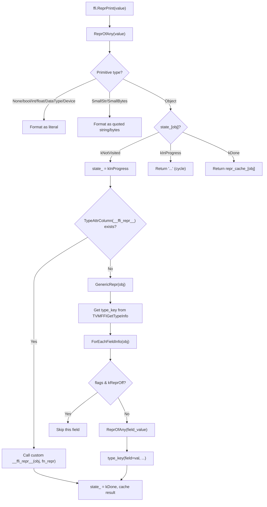

# FFI Unified Repr Print (`ffi.ReprPrint`)

**TL;DR**.
- `ffi.ReprPrint` is a single C++ global function that produces human-readable `repr` for any `Any` value using a DFS with 3-state (NotVisited/InProgress/Done) cycle and DAG tracking. It replaces all previous Python-side exec()-based `__repr__` codegen.
- Types can provide custom repr via the `__ffi_repr__` TypeAttr column. Built-in callbacks are registered for all core container types (`String`, `Bytes`, `Tensor`, `Shape`, `Array`, `List`, `Map`).
- The reflection system is extended with `Repr(false)` InfoTrait and `kTVMFFIFieldFlagBitMaskReprOff = 1<<6` C ABI flag for excluding specific fields from the generic repr output.

## Problem Statement
### Background
- Before this design, `@c_class` generated Python `__repr__` methods via exec()-based codegen (`method_repr` in `_utils.py`), producing `ClassName(field=value, ...)` format. This approach was Python-only, had no cycle/DAG awareness, and was limited to reflected c_class types.
- Container types (`Array`, `List`, `Map`) used ad-hoc Python f-string formatting for repr, producing inconsistent output across types.
- There was no unified way to get human-readable repr for arbitrary FFI values from C++.

### Solution
- A single C++ `ReprPrinter` class implements DFS-based repr with:
  - 3-state tracking (NotVisited/InProgress/Done) for cycle detection and DAG memoization
  - Per-type custom repr dispatch via `__ffi_repr__` TypeAttr column
  - Per-field exclusion via `kTVMFFIFieldFlagBitMaskReprOff` flag
  - Built-in callbacks for all core container types
- Python `__repr__` on all `Object` subclasses delegates to `ffi.ReprPrint` via `__object_repr__` in the Cython layer. The Python exec()-based `method_repr` and `repr` parameters on `c_class`/`field` are removed.

### Goals
- Unified repr for all FFI values (primitives, containers, reflected objects) from both C++ and Python.
- Cycle and DAG safety -- no infinite recursion, memoized output for shared nodes.
- Extensible per-type custom repr without modifying the ReprPrinter.
- Non-goal: producing parseable output (repr is for humans, not round-tripping).

## Design



### Key Classes, Fields and Interfaces

```python
# --- src/ffi/extra/repr_print.cc ---

class ReprPrinter:
    """DFS-based repr printer with 3-state cycle/DAG tracking.
    Registered as global function 'ffi.ReprPrint'."""
    state_: dict[ObjectPtr, State]        # per-object DFS state
    repr_cache_: dict[ObjectPtr, str]     # memoized repr for Done objects
    with_addr_: bool                      # from TVM_FFI_REPR_WITH_ADDR env var
    # Invariant: state_[obj] set to kInProgress before recursing, kDone after
    # Invariant: kInProgress on re-visit -> cycle detected -> emits "..." (or "...@0x<addr>")
    # Invariant: kDone -> DAG node -> returns cached repr_cache_[obj] without re-visiting
    # Interacts with: TypeAttrColumn(kRepr) for custom __ffi_repr__ dispatch
    # Interacts with: ForEachFieldInfo (skips fields with kTVMFFIFieldFlagBitMaskReprOff)
    # Interacts with: TVMFFIGetTypeInfo for type_key in generic repr header
    # Extension: per-type custom repr via __ffi_repr__ TypeAttr column

    class State(IntEnum):
        kNotVisited = 0
        kInProgress = 1
        kDone = 2

    def Run(self, value: Any) -> String:
        """Entry point. Reads TVM_FFI_REPR_WITH_ADDR env var once per run."""
        # Interacts with: os.environ["TVM_FFI_REPR_WITH_ADDR"]
        ...

    def ReprOfAny(self, value: Any) -> str:
        """Dispatch: primitives directly, objects via DFS."""
        # Covers: None, bool, int, float, DLDataType, DLDevice, SmallStr/SmallBytes,
        #         Object subtypes (DFS with state tracking)
        ...

    def GenericRepr(self, obj: Object) -> str:
        """Fallback: type_key(field=val, ...) format using ForEachFieldInfo."""
        # Skips fields where flags & kTVMFFIFieldFlagBitMaskReprOff
        # Interacts with: reflection::FieldGetter, ForEachFieldInfo
        ...

    def CreateFnRepr(self) -> Function:
        """Closure: wraps self.ReprOfAny for passing to custom __ffi_repr__ callbacks."""
        # Interacts with: Function.FromTyped, custom __ffi_repr__ function signature
        ...

def ReprPrint(value: Any) -> String:
    """C++ public function, registered as global 'ffi.ReprPrint'."""
    # Interacts with: reflection::GlobalDef
    ...

# Built-in __ffi_repr__ callbacks (registered in TVM_FFI_STATIC_INIT_BLOCK):
def ReprString(obj: StringObj, fn_repr: Function) -> String: ...    # -> "value"
def ReprBytes(obj: BytesObj, fn_repr: Function) -> String: ...      # -> b"..."
def ReprTensor(obj: TensorObj, fn_repr: Function) -> String: ...    # -> dtype[shape]@device
def ReprShape(obj: ShapeObj, fn_repr: Function) -> String: ...      # -> Shape(d0, d1, ...)
def ReprArray(obj: ArrayObj, fn_repr: Function) -> String: ...      # -> (e0, e1,) tuple format
def ReprList(obj: ListObj, fn_repr: Function) -> String: ...        # -> [e0, e1] list format
def ReprMap(obj: MapObj, fn_repr: Function) -> String: ...          # -> {k: v} dict format
# Interacts with: TypeAttrDef<T>().def(type_attr::kRepr, fn) for registration
# Invariant: fn_repr parameter allows recursive repr of child values through ReprPrinter

# --- include/tvm/ffi/c_api.h (new flag bit) ---

# kTVMFFIFieldFlagBitMaskReprOff = 1 << 6
# Interacts with: TVMFFIFieldInfo.flags, GenericRepr field iteration
# Invariant: set at registration time via Repr(false) InfoTrait; immutable after

# --- include/tvm/ffi/reflection/registry.h ---

class repr(InfoTrait):
    """InfoTrait: controls whether a field appears in generic repr output.
    Renamed from Repr to lowercase refl::repr in 6b39efbf."""
    # Usage: ObjectDef<T>().def_rw("field", &T::field, refl::repr(false))
    # Interacts with: TVMFFIFieldInfo.flags, kTVMFFIFieldFlagBitMaskReprOff
    # Invariant: repr(true) is a no-op (default state is repr-included)
    # Invariant: repr(false) sets kTVMFFIFieldFlagBitMaskReprOff in info.flags

    def __init__(self, show: bool): ...
    def Apply(self, info: TVMFFIFieldInfo) -> None: ...

# type_attr::kRepr = "__ffi_repr__"
# TypeAttr column name for custom repr callbacks.
# Interacts with: ReprPrinter.ProcessObject, RegisterBuiltinRepr, TypeAttrDef<T>

# --- python/tvm_ffi/cython/object.pxi ---

def __object_repr__(obj: Object) -> str:
    """Lazy-load ffi.ReprPrint and delegate. Falls back to ClassName(addr) on error."""
    # Invariant: _REPR_PRINT_LOADED prevents repeated lookup attempts
    # Invariant: try/except ensures __repr__ never raises
    # Interacts with: _get_global_func("ffi.ReprPrint", allow_missing=False)
    ...
```

### Contracts, Assumptions and Invariants
- **3-state DFS guarantee**: Every object is visited at most once per `Run()` invocation. Cycles produce `"..."` markers; DAG nodes reuse cached repr. No infinite recursion is possible.
- **Field exclusion is immutable**: The `kTVMFFIFieldFlagBitMaskReprOff` flag is set at `ObjectDef<T>` registration time and cannot be changed at runtime. This ensures consistent repr output.
- **`__repr__` never raises**: The Python `__object_repr__` catches all exceptions and falls back to `ClassName(0x<addr>)` format. This prevents repr failures from crashing debuggers or logging.
- **Custom callback contract**: `__ffi_repr__` callbacks receive `(const T* obj, const Function& fn_repr)`. They MUST use `fn_repr` to repr child values (not call `ReprPrint` directly) to participate in cycle/DAG tracking.
- **Backward incompatibility**: `Array.__repr__()` format changed from `[1, 2, 3]` (list brackets) to `(1, 2, 3)` (tuple parentheses). `c_class(repr=...)` and `field(repr=...)` parameters are removed.

### Extension Points
- **Custom per-type repr**: Register a `__ffi_repr__` callback via `TypeAttrDef<MyObj>().def(type_attr::kRepr, fn)`. The callback receives the object and a `fn_repr` function for recursive child repr.
- **Per-field repr exclusion**: Use `Repr(false)` InfoTrait when registering fields to exclude them from generic repr output.
- **Address display**: Set `TVM_FFI_REPR_WITH_ADDR=1` env var to include object addresses in repr output for debugging.

### Usage Examples

#### C++ -> Python end-to-end: basic object repr
**Context**: Registering fields with Repr(false) exclusion, then viewing repr from Python.
```cpp
// C++ registration:
TVM_FFI_STATIC_INIT_BLOCK() {
  refl::ObjectDef<MyObj>()
      .def(refl::init<int64_t, String>())
      .def_rw("value", &MyObj::value)                         // included in repr
      .def_rw("internal_cache", &MyObj::cache, refl::Repr(false));  // excluded
}
```
```python
# Python usage -- __repr__ delegates to ffi.ReprPrint automatically:
import tvm_ffi
obj = MyObj(value=42, internal_cache="temp")
repr(obj)  # => 'my_ns.MyObj(value=42)'  -- internal_cache excluded

# Direct call for any value:
from tvm_ffi._ffi_api import ReprPrint
ReprPrint(42)                          # => "42"
ReprPrint(tvm_ffi.Array([1, 2, 3]))   # => "(1, 2, 3)"
ReprPrint(tvm_ffi.List([10, 20]))      # => "[10, 20]"
ReprPrint(tvm_ffi.Map({"a": 1}))      # => {"a": 1}
```

#### Registering a custom `__ffi_repr__` callback in C++
**Context**: When the default field-by-field format is insufficient for a type.
```cpp
TVM_FFI_STATIC_INIT_BLOCK() {
  Function repr_fn = Function::FromTyped(
      [](const MyTypeObj* obj, const Function& fn_repr) -> String {
          // Use fn_repr to repr children (participates in cycle/DAG tracking)
          String child_repr = fn_repr(AnyView(obj->child)).cast<String>();
          return String("MyType<" + std::to_string(obj->value) + ", " + child_repr + ">");
      });
  TVMFFIByteArray attr_name = {type_attr::kRepr, strlen(type_attr::kRepr)};
  TVMFFIAny attr_val = AnyView(repr_fn).CopyToTVMFFIAny();
  TVMFFITypeRegisterAttr(MyTypeObj::RuntimeTypeIndex(), &attr_name, &attr_val);
}
// Repr output: MyType<42, (child_repr_here)>
```

## Implementation Notes
- `ReprPrinter` is implemented in `src/ffi/extra/dataclass.cc` (consolidated from `repr_print.cc` in 6b39efbf, sharing the `ObjectGraphDFS` CRTP engine with DeepCopy/RecursiveHash/RecursiveEq). The public header is now `include/tvm/ffi/extra/dataclass.h`. The `ReprPrint` global is registered via `refl::GlobalDef("ffi.ReprPrint", ...)`.
- Built-in callbacks for `String`, `Bytes`, `Tensor`, `Shape`, `Array`, `List`, `Map` are registered in a `TVM_FFI_STATIC_INIT_BLOCK` via `TypeAttrDef<T>().def(type_attr::kRepr, fn)`.
- The `__ffi_repr__` callback signature is `(const T*, const Function&) -> String`, where the second argument is `CreateFnRepr()` -- a closure over the printer's `ReprOfAny` method for recursive repr.
- Python's `__object_repr__` in `object.pxi` lazy-loads `ffi.ReprPrint` on first call and caches it via `_REPR_PRINT_LOADED` flag.
- The `Repr(bool)` InfoTrait follows the same `InfoTrait::Apply` pattern as `DefaultValue`, `AttachFieldFlag`, etc. in the reflection system.

## Alternatives & Trade-offs
### C++ DFS printer vs. Python-side exec()-based repr
- Pros of C++ DFS: Unified across all languages. Cycle/DAG safe. Works for all Object types automatically, not just @c_class types.
- Cons: Python callers must cross the FFI boundary for repr (minor overhead). Custom Python repr logic must be registered as C++ `__ffi_repr__` callback.
### Per-field Repr(false) flag vs. Separate repr field list
- Pros of flag: Co-located with field registration. No separate configuration.
- Cons: Requires a new C ABI flag bit (1<<6). Cannot be changed at runtime.

## Evidence
| Commit | Scope | Contribution |
|--------|-------|-------------|
| b648c5d6 | ffi/reflection, ffi/c-api, ffi/extra, python | Introduced ReprPrinter, `ffi.ReprPrint` global, `kTVMFFIFieldFlagBitMaskReprOff`, `Repr(bool)` InfoTrait, `__ffi_repr__` TypeAttr column, built-in callbacks, Python __object_repr__ delegation, removed c_class/field repr params |
| 6b39efbf | ffi/extra | Consolidated repr_print.cc into dataclass.cc; public header moved to `dataclass.h`; `Repr` renamed to lowercase `repr` |

## Related Design Docs & ADRs
- [0007-reflection.md](0007-reflection.md) -- InfoTrait base class, TVMFFIFieldFlagBitMask, ForEachFieldInfo, TypeAttrDef/TypeAttrColumn
- [0001-c-abi.md](0001-c-abi.md) -- TVMFFIFieldInfo.flags where kTVMFFIFieldFlagBitMaskReprOff is stored
- [0006-containers.md](0006-containers.md) -- Container types that have built-in __ffi_repr__ callbacks
- [0016-python-dataclasses.md](0016-python-dataclasses.md) -- Removed repr parameter from c_class/field
- [0004-function-system.md](0004-function-system.md) -- Function.FromTyped used by custom __ffi_repr__ callbacks
- [0024-dataclass-ops.md](0024-dataclass-ops.md) -- Unified dataclass.h public header (consolidated from repr_print.h + deep_copy.h)
