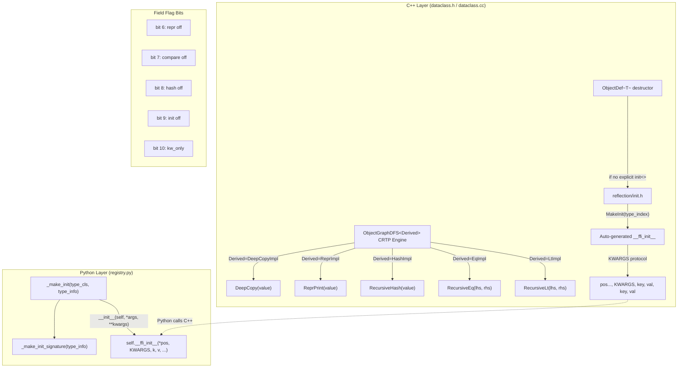

# FFI Dataclass Operations (`dataclass.h`)

**TL;DR**.
- `include/tvm/ffi/extra/dataclass.h` is the unified public header for reflection-based dataclass operations: `DeepCopy`, `ReprPrint`, `RecursiveHash`, `RecursiveEq`, `RecursiveLt`, `RecursiveLe`, `RecursiveGt`, `RecursiveGe`. All share a single `ObjectGraphDFS` CRTP engine in `src/ffi/extra/dataclass.cc`.
- The `RecursiveHash`/`RecursiveEq`/`RecursiveLt`/`RecursiveLe`/`RecursiveGt`/`RecursiveGe` family provides field-by-field recursive comparison and hashing with per-field opt-out via `compare(false)` and `hash(false)` reflection traits, and custom hook dispatch via `__ffi_eq__`, `__ffi_compare__`, `__ffi_hash__` TypeAttr columns.
- `ObjectDef<T>` destructor auto-generates a packed `__ffi_init__` constructor from reflection field metadata (supporting positional args, keyword-only args, defaults, and the KWARGS calling convention). Python `_make_init` in `registry.py` wires this to a proper `__init__` with `inspect.Signature`.

## Problem Statement
### Background
- `deep_copy.cc` and `repr_print.cc` each independently implemented graph-walking logic (DFS with memoization, cycle detection). This code duplication was fragile and made the two subsystems evolve independently despite sharing the same traversal pattern.
- The existing `StructuralEqual`/`StructuralHash` (in `0009-structural-eq-hash`) operates on a per-type `TVMFFISEqHashKind` strategy enum (tree, DAG, free-var modes) designed for IR node comparison. A simpler recursive comparison/hashing facility was needed for plain dataclass-style objects that just compare all fields in order.
- C++ types registered via `ObjectDef<T>` had no automatic `__ffi_init__` generation. Users had to explicitly call `.def(refl::init<Args...>())` for each constructor. When omitted, the type had no init and Python construction failed.

### Solution
- Consolidate `deep_copy.cc` + `repr_print.cc` into `src/ffi/extra/dataclass.cc`, backed by a shared `ObjectGraphDFS` CRTP engine that eliminates duplicated graph-walking code. New `RecursiveHash`/`RecursiveEq`/`RecursiveLt`/`RecursiveLe`/`Gt`/`Ge` operations reuse the same engine.
- New field flag bitmask bits (7-10) and lowercase reflection traits (`compare`, `hash`, `kw_only`, `init`, `repr`, `default_`, `default_factory`) provide fine-grained control over which fields participate in comparison, hashing, and auto-init.
- `ObjectDef<T>` destructor calls `RegisterAutoInit` when no explicit `init<Args...>` was supplied, auto-generating a packed `__ffi_init__` from reflected field metadata. Python `_make_init` / `_make_init_signature` generate a proper `__init__` with KWARGS support.

### Goals
- Single shared graph-walking engine for deep copy, repr, hash, and comparison.
- Field-level opt-out for comparison (`compare(false)`), hashing (`hash(false)`), init (`init(false)`), and repr (`repr(false)`).
- Automatic `__ffi_init__` generation for all reflected types (zero boilerplate).
- Full Python `__init__` with keyword-only args, defaults, and `inspect.Signature`.
- Non-goal: Replacing `StructuralEqual`/`StructuralHash` (which serve a different purpose with DAG/free-var semantics).

## Design



### Key Classes, Fields and Interfaces

```python
# --- include/tvm/ffi/extra/dataclass.h (unified public header) ---

def DeepCopy(value: Any) -> Any: ...
    # Interacts with: ObjectGraphDFS, __ffi_shallow_copy__ TypeAttr
    # See 0022-deep-copy for full contract

def ReprPrint(value: Any) -> String: ...
    # Interacts with: ObjectGraphDFS, __ffi_repr__ TypeAttr
    # See 0023-repr-print for full contract

def RecursiveHash(value: Any) -> int64_t: ...
    # Interacts with: ObjectGraphDFS, ForEachFieldInfo, __ffi_hash__ TypeAttr
    # Invariant: RecursiveEq(a, b) => RecursiveHash(a) == RecursiveHash(b)
    # Invariant: fields with kTVMFFIFieldFlagBitMaskHashOff (bit 8) are excluded
    # Invariant: fields with kTVMFFIFieldFlagBitMaskCompareOff (bit 7) are also excluded
    # Extension: register __ffi_hash__ TypeAttr for custom per-type hashing

def RecursiveEq(lhs: Any, rhs: Any) -> bool: ...
    # Interacts with: ObjectGraphDFS, ForEachFieldInfo, __ffi_eq__ TypeAttr
    # Invariant: fields with kTVMFFIFieldFlagBitMaskCompareOff (bit 7) are excluded
    # Extension: register __ffi_eq__ TypeAttr for custom per-type equality

def RecursiveLt(lhs: Any, rhs: Any) -> bool: ...
    # Interacts with: ObjectGraphDFS, ForEachFieldInfo, __ffi_compare__ TypeAttr
    # Invariant: lexicographic field-by-field comparison (parent-first order)
    # Invariant: type_index mismatch -> compare by type_index (total ordering)

def RecursiveLe(lhs: Any, rhs: Any) -> bool: ...
def RecursiveGt(lhs: Any, rhs: Any) -> bool: ...
def RecursiveGe(lhs: Any, rhs: Any) -> bool: ...
    # All delegate to the same comparison engine with different result interpretation

# --- Relationship: Recursive* vs Structural* ---
# RecursiveHash/Eq/Lt: simple field-by-field for dataclass-style objects.
#   - No DAG/free-var/memo semantics
#   - Per-field opt-out via compare(false)/hash(false) flags
#   - Custom hooks via __ffi_eq__/__ffi_compare__/__ffi_hash__ TypeAttrs
# StructuralHash/Equal: IR-node-aware with TVMFFISEqHashKind modes.
#   - DAG memo tracking, free variable mapping, const-tree pointer shortcuts
#   - Custom hooks via __s_equal__/__s_hash__ TypeAttrs
#   - See 0009-structural-eq-hash for details

# --- ObjectGraphDFS CRTP Engine (src/ffi/extra/dataclass.cc, internal) ---

class ObjectGraphDFS(Generic[Derived]):
    """Shared CRTP base for all dataclass graph operations.
    Provides memoized DFS traversal with cycle detection."""
    # Invariant: each object visited at most once per run
    # Invariant: cycles handled via memo (no infinite recursion)
    # Extension: subclass and implement visit callbacks for new operations
    # Interacts with: ForEachFieldInfo for field iteration
    # Interacts with: TVMFFIFieldInfo.flags for per-field exclusion (repr/compare/hash)

# --- include/tvm/ffi/c_api.h — new TVMFFIFieldFlagBitMask values ---

# kTVMFFIFieldFlagBitMaskCompareOff = 1 << 7   # exclude from RecursiveEq/Lt/Le/Gt/Ge
# kTVMFFIFieldFlagBitMaskHashOff    = 1 << 8   # exclude from RecursiveHash
# kTVMFFIFieldFlagBitMaskInitOff    = 1 << 9   # exclude from auto-generated __ffi_init__
# kTVMFFIFieldFlagBitMaskKwOnly     = 1 << 10  # keyword-only in __ffi_init__ signature
# Interacts with: TVMFFIFieldInfo.flags (extend existing bits 0-6)

# --- include/tvm/ffi/reflection/registry.h — lowercase reflection traits ---

class compare(InfoTrait):
    """Control whether a field participates in RecursiveEq/Lt/Le/Gt/Ge."""
    # Usage: ObjectDef<T>().def_rw("field", &T::field, refl::compare(false))
    # Invariant: compare(false) sets kTVMFFIFieldFlagBitMaskCompareOff in flags
    # Invariant: compare(false) also implies hash(false) for consistency

class hash(InfoTrait):
    """Control whether a field participates in RecursiveHash."""
    # Usage: ObjectDef<T>().def_rw("field", &T::field, refl::hash(false))
    # Invariant: hash(false) sets kTVMFFIFieldFlagBitMaskHashOff in flags

class kw_only(InfoTrait):
    """Mark a field as keyword-only in the auto-generated __ffi_init__."""
    # Usage: ObjectDef<T>().def_rw("field", &T::field, refl::kw_only(true))
    # Invariant: kw_only(true) sets kTVMFFIFieldFlagBitMaskKwOnly in flags

class init(InfoTrait):
    """Control whether a field appears in the auto-generated __ffi_init__."""
    # Usage: ObjectDef<T>().def_rw("field", &T::field, refl::init(false))
    # Invariant: init(false) sets kTVMFFIFieldFlagBitMaskInitOff in flags
    # Note: this is the InfoTrait, not the constructor registration helper init<Args...>

# Renamed traits (uppercase -> lowercase):
# refl::Repr      -> refl::repr       (still controls repr, unchanged semantics)
# refl::DefaultValue -> refl::default_value (alias)
# refl::DefaultFactory -> refl::default_factory (alias)

# --- include/tvm/ffi/reflection/init.h — auto-init system ---

def MakeInit(type_index: int32) -> Function:
    """Create a packed __ffi_init__ constructor from reflection field metadata.
    # Pre-computes AutoInitInfo once per type:
    #   - Walks ForEachFieldInfo to collect all fields
    #   - Partitions into: init=True positional, init=True kw_only, init=False
    #   - Reorders positional: required before optional (stable_partition)
    #   - Builds name_to_index map for KWARGS lookup
    # At call time:
    #   1. Call creator to default-construct object
    #   2. Scan args for KWARGS sentinel position
    #   3a. KWARGS mode: bind positional args, then key-value pairs after sentinel
    #   3b. Positional-only mode: bind args to pos_indices in order
    #   4. Fill defaults for unbound fields (SetFieldToDefault)
    #   5. Raise TypeError for missing required fields
    # Interacts with: ForEachFieldInfo, TVMFFITypeMetadata.creator, SetFieldToDefault
    # Invariant: required positional args come before optional in call order
    # Invariant: KWARGS sentinel is ffi.GetKwargsObject() singleton
    """

def RegisterAutoInit(type_index: int32) -> None:
    """Register MakeInit result as __ffi_init__ method with auto_init:true metadata."""
    # Interacts with: TVMFFITypeRegisterMethod, MakeInit
    # Called by: ObjectDef<T> destructor when no explicit init<> was supplied

# --- python/tvm_ffi/registry.py — Python __init__ generation ---

def _make_init(type_cls: type, type_info: TypeInfo) -> Callable:
    """Build Python __init__ delegating to C++ __ffi_init__ via KWARGS protocol.
    # Generated __init__:
    #   def __init__(self, *args, **kwargs):
    #       ffi_args = list(args) + [KWARGS] + [k, v for k, v in kwargs.items()]
    #       self.__ffi_init__(*ffi_args)
    # Attaches inspect.Signature from _make_init_signature
    # Interacts with: core.KWARGS sentinel, __ffi_init__, _make_init_signature
    """

def _make_init_signature(type_info: TypeInfo) -> inspect.Signature:
    """Build inspect.Signature from parent-chain fields (parent-first order).
    # Walks TypeInfo.parent_type_info chain to root, collects all fields
    # Fields with c_init=False excluded
    # Fields with c_kw_only=True go to KEYWORD_ONLY group
    # Within each group: required params before optional (stable sort)
    # Interacts with: TypeInfo.fields, TypeField.c_init/c_kw_only/c_has_default
    # Invariant: signature matches C++ MakeInit's pos_indices ordering
    """

# --- Python exposure of recursive operations ---
# python/tvm_ffi/_ffi_api.py stubs:
# def RecursiveEq(lhs: Any, rhs: Any) -> bool: ...
# def RecursiveLt(lhs: Any, rhs: Any) -> bool: ...
# def RecursiveLe(lhs: Any, rhs: Any) -> bool: ...
# def RecursiveGt(lhs: Any, rhs: Any) -> bool: ...
# def RecursiveGe(lhs: Any, rhs: Any) -> bool: ...
# def RecursiveHash(value: Any) -> int: ...
# def MakeInit(type_key: str) -> Function: ...
# def GetKwargsObject() -> Object: ...
```

### Contracts, Assumptions and Invariants
- **Hash-equality consistency**: `RecursiveEq(a, b)` implies `RecursiveHash(a) == RecursiveHash(b)`. Both use the same field iteration order and respect the same `compare(false)` exclusion flags.
- **Total ordering**: `RecursiveLt` provides a strict total order on values. Type index mismatch compares by type index. Field-by-field lexicographic comparison within same-type objects.
- **Auto-init fallback**: If no explicit `refl::init<Args...>` is registered via `.def()`, `ObjectDef<T>` destructor auto-generates `__ffi_init__` from reflected fields. The `has_explicit_init_` flag prevents double registration.
- **KWARGS sentinel identity**: The KWARGS sentinel (`ffi.GetKwargsObject()`) is a singleton. Python `_make_init` and C++ `MakeInit` both resolve the same sentinel, matched by object identity (`same_as`).
- **Signature ordering alignment**: C++ `MakeInit` and Python `_make_init_signature` both apply the same ordering: required positional before optional positional, then required keyword-only before optional keyword-only. This ensures `inspect.signature()` matches the C++ init's behavior.
- **Failure mode — missing required field**: If a required field (no default, init=True) is not provided in args or kwargs, `MakeInit` throws `TypeError` with the field name.
- **Failure mode — unexpected keyword**: If a keyword argument does not match any init-eligible field, `MakeInit` throws `TypeError`.

### Extension Points
- **Custom recursive operations**: Subclass `ObjectGraphDFS` (internal CRTP engine) to add new graph-walking operations that share cycle/memo infrastructure.
- **Custom comparison hooks**: Register `__ffi_eq__` (equality), `__ffi_compare__` (ordering), `__ffi_hash__` (hash) via `TypeAttrDef<T>` for types needing non-standard dataclass comparison.
- **Custom `__init__`**: Users can define their own `__init__` that calls `self.__ffi_init__(...)` with transformed arguments. The auto-generated `__init__` is only installed if the class does not already define one.

### Usage Examples

#### C++ reflection traits for comparison, hash, and init control
**Context**: Registering a type with fine-grained field control over comparison, hashing, and init behavior.
```cpp
TVM_FFI_STATIC_INIT_BLOCK() {
  namespace refl = tvm::ffi::reflection;
  refl::ObjectDef<MyDataObj>()
      .def_rw("key", &MyDataObj::key)                            // in compare, hash, init
      .def_rw("value", &MyDataObj::value)                        // in compare, hash, init
      .def_rw("cache", &MyDataObj::cache,
              refl::init(false),         // exclude from __ffi_init__
              refl::compare(false),      // exclude from RecursiveEq/Lt
              refl::hash(false),         // exclude from RecursiveHash
              refl::repr(false),         // exclude from ReprPrint
              refl::default_value(0))    // default when not in init
      .def_rw("label", &MyDataObj::label,
              refl::kw_only(true),       // keyword-only in __init__
              refl::default_value(""));  // optional with default
  // ObjectDef destructor auto-registers __ffi_init__ with these field configs
}

// C++ usage:
int64_t h = ffi::RecursiveHash(obj);
bool eq  = ffi::RecursiveEq(obj1, obj2);  // ignores 'cache' field
bool lt  = ffi::RecursiveLt(obj1, obj2);  // lexicographic on key, value only
```

#### Python end-to-end: auto-generated __init__ with keyword-only args
**Context**: Using the auto-generated Python `__init__` with positional and keyword-only arguments derived from C++ reflection.
```python
@register_object("testing.TestKwOnly")
class TestKwOnly(Object):
    pass  # __init__ auto-generated from C++ reflection

# Generated __init__ signature (from C++ reflection):
# def __init__(self, x: int, *, y: int = 0): ...
obj = TestKwOnly(1, y=2)     # keyword-only arg
obj = TestKwOnly(1)           # default applied to y
import inspect
sig = inspect.signature(TestKwOnly)  # introspectable

# Under the hood, Python __init__ calls:
# self.__ffi_init__(1, KWARGS, "y", 2)
# which C++ MakeInit receives as: positional=[1], kwargs={"y": 2}
```

#### Python: RecursiveHash/Eq with consistency law
**Context**: Using recursive comparators from Python with field exclusion.
```python
from tvm_ffi._ffi_api import RecursiveEq, RecursiveLt, RecursiveHash

a = tvm_ffi.testing.TestIntPair(1, 2)
b = tvm_ffi.testing.TestIntPair(1, 2)
c = tvm_ffi.testing.TestIntPair(1, 3)

# Hash consistency:
assert RecursiveHash(a) == RecursiveHash(b)  # equal objects -> same hash
assert RecursiveEq(a, b)                      # field-by-field equality

# Ordering:
assert RecursiveLt(a, c)   # 2 < 3 on second field
assert not RecursiveLt(c, a)
```

### Macro Expansions

```python
# ObjectDef<T> destructor auto-init expansion (pseudocode):
# When ObjectDef<T> goes out of scope:
#   if not has_explicit_init_:
#       RegisterAutoInit(type_index_)
#           -> MakeInit(type_index_) creates Function from field analysis
#           -> TVMFFITypeRegisterMethod(type_index_, {name="__ffi_init__", flags=static, metadata={auto_init:true}})
```

## Implementation Notes
- `ObjectGraphDFS` is an internal CRTP engine (not in the public header) in `src/ffi/extra/dataclass.cc`. It provides memoized DFS with per-object state tracking (NotVisited/InProgress/Done), shared by DeepCopy, ReprPrint, RecursiveHash, RecursiveEq, and RecursiveLt/Le/Gt/Ge implementations.
- The previous standalone `deep_copy.h` public header has been removed; `DeepCopy` is now accessed exclusively via `dataclass.h`. The internal implementation is in `src/ffi/object_internal.h`.
- `MakeInit` in `reflection/init.h` pre-computes an `AutoInitInfo` struct once per type, caching field analysis (init eligibility, kw_only status, default presence, positional index ordering) for efficient reuse across constructor calls.
- The KWARGS calling convention packs arguments as: `[pos0, pos1, ..., KWARGS_SENTINEL, "key0", val0, "key1", val1, ...]`. The sentinel is a global singleton obtained via `ffi.GetKwargsObject()`.

## Alternatives & Trade-offs
### Unified dataclass.h vs. Separate Headers
- Pros of unified: Single include for all dataclass operations. Shared graph-walking engine eliminates code duplication. Consistent field flag semantics across operations.
- Cons: Larger compilation unit. DeepCopy users who don't need compare/hash still pull in the unified header.
### RecursiveHash/Eq vs. StructuralHash/Equal
- Pros of separate Recursive* family: Simpler semantics (no DAG/free-var modes). Per-field opt-out via flag bits (not SEqHash-specific flags). Custom hooks via `__ffi_eq__`/`__ffi_compare__`/`__ffi_hash__` (separate from `__s_equal__`/`__s_hash__`).
- Cons: Two parallel comparison systems. Users must choose the right one. `RecursiveHash`/`RecursiveEq` is for dataclass-style plain objects; `StructuralHash`/`StructuralEqual` is for IR nodes with DAG/variable semantics.
### Auto-init vs. Explicit init<Args...>
- Pros of auto: Zero boilerplate for the common case. Every reflected type gets a working `__ffi_init__` without explicit registration. Supports keyword-only and defaults from field metadata.
- Cons: Less control over constructor behavior. Types with complex initialization logic should still use explicit `.def(refl::init<Args...>())`.

## Evidence
| Commit | Scope | Contribution |
|--------|-------|-------------|
| 6b39efbf | ffi/reflection, ffi/extra, ffi/c-api, python | Consolidate deep_copy+repr_print into dataclass.cc; add RecursiveHash/Eq/Lt/Le; add auto-init; lowercase traits; field flag bits 7-10 |
| b87196f9 | python/ffi-bindings, ffi/extra | Expose RecursiveEq/Lt/Le/Gt/Ge to Python; testing fixtures with custom hooks |
| 5796ff4b | python/ffi-bindings, ffi/extra | Expose RecursiveHash to Python; TestHash/TestCustomHash fixtures |
| b1abaeac | python/ffi-bindings, python/dataclasses | Wire C++ __ffi_init__ to Python __init__ via _make_init + KWARGS protocol |

## Related Design Docs & ADRs
- [0007-reflection.md](0007-reflection.md) -- ObjectDef, reflection traits, field flag bitmask, TypeAttrDef
- [0009-structural-eq-hash.md](0009-structural-eq-hash.md) -- Parallel comparison system for IR nodes (DAG/free-var semantics)
- [0022-deep-copy.md](0022-deep-copy.md) -- DeepCopy API now accessed via dataclass.h
- [0023-repr-print.md](0023-repr-print.md) -- ReprPrint API now accessed via dataclass.h
- [0016-python-dataclasses.md](0016-python-dataclasses.md) -- Python @c_class and __init__ wiring
- [0012-python-package.md](0012-python-package.md) -- register_object and _add_class_attrs where _make_init is installed
- [0001-c-abi.md](0001-c-abi.md) -- TVMFFIFieldFlagBitMask extended with bits 7-10
