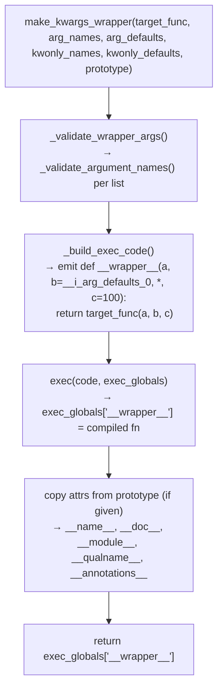
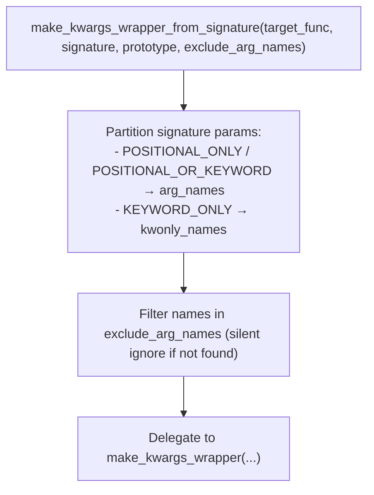

# kwargs Wrapper — Code-Gen Bridge for Positional-Only FFI Callables

**TL;DR**
- `make_kwargs_wrapper` code-generates a Python function via `exec()` that wraps any positional-only callable with full keyword-argument and default-value support, bridging C++ packed-call convention to idiomatic Python call sites.
- The `MISSING` sentinel distinguishes "argument not passed" from "explicit `None`", using the same pattern as `dataclasses` / `pydantic`. Default values are embedded as identifiers in `exec_globals` with `__i_` prefix to prevent collision with user argument names.
- `make_kwargs_wrapper_from_signature` adds a higher-level path: extract parameter names/defaults from an `inspect.Signature`, optionally skip specific names via `exclude_arg_names`, and delegate to `make_kwargs_wrapper`.

## Problem Statement

### Background
TVM FFI packed functions use a positional-only calling convention: `fn(arg0, arg1, arg2)`. When exposing these callables as Python APIs, callers expect named arguments, keyword-only parameters, and defaults — all of which the raw packed call cannot express.

### Solution
Generate a thin Python wrapper function at import time using `exec()`. The generated code is a syntactically valid Python function definition with explicit parameter names, defaults, and keyword-only parameters. Because it is generated once and compiled via `exec()`, dispatch overhead at call time is identical to a hand-written function. The `MISSING` sentinel avoids the `None`-as-default ambiguity that plagues `inspect.Parameter.empty`.

### Goals
- O(1) call overhead: the wrapper is a regular compiled Python function, not a closure over a loop.
- Safety: `_validate_argument_names` rejects Python keywords and non-identifier strings before `exec()` is called — no generated syntax errors.
- Extensible: `make_kwargs_wrapper_from_signature` allows consuming an `inspect.Signature` from any callable; `exclude_arg_names` lets callers omit framework-internal positional args (e.g., `self`, `cls`).
- Non-goal: runtime introspection of the packed-call function's type schema (handled separately by `0019-type-schema`).

## Design

### Generation Pipeline





### Key Classes, Fields and Interfaces

```python
# python/tvm_ffi/utils/kwargs_wrapper.py

MISSING: object
# Singleton sentinel; distinguishes "not passed" from explicit None.
# Invariant: stable identity for process lifetime — use `is MISSING` not `== MISSING`
# Interacts with: make_kwargs_wrapper (used in generated default expressions)

def make_kwargs_wrapper(
    target_func: Callable,
    arg_names: list[str],
    arg_defaults: tuple = (),
    kwonly_names: list[str] | None = None,
    kwonly_defaults: dict[str, Any] | None = None,
    prototype: Callable | None = None,
) -> Callable:
    """Code-generate a positional-only wrapper with optional kwargs support.

    Parameters
    ----------
    target_func   : the underlying callable to wrap (e.g. a packed FFI function)
    arg_names     : positional parameter names (must be valid identifiers AND non-keywords)
    arg_defaults  : right-aligned positional defaults; len <= len(arg_names)
                    last len(arg_defaults) names get these defaults
    kwonly_names  : keyword-only parameter names (after * in generated signature)
    kwonly_defaults: default values for keyword-only params; keys ⊆ kwonly_names
    prototype     : if given, __name__/__doc__/__module__/__qualname__/__annotations__
                    are copied from this callable to the wrapper

    # Invariant: arg_names ∩ kwonly_names == ∅ (ValueError on overlap)
    # Invariant: kwonly_defaults.keys() ⊆ kwonly_names (ValueError otherwise)
    # Invariant: all names are valid identifiers AND not Python keywords
    # Invariant: None/bool defaults embedded inline; all other defaults stored in
    #            exec_globals with key "__i_arg_defaults_<i>" to avoid repr hazards
    # Invariant: exec_globals keys use "__i_" prefix to avoid collision with user arg names
    # Interacts with: _validate_wrapper_args(), exec(), MISSING sentinel
    # Extension: pass prototype to expose the wrapper under the target's name/docstring
    """

def make_kwargs_wrapper_from_signature(
    target_func: Callable,
    signature: inspect.Signature,
    prototype: Callable | None = None,
    exclude_arg_names: Iterable[str] | None = None,
) -> Callable:
    """Build a kwargs wrapper from an inspect.Signature.

    # Invariant: signature must not contain VAR_POSITIONAL (*args) or VAR_KEYWORD (**kwargs)
    # Invariant: names in exclude_arg_names that are absent from signature are silently ignored
    # Interacts with: make_kwargs_wrapper (delegates after partitioning params)
    # Interacts with: inspect.Parameter.kind (POSITIONAL_ONLY/POSITIONAL_OR_KEYWORD → arg_names;
    #                 KEYWORD_ONLY → kwonly_names)
    """

def _validate_argument_names(names: list[str], arg_type: str) -> None:
    """Check each name: must be str, not a Python keyword, and a valid identifier.
    # NEW (commit 6bc1a8eb): keyword.iskeyword(name) check runs BEFORE isidentifier()
    # Invariant: raises ValueError on any invalid name with a descriptive message
    # Interacts with: keyword.iskeyword(), str.isidentifier()
    """

def _validate_wrapper_args(
    arg_names: list[str],
    arg_defaults: tuple,
    kwonly_names: list[str] | None,
    kwonly_defaults: dict[str, Any] | None,
    reserved_names: set[str],
) -> None:
    """Aggregate validation across all parameter lists.
    # Invariant: reserved_names are names already claimed by exec_globals infrastructure
    # Interacts with: _validate_argument_names (called once per list)
    """
```

### Contracts, Assumptions and Invariants

- `arg_defaults` is right-aligned: the last `len(arg_defaults)` entries in `arg_names` receive defaults. `len(arg_defaults) <= len(arg_names)` is always required.
- Default values of type `None` or `bool` are embedded directly into the generated code source (e.g., `def f(x, y=None, z=True)`). All other values are placed in `exec_globals` as `__i_arg_defaults_<i>` to avoid `repr()` hazards (arbitrary types may have repr that is not valid Python, or may have side effects).
- The generated wrapper function has `MISSING` as a keyword-only default when a keyword-only parameter has no default, so the wrapper can detect "not passed" without exposing `None`.
- Python keyword names (`if`, `class`, `return`, ...) are rejected before `exec()` because `keyword.iskeyword()` runs in `_validate_argument_names` — this ensures the generated code is always valid Python.
- `exclude_arg_names` in `make_kwargs_wrapper_from_signature` only affects which parameters are included; it does NOT change the call to `target_func`. Callers must ensure excluded arguments are handled elsewhere before the target call.

### Extension Points
- Add new validation rules in `_validate_argument_names` (e.g., length limits, reserved-prefix checks) without changing `make_kwargs_wrapper`.
- Use `exclude_arg_names` to hide internal positional arguments (`self`, context handles) when building wrappers for member functions.
- Pass a `prototype` from the original Python source function to preserve IDE discoverability and documentation.

### Usage Examples

#### Wrapping a positional-only FFI callable with keyword arguments

**Context**: exposing a C++ packed function as an idiomatic Python API.

```python
from tvm_ffi.utils.kwargs_wrapper import make_kwargs_wrapper, MISSING
import tvm_ffi

# The raw packed-call target
_raw = tvm_ffi.get_global_func("my.op")

# Wrap with positional args + defaults + keyword-only
my_op = make_kwargs_wrapper(
    _raw,
    arg_names=["x", "y", "mode"],
    arg_defaults=(0,),           # mode=0 default (right-aligned to last arg)
    kwonly_names=["axis"],
    kwonly_defaults={"axis": -1},
)

my_op(1, 2)               # → _raw(1, 2, 0, -1)
my_op(1, 2, mode=3)       # → _raw(1, 2, 3, -1)
my_op(1, 2, axis=0)       # → _raw(1, 2, 0, 0)
my_op(1, 2, 3, axis=0)    # → _raw(1, 2, 3, 0)
```

#### Wrapping from an inspect.Signature with exclusions

**Context**: auto-generating wrappers from function introspection.

```python
import inspect
from tvm_ffi.utils.kwargs_wrapper import make_kwargs_wrapper_from_signature

def source_api(ctx, x: int, y: int = 0, *, mode: str = "fast"): ...
sig = inspect.signature(source_api)

# Exclude internal 'ctx' positional arg; wrapper only exposes x, y, mode
wrapper = make_kwargs_wrapper_from_signature(
    target_func=raw_impl,
    signature=sig,
    exclude_arg_names=["ctx"],
)
wrapper(1)           # x=1, y=0, mode="fast"
wrapper(1, 2, mode="slow")
```

#### Keyword rejection (commit 6bc1a8eb validation)

```python
make_kwargs_wrapper(fn, ["a", "if"])
# → ValueError: Invalid argument name: 'if' is a Python keyword and cannot be
#   used as a parameter name
```

## Implementation Notes

- The generated wrapper is a string assembled in `_build_exec_code()`. The `exec_globals` dict is passed as the global namespace, so all `__i_`-prefixed bindings are immediately accessible inside the generated code without closure overhead.
- `prototype` attribute copying uses `functools.update_wrapper`-style assignment of `__name__`, `__doc__`, `__module__`, `__qualname__`, `__annotations__`.
- `MISSING` is defined at module level in `kwargs_wrapper.py` and re-exported via `tvm_ffi.utils.__init__.py`. Import: `from tvm_ffi.utils.kwargs_wrapper import MISSING`.

### Evolution Timeline

| Version | Commit | Change |
|---------|--------|--------|
| v1 | 3115b237 (#309) | Initial `make_kwargs_wrapper` / `make_kwargs_wrapper_from_signature`; parameter names `args_names`, `kwargsonly_names`, `prototype_func` |
| v2 | 6bc1a8eb (#311) | Rename params to `arg_names`, `kwonly_names`, `prototype`; add `exclude_arg_names`; add Python keyword rejection in `_validate_argument_names` |

## Alternatives & Trade-offs

### Alternative A: Closure-based wrapper factory
- Pros: No `exec()` needed; IDE can see the closure.
- Cons: Every call invokes a loop over arguments to build the positional call, instead of dispatching directly to a compiled function. `locals()` dict makes default-value semantics awkward for large arities.

### Alternative B: `functools.partial` + `inspect.bind`
- Pros: Pure stdlib; no code generation.
- Cons: `inspect.bind` has significant call overhead for hot paths; keyword-only enforcement requires additional wrappers; default logic becomes verbose.

## Related Design Docs & ADRs
- `.knowledge/design-records/0016-py-ffi-call-dispatch.md` — packed-call dispatch that `make_kwargs_wrapper` bridges over
- `.knowledge/design-records/0013-python-package.md` — `tvm_ffi.utils` subpackage where this lives
- `.knowledge/design-records/0020-stub-gen.md` — stub generation uses `inspect.Signature` patterns that `make_kwargs_wrapper_from_signature` also consumes
