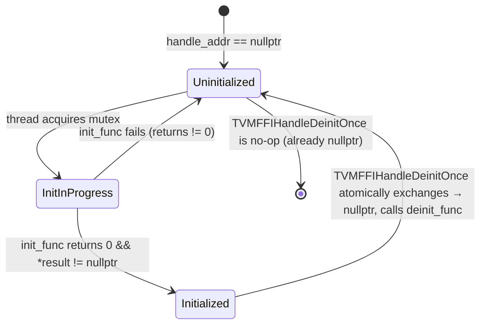

# Handle Lifecycle — TVMFFIHandleInitOnce / TVMFFIHandleDeinitOnce

**TL;DR**
- `TVMFFIHandleInitOnce` and `TVMFFIHandleDeinitOnce` are C ABI functions providing thread-safe, idempotent one-shot initialization and deinitialization of opaque handle pointers for DSL runtimes (Rust, Go, Julia, pure C) that lack C++ static-initialization infrastructure.
- Init uses a **double-checked lock** (atomic acquire-load fast path, single global `std::mutex` slow path) ensuring only the first caller runs `init_func`. Deinit uses an atomic exchange to claim responsibility for calling `deinit_func` exactly once.
- The shared-mutex caveat: all handle slots across all callers share one static mutex, so concurrent initialization of *different* handles is serialized — a known hotspot risk at startup.

## Problem Statement

### Background
C++ code can use `std::call_once` / function-local `static` for thread-safe one-shot initialization. Rust's `LazyLock`, Go's `sync.Once`, and Julia's `Base.@once` have analogues. But these all require language-specific runtime support. A C FFI consumer (e.g., a Rust crate using `extern "C"`) needs a pure C-callable primitive from `libtvm_ffi` to manage its own global handles safely, without depending on the host language's synchronization primitives.

### Solution
Two new C ABI functions in `c_api.h` with implementations in `src/ffi/init_once.cc`. Both follow the established TVM FFI C ABI convention: return `int32_t` (0 = success, non-zero = error with TLS error slot set). Platform-abstracted atomic operations (`__atomic_load_n` / `_InterlockedCompareExchangePointerAcquire`) ensure correctness on both GCC/Clang and MSVC.

### Goals
- Usable from pure C callers (Rust `extern "C"`, CGo, ctypes).
- Thread-safe without requiring callers to link a threading library.
- Idempotent: multiple concurrent calls to `TVMFFIHandleInitOnce` all return successfully once init completes.
- Failure propagation: if `init_func` returns nonzero, the handle remains `nullptr` and the error string from `TVMFFIErrorSetRaisedFromCStr` is retrievable via `TVMFFIErrorGetRaised`.
- Non-goal: per-handle mutex (global mutex is intentional — simpler, and init is cold path).

## Design

### Init / Deinit State Machine



### Key Classes, Fields and Interfaces

```python
# src/ffi/init_once.cc / include/tvm/ffi/c_api.h

def TVMFFIHandleInitOnce(
    handle_addr: void**,
    init_func: Callable[[void**], int],
) -> int:
    """Thread-safe, one-shot initialization of *handle_addr.

    Algorithm:
      1. Fast path: AtomicLoadHandleAcquire(handle_addr) — if not nullptr, return 0.
      2. Slow path: lock static global mutex; re-check *handle_addr.
      3. If still nullptr: call init_func(&result).
         - If init_func returns != 0: leave *handle_addr as nullptr; return error.
         - If init_func returns 0 but result == nullptr:
             TVMFFIErrorSetRaisedFromCStr("RuntimeError", "init_func must store non-NULL handle")
             return -1.
         - Else: AtomicStoreHandleRelease(handle_addr, result); return 0.

    # Invariant: init_func MUST write a non-NULL pointer into *result when returning 0.
    #            Returning 0 with *result=NULL is an error and is caught.
    # Invariant: after a successful call, *handle_addr is visible to all threads via
    #            acquire/release memory ordering.
    # Invariant: only one init_func invocation per handle, across all threads.
    # Interacts with: TVMFFIErrorSetRaisedFromCStr (error propagation on failure)
    # Interacts with: AtomicLoadHandleAcquire / AtomicStoreHandleRelease (internal)
    # Extension: DSL runtimes call this once during library init; handle persists until deinit.
    """

def TVMFFIHandleDeinitOnce(
    handle_addr: void**,
    deinit_func: Callable[[void*], int],
) -> int:
    """Thread-safe, one-shot deinitialization of *handle_addr.

    Algorithm:
      1. AtomicExchange(handle_addr, nullptr) → old_value.
      2. If old_value == nullptr: deinit_func is NOT called; return 0 (idempotent).
      3. Else: call deinit_func(old_value); return its result.

    # Invariant: *handle_addr is set to nullptr BEFORE deinit_func is called
    #            — prevents double-free if deinit_func triggers another deinit call.
    # Invariant: idempotent — concurrent/multiple calls all see nullptr and skip deinit_func.
    # Interacts with: _InterlockedExchangePointer (Windows) / __atomic_exchange_n (GCC/Clang)
    # Interacts with: TVMFFIHandleInitOnce (paired lifecycle)
    """

# ─── Internal platform abstractions (anonymous namespace, not exported) ─────────────────

def AtomicLoadHandleAcquire(src_addr: void**) -> void*:
    # GCC/Clang: __atomic_load_n(src_addr, __ATOMIC_ACQUIRE)
    # MSVC (Win8+, _WIN32_WINNT >= 0x0602): InterlockedCompareExchangePointerAcquire(src_addr, NULL, NULL)

def AtomicStoreHandleRelease(dst_addr: void**, src: void*) -> None:
    # GCC/Clang: __atomic_store_n(dst_addr, src, __ATOMIC_RELEASE)
    # MSVC: _InterlockedExchangePointer(dst_addr, src)
```

### Contracts, Assumptions and Invariants

- `init_func` MUST write a non-NULL value into `*result` before returning 0. If it returns 0 with `*result == nullptr`, `TVMFFIHandleInitOnce` treats this as a programming error and sets a `RuntimeError` in the TLS slot.
- The global mutex is a **process-wide singleton** inside `libtvm_ffi`. All concurrent init calls for any handle share this single mutex. Concurrent init of *different* handles is therefore serialized. This is only a concern during cold startup; the fast path (atomic acquire-load check) has zero contention after initialization.
- `TVMFFIHandleDeinitOnce` sets `*handle_addr = nullptr` atomically *before* calling `deinit_func`. This ensures that if `deinit_func` itself calls `TVMFFIHandleDeinitOnce` (or if another thread does simultaneously), they see `nullptr` and skip the deinit.
- The functions follow the TVM FFI C ABI integer return convention: 0 = success, non-zero = error. Error details are in the TLS error slot and retrievable via `TVMFFIErrorGetRaised()`.

### Extension Points
- Any C-compatible caller (Rust, Go, Julia, plain C) can manage its own global handle pool using these primitives without depending on language-specific synchronization facilities.
- Downstream DSL runtimes can call `TVMFFIHandleInitOnce` from library constructors or lazy-init paths; the double-checked-lock pattern is safe under C11/C++11 memory models on all supported platforms.

### Usage Examples

#### Thread-safe singleton handle initialization in C

**Context**: a DSL runtime that lazily initializes a global context handle the first time any API is called.

```c
static void* g_my_runtime = NULL;

static int create_my_runtime(void** result) {
    MyRuntime* rt = malloc(sizeof(MyRuntime));
    if (!rt) {
        TVMFFIErrorSetRaisedFromCStr("RuntimeError", "OOM");
        return -1;
    }
    *result = rt;  // MUST be non-NULL on success
    return 0;
}

static int destroy_my_runtime(void* handle) {
    free(handle);
    return 0;
}

// Init: safe to call from any thread, any number of times
int ret = TVMFFIHandleInitOnce(&g_my_runtime, create_my_runtime);
if (ret != 0) {
    // retrieve error: TVMFFIErrorGetRaised(...)
}
MyRuntime* rt = (MyRuntime*)g_my_runtime;

// Deinit: idempotent; deinit_func called exactly once
TVMFFIHandleDeinitOnce(&g_my_runtime, destroy_my_runtime);
TVMFFIHandleDeinitOnce(&g_my_runtime, destroy_my_runtime);  // no-op; safe
```

#### Idempotency invariant (from C++ test suite)

```cpp
void* handle = nullptr;

// First init: succeeds, handle points to new object
ASSERT_EQ(TVMFFIHandleInitOnce(&handle, InitSuccess), 0);
void* original = handle;

// Second init with different func: no-op, original handle unchanged
ASSERT_EQ(TVMFFIHandleInitOnce(&handle, AnotherInit), 0);
ASSERT_EQ(handle, original);  // InitSuccess result, not AnotherInit's

// First deinit: frees, handle becomes nullptr
ASSERT_EQ(TVMFFIHandleDeinitOnce(&handle, DeinitSuccess), 0);
ASSERT_EQ(handle, nullptr);

// Second deinit: no-op, DeinitShouldNotBeCalled is never invoked
ASSERT_EQ(TVMFFIHandleDeinitOnce(&handle, DeinitShouldNotBeCalled), 0);
```

## Implementation Notes
- Implemented in `src/ffi/init_once.cc`, registered via `CMakeLists.txt`.
- The static global mutex is a `static std::mutex` inside `TVMFFIHandleInitOnce`. It is *not* a per-handle mutex — the same mutex guards all handles. This is intentional: simpler, smaller footprint, and the common case (one or a few handles per process) sees no contention after startup.
- Windows support requires `_WIN32_WINNT >= 0x0602` (Windows 8+) for `InterlockedCompareExchangePointerAcquire`. Earlier Windows targets fall back to a full memory barrier via `_InterlockedExchangePointer`.
- Error propagation uses `TVMFFIErrorSetRaisedFromCStr("RuntimeError", ...)` — the same TLS error slot mechanism used throughout `c_api.h`.

## Alternatives & Trade-offs

### Alternative A: Expose std::call_once semantics directly
- Pros: Exact semantic match for C++ consumers.
- Cons: `std::once_flag` is a C++ type; cannot be allocated by pure-C callers. ABI is not language-agnostic.

### Alternative B: Per-handle mutex (fine-grained locking)
- Pros: No serialization across different handles.
- Cons: Each handle would need an associated mutex, which C callers cannot allocate without knowing the mutex size. The global mutex approach avoids this at the cost of startup serialization (cold-path only).

## Related Design Docs & ADRs
- `.knowledge/design-records/0001-c-abi.md` — where `TVMFFIHandleInitOnce`/`TVMFFIHandleDeinitOnce` are exported; int32_t return convention and TLS error slot
- `.knowledge/design-records/0005-error-system.md` — `TVMFFIErrorSetRaisedFromCStr` used for error propagation
