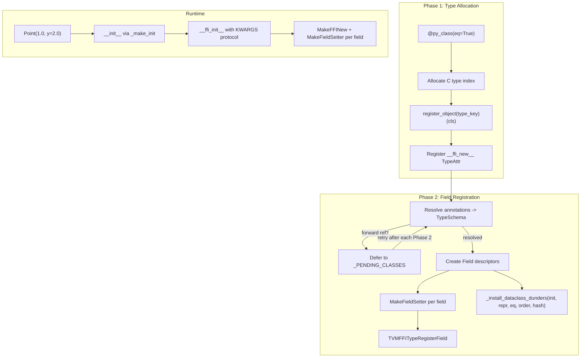

# FFI Python-Defined Dataclasses (`@py_class`)

**TL;DR**.
- `@py_class` decorator in `tvm_ffi.dataclasses` creates Python-defined FFI types from class annotations without requiring C++ type definitions. Types participate fully in the FFI type system: serialization, deep copy, repr, structural equality/hashing, and cross-language visibility.
- Two-phase registration: Phase 1 allocates a C-level type index and registers with the global registry; Phase 2 resolves type annotations into `TypeSchema` objects and registers fields via `MakeFieldSetter`/`MakeFFINew`. Forward references are deferred via `_PENDING_CLASSES` and resolved after each successful Phase 2.
- `field()` helper provides `default`, `default_factory`, `init`, `repr`, `hash`, `compare`, `kw_only` controls mirroring Python `dataclasses.field()`. `KW_ONLY` sentinel marks the positional-to-keyword-only boundary. `__post_init__` hook supported.

## Problem Statement
### Background
- The FFI type system previously required C++ type definitions (`ObjectDef<T>`) for any type to participate in reflection, serialization, and cross-language access. Python-only types had no path to the FFI type system without writing C++ code.
- `@c_class` registers Python bindings for existing C++ types but cannot create new types from Python annotations alone.

### Solution
- `@py_class` allocates a C-level type index for a Python class, registers `__ffi_new__` as a type attribute (enabling `CreateEmptyObject` fallback), and uses `MakeFieldSetter` to register per-field typed setters with type conversion.
- Annotations are resolved to `TypeSchema` objects via `TypeSchema.from_annotation()`, and `Field` descriptors carry metadata for init, repr, hash, compare, and kw_only behavior.

### Goals
- Pure-Python FFI type definitions with full system integration (serialization, copy, repr, eq/hash).
- Dataclass-like ergonomics (`field()`, defaults, `KW_ONLY`, `__post_init__`).
- Forward reference support for mutually recursive types.
- Non-goal: C++ field access by byte offset (Python fields use property-based access).

## Design



### Key Classes, Fields and Interfaces

```python
# --- python/tvm_ffi/dataclasses/py_class.py ---

@dataclass_transform(eq_default=False, order_default=False)
def py_class(
    init: bool = True,
    repr: bool = True,
    eq: bool = False,
    order: bool = False,
    unsafe_hash: bool = False,
    structure: str | None = None,  # "tree"|"var"|"dag"|"const-tree"|"singleton"|None (84f46d4)
) -> Callable[[type], type]:
    """Register a Python-defined FFI type with dataclass-style field annotations.
    # Phase 1: allocate C type index, register_object, install __ffi_new__
    # Phase 2: resolve annotations -> TypeSchema -> Field -> register fields
    # Phase 2b: _collect_py_methods -> _register_py_methods (5735098)
    # Deferred: forward references queued in _PENDING_CLASSES, retried after each Phase 2
    # Calls: _install_dataclass_dunders(cls, init, repr, eq, order, unsafe_hash)
    # When structure is set: registers TVMFFISEqHashKind via TVMFFITypeRegisterMetadata (84f46d4)
    # Interacts with: register_object, _add_class_attrs, ffi.MakeFFINew, ffi.MakeFieldSetter
    # Invariant: class must subclass Object (directly or indirectly)
    # Invariant: type_key from cls.type_key or auto-generated from module.ClassName
    # Extension: @dataclass_transform enables IDE/type-checker field inference
    """

def field(
    default=MISSING,
    default_factory=MISSING,
    init: bool = True,
    repr: bool = True,
    hash: bool | None = None,  # tri-state: None = same as compare
    compare: bool = True,
    kw_only: bool = False,
    structure: str | None = None,  # "def"|"ignore"|None (84f46d4)
) -> Field:
    """Create a Field descriptor for @py_class annotations.
    # Mirrors dataclasses.field() semantics
    # structure="def": field enters def region for structural eq/hash (maps to kSEqHashDef)
    # structure="ignore": excluded from structural eq/hash (maps to kSEqHashIgnore)
    # structure=None: default (no structural flag)
    # Interacts with: Field descriptor, py_class phase 2, TVMFFIFieldFlagBitMask
    # Invariant: default and default_factory are mutually exclusive
    """

KW_ONLY: ClassVar  # sentinel for positional->keyword-only boundary
# Re-exported from dataclasses.KW_ONLY on Python 3.10+
# Usage: class MyClass(Object): _: KW_ONLY; y: int = 0

# --- structure= parameter mapping (84f46d4) ---
_STRUCTURE_KIND_MAP: dict[str, int] = {
    "tree": 1,          # kTVMFFISEqHashKindTreeNode
    "var": 2,           # kTVMFFISEqHashKindFreeVar
    "dag": 3,           # kTVMFFISEqHashKindDAGNode
    "const-tree": 4,    # kTVMFFISEqHashKindConstTreeNode
    "singleton": 5,     # kTVMFFISEqHashKindUniqueInstance
}
# None -> kTVMFFISEqHashKindUnsupported (0, default)

# --- FFI Dunder Method Registration (5735098) ---

_FFI_RECOGNIZED_METHODS: frozenset[str] = frozenset({
    "__ffi_repr__",         # custom repr (dispatched by ReprPrint)
    "__ffi_hash__",         # custom RecursiveHash hook
    "__ffi_eq__",           # custom RecursiveEq hook
    "__ffi_compare__",      # custom RecursiveLt/Le ordering hook
    "__s_equal__",          # custom StructuralEqual hook
    "__s_hash__",           # custom StructuralHash hook
    "__data_to_json__",     # custom JSON serialization
    "__data_from_json__",   # custom JSON deserialization
})
# Only names in this frozenset are collected from cls.__dict__
# Interacts with: _collect_py_methods, TypeInfo._register_py_methods

def _collect_py_methods(cls: type) -> dict[str, Function]:
    """Scan class dict for recognized FFI dunders; wrap each as Function (5735098).
    # Only names in _FFI_RECOGNIZED_METHODS are collected
    # Wraps Python callables as tvm_ffi.Function
    # Interacts with: TVMFFITypeRegisterMethod, TVMFFITypeRegisterAttr
    """

def _register_py_methods(self: TypeInfo, py_methods: dict | None) -> None:
    """Register each method via TVMFFITypeRegisterMethod + TVMFFITypeRegisterAttr (5735098).
    # Always reads back full method table (including __ffi_init__, __ffi_shallow_copy__)
    # Ensures Python-defined hooks are callable from C++ dispatch paths
    """

# --- Two-phase registration internals ---

_PENDING_CLASSES: dict[str, PendingInfo]  # type_key -> deferred class info
# Invariant: entries are retried after each successful Phase 2 completion
# Invariant: circular forward references eventually resolve (no infinite retry)

def _resolve_phase2(cls, fields_info) -> bool:
    """Try to resolve all annotations to TypeSchema. Returns True on success.
    # If NameError for unresolved forward ref: return False (will be retried)
    # Interacts with: TypeSchema.from_annotation, typing.get_type_hints
    """

# --- Field registration at C level ---

# ffi.MakeFieldSetter(field_type_index, type_converter_int, f_convert_int) -> Function
#   Creates a field setter with raw C function pointer + opaque void* type_converter
#   Eliminates one Function allocation per field (0048790 optimization)
#   Interacts with: TVMFFITypeRegisterField, CallFieldSetter

# ffi.MakeFFINew(type_index, total_size) -> None
#   Registers __ffi_new__ type attribute for Python-defined types
#   Pre-computes TVMFFITypeInfo* stable pointer; uses calloc zero-init (0048790)
#   Interacts with: CreateEmptyObject (__ffi_new__ fallback path)

# --- __post_init__ support ---
# If cls defines __post_init__(self), the generated __init__ calls it after field assignment
# Interacts with: _make_init, KWARGS protocol
```

### Contracts, Assumptions and Invariants
- **Two-phase ordering**: Phase 1 (type index allocation) must complete before Phase 2 (field registration). Phase 2 may fail for forward references and be retried.
- **Forward reference resolution**: `_PENDING_CLASSES` entries are retried after each successful Phase 2. If all pending classes are stuck (no progress), a `NameError` is raised.
- **`__ffi_new__` fallback**: Python-defined types register `__ffi_new__` as a TypeAttr. `CreateEmptyObject` uses this fallback when no C++ `metadata->creator` exists. Enables serialization, deep copy, and init for Python types.
- **Failure mode — unresolvable forward reference**: If a type annotation references a name that is never defined, the class remains in `_PENDING_CLASSES` and Phase 2 fails with `NameError` at import time.
- **Failure mode — non-Object parent**: If a `@py_class` class does not inherit from `Object`, registration fails with `TypeError`.

### Extension Points
- **Custom `__post_init__`**: Users can define `__post_init__(self)` for post-construction validation or derived field computation, called after all fields are set.
- **`field()` descriptor customization**: All `field()` parameters (init, repr, hash, compare, kw_only) control per-field behavior in the generated dunders.
- **Structural dunders opt-in**: `eq`, `order`, `unsafe_hash` parameters on `@py_class` control which dunders are installed, following the same semantics as `@c_class`.

### Usage Examples

#### Basic @py_class with defaults and keyword-only args
**Context**: Creating a Python-defined FFI type with field defaults and keyword-only parameters.
```python
from tvm_ffi.dataclasses import py_class, field, KW_ONLY
from tvm_ffi import Object

@py_class(eq=True, unsafe_hash=True)
class Point(Object):
    type_key = "mymod.Point"
    x: float
    y: float = field(default=0.0)

p = Point(1.0, y=2.0)
assert p.x == 1.0 and p.y == 2.0
assert p == Point(1.0, 2.0)         # RecursiveEq
assert hash(p) == hash(Point(1.0, 2.0))  # RecursiveHash

# Serialization works for py_class types:
import tvm_ffi
json_str = tvm_ffi.save_json(p)
p2 = tvm_ffi.load_json(json_str)
assert p == p2
```

#### Forward references between py_class types
**Context**: Mutually recursive types resolved via deferred Phase 2.
```python
@py_class()
class TreeNode(Object):
    type_key = "tree.Node"
    value: int
    left: "TreeNode | None" = None   # forward reference
    right: "TreeNode | None" = None  # forward reference

# Phase 2 deferred until TreeNode is fully defined, then resolves
node = TreeNode(1, left=TreeNode(2), right=TreeNode(3))
```

#### Structural equality and custom FFI dunders on py_class (84f46d4 + 5735098)
**Context**: Defining an IR node type with structural comparison and custom hooks.
```python
@py_class(eq=True, structure="tree")
class IRExpr(Object):
    type_key = "ir.Expr"
    value: int
    span: Object = field(default=None, structure="ignore")  # excluded from structural eq

    def __ffi_repr__(self) -> str:
        return f"Expr({self.value})"

    def __s_equal__(self, other: "IRExpr") -> bool:
        return self.value == other.value  # custom structural comparison

    def __data_to_json__(self) -> dict:
        return {"value": self.value}       # custom JSON serialization

# Structural comparison works via C++ StructuralEqual dispatch:
from tvm_ffi.structural import structural_equal
assert structural_equal(IRExpr(1), IRExpr(1))   # True (custom __s_equal__)
assert not structural_equal(IRExpr(1), IRExpr(2))
```

## Implementation Notes
- `MakeFieldSetter` (after 0048790 optimization) takes raw C function pointer + opaque `void*` type_converter, avoiding one Function heap allocation per field. The setter uses `CallFieldSetter` dispatch.
- `MakeFFINew` pre-computes a stable `TVMFFITypeInfo*` pointer and uses `calloc` zero-init (sufficient for `Any`/`ObjectRef` zero states), avoiding placement-construction loops.
- `_register_fields` returns `list[TypeField]` directly from Cython instead of re-reading from the C type table.
- Serialization fix (83efe71): `ToJSONGraph` uses `HasCreator(type_info)` instead of `metadata == nullptr`, allowing `__ffi_new__`-based Python types to serialize.

## Alternatives & Trade-offs
### Python-defined types vs. C++-only type system
- Pros of @py_class: No C++ code needed for common data types. Full FFI integration (serialization, copy, repr, eq/hash). Familiar dataclass ergonomics.
- Cons: Property-based field access (not byte-offset). Slightly slower than C++ native types. Phase 2 deferred resolution adds complexity.
### Two-phase registration vs. Eager resolution
- Pros of two-phase: Handles forward references gracefully. Type index allocated early (available for use in other types' annotations).
- Cons: Deferred resolution adds a retry mechanism. Unresolvable references only fail at first use, not at decoration time.

## Evidence
| Commit | Scope | Contribution |
|--------|-------|-------------|
| 3374f575 | python/dataclasses, python/ffi-bindings | `@py_class` decorator, `field()`, `KW_ONLY`, two-phase registration, `__ffi_new__`, `__post_init__` |
| 00487905 | ffi/reflection, python/ffi-bindings | `MakeFieldSetter`/`MakeFFINew` optimization; setter error propagation fix |
| 83efe716 | python/dataclasses, ffi/extra | Serialization fix (`HasCreator` gate); 972 lines of py_class test coverage |
| 84f46d45 | python/dataclasses, ffi/extra | `structure=` parameter on `@py_class` and `field()`; `_STRUCTURE_KIND_MAP`; StructuralEqual support |
| 5735098a | python/dataclasses, python/ffi-bindings | `_FFI_RECOGNIZED_METHODS`, `_collect_py_methods`, `_register_py_methods`; 8 hookable FFI dunders |

## Related Design Docs & ADRs
- [0016-python-dataclasses.md](0016-python-dataclasses.md) -- `@c_class` for C++-defined types; structural dunder installation shared with `@py_class`
- [0024-dataclass-ops.md](0024-dataclass-ops.md) -- RecursiveHash/Eq/Lt operations used by py_class dunders; auto-init KWARGS protocol
- [0007-reflection.md](0007-reflection.md) -- `CreateEmptyObject` / `__ffi_new__` fallback, `MakeFieldSetter`, field registration
- [0015-python-type-system.md](0015-python-type-system.md) -- `TypeSchema.from_annotation` used by Phase 2, `CAny` for type conversion
- [0010-json-serialization.md](0010-json-serialization.md) -- `HasCreator` gate enables serialization of Python-defined types
- [0022-deep-copy.md](0022-deep-copy.md) -- DeepCopy works for py_class types via `__ffi_shallow_copy__`
