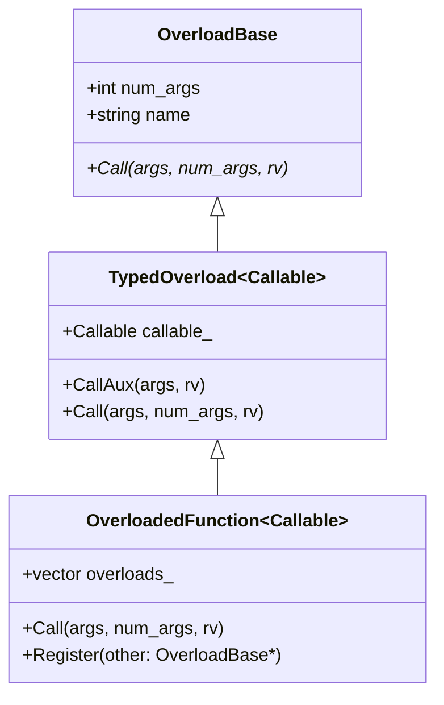
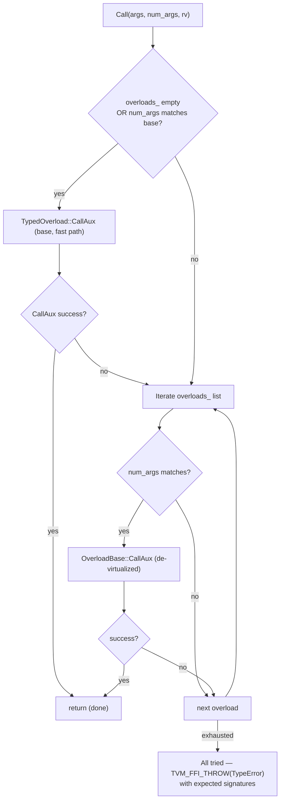

# Overload Dispatch System — TypedOverload, OverloadedFunction, OverloadObjectDef

**TL;DR**
- `include/tvm/ffi/reflection/overload.h` introduces Python-style function overloading inside the FFI reflection system: a single method name can dispatch to different typed callables based on argument count and type.
- `OverloadedFunction<Callable>` is the root overload node; it holds a primary `TypedOverload` (for zero-extra-overload fast path) plus a vector of additional `(OverloadBase*, FnPtr)` pairs. Dispatch pre-filters by `num_args`, then tries each overload's typed extraction via `TypeTraits::TryCastFromAnyView` until one succeeds.
- `OverloadObjectDef<Class>` extends `ObjectDef<Class>` with `def_overload(name, callable)` to register additional overloads on already-registered methods.

## Problem Statement

### Background
Before this design, each method name registered via `ObjectDef<Class>.def(name, callable)` accepted exactly one typed signature. Calling with different argument types required either: (a) accepting `AnyView` and doing manual type dispatch, or (b) registering multiple function names with suffixes. Neither pattern is ergonomic; Python-side users expect `my_method(42)` and `my_method("hello")` to both work on the same method name.

### Solution
Introduce an intermediate layer between the per-method `TypedOverload<Callable>` and the `Function` it wraps. `OverloadedFunction<Callable>` is a `TypedOverload` subclass that additionally stores a vector of fallback overloads tried in registration order. When called with a packed args array, it first tries itself (fast path), then iterates the fallback list.

### Goals
- Zero overhead for single-signature methods (no fallback vector allocated unless `def_overload` is called).
- Predictable dispatch order: overloads tried in registration order, first matching wins.
- Compatible with the existing packed calling convention and `ObjectDef` registration protocol.
- Non-goal: runtime-dynamic overload registration (all overloads registered at static init time).

## Design

### Class Hierarchy



### Key Classes, Fields and Interfaces

```python
# include/tvm/ffi/reflection/overload.h

class OverloadBase:
    """Abstract base for a single typed overload entry. Manages num_args and name."""
    num_args: int    # expected number of arguments; used for pre-filtering
    name: str        # method name for error messages
    # Interacts with: OverloadedFunction (stores list of OverloadBase*)
    # Interacts with: TypedOverload (concrete subclass)
    # Invariant: num_args matches the arity of the wrapped Callable

    def Call(self, args: const AnyView*, num_args: int, rv: Any*) -> None: ...
    # Pure virtual; TypedOverload implements via TypeTraits::TryCastFromAnyView per arg


class TypedOverload(Generic[Callable], OverloadBase):
    """A single overload wrapping a specific typed Callable."""
    callable_: Callable
    # Invariant: Callable signature must be invocable as (arg0, arg1, ...) -> RetType
    #   where ArgI = TypeTraitsNoCR<param_I_type>::TryCastFromAnyView

    def CallAux(self, args: const AnyView*, rv: Any*) -> bool:
        """Try to call callable_ after extracting each arg via TryCastFromAnyView.
        Returns True on success, False if any arg fails to cast.
        # NOLINTNEXTLINE(bugprone-unchecked-optional-access) — clang-tidy suppressed
        # (commit 22f22e8d): optional is checked via has_value on the TryCast result.
        """
        # Interacts with: TypeTraitsNoCR<ArgI>::TryCastFromAnyView for each argument position
        # Interacts with: TypeTraits<RetType>::MoveToAny to write rv

    def Call(self, args: const AnyView*, num_args: int, rv: Any*) -> None:
        # Guards: if num_args != self.num_args → TVM_FFI_THROW(TypeError)
        # Then: if not CallAux(args, rv) → TVM_FFI_THROW(TypeError) with mismatch info
        # Interacts with: TVM_FFI_THROW (0005-error-system)


class OverloadedFunction(Generic[Callable], TypedOverload[Callable]):
    """Root overload node; owns a vector of additional overload fallbacks."""
    overloads_: List[Tuple[OverloadBase*, FnPtr]]
    # Invariant: overloads_ is empty until Register() is called
    # Invariant: first element of each pair is the OverloadBase*; FnPtr is a de-virtualized call ptr

    def Call(self, args: const AnyView*, num_args: int, rv: Any*) -> None:
        """Dispatch with fast path and fallback loop."""
        # Fast path (no overloads or num_args match): call base TypedOverload::CallAux directly
        # Slow path: iterate overloads_ by num_args pre-filter, then CallAux; first success wins
        # If no overload succeeds: TVM_FFI_THROW(TypeError) with signature mismatch message
        # Interacts with: TypedOverload::CallAux (base), OverloadBase::num_args (pre-filter)
        # Invariant: evaluation order = base overload first, then overloads_ in insertion order

    def Register(self, other: OverloadBase*) -> None:
        """Add a new overload to the fallback list. Called by OverloadObjectDef::def_overload."""
        # Invariant: other is owned by the Function object (via FromPackedInplace)
        # Interacts with: OverloadObjectDef::def_overload (caller)


# include/tvm/ffi/reflection/overload.h

class OverloadObjectDef(Generic[Class], ObjectDef[Class]):
    """ObjectDef subclass with def_overload() for adding additional typed overloads."""

    def def_overload(self, name: str, callable: Callable) -> OverloadObjectDef[Class]:
        """Add an overload to a method already registered with def().
        Looks up the existing Function for 'name', extracts its OverloadedFunction,
        and calls Register() to attach the new TypedOverload.
        # Invariant: 'name' must have been previously registered via def() as an OverloadedFunction
        # Interacts with: OverloadedFunction::Register, TypedOverload (new overload node)
        # Interacts with: GlobalDef, ObjectDef (base builders)
        """
        # Extension: chain .def_overload() calls to add N overloads for same method name


# include/tvm/ffi/function.h

class Function:
    @staticmethod
    def FromPackedInplace(TCallable, *args) -> Tuple[Function, TCallable*]:
        """Create a Function that owns a TCallable instance allocated inside the FunctionObjImpl.
        Returns (function_handle, raw_ptr_to_callable) for post-construction access.
        # Invariant: TCallable must be invocable as (const AnyView*, int32_t, Any*)
        # Invariant: TCallable lifetime == Function object lifetime (inplace allocation)
        # Interacts with: FunctionObjImpl::GetCallable[TCallable]() — raw-pointer accessor
        # Interacts with: make_object<FunctionObjImpl>(inplace constructor)
        # Use case: OverloadedFunction::Register needs the raw pointer to chain Register() after construction
        """

# Macro expansion pseudocode for def_overload registration:
#
# Step 1: Create new TypedOverload<NewCallable> for the overload signature:
#   [fn, fn_ptr] = Function::FromPackedInplace<TypedOverload<NewCallable>>(name, callable)
#
# Step 2: Look up existing OverloadedFunction registered under 'name':
#   existing_fn = GlobalDef/ObjectDef registry["name"]
#   overloaded_fn_ptr = existing_fn.GetCallable<OverloadedFunction<OrigCallable>>()
#
# Step 3: Register the new overload on the existing OverloadedFunction:
#   overloaded_fn_ptr->Register(fn_ptr)
#
# The new Function object's lifetime is managed by the existing Function (via overloads_ ownership).
```

### Dispatch Flowchart



### Contracts, Assumptions and Invariants

- `OverloadedFunction::Call` evaluates the base `TypedOverload::CallAux` first (registration order: `def()` before `def_overload()`). This makes the first-registered overload the fast-path.
- All argument extraction is done via `TypeTraits::TryCastFromAnyView` (coercing, not strict). An overload matches if every argument can be cast, not just stored as the exact type.
- `num_args` pre-filtering means overloads with wrong arity are skipped cheaply before any `TryCast` calls.
- `Function::FromPackedInplace` ensures the `TypedOverload`/`OverloadedFunction` instance's lifetime is tied to the `Function` object — no separate heap allocation needed for the callable.
- `OverloadObjectDef` is composable: calling `.def(...).def_overload(...).def_overload(...)` chains correctly.
- De-virtualized `FnPtr` in `overloads_` pairs: the second element is a raw function pointer to `TypedOverload::CallAux` without virtual dispatch overhead on the slow path.

### Failure Modes

- **No overload matches**: `OverloadedFunction::Call` throws `TypeError` listing all registered signatures with their expected argument types. Error message includes method name and per-overload type expectations.
- **`def_overload` before `def`**: if `name` is not yet registered as an `OverloadedFunction`, the lookup fails at static init time (FATAL). Registration order matters.
- **Arity ambiguity**: two overloads with the same `num_args` but overlapping `TryCast` domains will always pick the first registered one (earlier in overloads_ list). Callers must ensure domain separation if both must be reachable.

### Extension Points

- Add new dispatch strategies by subclassing `OverloadBase` and overriding `Call`. The existing `OverloadedFunction::Register` accepts any `OverloadBase*`.
- Expose overload registration to Python via reflection: a Python-side `def_overload` helper could look up the C++ `OverloadedFunction` pointer through the reflection registry and call `Register` at runtime (currently all overloads are compile-time).
- `Function::FromPackedInplace` is useful beyond overloads: any callable whose lifetime must be tied to a `Function` object (e.g., lambda with captured state) can use it.

### Usage Examples

#### Registering overloaded methods on an ObjectRef type
**Context**: a class where `process(int)` and `process(string)` should share one method name.

```cpp
#include <tvm/ffi/reflection/overload.h>

class MyProcessorObj : public Object {
 public:
  String ProcessInt(int64_t x) { return String("int:") + std::to_string(x); }
  String ProcessStr(const String& s) { return String("str:") + s; }
  TVM_FFI_DECLARE_FINAL_OBJECT_INFO(MyProcessorObj, Object);
};
class MyProcessor : public ObjectRef {
 public:
  TVM_FFI_DEFINE_OBJECT_REF_METHODS(MyProcessor, ObjectRef, MyProcessorObj);
};

TVM_FFI_STATIC_INIT_BLOCK({
    namespace refl = tvm::ffi::reflection;
    refl::OverloadObjectDef<MyProcessorObj>()
        .def("process", [](const MyProcessorObj& self, int64_t x) {
            return self.ProcessInt(x);
        })
        .def_overload("process", [](const MyProcessorObj& self, const String& s) {
            return self.ProcessStr(s);
        });
});
```

```python
# Python side — cross-layer: C++ overloaded method → Python dispatch
import tvm_ffi

proc = tvm_ffi.get_global_func("testing.make_processor")()
result_int = proc.process(42)      # → "int:42" (int overload)
result_str = proc.process("hi")    # → "str:hi" (String overload)
```

#### Using Function::FromPackedInplace for stateful callables
**Context**: a callable that captures external state must be tied to the Function's lifetime.

```cpp
auto [fn, ptr] = tvm::ffi::Function::FromPackedInplace<OverloadedFunction<MyCallable>>(
    "my_func", my_callable_args...
);
// `ptr` is a raw pointer to the OverloadedFunction inside `fn`
// It is valid for exactly as long as `fn` is alive
ptr->Register(another_overload_ptr);  // chain additional overloads
```

## Implementation Notes

- `TypedOverload<Callable>::CallAux` uses a clang-tidy suppression for `bugprone-unchecked-optional-access` (commit `22f22e8d`): the code checks the optional before dereferencing, but clang-tidy cannot statically verify this in the generated template instantiation.
- `OverloadedFunction::overloads_` stores `(OverloadBase*, FnPtr)` pairs, not just `OverloadBase*`. The `FnPtr` is a de-virtualized pointer to `TypedOverload::CallAux` for each overload, enabling slightly cheaper dispatch than virtual calls on the slow path.
- `def_overload` must be called after `def` in the same or a later `TVM_FFI_STATIC_INIT_BLOCK`. The original `def` call creates the `OverloadedFunction` node; `def_overload` finds it by name and chains `Register`.
- The `OverloadObjectDef::Super` field (added in commit `22f22e8d`) carries a doc comment `/*! \brief The super class */` required to silence a clang-tidy diagnostic about uninitialized data members.

## Alternatives & Trade-offs

### Alternative A: Name mangling (separate function names per overload)
- Pros: No extra runtime machinery; each overload is a distinct Function.
- Cons: Python-side callers must know which name to use per argument type; breaks the "one API" ergonomic goal; N overloads = N names in the global registry.

### Alternative B: Accept AnyView array and dispatch manually in the callable
- Pros: Zero framework overhead; full flexibility.
- Cons: Boilerplate `TryCastFromAnyView` + error handling repeated per-method; no unified `TypeError` message; defeats TypeTraits type safety.

### Decision Record: De-virtualized FnPtr in overloads_ vs. fully virtual Call()
**Decision**: Store `(OverloadBase*, FnPtr)` pairs where `FnPtr` is a function pointer to `TypedOverload::CallAux`, not relying solely on virtual dispatch.

**Drivers**: The hot path in `OverloadedFunction::Call` iterates the fallback list per packed-call invocation. Virtual dispatch through `OverloadBase::Call` would add an indirect branch per overload candidate. The `FnPtr` avoids this at the cost of slightly more storage (one extra pointer per overload entry).

**Consequence**: New `OverloadBase` subclasses that override `Call` non-standardly cannot be registered via `Register()` without also providing a conforming `FnPtr`. In practice all registered overloads are `TypedOverload` instances so this is not a limitation.

## Related Design Docs & ADRs
- `.knowledge/design-records/0004-function-system.md` — `Function::FromPackedInplace` factory; `FunctionObjImpl` stores callable
- `.knowledge/design-records/0006-reflection.md` — `ObjectDef<Class>`, `GlobalDef`; `OverloadObjectDef` extends `ObjectDef`
- `.knowledge/design-records/0008-type-traits.md` — `TypeTraitsNoCR::TryCastFromAnyView` used per-argument in overload matching

## Evidence Matrix

| Commit | Contribution |
|--------|-------------|
| 84c5bdbcd11ae0e5bc921db4f35d3fd1d3ae762c | Introduces overload.h (501L): OverloadBase, TypedOverload, OverloadedFunction, OverloadObjectDef; Function::FromPackedInplace |
| 22f22e8d15f6b2eb88db19767706a82f4f3c457f | Adds NOLINTNEXTLINE suppression for clang-tidy; adds Super doc comment |
| c22e10e8aed646b58d6afa9cbd0597989ce51587 | Fixes unused-variable compiler warnings in overload.h test code |
