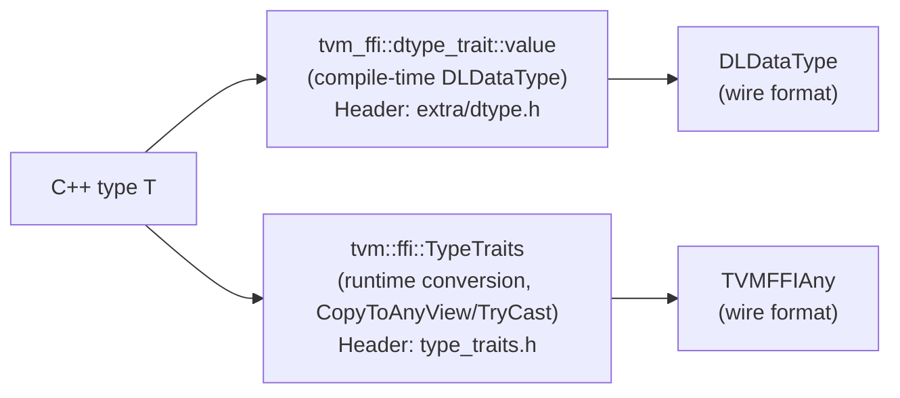

# dtype_trait — Compile-Time C++ Type to DLDataType Mapping

**TL;DR**
- `include/tvm/ffi/extra/dtype.h` provides `tvm_ffi::dtype_trait<T>`, a **compile-time template** mapping C++ primitive and hardware-specific types (CUDA/HIP FP8/FP16/BF16 variants, standard integers, float, double, bool) to `DLDataType` values. This lives in the `tvm_ffi::` namespace (not `tvm::ffi::`) and is separate from `TypeTraits<T>`.
- The companion Python module `tvm_ffi.cpp.dtype` provides `DType`, a Python wrapper around `DLDataType`, plus dtype string/object utilities.
- Together they solve the problem of mapping hardware-specific numeric types to the DLPack `DLDataType` wire format without reimplementing the mapping in each project.

## Problem Statement

### Background
ML kernels written in CUDA/HIP deal with non-standard numeric types (`__half`, `__nv_bfloat16`, `__nv_fp8_e4m3`, HIP equivalents, etc.). DLPack uses `DLDataType{code, bits, lanes}` as the wire format. Without a shared compile-time mapping, every project reimplements the same table of `{kDLFloat, 16, 1}` for `__half`, etc. Mistakes in this table cause silent type mismatches at the FFI boundary.

### Solution
A header-only `dtype_trait<T>` template with specializations for all supported types. The `value` member is a `constexpr DLDataType`, evaluated at compile time — zero runtime overhead. Two internal CRTP helpers (`integer_trait<T>` / `float_trait<T>`) handle the common cases; GPU-specific types have explicit specializations.

### Goals
- Compile-time correctness: the mapping from C++ type to `DLDataType` is a constant, not a runtime lookup.
- Complete GPU type coverage: all common CUDA/HIP reduced-precision types out of the box.
- Namespace isolation: `tvm_ffi::dtype_trait<T>` in the `tvm_ffi::` namespace, distinct from `tvm::ffi::TypeTraits<T>`.
- Non-goal: runtime type dispatch (use `AnyView.cast<>()` with `TypeTraits<T>` for that).

## Design

### Template Structure

```python
# include/tvm/ffi/extra/dtype.h  (C++)

# Internal CRTP helpers (details::dtypes::)

class details_dtypes_integer_trait(Generic[T]):
    """Helper: generates DLDataType for signed or unsigned integer C++ types."""
    value: DLDataType  # = {kDLInt if signed else kDLUInt, sizeof(T)*8, 1}
    # Invariant: bits = sizeof(T) * 8 exactly

class details_dtypes_float_trait(Generic[T]):
    """Helper: generates DLDataType for standard float C++ types."""
    value: DLDataType  # = {kDLFloat, sizeof(T)*8, 1}
    # Invariant: bits = sizeof(T) * 8 (16 for __half, 32 for float, 64 for double)


# Public API: tvm_ffi::dtype_trait<T>

class dtype_trait(Generic[T]):
    """Compile-time mapping from C++ type T to DLDataType.
    Specialize for new types by inheriting from the appropriate helper.
    """
    value: DLDataType  # constexpr; undefined for non-specialized T (compile error)
    # Interacts with: DLDataType (dlpack/dlpack.h)
    # Interacts with: Tensor creation APIs (Tensor::FromEnvAlloc, Tensor::FromNDAlloc)
    # Interacts with: tvm_ffi.cpp.dtype.DType (Python wrapper)
    # Extension: specialize dtype_trait<MyCustomType> to add new types


# Specializations provided for standard C++ types:
# dtype_trait<bool>              → {kDLUInt, 8, 1}    (bool treated as uint8)
# dtype_trait<int8_t>            → {kDLInt, 8, 1}
# dtype_trait<uint8_t>           → {kDLUInt, 8, 1}
# dtype_trait<int16_t>           → {kDLInt, 16, 1}
# dtype_trait<uint16_t>          → {kDLUInt, 16, 1}
# dtype_trait<int32_t>           → {kDLInt, 32, 1}
# dtype_trait<uint32_t>          → {kDLUInt, 32, 1}
# dtype_trait<int64_t>           → {kDLInt, 64, 1}
# dtype_trait<uint64_t>          → {kDLUInt, 64, 1}
# (also: char, short, int, long, long long signed/unsigned variants)
# dtype_trait<float>             → {kDLFloat, 32, 1}
# dtype_trait<double>            → {kDLFloat, 64, 1}

# Specializations for CUDA types (active when __CUDA_ARCH__ or CUDA headers present):
# dtype_trait<__half>            → {kDLFloat, 16, 1}
# dtype_trait<__nv_bfloat16>     → {kDLBfloat, 16, 1}
# dtype_trait<__nv_fp8_e4m3>     → {kDLFloat8_e4m3fn, 8, 1}
# dtype_trait<__nv_fp8_e5m2>     → {kDLFloat8_e5m2, 8, 1}
# dtype_trait<__nv_fp8_e8m0>     → {kDLFloat8_e8m0fnu, 8, 1}
# dtype_trait<__nv_fp4_e2m1>     → {kDLFloat4_e2m1fn, 4, 1}

# Specializations for HIP types (active when HIP headers present):
# dtype_trait<__hip_bfloat16>    → {kDLBfloat, 16, 1}
# dtype_trait<__hip_fp8_e4m3_fnuz> → {kDLFloat8_e4m3fnuz, 8, 1}
# (and other HIP FP8/FP4 variants)


# python/tvm_ffi/cpp/dtype.py

class DType:
    """Python wrapper around DLDataType.
    Provides human-readable string conversion and comparison.
    """
    code: int    # DLDataType.code (kDLFloat=2, kDLInt=0, kDLUInt=1, kDLBfloat=4, etc.)
    bits: int    # DLDataType.bits
    lanes: int   # DLDataType.lanes
    # Interacts with: tvm_ffi.cpp submodule (tvm_ffi.cpp.dtype)
    # Interacts with: Tensor.dtype (returns DLDataType, convertible to DType)
    # Extension: wrap new DL type codes as they appear in DLPack spec
```

### Namespace Distinction

The `tvm_ffi::dtype_trait<T>` namespace is **different** from `tvm::ffi::TypeTraits<T>`:



- `dtype_trait<T>` answers: "what `DLDataType` code describes elements of type T in a tensor?"
- `TypeTraits<T>` answers: "how does value T serialize into/from a `TVMFFIAny`?"
- Both are applicable when T is a primitive (e.g., `float`), but they answer different questions.

### Contracts, Assumptions and Invariants

- Accessing `dtype_trait<T>::value` for an unsupported type `T` is a **compile error** (no default `value` member in the base template). This prevents silent runtime mismatches.
- `dtype_trait<bool>::value = {kDLUInt, 8, 1}` — not `{kDLUInt, 1, 1}`. DLPack bool is conventionally encoded as 8-bit uint.
- `dtype_trait<unsigned char>` and `dtype_trait<uint8_t>` both produce `{kDLUInt, 8, 1}` — the mapping is by semantic type, not by spelling.
- CUDA/HIP specializations are **conditionally compiled** based on include guards for CUDA/HIP headers. If neither is present, only standard C++ types are available.
- `DType` (Python) does not own a `Tensor` — it wraps a `DLDataType` value type.

### Failure Modes

- **Unsupported type at compile time**: `dtype_trait<std::complex<float>>::value` — compile error "incomplete type" or "no member named value". Solution: add an explicit specialization.
- **HIP/CUDA type used without headers**: `dtype_trait<__half>` without `#include <cuda_fp16.h>` — compile error (type not declared). The `extra/dtype.h` header detects header availability via `__has_include` / predefined macros.
- **Python `DType` with unknown code**: if a `DLDataType.code` is not recognized, `DType.__str__()` may return a numeric fallback rather than a human-readable name.

### Extension Points

- Add support for a new hardware type: specialize `dtype_trait<MyType>` inheriting from `details::dtypes::float_trait<MyType>` or providing `value` directly.
- Python-side dtype string parsing: `tvm_ffi.cpp.dtype` provides string-to-`DType` conversion; extend its lookup table for new DLPack codes.
- Use `dtype_trait<T>::value` as a template argument to generate typed tensor allocation paths (e.g., `allocate_tensor<T>()` sets `dtype = dtype_trait<T>::value`).

### Usage Examples

#### C++: selecting tensor dtype from template parameter
**Context**: a template kernel function that must create an output tensor matching the input element type.

```cpp
#include <tvm/ffi/extra/dtype.h>
#include <tvm/ffi/tvm_ffi.h>

template <typename ElemType>
tvm::ffi::Tensor AllocateOutputLike(const tvm::ffi::TensorView& input) {
    // Compile-time dtype lookup — no branch, no runtime switch
    constexpr DLDataType dtype = tvm_ffi::dtype_trait<ElemType>::value;
    return tvm::ffi::Tensor::FromEnvAlloc(
        TVMFFIEnvTensorAlloc,
        input.shape(),
        dtype,
        input.device()
    );
}

// Usage:
auto out = AllocateOutputLike<__half>(input_tensor);
// out.dtype() == {kDLFloat, 16, 1}
```

#### C++: passing CUDA half dtype to a tensor creation API
**Context**: calling `Tensor::FromEnvAlloc` with a CUDA `__half` dtype.

```cpp
#include <tvm/ffi/extra/dtype.h>
#include <tvm/ffi/extra/c_env_api.h>

constexpr DLDataType fp16_dtype = tvm_ffi::dtype_trait<__half>::value;
// fp16_dtype == DLDataType{kDLFloat, 16, 1}

tvm::ffi::Tensor t = tvm::ffi::Tensor::FromEnvAlloc(
    TVMFFIEnvTensorAlloc, shape, fp16_dtype, device
);
```

#### Python: querying tensor dtype
**Context**: Python code that inspects a tensor's element type using `tvm_ffi.cpp.dtype`.

```python
import tvm_ffi
from tvm_ffi.cpp.dtype import DType

tensor = tvm_ffi.get_global_func("testing.make_fp16_tensor")()
dt = DType(tensor.dtype)
print(dt)    # → "float16" or similar human-readable string
assert dt.bits == 16
assert dt.code == 2  # kDLFloat
```

## Implementation Notes

- `dtype_trait` is in `include/tvm/ffi/extra/dtype.h` — not in the core `tvm_ffi.h` umbrella, because hardware-specific GPU types require hardware-specific headers.
- `tvm_ffi::` namespace (two underscores, no `ffi` component) is used instead of `tvm::ffi::` to signal this is a user-facing utility, not the core FFI infrastructure namespace. This follows the convention in `include/tvm/ffi/extra/`.
- The Python `tvm_ffi.cpp.dtype` module was added alongside `tvm_ffi.cpp` (the C++ extension submodule, commit `e10d1ed7` for the submodule itself). It does not depend on Cython — it is pure Python using `ctypes`-compatible DLDataType field extraction.
- `python/tvm_ffi/cpp/__init__.py` was updated to re-export `dtype` from the `tvm_ffi.cpp` submodule.

## Alternatives & Trade-offs

### Alternative A: Runtime switch/map from type_info to DLDataType
- Pros: Dynamic; works with types discovered at runtime.
- Cons: Requires `std::type_info` (RTTI), cannot be used in `constexpr` contexts, no compile-time error for missing types.

### Alternative B: Piggyback on TypeTraits (add `field_dtype` to TypeTraits)
- Pros: One protocol for all type mapping.
- Cons: `TypeTraits` is about `Any`/`AnyView` serialization, not tensor element types. Many types in `TypeTraits` (e.g., `ObjectRef`, `String`) have no meaningful `DLDataType`. Conflating the two protocols would bloat `TypeTraits` and mislead implementors.

## Related Design Docs & ADRs
- `.knowledge/design-records/0008-type-traits.md` — `TypeTraits<T>`: the parallel protocol for `Any`/`AnyView` serialization; NOT the same as dtype_trait
- `.knowledge/design-records/0007-containers.md` — `Tensor`/`TensorView` accept `DLDataType` for element type; `dtype_trait<T>::value` provides the value to pass
- `.knowledge/design-records/0012-env-api.md` — `Tensor::FromEnvAlloc(alloc, shape, dtype, device)`: canonical usage site for `dtype_trait<T>::value`
- `.knowledge/design-records/0013-python-package.md` — `tvm_ffi.cpp` submodule; `tvm_ffi.cpp.dtype` is a new addition

## Evidence Matrix

| Commit | Contribution |
|--------|-------------|
| c51e519b2253c2c8754bebaf2f9af0434d89e1fc | Introduces extra/dtype.h (206L): dtype_trait<T>, integer_trait, float_trait; python/tvm_ffi/cpp/dtype.py (104L); tvm_ffi.cpp.__init__ update |
