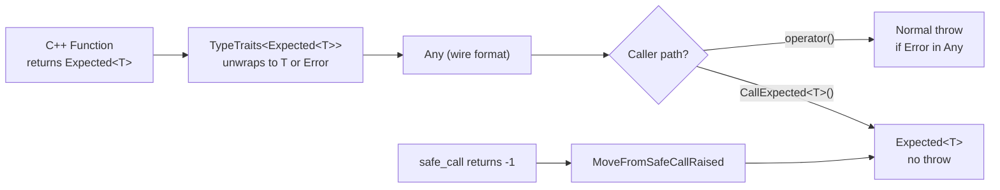

# Expected<T> -- Exception-Free Error Handling

**TL;DR**
- `Expected<T>` (in `include/tvm/ffi/expected.h`) is a Rust `Result<T,E>` / C++23 `std::expected` analog that holds either a success value of type `T` or an `Error`. It enables exception-free error handling in C++ FFI functions without changing the existing exception-based infrastructure.
- `Function::CallExpected<T>()` is the caller-side entry point: it invokes a packed function through the C ABI `safe_call` path and wraps the result (or caught exception) in an `Expected<T>` instead of throwing.
- `TypeTraits<Expected<T>>` hooks into the `Any`/`AnyView` conversion system, enabling functions that return `Expected<T>` to be registered transparently: normal callers see exceptions; `CallExpected` callers see `Expected`.

## Problem Statement

### Background
TVM FFI functions propagate errors by throwing C++ exceptions, which are caught at the `TVM_FFI_SAFE_CALL_END` boundary and serialized into the TLS error slot (return code -1). This works well for most use cases, but some callers need to handle errors without exceptions:
- Embedded environments where exceptions are disabled (`-fno-exceptions`)
- Hot loops where try/catch overhead matters
- Callers that prefer explicit error checking (Rust-style)

### Solution
`Expected<T>` provides an opt-in, per-call-site mechanism. The existing exception-based infrastructure remains the default. `Expected<T>` stores its value in an `Any` internally, reusing the existing type-erased storage. `Function::CallExpected<T>()` uses the same `FunctionObj::safe_call` C ABI path but interprets the return code without throwing.

### Goals
- Zero-cost for callers that do not use it (no ABI change, no runtime overhead for exception-based callers)
- Full integration with `TypeTraits` and `Function` registration (functions returning `Expected<T>` just work)
- Composable: `Expected<T>` values can be passed through `Any` like any other FFI value
- Non-goal: replacing exception-based error handling entirely

## Design

### Value Flow



### Key Classes, Fields and Interfaces

```python
class Unexpected(Generic[E]):
    """Explicit error-state constructor for Expected<T>.
    E must be Error or a subclass of Error (static_assert).
    """
    error_: E
    def __init__(self, error: E) -> None: ...
    def error(self) -> E: ...
    # Invariant: E must derive from Error (compile-time enforced)
    # Interacts with: Expected<T> implicit conversion from Unexpected<E>

# Deduction guide: Unexpected(err) -> Unexpected<decltype(err)>

class Expected(Generic[T]):
    """Exception-free result type. Holds T on success or Error on failure.
    Internal storage is a single Any field, reusing the 16-byte type-erased container.
    """
    data_: Any  # stores either T or Error
    # Invariant: T must not be Error itself (static_assert)
    # Invariant: exactly one of is_ok() or is_err() is true at all times

    # Implicit construction from success value
    def __init__(self, value: T) -> None:
        self.data_ = Any(value)

    # Implicit construction from Error
    def __init__(self, error: Error) -> None:
        self.data_ = Any(error)

    # Construction from Unexpected<E>
    def __init__(self, unexpected: Unexpected[E]) -> None:
        self.data_ = Any(unexpected.error())

    def is_ok(self) -> bool:
        return not TypeTraits[Error].CheckAnyStrict(self.data_)
    def is_err(self) -> bool:
        return TypeTraits[Error].CheckAnyStrict(self.data_)
    def has_value(self) -> bool:
        return self.is_ok()

    def value(self) -> T:
        """Returns success value. Throws contained Error if is_err()."""
        if self.is_err():
            raise self.data_.cast[Error]()
        return self.data_.cast[T]()
        # Interacts with: Any.cast<T>(), TypeTraits<T>

    def error(self) -> Error:
        """Returns contained Error. Throws RuntimeError if is_ok()."""
        if self.is_ok():
            raise RuntimeError("Expected contains a value, not an error")
        return self.data_.cast[Error]()

    def value_or(self, default: T) -> T:
        """Returns success value, or default if is_err()."""
        return self.value() if self.is_ok() else default

    # Interacts with: Any (internal storage), TypeTraits<T>, TypeTraits<Error>
    # Extension: no subclassing needed; TypeTraits<Expected<T>> hooks ABI automatically

class TypeTraits_Expected(Generic[T]):
    """TypeTraits<Expected<T>> specialization. Enables Expected<T> in Any/AnyView."""
    convert_enabled: bool = True   # can be returned from functions
    storage_enabled: bool = False  # not directly storable in Any (unwraps to T or Error)

    @staticmethod
    def CopyToAnyView(src: Expected[T], out: AnyView) -> None:
        if src.is_ok(): TypeTraits[T].CopyToAnyView(src.value(), out)
        else: TypeTraits[Error].CopyToAnyView(src.error(), out)

    @staticmethod
    def TryCastFromAnyView(view: AnyView) -> Optional[Expected[T]]:
        # Tries T first, then Error
        if TypeTraits[T].CheckAnyStrict(view):
            return Expected(view.cast[T]())
        if TypeTraits[Error].CheckAnyStrict(view):
            return Expected(view.cast[Error]())
        return None

    @staticmethod
    def TypeSchema() -> dict:
        return {"type": "Expected", "args": [TypeTraits[T].TypeSchema(), {"type": "ffi.Error"}]}
    # Interacts with: TypeTraits<T>, TypeTraits<Error>, AnyView, Any
    # Interacts with: Function::FromTyped (registers Expected-returning functions transparently)

class Function:
    # ... existing methods ...

    def CallExpected(self, *args, T=Any) -> Expected[T]:
        """Exception-free call path. Uses safe_call internally.

        Flow:
        1. Pack args into AnyView[] via PackedArgs::Fill
        2. Call self->safe_call(args, num_args, &result)
        3. If ret_code == 0: return Expected<T>(result.cast<T>())
        4. If ret_code != 0: return Expected<T>(MoveFromSafeCallRaised())
        """
        # Interacts with: FunctionObj.safe_call (C ABI), details::MoveFromSafeCallRaised
        # Invariant: ret_code==0 means success; non-zero means TLS error slot populated
        # Extension: pass explicit T= to get typed Expected without runtime cast
```

### Contracts, Assumptions and Invariants
- `T` must not be `Error` itself (compile-time `static_assert`). This prevents ambiguity about whether an `Expected<Error>` holding an Error is a success or failure.
- `Expected<T>` uses `Any` as internal storage; the 16-byte representation holds either the T value or the Error object reference.
- `Function::CallExpected<T>()` always returns (never throws). The caller is responsible for checking `is_ok()`/`is_err()`.
- `TypeTraits<Expected<T>>::CopyToAnyView` unwraps to the inner type (T or Error) on the wire. This means a function registered as returning `Expected<int>` will return a plain `int` on success over the C ABI -- the `Expected` wrapper exists only in the C++ caller's type system.
- Failure mode: if `T` does not have a `TypeTraits` specialization, `Expected<T>` will not compile. Mitigation: all FFI-compatible types already have `TypeTraits`.

### Extension Points
- New `Expected<T>` variants do not need new code: any type with `TypeTraits<T>` support automatically works with `Expected<T>`.
- Future Python binding: `CallExpected` could be exposed as a Python method returning a `(value, error)` tuple or a dedicated `Expected` wrapper class.
- `Unexpected<E>` supports Error subclasses, enabling domain-specific error types.

### Usage Examples

#### Exception-free FFI call with `CallExpected`
**Context**: When you need to handle errors without try/catch, e.g., in a performance-sensitive loop or embedded environment.

```cpp
#include <tvm/ffi/tvm_ffi.h>
using namespace tvm::ffi;

// Register a function that may fail
auto safe_divide = [](int a, int b) -> Expected<int> {
    if (b == 0) return Unexpected(Error("ValueError", "Division by zero", ""));
    return a / b;
};
Function::SetGlobal("math.safe_divide", Function::FromTyped(safe_divide));

// Call without exceptions -- no try/catch needed
Function func = Function::GetGlobalRequired("math.safe_divide");
Expected<int> result = func.CallExpected<int>(10, 2);
if (result.is_ok()) {
    int val = result.value();  // 5
}

Expected<int> err = func.CallExpected<int>(10, 0);
if (err.is_err()) {
    Error e = err.error();  // kind()=="ValueError"
    std::cerr << e.message() << "\n";  // "Division by zero"
}

// value_or for fallback
int safe_val = func.CallExpected<int>(10, 0).value_or(-1);  // -1
```

#### Transparent registration -- exception callers unaffected
**Context**: A function returning `Expected<T>` can be called by exception-based callers too.

```cpp
// Same function registered above
Function func = Function::GetGlobalRequired("math.safe_divide");

// Normal call path -- throws on error (TypeTraits<Expected<T>> unwraps)
try {
    int val = func(10, 0).cast<int>();  // throws the Error
} catch (const Error& e) {
    // "ValueError: Division by zero"
}

// Exception-free path -- same function, different call style
Expected<int> result = func.CallExpected<int>(10, 0);
// result.is_err() == true, no exception thrown
```

## Implementation Notes
- `Expected<T>` is header-only (`include/tvm/ffi/expected.h`); no `.cc` file needed.
- `Function::CallExpected<T>` is defined inline in `include/tvm/ffi/function.h` after `expected.h` is included.
- The umbrella header `<tvm/ffi/tvm_ffi.h>` includes `expected.h` (commit 0a9d4b6).
- `TypeTraits<Expected<T>>::TypeSchema()` emits `{"type":"Expected","args":[<T-schema>,{"type":"ffi.Error"}]}`, enabling stub generation to recognize Expected return types.

## Alternatives & Trade-offs

### Alternative A: Separate error return channel (out parameter)
- Pros: No new type; familiar C-style pattern.
- Cons: Two return values are awkward in C++; does not compose with `Any`/`AnyView` type system; callers can silently ignore error out parameter.

### Alternative B: Use std::expected (C++23) directly
- Pros: Standard library type; no custom implementation.
- Cons: Requires C++23 (project is C++17); does not integrate with TVM FFI `TypeTraits`/`Any` system; no `Function::CallExpected` path.

## Related Design Docs & ADRs
- `0005-error-system.md` -- `Error` (the error type stored in Expected), TLS error slot used by `CallExpected`
- `0004-function-system.md` -- `Function::CallExpected`, `FunctionObj::safe_call`, `Function::FromTyped`
- `0003-any-anyview.md` -- `Any` (internal storage of Expected), `AnyView` (wire format)
- `0008-type-traits.md` -- `TypeTraits<Expected<T>>` specialization pattern

## Evidence Matrix

| Commit | Contribution |
|--------|-------------|
| 0a9d4b6 | Introduces `Expected<T>`, `Unexpected<E>`, `Function::CallExpected<T>()`, `TypeTraits<Expected<T>>`, umbrella header inclusion |
