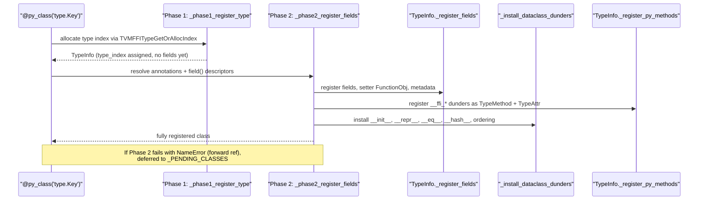

# Python-Defined FFI Types — `@py_class` Decorator

**TL;DR**
- `@py_class` enables defining FFI-registered types entirely in Python — no C++ `ObjectDef<T>` required. Fields are parsed from annotations, registered via Cython into the C type table, and the class participates in all FFI operations (serialization, structural equality, repr, deep copy).
- Two-phase registration handles circular/forward references: Phase 1 allocates a C type index; Phase 2 resolves annotations, registers fields, and installs dunders. Failed Phase 2 defers via `_PENDING_CLASSES` and retries after each successful registration.
- Evolution: `@c_class` gained structural dunders (commit e5f3af7b) and auto-init wiring moved to `register_object` (commit 6973d225), then `@py_class` was introduced (commit 3374f575) with structural eq/hash support (commit 84f46d45) and FFI dunder auto-registration (commit 5735098a).

## Problem Statement

### Background
Before `@py_class`, creating FFI-visible types required writing C++ `ObjectDef<T>` registrations. This forced every new dataclass to have a C++ counterpart, even for types that were conceptually Python-only (configuration objects, IR nodes defined in Python DSLs). The `@c_class` decorator (0017) mirrored C++ types in Python but could not create them from scratch.

### Solution
`@py_class(type_key)` allocates a type index at the C level, registers fields from Python annotations, and installs all structural dunders — making the type fully interoperable with C++ operations that use reflection metadata (`StructuralEqual`, `StructuralHash`, `ReprPrint`, `ToJSONGraph`).

### Goals
- Python-only type definition with full FFI interoperability
- Forward-reference support for mutually recursive types
- Dataclass-style API: `field()`, `KW_ONLY`, `__post_init__`, `@dataclass_transform`
- Structural equality/hashing control at type and field level
- Non-goal: C++ code generation from Python definitions

## Design

### Registration Pipeline



### Key Classes, Fields and Interfaces

```python
@dataclass_transform(eq_default=False, order_default=False)
def py_class(
    type_key: str | None = None,
    *,
    init: bool = True,
    repr: bool = True,
    eq: bool = False,
    order: bool = False,
    unsafe_hash: bool = False,
    structure: str | None = None,  # "tree"|"var"|"dag"|"const-tree"|"singleton"|None
) -> Callable[[type], type]:
    """Register a Python-defined FFI type.
    # Interacts with: _phase1_register_type, _phase2_register_fields, _install_dataclass_dunders
    # Invariant: type_key defaults to f"{cls.__module__}.{cls.__qualname__}" if None
    # Invariant: parent class must be Object or a registered @py_class / @c_class
    # Extension: add new params and branch in _phase2_register_fields
    """
    ...

class Field:
    """Descriptor for a Python-defined FFI field."""
    name: str | None
    ty: TypeSchema | None    # resolved from annotation via TypeSchema.from_annotation()
    default: Any             # MISSING if no default
    default_factory: Any     # MISSING if no factory
    init: bool               # appears in __init__
    repr: bool               # appears in __repr__
    hash: bool | None        # tri-state: None=auto (follows compare), True/False=explicit
    compare: bool            # participates in structural comparison
    kw_only: bool            # keyword-only in __init__
    structure: str | None    # None, "ignore", or "def"
    doc: str | None
    # Invariant: default and default_factory are mutually exclusive
    # Invariant: structure="ignore" -> excluded from structural eq/hash
    # Invariant: structure="def" -> definition region for alpha-equivalence
    # Interacts with: TypeSchema.from_annotation(), TypeInfo._register_fields

def field(
    *,
    default: Any = MISSING,
    default_factory: Callable[[], Any] = MISSING,
    init: bool = True,
    repr: bool = True,
    hash: bool | None = None,
    compare: bool = True,
    kw_only: bool = False,
    structure: str | None = None,
) -> Any: ...

KW_ONLY: object  # sentinel; all fields after this become keyword-only

# Structural eq/hash kind mapping (Python string -> C enum)
_STRUCTURE_KIND_MAP: dict[str | None, int] = {
    None: 0,           # kTVMFFISEqHashKindUnsupported
    "tree": 1,         # kTVMFFISEqHashKindTreeNode
    "var": 2,          # kTVMFFISEqHashKindFreeVar
    "dag": 3,          # kTVMFFISEqHashKindDAGNode
    "const-tree": 4,   # kTVMFFISEqHashKindConstTreeNode
    "singleton": 5,    # kTVMFFISEqHashKindUniqueInstance
}

# FFI dunder auto-registration (commit 5735098a)
_FFI_RECOGNIZED_METHODS: frozenset[str] = frozenset({
    "__ffi_repr__", "__ffi_hash__", "__ffi_eq__", "__ffi_compare__",
    "__s_equal__", "__s_hash__",
    "__data_to_json__", "__data_from_json__",
})
# Invariant: system-generated (__ffi_init__, __ffi_shallow_copy__) intentionally absent
# Interacts with: TypeInfo._register_py_methods -> TVMFFITypeRegisterMethod + TVMFFITypeRegisterAttr

# Two-phase registration internals:
_PENDING_CLASSES: list[_PendingClass]
_PY_CLASS_BY_MODULE: dict[str, dict[str, type]]  # for annotation resolution

def _phase1_register_type(cls: type, type_key: str | None) -> TypeInfo:
    """Allocate C type index. Always succeeds."""
    # Interacts with: TVMFFITypeGetOrAllocIndex, _set_type_cls
    ...

def _phase2_register_fields(cls, type_info, globalns, params) -> None:
    """Resolve annotations, register fields + methods, install dunders.
    # Invariant: on NameError, defers to _PENDING_CLASSES
    # Interacts with: TypeSchema.from_annotation, TypeInfo._register_fields,
    #                 _collect_py_methods, TypeInfo._register_py_methods,
    #                 _install_dataclass_dunders
    """
    ...

def _flush_pending() -> None:
    """Retry deferred Phase 2 registrations after each success."""
    ...

# C++ support for Python-defined types (commit e3333e28)
def CreateEmptyObject(type_info: TVMFFITypeInfo) -> ObjectPtr:
    """Fast path: metadata->creator; fallback: __ffi_new__ TypeAttr.
    # Invariant: throws RuntimeError if neither path available
    # Extension: Python types register __ffi_new__ via TypeAttrDef
    """
    ...
```

### Contracts, Assumptions and Invariants
- **Forward-reference safety**: Phase 1 always succeeds (type index allocated). Phase 2 may fail on unresolved annotations; the class is deferred to `_PENDING_CLASSES` and retried after each successful `@py_class` registration.
- **Annotation-to-field bijection**: Every class annotation becomes an FFI field. Bare `ClassVar` annotations are excluded. Fields inherited from parent classes are not re-registered.
- **Field ordering**: positional fields without defaults must precede those with defaults; `KW_ONLY` sentinel separates positional from keyword-only. Violations raise `TypeError`.
- **Failure mode**: If annotation contains an unregistered type, `TypeSchema.from_annotation` raises `TypeError`. Mitigation: ensure referenced types are registered first, or use string annotations for deferred resolution.

### Extension Points
- **`__post_init__` hook**: Called after `__ffi_init__` completes for Python-side validation.
- **Custom dunders**: Define `__ffi_repr__`, `__s_equal__`, `__s_hash__`, `__data_to_json__`, `__data_from_json__` in the class body; they are auto-detected by `_collect_py_methods()` and registered as TypeMethod + TypeAttr, enabling C++ dispatch to Python hooks.
- **`structure=` param**: Controls structural equality kind per-type; `field(structure="ignore"|"def")` controls per-field.

### Usage Examples

#### Basic Python-defined FFI type
**Context**: Creating a cross-language visible type without any C++ code.

```python
from tvm_ffi.core import Object
from tvm_ffi.dataclasses import py_class, field, KW_ONLY

@py_class("mymod.Point")
class Point(Object):
    x: float
    y: float
    label: str = field(default="origin")

p = Point(x=1.0, y=2.0)
assert p.label == "origin"

# Serialization round-trip (uses reflection metadata)
import tvm_ffi
json_str = tvm_ffi.save_json(p)
p2 = tvm_ffi.load_json(json_str)
assert p2.x == 1.0
```

#### Forward-reference and circular types
**Context**: Mutually recursive tree nodes defined in Python.

```python
@py_class("mymod.TreeNode")
class TreeNode(Object):
    value: int
    children: "Optional[List[TreeNode]]" = None  # forward ref resolved in Phase 2

# Circular reference works because Phase 1 allocates type index before Phase 2 resolves annotations
```

#### Structural equality with custom hooks
**Context**: IR node with structural eq/hash and custom repr.

```python
@py_class("mymod.VarNode", eq=True, unsafe_hash=True, structure="var")
class VarNode(Object):
    name: str = field(structure="def")   # definition region for alpha-equivalence
    dtype: str

    def __ffi_repr__(self) -> str:       # auto-registered as TypeAttr
        return f"Var({self.name})"

    def __s_equal__(self, other, eq) -> bool:  # custom structural equality hook
        return self.dtype == other.dtype        # name handled by alpha-equiv

v1 = VarNode(name="x", dtype="float32")
v2 = VarNode(name="y", dtype="float32")
assert tvm_ffi.structural_equal(v1, v2, map_free_vars=True)  # alpha-equiv
```

### Evolution Timeline

| Commit | Change | Significance |
|--------|--------|-------------|
| `e5f3af7b` | `@c_class` gains eq/order/unsafe_hash; `_install_dataclass_dunders` centralized | Structural dunders from C++ RecursiveEq/Hash |
| `6973d225` | `register_object` auto-wires `__init__` from C++ reflection | No `@c_class` needed just for init support |
| `e3333e28` | `CreateEmptyObject` + `__ffi_new__` fallback + `Field` descriptor | C++ infrastructure for Python-defined types |
| `3374f575` | `@py_class` decorator with two-phase registration | Core feature bringup |
| `00487905` | Setter error propagation fix, parent layout fix, setter leak fix | Correctness fixes for field registration |
| `84f46d45` | `structure=` param on `@py_class` and `field()` | Structural equality/hashing control |
| `5735098a` | `_FFI_RECOGNIZED_METHODS` + `TypeInfo._register_py_methods` | C++ dispatch to Python hooks |

## Implementation Notes
- `@py_class` reuses `_install_dataclass_dunders` from `registry.py` (shared with `@c_class`), ensuring consistent dunder behavior across both decorators.
- Field setters use `FunctionObj` dispatch via `kTVMFFIFieldFlagBitSetterIsFunctionObj` (commit 4bb487ef) rather than raw C function pointers, since Python-defined setters need the FFI call path.
- `CreateEmptyObject` (C++ function.h) provides the allocation entry point for Python types: tries `metadata->creator` first, falls back to `__ffi_new__` TypeAttr.
- Serialization fix (commit 83efe71): `serialization.cc` uses `HasCreator()` instead of `metadata==nullptr` check, correctly handling `py_class` types with `__ffi_new__`.

## Alternatives & Trade-offs
### Using @c_class only (C++ required for all types)
- Pros: All types have C++ backing; maximum performance; C++ can reference all types.
- Cons: Requires writing C++ ObjectDef for every type, even Python-only configurations; slows iteration for DSL developers.

### Python dataclass + separate registration
- Pros: Uses standard Python dataclass machinery.
- Cons: Cannot participate in FFI structural equality, serialization, or cross-language dispatch; no C type index means invisible to C++.

## Related Design Docs & ADRs
- `0017-c-class-dataclasses.md` — `@c_class` decorator for C++-backed types (predecessor/sibling)
- `0006-reflection.md` — `ObjectDef`, `TypeAttrDef`, field/method registration protocol
- `0009-structural-eq-hash.md` — `StructuralEqual`/`Hash` protocols consumed by `structure=` param
- `0019-type-schema.md` — `TypeSchema.from_annotation()` used for field type resolution
- `0013-python-package.md` — `TypeInfo`, `register_object`, `_install_dataclass_dunders`
- `0030-repr-print.md` — `__ffi_repr__` dispatch that `@py_class` hooks into
