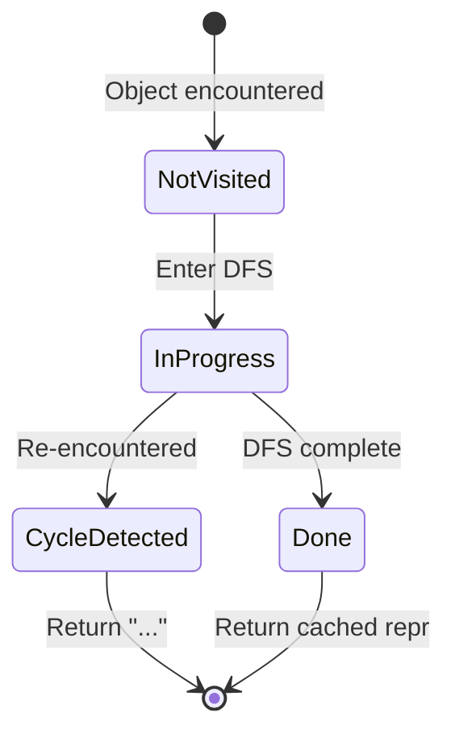

# Unified ReprPrint — DFS-Based Object Repr System

**TL;DR**
- `ffi.ReprPrint(value)` is a single C++ global function that produces human-readable repr for any TVM FFI value. As of commit 6b39efbf, the implementation uses the unified `ObjectGraphDFS<ReprTraversal>` CRTP engine in `src/ffi/extra/dataclass.cc` (shared with DeepCopy, RecursiveHash, RecursiveEq). The earlier standalone `ReprPrinter` class is replaced.
- Repr generation moved entirely from Python to C++ (commit b648c5d6): `method_repr()`, `field(repr=...)`, `c_class(repr=...)` removed. Per-field opt-out uses `refl::repr(false)` InfoTrait setting `kTVMFFIFieldFlagBitMaskReprOff` (1<<6). **NOTE: `refl::Repr` was renamed to `refl::repr` (lowercase) in commit 6b39efbf.**
- Custom repr hooks registered as `__ffi_repr__` TypeAttr per type; `@py_class` auto-registers user-defined `__ffi_repr__` methods.

## Problem Statement

### Background
Before this subsystem, repr was generated in Python via `method_repr()` in `c_class.py`. Each container type (`Array`, `List`, `Map`) had independent Python `__repr__` implementations. This approach could not handle cycles or DAG sharing (repeated object references), and required maintaining parallel Python code for every container format change.

### Solution
A single C++ `ReprPrinter` class traverses any FFI value graph with DFS, detecting cycles (prints `"..."`) and DAG sharing (repeats full repr). Types opt into custom formatting via the `__ffi_repr__` TypeAttr protocol. Built-in formatters registered for `Array`, `List`, `Map`, `String`, `Bytes`, `Tensor`, `Shape`.

### Goals
- Unified repr across all FFI types (C++ and Python-defined)
- Cycle detection (prevents infinite recursion)
- DAG sharing awareness (full repr for each occurrence)
- Per-field opt-out from repr via C++ `Repr(false)` trait
- Non-goal: pretty-printing with indentation (single-line output)

## Design

### DFS Repr Algorithm



### Key Classes, Fields and Interfaces

```python
class ReprTraversal(ObjectGraphDFS[ReprTraversal, ReprFrame, String]):
    """CRTP derivation of the shared DFS engine for repr generation (commit 6b39efbf).
    Replaces the standalone ReprPrinter class. Backed by src/ffi/extra/dataclass.cc.
    Shares ObjectGraphDFS infrastructure with DeepCopyTraversal, HashTraversal, CompareTraversal.
    # Pre-6b39efbf: standalone ReprPrinter with state_/repr_cache_ dictionaries.
    # Post-6b39efbf: ReprTraversal plugs into the unified DFS engine.
    """
    # GetFieldSkipMask() returns kTVMFFIFieldFlagBitMaskReprOff (1<<6)
    #   → fields with ReprOff are skipped by EnumerateChildren
    # TryVisitChild: check TypeAttrColumn(kRepr); if custom __ffi_repr__ found, call it
    # FinalizeFrame: build "type_key(field=val, ...)" or delegate to custom hook
    # Invariant: kInProgress → cycle → outputs "..." (or "...@0xaddr")
    # Invariant: kDone → outputs full repr again (DAG: no deduplication)
    # Interacts with: ObjectGraphDFS (shared DFS state), FrameBase (stack frame), EnumerateChildren

# For the ObjectGraphDFS CRTP engine internals, see 0031-dataclass-ops.md.

class ReprPrinter_Legacy:
    """DEPRECATED — existed until commit 6b39efbf.
    3-state DFS state machine with state_/repr_cache_ per-call dictionaries.
    Replaced by ReprTraversal atop ObjectGraphDFS in src/ffi/extra/dataclass.cc.
    The external API (ffi.ReprPrint global function) is unchanged.
    """
    state_: dict[ObjectPtr, State]           # per-object DFS state (NotVisited/InProgress/Done)
    repr_cache_: dict[ObjectPtr, str]        # cached repr for Done objects
    show_addr_: bool                         # TVM_FFI_REPR_WITH_ADDR=1

# Global function registered as "ffi.ReprPrint"
def ReprPrint(value: Any) -> String:
    """Create transient ReprPrinter and run on value."""
    # Interacts with: ReprPrinter.Run
    # Invariant: thread-local state (no sharing between concurrent calls)

class Repr(InfoTrait):
    """C++ field trait to exclude from repr output."""
    def __init__(self, show: bool): ...
    def Apply(self, info: TVMFFIFieldInfo) -> None:
        # Sets kTVMFFIFieldFlagBitMaskReprOff (1<<6) when show=False
    # Interacts with: ObjectDef<T>.def_field(..., Repr(false))

# C ABI constant:
kTVMFFIFieldFlagBitMaskReprOff: int = 1 << 6
# Interacts with: GenericRepr field iteration, TVMFFIFieldInfo.flags

# TypeAttr protocol:
type_attr.kRepr: str = "__ffi_repr__"
# Interacts with: TypeAttrColumn, TypeAttrDef<T>.attr(kRepr, fn)
# Extension: register custom Function via TVMFFITypeRegisterAttr(kRepr, fn)

# Built-in registrations (via TVM_FFI_STATIC_INIT_BLOCK):
# ReprString, ReprBytes, ReprTensor, ReprShape, ReprArray, ReprList, ReprMap

# Python side (cython/object.pxi):
def __object_repr__(obj: Object) -> str:
    """Falls back to ffi.ReprPrint(obj); swallows exceptions silently."""
    # Invariant: __repr__ must never raise
    # Interacts with: _get_global_func("ffi.ReprPrint")
```

### Contracts, Assumptions and Invariants
- **Never-raise contract**: `__repr__` on any Object swallows all exceptions and falls back to address repr. This prevents repr failures from crashing interactive Python sessions.
- **Cycle safety**: 3-state tracking guarantees termination on arbitrary object graphs. `InProgress` objects return `"..."` immediately.
- **Field opt-out**: `kTVMFFIFieldFlagBitMaskReprOff` bit in `TVMFFIFieldInfo.flags` is the only way to exclude a field from repr (Python-side `field(repr=False)` was removed).
- **Failure mode**: If `ffi.ReprPrint` is not yet loaded (early import), falls back to `<type_key @0x...>`.

### Extension Points
- **Custom `__ffi_repr__`**: Register a `Function(Object) -> String` as TypeAttr `__ffi_repr__`; ReprPrinter calls it instead of `GenericRepr`. `@py_class` auto-detects and registers `__ffi_repr__` methods.
- **Environment variable**: `TVM_FFI_REPR_WITH_ADDR=1` appends `@0xaddr` to all object reprs for debugging.

### Usage Examples

#### C++ field opt-out and Python repr
**Context**: Defining a type with internal handles excluded from repr.

```python
# C++ side:
# ObjectDef<MyObj>()
#   .def_field("name", &MyObj::name)
#   .def_field("internal_handle", &MyObj::handle, Repr(false))  # excluded

# Python side:
obj = MyObj(name="test", internal_handle=0xdeadbeef)
print(repr(obj))  # "MyObj(name='test')"  — handle excluded

# Cycle handling:
arr = tvm_ffi.Array([obj, obj])
print(repr(arr))  # "(MyObj(name='test'), MyObj(name='test'))"  — DAG: full repr each time
```

#### Custom repr in @py_class
**Context**: Python-defined type with custom repr hook.

```python
@py_class("mymod.Token")
class Token(Object):
    value: str
    span: int = field(default=0)

    def __ffi_repr__(self) -> str:  # auto-registered as TypeAttr
        return f"Token({self.value!r})"

print(repr(Token(value="hello")))  # "Token('hello')"
```

## Implementation Notes
- Container format conventions: `Array` uses tuple format `(a, b)`, `List` uses list format `[a, b]`, `Map` uses dict format `{k: v}`.
- The `ReprPrinter` instance is created per-call (no shared state); cycle/DAG tracking is per-repr-call scope.
- `__ffi_repr__` resolution is lazy: looked up via `TVMFFIGetTypeAttrColumn` on first encounter of each type_index.

## Alternatives & Trade-offs
### Keep Python-side repr generation
- Pros: Easier to customize per-type in Python; no C++ changes needed.
- Cons: Cannot handle cycles; duplicated logic for each container; Python overhead on every repr call.

### Full pretty-printer with indentation
- Pros: More readable for nested structures.
- Cons: More complex state machine; single-line repr is sufficient for `__repr__` (pretty-printing would be a separate utility).

## Related Design Docs & ADRs
- `0006-reflection.md` — `ForEachFieldInfo`, `FieldGetter`, `TypeAttrColumn`, `InfoTrait`
- `0001-c-abi.md` — `kTVMFFIFieldFlagBitMaskReprOff` in `TVMFFIFieldFlagBitMask` enum
- `0017-c-class-dataclasses.md` — `method_repr()` and `field(repr=)` removed by this subsystem
- `0029-py-class.md` — `@py_class` auto-registers `__ffi_repr__` via `_FFI_RECOGNIZED_METHODS`
