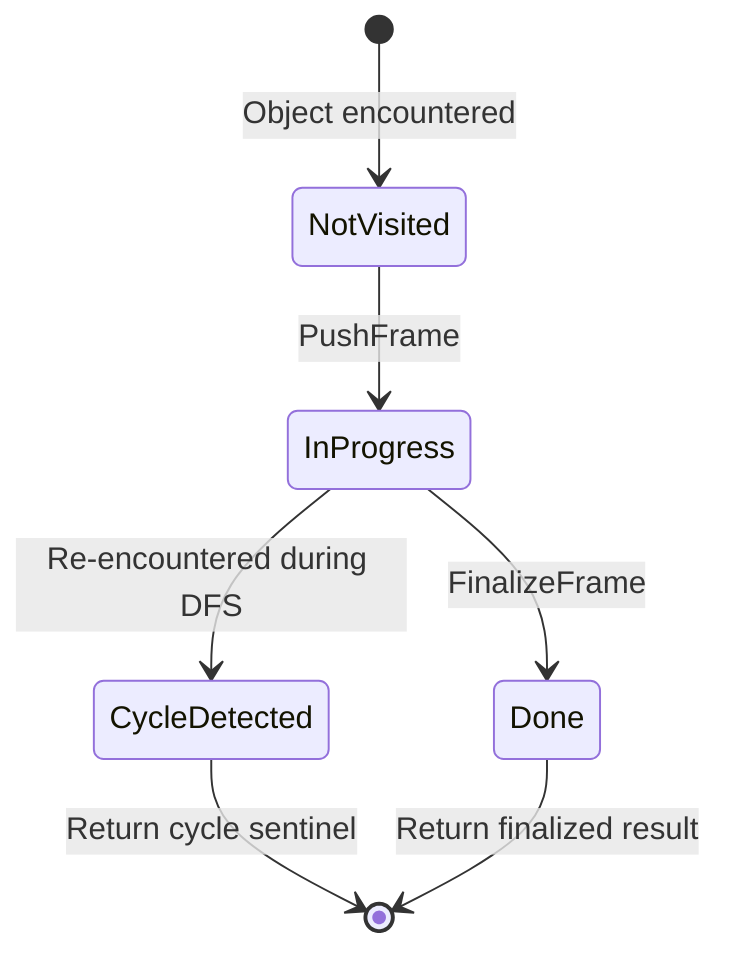

# Dataclass Operations — ObjectGraphDFS Engine, RecursiveHash/Eq, DeepCopy, and Auto-Init

**TL;DR**
- As of commit 6b39efbf, `src/ffi/extra/dataclass.cc` implements all four "dataclass" operations (repr, deep-copy, recursive hash, recursive compare) through a single shared `ObjectGraphDFS<Derived, FrameT, ResultT>` CRTP iterative DFS engine, replacing separate files with duplicated cycle-tracking logic.
- Six new public C++ functions in `include/tvm/ffi/extra/dataclass.h`: `DeepCopy`, `ReprPrint`, `RecursiveHash`, `RecursiveEq`, `RecursiveLt/Le/Gt/Ge` — all reflection-driven, all cycle-safe.
- `ObjectDef<T>` destructor (commit 6b39efbf) auto-generates `__ffi_init__` from reflection metadata when no explicit `refl::init<Args...>` is supplied; commit b1abaeac completes the Python side with `_make_init()` and `core.KWARGS`.

## Problem Statement

### Background
Before commit 6b39efbf, `DeepCopy` and `ReprPrint` each maintained independent graph-walking state machines in separate `.cc` files (`deep_copy.cc`, `repr_print.cc`). Both tracked "in-progress vs done" state to handle cycles and DAG sharing, but with duplicated code and inconsistent behavior. `RecursiveHash` and `RecursiveEq` did not exist — callers relied on the heavier `StructuralEqual`/`StructuralHash` subsystem (see `0009-structural-eq-hash.md`), which carries alpha-equivalence and free-variable semantics inappropriate for simple data containers.

Similarly, `ObjectDef<T>` registration required the user to call `refl::init<Arg1, Arg2>()` explicitly; without it, no `__ffi_init__` was registered and Python construction raised a `TypeError`.

### Solution
A single CRTP engine `ObjectGraphDFS<Derived, FrameT, ResultT>` provides iterative post-order DFS with three-state cycle tracking (`NotVisited → InProgress → Done`). Four concrete subclasses plug in: `ReprTraversal`, `DeepCopyTraversal`, `HashTraversal`, `CompareTraversal`. Custom per-type hooks are registered via `TypeAttrColumn` (`__ffi_repr__`, `__ffi_hash__`, `__ffi_eq__`, `__ffi_compare__`), and per-field opt-outs use new C ABI bitmask flags (`ReprOff`, `CompareOff`, `HashOff`). Auto-init replaces the manual `refl::init<>` call pattern by registering `__ffi_init__` from the `ObjectDef` destructor.

### Goals
- Unified cycle-safe DFS traversal for all four dataclass operations
- `RecursiveEq`/`RecursiveHash`: simpler alternative to `StructuralEqual`/`StructuralHash` — no alpha-equivalence, no DAG memoization semantics, just field-by-field recursion
- Per-field opt-out via C ABI flag bits, composable with existing `InfoTrait` machinery
- Auto-generated `__ffi_init__` eliminating manual `refl::init<Args...>()` boilerplate
- Non-goal: pretty-printing with indentation; structural alpha-equivalence (those remain in `StructuralEqual`)

## Design

### ObjectGraphDFS Engine



The engine uses an explicit `stack_` (not recursion) to avoid stack overflow on deep graphs. `EnumerateChildren` dispatches on object kind (`Array/List → kSequence`, `Map/Dict → kMap`, reflected Object → `kObject`). For `kObject` frames, `ForEachFieldInfo` is called with `GetFieldSkipMask()` filtering out fields the subclass wants to skip (e.g., `ReprOff` for repr, `HashOff` for hash).

### Key Classes, Fields and Interfaces

```python
# --- src/ffi/extra/dataclass.cc (internal CRTP engine) ---

class FrameBase:
    """Per-object frame on the DFS stack."""
    kind: Literal["kSequence", "kMap", "kObject"]
    type_index: int32_t
    obj: const Object*                   # pointer into the original graph
    children: List[Any]                  # collected child values (filled by EnumerateChildren)
    field_infos: List[TVMFFIFieldInfo*]  # kObject only: parallel to children
    child_idx: int                       # how many children have been processed
    container_size: int
    # Interacts with: ObjectGraphDFS.RunLoop, EnumerateChildren

class ObjectGraphDFS(Generic[Derived, FrameT, ResultT]):
    """CRTP iterative post-order DFS engine.
    Derived must implement: TryVisitChild, FeedChild, FinalizeFrame, GetFieldSkipMask.
    # Invariant: max stack depth = 1<<20; raises ValueError if exceeded
    # Invariant: cycle → Derived.TryVisitChild returns a sentinel (e.g., "..." for repr)
    # Invariant: state_ is a per-instance dict mapping ObjectPtr → DFSState
    # Interacts with: EnumerateChildren, ForEachFieldInfo, FieldGetter
    """
    stack_: List[FrameT]
    state_: dict[ObjectPtr, DFSState]   # NotVisited / InProgress / Done

    def RunLoop(self) -> ResultT:
        """Drive DFS to completion. Returns the root result."""
        ...

    def EnumerateChildren(self, frame: FrameBase, value: Any, obj: Object*, ti: int32_t) -> None:
        """Populate frame.children and frame.field_infos based on object kind.
        Array/List → kSequence; Map/Dict → kMap; reflected Object → kObject.
        # kObject: calls ForEachFieldInfo, skipping fields where flags & GetFieldSkipMask() != 0
        """

    def GetFieldSkipMask(self) -> uint32_t:
        """Default: 0 (skip no fields).
        ReprTraversal returns kTVMFFIFieldFlagBitMaskReprOff.
        HashTraversal returns kTVMFFIFieldFlagBitMaskHashOff.
        CompareTraversal returns kTVMFFIFieldFlagBitMaskCompareOff.
        # Extension: override to add new field-level exclusion semantics
        """
        return 0

    def TryVisitChild(self, child: Any) -> Optional[ResultT]:
        """Check if child has already been visited. If InProgress → return cycle sentinel.
        If Done → return cached result. If NotVisited → push frame and return None.
        # Invariant: Only Object values are tracked in state_; scalars always re-process
        """

    def FeedChild(self, frame: FrameT, child_result: ResultT) -> None:
        """Incorporate a finalized child result into the current frame's accumulator."""

    def FinalizeFrame(self, frame: FrameT) -> ResultT:
        """Build and return the result for a fully-processed frame."""


# --- Four concrete subclasses ---

class ReprTraversal(ObjectGraphDFS["ReprTraversal", ReprFrame, String]):
    """Generates human-readable repr. Cycle → "..." (or "...@0xaddr"). DAG → full repr each time.
    GetFieldSkipMask() returns kTVMFFIFieldFlagBitMaskReprOff (1<<6).
    FinalizeFrame: look up TypeAttrColumn(kRepr); if custom __ffi_repr__ found, call it;
                   else build "type_key(field=val, ...)".
    # Interacts with: ffi.ReprPrint (global function), TypeAttrColumn("__ffi_repr__")
    # Environment variable: TVM_FFI_REPR_WITH_ADDR=1 appends @0x... to all objects
    """

class DeepCopyTraversal(ObjectGraphDFS["DeepCopyTraversal", DeepCopyFrame, Any]):
    """Deep-copies any Object graph. Cycle → copies with same structural cycle in the copy.
    GetFieldSkipMask() returns 0 (copies all fields).
    FinalizeFrame: calls TVMFFIObjectCreator to build a fresh object with copied field values.
    # Interacts with: ffi.DeepCopy (global function), TypeAttrColumn("__ffi_shallow_copy__")
    # Invariant: primitive/String/Shape passed through as-is (no alloc)
    # Invariant: memoized (Done → returns same copy for DAG sharing preservation)
    """

class HashTraversal(ObjectGraphDFS["HashTraversal", HashFrame, int64_t]):
    """Reflection-driven hash. Cycle → hash of "..." sentinel.
    GetFieldSkipMask() returns kTVMFFIFieldFlagBitMaskHashOff (1<<8).
    FinalizeFrame: fold child hashes via polynomial combiner; look up TypeAttrColumn(kHash)
                   for custom __ffi_hash__ hook.
    # Interacts with: ffi.RecursiveHash (global function)
    # Invariant: RecursiveEq(a, b) => RecursiveHash(a) == RecursiveHash(b)
    """

class CompareTraversal(ObjectGraphDFS["CompareTraversal", CompareFrame, int]):
    """Reflection-driven comparison. Cycle → 0 (equal). Shared by Eq/Lt/Le/Gt/Ge.
    GetFieldSkipMask() returns kTVMFFIFieldFlagBitMaskCompareOff (1<<7).
    FinalizeFrame: return sign of lexicographic field ordering; look up TypeAttrColumn(kEq/kCompare).
    # Interacts with: ffi.RecursiveEq/Lt/Le/Gt/Ge (global functions)
    # Invariant: identity short-circuit (lhs ptr == rhs ptr → equal immediately)
    """


# --- Public API in include/tvm/ffi/extra/dataclass.h ---

def DeepCopy(value: Any) -> Any:
    """Memoized cycle-safe deep copy of any FFI value.
    # Registered as: "ffi.DeepCopy"
    # Invariant: primitive scalars, String, Shape → returned as-is
    # Invariant: DAG structure preserved in the copy (shared subgraph → shared copy)
    # Interacts with: DeepCopyTraversal, TypeAttrColumn("__ffi_shallow_copy__")
    """

def ReprPrint(value: Any) -> String:
    """Produce human-readable repr for any FFI value.
    # Registered as: "ffi.ReprPrint"
    # Invariant: never raises (exception → falls back to "<type_key @0x...>")
    # Interacts with: ReprTraversal, TypeAttrColumn("__ffi_repr__")
    """

def RecursiveHash(value: Any) -> int64_t:
    """Reflection-driven recursive hash.
    # Registered as: "ffi.RecursiveHash"
    # Invariant: consistent with RecursiveEq (if RecursiveEq(a,b) then RecursiveHash(a)==RecursiveHash(b))
    # Interacts with: HashTraversal, kTVMFFIFieldFlagBitMaskHashOff
    """

def RecursiveEq(lhs: Any, rhs: Any) -> bool:
    """Reflection-driven recursive equality check.
    # Registered as: "ffi.RecursiveEq"
    # Invariant: identity short-circuit for same pointer
    # Invariant: cycle-safe; cycles compare equal to corresponding cycles
    # Interacts with: CompareTraversal, kTVMFFIFieldFlagBitMaskCompareOff
    """

def RecursiveLt(lhs: Any, rhs: Any) -> bool: ...
def RecursiveLe(lhs: Any, rhs: Any) -> bool: ...
def RecursiveGt(lhs: Any, rhs: Any) -> bool: ...
def RecursiveGe(lhs: Any, rhs: Any) -> bool: ...
# All share CompareTraversal; registered as "ffi.RecursiveLt/Le/Gt/Ge"


# --- TypeAttr hooks (type_attr namespace) ---
type_attr_kHash    = "__ffi_hash__"    # custom hash: Function(Object) -> int64_t
type_attr_kEq      = "__ffi_eq__"      # custom equality: Function(Object, Object) -> bool
type_attr_kCompare = "__ffi_compare__" # custom three-way: Function(Object, Object) -> int


# --- Auto-init: include/tvm/ffi/reflection/init.h ---

def MakeInit(type_index: int32_t) -> Function:
    """Build a packed __ffi_init__ from reflection metadata for the given type_index.
    Reads field list via TVMFFIGetTypeInfo; produces a Function(self, *args) that:
      1. Creates a new object via TVMFFIObjectCreator
      2. Calls SetFieldToDefault for fields with kTVMFFIFieldFlagBitMaskHasDefault
      3. Assigns positional args to non-kw-only fields
      4. After KWARGS sentinel: reads alternating (key, value) pairs for kw-only fields
    # Invariant: type must have metadata.creator != nullptr
    # Invariant: positional required fields before positional optional; kw-only fields after KWARGS
    # Interacts with: ForEachFieldInfo, SetFieldToDefault, TVMFFIObjectCreator, KWARGS sentinel
    # Extension: types with refl::init(false) are not given auto-init; their type_index is excluded
    """

def RegisterAutoInit(type_index: int32_t) -> None:
    """Call MakeInit and register result as TypeMethod '__ffi_init__' with auto_init=True metadata.
    Called by ObjectDef<T> destructor when no explicit refl::init<Args...>() was provided.
    # Interacts with: TVMFFITypeRegisterMethod, type_attr.kInit
    # Invariant: auto_init=True in method metadata → Python _install_init takes _make_init path
    """

# ObjectDef<T> destructor auto-init decision (pseudocode for TVM_FFI_STATIC_INIT_BLOCK):
# class ObjectDefDestructor:
#     def __del__(self):
#         if not self.has_explicit_init_:
#             RegisterAutoInit(self.type_index_)  # fires for all fields with init=True


# --- Python side: KWARGS sentinel (python/tvm_ffi/core.pyx) ---
KWARGS: Object  # Singleton C++ kwargs sentinel, loaded from ffi.GetKwargsObject
# Used by _make_init to signal start of keyword arguments to __ffi_init__:
#   self.__ffi_init__(pos_arg1, pos_arg2, KWARGS, "kw_key1", val1, "kw_key2", val2)

# --- Python side: _make_init (python/tvm_ffi/registry.py) ---
def _make_init(type_cls: type, type_info: TypeInfo) -> Callable[..., None]:
    """Build Python __init__ that translates (args, kwargs) → KWARGS sentinel protocol.
    Only called when __ffi_init__.metadata['auto_init'] == True.
    # Invariant: synthesized __init__ sets __signature__, __qualname__, __module__
    # Interacts with: core.KWARGS, TypeField.c_init/c_kw_only/c_has_default, _make_init_signature
    """
    kwargs_obj = core.KWARGS
    def __init__(self: Any, *args: Any, **kwargs: Any) -> None:
        ffi_args: list[Any] = list(args)
        ffi_args.append(kwargs_obj)
        for key, val in kwargs.items():
            ffi_args.append(key)
            ffi_args.append(val)
        self.__ffi_init__(*ffi_args)
    __init__.__signature__ = _make_init_signature(type_info)
    return __init__

def _make_init_signature(type_info: TypeInfo) -> inspect.Signature:
    """Build inspect.Signature walking TypeInfo.parent_type_info chain (parent-first).
    # Invariant: fields with c_init=False excluded
    # Invariant: required positional before optional positional; required kw before optional kw
    # Invariant: c_kw_only=True → KEYWORD_ONLY parameter kind
    # Interacts with: TypeInfo.parent_type_info, TypeField.c_init/c_kw_only/c_has_default
    """
    ...
```

### New C ABI Flag Bits (commit 6b39efbf)

```python
# TVMFFIFieldFlagBitMask extensions (include/tvm/ffi/c_api.h):
kTVMFFIFieldFlagBitMaskReprOff    = 1 << 6  # field excluded from ReprPrint
kTVMFFIFieldFlagBitMaskCompareOff = 1 << 7  # field excluded from RecursiveEq/compare
kTVMFFIFieldFlagBitMaskHashOff    = 1 << 8  # field excluded from RecursiveHash
kTVMFFIFieldFlagBitMaskInitOff    = 1 << 9  # field excluded from auto-generated __ffi_init__
kTVMFFIFieldFlagBitMaskKwOnly     = 1 << 10 # field is keyword-only in __ffi_init__
# These extend the pre-existing flags: HasDefault(1<<1), ReadOnly(1<<2), DefaultFromFactory(1<<5)
```

### RecursiveEq vs StructuralEqual

`RecursiveEq`/`RecursiveHash` are intentionally simpler than `StructuralEqual`/`StructuralHash` (see `0009-structural-eq-hash.md`). Key differences:

| Property | RecursiveEq/Hash | StructuralEqual/Hash |
|---|---|---|
| Alpha-equivalence (free vars) | No | Yes |
| DAG memoization | No (always re-recurse) | Yes |
| TVMFFISEqHashKind dispatch | No | Yes |
| Custom hook TypeAttr | `__ffi_eq__`, `__ffi_hash__` | `__s_equal__`, `__s_hash__` |
| Per-field opt-out | `refl::compare(false)`, `refl::hash(false)` | `refl::compare` (same bit) |
| Target use case | Data containers (Array, Dict, @py_class) | IR nodes (Relay, TIR) |

### Contracts, Assumptions and Invariants
- **Cycle safety**: Three-state tracking (`NotVisited → InProgress → Done`) guarantees termination on arbitrary graphs. `InProgress` returns a sentinel (not an error).
- **Field opt-out**: Flag bits are the only way to exclude fields; Python-side `field(repr=False)` was removed in commit b648c5d6.
- **Auto-init trigger**: `ObjectDef<T>` destructor fires `RegisterAutoInit` only when `has_explicit_init_` is false. Types calling `def(refl::init<>())` or `def(refl::init(false))` set `has_explicit_init_=true`, suppressing auto-init.
- **KWARGS sentinel ordering**: In `__ffi_init__` packed calls, all positional args come before `KWARGS`; after `KWARGS`, pairs of `(string key, value)` appear. Missing positional args must be supplied before `KWARGS` appears.
- **`_install_init` dispatch**: Python uses `TypeMethod.metadata['auto_init']` to decide between `_make_init` (new typed `__init__`) and raw `__ffi_init__` forwarding (legacy).
- **Reconstructibility note**: `auto_init=True` metadata is injected as a JSON-style key in the `TypeMethod.metadata` dict, readable from Python via `method.metadata.get('auto_init', False)`.
- **Failure mode**: If `MakeInit` is called on a type with `metadata.creator == nullptr`, it raises `ValueError`. Mitigation: always register types before using `ObjectCreator`.

### Extension Points
- **Custom TypeAttr hooks**: Register a `Function(Object) -> T` as `__ffi_hash__` / `__ffi_eq__` / `__ffi_compare__` / `__ffi_repr__` TypeAttr; the CRTP engine calls it instead of the reflection-driven default.
- **New DFS operations**: Subclass `ObjectGraphDFS<Derived, MyFrame, MyResult>` and implement the four required methods; the cycle tracking, stack management, and `EnumerateChildren` are inherited.
- **Field-level skip masks**: Add a new `InfoTrait` setting a new flag bit and override `GetFieldSkipMask()` in the relevant traversal subclass.

## Usage Examples

### Auto-generated __ffi_init__ with field opt-outs (cross-layer)
**Context**: Defining a C++ type whose Python constructor is auto-wired from reflection, with fields excluded from hash/compare.

```cpp
// C++ (TVM_FFI_STATIC_INIT_BLOCK):
namespace refl = tvm::ffi::reflection;
refl::ObjectDef<MyNodeObj>()
    .def_rw("value",     &MyNodeObj::value)
    .def_rw("cache_key", &MyNodeObj::cache_key,
            refl::init(false),     // excluded from __ffi_init__ argument list
            refl::compare(false),  // excluded from RecursiveEq
            refl::hash(false),     // excluded from RecursiveHash
            refl::default_value(int64_t{-1}))
    .def_rw("tag", &MyNodeObj::tag, refl::kw_only(true));
// ObjectDef destructor → RegisterAutoInit → __ffi_init__ with auto_init=True
```

```python
# Python: auto-wired by _install_init via _make_init
@c_class("mylib.MyNode")
class MyNode(Object):
    value: int
    cache_key: int
    tag: str
    # __init__(self, value: int, *, tag: str) synthesized automatically

n = MyNode(42, tag="hello")
assert n.cache_key == -1            # default applied by C++
assert n.value == 42
hash1 = tvm_ffi.get_global_func("ffi.RecursiveHash")(n)
# cache_key excluded from hash → same hash for n1, n2 with same value/tag
```

### RecursiveEq cycle safety
**Context**: Structurally equivalent self-referencing objects.

```python
import tvm_ffi
_recursive_eq = tvm_ffi.get_global_func("ffi.RecursiveEq")

# Build a list that references itself
lst = tvm_ffi.List([1, 2])
lst.append(lst)  # self-referencing cycle

# Two structurally equivalent cyclic lists compare equal
lst2 = tvm_ffi.List([1, 2])
lst2.append(lst2)
assert _recursive_eq(lst, lst2)   # cycle → "InProgress" sentinel, treated as equal
```

### DeepCopy preserving DAG structure
**Context**: Copying a DAG where two branches share the same sub-object.

```python
import tvm_ffi
_deep_copy = tvm_ffi.get_global_func("ffi.DeepCopy")

shared = tvm_ffi.Array([1, 2, 3])
dag_root = tvm_ffi.Array([shared, shared])  # two references to same object
copy = _deep_copy(dag_root)
# DeepCopyTraversal memoizes shared → same copy object appears in both slots
assert copy[0] is copy[1]    # structural DAG sharing preserved
```

## Implementation Notes
- `src/ffi/extra/dataclass.cc` is the single implementation file for all four operations after commit 6b39efbf; `deep_copy.cc` and `repr_print.cc` were merged in.
- The `__ffi_init__` auto-generated by `MakeInit` is a packed `Function` (same calling convention as all other FFI functions) — it calls `TVMFFIObjectCreator` to allocate the object and then sets each field via its `FieldSetter`.
- `core.MISSING` (loaded from `ffi.GetInvalidObject`) and `core.KWARGS` (loaded from `ffi.GetKwargsObject`) are both module-level singletons in `core.pyx`, initialized at import time.
- Test fixture classes `_TestCxxAutoInit*` in `tvm_ffi.testing` cover: simple positional, kw-only, mixed positional+kw-only, fields with defaults, and inheritance combinations.

## Alternatives & Trade-offs

### Recursive C++ template dispatch (instead of CRTP engine)
- Pros: Shorter code per operation; type-safe at compile time.
- Cons: Cannot track state across recursive calls for cycle detection without a thread-local state map (fragile); template recursion depth limit is a real constraint on deep graphs.

### Four separate DFS implementations (pre-6b39efbf state)
- Pros: Each operation's code is self-contained; easy to understand in isolation.
- Cons: Cycle tracking duplicated; behavioral differences between repr/deepcopy (e.g., one handled DAGs differently); added operations (`RecursiveHash/Eq`) would require a third copy.

### StructuralEqual/Hash instead of new RecursiveEq/Hash
- Pros: Reuse existing infra; already handles containers.
- Cons: `StructuralEqual` carries alpha-equivalence, DAG-memo, and `TVMFFISEqHashKind` dispatch semantics intended for IR nodes — semantically wrong for data containers; cannot be stripped of those semantics without breaking IR use cases.

## Related Design Docs & ADRs
- `0006-reflection.md` — `ObjectDef<T>`, `ForEachFieldInfo`, `InfoTrait`, `refl::compare`/`hash`/`repr`/`kw_only`/`init`/`default_value`/`default_factory`, `TVMFFIFieldInfo.flags`, `MakeInit`/`RegisterAutoInit`
- `0001-c-abi.md` — `TVMFFIFieldFlagBitMask` enum, `TVMFFIFieldInfo`, `kTVMFFIFieldFlagBitMask*` constants
- `0030-repr-print.md` — `ReprTraversal` subclass, `__ffi_repr__` TypeAttr protocol, per-field `refl::repr(false)` opt-out
- `0009-structural-eq-hash.md` — `StructuralEqual`/`StructuralHash` (distinct heavier system for IR nodes)
- `0013-python-package.md` — `_make_init`, `_make_init_signature`, `_install_init`, `core.KWARGS`, `TypeField.c_init/c_kw_only/c_has_default`
- `0017-c-class-dataclasses.md` — `@c_class` thin alias, `_add_class_attrs`, auto-init Python wire-up

### Evidence Matrix
| Commit | Contribution |
|--------|-------------|
| `6b39efbf` | ObjectGraphDFS CRTP engine; all four traversals; dataclass.cc consolidation; 4 new C ABI flag bits; auto-init via ObjectDef destructor; RecursiveHash/Eq/Lt/Le/Gt/Ge; refl::compare/hash/repr/kw_only/init/default_value/default_factory traits |
| `b1abaeac` | Python side of auto-init: _make_init, _make_init_signature, _install_init auto_init path, core.KWARGS, TypeField.c_init/c_kw_only/c_has_default |
| `5e564cdfb` | DefaultFactory, SetFieldToDefault, kTVMFFIFieldFlagBitMaskDefaultFromFactory, TVMFFIFieldInfo.default_value_or_factory rename |
| `b97ff1ae` | @c_class simplification enabling auto-init to be the primary construction path |
