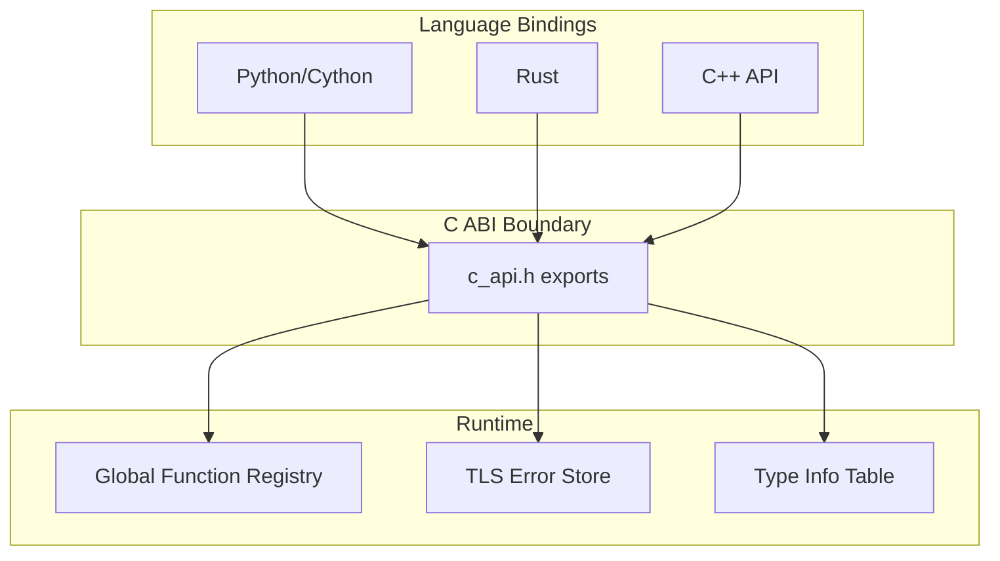
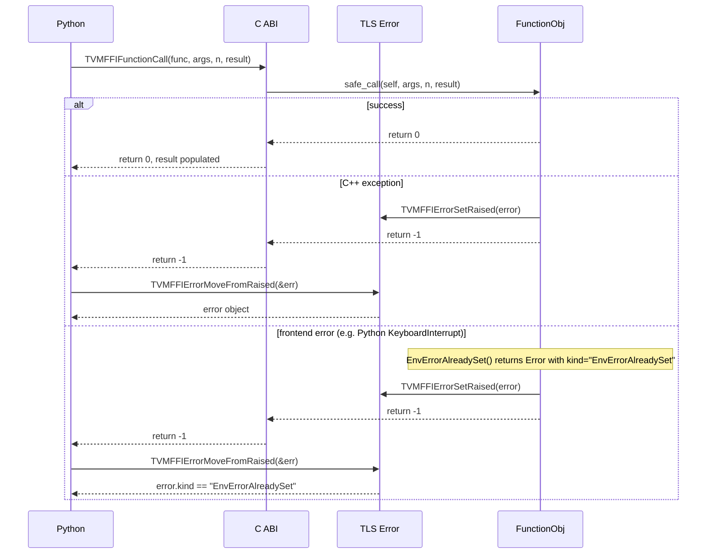

# C ABI Layer

**TL;DR**
- Defines the stable C ABI that all language bindings (Python, Rust, etc.) use to interoperate with the TVM FFI runtime.
- Two foundational 16-byte structs (`TVMFFIAny` for on-stack values, `TVMFFIObject` for heap objects) share a common `type_index` header field, enabling uniform type dispatch across the boundary.
- All exported C functions follow a convention: return `int` (0=success, -1=error in TLS), with error objects propagated via thread-local storage rather than return values. The former `-2` code for frontend errors was removed in b1611e0; `EnvErrorAlreadySet` now flows through TLS as a regular Error with kind `"EnvErrorAlreadySet"`.

## Problem Statement

### Background
- Cross-language FFI requires a stable binary interface that does not depend on C++ name mangling, exception handling, or memory layout specifics.
- The prior TVM runtime used separate `TVMValue` (8-byte union) + `type_code` (int) pairs, requiring two-array calling conventions and making container types like `Array<int>` impossible without boxing.
- Language bindings (Python/Cython, Rust) need to call into C++ and vice versa through a narrow, well-defined interface that can be loaded dynamically via `dlopen`/`LoadLibrary`.

### Solution
- A pure C header (`c_api.h`) defining all ABI types and exported functions with `extern "C"` linkage.
- A unified 16-byte `TVMFFIAny` struct that can hold both POD values and object pointers in the same slot.
- All error propagation through TLS (`TVMFFIErrorSetRaised`/`TVMFFIErrorMoveFromRaised`) rather than through return values or parameters, simplifying codegen for call chains.

### Goals
- **Goal**: Provide a stable, versionable C ABI for all cross-language calls.
- **Goal**: Enable zero-copy argument passing for POD types and reference-counted sharing for objects.
- **Non-goal**: The C ABI is not intended for direct use by end users; it is the substrate for higher-level C++/Python/Rust APIs.

## Design

The C ABI layer is the lowest layer of the TVM FFI stack. Every cross-language call passes through it.



**Cross-language call flow** (e.g., Python calling a registered C++ function):



### Key Classes, Fields and Interfaces

**`TVMFFIAny` (16 bytes)** — on-stack type-erased value:
```c
typedef struct TVMFFIAny {
  int32_t type_index;    // discriminator from TVMFFITypeIndex
  union {                // 4 bytes
    uint32_t zero_padding;    // MUST be 0 for non-small-string types
    uint32_t small_str_len;   // length of small string (max 7)
  };
  union {                // 8 bytes
    int64_t v_int64;
    double v_float64;
    void* v_ptr;
    const char* v_c_str;
    TVMFFIObject* v_obj;
    DLDataType v_dtype;
    DLDevice v_device;
    char v_bytes[8];     // small string content stored here
    uint64_t v_uint64;
  };
} TVMFFIAny;
```

**`TVMFFIObject` (24 bytes)** — heap object header:
```c
typedef struct TVMFFIObject {
  uint64_t combined_ref_count;  // strong (lower 32 bits) + weak (upper 32 bits)
  int32_t  type_index;          // type discriminator from TVMFFITypeIndex
  uint32_t __padding;           // must be zero-initialized
  union {
    void (*deleter)(struct TVMFFIObject* self, int flags);  // flags: TVMFFIObjectDeleterFlagBitMask
    int64_t __ensure_align;  // ensures 8-byte alignment
  };
} TVMFFIObject;
```

**`TVMFFIObjectDeleterFlagBitMask`** — controls deleter behavior on ref count reaching zero:
```c
enum TVMFFIObjectDeleterFlagBitMask : int32_t {
  kTVMFFIObjectDeleterFlagBitMaskStrong = 1 << 0,  // call destructor, don't free memory
  kTVMFFIObjectDeleterFlagBitMaskWeak   = 1 << 1,  // free memory block
  kTVMFFIObjectDeleterFlagBitMaskBoth   = 0x3,      // common case: destroy + free
};
```

**`TVMFFITypeIndex` enum** — type discriminator partitioned into three ranges:
| Range | Meaning | Examples |
|-------|---------|---------|
| `[-1]` | `kTVMFFIAny` (reflection annotation only) | Field type annotation |
| `[0, 64)` | POD and special types | `kTVMFFINone=0`, `kTVMFFIInt=1`, `kTVMFFIBool=2`, `kTVMFFIFloat=3`, `kTVMFFIRawStr=8`, `kTVMFFISmallStr=11`, `kTVMFFISmallBytes=12` |
| `[64, 128)` | Static object types (simple C ABI first, then complex C++) | `kTVMFFIObject=64`, `kTVMFFIStr=65`, `kTVMFFIError=67`, `kTVMFFIFunction=68`, `kTVMFFIShape=69`, `kTVMFFITensor=70`, `kTVMFFIArray=71`, `kTVMFFIMap=72`, `kTVMFFIModule=73`, `kTVMFFIOpaquePyObject=74`, `kTVMFFIList=75` (9513c2f) |
| `[128, +inf)` | Dynamic (runtime-allocated) | `kTVMFFIDynObjectBegin=128`, user-defined types |

**`DLPackTensorAllocator`** — callback for environment-provided tensor allocation:
```c
typedef int (*DLPackTensorAllocator)(
    DLTensor* prototype, DLManagedTensorVersioned** out, void* error_ctx,
    void (*SetError)(void* error_ctx, const char* kind, const char* message)
);
// Error propagation via SetError callback rather than TLS.
// Used by Tensor::FromDLPackAlloc to allocate tensors in the host framework's memory space.
```

**`TVMFFISafeCallType`** — the universal C calling convention for functions:
```c
typedef int (*TVMFFISafeCallType)(
    void* self,
    const TVMFFIAny* args,
    int32_t num_args,
    TVMFFIAny* result
);
// Returns: 0=success, -1=error in TLS (b1611e0: -2 removed; EnvErrorAlreadySet flows via TLS)
// IMPORTANT: caller must initialize result->type_index to kTVMFFINone
```

**`TVMFFISeqCell`** — C ABI struct for sequence containers (9513c2f):
```c
typedef struct {
  void* data;                      // pointer to first element (Any[])
  int64_t size;                    // elements used
  int64_t capacity;                // elements allocated
  void (*data_deleter)(void*);     // optional deleter for data buffer
} TVMFFISeqCell;
```
Shared memory layout for `ArrayObj` and `ListObj`, accessed via `SeqBaseObj`. Language bindings use this struct to read sequence container data without C++ overhead.

**`TVMFFITypeInfo`** — runtime type information:
```c
typedef struct TVMFFITypeInfo {
  int32_t type_index;
  int32_t type_depth;
  TVMFFIByteArray type_key;
  const struct TVMFFITypeInfo** type_ancestors;  // ancestor[depth] = pointer to TypeInfo at that depth
  uint64_t type_key_hash;
  int32_t num_fields;
  int32_t num_methods;
  const TVMFFIFieldInfo* fields;
  const TVMFFIMethodInfo* methods;
  const TVMFFITypeMetadata* metadata;     // optional: creator, total_size, doc, structural_eq_hash_kind
} TVMFFITypeInfo;
```

**`TVMFFIFieldInfo`** — reflection field descriptor:
```c
typedef struct {
  TVMFFIByteArray name;
  TVMFFIByteArray doc;
  int64_t flags;                    // bitmask of kTVMFFIFieldFlagBitMask*
  int64_t offset;                   // byte offset from Object* base
  TVMFFIFieldGetter getter;         // int (*)(void* field, TVMFFIAny* result)
  TVMFFIFieldSetter setter;         // int (*)(void* field, const TVMFFIAny* value)
  TVMFFIAny default_value_or_factory;  // renamed from default_value (5e564cd);
                                       // direct value or Function factory depending on flag bit 5
  int32_t field_static_type_index;
  int64_t size;
  int64_t alignment;
  TVMFFIByteArray metadata;         // structured metadata in JSON string (renamed from type_schema)
} TVMFFIFieldInfo;
```

**Exported C functions** (key subset):
| Function | Signature | Purpose |
|----------|-----------|---------|
| `TVMFFIObjectDecRef` | `(TVMFFIObjectHandle) -> int` | DecRef an object (renamed from TVMFFIObjectDecRef) |
| `TVMFFIObjectIncRef` | `(TVMFFIObjectHandle) -> int` | IncRef an object |
| `TVMFFIFunctionCreate` | `(void*, TVMFFISafeCallType, void(*)(void*), TVMFFIObjectHandle*) -> int` | Create Function from C callbacks |
| `TVMFFIFunctionCall` | `(TVMFFIObjectHandle, TVMFFIAny*, int32_t, TVMFFIAny*) -> int` | Call a function |
| `TVMFFIFunctionSetGlobal` | `(const TVMFFIByteArray*, TVMFFIObjectHandle, int allow_override) -> int` | Register global function |
| `TVMFFIFunctionGetGlobal` | `(const TVMFFIByteArray*, TVMFFIObjectHandle*) -> int` | Retrieve global function |
| `TVMFFIErrorSetRaised` | `(TVMFFIObjectHandle) -> void` | Store error in TLS |
| `TVMFFIErrorMoveFromRaised` | `(TVMFFIObjectHandle*) -> void` | Retrieve and clear error from TLS |
| `TVMFFIErrorCreate` | `(const TVMFFIByteArray*, const TVMFFIByteArray*, const TVMFFIByteArray*) -> TVMFFIObjectHandle` | Create error object |
| `TVMFFITypeGetOrAllocIndex` | `(const TVMFFIByteArray*, int32_t, int32_t, int32_t, int32_t, int32_t) -> int32_t` | Register/allocate type index |
| `TVMFFIGetTypeInfo` | `(int32_t) -> const TVMFFITypeInfo*` | Query runtime type info |
| `TVMFFITypeRegisterField` | `(int32_t, const TVMFFIFieldInfo*) -> int` | Register reflection field |
| `TVMFFITypeRegisterMethod` | `(int32_t, const TVMFFIMethodInfo*) -> int` | Register reflection method |
| `TVMFFITypeRegisterMetadata` | `(int32_t, const TVMFFITypeMetadata*) -> int` | Register type metadata (renamed from TVMFFITypeRegisterExtraInfo) |
| `TVMFFITypeRegisterAttr` | `(int32_t, const TVMFFIByteArray*, const TVMFFIAny*) -> int` | Register per-type attribute by name |
| `TVMFFIGetTypeAttrColumn` | `(const TVMFFIByteArray*) -> const TVMFFITypeAttrColumn*` | Look up per-type attribute column by name |
| `TVMFFIFunctionSetGlobalFromMethodInfo` | `(const TVMFFIMethodInfo*, int) -> int` | Register global function with metadata |
| `TVMFFIStringFromByteArray` | `(const TVMFFIByteArray*, TVMFFIAny*) -> int` | Construct String from byte array (SSO-aware) |
| `TVMFFIBytesFromByteArray` | `(const TVMFFIByteArray*, TVMFFIAny*) -> int` | Construct Bytes from byte array (SSO-aware) |
| `TVMFFIGetVersion` | `(TVMFFIVersion* out_version) -> void` | Query runtime ABI version; guaranteed stable across all versions |
| `TVMFFIHandleInitOnce` | `(void** handle_addr, int (*init_func)(void** result)) -> int` | Thread-safe one-time handle initialization (double-checked locking with platform atomics) (25c25ae) |
| `TVMFFIHandleDeinitOnce` | `(void** handle_addr, int (*deinit_func)(void* handle)) -> int` | Thread-safe one-time handle deinitialization (atomic exchange) (25c25ae) |
| `TVMFFITensorCreateUnsafeView` | `(TVMFFIObjectHandle source, const DLTensor* prototype, TVMFFIObjectHandle* out) -> int` | Create view tensor sharing source data with custom metadata (8888eb4) |

**`TVMFFIVersion`** -- runtime ABI version query:
```c
typedef struct {
  uint32_t major;
  uint32_t minor;
  uint32_t patch;
} TVMFFIVersion;

TVM_FFI_DLL void TVMFFIGetVersion(TVMFFIVersion* out_version);
```
Compile-time version macros: `TVM_FFI_VERSION_MAJOR` (0), `TVM_FFI_VERSION_MINOR` (1), `TVM_FFI_VERSION_PATCH` (7 as of 3ab699d). RFC-stage versioning: `0.X.Y` where X increments for ABI-breaking changes. `TVMFFIGetVersion` is the one function guaranteed never to change signature across any version, making it the safe entry point for compatibility negotiation.

**Static object layout accessors** (C++ inline helpers):
| Function | Returns | Offset computation |
|----------|---------|-------------------|
| `TVMFFIObjectGetTypeIndex(obj)` | `int32_t` | `obj->type_index` |
| `TVMFFIBytesGetByteArrayPtr(obj)` | `TVMFFIByteArray*` | `obj + sizeof(TVMFFIObject)` |
| `TVMFFIErrorGetCellPtr(obj)` | `TVMFFIErrorCell*` | `obj + sizeof(TVMFFIObject)` |
| `TVMFFIFunctionGetCellPtr(obj)` | `TVMFFIFunctionCell*` | `obj + sizeof(TVMFFIObject)` |
| `TVMFFIShapeGetCellPtr(obj)` | `TVMFFIShapeCell*` | `obj + sizeof(TVMFFIObject)` |
| `TVMFFITensorGetDLTensorPtr(obj)` | `DLTensor*` | `obj + sizeof(TVMFFIObject)` |

**`TVMFFIOpaqueObjectCell`** — cell for opaque (non-native) objects:
```c
typedef struct {
  void* handle;  // opaque resource handle (e.g., PyObject* for Python)
} TVMFFIOpaqueObjectCell;
```

| `TVMFFIOpaqueObjectGetCellPtr(obj)` | `TVMFFIOpaqueObjectCell*` | `obj + sizeof(TVMFFIObject)` |
| `TVMFFIObjectCreateOpaque` | `(void* handle, int32_t type_index, void(*deleter)(void*), TVMFFIObjectHandle* out) -> int` | Create opaque ref-counted object |

All static object types follow the pattern: `{ TVMFFIObject header, TypeSpecificCell, ... }`. Language bindings use the accessor functions (or reimplement the offset arithmetic) to read cell data without calling into C++.

### Contracts, Assumptions and Invariants
- **Size and alignment**: `TVMFFIAny` is 16 bytes. `TVMFFIObject` is 24 bytes (expanded from 16 to accommodate weak reference counting). Both are guaranteed to be 8-byte aligned by the `int64_t __ensure_align` union field.
- **type_index offsets**: `type_index` is at byte offset 0 in `TVMFFIAny` and byte offset 8 in `TVMFFIObject`. The shared-offset invariant was removed when `TVMFFIObject` was reordered to refcount-first layout (13436f0, 43d13e8).
- **Ownership rule for TVMFFIAny**: When `type_index >= kTVMFFIStaticObjectBegin`, the `v_obj` field holds a reference-counted pointer. The `Any` (owning) variant calls IncRef on copy and DecRef on destroy. The `AnyView` (non-owning) variant does neither.
- **RawStr invariant**: `kTVMFFIRawStr` may appear in `AnyView` but **never** in `Any` — converting AnyView to Any automatically promotes `kTVMFFIRawStr` to an owned `kTVMFFIStr` object.
- **`zero_padding` invariant**: All non-small-string `TVMFFIAny` values MUST have `zero_padding == 0`. This is enforced across all `TypeTraits` specializations and enables `Any::same_as` to use full 16-byte comparison.
- **Small string inline storage**: When `type_index` is `kTVMFFISmallStr` or `kTVMFFISmallBytes`, the `small_str_len` field holds the length (0-7) and the `v_bytes` member holds the content. Max inline length = `sizeof(int64_t) - 1 = 7`.
- **result initialization**: Callers of `TVMFFIFunctionCall` / `TVMFFISafeCallType` **must** initialize `result->type_index` to `kTVMFFINone` (or any value < `kTVMFFIStaticObjectBegin`) before calling.
- **Error propagation via TLS**: Errors are never returned inline; they are stored/retrieved via `TVMFFIErrorSetRaised`/`TVMFFIErrorMoveFromRaised`.
- **No multiple inheritance**: The type hierarchy is a single-inheritance tree; `type_ancestors` is a flat array of `const TVMFFITypeInfo**` pointers indexed by depth.

### Extension Points
- **Dynamic type indices** (`[128, +inf)`): New object types can be registered at runtime via `TVMFFITypeGetOrAllocIndex`, allowing plugin libraries to extend the type system.
- **`TVMFFIEnvRegisterCAPI`** (relocated to `extra/c_env_api.h`): Language runtimes can register callback symbols (e.g., Python's `PyErr_CheckSignals`) that the C++ runtime calls at appropriate points. Note: this function and `TVMFFIEnvCheckSignals` have been moved from core `c_api.h` to the extra env API header; `TVMFFIEnvRegisterCAPI`'s parameter was also changed from `const TVMFFIByteArray*` to `const char*`. See [ADR 0013](../ADRs/0013-env-api-naming-convention.md).
- **Custom allocators**: The C ABI does not prescribe allocation strategy; the `deleter` function pointer on `TVMFFIObject` allows per-type or per-allocator cleanup.
- **Rust bindings (`tvm-ffi-sys`)**: The Rust `tvm-ffi-sys` crate manually mirrors all C ABI types and functions with `#[repr(C)]` structs (not bindgen-generated), enabling `AtomicU64` for `combined_ref_count` and native Rust refcounting (`inc_ref`/`dec_ref`) that bypasses the C API for performance. See [0019-rust-bindings.md](../designs/0019-rust-bindings.md) and [ADR 0019](../ADRs/0019-manual-c-abi-in-rust.md).

### Usage Examples

#### Cross-language function call from C
**Context**: A language binding (e.g., Rust or Cython) wants to call a globally registered function and handle errors.
```c
// 1. Look up the function
TVMFFIByteArray name = {"my_func", 7};
TVMFFIObjectHandle func = NULL;
int ret = TVMFFIFunctionGetGlobal(&name, &func);
if (ret != 0) { /* handle error */ }

// 2. Prepare arguments
TVMFFIAny args[2];
args[0].type_index = kTVMFFIInt;
args[0].v_int64 = 42;
args[1].type_index = kTVMFFIFloat;
args[1].v_float64 = 3.14;

// 3. Call
TVMFFIAny result;
result.type_index = kTVMFFINone;  // MUST initialize
ret = TVMFFIFunctionCall(func, args, 2, &result);

// 4. Handle result or error
if (ret == 0) {
    // success: result contains return value
    int64_t value = result.v_int64;
} else if (ret == -1) {
    // error in TLS
    TVMFFIObjectHandle err;
    TVMFFIErrorMoveFromRaised(&err);
    TVMFFIErrorCell* cell = TVMFFIErrorGetCellPtr(err);
    // cell->kind, cell->message, cell->traceback are available
    TVMFFIObjectDecRef(err);
}

// 5. Cleanup
TVMFFIObjectDecRef(func);
```

## Alternatives & Trade-offs
### Inline error return (errno-style)
- Pros: No TLS dependency, simpler mental model for single-threaded code.
- Cons: Requires propagating error objects through parameters in call chains; makes codegen for deeply nested calls significantly more complex. The TVM FFI frequently has chains like `Python -> C++ -> Python -> C++` where TLS-based propagation is far simpler.

### Larger TVMFFIAny (e.g., 24 or 32 bytes)
- Pros: Could store longer strings inline (current SSO limit is 7 bytes), could hold additional metadata.
- Cons: Increases argument array size for packed function calls (which pass `AnyView[]` on the stack), reduces cache efficiency. 16 bytes is the sweet spot: fits two cache lines worth of arguments in 8 slots. The current SSO (7 bytes inline) covers most common strings (type keys, field names).

## Related Work
### Design Docs & ADRs
- [0002-any-value-system.md](.knowledge/designs/0002-any-value-system.md) — C++ wrapper layer over TVMFFIAny
- [0004-function-system.md](.knowledge/designs/0004-function-system.md) — Function/FunctionObj built on TVMFFISafeCallType
- [0006-error-handling.md](.knowledge/designs/0006-error-handling.md) — Error system built on TLS error propagation
- [0013-module-system.md](.knowledge/designs/0013-module-system.md) -- Module system (kTVMFFIModule = 73, extra env API)
- [0015-weak-rc-abi-design.md](.knowledge/ADRs/0015-weak-rc-abi-design.md) -- Weak RC ABI design decision (u32 weak + u64 strong)
- [0001-unified-any-value.md](.knowledge/ADRs/0001-unified-any-value.md) — Decision to unify POD and object in 16-byte struct
- [0002-tls-error-propagation.md](.knowledge/ADRs/0002-tls-error-propagation.md) — Decision to use TLS for errors
- [0004-type-index-layout.md](.knowledge/ADRs/0004-type-index-layout.md) — Decision on type index range partitioning
- [0013-env-api-naming-convention.md](.knowledge/ADRs/0013-env-api-naming-convention.md) — TVMFFIEnv vs TVMFFIEnvMod naming; env functions relocated to extra/
- [0011-small-string-optimization.md](.knowledge/designs/0011-small-string-optimization.md) — Small string inline storage in TVMFFIAny
- [0010-structural-equal-hash.md](.knowledge/designs/0010-structural-equal-hash.md) — Structural equality/hash using TVMFFISEqHashKind
- [0019-rust-bindings.md](../designs/0019-rust-bindings.md) — Rust binding layer over the C ABI
- [0019-manual-c-abi-in-rust.md](../ADRs/0019-manual-c-abi-in-rust.md) — Decision to hand-write C ABI in Rust
- [0020-native-rust-refcounting.md](../ADRs/0020-native-rust-refcounting.md) — Decision to reimplement refcounting natively in Rust

### Evidence Matrix
- TVMFFIAny/TVMFFIObject struct layouts -> `2025-05-06-7d34eb8.md` + `c_api.h`
- TVMFFIObject 24-byte weak RC expansion -> `2025-09-01-ca9c3d10.md` (ca9c3d1)
- TVMFFIObject refcount-first reorder + u32 narrowing -> `2025-09-25-13436f01.md` (13436f0)
- TVMFFIObject combined_ref_count u64 packing -> `2025-09-26-43d13e86.md` (43d13e8)
- TVMFFIObject __padding zero-init -> `2025-09-30-f9179ec2.md` (f9179ec)
- TVMFFIFunctionCell cpp_call field -> `2025-09-29-4fe8b2b7.md` (4fe8b2b)
- TVMFFIFieldInfo/TVMFFIMethodInfo type_schema->metadata rename -> `2025-10-01-935a5a07.md` (935a5a0)
- type_acenstors -> type_ancestors rename -> `2025-09-25-98cb8af4.md` (98cb8af)
- Rust tvm-ffi-sys manual C ABI mirror + native refcounting -> `2025-10-01-09477ce1.md` (09477ce)
- TVMFFIVersion struct and TVMFFIGetVersion API -> `2025-10-18-f0058a9e.md` (f0058a9)
- TVM_FFI_VERSION_PATCH bump 0->1 + setuptools_scm version linter -> `2025-10-26-ac63fb9b.md` (ac63fb9)
- TVMFFIHandleInitOnce/TVMFFIHandleDeinitOnce C API -> `2025-12-05-25c25aec.md` (25c25ae)
- TVMFFITensorCreateUnsafeView C API -> `2025-12-12-8888eb4b.md` (8888eb4)
- kTVMFFIList=75 type index, TVMFFISeqCell struct -> `2026-02-13-9513c2f8a57f64ad7473d7cd06084719f6d5e70e.md` (9513c2f) + `c_api.h`
- TVMFFIFieldInfo `default_value` -> `default_value_or_factory`, `kTVMFFIFieldFlagBitMaskDefaultFromFactory` -> `2026-02-14-5e564cdfb932af63915fbeb5a5aa30671f55ae2c.md` (5e564cd) + `c_api.h`
- Plus 8 supporting commits (type index layout, DLPack, SSO, error ABI), plus 3 version bumps (bb653e9, 82efbbb, 3ab699d)
