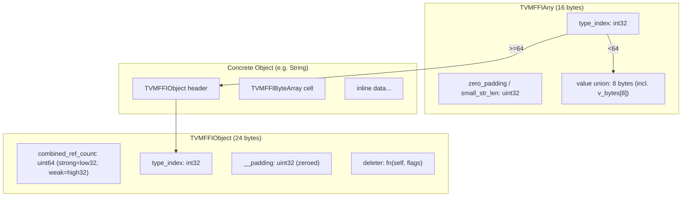

# C ABI: The Stable Binary Interface

**TL;DR**
- The C ABI (`c_api.h`) defines the stable binary interface that all language bindings (C++, Python, Rust) target. It specifies the 16-byte `TVMFFIAny` tagged union, the 24-byte `TVMFFIObject` heap header (with packed `combined_ref_count: uint64` holding strong+weak ref counts), and a set of `extern "C"` functions for object lifecycle, function calling, error propagation, and type registration.
- The type index space is partitioned: POD values `[0, 64)`, static objects `[64, 75)`, dynamic objects `[128, +inf)`. Within the static object range, types are ordered by ABI complexity: pure C-layout objects (Shape=69, Tensor=70) precede C++-dependent objects (Array=71, Map=72, Module=73, OpaquePyObject=74). This partition enables O(1) ownership decisions: `type_index < 64` means on-stack POD, `>= 64` means ref-counted heap object.
- Error propagation across the C ABI boundary uses thread-local storage (TLS) rather than error-pointer arguments, simplifying codegen for chained calls.

## Problem Statement

### Background
- Machine learning systems need a stable ABI to allow C++, Python, and Rust code to interoperate across shared library boundaries.
- The legacy TVM FFI used separate `TVMValue` + `type_code` pairs and distinct object handle types, making codegen complex and creating ABI fragility.
- Cross-DLL function calls must handle exceptions safely without relying on C++ exception propagation across library boundaries.

### Solution
- Define a single 16-byte `TVMFFIAny` struct that serves as both the on-stack value representation and the function argument wire format.
- Define a 24-byte `TVMFFIObject` header that prefixes all heap-allocated objects, with a packed `combined_ref_count: uint64` (strong in lower 32 bits, weak in upper 32 bits) enabling weak pointer support with single-atomic fast-path deletion.
- Use a C-only function table (`TVMFFIFunctionCall`, `TVMFFIObjectDecRef`, etc.) so any language with a C FFI can participate.

### Goals
- Stable C ABI across compiler versions and platforms (Linux, macOS, Windows, WASM).
- Zero-copy argument passing for POD values (int, float, bool, DLDataType, DLDevice).
- Uniform ref-counted object lifecycle management.
- Non-goals: The C ABI does not define container layouts (Array, Map) beyond their type indices; those are layered on top.

## Design

The C ABI operates at three levels:

1. **Value representation** -- `TVMFFIAny` is the universal 16-byte tagged union for all values.
2. **Object header** -- `TVMFFIObject` prefixes all heap objects with type index, packed combined ref count (strong+weak in a single uint64), and a flags-based deleter.
3. **Function table** -- `extern "C"` functions for object lifecycle, function calling, error handling, and type registration.



### Key Classes, Fields and Interfaces

```python
class TVMFFITypeIndex(IntEnum):
    """Runtime type discriminator shared by Any and Object."""
    kTVMFFIAny = -1           # Sentinel for reflection annotations only
    kTVMFFINone = 0
    kTVMFFIInt = 1
    kTVMFFIBool = 2
    kTVMFFIFloat = 3
    kTVMFFIOpaquePtr = 4
    kTVMFFIDataType = 5
    kTVMFFIDevice = 6
    kTVMFFIDLTensorPtr = 7
    kTVMFFIRawStr = 8         # Invariant: NEVER stored in Any, only AnyView
    kTVMFFIByteArrayPtr = 9
    kTVMFFIObjectRValueRef = 10
    kTVMFFISmallStr = 11              # SSO: on-stack string (<=7 bytes)
    kTVMFFISmallBytes = 12            # SSO: on-stack bytes (<=7 bytes)
    # Invariant: kTVMFFISmallStr/kTVMFFISmallBytes are POD (< kTVMFFIStaticObjectBegin)
    # Invariant: semantically equivalent to kTVMFFIStr/kTVMFFIBytes respectively
    kTVMFFIStaticObjectBegin = 64
    kTVMFFIObject = 64
    kTVMFFIStr = 65
    kTVMFFIBytes = 66
    kTVMFFIError = 67
    kTVMFFIFunction = 68
    # -- Simple C-ABI layout objects (pure C structs, no C++ internals) --
    kTVMFFIShape = 69          # layout: TVMFFIObject + {int64_t*, size_t}
    kTVMFFITensor = 70         # layout: TVMFFIObject + DLTensor (was kTVMFFINDArray, renamed in 3a551d8)
    # -- Complex objects (may require C++ ABI) --
    kTVMFFIArray = 71
    kTVMFFIMap = 72
    kTVMFFIModule = 73
    kTVMFFIOpaquePyObject = 74 # opaque foreign object wrapper (added in 91d69f0)
    kTVMFFIDynObjectBegin = 128
    # Invariant: type_index < 64 => POD on-stack, >= 64 => heap Object
    # Invariant: static objects [64, 75), dynamic objects [128, +inf)
    # Invariant: kTVMFFIAny (-1) never appears in Any.type_index at runtime
    # Invariant: within static range, simple C-layout objects (Shape, Tensor) precede complex C++ objects (Array, Map)

class TVMFFIAny:
    """C-level type-erased value (16 bytes). On-stack POD or ref-counted object pointer."""
    type_index: int32          # Discriminator tag
    # Second 4-byte field is a union:
    zero_padding: uint32       # Must be 0 for ALL non-small-string type indices
    small_str_len: uint32      # Length of inline string (max 7) when type_index is kTVMFFISmallStr/kTVMFFISmallBytes
    value: Union[int64, float64, void_ptr, const_char_ptr,
                 TVMFFIObject_ptr, DLDataType, DLDevice, bytes8]
    # Invariant: sizeof == 16, same layout on all platforms
    # Invariant: if type_index >= kTVMFFIStaticObjectBegin, value.v_obj is ref-counted
    # Invariant: zero_padding == 0 for ALL non-small-string type indices
    # Invariant: v_bytes[8] used for inline string data when type_index is kTVMFFISmallStr/kTVMFFISmallBytes
    # Invariant: caller must initialize type_index to kTVMFFINone before passing as result buffer
    # Interacts with: AnyView/Any (C++ wrappers), TypeTraits<T> (conversion protocol), BytesBaseCell

def TVMFFISmallBytesGetContentByteArray(value: Ptr[TVMFFIAny]) -> TVMFFIByteArray: ...
    # Extract inline bytes from a small-string TVMFFIAny as TVMFFIByteArray
    # Interacts with: language bindings needing to read small strings from C ABI

class TVMFFIObjectDeleterFlagBitMask(IntEnum):
    """Bitmask controlling deleter behavior on ref-count transitions."""
    kTVMFFIObjectDeleterFlagBitMaskStrong = 1 << 0  # Strong rc -> 0: call destructor, do NOT free memory
    kTVMFFIObjectDeleterFlagBitMaskWeak   = 1 << 1  # Weak rc -> 0: free memory block
    kTVMFFIObjectDeleterFlagBitMaskBoth   = 0x3     # Both -> 0 simultaneously (common case optimization)
    # Interacts with: FObjectDeleter signature, SimpleObjAllocator.Deleter_
    # Invariant: strong flag triggers ~T() destructor only; weak flag triggers memory deallocation only
    # Extension: new flags can be added in upper bits without breaking ABI

class TVMFFIOpaqueObjectCell:
    """Data layout for opaque foreign object wrappers. Follows TVMFFIObject header."""
    handle: void_ptr  # For Python: PyObject*; for other languages: opaque resource
    # Invariant: layout is TVMFFIObject (24 bytes) + TVMFFIOpaqueObjectCell (8 bytes)
    # Interacts with: TVMFFIOpaqueObjectGetCellPtr (inline accessor)

class TVMFFIObject:
    """C-level object header (24 bytes). All heap objects start with this.
    Uses anonymous struct typedef (no named struct tag) since 24125d0.
    Field order: combined ref count first (single u64 word), then type_index."""
    combined_ref_count: uint64     # Offset 0. Packs strong (lower 32) + weak (upper 32) ref counts.
                                   # strong = combined & 0xFFFFFFFF; weak = (combined >> 32) & 0xFFFFFFFF
    type_index: int32              # Runtime type ID. Offset 8. (was at offset 0 before 13436f0)
    __padding: uint32              # Ensures 8-byte alignment for deleter. Offset 12. Zeroed on allocation (f9179ec).
    deleter: Callable[[void_ptr, int], None]  # Offset 16. Takes (obj, flags); void* since 24125d0
    # Invariant: sizeof == 24, 8-byte aligned
    # Invariant: combined_ref_count packs both counts in one word, enabling single-atomic DecRef fast path (43d13e8)
    # Invariant: type_index is NO LONGER at offset 0 (deliberately breaks TVMFFIAny alignment, 13436f0)
    # Invariant: newly allocated objects start with combined_ref_count = kCombinedRefCountBothOne = (1<<32)|1
    # Invariant: strong rc=0 triggers destructor (~T) via deleter(self, kStrong)
    # Invariant: weak rc=0 triggers memory free via deleter(self, kWeak)
    # Invariant: the implicit weak count=1 is decremented when strong count reaches 0
    # Extension: all concrete object types (String, Error, Function, etc.)
    #   follow layout: TVMFFIObject + type-specific cell + inline data
    # Interacts with: Object (C++ wrapper), WeakObjectPtr, make_object<T>() (allocator)

class TVMFFIByteArray:
    """Data layout for String and Bytes objects. Follows TVMFFIObject header."""
    data: const_char_ptr
    size: size_t
    # Invariant: platform-dependent layout (pointer size varies 32/64 bit)

class TVMFFIBacktraceUpdateMode(IntEnum):
    """Mode for updating the backtrace of an error object."""
    kTVMFFIBacktraceUpdateModeReplace = 0  # Overwrite existing backtrace
    kTVMFFIBacktraceUpdateModeAppend = 1   # Append to existing backtrace

class TVMFFIErrorCell:
    """Data layout for Error objects. Follows TVMFFIObject header."""
    kind: TVMFFIByteArray
    message: TVMFFIByteArray
    backtrace: TVMFFIByteArray  # Stored most-recent-call-first for O(1) append
    update_backtrace: Callable[[TVMFFIObjectHandle, TVMFFIByteArray, int32], None]
    # Third param is TVMFFIBacktraceUpdateMode (Replace or Append)
    # Interacts with: TLS error storage, TVM_FFI_SAFE_CALL_END

class TVMFFIFunctionCell:
    """Data layout for Function objects. Follows TVMFFIObject header. Now 16 bytes (two fields)."""
    safe_call: TVMFFISafeCallType  # C ABI boundary call (catches exceptions)
    cpp_call: void_ptr             # C++ direct call pointer, or NULL for non-C++ functions (4fe8b2b)
    # Invariant: cpp_call is NULL for functions not originally created in C++
    # Invariant: callers using cpp_call must share the same C++ exception ABI
    # Invariant: cross-FFI-boundary calls MUST use safe_call, never cpp_call
    # Interacts with: TVMFFIFunctionCall, FunctionObj.CallPacked (branches on cpp_call)

# Safe call signature -- the C ABI boundary for function invocation
def TVMFFISafeCallType(self: void_ptr, args: Ptr[TVMFFIAny],
                       num_args: int32, result: Ptr[TVMFFIAny]) -> int:
    """C-style safe call. Returns 0=success, -1=error in TLS, -2=frontend error."""
    # Invariant: caller must set result->type_index = kTVMFFINone before call
    # Interacts with: TVMFFIErrorMoveFromRaised (on -1), EnvErrorAlreadySet (on -2)

class TVMFFIFieldFlagBitMask(IntEnum):
    """Bitmask flags for field and method info."""
    kTVMFFIFieldFlagBitMaskWritable = 1 << 0       # Field is writable
    kTVMFFIFieldFlagBitMaskHasDefault = 1 << 1     # Field has a default value
    kTVMFFIFieldFlagBitMaskIsStaticMethod = 1 << 2 # Method is static
    kTVMFFIFieldFlagBitMaskSEqHashIgnore = 1 << 3  # Skip in structural eq/hash
    kTVMFFIFieldFlagBitMaskSEqHashDef = 1 << 4     # Enters def region for free var mapping
    # Extension: new bits can be added without breaking ABI (int64 storage)

class TVMFFIFieldInfo:
    """Reflection metadata for a single object field."""
    name: TVMFFIByteArray
    doc: TVMFFIByteArray                 # Docstring (unstructured free text)
    metadata: TVMFFIByteArray            # Structured JSON metadata (renamed from type_schema, 935a5a0)
    field_static_type_index: int32       # Type hint for serializers
    flags: int64                         # Bitmask (replaces old `readonly: int32`)
    size: int64                          # sizeof(T) for the field
    alignment: int64                     # alignof(T) for the field
    offset: int64                        # From Object header to field (was byte_offset)
    getter: TVMFFIFieldGetter            # fn(field_addr, result) -> int
    setter: TVMFFIFieldSetter            # fn(field_addr, value) -> int
    default_value: TVMFFIAny             # Valid when flags & HasDefault
    # Interacts with: TVMFFITypeRegisterField, ObjectDef<T> (C++ builder)
    # Invariant: setter always populated (for serialization); writability enforced by flags

class TVMFFIMethodInfo:
    """Reflection metadata for a registered method."""
    name: TVMFFIByteArray
    doc: TVMFFIByteArray                 # Docstring (unstructured free text)
    # Rationale: doc stores unstructured docstrings (potentially large);
    # metadata stores structured JSON (focused, machine-readable).
    metadata: TVMFFIByteArray            # Optional structured JSON metadata (renamed from type_schema, 935a5a0)
    flags: int64                         # Uses kTVMFFIFieldFlagBitMaskIsStaticMethod
    method: TVMFFIAny                    # Holds a Function as AnyView-compatible TVMFFIAny
    # Interacts with: TVMFFITypeRegisterMethod, TVMFFIFunctionSetGlobalFromMethodInfo

class TVMFFISEqHashKind(IntEnum):
    """Per-type structural comparison semantics."""
    kTVMFFISEqHashKindUnsupported = 0
    kTVMFFISEqHashKindTreeNode = 1
    kTVMFFISEqHashKindFreeVar = 2
    kTVMFFISEqHashKindDAGNode = 3
    kTVMFFISEqHashKindConstTreeNode = 4
    kTVMFFISEqHashKindUniqueInstance = 5
    # Interacts with: TVMFFITypeMetadata.structural_eq_hash_kind

class TVMFFITypeMetadata:
    """Per-type metadata (formerly TVMFFITypeExtraInfo)."""
    total_size: int32                    # sizeof(Class) for concrete type
    creator: TVMFFIObjectCreator         # Factory callback, or nullptr
    doc: TVMFFIByteArray                 # Documentation string
    structural_eq_hash_kind: TVMFFISEqHashKind  # Comparison semantics
    # Interacts with: TVMFFITypeRegisterMetadata, ObjectDef<T>.RegisterExtraInfo

class TVMFFITypeAttrColumn:
    """Column-oriented storage for a single named attribute across all types."""
    data: Ptr[TVMFFIAny]                 # Array indexed by type_index
    size: int                            # Length of the data array
    # Interacts with: TVMFFITypeRegisterAttr, TVMFFIGetTypeAttrColumn

class TVMFFITypeInfo:
    """Runtime type information stored in global type table."""
    type_index: int32
    type_depth: int32
    type_key: TVMFFIByteArray
    type_ancestors: Ptr[Ptr[TVMFFITypeInfo]]  # type_ancestors[depth] = pointer to ancestor TypeInfo
    type_key_hash: uint64
    num_fields: int32
    num_methods: int32
    fields: Ptr[const TVMFFIFieldInfo]
    methods: Ptr[const TVMFFIMethodInfo]
    metadata: Ptr[const TVMFFITypeMetadata]   # Per-type metadata (creator, doc, seq_hash_kind)
    # Invariant: type_ancestors array has exactly type_depth entries
    # Invariant: type_ancestors[i] points to ancestor TypeInfo at depth i
    # Interacts with: IsInstance check (ancestor lookup), TVMFFIGetTypeInfo, ForEachFieldInfo

# === C API Function Table ===

def TVMFFIObjectIncRef(obj: TVMFFIObjectHandle) -> int: ...
    # Increment strong reference count
    # Interacts with: Object.IncRef

def TVMFFIObjectDecRef(obj: TVMFFIObjectHandle) -> int: ...
    # Decrement strong reference count; triggers two-phase deletion when counts reach 0
    # Renamed from TVMFFIObjectFree
    # Interacts with: Object.DecRef, TVMFFIObjectDeleterFlagBitMask

def TVMFFIFunctionCreate(self: void_ptr, safe_call: TVMFFISafeCallType,
                         deleter: Callable, out: Ref[TVMFFIObjectHandle]) -> int: ...
    # Interacts with: ExternCFunctionObjImpl (wraps C callbacks)

def TVMFFIFunctionCall(func: TVMFFIObjectHandle, args: Ptr[TVMFFIAny],
                       num_args: int32, result: Ptr[TVMFFIAny]) -> int: ...
    # Invariant: result->type_index must be kTVMFFINone before call

def TVMFFIFunctionSetGlobal(name: Ptr[TVMFFIByteArray],
                            f: TVMFFIObjectHandle, allow_override: int) -> int: ...
def TVMFFIFunctionGetGlobal(name: Ptr[TVMFFIByteArray],
                            out: Ref[TVMFFIObjectHandle]) -> int: ...
    # Interacts with: global function registry (thread-safe singleton)

def TVMFFIErrorMoveFromRaised(result: Ref[TVMFFIObjectHandle]) -> None: ...
    # Clears TLS error and moves it to result
def TVMFFIErrorSetRaised(error: TVMFFIObjectHandle) -> None: ...
    # Stores error in TLS for retrieval by caller

def TVMFFIErrorSetRaisedFromCStr(kind: str, message: str) -> None: ...
    # Convenience: store error from C strings (renamed from TVMFFIErrorSetRaisedByCStr)

def TVMFFITypeGetOrAllocIndex(type_key: Ptr[TVMFFIByteArray],
                              static_type_index: int32, type_depth: int32,
                              num_child_slots: int32,
                              child_slots_can_overflow: int32,
                              parent_type_index: int32) -> int32: ...
    # Called once per type at static init time (renamed from TVMFFIGetOrAllocTypeIndex)
    # Interacts with: global type table, TVM_FFI_DECLARE_*_OBJECT_INFO macros

def TVMFFIGetTypeInfo(type_index: int32) -> Ptr[TVMFFITypeInfo]: ...
    # Interacts with: IsInstance (ancestor lookup), reflection field access

def TVMFFITypeRegisterField(type_index: int32, info: Ptr[TVMFFIFieldInfo]) -> int: ...
    # Renamed from TVMFFIRegisterTypeField

def TVMFFITypeRegisterMethod(type_index: int32, info: Ptr[TVMFFIMethodInfo]) -> int: ...
    # Register a method for a type

def TVMFFITypeRegisterMetadata(type_index: int32, metadata: Ptr[TVMFFITypeMetadata]) -> int: ...
    # Register per-type metadata (creator, doc, seq_hash_kind)
    # Renamed from TVMFFITypeRegisterExtraInfo

def TVMFFITypeRegisterAttr(type_index: int32, attr_name: Ptr[TVMFFIByteArray],
                           attr_value: Ptr[TVMFFIAny]) -> int: ...
    # Register a per-type attribute in a named column

def TVMFFIGetTypeAttrColumn(attr_name: Ptr[TVMFFIByteArray]) -> Optional[Ptr[TVMFFITypeAttrColumn]]: ...
    # Look up a type attribute column by name

def TVMFFIObjectCreateOpaque(handle: void_ptr, type_index: int32,
                             deleter: Callable[[void_ptr], None],
                             out: Ref[TVMFFIObjectHandle]) -> int: ...
    # Create a ref-counted opaque object wrapping an external resource
    # Invariant: type_index must be kTVMFFIOpaquePyObject (only supported value for now)
    # Invariant: deleter called exactly once when strong ref count reaches 0
    # Interacts with: OpaqueObjectImpl (C++), OpaquePyObject (Python)
    # Extension: type_index parameter allows future opaque types beyond Python

def TVMFFIOpaqueObjectGetCellPtr(obj: TVMFFIObjectHandle) -> Ptr[TVMFFIOpaqueObjectCell]: ...
    # Inline accessor: reinterpret_cast at offset sizeof(TVMFFIObject) from obj
    # Interacts with: OpaquePyObject.pyobject() (Python), C++ test code

def TVMFFIStringFromByteArray(input_: TVMFFIByteArray, out: Ptr[TVMFFIAny]) -> int: ...
    # Construct a String (SmallStr or StrObj) from a byte array.
    # Replaces kTVMFFIRawStr path in Cython setters (043d9f6)
    # Interacts with: TypeTraits<String>::MoveToAny, kTVMFFISmallStr/kTVMFFIStr

def TVMFFIBytesFromByteArray(input_: TVMFFIByteArray, out: Ptr[TVMFFIAny]) -> int: ...
    # Construct a Bytes (SmallBytes or BytesObj) from a byte array.
    # Replaces kTVMFFIByteArrayPtr path in Cython setters (043d9f6)
    # Interacts with: TypeTraits<Bytes>::MoveToAny, kTVMFFISmallBytes/kTVMFFIBytes

# Tensor (was NDArray) DLPack interop C API:
def TVMFFITensorFromDLPack(managed: Ptr[DLManagedTensor], alignment: int32,
                           contiguous: int32, out: Ref[TVMFFIObjectHandle]) -> int: ...
def TVMFFITensorToDLPack(obj: TVMFFIObjectHandle, out: Ref[Ptr[DLManagedTensor]]) -> int: ...
def TVMFFITensorFromDLPackVersioned(managed: Ptr[DLManagedTensorVersioned],
                                     alignment: int32, contiguous: int32,
                                     out: Ref[TVMFFIObjectHandle]) -> int: ...
def TVMFFITensorToDLPackVersioned(obj: TVMFFIObjectHandle, out: Ref[Ptr[DLManagedTensorVersioned]]) -> int: ...
def TVMFFITensorGetDLTensorPtr(obj: TVMFFIObjectHandle) -> Ptr[DLTensor]: ...
    # All renamed from TVMFFINDArray* to TVMFFITensor* (3a551d8)

def TVMFFIFunctionSetGlobalFromMethodInfo(
    method_info: Ptr[TVMFFIMethodInfo], allow_override: int) -> int: ...
    # Register a global function with full method metadata (doc, schema, flags)

# === Static handle lifecycle API (25c25aec) ===

def TVMFFIHandleInitOnce(handle_addr: Ptr[void_ptr],
                          init_func: Callable[[Ptr[void_ptr]], int]) -> int: ...
    # Thread-safe, idempotent handle initialization via double-checked locking.
    # Fast path: atomic acquire load; returns 0 if already initialized.
    # Slow path: mutex + double-check + init_func + release store.
    # Invariant: init_func MUST set *result to non-NULL on success
    # Invariant: exactly one init_func call per handle, even under concurrent access
    # Extension: DSL code generators emit calls to this for lazy singleton initialization

def TVMFFIHandleDeinitOnce(handle_addr: Ptr[void_ptr],
                            deinit_func: Callable[[void_ptr], int]) -> int: ...
    # Thread-safe, idempotent handle deinitialization.
    # Atomically exchanges *handle_addr with NULL (acq_rel).
    # Invariant: *handle_addr is NULL after return regardless of deinit_func outcome
    # Extension: enables re-init after deinit (handle reset to NULL allows fresh InitOnce)

# Tensor view creation (8888eb4b):
def TVMFFITensorCreateUnsafeView(source: TVMFFIObjectHandle,
                                  prototype: Ptr[DLTensor],
                                  out: Ptr[TVMFFIObjectHandle]) -> int: ...
    # Create a Tensor view sharing source data with metadata from prototype DLTensor.
    # Invariant: prototype.strides must be non-null
    # Invariant: caller must ensure prototype.data points to memory owned by source

# === Extra C env API (c_env_api.h — requires TVM_FFI_USE_EXTRA_CXX_API) ===
# These functions are declared in c_env_api.h, NOT c_api.h.

def TVMFFIEnvModLookupFromImports(library_ctx: TVMFFIObjectHandle,
                                   func_name: const_char_ptr,
                                   out: Ref[TVMFFIObjectHandle]) -> int: ...
    # Look up a function from a module's import tree (cached, mutex-protected)
    # Interacts with: ModuleObj.InternalUnsafe.GetFunctionFromImports

def TVMFFIEnvModRegisterContextSymbol(name: const_char_ptr, symbol: void_ptr) -> int: ...
    # Register a context symbol for library modules
    # Interacts with: ContextSymbolRegistry

def TVMFFIEnvModRegisterSystemLibSymbol(name: const_char_ptr, ptr: void_ptr) -> int: ...
    # Register a symbol in the system library table
    # Interacts with: SystemLibSymbolRegistry

TVMFFIStreamHandle = void_ptr  # Opaque stream pointer (e.g., cudaStream_t)

def TVMFFIEnvSetStream(device_type: int32, device_id: int32,
                       stream: TVMFFIStreamHandle,
                       opt_out_original_stream: Optional[Ptr[TVMFFIStreamHandle]]) -> int: ...
    # Set the current stream for a (device_type, device_id) pair in TLS context
    # Renamed: TVMFFIEnvSetCurrentStream -> TVMFFIEnvSetStream (f81ab9c)
    # Invariant: stream is a weak reference — caller owns stream lifetime
    # Interacts with: EnvContext::ThreadLocal() (was StreamContext, renamed in f81ab9c)

def TVMFFIEnvGetStream(device_type: int32, device_id: int32) -> TVMFFIStreamHandle: ...
    # Get the current stream for a device pair from TLS context; nullptr if not set
    # Renamed: TVMFFIEnvGetCurrentStream -> TVMFFIEnvGetStream (f81ab9c)
    # Interacts with: EnvContext::ThreadLocal()

def TVMFFIEnvSetDLPackManagedTensorAllocator(
    allocator: DLPackManagedTensorAllocator,
    write_to_global_context: int,
    opt_out_original_allocator: Ptr[DLPackManagedTensorAllocator]
) -> int: ...
    # Set tensor allocator in TLS (and optionally global) context
    # Renamed from TVMFFIEnvSetTensorAllocator (9829dec, f679fe5)
    # Invariant: TLS takes priority over global; global is fallback when TLS is nullptr
    # Interacts with: EnvContext::ThreadLocal(), EnvContext::GlobalTensorAllocator()

def TVMFFIEnvGetDLPackManagedTensorAllocator() -> DLPackManagedTensorAllocator: ...
    # Get tensor allocator (TLS first, then global fallback)
    # Renamed from TVMFFIEnvGetTensorAllocator (9829dec, f679fe5)
    # Interacts with: EnvContext::ThreadLocal(), EnvContext::GlobalTensorAllocator()

def TVMFFIEnvTensorAlloc(prototype: Ptr[DLTensor], out: Ptr[TVMFFIObjectHandle]) -> int: ...
    # NEW (f679fe5): Allocates a ffi::Tensor (not raw DLManagedTensorVersioned) from the env allocator.
    # DLPack-to-TensorObj wrapping happens inside libtvm_ffi, not in the caller's module.
    # This avoids module unloading order issues where destructors ran after the calling .so was unloaded.
    # Interacts with: TVMFFIEnvGetDLPackManagedTensorAllocator (reads TLS allocator)
    # Invariant: allocator must have been set via TVMFFIEnvSetDLPackManagedTensorAllocator, else returns -1
    # Invariant: out receives an owned TVMFFIObject* of type kTVMFFITensor

# DLPack tensor allocator callback typedef (from upstream dlpack.h):
# Typedef removed from c_api.h (9829dec) -- now provided by upstream dlpack.h.
DLPackManagedTensorAllocator = Callable[
    [Ptr[DLTensor], Ptr[Ptr[DLManagedTensorVersioned]], Ptr[void], Callable], int
]
    # Renamed from DLPackTensorAllocator (9829dec)
    # Interacts with: Tensor::FromEnvAlloc, TVMFFIEnvSetDLPackManagedTensorAllocator/GetDLPackManagedTensorAllocator

def TVMFFIEnvCheckSignals() -> int: ...
    # Check for pending frontend signals (moved from c_api.h to c_env_api.h)

def TVMFFIEnvRegisterCAPI(name: const_char_ptr, symbol: void_ptr) -> int: ...
    # Register C API symbol from frontend (moved from c_api.h, signature changed: was TVMFFIByteArray*)

# === Version API (f0058a9) ===

TVM_FFI_VERSION_MAJOR: int = 0  # Compile-time macros (c_api.h, before extern "C")
TVM_FFI_VERSION_MINOR: int = 1
TVM_FFI_VERSION_PATCH: int = 1  # Bumped from 0 to 1 (ac63fb9)

class TVMFFIVersion:
    """Runtime version triple returned by TVMFFIGetVersion."""
    major: uint32
    minor: uint32
    patch: uint32
    # Invariant: populated from TVM_FFI_VERSION_MAJOR/MINOR/PATCH at compile time
    # Extension: future ABI evolution can add fields after patch (struct is passed by pointer)

def TVMFFIGetVersion(out_version: Ptr[TVMFFIVersion]) -> None: ...
    # Returns the version baked into the compiled libtvm_ffi shared library.
    # Interacts with: TVM_FFI_VERSION_MAJOR/MINOR/PATCH macros
    # Invariant: always stable across all C ABI versions (documented contract)
    # Extension: callers compare compile-time macros vs runtime struct to detect version mismatch
```

### Contracts, Assumptions and Invariants
- **Layout guarantees**: `sizeof(TVMFFIAny) == 16`, `sizeof(TVMFFIObject) == 24`. These are hard ABI contracts. The asymmetry exists because TVMFFIObject was extended from 16 to 24 bytes to support weak reference counting (commit ca9c3d1).
- **Ownership boundary**: `type_index < 64` is POD (no ref-counting needed); `type_index >= 64` is a ref-counted heap object.
- **RawStr exclusion**: `kTVMFFIRawStr` (8) may appear in `AnyView` but NEVER in `Any`. Assigning a raw `const char*` to `Any` automatically promotes it to an owned `String`.
- **Result buffer contract**: Callers of `TVMFFISafeCallType` and `TVMFFIFunctionCall` MUST initialize `result->type_index` to `kTVMFFINone` before the call. Failure to do so causes undefined behavior if the callee writes an object pointer to result (the old value would not be ref-decremented).
- **Object layout convention**: All concrete object types follow the layout `TVMFFIObject header (24 bytes) + type-specific cell + inline data`. Language bindings can compute cell offsets by adding `sizeof(TVMFFIObject)` (24) to the object pointer.
- **TLS error invariant**: After a safe_call returns -1, exactly one error object exists in TLS. The caller must call `TVMFFIErrorMoveFromRaised` to consume it. Not consuming leaves the error dangling for the next call.

### Extension Points
- **New static object types**: Reserve a new enum value in `[kTVMFFIStaticObjectEnd, kTVMFFIDynObjectBegin)`. In practice, the gap between 75 and 128 allows ~53 additional static types.
- **New dynamic types**: Any object type that uses `TVM_FFI_DECLARE_OBJECT_INFO` or `TVM_FFI_DECLARE_OBJECT_INFO_FINAL` automatically gets a dynamic type index >= 128 at static initialization time.
- **Custom allocators**: The `ObjAllocatorBase<Derived>` CRTP pattern (in `tvm::ffi::details` namespace) allows replacing `details::SimpleObjAllocator` with arena allocators or object pools without changing the C ABI.
- **New C API symbols**: Add new `TVM_FFI_DLL` functions to `c_api.h`. All return int (0=success) following the existing convention.

### Usage Examples

#### Calling a global function from C
**Context**: A language binding that only has access to the C ABI (no C++ headers) wants to call a registered global function.

```c
// 1. Look up the function
TVMFFIByteArray name = {"my.add", 6};
TVMFFIObjectHandle func = NULL;
TVMFFIFunctionGetGlobal(&name, &func);

// 2. Prepare arguments
TVMFFIAny args[2];
args[0].type_index = kTVMFFIInt;
args[0].v_int64 = 40;
args[1].type_index = kTVMFFIInt;
args[1].v_int64 = 2;

// 3. Prepare result buffer (MUST init type_index)
TVMFFIAny result;
result.type_index = kTVMFFINone;

// 4. Call
int ret = TVMFFIFunctionCall(func, args, 2, &result);
if (ret == -1) {
    TVMFFIObjectHandle err;
    TVMFFIErrorMoveFromRaised(&err);
    // handle error...
}
// result.type_index == kTVMFFIInt, result.v_int64 == 42

// 5. Clean up
TVMFFIObjectDecRef(func);
```

## Alternatives & Trade-offs

### Error return codes instead of TLS
- Pros: No thread-local dependency, simpler mental model
- Cons: Every function call would need an extra error-pointer argument, making chained codegen complex. The TLS approach lets `TVMFFISafeCallType` keep a clean 4-argument signature.

### Separate type code + value (legacy approach)
- Pros: Slightly smaller per-value (type code is int, not int32 + int32)
- Cons: Requires two separate arguments in function signatures, cannot unify stack values with object pointers in a single 16-byte value.

## Related Work
### Design Docs & ADRs
- [0002-object-system.md](../designs/0002-object-system.md) -- The C++ layer built on top of TVMFFIObject (includes WeakObjectPtr)
- [0003-any-system.md](../designs/0003-any-system.md) -- The C++ AnyView/Any wrappers around TVMFFIAny
- [0005-error-system.md](../designs/0005-error-system.md) -- Error handling details
- [0012-python-bindings.md](../designs/0012-python-bindings.md) -- Python/Cython bindings consuming C ABI
- [ADR 0001](../ADRs/0001-unified-any-object-abi.md) -- Decision to use unified 16-byte Any representation
- [ADR 0002](../ADRs/0002-tls-error-propagation.md) -- Decision to use TLS for error propagation
- [ADR 0009](../ADRs/0009-weak-reference-counting.md) -- Decision to add weak reference counting

### Evidence Matrix
- TVMFFIAny/TVMFFIObject layout, type index ranges, safe-call convention -> `commits/2025-05-06-7d34eb8abfe987bf0031e4d4ff479895d867a966.md` (commit 7d34eb8, `c_api.h`)
- TLS error propagation design -> `commits/2025-05-06-7d34eb8abfe987bf0031e4d4ff479895d867a966.md` (commit 7d34eb8)
- TVMFFIFieldInfo enrichment (doc, flags, type_schema, size, alignment, offset), TVMFFIMethodInfo enrichment -> `commits/2025-06-16-a419ed175aac752a3df2ee73faad360a2824ecd8.md` (a419ed1)
- TVMFFITypeMetadata, TVMFFITypeAttrColumn, TVMFFITypeRegisterAttr -> `commits/2025-07-22-162d6009252dd44950a9aa9b890cbbce6b8e5155.md` (162d600)
- TVMFFISEqHashKind enum, field flag extensions -> `commits/2025-07-19-9445fe734839cffc8bdf881788528b7763f7be03.md` (9445fe7)
- type_ancestors changed to TypeInfo pointer array -> `commits/2025-06-19-837800e772d8c1dfa3a00a9f23f096487c96bd37.md` (837800e)
- C API renames (TVMFFITypeGetOrAllocIndex, TVMFFITypeRegisterField, TVMFFITypeRegisterMethod) -> `commits/2025-06-15-1a856886c8c14c6271e156d1ce4d76335d42f0ff.md` (1a85688)
- TVMFFIFunctionSetGlobalFromMethodInfo -> `commits/2025-06-16-a419ed175aac752a3df2ee73faad360a2824ecd8.md` (a419ed1)
- SSO: kTVMFFISmallStr/SmallBytes, zero_padding/small_str_len union, v_bytes, TVMFFISmallBytesGetContentByteArray -> `commits/2025-08-04-49e2ed4a169918d346fe8f96c208a4cec56cf3e8.md` (49e2ed4)
- Stream context: TVMFFIEnvSetStream, TVMFFIEnvGetCurrentStream, TVMFFIStreamHandle -> `commits/2025-08-19-0daaffedd23982ea09f8c38fec4eef1cca1d8cac.md` (0daaffed)
- Env API relocation/rename: TVMFFIEnvMod* prefix, TVMFFIEnvCheckSignals/RegisterCAPI moved to c_env_api.h -> `commits/2025-08-20-023ea448be6e86e09f4ebaba5a235ee53f3cdeef.md` (023ea44)
- Type index reordering (Shape=69, NDArray=70, Array=71, Map=72), GetFunctionMetadata, allow_override rename -> `commits/2025-08-30-777cf8d51f2054d96e0413b7406ed38ef43a7b39.md` (777cf8d)
- Weak reference counting: TVMFFIObject 16->24 bytes, strong_ref_count/weak_ref_count, TVMFFIObjectDeleterFlagBitMask, TVMFFIObjectIncRef/DecRef -> `commits/2025-09-01-ca9c3d10bb9640bffb972302f7064e49e592a526.md` (ca9c3d1)
- TVMFFIEnvSetStream/GetStream renames, EnvContext, DLPackTensorAllocator, Tensor::FromDLPackAlloc -> `commits/2025-09-12-f81ab9c25ae4d2a42706747c50c5c410c51d6cdd.md` (f81ab9c)
- `__tvm_ffi_env_stream__` protocol, TVMFFIEnvSetCurrentStream rename -> `commits/2025-09-09-db987299f74aadcb4d8003cc6009cb67a75662c8.md` (db98729)
- TVMFFIStringFromByteArray/BytesFromByteArray, nested container C++ conversion -> `commits/2025-09-13-043d9f647677cc3b4a8baba198a2ced45f99cc98.md` (043d9f6)
- v_char32 removal, `--cflags` CLI, DLPackTensorAllocator into extern "C" -> `commits/2025-09-14-c100338de52825097ddc44bbac3d03a92f45b33a.md` (c100338)
- TVMFFIErrorCell.traceback->backtrace rename, TVMFFIBacktraceUpdateMode enum, TVMFFITraceback->TVMFFIBacktrace, TVMFFIErrorCreate signature change (returns int) -> `commits/2025-09-22-6f020c11c304ef11ac5d0dad904d41ebe42a3ffd.md` (6f020c1)
- TVMFFIObject header reorder (ref counts first, strong_ref_count narrowed to u32), broken type_index alignment with TVMFFIAny -> `commits/2025-09-25-13436f01111bc4218feb440a29a2e421bc148cc4.md` (13436f0)
- Combined ref-count packing (combined_ref_count: uint64, single-atomic DecRef fast path) -> `commits/2025-09-26-43d13e86ee24d1558f929e3b0faa3182ca1af872.md` (43d13e8)
- TVMFFIFunctionCell.cpp_call field, removal of ImportedFunctionObjImpl -> `commits/2025-09-29-4fe8b2b79dfeb469b2499acecb3e10038ddcee0f.md` (4fe8b2b)
- type_schema -> metadata rename in TVMFFIFieldInfo/TVMFFIMethodInfo, GetFunctionDoc -> `commits/2025-10-01-935a5a074686839ae42a9bc52581232beeb5b1fc.md` (935a5a0)
- Plus 7 supporting commits for renames, padding zeroing, and flag prefix changes
