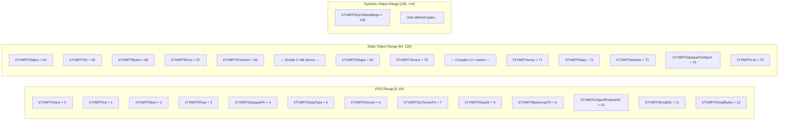

# C ABI Layer

**TL;DR**
- Defines the stable C ABI contract (`c_api.h`) that all language bindings (Python/Cython, Rust, WASM) target, consisting of `TVMFFIAny` (16-byte on-stack value), `TVMFFIObject` (24-byte heap header with weak/strong ref counting), `TVMFFIFunctionCell` (safe-call convention), and all `extern "C"` API functions.
- Partitions `TVMFFITypeIndex` into three ranges: POD `[0, 64)`, static objects `[64, 128)`, dynamic objects `[128, +inf)`, establishing an ABI-level contract that underpins type dispatch, `IsInstance` fast paths, and cross-language interop.
- Every cross-language function call goes through `TVMFFISafeCallType` -- a C function pointer that catches exceptions and stores errors in thread-local storage, enabling error propagation without C++ exception unwinding across DLL boundaries.

## Problem Statement

### Background

Machine learning systems require a foreign function interface that works across C++, Python, Rust, and WebAssembly. C++ exceptions, templates, and name mangling cannot cross DLL or language boundaries. The system needs a stable binary interface that:

- Passes values between languages without serialization overhead
- Manages object lifetimes across language boundaries
- Propagates errors without relying on C++ exception mechanisms
- Supports runtime type checking without virtual dispatch

### Solution

A pure-C ABI layer (`c_api.h`) that defines canonical struct layouts, type index enumeration, and `extern "C"` functions. All C++ and higher-level abstractions are built on top of this layer with identical memory layout (verified by `static_assert`).

### Goals

- **Goal**: Cross-platform, cross-language binary stability for the FFI value and object representations.
- **Goal**: Zero-cost interop between C and C++ representations (same memory layout, reinterpret_cast-safe).
- **Non-goal**: The C ABI does not attempt to expose container internals (Array element access, Map iteration) -- those go through function calls.

## Design

The C ABI defines four foundational struct types and a type index enumeration. All higher-level C++ classes (`Any`, `AnyView`, `Object`, `FunctionObj`, etc.) are layout-compatible with the corresponding C structs.

### Type Index Layout



The sentinel value `kTVMFFIAny = -1` never appears in `Any::type_index` at runtime but is used in reflection annotations to indicate "any type."

### TVMFFIAny: On-Stack Value (16 bytes)

```
Offset  Size  Field
0       4     type_index (int32_t)
4       4     union { zero_padding (uint32_t), small_str_len (uint32_t) }
8       8     union { v_int64, v_float64, v_ptr, v_c_str, v_obj, v_dtype, v_device, v_bytes[8] }
```

For small strings (`type_index == kTVMFFISmallStr` or `kTVMFFISmallBytes`), `small_str_len` stores the string length (0-7) and `v_bytes[0..6]` stores the content inline. For all other type indices, `zero_padding` must be zero (enforced at every write site) to enable 16-byte bitwise fast-path equality in `AnyEqual`.

The C++ classes `AnyView` and `Any` have this exact layout (enforced: `static_assert(sizeof(AnyView) == sizeof(TVMFFIAny))`). `AnyView` is non-owning; `Any` calls `IncRef`/`DecRef` on contained objects.

### TVMFFIObject: Heap Object Header (24 bytes)

```
Offset  Size  Field
0       8     combined_ref_count (uint64_t, atomic)
                lower 32 bits = strong_ref_count
                upper 32 bits = weak_ref_count
8       4     type_index (int32_t)
12      4     __padding (uint32_t, always zeroed)
16      8     union { deleter (function pointer taking (void*, int flags)), __ensure_align (int64_t) }
```

The `combined_ref_count` goes first (offset 0) to align with most intrusive pointer designs (e.g., PyTorch `intrusive_ptr`) and because ref-counting operations are the most frequent. The packing enables single-atomic detection of the common "both counters are one" state during deallocation. See [ADR 0041](../ADRs/0041-combined-ref-count-atomic.md).

**Note**: `type_index` is at offset 8 (not offset 0). The former invariant that `TVMFFIObject` and `TVMFFIAny` share `type_index` at offset 0 no longer holds. Runtime POD-vs-object discrimination uses other mechanisms.

The deleter receives an `int flags` bitmask (`TVMFFIObjectDeleterFlagBitMask`) to distinguish destructor invocation from memory deallocation:

| Flag Constant | Bit | Meaning |
|---|---|---|
| `kTVMFFIObjectDeleterFlagBitMaskStrong` | 0 | Call the destructor |
| `kTVMFFIObjectDeleterFlagBitMaskWeak` | 1 | Free the memory |
| `kTVMFFIObjectDeleterFlagBitMaskBoth` | 0+1 | Both (common case for strong-only objects) |

When `strong_ref_count` drops to zero, the deleter is called with bit 0 set (destructor). When `weak_ref_count` also drops to zero, bit 1 is set (free memory). For the common case where no weak references exist, both bits are set in a single deleter call.

### Object Cell Layout Convention

Specialized objects place their cell data immediately after the `TVMFFIObject` header. The C API provides inline accessor functions:

| Object Type | Cell Struct | Accessor |
|---|---|---|
| String/Bytes | `TVMFFIByteArray` | `TVMFFIBytesGetByteArrayPtr` |
| Error | `TVMFFIErrorCell` | `TVMFFIErrorGetCellPtr` |
| Function | `TVMFFIFunctionCell` | `TVMFFIFunctionGetCellPtr` |
| Shape | `TVMFFIShapeCell` | `TVMFFIShapeGetCellPtr` |
| Tensor | `DLTensor` | `TVMFFITensorGetDLTensorPtr` |
| Opaque Object | `TVMFFIOpaqueObjectCell` | `TVMFFIOpaqueObjectGetCellPtr` |
| Array/List | `TVMFFISeqCell` | _(accessed via SeqBaseObj inheritance)_ |

All accessors compute `(char*)obj + sizeof(TVMFFIObject)` -- a fixed 24-byte offset.

**`TVMFFISeqCell`** (commit `9513c2f` #443): Shared C struct for sequence containers (`ArrayObj`, `ListObj`). Fields: `void* data` (element buffer pointer), `int64_t size` (number of elements), `int64_t capacity` (allocated slots), `void(*data_deleter)(void*)` (optional buffer deallocator). Unlike other cell structs, `TVMFFISeqCell` does not have a dedicated C API accessor function -- it is inherited by `SeqBaseObj` and accessed through the C++ class hierarchy.

### TVMFFISafeCallType: Function Call ABI

```c
typedef int (*TVMFFISafeCallType)(void* handle, const TVMFFIAny* args,
                                   int32_t num_args, TVMFFIAny* result);
```

The first parameter is named `handle` (not `self`) to reflect that it is a generic opaque context pointer, not necessarily a FunctionObj. This naming aligns with the module system where the handle may refer to a library module rather than a function object.

Return codes: `0` = success, `-1` = error stored in TLS (retrieve via `TVMFFIErrorMoveFromRaised`), `-2` = frontend error already set (e.g., Python exception).

**Caller obligation**: `result->type_index` must be initialized to `kTVMFFINone` (or any value < `kTVMFFIStaticObjectBegin`) before calling.

### Pointer-Based Struct Passing Convention

C API functions that receive small C structs (e.g., `DLDataType`, `DLDevice`) must accept them via `const T*` (pointer) rather than `T` (by value). This convention was established to fix ABI compatibility issues on WebAssembly/Emscripten, where passing small structs by value across the FFI boundary has inconsistent calling conventions across compilers. Example: `TVMFFIDataTypeToString` accepts `const DLDataType*`, not `DLDataType`.

### Visibility and Linking Macros

| Macro | Purpose | Platform Behavior |
|---|---|---|
| `TVM_FFI_DLL` | Import/export toggle | Emscripten: `KEEPALIVE`; MSVC: `dllexport` if `TVM_FFI_EXPORTS`, else `dllimport`; GCC/Clang: `visibility("default")` |
| `TVM_FFI_DLL_EXPORT` | Always-export | Emscripten: `KEEPALIVE`; MSVC: always `dllexport`; GCC/Clang: `visibility("default")` |
| `TVM_FFI_WEAK` | Weak linking | MSVC: `__declspec(selectany)`; GCC/Clang: `__attribute__((weak))` |

`TVM_FFI_DLL_EXPORT` fills the gap where `TVM_FFI_DLL` may resolve to `dllimport` on MSVC when consumed from outside the library. Module/addon code that exports symbols should use `TVM_FFI_DLL_EXPORT`.

### TVMFFIFieldInfo: Reflection Field Metadata

```c
struct TVMFFIFieldInfo {
    TVMFFIByteArray name;
    int32_t field_static_type_index;
    int64_t flags;                  // TVMFFIFieldFlagBitMask bitmask
    int64_t offset;                 // Byte offset from Object* base
    int64_t size;                   // Field size in bytes
    int64_t alignment;              // Field alignment
    TVMFFIByteArray metadata;       // Structured JSON metadata string (renamed from type_schema)
    TVMFFIByteArray doc;            // Docstring
    TVMFFIAny default_value;        // Default field value (if kTVMFFIFieldFlagBitMaskHasDefault set)
    TVMFFIFieldGetter getter;
    void* setter;                   // TVMFFIFieldSetter or TVMFFIObjectHandle (see bit 11)
};
```

As of commit `10dc59d` (#500), the `setter` field type is `void*` instead of `TVMFFIFieldSetter`. When `kTVMFFIFieldFlagBitSetterIsFunctionObj` (bit 11) is set in `flags`, the `setter` holds a `TVMFFIObjectHandle` pointing to a `FunctionObj` that is invoked via `TVMFFIFunctionCall` with `(field_addr_as_OpaquePtr, value_as_AnyView)`. When the flag is clear (default), the `void*` is cast to `TVMFFIFieldSetter`. See [ADR 0071](../ADRs/0071-functionobj-dispatched-field-setter.md).
```

### TVMFFISEqHashKind: Structural Equality/Hash Dispatch

```c
enum TVMFFISEqHashKind {
    kTVMFFISEqHashKindUnsupported = 0,     // No structural comparison (throws TypeError)
    kTVMFFISEqHashKindTreeNode = 1,        // Recursive field-by-field via reflection
    kTVMFFISEqHashKindFreeVar = 2,         // Alpha-equivalence with variable mapping
    kTVMFFISEqHashKindDAGNode = 3,         // Graph-aware with memoization
    kTVMFFISEqHashKindConstTreeNode = 4,   // Pointer fast-path, then field-by-field
    kTVMFFISEqHashKindUniqueInstance = 5,  // Pointer equality only
};
```

Stored in `TVMFFITypeMetadata::structural_eq_hash_kind`. Set per type via `Object::_type_s_eq_hash_kind`.

### TVMFFIFieldFlagBitMask

```c
enum TVMFFIFieldFlagBitMask {
    kTVMFFIFieldFlagBitMaskWritable = 1,            // bit 0: field is writable
    kTVMFFIFieldFlagBitMaskHasDefault = 2,          // bit 1: default_value is valid
    kTVMFFIFieldFlagBitMaskIsStaticMethod = 4,      // bit 2: method is static
    kTVMFFIFieldFlagBitMaskSEqHashIgnore = 8,       // bit 3: skip during structural equal/hash
    kTVMFFIFieldFlagBitMaskSEqHashDef = 16,         // bit 4: defines a variable-binding region
    kTVMFFIFieldFlagBitMaskDefaultFromFactory = 32,  // bit 5: default from factory function
    kTVMFFIFieldFlagBitMaskReprOff = 64,            // bit 6: exclude from repr
    kTVMFFIFieldFlagBitMaskCompareOff = 128,        // bit 7: exclude from comparison
    kTVMFFIFieldFlagBitMaskHashOff = 256,           // bit 8: exclude from hashing
    kTVMFFIFieldFlagBitMaskInitOff = 512,           // bit 9: exclude from auto-init
    kTVMFFIFieldFlagBitMaskKwOnly = 1024,           // bit 10: keyword-only in auto-init
    kTVMFFIFieldFlagBitSetterIsFunctionObj = 2048,  // bit 11: setter is FunctionObj handle
};
```

Replaces the former boolean `readonly` field with an extensible bitmask. Bits 3-4 control structural equality/hash behavior. Bits 5-10 control auto-init, repr, compare, and hash behavior. Bit 11 (commit `10dc59d` #500) controls setter dispatch: when set, the `setter` field in `TVMFFIFieldInfo` is a `FunctionObj` handle rather than a `TVMFFIFieldSetter` function pointer. See [ADR 0071](../ADRs/0071-functionobj-dispatched-field-setter.md).

### TVMFFIMethodInfo: Method Metadata

```c
struct TVMFFIMethodInfo {
    TVMFFIByteArray name;
    TVMFFIByteArray doc;
    TVMFFIByteArray metadata;      // Structured JSON metadata string (renamed from type_schema)
    int64_t flags;
    TVMFFIAny method;              // Stores a Function as inline TVMFFIAny
};
```

The `metadata` field (formerly `type_schema`) stores structured JSON metadata. Docstrings are separate (`doc` field) because they can be unstructured and large, while metadata is focused on type signatures and machine-readable annotations.

### TVMFFITypeInfo: Runtime Type Information

```c
struct TVMFFITypeInfo {
    int32_t type_index;
    int32_t type_depth;
    TVMFFIByteArray type_key;
    int32_t type_key_hash;
    const struct TVMFFITypeInfo** type_ancestors;  // Direct pointers to ancestor TypeInfo
    const TVMFFIFieldInfo* fields;
    int32_t num_fields;
    const TVMFFIMethodInfo* methods;
    int32_t num_methods;
    const TVMFFITypeMetadata* metadata;            // Renamed from extra_info
};
```

The `type_ancestors` field stores direct `TVMFFITypeInfo*` pointers (not integer indices), enabling O(1) ancestor reflection lookup without an extra `TVMFFIGetTypeInfo()` call per ancestor.

### TVMFFITypeMetadata: Type Metadata (formerly TVMFFITypeExtraInfo)

```c
struct TVMFFITypeMetadata {
    TVMFFIByteArray doc;
    TVMFFIObjectCreator creator;              // int(*)(TVMFFIObjectHandle* result)
    int32_t total_size;                       // sizeof(ConcreteObj), narrowed from int64_t
    TVMFFISEqHashKind structural_eq_hash_kind; // Structural equality/hash dispatch mode
};
```

Registered via `TVMFFITypeRegisterMetadata` (renamed from `TVMFFITypeRegisterExtraInfo`). The `creator` function pointer enables reflection-based object construction from language bindings. The `total_size` was narrowed from `int64_t` to `int32_t` to accommodate the `structural_eq_hash_kind` field without growing the struct (4 GB is sufficient for any single object).

### TVMFFITypeAttrColumn: Extensible Per-Type Attribute Column

```c
struct TVMFFITypeAttrColumn {
    const TVMFFIAny* data;   // Column array indexed by (type_index - begin_index)
    int32_t size;            // Number of elements in the data array
    int32_t begin_index;     // Starting type index of the column data (0 in initial release)
};
```

Returned by `TVMFFIGetTypeAttrColumn`. Each named attribute has its own column. The column covers type indices `[begin_index, begin_index + size)`. As of commit `c85fd42` (#471), `begin_index` was added and `size` was narrowed from `int64_t` to `int32_t` (total struct size unchanged: the two `int32_t` fields occupy the same 8 bytes as the former `int64_t`). See [0010-type-attr-columns](0010-type-attr-columns.md) for the full design.

### c_api.h Section Ordering Convention

Declarations in `c_api.h` are organized so that C API function declarations are grouped by the struct/enum they operate on, placed immediately after those definitions. This replaced a prior layout where all user-facing functions were grouped in a single "User APIs" section at the end of the file. New C API functions should follow this convention: place the function declaration near the struct/enum it operates on.

Note: Environment APIs (`TVMFFIEnvCheckSignals`, `TVMFFIEnvRegisterCAPI`) and module-scoped APIs (`TVMFFIEnvModLookupFromImports`, etc.) are declared in `include/tvm/ffi/extra/c_env_api.h`, not in `c_api.h`, because they are non-core functionality.

### C-Language Compilation Compatibility

The `c_api.h` header is designed to compile with both C and C++ compilers (C99+). Several adjustments ensure this:

- **`DLPackTensorAllocator` typedef inside `extern "C"`**: The typedef was moved inside the `extern "C"` block (commit `c100338d`) to ensure proper C linkage. A forward declaration `typedef struct DLManagedTensorVersioned DLManagedTensorVersioned;` was added because some versions of `dlpack.h` do not provide one visible from C.
- **No C++-only types in `TVMFFIAny` union**: The `char32_t v_char32[2]` field was removed from the value union because `char32_t` is a C++-only type. The field overlapped with `v_bytes[8]` at the same offset, so no data layout change occurred. See [ADR 0038](../ADRs/0038-remove-v-char32-from-any-union.md).
- **Conditional enum syntax**: `TVMFFITypeIndex` uses `enum TVMFFITypeIndex : int32_t { ... }` in C++ and `typedef enum { ... } TVMFFITypeIndex;` in C, controlled by `#ifdef __cplusplus`.

This enables pure-C compiler codegen backends to target the FFI ABI convention by implementing `__tvm_ffi_<name>` symbols that operate directly on `TVMFFIAny` values. A minimal C example is provided in `examples/quick_start/src/add_one_c.c`.

### TVMFFIEnvMod* Naming Convention

C API functions that operate in the context of a loaded module (callee-side operations called by generated kernel code) use the `TVMFFIEnvMod*` prefix to distinguish them from general host-environment operations (`TVMFFIEnv*`). This convention was established when the original `TVMFFIEnv*` names were ambiguous about whether they operated on a specific module context or the global environment. See [ADR 0019](../ADRs/0019-env-mod-naming-convention.md).

| Old Name | New Name |
|---|---|
| `TVMFFIEnvLookupFromImports` | `TVMFFIEnvModLookupFromImports` |
| `TVMFFIEnvRegisterContextSymbol` | `TVMFFIEnvModRegisterContextSymbol` |
| `TVMFFIEnvRegisterSystemLibSymbol` | `TVMFFIEnvModRegisterSystemLibSymbol` |

### extern "C" API Surface

| Function | Purpose |
|---|---|
| `TVMFFIObjectIncRef` | Increment strong ref count |
| `TVMFFIObjectDecRef` | Decrement strong ref count (was `TVMFFIObjectFree`) |
| `TVMFFIObjectCreateOpaque` | Create opaque object wrapping a foreign handle |
| `TVMFFITypeKeyToIndex` | String type key to integer index |
| `TVMFFITypeGetOrAllocIndex` | Register/allocate type index |
| `TVMFFIGetTypeInfo` | Get runtime type info by index |
| `TVMFFITypeRegisterField` | Register reflection field info |
| `TVMFFITypeRegisterMethod` | Register reflection method info |
| `TVMFFITypeRegisterMetadata` | Register type metadata (creator, size, doc, structural_eq_hash_kind) |
| `TVMFFITypeRegisterAttr` | Register extensible per-type attribute (column storage) |
| `TVMFFIGetTypeAttrColumn` | Get named attribute column for O(1) per-type lookup |
| `TVMFFIFunctionCreate` | Create Function from C callbacks |
| `TVMFFIFunctionCall` | Invoke function via safe_call |
| `TVMFFIFunctionSetGlobal` | Register function in global table |
| `TVMFFIFunctionGetGlobal` | Lookup function by name |
| `TVMFFIFunctionSetGlobalFromMethodInfo` | Register function with full metadata |
| `TVMFFIAnyViewToOwnedAny` | Convert non-owning AnyView to owning Any |
| `TVMFFIErrorCreate` | Create error object |
| `TVMFFIErrorSetRaised` | Store error in TLS |
| `TVMFFIErrorSetRaisedFromCStr` | Create error from C strings and store in TLS |
| `TVMFFIErrorMoveFromRaised` | Retrieve and clear TLS error |
| `TVMFFITensorFromDLPack` | Import DLPack tensor |
| `TVMFFITensorToDLPack` | Export to DLPack |
| `TVMFFITraceback` | Capture native traceback with FFI boundary control |
| `TVMFFIDataTypeToString` | Convert `const DLDataType*` to string |
| `TVMFFIStringFromByteArray` | Create `String` (with SSO) from `TVMFFIByteArray` |
| `TVMFFIBytesFromByteArray` | Create `Bytes` (with SSO) from `TVMFFIByteArray` |

### Key Classes, Fields and Interfaces

- **`TVMFFITypeIndex`** (enum): Canonical type index values. POD range `[0, 64)`, static object `[64, 128)`, dynamic `[128, +inf)`.
- **`TVMFFIAny`** (C struct, 16 bytes): On-stack type-erased value. `type_index` + `zero_padding`/`small_str_len` union + 8-byte value union.
- **`TVMFFIObject`** (C struct, 24 bytes): Heap object header. `combined_ref_count` (u64, strong in lower 32 bits, weak in upper 32 bits) + `type_index` (i32) + `__padding` (u32) + `deleter(void*, flags)`. The deleter takes `void*` (not `TVMFFIObject*`) for flexibility with custom allocators.
- **`TVMFFIObjectDeleterFlagBitMask`** (enum): Bitmask for deleter flags: `Strong` (bit 0, call destructor), `Weak` (bit 1, free memory), `Both` (bits 0+1).
- **`TVMFFIOpaqueObjectCell`** (C struct): Contains single field `handle` (`void*`) for wrapping foreign language objects.
- **`TVMFFIFunctionCell`** (C struct): Contains two fields: `safe_call` of type `TVMFFISafeCallType` and `cpp_call` (`void*`). `cpp_call` is a C++-style call pointer (throws exceptions) for same-DLL fast-path calls; set to `nullptr` for C-origin functions. See [ADR 0042](../ADRs/0042-cpp-call-dual-dispatch.md).
- **`TVMFFIFieldInfo`** (C struct): Reflection field metadata with flags bitmask, offset/size/alignment, metadata (renamed from type_schema), doc, default_value, getter, and setter (`void*` -- either `TVMFFIFieldSetter` function pointer or `FunctionObj` handle depending on bit 11 flag).
- **`TVMFFIMethodInfo`** (C struct): Reflection method metadata with name, doc, metadata (renamed from type_schema), flags, method as `TVMFFIAny`.
- **`TVMFFITypeInfo`** (C struct): Runtime type information with pointer-based ancestor array, fields, methods, metadata.
- **`TVMFFITypeMetadata`** (C struct, formerly `TVMFFITypeExtraInfo`): Type metadata with doc, creator, total_size (int32_t), structural_eq_hash_kind.
- **`TVMFFITypeAttrColumn`** (C struct): Column-oriented per-type attribute storage with `data`, `size` (int32_t), and `begin_index` (int32_t) fields.
- **`TVMFFISEqHashKind`** (enum): Structural equality/hash dispatch mode (6 values: Unsupported, TreeNode, FreeVar, DAGNode, ConstTreeNode, UniqueInstance).
- **`TVMFFIFieldFlagBitMask`** (enum): Extensible bitmask with 12 defined bits: Writable (0), HasDefault (1), IsStaticMethod (2), SEqHashIgnore (3), SEqHashDef (4), DefaultFromFactory (5), ReprOff (6), CompareOff (7), HashOff (8), InitOff (9), KwOnly (10), SetterIsFunctionObj (11).
- **`TVMFFIByteArray`** (C struct): `{const char* data, size_t size}` -- used for strings and byte arrays.
- **`DLPackTensorAllocator`** (C typedef, `c_api.h`): `int (*)(const DLTensor*, DLManagedTensorVersioned**, void(*)(void*,int32_t,const char*), void*)`. C-style function pointer for allocating DLPack tensors from a prototype, using the error-propagation callback pattern. Consumed by `Tensor::FromDLPackAlloc` and Python-side `TVMFFIEnvSetTensorAllocator`.
- **`TVM_FFI_DLL`** macro: Visibility/export attribute (Emscripten `KEEPALIVE`, MSVC `dllexport/dllimport`, GCC/Clang `visibility("default")`).
- **`TVM_FFI_DLL_EXPORT`** macro: Always-export visibility attribute for module/addon code.
- **`TVM_FFI_WEAK`** macro: Cross-platform weak-linking attribute.

### Contracts, Assumptions and Invariants

- **Value and header layout invariant**: `sizeof(TVMFFIAny) == 16` and `sizeof(TVMFFIObject) == 24`. The C++ `Any`/`AnyView` classes have identical layout to `TVMFFIAny` (verified by `static_assert`). The C++ `Object` class has identical layout to `TVMFFIObject` (24 bytes). This enables zero-cost `reinterpret_cast` between C and C++ representations.
- **type_index at offset 0 (TVMFFIAny only)**: `TVMFFIAny` places `type_index` at byte offset 0. `TVMFFIObject` places `type_index` at byte offset 8 (after `combined_ref_count`). The former invariant that both share `type_index` at offset 0 no longer holds (broken in commit `13436f0`).
- **Object cell at offset 24**: All specialized cell data (function, error, string, shape, ndarray, opaque) is placed at `sizeof(TVMFFIObject) = 24` bytes from the object pointer. This is a hard ABI contract.
- **Caller-initialized result**: The caller of `TVMFFISafeCallType` must set `result->type_index < kTVMFFIStaticObjectBegin` before the call. The callee may store an object pointer in `result->v_obj` -- if the caller leaves a stale object pointer, it will leak.
- **Thread-local error storage**: Errors from safe_call are stored in `thread_local SafeCallContext`, not returned as out-parameters.
- **Pointer-based struct parameters**: C API functions must accept small struct parameters (`DLDataType`, `DLDevice`) via `const T*` to ensure ABI portability across native, WASM/Emscripten, and other targets.
- **Ancestor table uses direct pointers**: `TVMFFITypeInfo::type_ancestors[i]` is a valid `const TVMFFITypeInfo*`, not an integer index. Pointers are stable for the lifetime of the `TypeTable`.

### Extension Points

- **New POD types**: Indices `[13, 63)` are available for future POD types without breaking the ABI partition. Indices 11-12 are used for small string/bytes.
- **New static object types**: Indices `[75, 127)` are available. The static range is sub-divided: simple C ABI types (Object=64..Tensor=70) with fully C-described cell layouts precede complex C++ types (Array=71..OpaquePyObject=74) that may require C++ runtime support.
- **New C API functions**: Additional `extern "C"` functions can be added without breaking existing bindings.
- **Platform-specific DLL macros**: New platforms can be added by extending the `#if` chain.
- **New field/method flags**: The `TVMFFIFieldFlagBitMask` bitmask has bits 12-63 available for future flags. Bits 0-11 are allocated (writable, has-default, static-method, seq-hash-ignore, seq-hash-def, default-from-factory, repr-off, compare-off, hash-off, init-off, kw-only, setter-is-function-obj).
- **New type attributes**: Extensible per-type metadata via `TVMFFITypeRegisterAttr` / `TVMFFIGetTypeAttrColumn` without modifying `TVMFFITypeMetadata`.

### Convenience Header: tvm/ffi/tvm_ffi.h

As of commit `8caa0cb` (#359), a single umbrella header `include/tvm/ffi/tvm_ffi.h` aggregates all core FFI C++ headers (excluding `tvm/ffi/extra/`). Downstream C++ consumers can include one header instead of tracking individual headers:

```cpp
#include <tvm/ffi/tvm_ffi.h>
```

The header includes: `any.h`, `base_details.h`, `c_api.h`, `cast.h`, all container headers (`array.h`, `map.h`, `shape.h`, `tensor.h`, `tuple.h`, `variant.h`), `dtype.h`, `error.h`, `function.h`, `function_details.h`, `memory.h`, `object.h`, `optional.h`, all reflection headers (`access_path.h`, `accessor.h`, `creator.h`, `overload.h`, `registry.h`), `rvalue_ref.h`, `string.h`, and `type_traits.h`.

**Invariant:** The convenience header does not include any `extra/` headers, maintaining the core/extra layering boundary.

## Alternatives & Trade-offs

### Alternative: Flat type index namespace (no partitioning)

- Pros: Simpler allocation, no range limits
- Cons: Cannot distinguish POD from object at O(1). The partition enables the fast path in `Any::reset()`.

### Alternative: Return error as out-parameter instead of TLS

- Pros: No TLS dependency, simpler threading model
- Cons: Every function call would need an additional parameter. TLS was chosen because it simplifies chains of calls in compiler-generated code.

### Alternative: Pass small structs by value in C API

- Pros: Simpler call sites, no pointer indirection
- Cons: WebAssembly/Emscripten has inconsistent ABI for passing small structs by value. Pointer-based passing ensures consistent calling convention across all platforms.

## Related Work

### Design Docs & ADRs

- [`.knowledge/designs/0002-any-system.md`](0002-any-system.md) -- `Any`/`AnyView` built on `TVMFFIAny`
- [`.knowledge/designs/0003-object-system.md`](0003-object-system.md) -- Object system built on `TVMFFIObject`
- [`.knowledge/designs/0004-function-system.md`](0004-function-system.md) -- Function system built on `TVMFFIFunctionCell`
- [`.knowledge/designs/0006-reflection.md`](0006-reflection.md) -- Reflection system using `TVMFFIFieldInfo`, `TVMFFIMethodInfo`, `TVMFFITypeMetadata`
- [`.knowledge/designs/0009-structural-equal-hash.md`](0009-structural-equal-hash.md) -- Structural equality/hash using `TVMFFISEqHashKind`
- [`.knowledge/designs/0010-type-attr-columns.md`](0010-type-attr-columns.md) -- TypeAttr column system using `TVMFFITypeAttrColumn`
- [`.knowledge/designs/0008-module-export-system.md`](0008-module-export-system.md) -- Module export macros
- [`.knowledge/designs/0013-module-system.md`](0013-module-system.md) -- Module system (kTVMFFIModule type index, TVMFFIEnvMod* APIs)
- [`.knowledge/designs/0015-traceback-system.md`](0015-traceback-system.md) -- TVMFFITraceback and cross-language traceback
- [`.knowledge/designs/0014-python-bindings.md`](0014-python-bindings.md) -- Python/Cython bindings consuming the C ABI
- [`.knowledge/ADRs/0002-type-index-partitioning.md`](../ADRs/0002-type-index-partitioning.md) -- Type index ranges
- [`.knowledge/ADRs/0019-env-mod-naming-convention.md`](../ADRs/0019-env-mod-naming-convention.md) -- TVMFFIEnvMod* naming convention
- [`.knowledge/ADRs/0005-safe-call-abi-boundary.md`](../ADRs/0005-safe-call-abi-boundary.md) -- Dual call/safe_call design
- [`.knowledge/ADRs/0007-pointer-param-for-struct-in-c-api.md`](../ADRs/0007-pointer-param-for-struct-in-c-api.md) -- Pointer-based struct params
- [`.knowledge/ADRs/0038-remove-v-char32-from-any-union.md`](../ADRs/0038-remove-v-char32-from-any-union.md) -- Removal of v_char32 for C compatibility
- [`.knowledge/ADRs/0071-functionobj-dispatched-field-setter.md`](../ADRs/0071-functionobj-dispatched-field-setter.md) -- FunctionObj-dispatched field setter decision

### Evidence Matrix

- TVMFFIAny 16-byte layout -> `.knowledge/commits/2025-05-06-7d34eb8abfe987bf0031e4d4ff479895d867a966.md` + `7d34eb8` + `include/tvm/ffi/c_api.h`
- TVMFFISafeCallType self->handle rename -> `.knowledge/commits/2025-06-17-e9094866e1e58535f2456b92c1072449f6a2716a.md` + `e909486`
- Pointer-based struct passing (DLDataType) -> `.knowledge/commits/2025-05-11-076ac23e994e404c40a789ccc42a1497a31e1280.md` + `076ac23`
- TVM_FFI_WEAK macro -> `.knowledge/commits/2025-05-24-8a009885a44a132baba886bead112924aef0d45f.md` + `8a00988`
- TVM_FFI_DLL_EXPORT macro -> `.knowledge/commits/2025-05-29-192f196ec7b342677217e854fae7e7970fa100c5.md` + `192f196`
- TVMFFIFieldInfo with flags/size/alignment/type_schema -> `.knowledge/commits/2025-06-15-1a856886c8c14c6271e156d1ce4d76335d42f0ff.md` + `1a85688`
- TVMFFITypeExtraInfo struct -> `.knowledge/commits/2025-06-15-1a856886c8c14c6271e156d1ce4d76335d42f0ff.md` + `1a85688`
- TVMFFITypeInfo pointer-based type_ancestors -> `.knowledge/commits/2025-06-25-69f2484f915d95886502a1f620ea69aeed623c49.md` + `69f2484`
- TVMFFIFunctionSetGlobalFromMethodInfo -> `.knowledge/commits/2025-06-15-1a856886c8c14c6271e156d1ce4d76335d42f0ff.md` + `1a85688`
- TVMFFITypeExtraInfo -> TVMFFITypeMetadata rename -> `.knowledge/commits/2025-07-22-162d6009252dd44950a9aa9b890cbbce6b8e5155.md` + `162d600`
- TVMFFISEqHashKind enum -> `.knowledge/commits/2025-07-19-9445fe734839cffc8bdf881788528b7763f7be03.md` + `9445fe7`
- SEqHash field flags (bits 3-4) -> `.knowledge/commits/2025-07-19-9445fe734839cffc8bdf881788528b7763f7be03.md` + `9445fe7`
- TVMFFITypeAttrColumn / TVMFFITypeRegisterAttr -> `.knowledge/commits/2025-07-22-162d6009252dd44950a9aa9b890cbbce6b8e5155.md` + `162d600`
- kTVMFFISmallStr / kTVMFFISmallBytes POD types -> `.knowledge/commits/2025-08-01-f9d2bff8444250bdac336eeb1eee9cfba063008d.md` + `f9d2bff`
- zero_padding / small_str_len TVMFFIAny field -> `.knowledge/commits/2025-08-01-f9d2bff8444250bdac336eeb1eee9cfba063008d.md` + `f9d2bff`
- total_size narrowed to int32_t -> `.knowledge/commits/2025-07-19-9445fe734839cffc8bdf881788528b7763f7be03.md` + `9445fe7`
- kTVMFFIModule = 73 type index -> `.knowledge/commits/2025-08-17-538bef49b4daa91970f0f9cea137acdcb696562a.md` + `538bef4`
- c_api.h section ordering convention -> `.knowledge/commits/2025-08-20-023ea448be6e86e09f4ebaba5a235ee53f3cdeef.md` + `023ea44`
- TVMFFIEnvMod* naming convention (Mod infix rename) -> `.knowledge/commits/2025-08-20-023ea448be6e86e09f4ebaba5a235ee53f3cdeef.md` + `023ea44`
- Env APIs moved to extra-tier c_env_api.h -> `.knowledge/commits/2025-08-20-023ea448be6e86e09f4ebaba5a235ee53f3cdeef.md` + `023ea44`
- TVMFFITraceback 4-parameter signature (cross_ffi_boundary) -> `.knowledge/commits/2025-08-24-2d41a5115f6a91e2781012a3379f9626bc9e18a1.md` + `2d41a51`
- Static type index reordering (Shape=69, NDArray=70, Array=71, Map=72) -> `.knowledge/commits/2025-08-30-777cf8d51f2054d96e0413b7406ed38ef43a7b39.md` + `777cf8d`
- TVMFFIObject grows to 24 bytes (weak_ref_count + strong_ref_count) -> `.knowledge/commits/2025-09-01-ca9c3d10bb9640bffb972302f7064e49e592a526.md` + `ca9c3d1`
- TVMFFIObjectDeleterFlagBitMask enum -> `.knowledge/commits/2025-09-01-ca9c3d10bb9640bffb972302f7064e49e592a526.md` + `ca9c3d1`
- TVMFFIObjectFree renamed to TVMFFIObjectDecRef + TVMFFIObjectIncRef added -> `.knowledge/commits/2025-09-01-ca9c3d10bb9640bffb972302f7064e49e592a526.md` + `ca9c3d1`
- kTVMFFIOpaquePyObject = 74 + TVMFFIOpaqueObjectCell + TVMFFIObjectCreateOpaque -> `.knowledge/commits/2025-09-05-91d69f0658eef18fd9c99d4ac195ad5319db3787.md` + `91d69f0`
- Module GetFunctionMetadata + tvm_ffi_metadata_prefix symbol -> `.knowledge/commits/2025-08-30-777cf8d51f2054d96e0413b7406ed38ef43a7b39.md` + `777cf8d`
- allow_override parameter rename in TVMFFIFunctionSetGlobal -> `.knowledge/commits/2025-08-30-777cf8d51f2054d96e0413b7406ed38ef43a7b39.md` + `777cf8d`
- kTVMFFINDArray renamed to kTVMFFITensor, TVMFFINDArray* C API functions renamed to TVMFFITensor* -> `.knowledge/commits/2025-09-06-3a551d83f7c05106fa8033a61970a5ce34aa8aef.md` + `3a551d8`
- FObjectDeleter signature changed from TVMFFIObject* to void*, anonymous struct typedefs for TVMFFIObject/TVMFFIAny -> `.knowledge/commits/2025-09-07-24125d0ac466beb67965c1dd9ae23f2a71f424ad.md` + `24125d0`
- TVMFFIEnvSetStream renamed to TVMFFIEnvSetCurrentStream -> `.knowledge/commits/2025-09-09-db987299f74aadcb4d8003cc6009cb67a75662c8.md` + `db98729`
- TVMFFIEnvSetCurrentStream renamed back to TVMFFIEnvSetStream (short form) -> `.knowledge/commits/2025-09-12-f81ab9c25ae4d2a42706747c50c5c410c51d6cdd.md` + `f81ab9c`
- DLPackTensorAllocator typedef added to c_api.h -> `.knowledge/commits/2025-09-12-f81ab9c25ae4d2a42706747c50c5c410c51d6cdd.md` + `f81ab9c`
- TVMFFIStringFromByteArray/TVMFFIBytesFromByteArray -> `.knowledge/commits/2025-09-13-043d9f647677cc3b4a8baba198a2ced45f99cc98.md` + `043d9f6`
- C-language compilation fixes (v_char32 removal, DLPackTensorAllocator inside extern "C", DLManagedTensorVersioned forward decl, --cflags CLI, C example) -> `.knowledge/commits/2025-09-14-c100338de52825097ddc44bbac3d03a92f45b33a.md` + `c100338`
- type_acenstors -> type_ancestors rename in c_api.h, object.h, accessor.h -> `.knowledge/commits/2025-09-25-98cb8af49ff599c217fce96c3d4f57c0f52b8ec4.md` + `98cb8af`
- TVMFFIObject header reorder (combined_ref_count first, type_index at offset 8) -> `.knowledge/commits/2025-09-25-13436f01111bc4218feb440a29a2e421bc148cc4.md` + `13436f0`
- combined_ref_count single-u64 packing of strong/weak counters -> `.knowledge/commits/2025-09-26-43d13e86ee24d1558f929e3b0faa3182ca1af872.md` + `43d13e8`
- TVMFFIFunctionCell gains cpp_call field -> `.knowledge/commits/2025-09-29-4fe8b2b79dfeb469b2499acecb3e10038ddcee0f.md` + `4fe8b2b`
- TVMFFIFieldInfo/TVMFFIMethodInfo type_schema -> metadata rename, GetFunctionDoc -> `.knowledge/commits/2025-10-01-ffa2dbf8bc18edb3114f18f619da08c4e3289de6.md` + `ffa2dbf`
- Convenience header tvm/ffi/tvm_ffi.h -> `.knowledge/commits/2026-01-04-8caa0cbe70e369a525192be0e0f159702dacb71c.md` + `8caa0cb`
- TVMFFITypeAttrColumn: begin_index field added, size narrowed to int32_t -> `.knowledge/commits/2026-02-22-c85fd42df6eae4ae0ec1aaa4ebb67ac859758cf5.md` + `c85fd42`
- TVMFFIFieldInfo setter changed to void* + kTVMFFIFieldFlagBitSetterIsFunctionObj (bit 11) + CallFieldSetter dispatch -> `.knowledge/commits/2026-03-10-10dc59d196c8a88371a73a3fdc43d3400c0c0427.md` + `10dc59d`
- Additional C API symbols exposed in base.pxi (type registration, field flags, error structs, SEqHashKind) -> `.knowledge/commits/2026-03-10-f98ce6d56a522b5e6b00865735643934af0e184d.md` + `f98ce6d`
