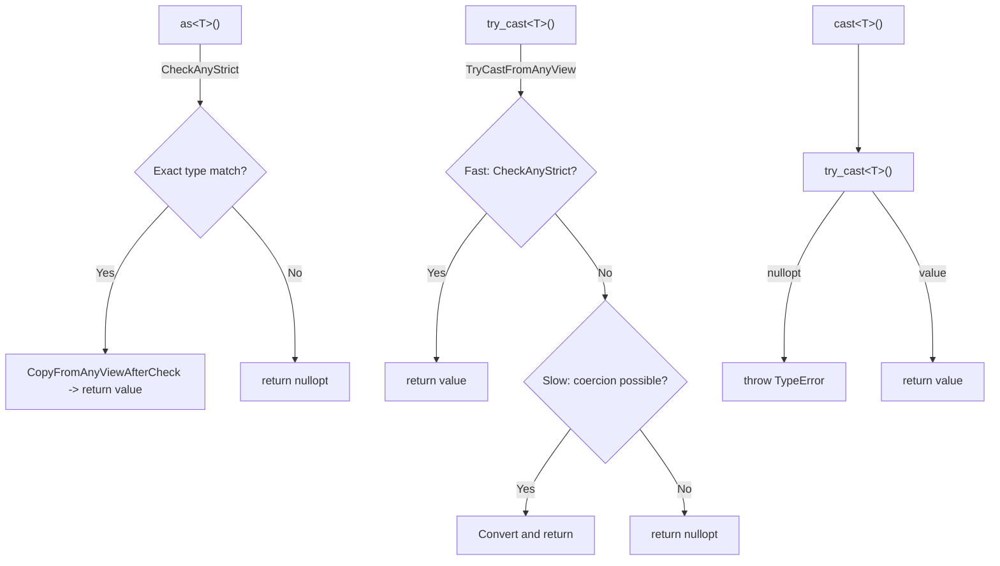
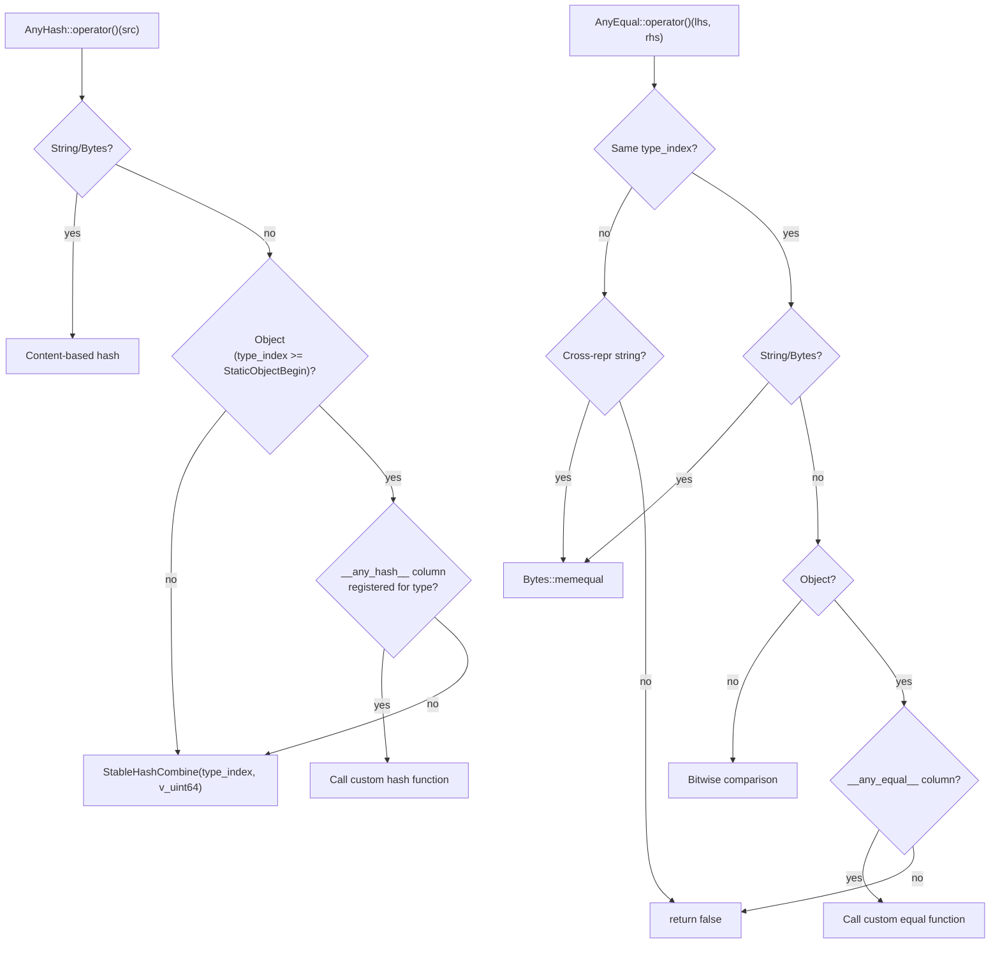

# Any/AnyView Type Erasure System

**TL;DR**
- `AnyView` (non-owning, 16-byte) and `Any` (owning, 16-byte) are the universal value containers of the FFI. Both have the same memory layout as `TVMFFIAny`, enabling zero-cost casts to/from the C ABI.
- The `TypeTraits<T>` protocol defines how each C++ type converts to/from `Any`/`AnyView`. The protocol distinguishes between strict checks (`CheckAnyStrict`) and lenient conversion (`TryCastFromAnyView`), with three user-facing access methods: `as<T>()` (strict), `try_cast<T>()` (lenient), `cast<T>()` (lenient + throw).
- The `kTVMFFIRawStr` invariant: `Any::type_index` is never `kTVMFFIRawStr` -- raw strings are only valid in `AnyView`. When an `AnyView` holding a raw string is converted to `Any`, it is automatically promoted to an owned `String` object.

## Problem Statement

### Background

A cross-language FFI needs to pass values of arbitrary types (integers, floats, strings, objects) without knowing the concrete type at compile time. The system must handle both on-stack POD values and heap-allocated ref-counted objects in a single 16-byte container that works across C and C++ boundaries.

### Solution

Two classes with identical layout but different ownership semantics:
- `AnyView`: Borrows a reference. Cheap to create (no ref-count changes), but the caller must ensure the referenced value outlives the view.
- `Any`: Owns a reference. Increments ref-count on construction, decrements on destruction. Safe to store and return.

The `TypeTraits<T>` template protocol defines per-type conversion logic, keeping the `Any`/`AnyView` classes generic.

### Goals

- **Goal**: Zero-overhead value passing for POD types (int, float, bool, DLDevice, DLDataType).
- **Goal**: Safe ownership transfer for heap objects via ref-counting.
- **Goal**: Extensible type conversion via `TypeTraits` specializations.
- **Goal**: Small-string optimization for strings up to 7 bytes, stored inline in `TVMFFIAny.v_bytes` as POD values (`kTVMFFISmallStr` / `kTVMFFISmallBytes`).

## Design

### AnyView: Non-Owning View

```cpp
class AnyView {
protected:
  TVMFFIAny data_;  // 16 bytes: type_index + zero_padding/small_str_len + union
public:
  template <typename T> AnyView(const T& other);          // CopyToAnyView
  template <typename T> std::optional<T> as() const;      // Strict: CheckAnyStrict
  template <typename T> std::optional<T> try_cast() const; // Lenient: TryCastFromAnyView
  template <typename T> T cast() const;                    // Lenient + throw on failure
};
```

`AnyView` does not call `IncRef`/`DecRef`. It can hold raw C strings (`kTVMFFIRawStr`), byte array pointers (`kTVMFFIByteArrayPtr`), and object r-value references (`kTVMFFIObjectRValueRef`) -- types that are only valid for the duration of a function call.

### Any: Owning Container

```cpp
class Any {
protected:
  TVMFFIAny data_;
public:
  Any(const AnyView& other);  // InplaceConvertAnyViewToAny
  ~Any() { reset(); }         // DecRef if object
  void reset();               // DecRef + set to None
  template <typename T> std::optional<T> as() const;       // Strict
  template <typename T> std::optional<T> as() &&;          // Strict (rvalue, move semantics)
  template <typename T> std::optional<T> try_cast() const; // Lenient
  template <typename T> T cast() const;                    // Lenient + throw
};
```

On construction from `AnyView`, `Any` calls `InplaceConvertAnyViewToAny` which:
1. If `type_index >= kTVMFFIStaticObjectBegin`: calls `IncRef` on the object pointer.
2. If `type_index == kTVMFFIRawStr`: creates a new `String` object from the raw `const char*`.
3. If `type_index == kTVMFFIByteArrayPtr`: creates a new `Bytes` object from the `TVMFFIByteArray*`.
4. If `type_index == kTVMFFIObjectRValueRef`: takes ownership of the r-value reference.

### Strict vs. Converting Access (as / try_cast / cast)

The three access methods have distinct semantics:



- `as<T>()` = strict reinterpret, no type coercion. Returns `nullopt` if stored type is not exactly `T`.
- `try_cast<T>()` = lenient conversion, may coerce (e.g., int->float, String->DLDataType). Returns `nullopt` on failure.
- `cast<T>()` = same as `try_cast` but throws `TypeError` on failure.

This distinction is critical for containers: `Array<T>` uses `CheckAnyStrict` (the `as` path) to validate elements, preventing silent conversions.

### TypeTraits Protocol

Each `TypeTraits<T>` specialization provides:

| Method | Purpose |
|---|---|
| `CopyToAnyView(T, TVMFFIAny*)` | Write value to AnyView (non-owning) |
| `MoveToAny(T, TVMFFIAny*)` | Move value into Any (owning) |
| `CheckAnyStrict(TVMFFIAny*)` | Strict check: was this Any created by MoveToAny of the same T? |
| `CopyFromAnyViewAfterCheck` | Copy T out after CheckAnyStrict passes |
| `MoveFromAnyAfterCheck` | Move T out after CheckAnyStrict passes (for rvalue `Any`) |
| `TryCastFromAnyView(TVMFFIAny*)` | Lenient conversion (may do type coercion) |
| `GetMismatchTypeInfo(TVMFFIAny*)` | Error message on conversion failure |
| `TypeStr()` | Human-readable type name |

The distinction between `CheckAnyStrict` and `TryCastFromAnyView` is critical for containers:
- `CheckAnyStrict` is strict and consistent with `MoveToAny`. Example: `TypeTraits<float>::CheckAnyStrict` returns false for an `Any` storing an `int`, even though `TryCastFromAnyView` would succeed via implicit int-to-float conversion.
- Containers like `Array<T>` maintain the invariant: `all(TypeTraits<T>::CheckAnyStrict(x) for x in array)`.

### Padding-Zeroing Invariant

Two levels of zeroing are enforced:

1. **Value union padding** (pre-existing): For POD types where `sizeof(T) < 8` (e.g., `DLDataType` at 4 bytes), `CopyToAnyView` and `MoveToAny` must zero the full `v_uint64` field before writing the value. This ensures unused padding bytes do not cause spurious inequality.

2. **zero_padding field** (added with SSO): The `TVMFFIAny` field at offset 4 (formerly `small_len`) is a union of `zero_padding` (uint32_t) and `small_str_len` (uint32_t). For all non-small-string values, `zero_padding` must be zero. This is enforced at ~25 write sites across `type_traits.h`, `any.h`, `rvalue_ref.h`, `variant.h`, `dtype.h`, and `string.h`. The invariant enables:
   - `Any::same_as` to compare `zero_padding` in addition to `type_index` and `v_int64`.
   - `AnyEqual` to use a 16-byte bitwise fast-path equality check.

Failure to zero padding causes hash/equality bugs in `Map` keys and container comparisons.

### uint64_t / size_t Overflow Check

As of commit `86bbddf` (#370), `TypeTraits<Int>::CopyToAnyView` includes a compile-time-gated overflow check for unsigned 64-bit integers (`uint64_t`, `size_t`, and other unsigned types where `sizeof(Int) >= sizeof(int64_t)`). When the value exceeds `std::numeric_limits<int64_t>::max()` (i.e., the sign bit would be set after casting to `int64_t`), an `OverflowError` is thrown instead of silently truncating.

```cpp
if constexpr (std::is_unsigned_v<Int> && sizeof(Int) >= sizeof(int64_t)) {
  if (src > static_cast<Int>(std::numeric_limits<int64_t>::max())) {
    TVM_FFI_THROW(OverflowError) << "Integer value " << src
        << " is too large to fit in int64_t.";
  }
}
```

**Why this matters:** The FFI stores all integers as `int64_t` (signed). Without this check, a `uint64_t` value like `0xFFFFFFFFFFFFFFFF` would silently become `-1` when stored in `Any`, leading to incorrect behavior in arithmetic, comparisons, and container keys.

**Failure mode mitigated:** Hash table corruption when large `size_t` values are used as map keys: the truncated signed value would hash differently than the original unsigned value, causing phantom key misses.

**Extension:** 128-bit signed integers (if they exist on the platform) are not covered by this check.

### Enum TypeTraits Specialization

C++ `enum class` types with integral underlying types are automatically supported via `TypeTraits<IntEnum>`, which maps them to `kTVMFFIInt`. This enables enums to participate transparently in packed function calls and container storage without manual `static_cast`. `CheckAnyStrict` matches on `kTVMFFIInt` only; `TryCastFromAnyView` accepts both `kTVMFFIInt` and `kTVMFFIBool`.

### StrictBool

`StrictBool` prevents implicit `int -> bool` conversion. `TypeTraits<StrictBool>::TryCastFromAnyView` only accepts `kTVMFFIBool`, while `TypeTraits<bool>::TryCastFromAnyView` accepts both `kTVMFFIBool` and `kTVMFFIInt`.

### AnyHash and AnyEqual

`AnyHash` and `AnyEqual` provide string-aware comparison for `Any` values. For strings and bytes, they compare content (not pointer identity) using `Bytes::memequal`. For all other types, they compare `type_index` and `v_int64` bitwise. These are used by `Map<K,V>` for hash table operations.

**Cross-representation consistency**: Small strings (`kTVMFFISmallStr`) and heap strings (`kTVMFFIStr`) must hash identically and compare as equal when content matches. `AnyHash` uses the canonical heap type index (`kTVMFFIStr`, not `kTVMFFISmallStr`) when hashing small strings. `AnyEqual` handles all 8 combinations of small-vs-heap cross-representation comparisons. For non-string POD types where `zero_padding` is guaranteed to be zero, `AnyEqual` can use a 16-byte bitwise fast path: `lhs_int64[0] == rhs_int64[0] && lhs_int64[1] == rhs_int64[1]`.

**StableHashBytes optimization**: On little-endian platforms, `StableHashBytes` uses a direct `uint64_t` load when the data pointer is 8-byte aligned, falling back to byte-by-byte copy for unaligned data. Small strings use `StableHashSmallStrBytes` which hashes the raw `v_uint64` modulo a prime, bypassing the per-byte loop.

### Custom AnyHash/AnyEqual via TypeAttrColumn

As of commit `39d9b2b` (#451), object types can register custom hash and equality semantics via `__any_hash__` and `__any_equal__` type attributes. This extends `AnyHash`/`AnyEqual` beyond the built-in POD/string/bytes dispatch to support domain-specific equality (e.g., hashing by object content rather than pointer identity).



**Registration**:
- `TypeAttrDef<MyObj>().attr("__any_hash__", reinterpret_cast<void*>(&CustomHash))` -- raw function pointer (opaque pointer fast path).
- `TypeAttrDef<MyObj>().def("__any_hash__", &MyObj::CustomHash)` -- FFI `Function` object (slower, but cross-language callable).
- The `__any_hash__` and `__any_equal__` columns are pre-created via `EnsureTypeAttrColumn` during container module initialization.

**Dual dispatch path**: The custom function stored in the column can be either:
1. An opaque function pointer (`kTVMFFIOpaquePtr`): cast to `int64_t(*)(const Any&)` / `bool(*)(const Any&, const Any&)` and called directly. Zero FFI overhead.
2. An FFI `Function` object (`kTVMFFIFunction`): invoked via `TVMFFIFunctionCell::cpp_call` (fast path) or `safe_call` (slow path). Enables cross-language custom hash/equal.

**Key invariant**: If `__any_equal__` is registered for a type, `__any_hash__` should also be registered (and vice versa), to maintain the contract that equal values produce equal hashes. Without both, `Map<K,V>` using objects of that type as keys will malfunction.

See [ADR 0060](../ADRs/0060-custom-any-hash-equal.md) for the decision rationale.

### Key Classes, Fields and Interfaces

- **`AnyView`** (`include/tvm/ffi/any.h`): Non-owning 16-byte value view. Also available as `tvm::AnyView` via namespace alias.
- **`Any`** (`include/tvm/ffi/any.h`): Owning 16-byte value container. Also available as `tvm::Any` via namespace alias.
- **`TypeTraits<T>`** (`include/tvm/ffi/type_traits.h`): Trait template defining conversion protocol.
- **`TypeTraitsBase`**: Default base with `convert_enabled = true`, `storage_enabled = true`.
- **`ObjectRefTypeTraitsBase<T>`**: Specialized base for `ObjectRef` subclasses.
- **`FallbackOnlyTraitsBase<T, FallbackTypes...>`**: For types that convert only via fallback chain.
- **`StrictBool`**: Wrapper preventing `int -> bool` implicit conversion in FFI contexts.
- **`AnyHash` / `AnyEqual`**: String-content-aware hash and equality functors. Extensible via `__any_hash__` / `__any_equal__` `TypeAttrColumn` for object types (commit `39d9b2b` #451).
- **`AnyUnsafe`**: Internal struct for low-level `Any` manipulation: `MoveAnyToTVMFFIAny`, `MoveTVMFFIAnyToAny`, `CheckAnyStrict`, `MoveFromAnyStorageAfterCheck`.
- **`InplaceConvertAnyViewToAny`** (`details` namespace): Performs the AnyView-to-Any ownership transfer.
- **`cast.h`** (`include/tvm/ffi/cast.h`): Reduced scope -- contains only `GetRef` and `GetObjectPtr` (raw pointer to ref-counted wrapper conversions). `Downcast` was removed; `cast<T>()` on `Any`/`AnyView` is the replacement.

### Contracts, Assumptions and Invariants

- **Layout identity**: `sizeof(AnyView) == sizeof(TVMFFIAny) == sizeof(Any) == 16`. Required for `reinterpret_cast` between C and C++ types.
- **kTVMFFIRawStr exclusion**: `Any::type_index` is never `kTVMFFIRawStr`. Raw strings exist only in `AnyView`.
- **Null-initialization**: Default-constructed `AnyView`/`Any` have `type_index = kTVMFFINone` and `v_int64 = 0`.
- **Object ownership boundary**: `type_index >= kTVMFFIStaticObjectBegin` indicates the union holds `v_obj`. `Any::reset()` calls `DecRef` only in this case.
- **Container storage invariant**: For `Array<T>`, every element satisfies `TypeTraits<T>::CheckAnyStrict`. This is stricter than `TryCastFromAnyView`.
- **Padding zeroing**: `CopyToAnyView`/`MoveToAny` for sub-word POD types must zero the full 8-byte union before writing the value. Additionally, `zero_padding` must be zero for all non-small-string values.
- **as() is non-converting**: `as<T>()` never performs type coercion. Use `try_cast<T>()` or `cast<T>()` for converting access.
- **Downcast removed from FFI**: The `Downcast<T>` template overloads were removed from `cast.h` to minimize the core FFI surface. `Any::cast<T>()` is the canonical lenient-conversion API at the FFI level. `Downcast` was relocated to the parent TVM `node/` layer for backward compatibility.
- **Small-string dual representation**: `TypeTraits<String>::CheckAnyStrict` returns `true` for both `kTVMFFISmallStr` and `kTVMFFIStr`. `TypeTraits<Bytes>::CheckAnyStrict` returns `true` for both `kTVMFFISmallBytes` and `kTVMFFIBytes`. `InplaceConvertAnyViewToAny` delegates to `TypeTraits<String>::MoveToAny` / `TypeTraits<Bytes>::MoveToAny` for these types.

### Extension Points

- **New TypeTraits specializations**: Adding FFI support for a new C++ type requires only a `TypeTraits<T>` specialization. No changes to `Any`/`AnyView` are needed.
- **Small-string optimization (active)**: Strings up to 7 bytes are stored inline in `TVMFFIAny.v_bytes` using POD type indices `kTVMFFISmallStr = 11` and `kTVMFFISmallBytes = 12`. The threshold is `kMaxSmallBytesLen = sizeof(int64_t) - 1 = 7`. See [0005-containers](0005-containers.md) for the `BytesBaseCell` design.
- **Extended Any**: The `InplaceConvertAnyViewToAny` function accepts an `extra_any_bytes` parameter (currently unused) for future extended Any objects.

## Alternatives & Trade-offs

### Alternative: Single owning type (no AnyView)

- Pros: Simpler API, no lifetime concerns
- Cons: Every function call would require `IncRef`/`DecRef` on all arguments. The packed calling convention deliberately uses `AnyView` for arguments (cheap) and `Any` for the return value (caller takes ownership).

### Alternative: Single method for both strict and lenient access

- Pros: Simpler API (one method instead of three)
- Cons: Conflating strict and lenient causes bugs in `Variant<int, float>` where `as<float>()` would match an int-holding variant via int->float conversion. Explicit separation via `as`/`try_cast`/`cast` makes intent clear.

## Related Work

### Design Docs & ADRs

- [`.knowledge/designs/0001-c-abi.md`](0001-c-abi.md) -- `TVMFFIAny` C struct
- [`.knowledge/designs/0003-object-system.md`](0003-object-system.md) -- Objects stored in `Any.v_obj`
- [`.knowledge/designs/0005-containers.md`](0005-containers.md) -- `CheckAnyStrict` container invariant
- [`.knowledge/ADRs/0002-type-index-partitioning.md`](../ADRs/0002-type-index-partitioning.md) -- Why type indices are partitioned
- [`.knowledge/ADRs/0008-as-strict-cast-lenient.md`](../ADRs/0008-as-strict-cast-lenient.md) -- Decision to split strict/lenient access
- [`.knowledge/ADRs/0060-custom-any-hash-equal.md`](../ADRs/0060-custom-any-hash-equal.md) -- Custom AnyHash/AnyEqual via TypeAttrColumn

### Evidence Matrix

- AnyView/Any layout identity -> `.knowledge/commits/2025-05-06-7d34eb8abfe987bf0031e4d4ff479895d867a966.md` + `7d34eb8`
- as/try_cast/cast distinction -> `.knowledge/commits/2025-05-14-37a2e7c521435cbe2bd772480f0389c18bd9ce2c.md` + `37a2e7c`
- TypeTraits method renames (CheckAnyStorage->CheckAnyStrict etc.) -> `.knowledge/commits/2025-05-14-37a2e7c521435cbe2bd772480f0389c18bd9ce2c.md` + `37a2e7c`
- DLDataType padding-zeroing fix -> `.knowledge/commits/2025-06-27-a5a08b2553a8327cb821b17aa4028ff5ba52e8f0.md` + `a5a08b2`
- Enum TypeTraits specialization -> `.knowledge/commits/2025-06-27-f7311e495820859fba26d19010fc5bda0275293d.md` + `f7311e4`
- tvm::Any/tvm::AnyView namespace aliases -> `.knowledge/commits/2025-05-29-192f196ec7b342677217e854fae7e7970fa100c5.md` + `192f196`
- Small string optimization (SSO) -> `.knowledge/commits/2025-08-01-f9d2bff8444250bdac336eeb1eee9cfba063008d.md` + `f9d2bff`
- zero_padding invariant -> `.knowledge/commits/2025-08-01-f9d2bff8444250bdac336eeb1eee9cfba063008d.md` + `f9d2bff`
- AnyHash/AnyEqual cross-representation -> `.knowledge/commits/2025-08-01-f9d2bff8444250bdac336eeb1eee9cfba063008d.md` + `f9d2bff`
- StableHashBytes aligned-load optimization -> `.knowledge/commits/2025-07-30-ba0ea87da5f51890b8801ceaad2f583d17265bc1.md` + `ba0ea87`
- Bytes::memequal for AnyEqual -> `.knowledge/commits/2025-07-30-ba0ea87da5f51890b8801ceaad2f583d17265bc1.md` + `ba0ea87`
- Downcast removed from FFI cast.h -> `.knowledge/commits/2025-08-08-4be1af7305d7326f70075452ce12f4896f5b93e9.md` + `4be1af7`
- uint64_t/size_t overflow check in TypeTraits<Int>::CopyToAnyView -> `.knowledge/commits/2026-01-08-86bbddfdbaa9103016e3f39633b8b2402ea24428.md` + `86bbddf`
- Custom AnyHash/AnyEqual via TypeAttrColumn -> `.knowledge/commits/2026-02-15-39d9b2b400646be720e98f001353cc0d8d4b0234.md` + `39d9b2b`
