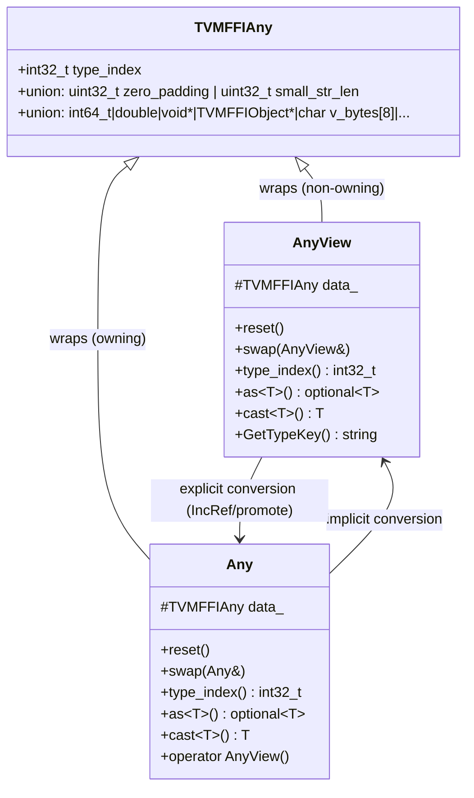

# Any/AnyView Value System

**TL;DR**
- `Any` (owning) and `AnyView` (non-owning) are type-erased value containers wrapping the 16-byte `TVMFFIAny` C struct, enabling functions to accept and return arbitrary types through a uniform interface.
- The `TypeTraits<T>` protocol defines how each C++ type converts to/from `Any`/`AnyView`, with 7 required methods per specialization. This is the central extensibility mechanism for adding new types to the FFI.
- `AnyView` is used for function arguments (zero-copy, non-owning), while `Any` is used for return values and storage (reference-counted ownership).

## Problem Statement

### Background
- A type-erased value system is essential for packed function calls: every argument and return value must fit in a uniform slot.
- The old TVM runtime used separate `TVMValue` + `type_code` pairs, requiring paired arrays and preventing containers like `Array<int>` (POD values could not be stored directly).
- Language bindings need predictable, fixed-size value representations that work across DLL boundaries.

### Solution
- A single 16-byte `TVMFFIAny` struct (defined in C ABI) stores both POD types and reference-counted object pointers.
- Two C++ wrappers: `AnyView` (non-owning, for arguments) and `Any` (owning, for storage/returns).
- The `TypeTraits<T>` template protocol defines per-type conversion logic, extensible by specialization.

### Goals
- **Goal**: Uniform representation for all FFI values (POD + objects) in 16 bytes.
- **Goal**: Zero-cost AnyView for argument passing; correct reference counting in Any for ownership.
- **Goal**: Extensible conversion protocol so new types can be added without modifying core code.
- **Non-goal**: `Any` is not a general-purpose `std::any` replacement; it is specifically designed for FFI value passing.

## Design



**Ownership semantics**:
- `AnyView`: Does NOT own referenced objects. No IncRef/DecRef. Cheap to create, pass, destroy. Used for function argument arrays.
- `Any`: OWNS referenced objects (when `type_index >= kTVMFFIStaticObjectBegin`). Copy increments refcount; move transfers ownership; destructor decrements refcount.
- **AnyView -> Any conversion**: Calls `InplaceConvertAnyViewToAny`, which: (a) IncRefs objects, (b) promotes `kTVMFFIRawStr` to owned `kTVMFFIStr`, (c) promotes `kTVMFFIByteArrayPtr` to owned `kTVMFFIBytes`, (d) moves `kTVMFFIObjectRValueRef` to owned object.
- **Any -> AnyView conversion**: Zero-cost `operator AnyView()` — just copies the `TVMFFIAny` data without any refcount change.

### Key Classes, Fields and Interfaces

**`AnyView`** — non-owning type-erased view:
```cpp
class AnyView {
protected:
  TVMFFIAny data_;
public:
  AnyView();                           // default: kTVMFFINone
  template<typename T> AnyView(const T& other);  // via TypeTraits<T>::CopyToAnyView
  void reset();                        // set to kTVMFFINone
  void swap(AnyView& other);
  int32_t type_index() const;
  template<typename T> std::optional<T> as() const;        // strict: CheckAnyStrict + CopyFromAnyViewAfterCheck
  template<typename T> std::optional<T> try_cast() const;  // coercing: TryCastFromAnyView
  template<typename T> T cast() const;                     // coercing: TryCastFromAnyView with TypeError on failure
  template<typename T> const T* as() const;            // shortcut for object pointer cast
  std::string GetTypeKey() const;
};
```

**`Any`** — owning type-erased value:
```cpp
class Any {
protected:
  TVMFFIAny data_;
public:
  Any();                                // default: kTVMFFINone
  ~Any();                               // DecRef if object
  Any(const Any& other);                // IncRef if object
  Any(Any&& other);                     // steal, null source
  Any(const AnyView& other);            // InplaceConvertAnyViewToAny
  template<typename T> Any(T other);    // via TypeTraits<T>::MoveToAny
  operator AnyView() const;             // zero-cost conversion
  void reset();                         // DecRef + set kTVMFFINone
  // as<T>() (strict), try_cast<T>() (coercing), cast<T>() same as AnyView
  // as<T>() also has rvalue-ref overload: std::optional<T> as() &&;
};
```

**`TypeTraits<T>` protocol** — 7 required methods per specialization:

| Method | Signature | Purpose |
|--------|-----------|---------|
| `CopyToAnyView` | `(const T&, TVMFFIAny*) -> void` | Non-owning store into AnyView slot |
| `MoveToAny` | `(T, TVMFFIAny*) -> void` | Owning store into Any slot |
| `CheckAnyStrict` | `(const TVMFFIAny*) -> bool` | Exact type match (no coercion). Used by `as<T>()`. |
| `CopyFromAnyViewAfterCheck` | `(const TVMFFIAny*) -> T` | Extract without ownership transfer |
| `MoveFromAnyAfterCheck` | `(TVMFFIAny*) -> T` | Extract with ownership transfer |
| `TryCastFromAnyView` | `(const TVMFFIAny*) -> optional<T>` | Coercing conversion (e.g., int->float). Used by `try_cast<T>()` and `cast<T>()`. |
| `TypeStr` | `() -> string` | Human-readable type name |

Optional method:
| `GetMismatchTypeInfo` | `(const TVMFFIAny*) -> string` | Detailed error info on cast failure |

**Static fields on TypeTraits**:
- `convert_enabled` (bool): Whether this type participates in FFI conversion.
- `storage_enabled` (bool): Whether this type can be stored in containers.
- `field_static_type_index` (int32_t): The type index used for reflection field annotations.

**Helper base classes for TypeTraits**:
- `TypeTraitsBase`: Provides default `convert_enabled=true`, `storage_enabled=true`, and default `GetMismatchTypeInfo`.
- `ObjectRefTypeTraitsBase<T>`: For ObjectRef subtypes. Provides CopyToAnyView/MoveToAny using object header manipulation, and TryCastFromAnyView using IsInstance check.
- `FallbackOnlyTraitsBase<T, FallbackTypes...>`: For types that only support conversion via a chain of fallback types (try each FallbackType in order).
- `ObjectRefWithFallbackTraitsBase<T, FallbackTypes...>`: Combines ObjectRef direct check with fallback conversion. Note: `String` and `Bytes` no longer use this base; they have custom `TypeTraits` specializations that handle dual type indices (small/large).

**Types with built-in TypeTraits specializations**:
`nullptr_t`, `bool`, `StrictBool`, all integral types (`int8_t` through `int64_t`, `uint8_t` through `uint64_t`), all floating-point types (`float`, `double`), `void*`, `DLDevice`, `DLTensor*`, `DLDataType`, `const char*`, `std::string`, `std::string_view`, all `ObjectRef` subtypes (via SFINAE + `ObjectRefTypeTraitsBase`), `Optional<T>`, `TypedFunction<FType>`.

### Contracts, Assumptions and Invariants
- **Size invariant**: `sizeof(Any) == sizeof(AnyView) == sizeof(TVMFFIAny) == 16`.
- **RawStr promotion**: `kTVMFFIRawStr` is allowed in `AnyView` but **never** in `Any`. The `AnyView -> Any` conversion automatically promotes raw strings to owned `String` objects.
- **Container storage invariant**: For `Array<T>`, every element satisfies `TypeTraits<T>::CheckAnyStrict(elem)`. This means the exact type matches (no coercion), enabling O(1) type validation of entire arrays.
- **Three-level access API**: `as<T>()` = strict check only (no coercion, returns `optional`), `try_cast<T>()` = coercing conversion (returns `optional`), `cast<T>()` = coercing conversion (throws on failure). This separates container invariant checking from function argument conversion. `Any::cast<T>()` is the sole FFI mechanism for type-erased value extraction -- the formerly-available `Downcast<T>(Any)` wrappers have been removed from FFI `cast.h` (commit `4be1af7`). The `ObjectRef`-to-`ObjectRef` `Downcast` overload was relocated outside FFI (to `node/`).
- **Coercion vs. exact match**: `TryCastFromAnyView` may apply coercion (e.g., int->float). `CheckAnyStrict` requires exact match. `as<T>()` uses strict check; `try_cast<T>()`/`cast<T>()` use coercion.
- **Thread safety**: Individual `Any`/`AnyView` values are NOT thread-safe. The underlying object's refcount uses atomic operations, but the `TVMFFIAny` struct itself must not be concurrently modified.

### Extension Points
- **New type specialization**: Add `TypeTraits<MyType>` to register any C++ type with the FFI system. Extend `TypeTraitsBase` for POD types, `ObjectRefTypeTraitsBase<T>` for object references.
- **Small-string optimization (implemented)**: Strings/bytes of 7 bytes or fewer are stored inline in `TVMFFIAny` using `kTVMFFISmallStr=11`/`kTVMFFISmallBytes=12` type indices, the `small_str_len` field for length, and `v_bytes` for content. See [0011-small-string-optimization.md](0011-small-string-optimization.md).
- **Custom allocators**: The `Any` -> `AnyView` promotion path for `kTVMFFIRawStr` creates `String` objects; different allocators could be plugged in at that level.
- **Custom AnyHash/AnyEqual via type attributes** (39d9b2b): Object types with `type_index >= kTVMFFIStaticObjectBegin` can register custom hash and equality functions through the `__any_hash__` and `__any_equal__` type attribute columns (registered via `TVMFFITypeRegisterAttr`). Each attribute accepts either a raw function pointer (`kTVMFFIOpaquePtr`, fast path with no FFI overhead) or an `ffi.Function` object (general path). `AnyHash` looks up `__any_hash__` column on first use (`static` local); `AnyEqual` does the same for `__any_equal__`. Without custom registration, Object keys use pointer-based identity comparison. This enables Object types as `Map` keys with value-based semantics. See [0008-containers.md](0008-containers.md) for Map key usage.

### Usage Examples

#### Type-erased value passing
**Context**: Storing and retrieving values of different types through a uniform container.
```cpp
// Store POD
Any val = 42;                        // TypeTraits<int>::MoveToAny
assert(val.type_index() == kTVMFFIInt);
assert(val.cast<int>() == 42);

// Store object
val = String("hello");              // TypeTraits<String>::MoveToAny -> IncRef
assert(val.cast<String>() == "hello");

// Coercion: int stored, float requested
val = 42;
auto opt = val.as<double>();         // TryCastFromAnyView applies int->double
assert(opt.has_value() && *opt == 42.0);

// Exact match vs coercion
Any int_val = 42;
assert(TypeTraits<int>::CheckAnyStrict(&int_val.CopyToTVMFFIAny()));     // true (exact)
assert(!TypeTraits<double>::CheckAnyStrict(&int_val.CopyToTVMFFIAny())); // false (different type)
// But conversion works:
assert(int_val.as<double>().has_value());  // true (coercion)
```

#### Defining TypeTraits for a new type
**Context**: Registering a custom POD-like type with the FFI value system.
```cpp
// For a custom type that maps to int64 storage:
template<>
struct TypeTraits<MyEnum> : public TypeTraitsBase {
  static constexpr int32_t field_static_type_index = TypeIndex::kTVMFFIInt;

  static void CopyToAnyView(const MyEnum& src, TVMFFIAny* result) {
    result->type_index = kTVMFFIInt;
    result->v_int64 = static_cast<int64_t>(src);
  }
  static void MoveToAny(MyEnum src, TVMFFIAny* result) {
    CopyToAnyView(src, result);  // POD: move == copy
  }
  static bool CheckAnyStrict(const TVMFFIAny* src) {
    return src->type_index == kTVMFFIInt;
  }
  static MyEnum CopyFromAnyViewAfterCheck(const TVMFFIAny* src) {
    return static_cast<MyEnum>(src->v_int64);
  }
  static std::optional<MyEnum> TryCastFromAnyView(const TVMFFIAny* src) {
    if (src->type_index == kTVMFFIInt) return static_cast<MyEnum>(src->v_int64);
    return std::nullopt;
  }
  static std::string TypeStr() { return "MyEnum"; }
};
```

## Alternatives & Trade-offs
### std::variant-based approach
- Pros: Compile-time type safety, no runtime dispatch overhead.
- Cons: Fixed set of types at compile time — cannot extend with runtime-registered object types. Does not work across DLL boundaries. The set of FFI types is open-ended (user-defined objects), ruling this out.

### Two-array calling convention (old TVMValue + type_code)
- Pros: Slightly smaller per-slot (8 bytes for value + 4 bytes for type code).
- Cons: Cannot store POD values directly in containers (`Array<int>` requires boxing). Requires paired iteration of two arrays. The 16-byte unified struct eliminates these problems at a small per-slot cost.

## Related Work
### Design Docs & ADRs
- [0001-c-abi-layer.md](.knowledge/designs/0001-c-abi-layer.md) — C ABI struct definitions that Any/AnyView wrap
- [0003-object-system.md](.knowledge/designs/0003-object-system.md) — Object/ObjectRef that Any can hold
- [0005-type-traits.md](.knowledge/designs/0005-type-traits.md) — Detailed TypeTraits protocol design
- [0001-unified-any-value.md](.knowledge/ADRs/0001-unified-any-value.md) — Decision to unify POD+object in one 16-byte slot

### Evidence Matrix
- Any/AnyView class definitions -> `2025-05-06-7d34eb8.md` + `any.h`
- TypeTraits protocol (7 methods) -> `2025-05-06-7d34eb8.md` + `type_traits.h`
- InplaceConvertAnyViewToAny promotion logic -> `any.h` lines 165-191
- Container storage invariant -> `type_traits.h` comment lines 60-65
- Built-in TypeTraits specializations -> `2025-05-06-7d34eb8.md` + `type_traits.h`
- Helper bases (ObjectRefTypeTraitsBase, FallbackOnlyTraitsBase) -> `2025-05-06-7d34eb8.md` + `type_traits.h`
- Downcast removal from FFI cast.h -> `2025-08-08-4be1af730567.md` + `cast.h`
- Custom AnyHash/AnyEqual via `__any_hash__`/`__any_equal__` type attribute columns -> `2026-02-15-39d9b2b400646be720e98f001353cc0d8d4b0234.md` (39d9b2b) + `any.h`
