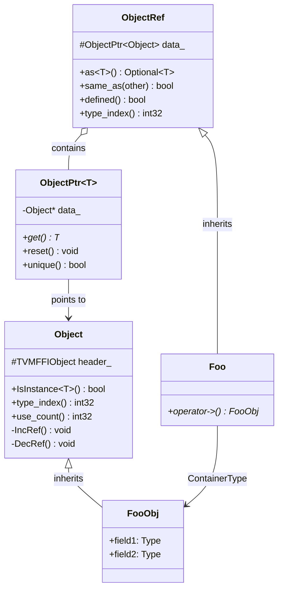

# Object System: Ref-Counted Type Hierarchy

**TL;DR**
- The Object system provides a ref-counted, type-safe hierarchy of heap-allocated values. Every object follows the pattern: `FooObj` (data class inheriting `Object`) + `Foo` (handle class inheriting `ObjectRef`) + `ObjectPtr<FooObj>` (intrusive smart pointer).
- Type registration uses macros (`TVM_FFI_DECLARE_OBJECT_INFO`, `TVM_FFI_DECLARE_OBJECT_INFO_FINAL`) that absorb `_type_key` as the first parameter and expand to static initializers calling `TVMFFIGetOrAllocTypeIndex`, populating a global type table at program startup.
- `IsInstance<T>()` uses a child-slot optimization for O(1) checking when types fit within reserved slots, with ancestor-depth fallback for overflow cases.

## Problem Statement

### Background
- A cross-language FFI needs a uniform way to represent heap objects with automatic lifetime management.
- Type checking must work at runtime across language boundaries (C++ object created, passed to Python, checked in Rust).
- The system must support both a fixed set of built-in types (String, Array, Function) and user-defined types registered at runtime.

### Solution
- Define `Object` as the universal base class containing a `TVMFFIObject` header (type_index, ref_counter, deleter).
- Provide `ObjectPtr<T>` as an intrusive smart pointer that calls `IncRef`/`DecRef` on copy/destroy.
- Provide `ObjectRef` as the user-facing handle wrapper (similar to `shared_ptr` but based on intrusive counting).
- Type registration macros wire up each type with the global type table at static init time.

### Goals
- O(1) IsInstance for common cases (child-slot optimization).
- Zero overhead for final types (single equality comparison).
- Support for nullable and non-nullable references.
- Non-goal: Multiple inheritance (the hierarchy is a single-inheritance tree).

## Design



### Key Classes, Fields and Interfaces

```python
class Object:
    """Base of all ref-counted heap objects. Contains the TVMFFIObject header."""
    header_: TVMFFIObject   # combined_ref_count (uint64), type_index, __padding, deleter (24 bytes)
    # Invariant: strong count = header_.combined_ref_count & 0xFFFFFFFF, managed atomically
    # Invariant: weak count = (header_.combined_ref_count >> 32) & 0xFFFFFFFF
    # Invariant: weak count >= 1 while strong refs exist (implicit weak ref)
    # Invariant: header_.deleter is set by make_object<T>, called with flags on count transitions

    _type_key: str = "ffi.Object"     # Renamed from "object.Object"
    _type_index: int = kTVMFFIObject   # 64
    _type_final: bool = False
    _type_child_slots: int = 0
    _type_child_slots_can_overflow: bool = True
    _type_depth: int = 0
    _type_mutable: bool = False        # Opt-in for mutable pointer extraction from Any/AnyView
    _type_s_eq_hash_kind: TVMFFISEqHashKind = Unsupported  # Structural comparison semantics

    def IsInstance(self, TargetType: type) -> bool: ...
        # For final types: type_index == TargetType.RuntimeTypeIndex()
        # For base types with child_slots:
        #   check type_index in [target, target + child_slots + 1)
        # Fallback: lookup type_ancestors[TargetType._type_depth] in type table
        # Interacts with: TVMFFIGetTypeInfo (global type table), TVMFFITypeInfo.type_ancestors

    def type_index(self) -> int32: ...
    def use_count(self) -> uint64: ...
        # Returns atomic_load(combined_ref_count) & 0xFFFFFFFF (strong count)
        # Return type widened from int32 to uint64 (43d13e8)

    def IncRef(self) -> None: ...    # Atomic add 1 to combined_ref_count (relaxed)
        # kCombinedRefCountStrongOne == 1, so adding 1 increments strong count
    def DecRef(self) -> None: ...    # Single-atomic fast path for common case (43d13e8)
        # count_before = atomic_sub(combined_ref_count, kCombinedRefCountStrongOne)
        # if count_before == kCombinedRefCountBothOne:
        #   -> fast path: both strong=1, weak=1 -> ONE atomic op + deleter(self, kBoth)
        # elif (count_before & mask) == kCombinedRefCountStrongOne:
        #   -> strong reaches 0, weak still alive
        #   -> deleter(self, kStrong), then atomic_sub(combined, kCombinedRefCountWeakOne)
        #   -> if that also reaches 0: deleter(self, kWeak)
        # Interacts with: ObjectPtr copy/move/destruct, WeakObjectPtr
    def IncWeakRef(self) -> None: ...    # Atomic add kCombinedRefCountWeakOne (1<<32) to combined_ref_count
    def DecWeakRef(self) -> None: ...    # Atomic sub kCombinedRefCountWeakOne; if zero: deleter(self, kWeak)
    def TryPromoteWeakPtr(self) -> bool: ...
        # CAS loop on combined_ref_count: checks lower 32 bits > 0,
        # increments by kCombinedRefCountStrongOne
        # Returns True if promotion succeeded, False if object is expired
        # Interacts with: WeakObjectPtr.lock()

class ObjectPtr(Generic[T]):
    """Intrusive smart pointer. Manages Object lifetime via IncRef/DecRef."""
    data_: Object  # raw pointer, nullable
    # Invariant: if data_ != nullptr, data_ has been IncRef'd by this ptr
    # Interacts with: Object.IncRef (on copy), Object.DecRef (on destroy/reset)

    def get(self) -> T: ...
    def reset(self) -> None: ...     # DecRef + set nullptr
    def unique(self) -> bool: ...    # use_count == 1
    def swap(self, other: ObjectPtr[T]) -> None: ...
    # Extension: works with any Object subclass via static_cast

class ObjectRef:
    """User-facing handle. Non-nullable by default, nullable via _type_is_nullable."""
    data_: ObjectPtr[Object]
    _type_is_nullable: bool = True    # Can be overridden to False

    def as(self, ObjectType: type) -> Optional[ObjectType]: ...
        # For Object subclasses: returns raw pointer if IsInstance succeeds
        # For ObjectRef subclasses: returns Optional<ObjectRefType>
        # Interacts with: Object.IsInstance<ContainerType>

    def same_as(self, other: ObjectRef) -> bool: ...  # Pointer identity
    def defined(self) -> bool: ...                     # data_ != nullptr
    def type_index(self) -> int32: ...                 # kTVMFFINone if undefined
    # Extension: subclass with TVM_FFI_DEFINE_OBJECT_REF_METHODS

class WeakObjectPtr(Generic[T]):
    """Weak smart pointer for Object. Does not prevent destruction, only keeps memory alive.
    Analogous to std::weak_ptr but uses the intrusive weak_ref_count in TVMFFIObject header."""
    data_: Object  # raw pointer, nullable

    def __init__(self, other: Union[ObjectPtr[T], WeakObjectPtr[T], None]): ...
        # Increments weak_ref_count (NOT strong_ref_count)
    def lock(self) -> Optional[ObjectPtr[T]]: ...
        # CAS-based promotion: atomically increments strong_ref_count only if > 0
        # Returns ObjectPtr if still alive, None if expired
        # Interacts with: Object.TryPromoteWeakPtr (CAS loop)
    def expired(self) -> bool: ...
        # True if data_ is None or strong_ref_count == 0
    def reset(self) -> None: ...
        # Decrements weak_ref_count, may trigger memory free
    def use_count(self) -> int: ...
        # Returns strong_ref_count (0 if expired)
    # Invariant: holding a WeakObjectPtr keeps memory block alive but object may be destructed
    # Invariant: lock() is the ONLY safe way to obtain a strong reference from a weak one
    # Extension: supports polymorphic construction (WeakObjectPtr<Base> from ObjectPtr<Derived>)
    # Interacts with: ObjectPtr<T> (bidirectional friend), Object.IncWeakRef/DecWeakRef

# Macro expansion (pseudocode for TVM_FFI_DECLARE_OBJECT_INFO(TypeKey, TypeName, ParentType)):
#   static constexpr const char* _type_key = TypeKey     # absorbed into macro (a08fa6e)
#   TVM_FFI_DECLARE_OBJECT_INFO_PREDEFINED_TYPE_KEY(TypeName, ParentType):
#     static constexpr int32_t _type_depth = ParentType._type_depth + 1
#     static int32_t _GetOrAllocRuntimeTypeIndex():
#         static_assert(!ParentType._type_final)
#         type_key = TVMFFIByteArray{TypeName._type_key, len(TypeName._type_key)}
#         static tindex [[maybe_unused]] = TVMFFIGetOrAllocTypeIndex(
#             type_key, -1, TypeName._type_depth,
#             TypeName._type_child_slots,
#             TypeName._type_child_slots_can_overflow,
#             ParentType._GetOrAllocRuntimeTypeIndex())
#         return TypeName._type_index           # returns compile-time constant (9ac3121)
#     static int32_t RuntimeTypeIndex() = _GetOrAllocRuntimeTypeIndex()
#     # NOTE: static inline _type_index auto-registration REMOVED (9ac3121)
#     # Must explicitly register via ObjectDef<T>() for IsInstance to work
#
# TVM_FFI_DECLARE_OBJECT_INFO_FINAL(TypeKey, TypeName, ParentType):
#   static constexpr int _type_child_slots = 0
#   static constexpr bool _type_final = True
#   TVM_FFI_DECLARE_OBJECT_INFO(TypeKey, TypeName, ParentType)
#
# TVM_FFI_DECLARE_OBJECT_INFO_STATIC(TypeKey, TypeName, ParentType):
#   static constexpr int32_t _type_depth = ParentType._type_depth + 1
#   static int32_t _GetOrAllocRuntimeTypeIndex(): ...
#   static int32_t RuntimeTypeIndex() { return TypeName._type_index; }
#   static constexpr const char* _type_key = TypeKey
#   # NOTE: TVM_FFI_REGISTER_STATIC_TYPE_INFO REMOVED (9ac3121)
#   # Built-in depth-1 types are now pre-registered in TypeTable constructor
#   # via ReserveDepthOneObjectTypeIndex

# Macro expansion (pseudocode for TVM_FFI_DEFINE_OBJECT_REF_METHODS_NULLABLE(TypeName, ParentType, ObjName)):
#   TypeName() = default
#   explicit TypeName(ObjectPtr<ObjName> n) : ParentType(n) {}
#   explicit TypeName(UnsafeInit tag) : ParentType(tag) {}
#   TVM_FFI_DEFINE_DEFAULT_COPY_MOVE_AND_ASSIGN(TypeName)
#   using __PtrType = std::conditional_t<ObjName::_type_mutable, ObjName*, const ObjName*>
#   __PtrType operator->() const { return static_cast<__PtrType>(data_.get()); }
#   __PtrType get() const { return static_cast<__PtrType>(data_.get()); }
#   static constexpr bool _type_is_nullable = true
#   using ContainerType = ObjName
#   # Interacts with: ObjName::_type_mutable (auto-selects const vs non-const via conditional_t)
#   # Replaces both old OBJECT_REF_METHODS and MUTABLE_OBJECT_REF_METHODS (a08fa6e)
#
# TVM_FFI_DEFINE_OBJECT_REF_METHODS_NOTNULLABLE(TypeName, ParentType, ObjName):
#   explicit TypeName(UnsafeInit tag) : ParentType(tag) {}
#   TVM_FFI_DEFINE_DEFAULT_COPY_MOVE_AND_ASSIGN(TypeName)
#   using __PtrType = std::conditional_t<ObjName::_type_mutable, ObjName*, const ObjName*>
#   __PtrType operator->() const { return static_cast<__PtrType>(data_.get()); }
#   __PtrType get() const { return static_cast<__PtrType>(data_.get()); }
#   static constexpr bool _type_is_nullable = false
#   using ContainerType = ObjName
#   # Replaces both old NOTNULLABLE and MUTABLE_NOTNULLABLE macros (a08fa6e)

class UnsafeInit:
    """Empty struct tag requesting unsafe null initialization of an ObjectRef.
    Each ObjectRef subclass gets an explicit constructor taking UnsafeInit via the macros.
    Only used in controlled internal FFI plumbing (not user code)."""
    pass
    # Invariant: constructing ObjectRef(UnsafeInit{}) sets data_ = nullptr
    # Interacts with: ObjectUnsafe.ObjectRefFromObjectPtr (the primary consumer)
    # Extension: reflection uses ObjectCreatorUnsafeInit<T> for non-default-constructible types

class ObjectUnsafe:
    """details namespace utility for controlled ObjectRef construction."""
    @staticmethod
    def ObjectRefFromObjectPtr(ptr: ObjectPtr[Object]) -> T:
        """Construct any ObjectRef T from an ObjectPtr via UnsafeInit + data_ assignment.
        Two overloads: const-ref (copy) and rvalue-ref (move)."""
        # T ref(UnsafeInit{})
        # ref.data_ = ptr (or std::move(ptr))
        # return ref
        # Interacts with: ObjectRef friendship with ObjectUnsafe
        # Interacts with: TypeTraits CopyFromAnyViewAfterCheck, MoveFromAnyAfterCheck, TryCastFromAnyView
    @staticmethod
    def ObjectPtrFromOwned(ptr: T) -> ObjectPtr[T]:
        """Wrap a raw owned pointer into an ObjectPtr (no IncRef)."""
        ...

# (Static object info macro is now TVM_FFI_DECLARE_OBJECT_INFO_STATIC, documented above)

def make_object(T: type, *args) -> ObjectPtr[T]:
    """Allocate an object of type T using details::SimpleObjAllocator."""
    # 1. Allocate raw memory via AlignedAlloc<alignof(T)>(sizeof(T)) (6fb42a7)
    # 2. Placement-new T with args
    # 3. Set header: combined_ref_count=kCombinedRefCountBothOne=(1<<32)|1,
    #    type_index=T.RuntimeTypeIndex(), __padding=0, deleter=Deleter_<T>
    # 4. Return ObjectPtr<T> that takes ownership (no additional IncRef)
    # Interacts with: details::AlignedAlloc, details::AlignedFree, Handler<T>.Deleter
    # Invariant: returned ObjectPtr has use_count == 1
    # Extension: details::ObjAllocatorBase<Derived> CRTP allows custom allocators
```

### Contracts, Assumptions and Invariants
- **Single inheritance tree**: No multiple inheritance. `type_ancestors[depth]` uniquely identifies the ancestor at each depth.
- **Static init registration**: Every concrete Object type registers itself in the global type table exactly once during static initialization, before `main()`.
- **Two-phase deletion**: When strong_ref_count reaches 0, `deleter(self, kStrong)` destroys the object. When weak_ref_count reaches 0, `deleter(self, kWeak)` frees memory. When both reach 0 simultaneously (no weak refs, the common case), `deleter(self, kBoth)` does both in one call.
- **Implicit weak ref**: `make_object` initializes `combined_ref_count = kCombinedRefCountBothOne` (both strong=1, weak=1). The implicit weak count is decremented when strong count reaches 0, so if no WeakObjectPtr exists, memory is freed immediately.
- **Ref-count atomicity**: All ref-count operations work on the single `combined_ref_count: uint64` field. `IncRef` adds `kCombinedRefCountStrongOne` (==1). `DecRef` subtracts it and uses release-acquire to ensure visibility of all writes before destruction. The common-case `DecRef` fast path (both counts are 1) requires a single atomic subtract + comparison against `kCombinedRefCountBothOne`, then calls `deleter(self, kBoth)` -- one atomic operation total (43d13e8).
- **Final type optimization**: For types marked `_type_final = true`, `IsInstance` is a single integer comparison.
- **Child-slot range**: For non-final types with `_type_child_slots = N`, `IsInstance` checks `type_index in [target, target + N + 1)` in O(1). If the actual number of subtypes exceeds N, the overflow bit (`_type_child_slots_can_overflow`) allows falling back to the ancestor-depth lookup at O(depth) cost.

### Extension Points
- **User-defined object types**: Create `FooObj : Object` with `TVM_FFI_DECLARE_OBJECT_INFO_FINAL("my.Foo", FooObj, Object)`, then `Foo : ObjectRef` with `TVM_FFI_DEFINE_OBJECT_REF_METHODS_NULLABLE(Foo, ObjectRef, FooObj)`. Register reflection via `ObjectDef<FooObj>()` inside `TVM_FFI_STATIC_INIT_BLOCK() { ... }`.
- **Type key namespace**: Built-in types use `"ffi.*"` prefix (e.g., `"ffi.Object"`, `"ffi.Array"`), centralized in `StaticTypeKey` constants. User types should use their own prefix.
- **Custom allocators**: Subclass `details::ObjAllocatorBase<Derived>` with a `Handler<T>` template that provides `New` and `Deleter` methods. Arena allocators set `deleter = nullptr` for arena-managed objects.
- **Non-nullable refs**: Use `TVM_FFI_DEFINE_OBJECT_REF_METHODS_NOTNULLABLE` to set `_type_is_nullable = false`.
- **Mutable refs**: Set `_type_mutable = true` on the Obj class; the ref macros auto-select non-const `operator->` via `std::conditional_t` (a08fa6e).

### Usage Examples

#### Defining a new Object type with reflection
**Context**: Defining a new C++ object type that is accessible from Python via field reflection.

```cpp
// Step 1: Define the data class (Obj pattern, _type_key absorbed into macro)
class MyNodeObj : public Object {
 public:
  int64_t value;
  String name;
  TVM_FFI_DECLARE_OBJECT_INFO_FINAL("my.Node", MyNodeObj, Object);
};

// Step 2: Register fields for cross-language reflection
TVM_FFI_STATIC_INIT_BLOCK() {
  tvm::ffi::reflection::ObjectDef<MyNodeObj>()
      .def_ro("value", &MyNodeObj::value)
      .def_rw("name", &MyNodeObj::name);
}

// Step 3: Define the handle class (Ref pattern, auto-selects const via _type_mutable)
class MyNode : public ObjectRef {
 public:
  TVM_FFI_DEFINE_OBJECT_REF_METHODS_NULLABLE(MyNode, ObjectRef, MyNodeObj);
};

// Step 4: Create and use
auto obj = make_object<MyNodeObj>();  // ref_counter=1, type_index=dynamic
obj->value = 42;
obj->name = String("hello");
MyNode ref(std::move(obj));          // wrap in handle

// Type check and downcast
ObjectRef generic = ref;
if (auto* node = generic.as<MyNodeObj>()) {
    assert(node->value == 42);  // O(1) IsInstance for final types
}
```

#### Using WeakObjectPtr to observe without preventing destruction
**Context**: Creating a weak reference to avoid prevent reference cycles or to observe an object without preventing its destruction.

```cpp
// Create a strong reference
ObjectPtr<TIntObj> strong = make_object<TIntObj>(42);
// strong_ref_count=1, weak_ref_count=1 (implicit)

// Create a weak reference (increments weak_ref_count only)
WeakObjectPtr<TIntObj> weak(strong);
// strong_ref_count=1, weak_ref_count=2

// Promote weak -> strong via CAS-based lock()
if (ObjectPtr<TIntObj> locked = weak.lock()) {
    assert(locked->value == 42);
    assert(strong.use_count() == 2);  // strong + locked
}

// After all strong refs die, object is destructed but memory stays
strong.reset();
// strong_ref_count=0 -> ~TIntObj() called, weak_ref_count decremented to 1
assert(weak.expired());
assert(weak.lock() == nullptr);  // promotion fails

// Memory freed when last WeakObjectPtr is destroyed
// weak goes out of scope -> weak_ref_count=0 -> memory freed
```

## Alternatives & Trade-offs

### Non-intrusive ref counting (like shared_ptr)
- Pros: No base class requirement, works with any type
- Cons: Separate control block allocation, extra indirection, cannot share ref-count across C ABI (the control block layout is not standardized)

### Virtual method dispatch for type checking
- Pros: Standard C++ pattern, no global type table
- Cons: vtable pointer adds 8 bytes to every object, `dynamic_cast` is slow and not portable across DLL boundaries, no support for cross-language type checking

## Related Work
### Design Docs & ADRs
- [0001-c-abi.md](../designs/0001-c-abi.md) -- The C ABI layer (TVMFFIObject header layout)
- [0003-any-system.md](../designs/0003-any-system.md) -- How objects are stored in Any values
- [0008-reflection.md](../designs/0008-reflection.md) -- Field reflection built on top of objects
- [ADR 0003](../ADRs/0003-child-slot-type-checking.md) -- Decision for child-slot IsInstance optimization
- [ADR 0009](../ADRs/0009-weak-reference-counting.md) -- Decision to add weak reference counting

### Evidence Matrix
- Object/ObjectRef/ObjectPtr pattern, macros -> `commits/2025-05-06-7d34eb8abfe987bf0031e4d4ff479895d867a966.md` (7d34eb8)
- DecRef optimization (split release/acquire) -> `commits/2025-06-18-d5209f0ce34d1f7c20c6cdc10cbc8445facb85e5.md` (d5209f0)
- `ffi.*` type key namespace, StaticTypeKey constants -> `commits/2025-07-01-0966c368b097ec1b89e459a550716674198ac1d4.md` (0966c36)
- `_type_mutable` and `_type_s_eq_hash_kind` additions -> `commits/2025-06-15-1a856886c8c14c6271e156d1ce4d76335d42f0ff.md` (1a85688), `commits/2025-07-19-9445fe734839cffc8bdf881788528b7763f7be03.md` (9445fe7)
- `tvm::` namespace re-exports fully retired: all re-exports (`tvm::make_object`, `tvm::GetRef`, `tvm::GetObjectPtr`, `tvm::Array`, `tvm::Map`, `tvm::Variant`, `tvm::Optional`, `tvm::String`, `tvm::Bytes`) removed -> `commits/2025-09-08-e9d29465ff70c5adcd5c551a69695922d8b03ea6.md` (e9d2946). All FFI types live exclusively in `tvm::ffi::`.
- WeakObjectPtr, two-phase deletion, TryPromoteWeakPtr, TVMFFIObjectDeleterFlagBitMask, strong_ref_count/weak_ref_count -> `commits/2025-09-01-ca9c3d10bb9640bffb972302f7064e49e592a526.md` (ca9c3d1)
- `UnsafeInit` tag, typed `ObjectPtr<ContainerType>` in macros, `ObjectUnsafe::ObjectRefFromObjectPtr`, `ObjectCreatorUnsafeInit` -> `commits/2025-09-08-472e10c4086e91fb788ffe1f0eee10df4bcf5db2.md` (472e10c)
- `FObjectDeleter` void* parameter, `details::SimpleObjAllocator` namespace move, Doxygen docs -> `commits/2025-09-07-24125d0ac466beb67965c1dd9ae23f2a71f424ad.md` (24125d0)
- Macro rename: 7 macros -> 5, `_type_key` absorbed, `std::conditional_t` mutability -> `commits/2025-09-09-a08fa6eb0d7a67de9f5a4354d9a1fe41c0dfa806.md` (a08fa6e)
- `TVM_FFI_STATIC_INIT_BLOCK` refactor: expression-body -> function-body, `__attribute__((constructor))` -> `commits/2025-09-13-7b813f8bc6a548d9aebb24ec5d19c0aa8b89c6a7.md` (7b813f8)
- Combined ref-count packing, single-atomic DecRef fast path, use_count -> uint64 -> `commits/2025-09-26-43d13e86ee24d1558f929e3b0faa3182ca1af872.md` (43d13e8)
- AlignedAlloc/AlignedFree replaces new/delete in SimpleObjAllocator -> `commits/2025-09-27-6fb42a77b1a4087e74918383e54cdecd88e50f54.md` (6fb42a7)
- Plus 3 supporting commits for namespace cleanup and legacy marker removal
