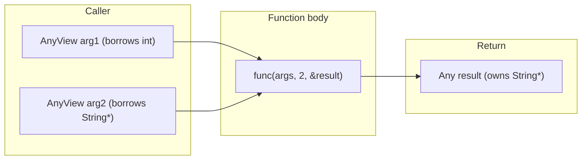

# Any/AnyView: Type-Erased Value System

**TL;DR**
- `AnyView` (non-owning) and `Any` (owning) are C++ wrappers around the 16-byte `TVMFFIAny` layout. They serve as the universal value type for the FFI: every function argument is an `AnyView`, every return value is an `Any`.
- `AnyView` can hold raw C strings (`kTVMFFIRawStr`), but assigning to `Any` auto-promotes raw strings to owned `String` objects. This "RawStr promotion" invariant ensures `Any` always owns its data.
- Conversion between concrete C++ types and Any/AnyView is governed by the `TypeTraits<T>` protocol (see [0006-type-traits.md](../designs/0006-type-traits.md)).

## Problem Statement

### Background
- A type-erased value container is needed so that function arguments and return values can carry any type (int, float, String, Array, etc.) without compile-time knowledge of the type.
- The container must be exactly 16 bytes to match the C ABI `TVMFFIAny` layout.
- Two ownership semantics are needed: borrowed (for function arguments, which are caller-owned) and owned (for return values and stored values).

### Solution
- `AnyView`: Non-owning view over a `TVMFFIAny`. Cheaply constructed from any value (no ref-counting on construction). Used for function arguments.
- `Any`: Owning container. Ref-counts objects on copy, decrements on destroy. Used for return values and storage.
- Both share the same 16-byte memory layout, enabling zero-copy `reinterpret_cast` between the C and C++ layers.

### Goals
- 16-byte layout matching `TVMFFIAny` exactly.
- Type-safe extraction via `cast<T>()` with clear error messages on mismatch.
- Automatic RawStr-to-String promotion on Any assignment.
- Small-string optimization (SSO) is implemented: strings <=7 bytes are stored inline in `TVMFFIAny.v_bytes` with type_index `kTVMFFISmallStr`. The `zero_padding`/`small_str_len` union field holds the length. `AnyHash`/`AnyEqual` treat small and heap strings as semantically equivalent. `Any::same_as` compares the `zero_padding` field.

## Design



### Key Classes, Fields and Interfaces

```python
class AnyView:
    """Non-owning type-erased value reference. Layout == TVMFFIAny (16 bytes)."""
    # Memory: reinterpret_cast<TVMFFIAny*>(this)
    # Invariant: sizeof(AnyView) == 16
    # Invariant: does NOT call IncRef/DecRef on construction or destruction

    def __init__(self, value: T) -> None: ...
        # Dispatches to TypeTraits<T>.CopyToAnyView(value, self)
        # Interacts with: TypeTraits<T> (compile-time protocol)

    def type_index(self) -> int32: ...
        # Returns the type_index field of the underlying TVMFFIAny

    def cast(self, T: type) -> T: ...
        # 1. Try TypeTraits<T>.TryCastFromAnyView(self) (renamed from TryConvertFromAnyView)
        # 2. On failure: throw TypeError with "expected T, got <actual_type>"
        # Invariant: throws if type mismatch, never returns garbage
        # Interacts with: TypeTraits<T>.TryCastFromAnyView, TypeTraits<T>.TypeStr

    def as(self, T: type) -> Optional[T]: ...
        # STRICT check only: CheckAnyStrict + CopyFromAnyViewAfterCheck
        # Returns None if stored type does not exactly match T (NO implicit conversion)
        # Interacts with: TypeTraits<T>.CheckAnyStrict

    def try_cast(self, T: type) -> Optional[T]: ...
        # Conversion-allowing: calls TryCastFromAnyView (may widen int->float)
        # This is the old as<T>() behavior
        # Interacts with: TypeTraits<T>.TryCastFromAnyView

    @staticmethod
    def CopyFromTVMFFIAny(src: TVMFFIAny) -> AnyView: ...
        # Zero-cost reinterpret: they share the same layout

class Any:
    """Owning type-erased value. Layout == TVMFFIAny (16 bytes)."""
    # Memory: reinterpret_cast<TVMFFIAny*>(this)
    # Invariant: sizeof(Any) == 16
    # Invariant: if type_index >= kTVMFFIStaticObjectBegin, holds a ref-counted pointer
    # Invariant: type_index is NEVER kTVMFFIRawStr (auto-promoted to String)

    def __init__(self, value: T) -> None: ...
        # Dispatches to TypeTraits<T>.MoveToAny(value, self)
        # If T is const char* (RawStr), promotes to String automatically
        # Interacts with: TypeTraits<T> (compile-time protocol)

    def cast(self, T: type) -> T: ...
        # Lvalue path: TypeTraits<T>.TryConvertFromAnyView(self)
        # Rvalue path (after std::move): TypeTraits<T>.MoveFromAnyStorageAfterCheck(self)
        #   The rvalue path moves the object out without extra ref-count bump
        # Interacts with: TypeTraits<T> protocol
        # Invariant: rvalue cast resets self to None after extraction

    def reset(self) -> None: ...
        # If holding an object (type_index >= 64): DecRef the object pointer
        # Then set type_index = kTVMFFINone
        # Interacts with: Object.DecRef

    def __del__(self) -> None: ...
        # Calls reset()

    def __assign__(self, other: Any) -> None: ...
        # Move assignment: reset current, take other's storage, null other

    def __assign__(self, value: T) -> None: ...
        # Reset current, then MoveToAny(value, self)
        # Interacts with: TypeTraits<T>.MoveToAny
```

#### AnyHash / AnyEqual with per-type dispatch (39d9b2b)

```python
class AnyHash:
    """String-aware Any hash functor with customizable per-type dispatch."""
    def __call__(self, src: Any) -> uint64:
        # 1. SmallStr/SmallBytes: normalize to Str/Bytes type_index for consistent hashing
        # 2. Str/Bytes: hash content via StableHashBytes
        # 3. Object types (type_index >= kTVMFFIStaticObjectBegin):
        #    a. Look up __any_hash__ TypeAttrColumn for this type_index
        #    b. If found as kTVMFFIOpaquePtr: call via raw function pointer (fast path)
        #    c. If found as Function: call via packed function call (slow path)
        #    d. If not found: fall back to StableHashCombine(type_index, pointer)
        # 4. POD types: StableHashCombine(type_index, v_int64)
        # Interacts with: TVMFFITypeAttrColumn("__any_hash__"), type_attr registration
        # Extension: register __any_hash__ on any Object type for value-based hashing in Dict/Map

class AnyEqual:
    """String-aware Any equal functor with customizable per-type dispatch."""
    def __call__(self, lhs: Any, rhs: Any) -> bool:
        # 1. Fast path: byte-wise equality of 16-byte TVMFFIAny (handles all POD and same-pointer)
        # 2. Same type_index: handle Str/Bytes content comparison
        # 3. Object types with same type_index:
        #    a. Look up __any_equal__ TypeAttrColumn for this type_index
        #    b. If found as kTVMFFIOpaquePtr: call via raw function pointer (fast path)
        #    c. If found as Function: call via packed function call (slow path)
        #    d. If not found: fall back to pointer identity (already handled by fast path)
        # 4. Cross-type string comparison (SmallStr vs Str, SmallBytes vs Bytes)
        # Interacts with: TVMFFITypeAttrColumn("__any_equal__"), type_attr registration
        # Extension: register __any_equal__ on any Object type for value-based equality in Dict/Map

# Type attribute convention for custom hash/equal:
# refl::TypeAttrDef<MyTypeObj>()
#     .attr("__any_hash__", reinterpret_cast<void*>(&MyType::CustomAnyHash))   # fast path
#     .attr("__any_equal__", reinterpret_cast<void*>(&MyType::CustomAnyEqual))  # fast path
# Supports: void* (kTVMFFIOpaquePtr, fast) or ffi.Function (generic, slow)

# Moved utility functions (39d9b2b):
# MoveFromSafeCallRaised / SetSafeCallRaised moved from function_details.h to error.h
# for broader reuse by AnyHash/AnyEqual error handling paths.
```

### Contracts, Assumptions and Invariants
- **Layout identity**: `sizeof(AnyView) == sizeof(Any) == sizeof(TVMFFIAny) == 16`. The C++ types are layout-compatible with the C struct, enabling `reinterpret_cast` at the C/C++ boundary.
- **RawStr auto-promotion**: When a `const char*` is assigned to `Any`, it is automatically converted to an owned `String` object. This ensures `Any` always fully owns its data and prevents dangling pointer bugs.
- **DLTensor* cannot be stored in Any**: `TypeTraits<DLTensor*>::MoveToAny` throws `RuntimeError` because `DLTensor*` does not retain ownership. Use `NDArray` for owned tensor storage.
- **Rvalue cast optimization**: `std::move(any).cast<T>()` moves the object out of `Any` without incrementing and then decrementing the ref count, saving two atomic operations.
- **Strict `as` vs conversion-allowing `cast`/`try_cast`**: `as<float>()` on an `Any` holding an `int` returns `nullopt` (strict check via `CheckAnyStrict`). `cast<float>()` and `try_cast<float>()` succeed because `TryCastFromAnyView` handles int-to-float widening. This distinction prevents accidental implicit conversions in type-checking contexts.
- **AnyHash/AnyEqual custom dispatch** (39d9b2b): When a custom `__any_hash__` or `__any_equal__` is registered for a type_index, `AnyHash`/`AnyEqual` dispatch to it for objects of that type before falling back to default behavior. The dispatch uses `static const TVMFFITypeAttrColumn*` for the column lookup (cached once per function instantiation). Errors raised inside custom hash/equal are propagated via `MoveFromSafeCallRaised`/`SetSafeCallRaised` (moved from `function_details.h` to `error.h` for reuse).

### Extension Points
- **New type support**: Specialize `TypeTraits<T>` to enable any C++ type for storage in `Any`/`AnyView`. Implement `CopyToAnyView`, `MoveToAny`, `CheckAnyStrict`, `TryCastFromAnyView`, and `TypeStr`.
- **Small-string optimization (SSO) is implemented**: Strings <=7 bytes are stored inline in `TVMFFIAny.v_bytes` with `type_index = kTVMFFISmallStr` and `small_str_len` holding the length. Bytes similarly use `kTVMFFISmallBytes`. The `zero_padding` slot must be 0 for all other type indices. Hash and equality are representation-transparent: `StableHashSmallStrBytes` ensures `hash(small_str("x")) == hash(heap_str("x"))`. `AnyHash` normalizes `kTVMFFISmallStr` keys to `kTVMFFIStr` before hashing; `AnyEqual` handles cross-type comparison.
- **Customizable AnyHash/AnyEqual via type attribute columns** (39d9b2b): Object types can register custom hash and equality functions via `__any_hash__` and `__any_equal__` type attribute columns. When registered, `AnyHash`/`AnyEqual` dispatch to the custom implementation before falling back to pointer/int comparison. Two dispatch paths are supported: (a) **fast path** via `kTVMFFIOpaquePtr` -- stores a raw function pointer for zero-overhead invocation; (b) **slow path** via `ffi.Function` -- a general callable. The `__any_hash__`/`__any_equal__` columns are pre-created at startup in `container.cc`.

### Usage Examples

#### Type-erased value storage and extraction
**Context**: Storing and retrieving values of different types in the universal container.

```cpp
// Store POD values (no heap allocation)
Any val = 42;                       // type_index = kTVMFFIInt, v_int64 = 42
Any fval = 3.14;                    // type_index = kTVMFFIFloat, v_float64 = 3.14
Any bval = true;                    // type_index = kTVMFFIBool, v_int64 = 1

// Store objects (ref-counted)
Any str = String("hello");          // type_index = kTVMFFIStr, v_obj = String*

// Extract with type checking
int x = val.cast<int>();            // exact match
double d = val.cast<double>();      // implicit int->double conversion

// Optional extraction (no throw)
auto opt = val.as<String>();        // returns std::nullopt (int is not String)

// Rvalue extraction (move optimization)
String s = std::move(str).cast<String>();  // moves out, str is now None

// AnyView for function arguments (non-owning)
AnyView view = 42;                  // lightweight, no ref-counting
int y = view.cast<int>();           // same API as Any
```

#### Registering custom AnyHash/AnyEqual for value-based Dict keys
**Context**: Making a custom integer object type usable as a Dict key with value-based (not pointer-based) hashing and equality (39d9b2b).

```cpp
// Register custom hash/equal for TIntObj
refl::TypeAttrDef<TIntObj>()
    .attr("__any_hash__", reinterpret_cast<void*>(&TInt::CustomAnyHash))    // fast path (void*)
    .attr("__any_equal__", reinterpret_cast<void*>(&TInt::CustomAnyEqual));  // fast path (void*)

// Now Dict<Any, Any> uses value-based hashing/equality for TInt keys
Dict<Any, Any> d;
d.Set(TInt(7), String("seven"));
assert(d.at(TInt(7)).cast<String>() == "seven");
// Two distinct TInt(7) objects hash/compare as equal (not pointer identity)
```

## Alternatives & Trade-offs

### std::any / std::variant
- Pros: Standard C++ types, well-understood semantics
- Cons: `std::any` uses heap allocation for large types (not 16-byte fixed), has no cross-language ABI guarantee. `std::variant` requires knowing all possible types at compile time, which is not feasible for an extensible FFI.

### Boxed values (always heap-allocate)
- Pros: Uniform treatment of all values
- Cons: Int, float, bool would require heap allocation and ref-counting, adding overhead for the most common values in ML workloads.

## Related Work
### Design Docs & ADRs
- [0001-c-abi.md](../designs/0001-c-abi.md) -- TVMFFIAny C struct layout
- [0006-type-traits.md](../designs/0006-type-traits.md) -- TypeTraits protocol governing conversion
- [0004-function-system.md](../designs/0004-function-system.md) -- Functions take AnyView args, return Any
- [ADR 0001](../ADRs/0001-unified-any-object-abi.md) -- Decision to use unified 16-byte representation
- [0008-reflection.md](../designs/0008-reflection.md) -- TypeAttrDef/TypeAttrColumn used by AnyHash/AnyEqual custom dispatch
- [0009-structural-equal-hash.md](../designs/0009-structural-equal-hash.md) -- StructuralEqual/Hash uses AnyHash/AnyEqual for leaf comparison

### Evidence Matrix
- AnyView/Any design, 16-byte layout guarantee -> `commits/2025-05-06-7d34eb8abfe987bf0031e4d4ff479895d867a966.md` (commit 7d34eb8, `any.h`)
- RawStr auto-promotion invariant -> `commits/2025-05-06-7d34eb8abfe987bf0031e4d4ff479895d867a966.md` (commit 7d34eb8, `kTVMFFIRawStr` comment in `c_api.h`)
- DLTensor* storage prohibition -> `commits/2025-05-06-7d34eb8abfe987bf0031e4d4ff479895d867a966.md` (commit 7d34eb8, `TypeTraits<DLTensor*>::MoveToAny`)
- Rvalue cast optimization -> `commits/2025-05-06-7d34eb8abfe987bf0031e4d4ff479895d867a966.md` (commit 7d34eb8, `MoveFromAnyStorageAfterCheck`)
- Customizable AnyHash/AnyEqual via __any_hash__/__any_equal__ TypeAttrColumn, fast/slow dispatch paths, MoveFromSafeCallRaised moved to error.h -> `commits/2026-02-15-39d9b2b400646be720e98f001353cc0d8d4b0234.md` (39d9b2b)
