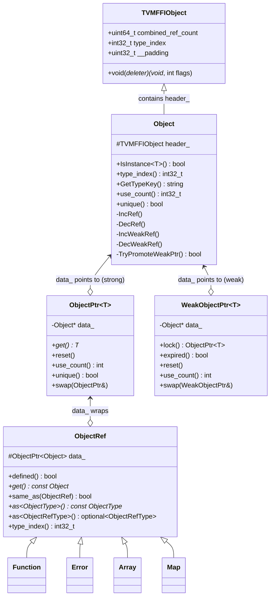
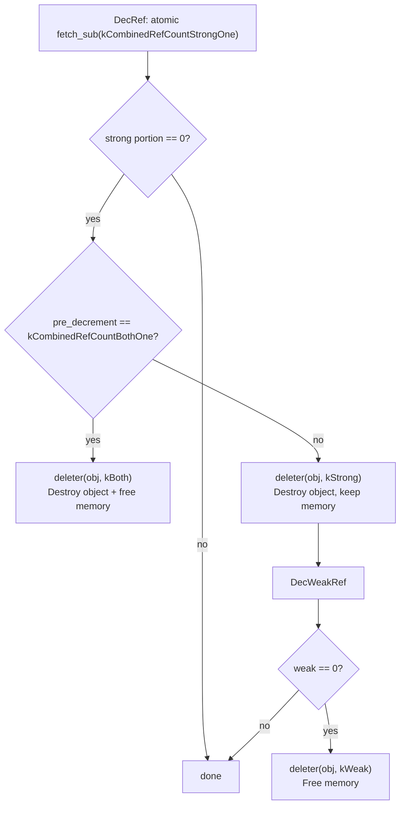
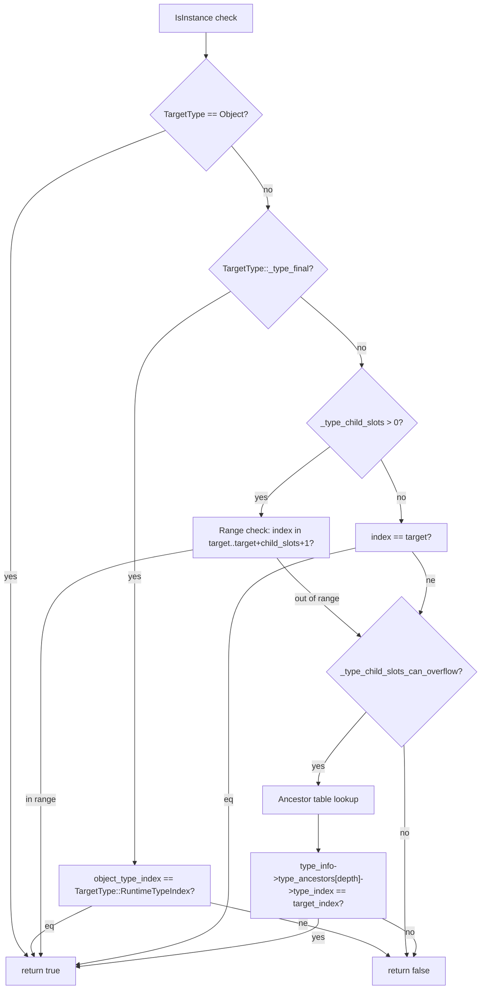

# Object System

**TL;DR**
- All heap-allocated FFI values inherit from `Object` (data class) and are accessed via `ObjectRef` (reference handle) backed by `ObjectPtr<T>` (intrusive smart pointer with atomic refcounting).
- The three-tier pattern `FooObj` (data) + `Foo` (ref) + macros (`TVM_FFI_DECLARE_OBJECT_INFO{,_FINAL,_STATIC}` / `TVM_FFI_DEFINE_OBJECT_REF_METHODS_{NULLABLE,NOTNULLABLE}`) provides a structured way to define new types with automatic runtime type registration and fast `IsInstance` checks.
- `make_object<T>(args...)` allocates objects via `details::SimpleObjAllocator`, setting up the header (refcount=1, type_index, deleter) in one shot.
- `UnsafeInit` tag struct is the sole mechanism for initializing ObjectRef types to null; all ref macros generate an `UnsafeInit` constructor, and `ObjectUnsafe::ObjectRefFromObjectPtr<T>` centralizes unsafe ObjectRef construction from raw `ObjectPtr`.

## Problem Statement

### Background
- The FFI needs heap-allocated, reference-counted objects that can be shared across language boundaries.
- Different languages (C++, Python, Rust) need to hold references to the same object with correct lifetime management.
- Runtime type checking must be fast (used in every function argument conversion) while supporting an open type hierarchy.

### Solution
- Intrusive reference counting via `TVMFFIObject` header (24 bytes) embedded in every object, with both strong and weak reference counts.
- A single-inheritance type tree with depth-indexed ancestor array for O(1) `IsInstance` checks.
- Macros that generate boilerplate: static type registration, runtime index allocation, and ref wrapper methods.

### Goals
- **Goal**: Safe, shared ownership of heap objects across language boundaries.
- **Goal**: Fast `IsInstance` — no virtual dispatch, O(1) for final types and types with reserved child slots.
- **Goal**: Minimal boilerplate for defining new object types.
- **Non-goal**: Not a general C++ OOP framework; the pattern is specifically designed for FFI interop.

## Design



**Object lifecycle** (two-counter system with strong and weak references):
1. `make_object<T>(args...)` allocates via `details::SimpleObjAllocator::Handler<T>::New`, calls placement new.
2. Sets `header_.combined_ref_count = kCombinedRefCountBothOne`, `header_.type_index = T::RuntimeTypeIndex()`, `header_.__padding = 0`, `header_.deleter = Handler::Deleter()`.
3. Returns `ObjectPtr<T>` (ownership transferred; strong refcount already 1).
4. `ObjectPtr` copy: IncRef (strong). `ObjectPtr` move: steal pointer, null source.
5. `ObjectPtr` destructor: DecRef (strong). `DecRef` performs `atomic_fetch_sub(kCombinedRefCountStrongOne)` on the combined u64. When the strong portion reaches 0, the deleter is called with flag dispatch:
   - **Common case** (`pre_decrement == kCombinedRefCountBothOne`): deleter called with `kTVMFFIObjectDeleterFlagBitMaskBoth` -- destroys object AND frees memory in one call. This is the fast path: a single atomic tells us both counters are about to reach zero.
   - **Weak refs outstanding**: deleter called with `kTVMFFIObjectDeleterFlagBitMaskStrong` -- destroys object but keeps memory alive. When the last weak ref is released, deleter called with `kTVMFFIObjectDeleterFlagBitMaskWeak` to free memory.
6. `WeakObjectPtr` copy: IncWeakRef (`atomic_fetch_add(kCombinedRefCountWeakOne)`). `WeakObjectPtr` destructor: DecWeakRef.
7. `WeakObjectPtr::lock()` uses a CAS loop on `combined_ref_count` to promote a weak reference to a strong one. If the strong portion is 0, lock returns nullptr (object expired).



### Key Classes, Fields and Interfaces

**`Object`** — base class with static type metadata:
```cpp
class Object {
protected:
  TVMFFIObject header_;
public:
  Object();                                      // combined_ref_count=0, deleter=nullptr
  template<typename TargetType> bool IsInstance() const;
  int32_t type_index() const;
  std::string GetTypeKey() const;
  uint64_t use_count() const;                     // atomic relaxed load, returns strong count (lower 32 bits)
  bool unique() const;

  // Static fields every subclass must provide (via macros):
  static constexpr const char* _type_key = "ffi.Object";  // all core types use ffi.* prefix
  static constexpr bool _type_mutable = false;  // when true, enables non-const pointer extraction from Any
  static constexpr bool _type_final = false;
  static constexpr uint32_t _type_child_slots = 0;
  static constexpr bool _type_child_slots_can_overflow = true;
  static constexpr TVMFFISEqHashKind _type_s_eq_hash_kind = kTVMFFISEqHashKindUnsupported;
  // Subclasses override to opt into structural equality/hash dispatch
  static constexpr int32_t _type_index = kTVMFFIObject;  // 64
  static constexpr int32_t _type_depth = 0;
  static int32_t RuntimeTypeIndex();
  static int32_t _GetOrAllocRuntimeTypeIndex();
  // Note: _type_has_method_sequal_reduce and _type_has_method_shash_reduce
  // have been REMOVED. Structural equality is now handled via the reflection
  // system (_type_s_eq_hash_kind + TypeAttrColumn dispatch).
};
```

**`ObjectPtr<T>`** — intrusive smart pointer:
```cpp
template<typename T>
class ObjectPtr {
  Object* data_ = nullptr;
public:
  ObjectPtr();
  ObjectPtr(const ObjectPtr&);                   // IncRef
  ObjectPtr(ObjectPtr&&);                        // steal, null source
  ~ObjectPtr();                                  // DecRef
  T* get() const;
  T* operator->() const;
  void reset();                                  // DecRef + null
  void swap(ObjectPtr&);
  int use_count() const;
  bool unique() const;
  explicit operator bool() const;
};
```

**`WeakObjectPtr<T>`** — weak intrusive smart pointer (mirrors `std::weak_ptr`):
```cpp
template <typename T>
class WeakObjectPtr {
  Object* data_ = nullptr;
public:
  WeakObjectPtr();
  WeakObjectPtr(std::nullptr_t);
  WeakObjectPtr(const ObjectPtr<T>&);       // from strong ptr (IncWeakRef)
  WeakObjectPtr(const WeakObjectPtr<T>&);   // copy (IncWeakRef)
  WeakObjectPtr(WeakObjectPtr<T>&&);        // move (steal pointer)
  template<typename U> WeakObjectPtr(const WeakObjectPtr<U>&);  // upcast copy
  template<typename U> WeakObjectPtr(const ObjectPtr<U>&);      // upcast from strong
  ~WeakObjectPtr();                          // DecWeakRef

  ObjectPtr<T> lock() const;                 // CAS-based TryPromoteWeakPtr -> strong or nullptr
  void reset();
  void swap(WeakObjectPtr<T>&);
  int use_count() const;                     // strong ref count (0 if expired)
  bool expired() const;                      // data_==nullptr || use_count()==0

  WeakObjectPtr<T>& operator=(const WeakObjectPtr<T>&);
  WeakObjectPtr<T>& operator=(WeakObjectPtr<T>&&);
};
```

**`ObjectRef`** — handle wrapper (the user-facing type):
```cpp
class ObjectRef {
protected:
  ObjectPtr<Object> data_;
public:
  explicit ObjectRef(ObjectPtr<Object> data);
  bool defined() const;                          // data_ != nullptr
  const Object* get() const;
  bool same_as(const ObjectRef& other) const;    // pointer equality
  template<typename ObjectType> const ObjectType* as() const;
  template<typename ObjectRefType> std::optional<ObjectRefType> as() const;
  int32_t type_index() const;
  std::string GetTypeKey() const;
  static constexpr bool _type_is_nullable = true;
  using ContainerType = Object;
};
```

### Macro Expansions

**`TVM_FFI_DECLARE_OBJECT_INFO_FINAL(TypeKey, TypeName, ParentType)`** expands to:
```cpp
// Pseudocode of what the macro generates:
static constexpr const char* _type_key = TypeKey;  // absorbed into declare macro
static const constexpr int _type_child_slots = 0;
static const constexpr bool _type_final = true;
// Then includes TVM_FFI_DECLARE_OBJECT_INFO logic:
static constexpr int32_t _type_depth = ParentType::_type_depth + 1;
static int32_t _GetOrAllocRuntimeTypeIndex() {
    static_assert(!ParentType::_type_final, "ParentType marked as final");
    // ... child_slots validation ...
    TVMFFIByteArray type_key{TypeName::_type_key, strlen(TypeName::_type_key)};
    static int32_t tindex = TVMFFITypeGetOrAllocIndex(
        &type_key, -1 /*dynamic*/, TypeName::_type_depth,
        TypeName::_type_child_slots, TypeName::_type_child_slots_can_overflow,
        ParentType::_GetOrAllocRuntimeTypeIndex());
    return tindex;  // cached in static local
}
static int32_t RuntimeTypeIndex() { return _GetOrAllocRuntimeTypeIndex(); }
// NOTE: Auto-registration removed in 9ac3121. The old `static inline int32_t _type_index =
// _GetOrAllocRuntimeTypeIndex()` is no longer generated. Object types must be explicitly
// registered via `ObjectDef<T>()` or by calling `_GetOrAllocRuntimeTypeIndex()` once in a .cc file.
// Builtin depth-1 types (Str, Bytes, Error, Function, Shape, Tensor, Array, Map, Module,
// OpaquePyObject) are pre-registered in TypeTable's constructor via ReserveDepthOneObjectTypeIndex.
```

**`TVM_FFI_DECLARE_OBJECT_INFO(TypeKey, TypeName, ParentType)`** — like `_FINAL` but without `_type_child_slots=0` or `_type_final=true`, allowing subclassing. Sets `_type_key = TypeKey`. Auto-registration removed (9ac3121): requires explicit `ObjectDef<T>()` call.

**`TVM_FFI_DECLARE_OBJECT_INFO_STATIC(TypeKey, TypeName, ParentType)`** — like `DECLARE_OBJECT_INFO` but uses the compile-time `_type_index` directly:
```cpp
static constexpr const char* _type_key = TypeKey;
static int32_t RuntimeTypeIndex() { return TypeName::_type_index; }
// _GetOrAllocRuntimeTypeIndex passes TypeName::_type_index as static_type_index
// (non-negative), so the runtime populates the type table without allocating
```

**`TVM_FFI_DEFINE_OBJECT_REF_METHODS_NULLABLE(TypeName, ParentType, ObjectName)`** expands to:
```cpp
TypeName() = default;
explicit TypeName(ObjectPtr<ObjectName> n) : ParentType(n) {}  // typed ObjectPtr (not Object)
explicit TypeName(UnsafeInit tag) : ParentType(tag) {}         // null-init via UnsafeInit
// copy/move constructors and assignment via TVM_FFI_DEFINE_DEFAULT_COPY_MOVE_AND_ASSIGN
using __PtrType = std::conditional_t<ObjectName::_type_mutable, ObjectName*, const ObjectName*>;
__PtrType operator->() const {
    return static_cast<__PtrType>(data_.get());  // constness controlled by _type_mutable
}
__PtrType get() const { return operator->(); }
using ContainerType = ObjectName;
static constexpr bool _type_is_nullable = true;
```

**`TVM_FFI_DEFINE_OBJECT_REF_METHODS_NOTNULLABLE(TypeName, ParentType, ObjectName)`** expands to:
```cpp
// No default constructor, no ObjectPtr constructor -- only UnsafeInit:
explicit TypeName(UnsafeInit tag) : ParentType(tag) {}
// copy/move constructors and assignment via TVM_FFI_DEFINE_DEFAULT_COPY_MOVE_AND_ASSIGN
using __PtrType = std::conditional_t<ObjectName::_type_mutable, ObjectName*, const ObjectName*>;
__PtrType operator->() const { return static_cast<__PtrType>(data_.get()); }
__PtrType get() const { return operator->(); }
using ContainerType = ObjectName;
static constexpr bool _type_is_nullable = false;
```

**Macro rename mapping** (from commit a08fa6e):

| Old macro | New macro |
|---|---|
| `TVM_FFI_DECLARE_BASE_OBJECT_INFO(T, Parent)` | `TVM_FFI_DECLARE_OBJECT_INFO(Key, T, Parent)` |
| `TVM_FFI_DECLARE_FINAL_OBJECT_INFO(T, Parent)` | `TVM_FFI_DECLARE_OBJECT_INFO_FINAL(Key, T, Parent)` |
| `TVM_FFI_DECLARE_STATIC_OBJECT_INFO(T, Parent)` | `TVM_FFI_DECLARE_OBJECT_INFO_STATIC(Key, T, Parent)` |
| `TVM_FFI_DEFINE_OBJECT_REF_METHODS(T, Parent, Obj)` | `TVM_FFI_DEFINE_OBJECT_REF_METHODS_NULLABLE(T, Parent, Obj)` |
| `TVM_FFI_DEFINE_NOTNULLABLE_OBJECT_REF_METHODS(T, Parent, Obj)` | `TVM_FFI_DEFINE_OBJECT_REF_METHODS_NOTNULLABLE(T, Parent, Obj)` |
| `TVM_FFI_DEFINE_MUTABLE_OBJECT_REF_METHODS(T, Parent, Obj)` | *(removed -- absorbed into NULLABLE via `_type_mutable`)* |
| `TVM_FFI_DEFINE_MUTABLE_NOTNULLABLE_OBJECT_REF_METHODS(T, Parent, Obj)` | *(removed -- absorbed into NOTNULLABLE via `_type_mutable`)* |

**`UnsafeInit` tag struct** (from commit 472e10c):
```cpp
struct UnsafeInit {};
// Tag type for unsafe initialization. Constructing an ObjectRefType with
// UnsafeInit{} sets data_ to nullptr. Only for controlled internal scenarios.
```

**`ObjectUnsafe::ObjectRefFromObjectPtr<T>`** (from commit 472e10c):
```cpp
template <typename T>
static T ObjectUnsafe::ObjectRefFromObjectPtr(const ObjectPtr<Object>& ptr);
// Creates T (an ObjectRef subtype) from a const-ref ObjectPtr via UnsafeInit + data_ assignment.

template <typename T>
static T ObjectUnsafe::ObjectRefFromObjectPtr(ObjectPtr<Object>&& ptr);
// Creates T from an rvalue ObjectPtr via UnsafeInit + data_ move.
```

**`ReflectionDefBase::ObjectCreatorUnsafeInit<T>`** (from commit 472e10c):
```cpp
template <typename T>
static int ReflectionDefBase::ObjectCreatorUnsafeInit(TVMFFIObjectHandle* result);
// Creates an object via make_object<T>(UnsafeInit{}) for types that have an
// UnsafeInit constructor but no default constructor. Used as fallback in ObjectDef.
```

### IsInstance Fast Path

`details::IsObjectInstance<TargetType>(object_type_index)` uses a three-tier strategy:



- **Tier 1 (final types)**: Direct index equality — O(1), no memory access beyond the object header.
- **Tier 2 (non-final with child slots)**: Range check `[target_index, target_index + child_slots + 1)` — O(1), one comparison.
- **Tier 3 (fallback)**: Dereference `TVMFFITypeInfo.type_ancestors[depth]->type_index` — O(1) with direct pointer access (no extra `TVMFFIGetTypeInfo()` lookup). `type_ancestors` stores `const TVMFFITypeInfo**` (pointers to ancestor TypeInfo structs).

### Contracts, Assumptions and Invariants
- **Single inheritance**: The type hierarchy is a tree (no diamond). `type_ancestors` is a flat array of `const TVMFFITypeInfo**` pointers indexed by depth.
- **Header at offset 0**: `Object::header_` must be the first non-static member. The C ABI relies on `reinterpret_cast<TVMFFIObject*>(obj)` working correctly for all subclasses (assuming no virtual bases). The `ObjectUnsafe::GetObjectOffsetToSubclass` handles potential non-zero offsets defensively.
- **Combined refcount system**: Objects carry a single `uint64_t combined_ref_count` where the lower 32 bits are the strong count and upper 32 bits are the weak count. Strong references keep the object alive; weak references keep the memory allocation alive. The weak count starts at 1 (the "strong reference group" counts as one weak reference). When the strong portion reaches 0, the object is destroyed; when the weak portion subsequently reaches 0, memory is freed. Associated constants: `kCombinedRefCountStrongOne = 1`, `kCombinedRefCountWeakOne = 1ULL << 32`, `kCombinedRefCountBothOne = WeakOne | StrongOne`, `kCombinedRefCountMaskUInt32 = (1ULL << 32) - 1`.
- **Refcount atomicity**: IncRef uses relaxed atomic increment on the combined u64 (`atomic_fetch_add(kCombinedRefCountStrongOne)`). DecRef uses a split-barrier pattern: `__ATOMIC_RELEASE` on `fetch_sub`, and `__ATOMIC_ACQUIRE` fence only on the deletion path (when the strong portion reaches zero). The single-atomic DecRef fast path compares the pre-decrement value against `kCombinedRefCountBothOne` to detect the common case without a separate weak count read.
- **Weak promotion is CAS-based**: `WeakObjectPtr::lock()` uses a compare-and-swap loop on `combined_ref_count`. It atomically increments the strong portion only if it is currently > 0. If the strong portion is already 0, promotion fails and `lock()` returns nullptr.
- **Type registration is once-only**: `_GetOrAllocRuntimeTypeIndex()` caches the index in a `static int32_t`; subsequent calls return the cached value. Registration happens automatically at static initialization time.
- **Deleter is type-specific with flag dispatch**: `details::SimpleObjAllocator::Handler<T>::Deleter_(void* objptr, int flags)` is called with bitmask flags from `TVMFFIObjectDeleterFlagBitMask`. The `void*` parameter is cast to `TVMFFIObject*` internally. When `kStrong` is set, it calls `T::~T()` explicitly (not virtual destructor). When `kWeak` is set, it frees the aligned storage. The `kBoth` flag combines both operations in the common case (no outstanding weak refs).
- **UnsafeInit protocol**: Every ObjectRef subtype must provide a constructor taking `UnsafeInit`. This constructor sets `data_` to nullptr and is the sole mechanism for null-initializing ref types. `ObjectUnsafe::ObjectRefFromObjectPtr<T>` is the canonical factory for constructing ObjectRef subtypes from raw `ObjectPtr` without going through the typed public constructors.
- **Python registration ordering invariant** (6897a5f): All `_register_object_by_index` calls in Cython must happen in strict inheritance order (base class before derived class). Otherwise `TypeInfo.parent_type_info` will be `None` for derived classes. This is enforced by centralizing all registration calls in `core.pyx` rather than scattering them across individual `.pxi` files. The `TYPE_CLS_TO_INFO` dict provides reverse lookup from Python class to `TypeInfo`, alongside the existing `TYPE_INDEX_TO_CLS` and `TYPE_KEY_TO_INFO` maps.

### Extension Points
- **New object types**: Define `FooObj : public Object` with `TVM_FFI_DECLARE_OBJECT_INFO_FINAL("my.Foo", FooObj, Object)` (type key is now a macro argument), define `Foo : public ObjectRef` with `TVM_FFI_DEFINE_OBJECT_REF_METHODS_NULLABLE(Foo, ObjectRef, FooObj)`. Set `static constexpr bool _type_mutable = true;` on the Obj class for mutable types.
- **Custom allocators**: Replace `details::SimpleObjAllocator` with a pool allocator or arena allocator by implementing the `Handler<T>` template with custom `New`/`Deleter_`.
- **Child slot tuning**: Set `_type_child_slots` on base classes to the expected number of derived types for optimal `IsInstance` performance.

### Usage Examples

#### Defining and using an Object type
**Context**: Creating a new FFI-visible type with the standard Obj+Ref pattern.
```cpp
// Step 1: Define the data class (Obj)
class TIntObj : public Object {
 public:
  int64_t value;
  TIntObj(int64_t value) : value(value) {}
  TVM_FFI_DECLARE_OBJECT_INFO_FINAL("test.Int", TIntObj, Object);
};

// Step 2: Define the reference handle (Ref)
class TInt : public ObjectRef {
 public:
  TVM_FFI_DEFINE_OBJECT_REF_METHODS_NULLABLE(TInt, ObjectRef, TIntObj);
};

// Step 3: Allocate and use
ObjectPtr<TIntObj> ptr = make_object<TIntObj>(42);
TInt ref(ptr);                        // wrap in ref handle
assert(ref->value == 42);            // -> returns const TIntObj*
assert(ref->IsInstance<TIntObj>());   // true (exact match, final type)
assert(ref->IsInstance<Object>());    // true (everything is Object)

// Store in Any
Any val = ref;                        // TypeTraits<TInt>::MoveToAny
TInt restored = val.cast<TInt>();     // TypeTraits<TInt>::TryCastFromAnyView
```

#### Using WeakObjectPtr for cycle-safe observation
**Context**: Hold a non-owning reference to an object, promoting to strong only when needed.
```cpp
// Create a strong pointer
ObjectPtr<TIntObj> strong = make_object<TIntObj>(42);
// Create a weak pointer from it
WeakObjectPtr<TIntObj> weak(strong);

// Lock to get a strong reference (CAS-based promotion)
ObjectPtr<TIntObj> locked = weak.lock();
assert(locked != nullptr);
assert(locked->value == 42);
assert(strong.use_count() == 2);  // strong + locked

// After all strong refs die, weak becomes expired
strong.reset();
locked.reset();
assert(weak.expired());
assert(weak.lock() == nullptr);
```

## Alternatives & Trade-offs
### Virtual destructor + shared_ptr
- Pros: Standard C++ pattern, familiar to most developers, no custom allocator needed.
- Cons: Requires virtual destructor (vtable overhead), `shared_ptr` control block is separate allocation (or `make_shared` which does not support custom deleters well). Cannot cross C ABI boundary cleanly (no standard ABI for shared_ptr). The intrusive refcount + type-specific deleter avoids all these issues.

### External reference counting (like COM IAddRef/IRelease)
- Pros: Interface-based, works across DLLs.
- Cons: Requires virtual dispatch for every AddRef/Release. TVM FFI's approach puts refcount in the header directly, using atomic operations without virtual dispatch.

## Related Work
### Design Docs & ADRs
- [0001-c-abi-layer.md](.knowledge/designs/0001-c-abi-layer.md) -- TVMFFIObject header struct (24 bytes with weak RC)
- [0002-any-value-system.md](.knowledge/designs/0002-any-value-system.md) -- How objects are stored in Any
- [0007-memory-allocation.md](.knowledge/designs/0007-memory-allocation.md) -- make_object, allocator design, deleter flag dispatch
- [0004-type-index-layout.md](.knowledge/ADRs/0004-type-index-layout.md) -- Type index range partitioning
- [0015-weak-rc-abi-design.md](.knowledge/ADRs/0015-weak-rc-abi-design.md) -- Decision to use combined u64 refcount (u32 strong + u32 weak packed) with bitmask deleter

### Evidence Matrix
- Object class definition and static fields -> `2025-05-06-7d34eb8.md` + `object.h`
- WeakObjectPtr and two-counter system -> `2025-09-01-ca9c3d10.md` (ca9c3d1) + `object.h`
- TVMFFIObjectDeleterFlagBitMask and DecRef three-path -> `2025-09-01-ca9c3d10.md` (ca9c3d1)
- UnsafeInit tag and ObjectRefFromObjectPtr -> `2025-09-08-472e10c4.md` (472e10c) + `object.h`
- Macro rename and consolidation (7 old -> 5 new + _type_mutable dispatch) -> `2025-09-09-a08fa6eb.md` (a08fa6e) + `object.h`
- FObjectDeleter signature change (TVMFFIObject* -> void*) -> `2025-09-07-24125d0a.md` (24125d0) + `memory.h`
- IsInstance three-tier fast path -> `2025-05-06-7d34eb8.md` + `object.h`
- Python registration ordering invariant, TYPE_CLS_TO_INFO, _type_cls_to_type_info -> `2025-11-08-6897a5f5a8dc662270dd10be40cf261bd1da93f8.md` (6897a5f)
- Plus 5 supporting commits (initial design, make_object, ObjectPtr)
