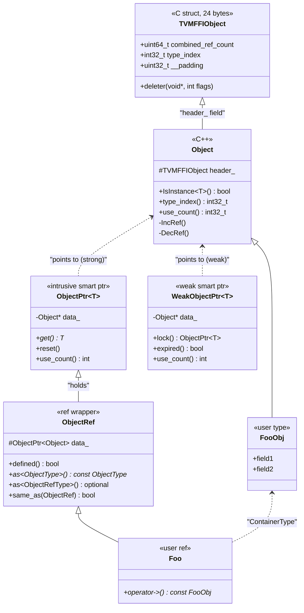
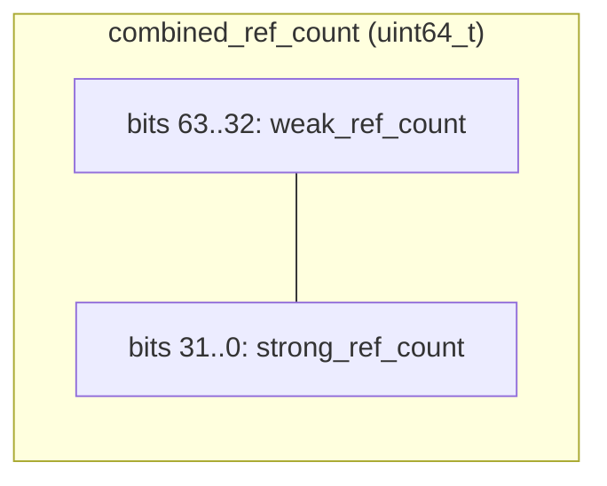

# Object System

**TL;DR**
- The object system provides ref-counted heap objects with a hierarchical runtime type system. `Object` holds a `TVMFFIObject` header (combined_ref_count, type_index, __padding, deleter). `ObjectRef` holds an intrusive `ObjectPtr<Object>`. `make_object<T>(args...)` allocates and initializes objects. `WeakObjectPtr<T>` provides weak reference support via a CAS-based promotion protocol.
- `IsInstance<T>` achieves O(1) type checking for most cases via the slot-based type index allocation: each parent type reserves contiguous index ranges for children, so checking `target_index <= object_index < target_index + slots` suffices.
- The naming convention is `FooObj` (data class inheriting `Object`) + `Foo` (ref wrapper inheriting `ObjectRef`), with macros `TVM_FFI_DECLARE_OBJECT_INFO` and `TVM_FFI_DEFINE_OBJECT_REF_METHODS` to generate boilerplate.

## Problem Statement

### Background

A cross-language FFI needs heap objects that can be safely passed between C++, Python, and Rust without garbage collector cooperation. The system must support runtime type checking (instanceof) across a deep type hierarchy without virtual dispatch overhead.

### Solution

An intrusive ref-counting scheme where the object header contains an atomic `ref_counter`. Type identity is represented by a 32-bit `type_index` rather than C++ RTTI, enabling fast cross-language type checks. The `TypeTable` singleton manages a hierarchical type registry with slot-based allocation for O(1) `IsInstance`.

### Goals

- **Goal**: Deterministic, ref-counted lifetime management without GC.
- **Goal**: O(1) `IsInstance` for the common case (types within reserved slot range).
- **Goal**: Dynamic type registration at runtime for user-defined types.
- **Non-goal**: Multiple inheritance (the type hierarchy is a tree).

## Design

### Core Type Hierarchy



### Object Allocation: make_object

```cpp
template <typename T, typename... Args>
ObjectPtr<T> make_object(Args&&... args) {
    void* data = details::AlignedAlloc<alignof(T)>(sizeof(T));
    new (data) T(std::forward<Args>(args)...);
    ffi_ptr->combined_ref_count = kCombinedRefCountBothOne;  // strong=1, weak=1
    ffi_ptr->type_index = T::RuntimeTypeIndex();
    ffi_ptr->__padding = 0;
    ffi_ptr->deleter = Handler::Deleter();
    return ObjectPtrFromOwned<T>(ptr);
}
```

The `SimpleObjAllocator` uses `details::AlignedAlloc<alignof(T)>(sizeof(T))` + placement new, replacing the former `new StorageType()` pattern with raw aligned allocation. For inplace arrays, allocation size is `sizeof(ArrayType) + sizeof(ElemType) * num_elems` rounded up to alignment. `details::AlignedAlloc<align>` uses `malloc` for standard alignment, `posix_memalign` on POSIX, and `_aligned_malloc` on MSVC. `details::AlignedFree` uses `free` (standard) or `_aligned_free` (MSVC).

The type-specific `Deleter_` receives an `int flags` bitmask and dispatches: bit 0 (strong) calls `tptr->T::~T()` (explicit, non-virtual destructor call), bit 1 (weak) calls `AlignedFree(storage)`. The initial `combined_ref_count` is set to `kCombinedRefCountBothOne` (strong=1, weak=1). The implicit weak reference (weak=1) is decremented when strong count reaches zero. This means a strong-only object (the common case) invokes the deleter exactly once with both flags set, avoiding separate destructor and free calls. The `__padding` field is explicitly zeroed for deterministic memory.

### Ref-Counting: Combined Atomic with Single-Atomic Fast Path

The `combined_ref_count` field (`uint64_t`) packs strong (lower 32 bits) and weak (upper 32 bits) counters into a single atomic value. Constants:
- `kCombinedRefCountStrongOne = 1` (increment/decrement strong)
- `kCombinedRefCountWeakOne = 1ULL << 32` (increment/decrement weak)
- `kCombinedRefCountBothOne = (1ULL << 32) | 1` (initial state: strong=1, weak=1)
- `kCombinedRefCountMaskUInt32 = 0xFFFFFFFF` (extract strong or weak)



**Strong ref-counting**:
- **`IncRef`**: `__ATOMIC_RELAXED` fetch-add of `kCombinedRefCountStrongOne`. Safe because the caller already holds a reference.
- **`DecRef`**: `__ATOMIC_RELEASE` fetch-sub of `kCombinedRefCountStrongOne`. The returned `count_before_sub` enables a fast path:
  - If `count_before_sub == kCombinedRefCountBothOne`: both strong and weak are transitioning to zero simultaneously. Call `deleter(obj, kTVMFFIObjectDeleterFlagBitMaskBoth)` -- destructor + free in one call. No additional atomics needed.
  - If strong was 1 but weak > 1: decrement the implicit weak reference (fetch-sub `kCombinedRefCountWeakOne`) and call `deleter(obj, kTVMFFIObjectDeleterFlagBitMaskStrong)` -- destructor only.
  - If strong was > 1: no action.
  - The acquire fence is issued only on the final strong decrement (before calling the deleter).
- **MSVC path**: Uses `_InterlockedExchangeAdd64` for the combined u64 operations.

**Weak ref-counting**:
- **`IncWeakRef`**: `__ATOMIC_RELAXED` fetch-add of `kCombinedRefCountWeakOne`.
- **`DecWeakRef`**: `__ATOMIC_ACQ_REL` fetch-sub of `kCombinedRefCountWeakOne`. When the weak portion transitions to 0 (strong already zero), calls `deleter(obj, kTVMFFIObjectDeleterFlagBitMaskWeak)` to free memory.
- **`TryPromoteWeakPtr`**: CAS loop on `combined_ref_count`. Loads current value with `__ATOMIC_RELAXED`; if strong portion (`& kCombinedRefCountMaskUInt32`) is zero, promotion fails. Otherwise, attempts `compare_exchange_weak` to increment strong by `kCombinedRefCountStrongOne`.

**Two-phase destruction protocol** (unchanged semantically, optimized atomically):
1. When strong count drops to zero: the combined counter is read in a single atomic. Fast path: if `count_before_sub == kCombinedRefCountBothOne`, call `deleter(obj, kTVMFFIObjectDeleterFlagBitMaskBoth)`. Slow path: decrement weak, call `deleter(obj, kTVMFFIObjectDeleterFlagBitMaskStrong)`.
2. When the last weak reference is destroyed (strong already zero): call `deleter(obj, kTVMFFIObjectDeleterFlagBitMaskWeak)`.

**Key optimization**: The common case (no external weak references) is handled with exactly one atomic decrement + one branch, eliminating the second atomic load/sub that the former separate-counter design required. This aligns with PyTorch `intrusive_ptr` ABI conventions. See [ADR 0041](../ADRs/0041-combined-ref-count-atomic.md).

### WeakObjectPtr

`WeakObjectPtr<T>` is a weak reference smart pointer in `include/tvm/ffi/object.h`:

- Constructible from `ObjectPtr<T>`, `WeakObjectPtr<T>`, or nullptr.
- `lock()` -> `ObjectPtr<T>`: atomically promotes via `TryPromoteWeakPtr()` CAS loop. Returns null `ObjectPtr` if the object is already destroyed.
- `expired()`: returns `true` if `data_` is nullptr or `use_count() == 0` (strong count is zero).
- Full copy/move/swap/reset semantics.
- Template-based inheritance support (base-class weak pointers from derived strong pointers).

### TypeTable: Runtime Type Registry

The `TypeTable` singleton (in `src/ffi/object.cc`) manages all type registrations:

```cpp
class TypeTable {
  struct Entry : public TypeInfo {
    int32_t num_slots;
    int32_t allocated_slots;
    bool child_slots_can_overflow;
    std::vector<const TVMFFITypeInfo*> type_ancestors_data; // Direct pointers
  };
  Map<String, int64_t> key_to_index_;  // FFI Map, not std::unordered_map
  int64_t type_counter_;
};
```

Allocation strategy:
1. **Static types** (`static_type_index >= 0`): Use the pre-assigned index directly.
2. **Dynamic types within parent's reserved range**: `parent->type_index + parent->allocated_slots`.
3. **Overflow**: Allocate from `type_counter_` (starts at `kTVMFFIDynObjectBegin = 128`).

The `TypeTable` uses `Map<String, int64_t>` (the FFI's own container) instead of `std::unordered_map`, reducing dependency on STL containers that may have ABI issues across DLL boundaries.

### TypeTable Metadata Registration

Each type can register fixed metadata via `TVMFFITypeRegisterMetadata` (renamed from `TVMFFITypeRegisterExtraInfo`):
- `TVMFFIObjectCreator creator`: Function pointer for reflection-based object construction.
- `int32_t total_size`: `sizeof(ConcreteObj)` for the type (narrowed from `int64_t`).
- `TVMFFIByteArray doc`: Type-level docstring.
- `TVMFFISEqHashKind structural_eq_hash_kind`: Structural equality/hash dispatch mode.

A duplicate-registration guard throws `RuntimeError` if metadata is already set, catching common mistakes like duplicate `ObjectDef<T>()` calls. The root `Object` type is bootstrapped with metadata (`total_size = sizeof(Object)`, `creator = nullptr`) during `TypeTable` construction.

Additionally, extensible per-type attributes can be registered via `TVMFFITypeRegisterAttr` using the column-oriented `TypeAttr` system. See [0010-type-attr-columns](../designs/0010-type-attr-columns.md) for details.

### IsInstance: Fast Type Checking

```cpp
template <typename TargetType>
bool IsObjectInstance(int32_t object_type_index) {
    if constexpr (is_same<TargetType, Object>) return true;
    if constexpr (TargetType::_type_final)
        return object_type_index == TargetType::RuntimeTypeIndex();
    int32_t begin = TargetType::RuntimeTypeIndex();
    int32_t end = begin + TargetType::_type_child_slots + 1;
    if (object_type_index >= begin && object_type_index < end) return true;
    if (!TargetType::_type_child_slots_can_overflow) return false;
    if (object_type_index < begin) return false;
    const TypeInfo* info = TVMFFIGetTypeInfo(object_type_index);
    return info->type_depth > TargetType::_type_depth &&
           info->type_ancestors[TargetType::_type_depth]->type_index == begin;
}
```

The overflow fallback accesses `type_ancestors[depth]->type_index` (pointer dereference to get type_index), since ancestor entries are `TVMFFITypeInfo*` pointers rather than integer indices. Note: the field was renamed from `type_acenstors` to `type_ancestors` in commit `98cb8af` (typo fix, ABI-breaking field rename across `c_api.h`, `object.h`, `accessor.h`, `base.pxi`).

### Type Key Namespace Convention

All built-in FFI object type keys use the `"ffi."` prefix, aligning with the C++ namespace `tvm::ffi`:

| Type | `_type_key` | `StaticTypeKey` constant |
|---|---|---|
| Object | `"ffi.Object"` | `kTVMFFIObject` |
| Function | `"ffi.Function"` | `kTVMFFIFunction` |
| Array | `"ffi.Array"` | `kTVMFFIArray` |
| Map | `"ffi.Map"` | `kTVMFFIMap` |
| String | `"ffi.String"` | `kTVMFFIString` |
| Bytes | `"ffi.Bytes"` | `kTVMFFIBytes` |
| Shape | `"ffi.Shape"` | `kTVMFFIShape` |
| Tensor | `"ffi.Tensor"` | `kTVMFFITensor` |
| Module | `"ffi.Module"` | `kTVMFFIModule` |
| Error | `"ffi.Error"` | (inline literal) |

User-defined types should use their own namespace prefix (e.g., `"relay.Expr"`, `"tir.PrimFunc"`).

### MISSING Singleton: GetInvalidObject

As of commit `86c4042` (#447), a global function `ffi.GetInvalidObject` returns a MISSING singleton object -- a designated "invalid" `ObjectRef` used as a sentinel value in contexts where `None`/null would be ambiguous. The primary use case is `Map.get(key, default)` where `None` is a valid map value, so a distinct sentinel is needed to detect absent keys.

The singleton is created once via `make_object<Object>()` and cached in a function-local `static`. In Python, `MISSING` is initialized in `core.pyx` during module startup and re-exported from `container.py`. `MISSING` is compared by object identity (`same_as` / `is`), not by value.

**Key invariant**: `MISSING` is a singleton -- there is exactly one instance across the process. `Map.get(key)` returns `MISSING` when the key is absent, and callers compare the result with `is MISSING` rather than `== None`.

### Object Declaration Macros

| Macro | Purpose |
|---|---|
| `TVM_FFI_DECLARE_OBJECT_INFO(TypeKey, T, P)` | For base types that can be subclassed (dynamic index). Embeds `_type_key` from the first parameter. |
| `TVM_FFI_DECLARE_OBJECT_INFO_FINAL(TypeKey, T, P)` | For leaf types (`_type_final = true`, `_type_child_slots = 0`). Embeds `_type_key`. |
| `TVM_FFI_DECLARE_OBJECT_INFO_STATIC(TypeKey, T, P)` | For built-in types with pre-assigned `_type_index`. Embeds `_type_key`. |
| `TVM_FFI_DECLARE_OBJECT_INFO_PREDEFINED_TYPE_KEY(T, P)` | For types (e.g., `Object` itself) that define `_type_key` outside the macro. |
| `TVM_FFI_DEFINE_OBJECT_REF_METHODS_NULLABLE(T, P, Obj)` | Defines constructor from `ObjectPtr<Obj>` + `UnsafeInit`, `operator->`, `get()`, `ContainerType`. Mutability auto-derived from `Obj::_type_mutable`. |
| `TVM_FFI_DEFINE_OBJECT_REF_METHODS_NOTNULLABLE(T, P, Obj)` | Same but `_type_is_nullable = false`. Only accepts `UnsafeInit` constructor. |

**Type-key-in-macro invariant**: After commit `a08fa6e` (#18289), `_type_key` is always defined inside the declaration macro (except `Object` base class and `_PREDEFINED_TYPE_KEY` users). This eliminates copy-paste errors where `_type_key` and the macro call could diverge.

**Automatic mutability dispatch**: The ref-method macros use `std::conditional_t<ObjectName::_type_mutable, ObjectName*, const ObjectName*>` to select the return type of `operator->()` and `get()`. Mutable types no longer need separate `MUTABLE` macro variants -- they set `_type_mutable = true` on the Obj class and use the standard macro names.

### UnsafeInit Tag and Null Safety

The `UnsafeInit` tag struct (`include/tvm/ffi/object.h`) was introduced in commit `472e10c` (#18284) to tighten `ObjectRef` constructor null safety:

- **`ffi::UnsafeInit{}`**: A zero-size tag type that explicitly opts into unsafe nullptr initialization. Every `ObjectRef` subclass generated by the standard macros has an `explicit T(UnsafeInit)` constructor.
- **Nullable types** accept `ObjectPtr<ContainerType>` (typed, not `ObjectPtr<Object>`) and `UnsafeInit`.
- **Non-nullable types** accept only `UnsafeInit` (no implicit construction from any pointer).
- **`ObjectUnsafe::ObjectRefFromObjectPtr<T>()`**: Two overloads (const-ref and rvalue) that centralize the unsafe "construct ref from untyped `ObjectPtr<Object>`" pattern. Uses `UnsafeInit{}` internally then assigns `data_`. This replaces all former `T(ObjectPtr<Object>)` calls with a single auditable bottleneck.
- **`ObjectCreatorUnsafeInit<T>`** (`include/tvm/ffi/reflection/registry.h`): Reflection creator fallback for types with `T(UnsafeInit)` but no default constructor. `ObjectDef<T>` checks `std::is_constructible_v<Class, UnsafeInit>` when `std::is_default_constructible_v<Class>` is false.

### Key Classes, Fields and Interfaces

- **`Object`** (`include/tvm/ffi/object.h`): Base class. Contains `TVMFFIObject header_`. Static fields: `_type_key`, `_type_index`, `_type_final`, `_type_child_slots`, `_type_child_slots_can_overflow`, `_type_depth`, `_type_mutable`, `_type_s_eq_hash_kind`. Structural equality/hashing is controlled by `_type_s_eq_hash_kind` (`TVMFFISEqHashKind` enum) plus `SEqual`/`SHash` methods registered via reflection.
- **`Object::_type_mutable`** (static constexpr bool, default `false`): Controls whether `TypeTraits<TObject*>` allows mutable raw pointer casts from `Any`/`AnyView`. Types opting in must set `_type_mutable = true`.
- **`ObjectPtr<T>`** (`include/tvm/ffi/object.h`): Intrusive ref-counted smart pointer. Calls `IncRef` on copy, `DecRef` on destroy.
- **`WeakObjectPtr<T>`** (`include/tvm/ffi/object.h`): Weak reference smart pointer. Calls `IncWeakRef` on copy, `DecWeakRef` on destroy. `lock()` attempts CAS-based promotion to strong reference.
- **`ObjectRef`** (`include/tvm/ffi/object.h`): Base ref wrapper. Holds `ObjectPtr<Object> data_`. Provides `as<T>()`, `same_as()`, `defined()`.
- **`TypeTable`** (`src/ffi/object.cc`): Singleton registry. Uses `Map<String, int64_t>` for key-to-index mapping. Pre-allocates 128 slots.
- **`TypeTable::Entry`**: Extends `TVMFFITypeInfo`. Adds `num_slots`, `allocated_slots`, `child_slots_can_overflow`. Stores `type_ancestors_data` as `std::vector<const TVMFFITypeInfo*>`. Note: `kTVMFFIOpaquePyObject` (type index 74, type key `"ffi.OpaquePyObject"`) is registered in `TypeTable` builtin initialization alongside other builtin types (commit `bdad218`).
- **`details::SimpleObjAllocator`** (`include/tvm/ffi/memory.h`): CRTP allocator. Moved into `namespace details` in commit `24125d0` to narrow the public API surface. `make_object` and `make_inplace_array_object` remain in `tvm::ffi` as the public entry points.
- **`ObjectUnsafe`** (`include/tvm/ffi/object.h`): Friend struct for internal operations. Includes `ObjectRefFromObjectPtr<T>()` for centralized unsafe ObjectRef construction.
- **`UnsafeInit`** (`include/tvm/ffi/object.h`): Zero-size tag struct for explicit unsafe nullptr initialization of ObjectRef subclasses.

### Contracts, Assumptions and Invariants

- **Single-threaded initialization**: `TypeTable` writes happen during init only. Reads are safe from any thread after init.
- **Tree hierarchy**: No multiple inheritance. Each type has exactly one parent.
- **Slot monotonicity**: Parent type indices are always less than child type indices.
- **Combined ref-count starts at BothOne**: `make_object` sets `combined_ref_count = kCombinedRefCountBothOne` (strong=1, weak=1). The returned `ObjectPtr` adopts this count without `IncRef`.
- **Implicit weak reference**: The initial weak=1 is the "implicit weak reference," decremented when strong count reaches zero. For the common case (no external weak references), `DecRef` detects `count_before_sub == kCombinedRefCountBothOne` and calls the deleter with `Both` flag in a single atomic operation.
- **Explicit destructor via flag dispatch**: The deleter receives `int flags` and dispatches: bit 0 calls `tptr->T::~T()` (not virtual), bit 1 calls `AlignedFree(storage)`. The allocator captures the concrete type at allocation time.
- **Ancestor pointers are stable**: `type_ancestors` entries are valid `const TVMFFITypeInfo*` for the lifetime of the `TypeTable`. Entries are never moved or freed.
- **Single-registration for metadata**: `RegisterTypeMetadata` (formerly `RegisterTypeExtraInfo`) throws if called twice for the same type index.
- **DecRef single-atomic fast path**: The common-case strong decrement uses `__ATOMIC_RELEASE` fetch-sub on `combined_ref_count`. If the pre-sub value equals `kCombinedRefCountBothOne`, the object is freed in a single call with no additional atomics. The acquire fence is issued only on the final strong decrement. See [ADR 0041](../ADRs/0041-combined-ref-count-atomic.md).
- **WeakObjectPtr promotion atomicity**: `TryPromoteWeakPtr` uses CAS loop on `combined_ref_count`. If strong portion is zero, promotion fails deterministically (no ABA issue because strong count never resurrects without explicit CAS success).
- **Padding zeroed at allocation**: The `__padding` field in `TVMFFIObject` is explicitly set to 0 during allocation for deterministic memory.

### Extension Points

- **Custom allocators**: The `ObjAllocatorBase` CRTP pattern allows arena or pool allocators.
- **New object types**: Define `FooObj` inheriting from `Object`, declare type info via macro, define `Foo` ref wrapper.
- **Structural equality/hashing**: Controlled at runtime via `_type_s_eq_hash_kind` (`TVMFFISEqHashKind` enum, defined in `include/tvm/ffi/c_api.h`). Subtypes opt in by overriding this field and optionally registering custom `__s_equal__`/`__s_hash__` type attributes through `TypeAttrDef<T>`. The legacy compile-time flags (`_type_has_method_sequal_reduce`, `_type_has_method_shash_reduce`) were removed in `e52aed5` (#18172). See [0009-structural-equal-hash](../designs/0009-structural-equal-hash.md) for the full design.
- **Mutable object types**: Set `_type_mutable = true` to enable mutable raw pointer casts via `TypeTraits<TObject*>` and to make `operator->()` / `get()` return non-const pointers in the ref wrapper macros.

## Alternatives & Trade-offs

### Alternative: Virtual-dispatch RTTI instead of type index ranges

- Pros: No slot-reservation complexity
- Cons: `dynamic_cast` is slow and not available across C boundaries. Slot-based range check is O(1).

### Alternative: Shared_ptr instead of intrusive ref-counting

- Pros: Standard C++ idiom, control block handles weak references
- Cons: Requires separate heap allocation for control block. Intrusive counting puts the counter in the header, saving one allocation. The chosen design integrates weak RC directly into the 24-byte header, avoiding a separate control block while still supporting weak references.

### Alternative: Integer-indexed ancestor table

- Pros: 4 bytes per entry (vs 8 bytes for pointers), simpler
- Cons: Requires extra `TVMFFIGetTypeInfo(index)` call per ancestor lookup. Direct pointers eliminate the lookup. Hierarchy depth is typically small (<10), so memory cost is negligible.

## Related Work

### Design Docs & ADRs

- [`.knowledge/designs/0001-c-abi.md`](0001-c-abi.md) -- `TVMFFIObject` C struct
- [`.knowledge/designs/0002-any-system.md`](0002-any-system.md) -- `Any` stores objects via `v_obj`
- [`.knowledge/designs/0006-reflection.md`](0006-reflection.md) -- Field reflection uses byte offsets from `Object` base
- [`.knowledge/ADRs/0003-slot-based-type-allocation.md`](../ADRs/0003-slot-based-type-allocation.md) -- Slot allocation algorithm
- [`.knowledge/ADRs/0041-combined-ref-count-atomic.md`](../ADRs/0041-combined-ref-count-atomic.md) -- Combined ref-count packing decision

### Evidence Matrix

- Object header layout -> `.knowledge/commits/2025-05-06-7d34eb8abfe987bf0031e4d4ff479895d867a966.md` + `7d34eb8`
- DecRef split release/acquire -> `.knowledge/commits/2025-06-18-d5209f0ce34d1f7c20c6cdc10cbc8445facb85e5.md` + `d5209f0`
- TypeTable uses Map<String,int64_t> -> `.knowledge/commits/2025-06-15-1a856886c8c14c6271e156d1ce4d76335d42f0ff.md` + `1a85688`
- Pointer-based type_ancestors -> `.knowledge/commits/2025-06-25-69f2484f915d95886502a1f620ea69aeed623c49.md` + `69f2484`
- _type_mutable opt-in -> `.knowledge/commits/2025-06-05-11a4a02d83e41ca4ccaf81df59d14b75309f65e9.md` + `11a4a02`
- ffi.* type key namespace -> `.knowledge/commits/2025-07-01-0966c368b097ec1b89e459a550716674198ac1d4.md` + `0966c36`
- Remove _type_has_method_visit_attrs -> `.knowledge/commits/2025-07-03-da47623098927c5b7e6380b1481b4002facdd6cd.md` + `da47623`
- TypeExtraInfo registration + guard -> `.knowledge/commits/2025-06-16-a419ed175aac752a3df2ee73faad360a2824ecd8.md` + `a419ed1`
- TypeExtraInfo -> TypeMetadata rename -> `.knowledge/commits/2025-07-22-162d6009252dd44950a9aa9b890cbbce6b8e5155.md` + `162d600`
- Remove _type_has_method_sequal_reduce/shash_reduce -> `.knowledge/commits/2025-07-29-e52aed53526d3a6207feb940303a6cd584fdf9d1.md` + `e52aed5`
- _type_s_eq_hash_kind + SEqHashKind enum -> `.knowledge/commits/2025-07-19-9445fe734839cffc8bdf881788528b7763f7be03.md` + `9445fe7`
- kTVMFFIModule = 73 type index, "ffi.Module" type key -> `.knowledge/commits/2025-08-17-538bef49b4daa91970f0f9cea137acdcb696562a.md` + `538bef4`
- Mutable object ref macro bugfix (trailing semicolons, missing FFI prefix) -> `.knowledge/commits/2025-08-17-538bef49b4daa91970f0f9cea137acdcb696562a.md` + `538bef4`
- TVMFFIObject 24-byte header, weak_ref_count/strong_ref_count split, WeakObjectPtr -> `.knowledge/commits/2025-09-01-ca9c3d10bb9640bffb972302f7064e49e592a526.md` + `ca9c3d1`
- TVMFFIObjectFree renamed to TVMFFIObjectDecRef, TVMFFIObjectIncRef added -> `.knowledge/commits/2025-09-01-ca9c3d10bb9640bffb972302f7064e49e592a526.md` + `ca9c3d1`
- Deleter flag dispatch (TVMFFIObjectDeleterFlagBitMask) -> `.knowledge/commits/2025-09-01-ca9c3d10bb9640bffb972302f7064e49e592a526.md` + `ca9c3d1`
- UnsafeInit tag struct, ObjectUnsafe::ObjectRefFromObjectPtr, ObjectCreatorUnsafeInit -> `.knowledge/commits/2025-09-08-472e10c4086e91fb788ffe1f0eee10df4bcf5db2.md` + `472e10c`
- Object declaration macro streamlining (type-key-in-macro, unified mutable dispatch) -> `.knowledge/commits/2025-09-09-a08fa6eb0d7a67de9f5a4354d9a1fe41c0dfa806.md` + `a08fa6e`
- SimpleObjAllocator moved to details namespace, FObjectDeleter void* signature -> `.knowledge/commits/2025-09-07-24125d0ac466beb67965c1dd9ae23f2a71f424ad.md` + `24125d0`
- NDArray -> Tensor rename (type key "ffi.Tensor") -> `.knowledge/commits/2025-09-06-3a551d83f7c05106fa8033a61970a5ce34aa8aef.md` + `3a551d8`
- type_acenstors -> type_ancestors rename + auto-fallback Python classes -> `.knowledge/commits/2025-09-25-98cb8af49ff599c217fce96c3d4f57c0f52b8ec4.md` + `98cb8af`
- OpaquePyObject builtin type index registration fix -> `.knowledge/commits/2025-09-25-bdad2184551353e49a9b6882f7b9a75a258862bb.md` + `bdad218`
- TVMFFIObject header reorder (ref counters first, strong narrowed to u32) -> `.knowledge/commits/2025-09-25-13436f01111bc4218feb440a29a2e421bc148cc4.md` + `13436f0`
- Combined ref-count single-atomic fast path -> `.knowledge/commits/2025-09-26-43d13e86ee24d1558f929e3b0faa3182ca1af872.md` + `43d13e8`
- AlignedAlloc/AlignedFree replacing new/delete in allocator -> `.knowledge/commits/2025-09-27-8ca0719f74bef289d80c8704343ed7c1607db8f3.md` + `8ca0719`
- Zero __padding field in allocator -> `.knowledge/commits/2025-09-30-d72019c41fb041675dc1ef2bc1f1ba28c18cac01.md` + `d72019c`
- ffi.GetInvalidObject MISSING singleton -> `.knowledge/commits/2026-02-15-86c4042d66bf432a3c4a217be1eeab3568329b5b.md` + `86c4042`
