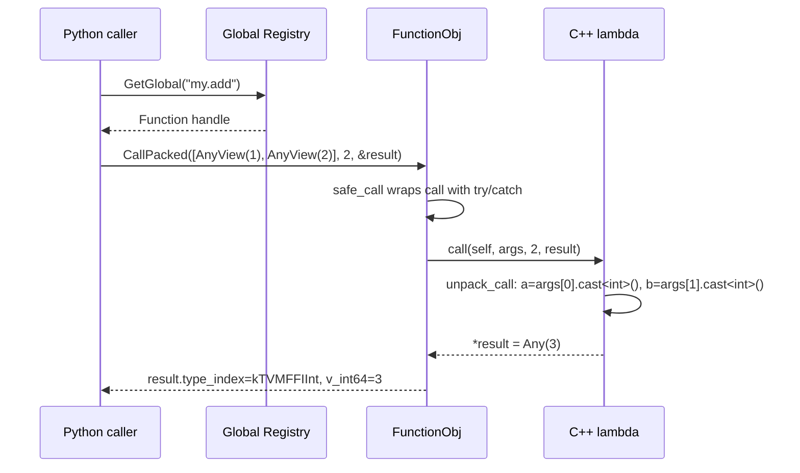

# Function System: Packed Calling Convention and Global Registry

**TL;DR**
- `Function` is the primary cross-language callable. It uses a packed calling convention: arguments are an `AnyView[]` array, return value is an `Any*`. This uniform signature enables any language to call any function without compile-time knowledge of its signature.
- Functions are registered in a global string-keyed registry (`Function::SetGlobal`/`GetGlobal`), enabling cross-language lookup by name. A function defined in C++ via `reflection::GlobalDef().def("my.add", ...)` can be called from Python by name.
- The safe-call boundary (`TVM_FFI_SAFE_CALL_BEGIN`/`END`) catches C++ exceptions at the C ABI boundary and stores them in TLS, enabling cross-DLL exception safety.

## Problem Statement

### Background
- Cross-language function calls cannot rely on C++ exception propagation, name mangling, or calling conventions.
- A universal calling convention is needed where any function, regardless of its original typed signature, can be invoked through a single uniform interface.
- Functions defined in one shared library must be callable from another, even when compiled by different compilers.

### Solution
- Define `FunctionObj` as an Object subclass with two call paths visible at the C ABI level: `safe_call` (C ABI compatible, catches exceptions) and `cpp_call` (C++ direct call pointer in `TVMFFIFunctionCell`, or NULL for non-C++ functions).
- Provide `Function::FromUnpacked(callable)` to automatically wrap any typed callable into the packed format using compile-time argument unpacking via `details::unpack_call`.
- Cross-DLL safety is handled by the `cpp_call == nullptr` convention: non-C++ functions always route through `safe_call`.

### Goals
- Type-erased function calls with any number of arguments.
- Exception safety across DLL boundaries.
- Global function registry for cross-language name-based lookup.
- Non-goal: Preserving original function signatures at runtime (that's what `TypedFunction<R(Args...)>` adds optionally).

## Design



### Key Classes, Fields and Interfaces

```python
class FunctionObj(Object, TVMFFIFunctionCell):
    """Object container backing Function. Dual call path via cpp_call/safe_call (4fe8b2b)."""
    safe_call: TVMFFISafeCallType  # C ABI boundary: catches exceptions, stores in TLS
    cpp_call: void_ptr             # C++ direct call pointer, or NULL for non-C++ functions
    # type alias: FCall = Callable[[FunctionObj, Ptr[AnyView], int32, Ptr[Any]], None]
    # Invariant: cpp_call is NULL for functions not originally created in C++
    # Invariant: cross-FFI-boundary calls MUST use safe_call, never cpp_call
    # Interacts with: TLS error storage (on exception), Function.operator()

    _type_index: int = kTVMFFIFunction  # 68 (static)
    _type_key: str = "object.Function"

    def CallPacked(self, args: Ptr[AnyView], num_args: int32, result: Ptr[Any]) -> None:
        """Invoke: if cpp_call is set, cast to FCall and use it; otherwise fall through
        to CppCallDedirectToSafeCall."""
        # call_ptr = cpp_call ? (FCall)cpp_call : CppCallDedirectToSafeCall
        # (*call_ptr)(self, args, num_args, result)
        # Interacts with: CppCallDedirectToSafeCall (private fallback)

    @staticmethod
    def _CppCallDedirectToSafeCall(func: FunctionObj, args: Ptr[AnyView],
                                    num_args: int32, rv: Ptr[Any]) -> None:
        """Private fallback: wraps safe_call and propagates errors via TVM_FFI_CHECK_SAFE_CALL."""
        # Interacts with: TVM_FFI_CHECK_SAFE_CALL, safe_call

# Macro expansion (pseudocode for TVM_FFI_SAFE_CALL_BEGIN/END):
# try {
#     ... function body ...
#     return 0;
# } catch (Error& err) {
#     details::SetSafeCallRaised(err);  // Store in TLS
#     return -1;
#     // Note: EnvErrorAlreadySet is now an Error (kind="EnvErrorAlreadySet"),
#     // caught here as a regular Error with return -1 (b1611e0).
#     // The former -2 code path is deprecated but backward-compatible.
# } catch (std::exception& ex) {
#     SetSafeCallRaised(Error("InternalError", ex.what(), ""));
#     return -1;
# }

# Macro expansion (pseudocode for TVM_FFI_CHECK_SAFE_CALL(func)):
# ret_code = func()
# if ret_code == -2: raise EnvErrorAlreadySet()  # deprecated path, backward compat (b1611e0)
# if ret_code == -1:
#   error = details::MoveFromSafeCallRaised()
#   if error.kind() == "EnvErrorAlreadySet": raise error  # new path (b1611e0)
#   else: raise error

class Function(ObjectRef):
    """Type-erased callable ref. The primary cross-language call mechanism."""
    # ContainerType = FunctionObj

    def __call__(self, *args: T) -> Any:
        """Pack args as AnyView array, call FunctionObj.CallPacked, return Any."""
        # Stack-allocates AnyView[N] for N args
        # Calls PackedArgs.Fill(args_pack, args...)
        # Calls FunctionObj.CallPacked(args_pack, N, &result)
        # Interacts with: PackedArgs, PackedArgsSetter, TypeTraits<T>.CopyToAnyView

    @staticmethod
    def FromPacked(callable: Callable[[Ptr[AnyView], int32, Ptr[Any]], None]) -> Function:
        """Wrap a packed-signature callable into a Function.
        Uses forwarding reference (TCallable&&) since 889bfb3."""
        # Creates FunctionObjImpl<decay_t<TCallable>> via make_object
        # Lambda capture: packed_call = std::forward<TCallable>(packed_call)
        # FunctionObjImpl stores the callable, sets safe_call=SafeCall, call=Call
        # Interacts with: details::FunctionObjImpl, FromPackedInternal

    @staticmethod
    def FromTyped(callable: Callable) -> Function:
        """Wrap a typed callable into a Function with automatic arg unpacking.
        Renamed from FromUnpacked. Uses forwarding reference (TCallable&&) since 889bfb3."""
        # Uses details::FunctionInfo<TCallable> to get arg count and types
        # Wraps callable in a packed lambda that calls details::unpack_call
        # unpack_call uses ArgValueWithContext<T> per arg position (templatized in 583e4b7)
        # ArgTypeSupported<T> whitelist: T, const T, const T&, T&& (rejects T&, const T&&)
        # Interacts with: details::unpack_call, details::FunctionInfo, ArgValueWithContext<T>
        # Extension: overload with std::string name for better error messages

    @staticmethod
    def GetGlobal(name: str) -> Optional[Function]: ...
        # Calls TVMFFIFunctionGetGlobal via C API
    @staticmethod
    def GetGlobalRequired(name: str) -> Function: ...
        # Calls GetGlobal, throws ValueError if not found
    @staticmethod
    def SetGlobal(name: str, func: Function, override: bool = False) -> None: ...
        # Calls TVMFFIFunctionSetGlobal via C API
    @staticmethod
    def ListGlobalNames() -> List[String]: ...
        # Calls "ffi.FunctionListGlobalNamesFunctor" (itself a registered function)
    @staticmethod
    def RemoveGlobal(name: String) -> None: ...
        # Calls "ffi.FunctionRemoveGlobal"

    @staticmethod
    def FromPackedInplace(TCallable, *args) -> tuple[Function, Ptr[TCallable]]:
        """Create a Function wrapping an in-place-constructed TCallable, returning
        both the Function and a raw pointer to the callable inside. Added in 84c5bdbc."""
        # static_assert: TCallable == decay_t<TCallable>
        # static_assert: TCallable is invocable with (AnyView*, int32, Any*)
        # Uses FunctionObjImpl variadic constructor + GetCallable() accessor
        # Interacts with: FunctionObjImpl<TCallable>, make_object
        # Extension: used by OverloadObjectDef to get mutable OverloadedFunction*
        #   enabling registration of additional overloads after initial Function creation

    def CallExpected(self, *args: T) -> "Expected[R]":
        """Call function, catching all exceptions as Error in Expected (0a9d4b6).
        Never throws; all errors are captured in the Expected return value."""
        # 1. Pack args as AnyView[] on the stack
        # 2. Call FunctionObj.safe_call directly (bypasses CallPacked exception re-throw)
        # 3. If ret_code == 0: try cast result to T, or wrap type mismatch as Unexpected
        # 4. If ret_code != 0: move error from TLS into Unexpected
        # Interacts with: FunctionObj.safe_call, TLS error propagation, Expected<T>, Unexpected
        # Invariant: never throws; all errors captured in Expected
        ...

    @staticmethod
    def InvokeExternC(handle: void_ptr, safe_call: TVMFFISafeCallType, *args: T) -> Any:
        """Directly invoke an extern C function pointer following SafeCall convention.
        No FunctionObj allocation -- packs args on the stack and calls safe_call directly.
        Added in 9186b44."""
        # 1. Stack-allocates AnyView[max(N, 1)]
        # 2. PackedArgs::Fill(args_pack, forward<Args>(args)...)
        # 3. safe_call(handle, reinterpret_cast<TVMFFIAny*>(args_pack), N, &result)
        # 4. TVM_FFI_CHECK_SAFE_CALL on return code
        # 5. Returns result as Any
        # Interacts with: PackedArgs::Fill, TVM_FFI_CHECK_SAFE_CALL, TVMFFISafeCallType
        # Key difference from operator(): no FunctionObj construction, no ref counting
        # Typical usage: handle=nullptr for exported symbols

class TypedFunction(Generic[R, *Args]):
    """Compile-time typed wrapper around Function. Adds type checking."""
    packed_: Function
    def __call__(self, *args: Args) -> R:
        # Calls packed_(*args), then std::move(result).cast<R>()
    # Interacts with: Function.operator(), Any.cast<R>
    # Extension: construct from lambda with matching signature

# === Internal implementation classes ===

class FunctionObjImpl(Generic[TCallable], FunctionObj):
    """Stores a packed-signature callable inside a FunctionObj."""
    callable_: TCallable  # mutable (was TStorage before 889bfb3; TStorage alias removed)
    # static_assert: TCallable == decay_t<TCallable> (must not be const/reference)
    # Constructor: variadic forwarding (84c5bdbc): template<Args...> explicit FunctionObjImpl(Args&&... args)
    #   Replaces two separate rvalue/lvalue overloads; enables in-place construction via FromPackedInplace
    # Copy constructor/assignment: = delete (84c5bdbc)
    # GetCallable() -> TCallable* : returns pointer to the stored callable (84c5bdbc)
    #   Invariant: lifetime of returned pointer is bounded by the Function that owns this FunctionObjImpl
    # Sets safe_call = SafeCall (own static, moved from FunctionObj), cpp_call = reinterpret_cast<void*>(CppCall)
    # SafeCall calls via self->cpp_call; CppCall invokes callable_
    # Interacts with: CppCall (static, invokes callable_), SafeCall (static, wraps CppCall)
    # Interacts with: Function::FromPackedInternal, Function::FromPackedInplace

class ExternCFunctionObjImpl(FunctionObj):
    """Wraps a C-style callback (void* self, TVMFFISafeCallType, deleter)."""
    self_: void_ptr
    safe_call_: TVMFFISafeCallType
    deleter_: Callable[[void_ptr], None]
    # Interacts with: TVMFFIFunctionCreate C API
    # safe_call = provided callback, cpp_call = nullptr (routes through safe_call)

class ExternCFunctionObjNullHandleImpl(FunctionObj):
    """Lightweight specialization for raw C function pointers (null self, null deleter). Added in 4fe8b2b."""
    # safe_call = provided callback, cpp_call = nullptr
    # Invariant: no closure state, no destructor logic
    # Interacts with: Function.FromExternC (dispatches here when self==nullptr && deleter==nullptr)

# REMOVED: ImportedFunctionObjImpl (was: wraps external DLL functions via RedirectCallToSafeCall)
# REMOVED: RedirectCallToSafeCall<Derived> (was: CRTP base for routing call->safe_call)
# REMOVED: Function::ImportFromExternDLL (was: cross-DLL wrapping with same-DLL detection heuristic)
# Cross-DLL safety now handled by cpp_call==nullptr convention (4fe8b2b)

# Global function registration via reflection::GlobalDef:
# refl::GlobalDef().def("name", callable)
#   -> Function::FromTyped(callable, "name")
#   -> TVMFFIFunctionSetGlobalFromMethodInfo(&info, 0)
#   Registers the function with type schema metadata in the global registry.
# Also supports: def_packed("name", packed_callable), def_method("name", &T::Method)
```

### Contracts, Assumptions and Invariants
- **Packed convention**: Every function, regardless of its original typed signature, is invoked as `(AnyView* args, int32_t num_args, Any* result)`. The caller packs arguments into `AnyView[]` on the stack; the callee unpacks and type-checks each argument.
- **Safe-call boundary**: `FunctionObj::SafeCall` catches all C++ exceptions and stores them in TLS. It returns 0 (success), -1 (error in TLS, retrieve via `TVMFFIErrorMoveFromRaised`), or -2 (frontend error already set, e.g., Python `KeyboardInterrupt`).
- **Cross-DLL safety**: Functions originating outside the C++ runtime have `cpp_call == nullptr`, forcing all calls through `safe_call` which catches exceptions at the C ABI boundary. The `ImportFromExternDLL` wrapping with same-DLL detection heuristic has been removed (4fe8b2b); the `cpp_call` convention is sufficient.
- **Result buffer initialization**: The `result->type_index` must be `kTVMFFINone` before calling `safe_call`. This is checked by an `ICHECK_LT` inside `FunctionObj::SafeCall`.

### Extension Points
- **Registering new global functions**: Use `reflection::GlobalDef().def("name", callable)`. The callable can be a lambda, function pointer, or member function pointer. For packed-convention callables, use `GlobalDef().def_packed("name", callable)`.
- **Method registration**: `GlobalDef().def_method("name", &T::Method)` wraps a member function, automatically passing `self` as the first argument.
- **Custom function objects**: Subclass `FunctionObj` and set `safe_call` and optionally `cpp_call`. Set `cpp_call = nullptr` for non-C++ implementations to route through `safe_call` automatically.

### Usage Examples

#### Registering and calling a global function (C++ to C++)
**Context**: Defining a function in C++ and calling it through the packed convention.

```cpp
// Register a typed function via GlobalDef
namespace refl = tvm::ffi::reflection;
refl::GlobalDef().def("my.add", [](int a, int b) -> int {
    return a + b;
});

// Call by name
Function f = Function::GetGlobalRequired("my.add");
int result = f(40, 2).cast<int>();  // result == 42
// Under the hood:
// 1. AnyView args[2] = {AnyView(40), AnyView(2)}
// 2. FunctionObj.CallPacked(args, 2, &any_result)
// 3. unpack_call: a=args[0].cast<int>(), b=args[1].cast<int>()
// 4. *result = Any(42)
```

#### Creating a Function from a C-exported symbol
**Context**: Wrapping a C-exported function pointer into a Function (4fe8b2b).

```cpp
// Declare and export a typed function as a C symbol
int testing_add1(int x) { return x + 1; }
TVM_FFI_DLL_EXPORT_TYPED_FUNC(testing_add1, testing_add1);

// Create a Function from the C symbol (null handle, null deleter)
// Uses ExternCFunctionObjNullHandleImpl: safe_call=__tvm_ffi_testing_add1, cpp_call=nullptr
Function fadd1 = Function::FromExternC(nullptr, __tvm_ffi_testing_add1, nullptr);
EXPECT_EQ(fadd1(1).cast<int>(), 2);
// All calls route through safe_call (cpp_call is nullptr) for cross-DLL safety
```

#### Directly invoking a C-exported symbol without Function construction
**Context**: Using `InvokeExternC` for zero-allocation direct calls (9186b44).

```cpp
// Given an already-exported C symbol (e.g. via TVM_FFI_DLL_EXPORT_TYPED_FUNC):
extern "C" int __tvm_ffi_testing_add1(
  void* handle, const TVMFFIAny* args, int32_t num_args, TVMFFIAny* result
);

// Direct call -- no FunctionObj allocation, no ref counting
int invoke_testing_add1(int x) {
  return Function::InvokeExternC(nullptr, __tvm_ffi_testing_add1, x).cast<int>();
}
// Under the hood:
// 1. AnyView args[1] = {AnyView(x)}
// 2. __tvm_ffi_testing_add1(nullptr, args, 1, &result)
// 3. TVM_FFI_CHECK_SAFE_CALL checks return code
// 4. result.cast<int>() returns x + 1
```

### FunctionInfo SFINAE Specializations

`FunctionInfo<T>` uses SFINAE to dispatch callable types correctly. There are three levels of specializations:

**Base function type specializations** (function_details.h):
```python
# All three forms of C++ callable types resolve identically to FuncFunctorImpl<R, Args...>:
#   FunctionInfo<R(Args...), void>       : FuncFunctorImpl<R, Args...>   # bare function type
#   FunctionInfo<R (*)(Args...), void>   : FuncFunctorImpl<R, Args...>   # function pointer
#   FunctionInfo<R (&)(Args...), void>   : FuncFunctorImpl<R, Args...>   # function reference (a23c5a0)
# Invariant: all three forms must resolve identically
# Interacts with: TVM_FFI_DLL_EXPORT_TYPED_FUNC (uses decltype(Function) to select specialization)
# Note: The function reference specialization (a23c5a0) is essential because:
#   - decltype((namespace::Func)) yields R(&)(Args...) when parenthesized
#   - constexpr auto& ref = Func; decltype(ref) yields R(&)(Args...) for reference bindings
#   Without this specialization, these patterns fall through to the primary template
#   which tries decltype(&T::operator()) on a function reference -- causing a crash.
```

**Member function pointer specializations** (function_details.h):

`FunctionInfo<T>` uses SFINAE to dispatch member function pointers correctly based on whether the class derives from `Object` (pointer convention) or `ObjectRef` (value convention). This was fixed in 7b57a46, correcting 28fe3cc/368af82.

```python
# SFINAE-guarded FunctionInfo partial specializations (function_details.h):
# For Object-derived classes: first arg is Class* / const Class*
#   FunctionInfo<R (Class::*)(Args...), enable_if<is_base_of<Object, Class>>>
#       : FuncFunctorImpl<R, Class*, Args...>
#   FunctionInfo<R (Class::*)(Args...) const, enable_if<is_base_of<Object, Class>>>
#       : FuncFunctorImpl<R, const Class*, Args...>
# For ObjectRef-derived classes: first arg is Class / const Class (by value)
#   FunctionInfo<R (Class::*)(Args...), enable_if<is_base_of<ObjectRef, Class>>>
#       : FuncFunctorImpl<R, Class, Args...>
#   FunctionInfo<R (Class::*)(Args...) const, enable_if<is_base_of<ObjectRef, Class>>>
#       : FuncFunctorImpl<R, const Class, Args...>
# Invariant: ObjectRef specialization is more specific (is_base_of<ObjectRef, Class>
#   is stricter than is_base_of<Object, Class>)
# Interacts with: FuncFunctorImpl::TypeSchema() for JSON type schema generation
# Interacts with: GlobalDef::def_method() and ObjectDef::def()
```

### DLL Export Macros and Metadata Embedding

```python
# TVM_FFI_DLL_EXPORT_TYPED_FUNC(ExportName, Function):
#   Always emits: extern "C" int __tvm_ffi_<ExportName>(...) { /* unpack_call */ }
#   Delegates to TVM_FFI_DLL_EXPORT_TYPED_FUNC_IMPL_ (internal, factored out in ac7bf68)
#   When TVM_FFI_DLL_EXPORT_INCLUDE_METADATA == 1, also emits:
#     extern "C" int __tvm_ffi__metadata_<ExportName>(...) {
#         return JSON: {"type_schema": FunctionInfo<decltype(Function)>::TypeSchema()}
#     }
#   Interacts with: details::FunctionInfo<decltype(Function)>, EscapeString
#   Invariant: metadata symbol uses double-underscore internal prefix (__tvm_ffi__metadata_)
#   Invariant: when flag is 0, no metadata symbol is generated (zero overhead)

# TVM_FFI_DLL_EXPORT_TYPED_FUNC_DOC(ExportName, DocString):
#   When TVM_FFI_DLL_EXPORT_INCLUDE_METADATA == 1, emits:
#     extern "C" int __tvm_ffi__doc_<ExportName>(...) { return String(DocString); }
#   When flag is 0, expands to nothing.
#   Interacts with: TVM_FFI_DLL_EXPORT_TYPED_FUNC (must be called first to export function)
#   Invariant: doc symbol uses __tvm_ffi__doc_ prefix (double underscore = internal)
#   Added in ac7bf68

# TVM_FFI_DLL_EXPORT_INCLUDE_METADATA: compile-time flag (default 0)
#   When 1, TVM_FFI_DLL_EXPORT_TYPED_FUNC and TVM_FFI_DLL_EXPORT_TYPED_FUNC_DOC emit
#   metadata/doc symbols. When 0, they are no-ops or produce only the function symbol.
#   Interacts with: -DTVM_FFI_DLL_EXPORT_INCLUDE_METADATA=1 compiler flag
```

## Alternatives & Trade-offs

### Typed function tables (like COM interfaces)
- Pros: Compile-time type checking, no runtime unpacking overhead
- Cons: Every new function signature needs a new interface type. Cannot support arbitrary argument counts or types without combinatorial explosion. Not practical for an ML framework with thousands of distinct function signatures.

### Passing error pointer as argument (no TLS)
- Pros: No thread-local dependency
- Cons: Every function signature would need an extra `Error** err` parameter, complicating codegen for chained calls like `f(g(x))`. The TLS approach keeps the packed signature clean at 4 arguments.

## Related Work
### Design Docs & ADRs
- [0001-c-abi.md](../designs/0001-c-abi.md) -- TVMFFISafeCallType, TVMFFIFunctionCall
- [0003-any-system.md](../designs/0003-any-system.md) -- AnyView/Any used as arg/return types
- [0005-error-system.md](../designs/0005-error-system.md) -- Error objects stored in TLS by safe-call
- [ADR 0002](../ADRs/0002-tls-error-propagation.md) -- Decision to use TLS for error propagation

### Evidence Matrix
- FunctionObj design, safe_call/call dual paths -> `commits/2025-05-06-7d34eb8abfe987bf0031e4d4ff479895d867a966.md` (commit 7d34eb8, `function.h`)
- ~~TVM_FFI_REGISTER_GLOBAL macro~~ removed in commit 26b68b0, replaced by reflection::GlobalDef -> `commits/2025-07-15-26b68b0256fb40baa8aeb55847050d13b064f441.md`
- reflection::GlobalDef as sole global registration mechanism -> `commits/2025-07-15-26b68b0256fb40baa8aeb55847050d13b064f441.md` (commit 26b68b0, `function.h` deletion + `reflection/registry.h`)
- ~~ImportFromExternDLL~~ removed in 4fe8b2b; cross-DLL safety via cpp_call==nullptr convention -> `commits/2025-09-29-4fe8b2b79dfeb469b2499acecb3e10038ddcee0f.md` (4fe8b2b)
- TVMFFIFunctionCell.cpp_call, ExternCFunctionObjNullHandleImpl, CppCallDedirectToSafeCall -> `commits/2025-09-29-4fe8b2b79dfeb469b2499acecb3e10038ddcee0f.md` (4fe8b2b)
- FromUnpacked/unpack_call machinery -> `commits/2025-05-06-7d34eb8abfe987bf0031e4d4ff479895d867a966.md` (commit 7d34eb8, `function_details.h`)
- Function::InvokeExternC zero-allocation extern C invocation -> `commits/2025-10-14-9186b44d63df3be9d3d67bb10b784f5e263f7e36.md` (9186b44)
- SFINAE FunctionInfo for Object/ObjectRef member function pointers -> `commits/2025-10-14-7b57a46648662b11b483f252787db22ab701231f.md` (7b57a46)
- FunctionInfo member function pointer Class* fix -> `commits/2025-10-07-368af824845424ea439b9f3d68bf4a710afb38b1.md` (368af82)
- ArgValueWithContext templatized, ArgTypeSupported whitelist, const/ref/rvalue-ref support -> `commits/2025-11-10-583e4b73c11aa3257e7be862834b98f33c39a6dd.md` (583e4b7)
- Perfect forwarding for callable-accepting templates (TCallable&&, SFINAE guards) -> `commits/2025-11-17-889bfb360b5afa6f7b50774cba53e7e625ea1e8f.md` (889bfb3)
- DLL metadata/docstring export macros (TVM_FFI_DLL_EXPORT_TYPED_FUNC_DOC, TVM_FFI_DLL_EXPORT_INCLUDE_METADATA) -> `commits/2025-11-20-ac7bf68058b392c3a8475619016fde48bd08334b.md` (ac7bf68)
- Function::FromPackedInplace, FunctionObjImpl variadic constructor + GetCallable -> `commits/2025-12-23-84c5bdbcd11ae0e5bc921db4f35d3fd1d3ae762c.md` (84c5bdb)
- Function::CallExpected<T>() exception-free function invocation -> `commits/2026-02-06-0a9d4b681cb017e9103efa6cc20d687c065a26fe.md` (0a9d4b6)
- EnvErrorAlreadySet unified to Error kind-based dispatch (safe_call -2 deprecated) -> `commits/2026-02-03-b1611e0cf669518dd01367806ab0bfda7b20841d.md` (b1611e0)
