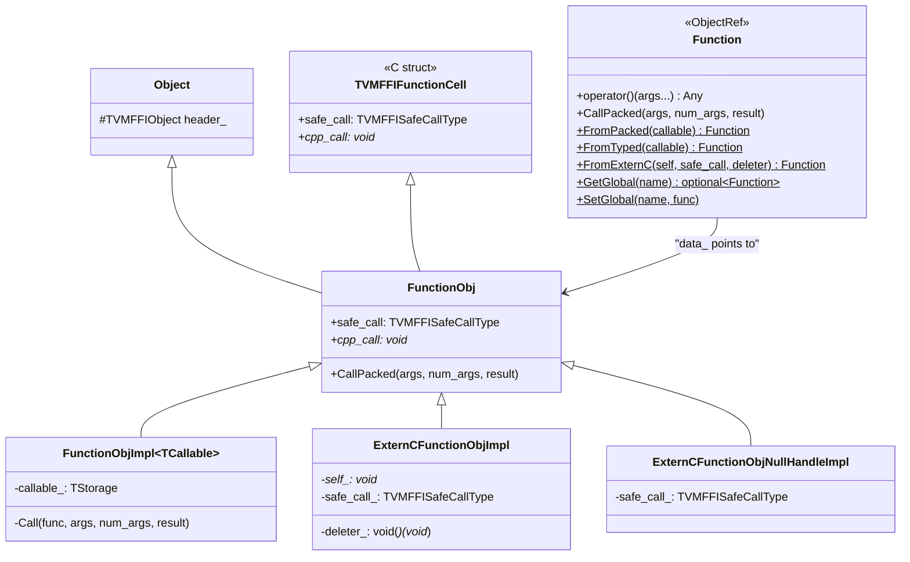

# Function System

**TL;DR**
- `Function` is a type-erased callable backed by `FunctionObj`, which inherits both `Object` (ref-counted lifetime) and `TVMFFIFunctionCell` (C-ABI-compatible `safe_call` + `cpp_call` pointers). `TVMFFIFunctionCell` now has two call paths visible at the C ABI level: `safe_call` (C-compatible error codes) and `cpp_call` (C++ exceptions, same-DLL only). `CallPacked` dispatches through `cpp_call` when non-null, otherwise falls back to wrapping `safe_call`.
- `GlobalFunctionTable` maps string names to metadata-rich `Entry` objects (embedding `TVMFFIMethodInfo`) in a `Map<String, Any>`. Functions are registered via `reflection::GlobalDef`, which attaches type schemas, docstrings, and flags. The table is intentionally leaked (never deleted) to avoid destruction-order issues.
- `Function::FromTyped(callable)` wraps any C++ callable with automatic argument unpacking from the packed `(const AnyView*, int32_t, Any*)` convention, enabling natural function signatures like `int(int, int)` to be exposed across FFI boundaries.

## Problem Statement

### Background

Cross-language function calls require a universal calling convention. C++ has overloaded functions, templates, and exceptions; C has none. Python expects to pass/receive dynamically typed values. The FFI needs a single function representation that works in all these contexts.

### Solution

A packed calling convention where all arguments are passed as an array of `AnyView` values and the return value is a single `Any`. `TVMFFIFunctionCell` provides two call path fields at the C ABI level: `safe_call` for C (error code + TLS) and `cpp_call` for C++ (exception propagation, same-DLL only). `CallPacked` dispatches through `cpp_call` when non-null, otherwise wraps `safe_call` via `CppCallDedirectToSafeCall`. Template machinery in `Function::FromTyped` bridges typed C++ callables to this packed convention. See [ADR 0042](../ADRs/0042-cpp-call-dual-dispatch.md).

### Goals

- **Goal**: Universal calling convention that works across C, C++, Python, and Rust.
- **Goal**: Zero-overhead for same-DLL C++ calls (direct `call` path, no exception translation).
- **Goal**: Safe cross-DLL calls via `safe_call` with error code return.
- **Goal**: Rich metadata (type schemas, docstrings) attached to registered global functions.
- **Non-goal**: Vararg-style calling (arguments are always an explicit array with a count).

## Design

### FunctionObj: Dual-Entry Object



### GlobalFunctionTable

```cpp
class GlobalFunctionTable {
  class Entry : public Object, public TVMFFIMethodInfo {
    String name_data, doc_data, metadata_data;
    Function func_data;
  };
  Map<String, Any> table_;  // Map of Entry objects
public:
  void Update(const String& name, Function func, bool can_override);
  void Update(const TVMFFIMethodInfo* info, bool can_override);
  static GlobalFunctionTable* Global() {
    static GlobalFunctionTable* inst = new GlobalFunctionTable();
    return inst;
  }
};
```

- Stores `Entry` objects (which embed `TVMFFIMethodInfo` metadata) in a `Map<String, Any>`, not raw `Function*` pointers. This enables rich function metadata (doc, metadata) at the global registry level.
- The singleton is allocated via `new` and intentionally never deleted.
- Thread-safety: writes assumed during initialization; reads safe from any thread after init.

### Registration: GlobalDef

```cpp
// Modern registration (preferred):
TVM_FFI_STATIC_INIT_BLOCK() {
  reflection::GlobalDef()
    .def("multiply", [](int a, int b) { return a * b; })
    .def("ffi.MakeObjectFromPackedArgs", MakeObjectFromPackedArgs);
}
```

`GlobalDef` inherits from `ReflectionDefBase` and provides:
- `def(name, func, extra...)` -- typed function via `Function::FromTyped`
- `def_packed(name, func, extra...)` -- packed function via `Function::FromPacked`
- `def_method(name, member_func_ptr, extra...)` -- member function pointer with first-argument injection

All methods construct a `TVMFFIMethodInfo` with name, doc, metadata, flags, and the function, then call `TVMFFIFunctionSetGlobalFromMethodInfo`. This is richer than the former `TVM_FFI_REGISTER_GLOBAL` which only stored name + function pointer.

### Module Export: TVM_FFI_DLL_EXPORT_TYPED_FUNC

```cpp
TVM_FFI_DLL_EXPORT_TYPED_FUNC(ExportName, CppFunction);
```

Generates an `extern "C"` function with `TVMFFISafeCallType` signature, using `FunctionInfo<decltype(Function)>` for arity/return type deduction and `unpack_call` for argument unpacking. Used by shared library modules to export functions discoverable via `load_module`.

### Key Classes, Fields and Interfaces

- **`FunctionObj`** (`include/tvm/ffi/function.h`): Extends `Object` + `TVMFFIFunctionCell`. Fields: `safe_call` (C TVMFFISafeCallType), `cpp_call` (void*, C++ exception path). `CallPacked` dispatches via `cpp_call` when non-null, else falls back to `CppCallDedirectToSafeCall`.
- **`Function`** (`include/tvm/ffi/function.h`): `ObjectRef` wrapper. Static methods: `FromPacked`, `FromTyped`, `FromExternC`, `GetGlobal`, `SetGlobal`, `ListGlobalNames`, `RemoveGlobal`.
- **`FunctionObjImpl<TCallable>`**: Template-instantiated callable storage. Sets `cpp_call` to a static C++ call function.
- **`ExternCFunctionObjImpl`**: Wraps C-style `(void* self, safe_call, deleter)` triple. `cpp_call = nullptr`.
- **`ExternCFunctionObjNullHandleImpl`**: Optimized variant for raw C function pointers without closure (`self == nullptr && deleter == nullptr`). `cpp_call = nullptr`.
- **`GlobalFunctionTable`** (`src/ffi/function.cc`): Singleton `Map<String, Any>` holding `Entry` objects.
- **`GlobalFunctionTable::Entry`**: `Object` subclass embedding `TVMFFIMethodInfo` metadata.
- **`reflection::GlobalDef`** (`include/tvm/ffi/reflection/registry.h`): Builder class for global function registration with metadata.
- **`TypedFunction<R(Args...)>`**: Typed wrapper over `Function` with compile-time signature checking.
- **`PackedArgs`**: Lightweight view over `(const AnyView* data, int32_t size)`.

### Contracts, Assumptions and Invariants

- **Packed calling convention**: All FFI functions use `(const AnyView* args, int32_t num_args, Any* rv)`.
- **Result initialization**: Caller must ensure `rv->type_index < kTVMFFIStaticObjectBegin` before calling.
- **Safe call error codes**: `0` = success, `-1` = C++ error, `-2` = frontend error.
- **GlobalFunctionTable leak**: The table is never freed. Individual entries are ref-counted but the container is leaked.
- **cpp_call dispatch**: `CallPacked` uses `cpp_call ? cpp_call(...) : CppCallDedirectToSafeCall(...)`. C-origin functions have `cpp_call = nullptr`.
- **Duplicate registration via MethodInfo path**: Uses `TVM_FFI_LOG_AND_THROW` to ensure the error is visible on stderr during static initialization, where exceptions may be swallowed.

### Extension Points

- **New function wrapper types**: Subclass `FunctionObj` and implement `call`/`safe_call`.
- **Custom GlobalDef extra args**: `GlobalDef::def` accepts variadic extra args for docstrings and other metadata traits.
- **EnvCAPIRegistry**: Allows language runtimes to register C API function pointers for signal handling. Note: `EnvCAPIRegistry` was moved from `src/ffi/function.cc` to `src/ffi/extra/env_c_api.cc` (extra tier) in commit `023ea44`, separating it from the core function system.

## Alternatives & Trade-offs

### Alternative: Keep TVM_FFI_REGISTER_GLOBAL macro

- Pros: Simpler, proven pattern
- Cons: No metadata (type schema, docstring) attached to registered functions. Cannot support Python stub generation or IDE tooling. GlobalDef provides unified metadata pipeline.

### Alternative: Typed function signatures in the ABI

- Pros: Compile-time type safety at the C boundary
- Cons: Requires a different C function signature for every function type. The packed convention enables a single universal ABI entry point.

## Related Work

### Design Docs & ADRs

- [`.knowledge/designs/0001-c-abi.md`](0001-c-abi.md) -- `TVMFFIFunctionCell` and `TVMFFISafeCallType`
- [`.knowledge/designs/0002-any-system.md`](0002-any-system.md) -- `AnyView`/`Any` in packed calling convention
- [`.knowledge/designs/0006-reflection.md`](0006-reflection.md) -- `GlobalDef` and `ReflectionDefBase`
- [`.knowledge/designs/0007-error-handling.md`](0007-error-handling.md) -- `SafeCallContext` and exception transport
- [`.knowledge/designs/0008-module-export-system.md`](0008-module-export-system.md) -- `TVM_FFI_DLL_EXPORT_TYPED_FUNC`
- [`.knowledge/ADRs/0004-global-function-table-leak.md`](../ADRs/0004-global-function-table-leak.md) -- Intentional leak decision
- [`.knowledge/ADRs/0005-safe-call-abi-boundary.md`](../ADRs/0005-safe-call-abi-boundary.md) -- Dual call/safe_call
- [`.knowledge/ADRs/0010-globaldef-replaces-register-global.md`](../ADRs/0010-globaldef-replaces-register-global.md) -- GlobalDef over TVM_FFI_REGISTER_GLOBAL
- [`.knowledge/ADRs/0042-cpp-call-dual-dispatch.md`](../ADRs/0042-cpp-call-dual-dispatch.md) -- cpp_call field in TVMFFIFunctionCell

### Evidence Matrix

- FunctionObj dual entry points -> `.knowledge/commits/2025-05-06-7d34eb8abfe987bf0031e4d4ff479895d867a966.md` + `7d34eb8`
- FromUnpacked renamed to FromTyped -> `.knowledge/commits/2025-05-07-110b8f91ea89c08254219e82d0b2ac67bf2dd2c0.md` + `110b8f9`
- GlobalFunctionTable redesign (Map + Entry) -> `.knowledge/commits/2025-06-15-1a856886c8c14c6271e156d1ce4d76335d42f0ff.md` + `1a85688`
- GlobalDef introduction -> `.knowledge/commits/2025-07-03-b333288162ba3a883dbf6b1ce23672f687d70163.md` + `b333288`
- TVM_FFI_REGISTER_GLOBAL removal -> `.knowledge/commits/2025-07-15-26b68b0256fb40baa8aeb55847050d13b064f441.md` + `26b68b0`
- TVM_FFI_DLL_EXPORT_TYPED_FUNC -> `.knowledge/commits/2025-05-29-192f196ec7b342677217e854fae7e7970fa100c5.md` + `192f196`
- LOG_AND_THROW for dup registration -> `.knowledge/commits/2025-07-16-5b0cceb05bd21a4c9d1c029b08742cfafedcd023.md` + `5b0cceb`
- cpp_call added to TVMFFIFunctionCell, ImportedFunctionObjImpl removed, ExternCFunctionObjNullHandleImpl added -> `.knowledge/commits/2025-09-29-4fe8b2b79dfeb469b2499acecb3e10038ddcee0f.md` + `4fe8b2b`
- type_schema -> metadata rename in GlobalFunctionTable Entry -> `.knowledge/commits/2025-10-01-ffa2dbf8bc18edb3114f18f619da08c4e3289de6.md` + `ffa2dbf`
