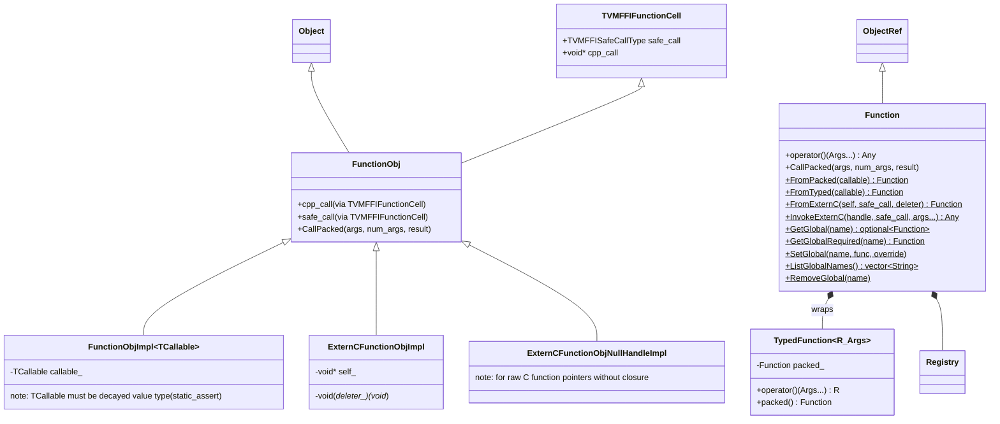
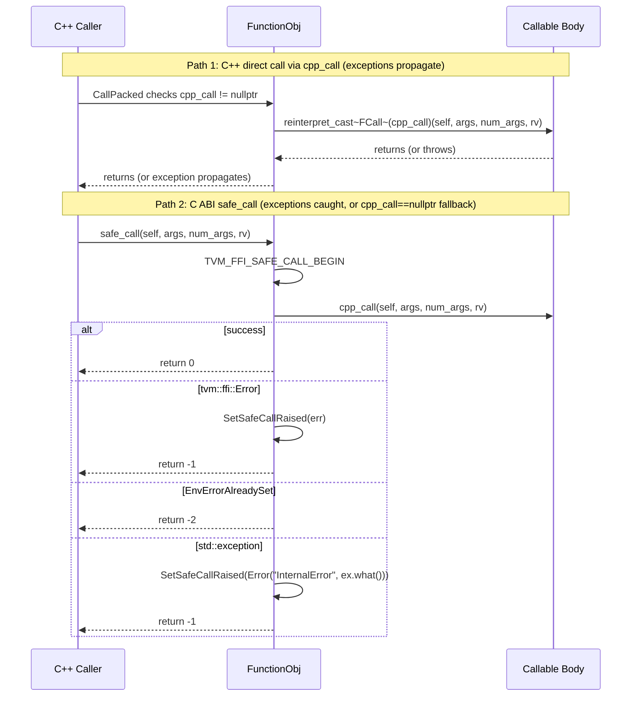

# Function System

**TL;DR**
- `FunctionObj` is the core FFI callable: it holds two function pointers — `cpp_call` (C++ exception-propagating, nullable `void*`) and `safe_call` (C ABI exception-catching, always valid) — via the `TVMFFIFunctionCell` C ABI struct, enabling the same function to be called efficiently within C++ and safely across DLL/language boundaries.
- `Function` is the `ObjectRef` handle, providing `operator()(Args...) -> Any` for natural calling syntax and static methods for global function registration (`SetGlobal`, `GetGlobal`).
- `TypedFunction<R(Args...)>` wraps `Function` with compile-time type checking, and `reflection::GlobalDef` provides a fluent builder API for registering global functions via `TVM_FFI_STATIC_INIT_BLOCK`.

## Problem Statement

### Background
- The FFI needs a single callable abstraction that works across C++, Python, Rust, and dynamically loaded shared libraries.
- Functions must be callable both from C++ (where exceptions propagate naturally) and from C (where exceptions must be caught and converted to error codes).
- Global function registration enables cross-language discovery: C++ registers "my.func", Python looks it up by name.

### Solution
- `FunctionObj` inherits from both `Object` (for refcounting) and `TVMFFIFunctionCell` (for C ABI exposure), providing dual calling paths.
- The "packed" calling convention passes all arguments as `AnyView[]` and returns `Any*`, enabling type-erased calls.
- `Function::FromTyped` wraps typed C++ callables into the packed convention via template metaprogramming (`details::unpack_call`).

### Goals
- **Goal**: Single callable type usable from all FFI languages.
- **Goal**: Zero-overhead C++ calls (no exception catching) + safe C ABI calls (exception catching).
- **Goal**: Simple registration API for exposing C++ functions to other languages.
- **Non-goal**: Not a replacement for `std::function`; specifically designed for cross-language packed calling.

## Design



**Dual-call architecture**:



### Key Classes, Fields and Interfaces

**`FunctionObj`** — the callable object:
```cpp
class FunctionObj : public Object, public TVMFFIFunctionCell {
public:
  typedef void (*FCall)(const FunctionObj*, const AnyView*, int32_t, Any*);
  using TVMFFIFunctionCell::cpp_call;   // void* — C++ fast-call pointer, NULL for non-C++ functions
  using TVMFFIFunctionCell::safe_call;  // TVMFFISafeCallType — always valid

  void CallPacked(const AnyView* args, int32_t num_args, Any* result) const;
  // Dispatch: cpp_call ? reinterpret_cast<FCall>(cpp_call)(...) : CppCallDedirectToSafeCall(...)

  static constexpr uint32_t _type_index = kTVMFFIFunction;  // 68
  static constexpr const char* _type_key = "ffi.Function";
  TVM_FFI_DECLARE_OBJECT_INFO_STATIC("ffi.Function", FunctionObj, Object);

private:
  static void CppCallDedirectToSafeCall(const FunctionObj*, const AnyView*, int32_t, Any*);
};
```

**`Function`** — ref handle with static factory methods:
```cpp
class Function : public ObjectRef {
public:
  template<typename... Args>
  Any operator()(Args&&... args) const;

  void CallPacked(const AnyView* args, int32_t num_args, Any* result) const;
  void CallPacked(PackedArgs args, Any* result) const;

  // Construction (all use perfect forwarding since 889bfb3)
  template<typename TCallable> static Function FromPacked(TCallable&&);
  template<typename TCallable> static Function FromTyped(TCallable&&);
  template<typename TCallable> static Function FromTyped(TCallable&&, std::string name);
  static Function FromExternC(void* self, TVMFFISafeCallType, void(*deleter)(void*));
  // When self==nullptr && deleter==nullptr: creates ExternCFunctionObjNullHandleImpl
  // ImportFromExternDLL has been REMOVED (4fe8b2b)

  // Global registry
  static std::optional<Function> GetGlobal(std::string_view name);
  static Function GetGlobalRequired(std::string_view name);
  static void SetGlobal(std::string_view name, Function func, bool override = false);
  static std::vector<String> ListGlobalNames();
  static void RemoveGlobal(const String& name);

  TVM_FFI_DEFINE_OBJECT_REF_METHODS_NULLABLE(Function, ObjectRef, FunctionObj);
};
```

**`reflection::GlobalDef`** — fluent builder for global function registration (replaces `Function::Registry`):
```cpp
class GlobalDef : public ReflectionDefBase {
public:
  template<typename Func, typename... Extra>
  GlobalDef& def(const char* name, Func&& func, Extra&&... extra);

  template<typename Func, typename... Extra>
  GlobalDef& def_packed(const char* name, Func func, Extra&&... extra);

  template<typename Func, typename... Extra>
  GlobalDef& def_method(const char* name, Func&& func, Extra&&... extra);
};
// Used inside TVM_FFI_STATIC_INIT_BLOCK, registers via TVMFFIFunctionSetGlobalFromMethodInfo
```

**`TypedFunction<R(Args...)>`** — compile-time typed wrapper:
```cpp
template<typename R, typename... Args>
class TypedFunction<R(Args...)> {
  Function packed_;
public:
  R operator()(Args... args) const;   // calls packed_ and casts result
  operator Function() const;          // implicit to Function
  const Function& packed() const;
};
```

**`TVM_FFI_SAFE_CALL_BEGIN/END` macros** — exception boundary:
```cpp
// Pseudocode expansion:
try {
  // ... function body ...
  return 0;                        // success
} catch (const tvm::ffi::Error& err) {
  SetSafeCallRaised(err);          // store in TLS
  return -1;
} catch (const EnvErrorAlreadySet&) {
  return -2;                       // frontend error
} catch (const std::exception& ex) {
  SetSafeCallRaised(Error("InternalError", ex.what(), ""));
  return -1;
}
```

**`TVM_FFI_DLL_EXPORT_INCLUDE_METADATA`** — compile-time flag (default 0):
```cpp
// When 0 (default): TVM_FFI_DLL_EXPORT_TYPED_FUNC exports only the function symbol.
// When 1: TVM_FFI_DLL_EXPORT_TYPED_FUNC additionally exports a __tvm_ffi__metadata_<name>
//   companion symbol, and TVM_FFI_DLL_EXPORT_TYPED_FUNC_DOC becomes active.
// Set via: -DTVM_FFI_DLL_EXPORT_INCLUDE_METADATA=1 or #define before #include <tvm/ffi/function.h>
#ifndef TVM_FFI_DLL_EXPORT_INCLUDE_METADATA
#define TVM_FFI_DLL_EXPORT_INCLUDE_METADATA 0
#endif
```

**`TVM_FFI_DLL_EXPORT_TYPED_FUNC_IMPL_(ExportName, Function)` macro** (internal) — factored-out C ABI wrapper generation (ac7bf68):
```cpp
// Expands to:
extern "C" {
TVM_FFI_DLL_EXPORT int __tvm_ffi_##ExportName(void* self, const TVMFFIAny* args,
                                                int32_t num_args, TVMFFIAny* result) {
  TVM_FFI_SAFE_CALL_BEGIN();
  using FuncInfo = ::tvm::ffi::details::FunctionInfo<decltype(Function)>;
  static std::string name = #ExportName;
  ::tvm::ffi::details::unpack_call<typename FuncInfo::RetType>(
      std::make_index_sequence<FuncInfo::num_args>{}, &name, Function,
      reinterpret_cast<const ::tvm::ffi::AnyView*>(args), num_args,
      reinterpret_cast<::tvm::ffi::Any*>(result));
  TVM_FFI_SAFE_CALL_END();
}
}
// Not for direct use; used by TVM_FFI_DLL_EXPORT_TYPED_FUNC.
```

**`TVM_FFI_DLL_EXPORT_TYPED_FUNC(ExportName, Function)` macro** — exports a typed C++ function as a C ABI symbol with the `__tvm_ffi_` prefix:
```cpp
// When TVM_FFI_DLL_EXPORT_INCLUDE_METADATA == 0 (default):
//   Expands to: TVM_FFI_DLL_EXPORT_TYPED_FUNC_IMPL_(ExportName, Function)
//   Emits only __tvm_ffi_<ExportName>.
//
// When TVM_FFI_DLL_EXPORT_INCLUDE_METADATA == 1:
//   Expands to: TVM_FFI_DLL_EXPORT_TYPED_FUNC_IMPL_(ExportName, Function) + metadata symbol:
extern "C" {
TVM_FFI_DLL_EXPORT int __tvm_ffi__metadata_##ExportName(void* self, const TVMFFIAny* args,
                                                         int32_t num_args, TVMFFIAny* result) {
  TVM_FFI_SAFE_CALL_BEGIN();
  using FuncInfo = ::tvm::ffi::details::FunctionInfo<decltype(Function)>;
  // Returns JSON: {"type_schema": "<escaped type schema>"}
  std::ostringstream os;
  os << R"({"type_schema":)" << EscapeString(String(FuncInfo::TypeSchema())) << R"(})";
  String str(os.str());
  TypeTraits<String>::MoveToAny(std::move(str), result);
  TVM_FFI_SAFE_CALL_END();
}
}
// The emitted C symbol is __tvm_ffi_ExportName (not ExportName).
// Module::GetFunction("ExportName") resolves this via GetSymbolWithSymbolPrefix.
// Used for shared library module exports (loadable via Module::LoadFromFile).
```

**`TVM_FFI_DLL_EXPORT_TYPED_FUNC_DOC(ExportName, DocString)` macro** — exports documentation for an exported function (ac7bf68):
```cpp
// When TVM_FFI_DLL_EXPORT_INCLUDE_METADATA == 1:
extern "C" {
TVM_FFI_DLL_EXPORT int __tvm_ffi__doc_##ExportName(void* self, const TVMFFIAny* args,
                                                    int32_t num_args, TVMFFIAny* result) {
  TVM_FFI_SAFE_CALL_BEGIN();
  String str(DocString);
  TypeTraits<String>::MoveToAny(std::move(str), result);
  TVM_FFI_SAFE_CALL_END();
}
}
// When TVM_FFI_DLL_EXPORT_INCLUDE_METADATA == 0: no-op.
// The emitted C symbol is __tvm_ffi__doc_<ExportName> (double underscore = internal).
// LibraryModuleObj::GetFunctionDoc resolves this via lib_->GetSymbol(tvm_ffi_doc_prefix + name).
```

**`ArgTypeSupported<T>`** — compile-time predicate for supported FFI argument types (583e4b7):
```cpp
/// Supported: T, const T, const T&, T&&. NOT supported: T& (non-const lvalue reference).
template <typename T>
static constexpr bool ArgTypeSupported =
    (!std::is_reference_v<T>) ||
    (std::is_const_v<std::remove_reference_t<T>> && std::is_lvalue_reference_v<T>) ||
    (!std::is_const_v<std::remove_reference_t<T>> && std::is_rvalue_reference_v<T>);
```

**`ArgValueWithContext<Type>`** — per-argument context wrapper (583e4b7):
```cpp
// Was non-template ArgValueWithContext; now parameterized by the expected argument type.
template <typename Type>
class ArgValueWithContext {
  using TypeWithoutCR = std::remove_const_t<std::remove_reference_t<Type>>;
  const AnyView* arg_;
  int32_t i_;
public:
  operator TypeWithoutCR();  // converts via try_cast<TypeWithoutCR>
};
```
This change from non-template to template fixes interaction with classes that have template constructors (e.g., `std::optional<T>`).

**`FunctionObjImpl<TCallable>` perfect-forwarding invariant** (889bfb3, updated 84c5bdb):
```cpp
template <typename TCallable>
class FunctionObjImpl : public FunctionObj {
  static_assert(!std::is_reference_v<TCallable> && !std::is_const_v<TCallable>,
                "TCallable must be a decayed value type");
  TCallable callable_;
public:
  // Variadic forwarding constructor (84c5bdb, replaces two explicit ctors)
  template <typename... Args>
  explicit FunctionObjImpl(Args&&... args) : callable_(std::forward<Args>(args)...) { ... }
  // Copy/assignment deleted
  TCallable* GetCallable();  // accessor for post-construction mutation (84c5bdb)
};
```
The entire construction chain (`Function(TCallable&&)` -> `FromPacked(TCallable&&)` -> `FromPackedInternal(TCallable&&)` -> `FunctionObjImpl`) uses perfect forwarding. SFINAE guards (`!std::is_same_v<std::decay_t<TCallable>, Function>`) prevent forwarding constructors from hijacking copy/move construction. The variadic constructor enables in-place construction (used by `FromPackedInplace`).

**`Function::FromPackedInplace<TCallable>(Args...) -> std::tuple<Function, TCallable*>`** (84c5bdb):
```cpp
template <typename TCallable, typename... Args>
static auto FromPackedInplace(Args&&... args);
// static_assert: TCallable == decay_t<TCallable>
// static_assert: TCallable is invocable with (const AnyView*, int32_t, Any*)
// Creates FunctionObjImpl<TCallable> with in-place construction
// Returns (Function, pointer-to-embedded-callable) for post-construction mutation
```
This factory is the key enabler for the overload dispatch system: the embedded callable (e.g., `OverloadedFunction`) is constructed in-place, and the returned pointer allows registering additional overloads after function creation.

### Contracts, Assumptions and Invariants
- **Dual-pointer invariant**: Every `FunctionObj` has `safe_call` always set to a valid function pointer. `cpp_call` may be NULL (for non-C++ functions such as extern C or imported DLL functions), in which case `CallPacked` falls back through `safe_call` via `CppCallDedirectToSafeCall`. When `cpp_call` is non-NULL, it points to a C++ function that may throw.
- **Result initialization**: Callers must set `result->type_index < kTVMFFIStaticObjectBegin` before calling. The `SafeCall` wrapper asserts this with `TVM_FFI_ICHECK_LT`.
- **DLL boundary safety**: Cross-DLL functions always dispatch through `safe_call` directly (with `cpp_call == nullptr`). The former `ImportFromExternDLL` and `ImportedFunctionObjImpl` have been removed; `ExternCFunctionObjNullHandleImpl` handles raw C function pointers without closure.
- **Registration is fire-and-forget**: `TVM_FFI_STATIC_INIT_BLOCK() { ... }` triggers at program startup (via `__attribute__((constructor))` on GCC/Clang, or static-variable-driven function call on MSVC). The function is immediately available in the global registry.
- **Duplicate registration guard**: Registering the same global function name twice via `GlobalDef` throws a descriptive `RuntimeError` logged to stderr.

**`TVMFFIPyMLIRPackedSafeCall`** — MLIR packed calling convention adapter (added in f6303b2, `tvm_ffi_python_helpers.h`):
```cpp
class TVMFFIPyMLIRPackedSafeCall {
public:
  TVMFFIPyMLIRPackedSafeCall(void (*mlir_packed_safe_call)(void**), PyObject* keep_alive_object);
  ~TVMFFIPyMLIRPackedSafeCall();  // Py_DecRef(keep_alive_object_)
  static int Invoke(void* func, const TVMFFIAny* args, int32_t num_args, TVMFFIAny* rv);
  static void Deleter(void* self);
private:
  void (*mlir_packed_safe_call_)(void**);
  PyObject* keep_alive_object_;
};
```
Adapts the MLIR execution engine's `void(*)(void**)` packed convention to TVM FFI's `TVMFFISafeCallType`. The `Invoke` method packs TVM FFI arguments into the MLIR `void**` layout: `[0]=handle(null), [1]=args, [2]=num_args, [3]=rv, [4]=ret_code`.

**`FunctionInfo` specializations for pointer-to-member** (`function_details.h`, fixed in cdc1ccc):
```cpp
// Includes Class* (non-const) or const Class* (const member) in the parameter pack
// so TypeSchema() correctly reports self as the first argument
template <typename Class, typename R, typename... Args>
struct FunctionInfo<R (Class::*)(Args...)> : FuncFunctorImpl<R, Class*, Args...> {};
template <typename Class, typename R, typename... Args>
struct FunctionInfo<R (Class::*)(Args...) const> : FuncFunctorImpl<R, const Class*, Args...> {};
```

### Extension Points
- **New calling conventions**: Subclass `FunctionObj` and set `safe_call`/`cpp_call` (see `ExternCFunctionObjImpl`, `ExternCFunctionObjNullHandleImpl`, `TVMFFIPyMLIRPackedSafeCall` as examples).
- **Method registration**: `set_body_method` supports both `ObjectRef` and `Object` subclass methods, automatically wrapping with the appropriate self-parameter handling.
- **External C functions**: `Function::FromExternC` wraps C function pointers; `ExternCFunctionObjNullHandleImpl` handles the lightweight case with no closure. `Function::InvokeExternC` (9186b44) provides a zero-allocation direct-call path that bypasses `Function` object construction entirely.
- **MLIR JIT integration**: `TVMFFIPyMLIRPackedSafeCall` provides the bridge from MLIR execution engine JIT output (`void(*)(void**)`) to TVM FFI functions. The Python entry point is `Function.__from_mlir_packed_safe_call__`.
- **Python subclassing**: `tvm_ffi.Function` (Cython cdef class) can be subclassed with metadata mixins. Required workarounds (59c91c1): explicit mixin `__init__` (not `super()`), `__call__ = tvm_ffi.Function.__call__` reassignment, `__move_handle_from__` for handle transfer.

### Usage Examples

#### Registering and calling a global function with GlobalDef
**Context**: Defining a function in C++ that Python or Rust can discover and call by name.
```cpp
// C++ side: register via GlobalDef (the sole registration path)
TVM_FFI_STATIC_INIT_BLOCK() {
  namespace refl = tvm::ffi::reflection;
  refl::GlobalDef()
      .def("testing.add", [](int a, int b) -> int { return a + b; });
}

// C++ side: call
Function f = Function::GetGlobalRequired("testing.add");
int result = f(1, 2).cast<int>();  // result == 3

// With TypedFunction for compile-time safety:
TypedFunction<int(int, int)> typed_add = f;
int result2 = typed_add(3, 4);     // result2 == 7

// Python side (via Cython binding):
// f = tvm_ffi.get_global_func("testing.add")
// result = f(1, 2)  # returns 3
```

#### Exporting a typed function from a shared library
**Context**: Making a typed function callable from Module::LoadFromFile.
```cpp
int AddOne_(int x) { return x + 1; }
TVM_FFI_DLL_EXPORT_TYPED_FUNC(AddOne, AddOne_);
// Creates extern "C" symbol "__tvm_ffi_AddOne" with TVMFFISafeCallType signature
// Loadable via: mod->GetFunction("AddOne")(42)  // resolves __tvm_ffi_AddOne, returns 43
```

#### Direct invocation via InvokeExternC (zero-allocation)
**Context**: Calling an `extern "C"` symbol directly without constructing a `Function` object (9186b44).
```cpp
// Given an exported extern "C" symbol:
extern "C" int __tvm_ffi_testing_add1(
    void* handle, const TVMFFIAny* args, int32_t num_args, TVMFFIAny* result);

// Direct invocation -- no Function object, no heap allocation:
int result = Function::InvokeExternC(nullptr, __tvm_ffi_testing_add1, 1).cast<int>();
// result == 2
```

#### Subclassing tvm_ffi.Function in Python
**Context**: Attaching custom metadata to an FFI function via Python inheritance (59c91c1).
```python
class JitFunction:
    def __init__(self, metadata):
        self.metadata = metadata

class MyFunction(tvm_ffi.Function, JitFunction):
    def __init__(self, metadata):
        JitFunction.__init__(self, metadata)  # Cannot use super() for cdef class
    __call__ = tvm_ffi.Function.__call__      # Must reassign (cdef inheritance quirk)

f = tvm_ffi.convert(lambda x: x)
f_sub = MyFunction(128)
f_sub.__move_handle_from__(f)  # transfer handle from existing function
assert f_sub(2) == 2 and f_sub.metadata == 128
```

#### Exporting a function with metadata and documentation (cross-layer)
**Context**: Embedding type schema and docstrings in a shared library, then querying them from Python. Requires `TVM_FFI_DLL_EXPORT_INCLUDE_METADATA=1`.
```cpp
// C++ side: export function + metadata + doc
#define TVM_FFI_DLL_EXPORT_INCLUDE_METADATA 1
#include <tvm/ffi/function.h>

int Add(int a, int b) { return a + b; }

TVM_FFI_DLL_EXPORT_TYPED_FUNC(add, Add);
TVM_FFI_DLL_EXPORT_TYPED_FUNC_DOC(add, R"(Add two integers.)");
// Emits: __tvm_ffi_add (function), __tvm_ffi__metadata_add (type schema),
//        __tvm_ffi__doc_add (docstring)
```
```python
# Python side: query metadata and doc from loaded module
import tvm_ffi

mod = tvm_ffi.load_module("mylib.so")
metadata = mod.get_function_metadata("add")
# metadata == {"type_schema": '{"type":"ffi.Function","args":[{"type":"int"},{"type":"int"},{"type":"int"}]}'}
doc = mod.get_function_doc("add")
# doc == "Add two integers."
```

#### Creating a Function from an extern C symbol (Python)
**Context**: JIT engines or MLIR execution engines produce raw C function pointers. These factory methods wrap them as first-class `tvm_ffi.Function` objects.
```python
import tvm_ffi

# From a TVMFFISafeCallType C symbol address:
c_symbol_addr = get_jit_symbol("my_kernel")  # int
func = tvm_ffi.Function.__from_extern_c__(c_symbol_addr)
func(42)  # calls the C function

# From an MLIR packed void(*)(void**) symbol, keeping the JIT engine alive:
mlir_symbol = get_mlir_jit_symbol("my_kernel")  # int
func = tvm_ffi.Function.__from_mlir_packed_safe_call__(
    mlir_symbol, keep_alive_object=engine
)
func(42)  # MLIR packed convention adapted to TVM FFI
```

## Alternatives & Trade-offs
### Single calling convention (safe_call only)
- Pros: Simpler, one path to maintain.
- Cons: Exception catching on every C++ internal call adds overhead. The dual-path design avoids try/catch on the hot path when calling within the same DLL.

### Virtual dispatch for call/safe_call
- Pros: Standard polymorphism, no function pointer members.
- Cons: vtable lookup on every call. The direct function pointer approach is measurably faster for the packed function hot path.

## Related Work
### Design Docs & ADRs
- [0001-c-abi-layer.md](.knowledge/designs/0001-c-abi-layer.md) — TVMFFISafeCallType and C ABI error return codes
- [0002-any-value-system.md](.knowledge/designs/0002-any-value-system.md) — AnyView/Any used for arguments and return values
- [0006-error-handling.md](.knowledge/designs/0006-error-handling.md) — Error propagation via TVM_FFI_SAFE_CALL macros
- [0009-reflection.md](.knowledge/designs/0009-reflection.md) — GlobalDef and reflection-based function registration
- [0002-tls-error-propagation.md](.knowledge/ADRs/0002-tls-error-propagation.md) — TLS error propagation decision
- [0008-globaldef-over-register-global.md](.knowledge/ADRs/0008-globaldef-over-register-global.md) — Decision to replace Function::Registry with GlobalDef
- [0023-opt-in-metadata-export.md](.knowledge/ADRs/0023-opt-in-metadata-export.md) — Decision to make metadata export opt-in via TVM_FFI_DLL_EXPORT_INCLUDE_METADATA, and separate doc from metadata symbols

### Evidence Matrix
- FunctionObj dual-call architecture -> `2025-05-06-7d34eb8.md` + `function.h` lines 84-115
- Function ref handle and operator() -> `function.h` lines 297-553
- GlobalDef builder -> `2025-07-03-b333288.md` + `reflection/registry.h`
- TVM_FFI_DLL_EXPORT_TYPED_FUNC macro -> `2025-05-29-192f196e.md` + `function.h`
- Function::Registry removal -> `2025-07-15-26b68b0.md`
- TypedFunction wrapper -> `function.h` lines 593-721
- FunctionObjImpl/ExternCFunctionObjImpl/ImportedFunctionObjImpl -> `function.h` lines 124-214
- TVM_FFI_SAFE_CALL_BEGIN/END macros -> `function.h` lines 46-67
- ImportFromExternDLL DLL detection -> `function.h` lines 344-356
- Function.__from_extern_c__ Python binding -> `2025-10-10-a15364746d60.md` (a153647)
- TVMFFIPyMLIRPackedSafeCall adapter + Function.__from_mlir_packed_safe_call__ -> `2025-10-11-f6303b23.md` (f6303b2)
- FunctionInfo member pointer fix (Class* in param pack) -> `2025-10-07-c046b171.md` (c046b17)
- ArgTypeSupported<T>, ArgValueWithContext<Type> template, const T&/T&&/const T support -> `2025-11-10-583e4b73c11aa3257e7be862834b98f33c39a6dd.md` (583e4b7)
- Perfect forwarding chain, FunctionObjImpl static_assert, SFINAE guards -> `2025-11-17-889bfb360b5afa6f7b50774cba53e7e625ea1e8f.md` (889bfb3)
- TVM_FFI_DLL_EXPORT_INCLUDE_METADATA flag, TVM_FFI_DLL_EXPORT_TYPED_FUNC_DOC, metadata/doc export protocol -> `2025-11-20-ac7bf68058b392c3a8475619016fde48bd08334b.md` (ac7bf68) plus 1 supporting commit (a999de6, clang-tidy fixes)
- FunctionObjImpl variadic ctor, FromPackedInplace, GetCallable -> `2025-12-23-84c5bdbcd11ae0e5bc921db4f35d3fd1d3ae762c.md` (84c5bdb) + `function.h`, `reflection/overload.h`
