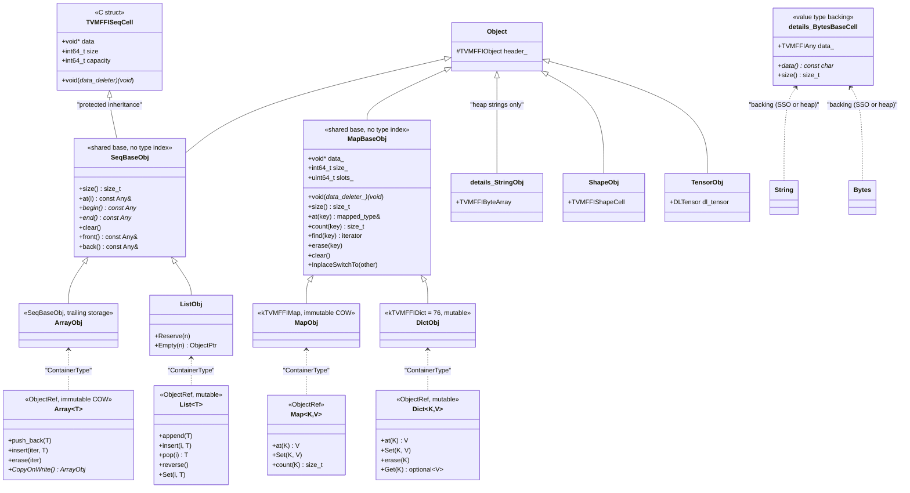
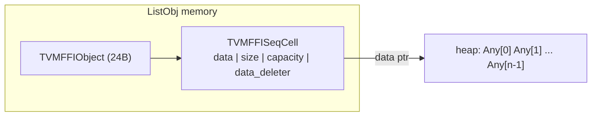
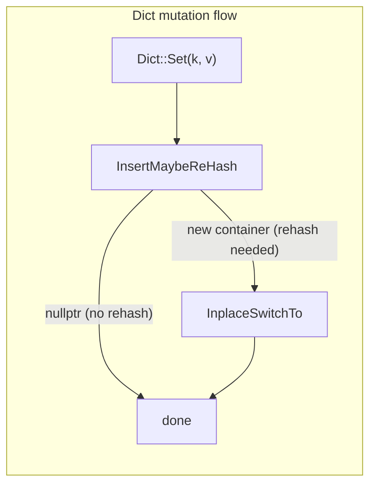
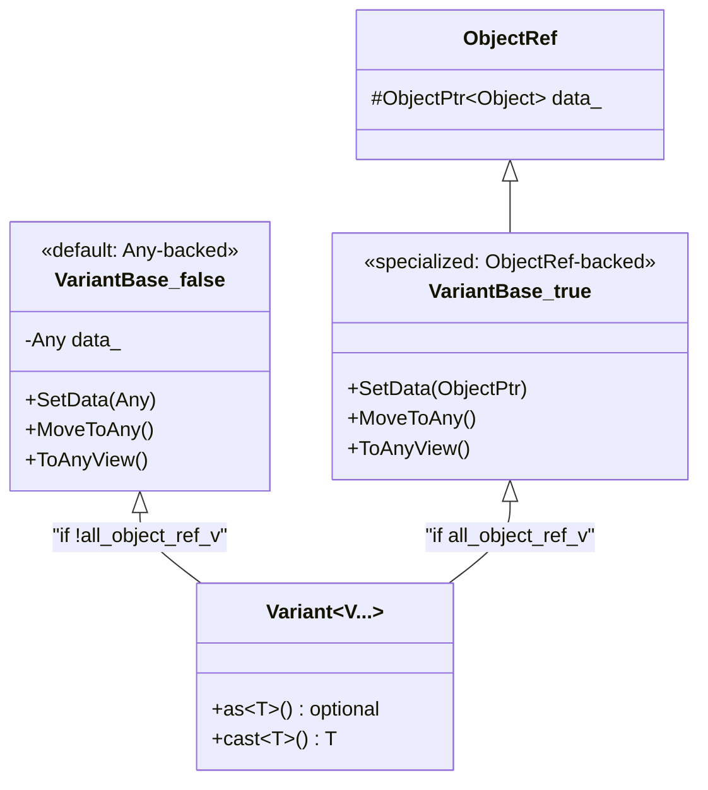

# Container System

**TL;DR**
- The FFI provides typed containers (`Array<T>`, `List<T>`, `Map<K,V>`, `Dict<K,V>`, `String`, `Bytes`, `Shape`, `Tensor`, `Tuple<Ts...>`, `Variant<Vs...>`) that are all `Object` subclasses, enabling storage in `Any`, cross-FFI passing, and ref-counting.
- `ArrayObj` and `ListObj` inherit from `SeqBaseObj` (which wraps `TVMFFISeqCell`), sharing sequence operations (element access, iteration, bounds checking). `ArrayObj` is immutable (COW), `ListObj` is mutable (direct mutation, no COW).
- `MapBaseObj` is the shared base class for both `MapObj` (immutable) and `DictObj` (mutable), extracted in commit `5a6b211` (#462). It holds the hash table internals (`data_`, `size_`, `slots_`, `data_deleter_`) and concrete subclasses `SmallMapBaseObj` / `DenseMapBaseObj`. `MapObj` and `DictObj` differ only in type index and mutability semantics.
- `ArrayObj` and `MapBaseObj` use a `void* data_` / `data_deleter_` indirection pattern that decouples element storage from the object itself, enabling future non-inplace allocation and cross-DLL-safe deallocation.
- `Variant<V...>` uses dual storage: when all types are `ObjectRef` subclasses, it inherits from `ObjectRef` (8 bytes) instead of `Any` (16 bytes), halving storage.

## Problem Statement

### Background

An FFI system needs first-class container types that can be passed between languages. Containers must be type-safe within C++ while being type-erased at the ABI boundary. Containers must support efficient element access without per-element heap allocation.

### Solution

A set of container objects built on the `Object` system with inplace allocation for dense storage and type erasure via `Any` elements. Typed wrappers (`Array<T>`, `Map<K,V>`) add compile-time type checking with runtime validation via `CheckAnyStrict`.

### Goals

- **Goal**: Pass arrays, maps, strings, and tensors across FFI boundaries as first-class objects.
- **Goal**: Cache-friendly storage via inplace (trailing) allocation.
- **Goal**: Type-safe element access in C++ while maintaining universal `Any`-based storage.
- **Goal**: Cross-DLL-safe deallocation via `data_deleter_` callbacks.
- **Non-goal**: Thread-safe concurrent mutation (containers are designed for single-writer patterns with COW).

## Design

### Container Hierarchy



### SeqBaseObj: Shared Sequence Base

`SeqBaseObj` (`include/tvm/ffi/container/seq_base.h`, introduced in commit `9513c2f` #443) is an intermediate base class for `ArrayObj` and `ListObj` that consolidates shared sequence operations. It inherits from both `Object` and `TVMFFISeqCell` (C ABI struct with `data`, `size`, `capacity`, `data_deleter`).

`SeqBaseObj` is transparent to the FFI type system -- it has no type index of its own. This follows the same pattern as `BytesObjBase` (a shared base that does not appear in the type hierarchy).

**Shared operations** (on `SeqBaseObj`):
- `size()`, `capacity()`, `empty()` -- basic queries
- `operator[]`, `at()` -- bounds-checked element access (throws `IndexError`)
- `front()`, `back()` -- first/last element access (throws `IndexError` when empty)
- `begin()`, `end()` -- const iterators over `const Any*`
- `clear()` -- destruct all elements (calls `Any::~Any` explicitly)
- Destructor: destructs all elements and calls `data_deleter` if non-null

**Memory layout**: `[TVMFFIObject (24B)] [TVMFFISeqCell: data(8B) + size(8B) + capacity(8B) + data_deleter(8B)]`.

See [ADR 0059](../ADRs/0059-seqbase-extraction.md) for the decision to extract this shared base.

### Array: Data Indirection + COW

As of commit `5a6b211` (#462), `ArrayObj` extends `SeqBaseObj` only (no longer also inheriting `InplaceArrayBase<ArrayObj, TVMFFIAny>`). The `InplaceArrayBase` inheritance was removed to simplify the class hierarchy; trailing storage is now managed via raw pointer arithmetic (`reinterpret_cast<char*>(p.get()) + sizeof(ArrayObj)`) rather than `AddressOf(0)`. Elements are accessed via the `data` pointer (from `TVMFFISeqCell`):

```
[TVMFFIObject (24B)] [TVMFFISeqCell: data(8B) + size(8B) + capacity(8B) + data_deleter(8B)]
[TVMFFIAny[0]] [TVMFFIAny[1]] ... [TVMFFIAny[n-1]]
```

For inplace arrays, `data` points to the memory immediately after `sizeof(ArrayObj)`. The `data_deleter` is `nullptr` for inplace arrays. For future non-inplace storage (e.g., externally owned buffers), `data` can point elsewhere and `data_deleter` handles deallocation.

As of commit `07546c7` (#467), `Array<T>::operator[]` returns `const T` (not `T`) to prevent accidental modification of temporary return values and improve compaction behavior.

**Copy-on-write invariant**: Mutation methods (`push_back`, `emplace_back`, `insert`, `erase`) call `CopyOnWrite()` when `use_count() > 1`.

### Array: Bounds Checking and Pythonic Protocol

As of commit `ec56178` (#349), `ArrayObj::operator[]` and `ArrayObj::SetItem` validate negative indices (`i < 0`), throwing `IndexError`. Previously, only the upper bound was checked.

As of commit `5bc7fcd` (#345), `Array` supports the Python `__contains__` protocol (`in` operator). The C++ `ArrayContains` function performs a linear scan comparing elements via `AnyEqual`.

As of commit `46ab644` (#365), `Array` and `Map` support the Python `__bool__` protocol, returning `True` when non-empty. This enables idiomatic Python patterns like `if my_array:` and `if my_map:`.

### List: Mutable Sequence Container

`List<T>` (`include/tvm/ffi/container/list.h`, introduced in commit `9513c2f` #443) is the mutable counterpart to `Array<T>`. `ListObj` extends `SeqBaseObj` with heap-allocated storage (never inplace) and direct mutation semantics (no copy-on-write).



**Key differences from Array**:
- **No COW**: Mutations (`append`, `insert`, `pop`, `Set`, `erase`, `reverse`, `resize`, `clear`, `extend`) operate directly on the shared `ListObj`. Multiple `List<T>` references to the same `ListObj` all observe mutations.
- **Heap-only storage**: `ListObj::Empty(n)` allocates a separate heap buffer via `::operator new(sizeof(Any) * n)` with `data_deleter = RawDataDeleter` (which calls `::operator delete`). No inplace trailing storage.
- **Cycle-capable**: Because `List` is mutable, it can form reference cycles (e.g., a List that contains itself). The serialization, structural hash, structural equal, and JSON writer all include cycle detection guards for List (not needed for immutable Array).
- **Growth strategy**: `Reserve` doubles capacity (`kIncFactor = 2`) with initial capacity `kInitSize = 4`.

**C++ API**:
- `List<T>()` -- empty list
- `List<T>(std::vector<T>)` / `List<T>(std::initializer_list<T>)` -- construct from collection
- `append(T)` / `push_back(T)` -- add to end
- `pop_back()` / `pop(i)` -- remove from end/position
- `insert(i, T)` -- insert at index
- `erase(i)` -- remove at index
- `Set(i, T)` -- replace element at index
- `resize(n, fill)` -- resize with fill value
- `reverse()` -- reverse in-place
- `clear()` -- remove all elements
- `extend(iter)` -- append from iterator range

**Python API**: `List` (`container.py`) inherits `collections.abc.MutableSequence`. Supports `__getitem__`, `__setitem__`, `__delitem__`, `__contains__`, `__len__`, `__iter__`, `__reversed__`, `__bool__`, `append`, `insert`, `pop`, `extend`, slicing, and pickle via JSON serialization.

**C ABI**: `kTVMFFIList = 75` type index. `TVMFFISeqCell` is the shared C struct that both `ArrayObj` and `ListObj` inherit.

**`TypeTraits<std::vector<T>>`**: `TryCastFromAnyView` accepts both `kTVMFFIArray` and `kTVMFFIList`, enabling C++ code to seamlessly consume either container type as a `std::vector`.

### MapBaseObj: Shared Hash Table Base

As of commit `5a6b211` (#462), the hash table internals that previously lived in `MapObj` were extracted into `MapBaseObj` (`include/tvm/ffi/container/map_base.h`). `MapBaseObj` is transparent to the FFI type system (no type index), following the same pattern as `SeqBaseObj` and `BytesObjBase`. Both `MapObj` (immutable) and `DictObj` (mutable) inherit from `MapBaseObj`, differing only in type index and mutation semantics. See [ADR 0063](../ADRs/0063-mapbaseobj-shared-map-base.md).

The previous `container_details.h` was removed; its contents were absorbed into `map_base.h`.

`MapBaseObj` has two concrete internal subclasses:
- **`SmallMapBaseObj`**: Inplace array of `KVRawStorageType` entries for small maps.
- **`DenseMapBaseObj`**: Separately heap-allocated `Block` array for large maps.

`MapBaseObj` fields:
- `void* data_`: Points to element storage (inplace for `SmallMapBaseObj`, heap for `DenseMapBaseObj`).
- `int64_t size_`: Number of entries.
- `uint64_t slots_`: Slot count with MSB tag for layout discrimination. The MSB (bit 63) is set for `SmallMapBaseObj` and clear for `DenseMapBaseObj`. Access through `IsSmallMap()`, `NumSlots()`, `SetSlotsAndSmallLayoutTag()`, `SetSlotsAndDenseLayoutTag()` only. Probing uses `% NumSlots()` (modulo).
- `void (*data_deleter_)(void*)`: For `DenseMapBaseObj`, set to `BlockDeleter` to ensure cross-DLL-safe deallocation.

**MSB layout tag**: `MapBaseObj::kSmallTagMask = 1ULL << 63`. `IsSmallMap()` checks `(slots_ & kSmallTagMask) != 0`. `SmallMapBaseObj::NumSlots()` masks off the tag (`slots_ & ~kSmallTagMask`). `DenseMapBaseObj::NumSlots()` returns `slots_` directly (MSB always clear, assertion-guarded). The `TVM_FFI_DISPATCH_MAP` macro uses `IsSmallMap()` for layout dispatch. See [ADR 0017](../ADRs/0017-map-msb-layout-tag.md) for the decision.

```
SmallMapBaseObj slots_: [1 (MSB tag)] [63-bit slot count (masked by NumSlots())]
DenseMapBaseObj slots_: [0 (MSB clear)] [63-bit slot count (identity via NumSlots())]
```

**`KVRawStorageType`**: `struct { TVMFFIAny first; TVMFFIAny second; }` -- a POD-layout-compatible storage type for `InplaceArrayBase`. Separates storage representation from access representation (`std::pair<Any, Any>`), preventing `InplaceArrayBase` from invoking `Any` destructors.

**`InsertMaybeReHash` return-value pattern**: As of commit `c1af3b3` (#463), `InsertMaybeReHash` returns `ObjectPtr<Object>` (a new container if rehashing was needed, `nullptr` otherwise) instead of mutating a pointer-to-pointer. This enables Dict's `Set()` to detect rehashing and call `InplaceSwitchTo` to swap the storage in-place without changing the `ObjectPtr` identity.

### Map: Immutable Hash Table with COW

`MapObj` (`include/tvm/ffi/container/map.h`) extends `MapBaseObj` with type index `kTVMFFIMap`. `Map<K,V>` is the typed ref wrapper providing immutable COW semantics. Mutation methods (`Set`) create a new underlying `MapObj` when `use_count() > 1`.

### Dict: Mutable Hash Table with Shared Reference Semantics

`Dict<K,V>` (`include/tvm/ffi/container/dict.h`, introduced in commit `c1af3b3` #463) is the mutable counterpart to `Map<K,V>`. `DictObj` extends `MapBaseObj` with type index `kTVMFFIDict = 76`. See [ADR 0064](../ADRs/0064-mutable-dict-container.md).



**Key differences from Map**:
- **No COW**: Mutations (`Set`, `erase`, `clear`) operate directly on the shared `DictObj`. Multiple `Dict<K,V>` references to the same `DictObj` all observe mutations immediately.
- **InplaceSwitchTo**: When `InsertMaybeReHash` triggers a rehash, the newly allocated hash table storage is swapped into the existing `DictObj` via `InplaceSwitchTo`, preserving the object identity (pointer stability). This is critical because Dict mutations must be visible through all existing references.
- **Cycle-capable**: Because `Dict` is mutable, it can form reference cycles (e.g., a Dict containing itself as a value). Serialization, structural hash, structural equal, deep copy, and JSON writer include cycle detection for Dict.
- **Python API**: `Dict` (`container.py`) inherits `collections.abc.MutableMapping`. Supports `__getitem__`, `__setitem__`, `__delitem__`, `__contains__`, `__len__`, `__iter__`, `__bool__`, `keys()`, `values()`, `items()`, `get()`, `pop()`, and pickle via JSON serialization.

**C++ API**:
- `Dict<K,V>()` -- empty dict
- `Dict<K,V>(std::initializer_list<std::pair<K,V>>)` -- construct from pairs
- `Dict<K,V>(IterType begin, IterType end)` -- construct from iterator range
- `at(K)` / `operator[](K)` -- read element (throws `KeyError` for missing keys)
- `Set(K, V)` -- insert or update (mutates in-place)
- `erase(K)` -- remove key (mutates in-place)
- `Get(K)` -- returns `std::optional<V>` (`std::nullopt` for missing keys)
- `find(K)` -- returns iterator
- `count(K)`, `size()`, `empty()`, `clear()`

**C ABI**: `kTVMFFIDict = 76` type index. `static_assert(sizeof(DictObj) == sizeof(MapBaseObj))` ensures no extra fields.

**TypeTraits**: `TypeTraits<Dict<K,V>>` extends `MapTypeTraitsBase` with `kPrimaryTypeIndex = kTVMFFIDict` and `kOtherTypeIndex = kTVMFFIMap`, enabling `Dict` to be cast from either Map or Dict sources.

**InplaceSwitchTo mechanism**: `DenseMapBaseObj::InplaceSwitchTo` and `SmallMapBaseObj::InplaceSwitchTo` handle the storage swap differently:
- **Dense-to-dense**: Direct field swap (`data_`, `size_`, `slots_`, `data_deleter_`, `fib_shift_`, `iter_list_head_`, `iter_list_tail_`). The source is zeroed out.
- **Small-to-small**: Field swap with special handling for inplace data: if the source has no `data_deleter_` (inplace storage), an `InplaceSmallMapDeleterFromData` is installed and the source's `ObjectPtr` is leaked to the deleter (preventing double-free). The destination takes ownership via `data_deleter_`.
- **Small-to-dense promotion**: `SmallMapBaseObj::InplaceSwitchTo` handles the case where the source is a `DenseMapBaseObj` (after rehash growth). The destructor of `SmallMapBaseObj` detects this via `IsSmallMap()` and delegates to `DenseMapBaseObj::Reset()`.
- **Invariant**: A `SmallMapBaseObj` that has been switched to dense layout will have `IsSmallMap() == false`. Its destructor checks this and calls the correct `Reset()` method.

### String / Bytes

**`String` and `Bytes` are no longer `ObjectRef` subclasses.** They are value types backed by `details::BytesBaseCell`, which holds a `TVMFFIAny data_` member supporting dual representation:

- **Small strings** (up to 7 bytes): Stored inline as POD in `data_.v_bytes[0..6]` with `type_index = kTVMFFISmallStr` (or `kTVMFFISmallBytes`) and `small_str_len` recording the length. No heap allocation or ref-counting.
- **Heap strings** (8+ bytes): Stored in `details::StringObj` / `details::BytesObj` (which extend `details::BytesObjBase` -> `Object`) with `type_index = kTVMFFIStr` (or `kTVMFFIBytes`). Ref-counted as before.

The threshold constant is `kMaxSmallBytesLen = sizeof(int64_t) - 1 = 7`.

The `Obj` types (`StringObj`, `BytesObj`, `BytesObjBase`) live in `tvm::ffi::details` namespace (moved from `tvm::ffi` to hide implementation types). The public `String` and `Bytes` wrappers remain in `tvm::ffi`.

**Comparison primitives**:
- `Bytes::memequal(a, b, len_a, len_b)` -- dedicated equality check using `std::memcmp` with length short-circuit. Used by `AnyEqual`, `operator==`, and structural equality.
- `Bytes::memncmp(a, b, len_a, len_b)` -- three-way comparison for ordering. Used by `operator<`, `String::compare`.
- `String::compare(const char*)` -- optimized single-pass comparison avoiding `strlen`, detecting null terminator inline.

**Cross-representation equality/hash**: Small and heap strings with the same content compare equal and hash identically. `AnyHash` uses the canonical heap type index (`kTVMFFIStr`/`kTVMFFIBytes`) for small strings.

**Optional<String> / Optional<Bytes>**: Specialized to use `BytesBaseCell(std::nullopt)` (setting `type_index = kTVMFFINone`) rather than `std::optional`, maintaining `sizeof(Optional<String>) == sizeof(String) == 16`.

The `String(std::nullptr_t)` constructor is deleted to enforce non-null invariant.

### String: starts_with() and ends_with() Methods

As of commit `02d1a96` (#395), `String` provides `starts_with()` and `ends_with()` methods mirroring C++20 `std::string::starts_with` / `std::string::ends_with` semantics:

- **`starts_with(const char* prefix)`**: Returns `true` if the string begins with the given prefix. Compares via `std::strncmp` on the underlying `data()`.
- **`ends_with(const char* suffix)`**: Returns `true` if the string ends with the given suffix. Compares the tail of the string via `std::strncmp`.

Both methods work transparently with SSO: they access the underlying data via `data()` and `size()`, which resolve correctly for both small and heap strings.

### String: find() and substr() Methods

As of commit `bd12b26` (#367), `String` provides `find()` and `substr()` methods mirroring `std::string` semantics:

- **`find(str, pos, count)`**: Delegates to `std::string_view::find`. Returns `String::npos` (defined as `static_cast<size_t>(-1)`) when not found. Overloads accept `const String&`, `const char*`, and `(const char*, size_t pos, size_t count)`.
- **`substr(pos, count)`**: Returns a new `String` containing the substring `[pos, pos+count)`. Throws `std::out_of_range` if `pos > size()`. Defaults to the rest of the string if `count` exceeds the available length.

Both methods work transparently with SSO: they access the underlying data via `data()` and `size()`, which resolve correctly for both small and heap strings.

### ShapeView: Non-Owning Shape Reference

`ShapeView` (`include/tvm/ffi/container/shape.h`, introduced in commit `8ca0719`) is a lightweight, non-owning view over shape data (`const int64_t* data, int32_t size`). It reduces managed `Shape` allocations in hot paths by providing read-only access without heap allocation or ref-counting.

- `Tensor::shape()` and `Tensor::strides()` return `ShapeView` instead of `Shape`.
- Implicit conversion between `Shape` and `ShapeView` in both directions.
- Convenience methods: `data_ptr()`, `ndim()`, `numel()`.

### TensorView: Non-Owning Tensor View

`TensorView` (`include/tvm/ffi/container/tensor.h`, introduced in commit `1ec6236` #81) is a non-owning view of a DLTensor. It stores a value-copy of the `DLTensor` struct (not the data) inline, providing access to tensor metadata without retaining a strong reference to the owning `TensorObj`.

```mermaid
classDiagram
    class DLTensor {
        <<C struct>>
        +void* data
        +DLDevice device
        +int32_t ndim
        +DLDataType dtype
        +int64_t* shape
        +int64_t* strides
        +uint64_t byte_offset
    }
    class TensorObj {
        <<Object>>
        +DLTensor dl_tensor
    }
    class Tensor {
        <<ObjectRef>>
        +shape() ShapeView
        +ndim() int32_t
        +data_ptr() void*
        +dtype() DLDataType
    }
    class TensorView {
        <<value type, non-owning>>
        -DLTensor tensor_
        +shape() ShapeView
        +ndim() int32_t
        +data_ptr() void*
        +dtype() DLDataType
        +IsContiguous() bool
    }
    TensorObj --> DLTensor : contains
    Tensor ..> TensorObj : ref wrapper
    TensorView --> DLTensor : value copy
    TensorView ..> Tensor : convertible from
    TensorView ..> "DLTensor*" : convertible from
```

**Key design decisions:**
- Constructible from `const Tensor&` or `const DLTensor*`, but move-from-`Tensor&&` is **deleted** to prevent accidental dangling when the owning Tensor is moved away.
- `TypeTraits<TensorView>` uses `kTVMFFIDLTensorPtr` type index and sets `storage_enabled = false`, preventing storage in `Any` (only `AnyView` is supported). `TryCastFromAnyView` accepts both `kTVMFFIDLTensorPtr` and `kTVMFFITensor` sources.
- Kernel FFI functions should prefer `TensorView` over `Tensor` as argument type to support the broadest range of inputs including non-owning DLTensor pointers from external frameworks.

**Caller responsibility**: The caller must ensure the underlying tensor data (including shape/strides arrays) outlives the `TensorView`.

### Tensor/TensorView: Method-Based API

As of commit `0dcd4d2` (#121), the primary API surface for `Tensor` and `TensorView` is method-based rather than relying on `operator->()` to access the raw `DLTensor` struct. Methods include `data_ptr()`, `ndim()`, `dtype()`, `device()`, `shape()`, `strides()`, `byte_offset()`, `numel()`, `size(idx)`, `stride(idx)`, `IsContiguous()`. The `size(idx)` and `stride(idx)` methods accept negative indices (resolved as `ndim + idx`).

### Tensor/TensorView: Bounds Checking on size() and stride()

As of commit `e54d15d` (#344), both `Tensor::size(idx)` and `Tensor::stride(idx)` (and their `TensorView` counterparts) perform bounds checking after resolving negative indices. If the adjusted index is outside `[0, ndim)`, an `IndexError` is thrown. Previously, out-of-bounds access was undefined behavior (direct array access without validation).

**Failure mode**: Without bounds checking, an out-of-bounds index reads garbage from memory adjacent to the shape/strides arrays. With the fix, callers get a clear `IndexError` with the invalid index and the tensor's dimensionality.

### Tensor: GetDataSize 32-Bit Overflow Fix (commit `a8f0540` #475)

The `GetDataSize(numel, dtype)` utility in `container/tensor.h` computes the byte size of a tensor's data buffer: `(numel * dtype.bits * dtype.lanes + 7) / 8`. On 32-bit platforms (e.g., WebAssembly), the intermediate multiplication can overflow `size_t` (which is 32 bits) even when the final byte count fits within 32 bits.

**Fix**: The intermediate computation is cast to `uint64_t` before the multiplication, then the result is cast back to `size_t`:
```cpp
return static_cast<size_t>(
    (static_cast<uint64_t>(numel) * dtype.bits * dtype.lanes + 7) / 8);
```

**Failure mode (before fix)**: On WASM, large tensor allocations silently computed 0-byte buffer sizes due to overflow, leading to zero-length allocations and subsequent memory corruption.

**Invariant**: The final byte count must still fit within `size_t` on the target platform; the fix only prevents overflow in the intermediate computation.

### Tensor/TensorView: Torch-Compatible API Aliases

As of commit `573d76f` (#167), both `Tensor` and `TensorView` provide method aliases matching PyTorch's ATen tensor API:
- `dim()` -> `ndim()`
- `sizes()` -> `shape()`
- `is_contiguous()` -> `IsContiguous()`

These aliases enable writing code that is compatible with both TVM FFI tensors and PyTorch tensors without conditional dispatch.

### Tensor: Allocator Refactoring for DLPack Alignment

As of commit `f679fe5` (#131), the tensor allocator C APIs were renamed to align with the DLPack standard:
- `TVMFFIEnvSetTensorAllocator` -> `TVMFFIEnvSetDLPackManagedTensorAllocator`
- `TVMFFIEnvGetTensorAllocator` -> `TVMFFIEnvGetDLPackManagedTensorAllocator`

A new `TVMFFIEnvTensorAlloc(prototype, out)` C API was introduced for direct tensor allocation from a `DLTensor` prototype. This simplifies DSL compiler integration by allocating metadata in `libtvm_ffi` (avoiding module unloading order issues). `Tensor::FromDLPackAlloc` was replaced by `Tensor::FromEnvAlloc`.

### Tensor: Inline Shape/Strides Storage

`TensorObj` (renamed from `NDArrayObj` in commit `3a551d8` #18275) stores shape and strides data inline after the object header via `make_inplace_array_object`, eliminating separate `Shape` heap allocations. The former `shape_data_`, `strides_data_`, and `cached_dl_managed_tensor_versioned_` fields were removed from `TensorObj` to minimize its ABI surface.

`TensorObjFromNDAlloc` and `TensorObjFromDLPack` allocate extra `int64_t` elements at the tail for shape/strides data, filled in-place during construction. `ToDLPackVersioned` no longer caches the `DLManagedTensorVersioned*`; it creates a fresh one each call.

### Tensor: Explicit Strides Invariant

`TensorObj` always populates `DLTensor::strides` with explicit contiguous strides rather than leaving `strides == nullptr` (the DLPack convention for contiguous tensors).

- **TensorObjFromNDAlloc**: Always synthesizes contiguous strides from shape.
- **TensorObjFromDLPack**: Synthesizes strides only when `strides == nullptr`; preserves existing non-null strides (which may be non-contiguous).
- **Impact on DLPack export**: Exported `DLManagedTensor` always carries non-null strides. Compliant DLPack consumers accept explicit strides, but consumers that special-case `strides == nullptr` may need updating.

### Tensor: DLPack Import Defaults

As of commit `1b824e8` (#18282), the default DLPack import policy is relaxed:
- `Tensor::FromDLPack` / `Tensor::FromDLPackVersioned` default to `require_alignment=0, require_contiguous=false`, accepting any DLPack tensor regardless of alignment or memory layout.
- `IsDirectAddressDevice()` (`include/tvm/ffi/container/tensor.h`): A free function that returns true for devices using direct pointer-based addressing (CPU, CUDA, CUDAHost, CUDAManaged, ROCm, ROCmHost), false for indirect buffer handle devices.
- `Tensor::IsAligned(size_t alignment)`: Member method for opt-in alignment checking after import.
- Callers who need alignment guarantees should call `tensor.IsAligned(8)` and `tensor.IsContiguous()` after import.

### Tensor: DLPack Export Caching

As of commit `38d2cda`, `TensorObj` caches a `DLManagedTensorVersioned` struct in a `mutable std::atomic<DLManagedTensorVersioned*>` field. `ToDLPackVersioned()` uses lock-free lazy initialization (atomic CAS with `memory_order_release`/`memory_order_acquire`) to avoid repeated heap allocation when the same tensor is exported multiple times. The embedded deleter only decrements the `TensorObj` ref count without freeing the struct; the struct is freed in `~TensorObj()`. See [0020-dlpack-exchange-acceleration](0020-dlpack-exchange-acceleration.md).

### Tensor: Allocator-Based Construction

`Tensor::FromDLPackAlloc(DLPackTensorAllocator allocator, Shape shape, DLDataType dtype, DLDevice device)` (commit `f81ab9c`) creates tensors via an external allocator function pointer, enabling C++ kernels to allocate output tensors using the caller's framework allocator (e.g., `torch.empty`). The allocator is obtained from `TVMFFIEnvGetTensorAllocator()` which reads thread-local storage. See [0020-dlpack-exchange-acceleration](0020-dlpack-exchange-acceleration.md).

### Tuple: Constructor SFINAE Guard

`Tuple<Ts...>` wraps an `ArrayObj`. For single-element tuples (`sizeof...(Types) == 1`), the variadic constructor `Tuple(UTypes&&... args)` has a SFINAE guard using `std::decay_t` (not `std::remove_cv_t`) that excludes the case where the single argument type is `Tuple<Types>`, preventing the forwarding constructor from hijacking copy/move semantics. The use of `std::decay_t` is critical: it strips both references and cv-qualifiers, correctly handling lvalue reference arguments (`Tuple<T>&`) that `std::remove_cv_t` alone would miss.

### Variant: Dual Storage

`Variant<V...>` inherits from `details::VariantBase<details::all_object_ref_v<V...>>`:



- `VariantBase<false>`: Backed by `Any` (16 bytes). Used when any variant type is not an `ObjectRef`.
- `VariantBase<true>`: Inherits `ObjectRef` (8 bytes). Used when all variant types are `ObjectRef`. This halves storage and enables participation in `ObjectPtrHash`/`ObjectPtrEqual`.
- `all_object_ref_v<T...>`: Compile-time fold `(std::is_base_of_v<ObjectRef, T> && ...)`.

### IterAdapter: LegacyRandomAccessIterator

`Array<T>::iterator` is `IterAdapter<Converter, const Any*>`. It satisfies `LegacyRandomAccessIterator` with all required operators including `operator+=`, `operator-=`.

### Key Classes, Fields and Interfaces

- **`SeqBaseObj`** (`include/tvm/ffi/container/seq_base.h`): Shared base for `ArrayObj` and `ListObj`. Inherits `Object` + `TVMFFISeqCell`. Provides `size()`, `at()`, `operator[]`, `front()`, `back()`, `begin()`, `end()`, `clear()`. No type index.
- **`ArrayObj`** (`include/tvm/ffi/container/array.h`): Extends `SeqBaseObj` (as of `5a6b211`, no longer inherits `InplaceArrayBase`). Trailing `TVMFFIAny` elements accessed via raw pointer arithmetic. `at()` returns `const Any&` (by reference).
- **`Array<T>`**: Typed ref wrapper (immutable, COW). Methods: `push_back`, `emplace_back`, `insert`, `erase`, `reserve`, `CopyOnWrite`, `Map`. `operator[]` returns `const T` (as of `07546c7`). In Python, `Array` is generic as `Array[T]` (inheriting `Sequence[T]`), enabling static type parameterization. `__getitem__` returns `T` for index access and `list[T]` for slices (reverted from `Array[T]` for backward compatibility). `__add__`/`__radd__` support concatenation via `itertools.chain`. Constructor accepts any `Iterable[T]`. `__contains__` provides Python `in` operator support (linear scan). `__bool__` returns `True` when non-empty.
- **`ListObj`** (`include/tvm/ffi/container/list.h`): Extends `SeqBaseObj`. Heap-only storage. Mutable, no COW. `Reserve(n)`, `Empty(n)`, `RawDataDeleter`.
- **`List<T>`**: Typed ref wrapper (mutable). Methods: `append`, `push_back`, `pop_back`, `pop`, `insert`, `erase`, `Set`, `resize`, `reverse`, `clear`, `extend`. In Python, `List` inherits `MutableSequence[T]` with full Python sequence protocol.
- **`InplaceArrayBase<ArrayType, ElemType>`**: CRTP base for trailing-element storage.
- **`MapBaseObj`** (`include/tvm/ffi/container/map_base.h`): Shared base for `MapObj` and `DictObj`. No type index. Holds `data_`, `size_`, `slots_`, `data_deleter_`. Provides `size()`, `count()`, `at()`, `find()`, `erase()`, `clear()`, `InplaceSwitchTo()`. Concrete subclasses: `SmallMapBaseObj`, `DenseMapBaseObj`.
- **`MapObj`** (`include/tvm/ffi/container/map.h`): Extends `MapBaseObj`. Type index `kTVMFFIMap`. Immutable (COW via `Map<K,V>`).
- **`DictObj`** (`include/tvm/ffi/container/dict.h`): Extends `MapBaseObj`. Type index `kTVMFFIDict = 76`. Mutable (shared reference semantics via `Dict<K,V>`). `static_assert(sizeof(DictObj) == sizeof(MapBaseObj))`.
- **`Dict<K,V>`**: Typed ref wrapper (mutable). Methods: `at`, `operator[]`, `Set`, `erase`, `Get`, `find`, `count`, `size`, `empty`, `clear`, `begin`, `end`. In Python, `Dict` inherits `MutableMapping[K, V]` with `__getitem__`, `__setitem__`, `__delitem__`, `__contains__`, `keys()`, `values()`, `items()`, `get()`, `pop()`. `__bool__` returns `True` when non-empty.
- **`DenseMapBaseObj`**: Extends `MapBaseObj`. `fib_shift_`, `iter_list_head_`, `iter_list_tail_`. Uses `BlockDeleter` for cross-DLL safety. `DenseMapBaseObj::At` throws `KeyError` (not `IndexError`) for missing keys, aligning with Python `Mapping` protocol. In Python, `Map` is generic as `Map[K, V]` (inheriting `Mapping[K, V]`) with generic `KeysView`, `ValuesView`, `ItemsView`. `Map.get(key)` correctly returns `None` for absent keys. `__bool__` returns `True` when non-empty.
- **`SmallMapBaseObj`**: Extends `MapBaseObj` + `InplaceArrayBase<SmallMapBaseObj, KVRawStorageType>`.
- **`details::StringObj` / `details::BytesObj`**: Extend `details::BytesObjBase` (Object + TVMFFIByteArray). Live in `tvm::ffi::details` namespace.
- **`details::BytesBaseCell`**: Internal dual-storage engine for `String`/`Bytes`. Holds `TVMFFIAny data_`. Provides ref-counting for heap objects, data/size accessors branching on `type_index`, and move/copy operations for `Any`/`AnyView` interop.
- **`String` / `Bytes`**: Value types (not `ObjectRef` subclasses) backed by `BytesBaseCell`. Support SSO for strings up to 7 bytes. `String` provides `starts_with()`, `ends_with()`, `find()`, `substr()` methods, and `String::npos` constant.
- **`TensorView`** (`include/tvm/ffi/container/tensor.h`): Non-owning view over `DLTensor`. Value-semantic copy of the DLTensor struct. `TypeTraits` with `storage_enabled = false`, `field_static_type_index = kTVMFFIDLTensorPtr`. Methods: `shape()`, `strides()`, `data_ptr()`, `ndim()`, `numel()`, `dtype()`, `IsContiguous()`, `size(idx)`, `stride(idx)`, `dim()`, `sizes()`, `is_contiguous()`.
- **`ShapeView`** (`include/tvm/ffi/container/shape.h`): Non-owning view over `const int64_t*` + `int32_t size`. Preferred for passing shape data without heap allocation. `Tensor::shape()` and `Tensor::strides()` return this type.
- **`Tuple<Ts...>`**: Typed tuple backed by ArrayObj. SFINAE-guarded variadic constructor.
- **`Variant<Vs...>`**: Dual-storage variant. `VariantBase<true>` is an `ObjectRef` subclass.

### Contracts, Assumptions and Invariants

- **Array element storage invariant**: For `Array<T>`, every element satisfies `TypeTraits<T>::CheckAnyStrict`.
- **Array COW invariant**: Mutation methods call `CopyOnWrite()` when `use_count() > 1`.
- **List mutability invariant**: `List` is mutable (`_type_mutable = true`). Mutations are visible through all references to the same `ListObj`. No COW.
- **List cycle safety**: Serialization, structural hash, structural equal, and JSON writer include cycle detection for `List` via visited-set guards. Array does not need this because its COW semantics prevent cycles.
- **List heap-only storage**: `ListObj` always allocates a separate heap buffer (`data_deleter = RawDataDeleter`). No inplace trailing storage.
- **Map/Dict KVType size**: `sizeof(MapBaseObj::KVType) == 32`.
- **MSB tag for layout discrimination**: `slots_` MSB is set for `SmallMapBaseObj`, clear for `DenseMapBaseObj`. No code reads `slots_` directly; all access goes through `IsSmallMap()`, `NumSlots()`, or setter methods. `SetSlotsAndDenseLayoutTag` asserts MSB is clear.
- **DenseMapBaseObj::NumSlots() is actual count**: Probing uses `% NumSlots()`.
- **Map/Dict key deduplication**: `MapBaseObj::CreateFromRange` guarantees key uniqueness with last-write-wins semantics for both small maps (`SmallMapBaseObj`) and large maps (`DenseMapBaseObj`). Fixed in `49e2ed4` where the small-map path was previously missing deduplication.
- **Dict mutability invariant**: `Dict` is mutable. Mutations are visible through all references to the same `DictObj`. No COW.
- **Dict InplaceSwitchTo invariant**: After `InplaceSwitchTo`, the destination object retains its identity (same pointer) but holds the source's storage. The source is zeroed out. A `SmallMapBaseObj` that has been switched to dense layout will return `IsSmallMap() == false`; its destructor handles this case.
- **Dict cycle safety**: Serialization, structural hash, structural equal, deep copy, and JSON writer include cycle detection for `Dict` via visited-set guards.
- **Array negative index validation**: `ArrayObj::operator[]` and `SetItem` reject negative indices (throw `IndexError`). Array indices must be in `[0, size_)`.
- **Tensor bounds-checked size/stride**: `Tensor::size(idx)` and `Tensor::stride(idx)` (and `TensorView` counterparts) throw `IndexError` for out-of-bounds adjusted indices (after resolving negative indices).
- **String null-termination**: `StringObj` data is null-terminated.
- **String SSO threshold**: Strings up to 7 bytes are stored inline (POD). Strings of 8+ bytes are heap-allocated.
- **String cross-representation equality**: Small and heap strings with identical content compare equal and hash identically.
- **Cell-at-offset-24**: For `StringObj`, `ShapeObj`, `TensorObj`.
- **Cross-DLL deallocation**: `data_deleter_` ensures memory allocated in one shared library is freed using the same allocator.
- **Tuple forwarding guard**: Single-element `Tuple` variadic constructor is SFINAE-disabled when the argument is a `Tuple`. Uses `std::decay_t` (not `std::remove_cv_t`) to handle lvalue references correctly.
- **Tensor strides are always non-null**: `TensorObj::strides` is guaranteed non-null for all Tensors created via `TensorObjFromNDAlloc` or `TensorObjFromDLPack`. Code should use `IsContiguous()` rather than `strides == nullptr` to check contiguity.
- **TensorView non-owning safety**: Move-from-`Tensor&&` is deleted. `storage_enabled = false` prevents storing in `Any`. Caller must ensure data outlives the view.
- **TensorView type dispatch**: `TryCastFromAnyView` accepts both `kTVMFFIDLTensorPtr` (direct) and `kTVMFFITensor` (via `TVMFFITensorGetDLTensorPtr`).
- **FFI namespace scoping (all types)**: All FFI container and utility types (`Array`, `Map`, `String`, `Bytes`, `Optional`, `Variant`, `Tuple`, `make_object`, `GetRef`, `GetObjectPtr`) live exclusively in `tvm::ffi::`. No `using ffi::X` aliases exist in the `tvm::` namespace. The `Tuple` alias was removed in `ed56a5e` (#18192); all remaining aliases were removed in `e9d2946` (#18280) as preparation for FFI package isolation.

### Extension Points

- **Non-inplace array storage**: Set `data` to an external buffer and `data_deleter` to the appropriate free function.
- **New sequence containers**: New sequence types can extend `SeqBaseObj` to reuse shared iteration, bounds checking, and element access. The `TVMFFISeqCell` C ABI struct provides a stable layout.
- **New container types**: Define `*Obj` inheriting `Object` (or `SeqBaseObj` for sequences), register via macro.
- **Custom hash/equality**: `Map` and `Dict` use `AnyHash`/`AnyEqual` by default. Object types can register `__any_hash__`/`__any_equal__` via `TypeAttrColumn` to customize value-level hashing/equality.
- **Dict freeze to Map**: `MapBaseObj` is shared between `MapObj` and `DictObj`. A future `Dict::freeze()` could convert a mutable Dict to an immutable Map by changing the type index, since the storage layout is identical.

## Alternatives & Trade-offs

### Alternative: Pure inplace allocation (no data_ indirection)

- Pros: Simpler, one fewer pointer per container
- Cons: Cannot support external buffers or cross-DLL-safe deallocation. The data_ pattern adds one pointer + one function pointer per instance but enables flexible storage strategies.

### Alternative: Bitwise-AND probing for DenseMapObj (power-of-two slots)

- Pros: Slightly faster probing (AND vs modulo)
- Cons: The previous `slots_ = n_slots - 1` convention created off-by-one errors in `CalcNumBlocks`, `IsFull`, and rehash. Modulo is slightly slower but eliminates a class of subtle bugs.

## Related Work

### Design Docs & ADRs

- [`.knowledge/designs/0002-any-system.md`](0002-any-system.md) -- `CheckAnyStrict` invariant
- [`.knowledge/designs/0003-object-system.md`](0003-object-system.md) -- All containers are `Object` subclasses
- [`.knowledge/designs/0001-c-abi.md`](0001-c-abi.md) -- Cell-at-offset-24 convention
- [`.knowledge/ADRs/0006-variant-objectref-specialization.md`](../ADRs/0006-variant-objectref-specialization.md) -- Variant dual storage
- [`.knowledge/ADRs/0009-container-data-indirection.md`](../ADRs/0009-container-data-indirection.md) -- data_/data_deleter_ pattern
- [`.knowledge/ADRs/0017-map-msb-layout-tag.md`](../ADRs/0017-map-msb-layout-tag.md) -- MSB tag for SmallMap/DenseMap discrimination
- [`.knowledge/ADRs/0059-seqbase-extraction.md`](../ADRs/0059-seqbase-extraction.md) -- SeqBaseObj extraction from ArrayObj
- [`.knowledge/ADRs/0063-mapbaseobj-shared-map-base.md`](../ADRs/0063-mapbaseobj-shared-map-base.md) -- MapBaseObj extraction for Map/Dict code reuse
- [`.knowledge/ADRs/0064-mutable-dict-container.md`](../ADRs/0064-mutable-dict-container.md) -- Mutable Dict container introduction

### Evidence Matrix

- Variant dual storage -> `.knowledge/commits/2025-05-10-296e2f7e6cce7c477e7bd3a124e1a6bb0983bd71.md` + `296e2f7`
- ArrayObj data_/data_deleter_ -> `.knowledge/commits/2025-06-18-7e0a4b35df078675af32624b9cd02d1b8da1353e.md` + `7e0a4b3`
- DenseMapObj slot semantics correction -> `.knowledge/commits/2025-06-18-7e0a4b35df078675af32624b9cd02d1b8da1353e.md` + `7e0a4b3`
- Tuple SFINAE guard -> `.knowledge/commits/2025-05-29-024e45cdc9f630df739d82d63d29eb9791ccd707.md` + `024e45c`
- IterAdapter += -= operators -> `.knowledge/commits/2025-05-29-024e45cdc9f630df739d82d63d29eb9791ccd707.md` + `024e45c`
- KVRawStorageType -> `.knowledge/commits/2025-06-18-7e0a4b35df078675af32624b9cd02d1b8da1353e.md` + `7e0a4b3`
- StringObj/BytesObj moved to details namespace -> `.knowledge/commits/2025-07-31-0342d85f15fa2563ce502c6adb20497e0bf02c5e.md` + `0342d85`
- Small string optimization (SSO) -> `.knowledge/commits/2025-08-01-f9d2bff8444250bdac336eeb1eee9cfba063008d.md` + `f9d2bff`
- Bytes::memequal / String::compare optimization -> `.knowledge/commits/2025-07-30-ba0ea87da5f51890b8801ceaad2f583d17265bc1.md` + `ba0ea87`
- SmallMapObj duplicate key fix -> `.knowledge/commits/2025-08-04-49e2ed4a169918d346fe8f96c208a4cec56cf3e8.md` + `49e2ed4`
- Remove `using ffi::Tuple` namespace alias -> `.knowledge/commits/2025-08-06-ed56a5e768b417c0d44332f5dda08a0971193677.md` + `ed56a5e`
- MapObj MSB tag for layout discrimination -> `.knowledge/commits/2025-08-09-03e8a6b8c995259d379358ab50ad81609a99083e.md` + `03e8a6b`
- Tuple SFINAE guard uses std::decay_t (not std::remove_cv_t) -> `.knowledge/commits/2025-08-26-7358796ec49a9e28d32d18020357bbbab5ec24e1.md` + `7358796`
- NDArray always constructs explicit contiguous strides -> `.knowledge/commits/2025-09-06-ca95b412d75c80466390fbd5e6b5ba77673d93cc.md` + `ca95b41`
- details::MakeStridesFromShape utility -> `.knowledge/commits/2025-09-06-ca95b412d75c80466390fbd5e6b5ba77673d93cc.md` + `ca95b41`
- Remove all remaining `using ffi::X` namespace aliases -> `.knowledge/commits/2025-09-08-e9d29465ff70c5adcd5c551a69695922d8b03ea6.md` + `e9d2946`
- NDArray renamed to Tensor across entire codebase -> `.knowledge/commits/2025-09-06-3a551d83f7c05106fa8033a61970a5ce34aa8aef.md` + `3a551d8`
- Tensor::strides() accessor, strides_data_ rename -> `.knowledge/commits/2025-09-06-6fa40b5829636d6f543ebe5dd67f623681eec880.md` + `6fa40b5`
- Relaxed DLPack import defaults (require_alignment=0, require_contiguous=false), IsDirectAddressDevice, Tensor::IsAligned -> `.knowledge/commits/2025-09-08-1b824e88743a89343ad7493691bbdf5fdf2830c9.md` + `1b824e8`
- Cached DLManagedTensorVersioned in TensorObj (atomic CAS) -> `.knowledge/commits/2025-09-11-38d2cdaa03adc26a630e9cc3cc99b3c7e9f55097.md` + `38d2cda`
- Tensor::FromDLPackAlloc (allocator-based construction) -> `.knowledge/commits/2025-09-12-f81ab9c25ae4d2a42706747c50c5c410c51d6cdd.md` + `f81ab9c`
- Generic Array[T] and Map[K, V] Python parameterization -> `.knowledge/commits/2025-09-22-df58a05ec400dc5e91ac86146aedaf3a8273b7bd.md` + `df58a05`
- Map.get KeyError fix (was IndexError) -> `.knowledge/commits/2025-09-23-c88110e76e7bfb1c72e8a2bf371afaf7e018aa74.md` + `c88110e`
- Array + operator concatenation -> `.knowledge/commits/2025-09-23-54f527f4d3d1ae1b950e0fe1a52ccb7bfc6df249.md` + `54f527f`
- Array slicing returns list[T] (revert) -> `.knowledge/commits/2025-09-23-90dba57cf810e7fb6a5ad8316bcf4c53c699d51c.md` + `90dba57`
- ShapeView introduction + inline shape/strides storage in TensorObj -> `.knowledge/commits/2025-09-27-8ca0719f74bef289d80c8704343ed7c1607db8f3.md` + `8ca0719`
- TensorView non-owning view introduction -> `.knowledge/commits/2025-10-01-1ec623678adea0ddba482d8d56d4ab2be440e694.md` + `1ec6236`
- Tensor/TensorView method-based API (data_ptr, ndim, shape, etc.) -> `.knowledge/commits/2025-10-14-0dcd4d2b9a3ca2c7b3614cdbe7792798c00e7513.md` + `0dcd4d2`
- Torch-compatible API aliases (dim, sizes, is_contiguous) -> `.knowledge/commits/2025-10-17-573d76f2e140f070497c1f61e384ed3720fa85cf.md` + `573d76f`
- Allocator rename to DLPack alignment + TVMFFIEnvTensorAlloc -> `.knowledge/commits/2025-10-15-f679fe54cf2e78ac175d4644a19b8713a9576c62.md` + `f679fe5`
- Zero-dim strides null fix -> `.knowledge/commits/2025-10-01-4fefeb0f5913fc41cf860f517b9320f1bf1d0e98.md` + `4fefeb0`
- Tensor/TensorView bounds checking on size() and stride() -> `.knowledge/commits/2026-01-02-e54d15d71c64da72e84cc831def06dc525e31e18.md` + `e54d15d`
- Array __contains__ support -> `.knowledge/commits/2026-01-02-5bc7fcdebd0fae2d3650a5b18ae69154c1c92d70.md` + `5bc7fcd`
- Array negative index bounds check -> `.knowledge/commits/2026-01-03-ec56178e587a5ca585fecac60823b8e55fa267d7.md` + `ec56178`
- Array __bool__ and Map __bool__ support -> `.knowledge/commits/2026-01-05-46ab64481c60478f5ca3081b26607f4ae525f76a.md` + `46ab644`
- String starts_with() and ends_with() methods -> `.knowledge/commits/2026-01-09-02d1a9600ac195fc320fe10fe42c978bcdb5e727.md` + `02d1a96`
- String find() and substr() methods -> `.knowledge/commits/2026-01-07-bd12b26ac36ae6e770d128710fba13108957ee52.md` + `bd12b26`
- String::substr static_cast fix -> `.knowledge/commits/2026-01-07-4a8a0b01f45f726147cbf75742d6b772eceab369.md` + `4a8a0b0`
- List<T> mutable sequence + SeqBaseObj extraction -> `.knowledge/commits/2026-02-13-9513c2f8a57f64ad7473d7cd06084719f6d5e70e.md` + `9513c2f`
- MapBaseObj extraction + map_base.h + container_details.h removal + ArrayObj InplaceArrayBase removal -> `.knowledge/commits/2026-02-18-5a6b211612c4f0360f49a7a17a809d80460f557d.md` + `5a6b211`
- Dict container introduction (DictObj, kTVMFFIDict=76, Python bindings, serialization, structural hash/equal, deep copy) -> `.knowledge/commits/2026-02-19-c1af3b337645bed13f573560910dee2743d7d3b1.md` + `c1af3b3`
- Array operator[] const T return type fix -> `.knowledge/commits/2026-02-20-07546c750337c73e1d74cf4e1a29c32fbee0c139.md` + `07546c7`
- GetDataSize 32-bit overflow fix (uint64_t intermediate on WASM) -> `.knowledge/commits/2026-02-25-a8f0540556794d39a7e260977948c6719a7648e2.md` + `a8f0540`
