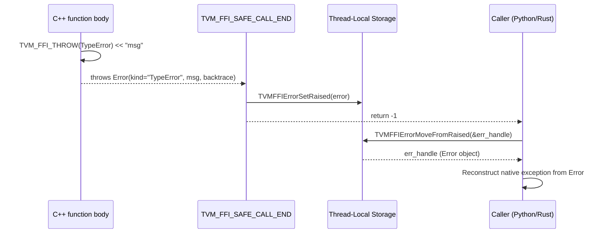

# Error System: Object-Based Errors with TLS Propagation

**TL;DR**
- Errors are full `Object` subclasses (`ErrorObj`) with kind, message, and backtrace fields. They participate in the ref-counting object system and can be stored in `Any` values.
- Backtraces are stored in **most-recent-call-first** order internally, enabling efficient O(1) append during error propagation. The display layer (`TracebackMostRecentCallLast()`, Python rendering) reverses the lines for Python-style "most recent call last" output.
- Error propagation across the C ABI boundary uses thread-local storage (TLS): the safe-call boundary catches C++ exceptions, stores the Error in TLS via `TVMFFIErrorSetRaised`, and returns -1. The caller retrieves it via `TVMFFIErrorMoveFromRaised`.
- The `TVM_FFI_THROW(ErrorKind)` macro provides a stream-style API for constructing and throwing errors with automatic backtrace capture.

## Problem Statement

### Background
- C++ exceptions cannot propagate across DLL boundaries or across the C ABI into Python/Rust.
- Errors need to carry structured information (kind, message, backtrace) so that Python can reconstruct a proper exception with traceback.
- A special case exists for frontend signals (e.g., Python `KeyboardInterrupt`) where the error is already set in the frontend runtime.

### Solution
- `ErrorObj` extends `Object` with a `TVMFFIErrorCell` containing kind, message, and backtrace as `TVMFFIByteArray` views.
- `Error` extends both `ObjectRef` and `std::exception`, enabling it to be thrown as a C++ exception and also stored/passed as an FFI object.
- `TVM_FFI_SAFE_CALL_END` catches `Error`, `EnvErrorAlreadySet`, and `std::exception`, converting them to TLS-stored errors with appropriate return codes.

### Goals
- Structured error information (kind, message, backtrace) accessible from any language.
- Safe error propagation across DLL and language boundaries.
- Familiar stream-style error construction: `TVM_FFI_THROW(TypeError) << "expected int"`.
- Non-goal: Exception hierarchy beyond the kind string (Error has a single kind string, not a class hierarchy).

## Design



### Key Classes, Fields and Interfaces

```python
class ErrorObj(Object, TVMFFIErrorCell):
    """Object-based error with kind + message + backtrace + optional cause chain."""
    # Inherits from Object: header_ (type_index, ref_counter, deleter)
    # From TVMFFIErrorCell:
    kind: TVMFFIByteArray           # e.g. "TypeError", "ValueError", "RuntimeError"
    message: TVMFFIByteArray        # Human-readable error message
    backtrace: TVMFFIByteArray      # Stack backtrace string (most-recent-call-first)
    update_backtrace: Callable[[TVMFFIObjectHandle, TVMFFIByteArray, int32], None]
    # Third param is TVMFFIBacktraceUpdateMode (Replace=0 or Append=1)
    cause_chain: Optional[TVMFFIObjectHandle] = None   # Owned handle to chained error (4c712ca)
    extra_context: Optional[TVMFFIObjectHandle] = None  # Owned handle to extra info (4c712ca)
    # Invariant: kind, message, backtrace are views into owned storage
    # Invariant: cause_chain/extra_context handles are ref-counted, DecRef'd in destructor
    # Interacts with: TLS error storage, Error ref wrapper
    # Extension: populate cause_chain to build error cause traces

    _type_index: int = kTVMFFIError  # 67 (static)
    _type_key: str = "object.Error"

class ErrorObjFromStd(ErrorObj):
    """Concrete ErrorObj backed by std::string storage."""
    kind_data_: str        # owns the kind string
    message_data_: str     # owns the message string
    backtrace_data_: str   # owns the backtrace string
    # TVMFFIByteArray fields point into these std::strings
    # UpdateBacktrace with Append mode uses std::string::append for efficiency
    # Interacts with: Error constructor, make_object<ErrorObjFromStd>

class Error(ObjectRef, std.exception):
    """Managed error ref. Can be thrown as C++ exception AND stored as FFI object."""
    # Invariant: _type_is_nullable = False (Error is never null)

    def __init__(self, kind: str, message: str, backtrace: str) -> None: ...
        # Creates ErrorObjFromStd via make_object
        # Interacts with: make_object<ErrorObjFromStd>

    def __init__(self, kind: str, message: str, backtrace: str,
                 cause_chain: Optional["Error"] = None,
                 extra_context: Optional[ObjectRef] = None) -> None: ...
        # Extended constructor with optional cause chain and extra context (4c712ca)
        # Interacts with: ObjectUnsafe ref-counting for cause_chain/extra_context handles

    def cause_chain(self) -> Optional["Error"]: ...
        # Returns chained error or None if not set (4c712ca)
    def extra_context(self) -> Optional[ObjectRef]: ...
        # Returns extra context object or None (4c712ca)

    def kind(self) -> str: ...
    def message(self) -> str: ...
    def backtrace(self) -> str: ...
        # Returns raw backtrace (most-recent-call-first order)

    def TracebackMostRecentCallLast(self) -> str: ...
        # Returns backtrace with lines reversed for Python-style display
        # Reverses line order in-place by scanning for '\n' delimiters

    def UpdateBacktrace(self, backtrace: TVMFFIByteArray, update_mode: int) -> None: ...
        # Delegates to ErrorObj.update_backtrace function pointer
        # update_mode: kTVMFFIBacktraceUpdateModeReplace or kTVMFFIBacktraceUpdateModeAppend
        # Used by Python bindings to set/append backtrace frames

    def FullMessage(self) -> str: ...
        # Returns "Traceback (most recent call last):\n{TracebackMostRecentCallLast()}{kind}: {message}\n"
        # Returns a std::string by value (no TLS, no lifetime concerns)
        # Equivalent to what the old what() returned before 4bccb3e
        # Interacts with: TracebackMostRecentCallLast(), ErrorObj.kind, ErrorObj.message

    def what(self) -> "const char*": ...
        # Returns obj->message.data directly (message only, no kind, no traceback)
        # Invariant: noexcept -- must not throw (std::exception contract)
        # Invariant: returned pointer valid for lifetime of the Error object
        # Interacts with: ErrorObj.message (TVMFFIByteArray)
        # NOTE: Changed in 4bccb3e -- previously returned full formatted string via thread_local

def EnvErrorAlreadySet() -> Error:
    """Factory function returning Error with kind='EnvErrorAlreadySet' (b1611e0).
    Replaces the previous EnvErrorAlreadySet exception class.
    Now a regular Error, caught by the normal Error handler in safe-call boundary."""
    # return Error("EnvErrorAlreadySet", "", "")
    # Interacts with: TVM_FFI_SAFE_CALL_END (caught as Error, returns -1 with kind check)
    # Interacts with: Python error.pxi CHECK_CALL (checks error.kind == "EnvErrorAlreadySet")

class ErrorBuilder:
    """Stream-style error constructor. Throws Error in destructor."""
    kind_: str
    stream_: ostringstream
    backtrace_: str
    log_before_throw_: bool

    def __del__(self) -> None:   # [[noreturn]]
        # error = Error(kind_, stream_.str(), backtrace_)
        # if log_before_throw_: cerr << error.FullMessage()
        # raise error
    def stream(self) -> ostringstream: ...
    # Interacts with: TVM_FFI_THROW macro

# Macro expansion (pseudocode for TVM_FFI_THROW(ErrorKind)):
# ErrorBuilder("ErrorKind", TVMFFIBacktrace(__FILE__, __LINE__, __func__, 0),
#              TVM_FFI_ALWAYS_LOG_BEFORE_THROW).stream()
# The returned ostringstream accepts << operators for message building
# The ErrorBuilder destructor throws the Error (noreturn)

# Macro expansion (pseudocode for TVM_FFI_ICHECK(x)):
# if (!(x)) TVM_FFI_THROW(InternalError) << "Check failed: (x) is false: "

# Macro expansion (pseudocode for TVM_FFI_ICHECK_EQ(x, y)):
# if (auto err = LogCheck_EQ(x, y))
#     TVM_FFI_THROW(InternalError) << "Check failed: x == y" << *err << ": "

# Macro expansion (pseudocode for TVM_FFI_CHECK(cond, ErrorKind)):
# if (!(cond)) TVM_FFI_THROW(ErrorKind) << "Check failed: (cond) is false: "
# Note: cond comes first, ErrorKind second -- mirrors ICHECK style

# === Parameterized CHECK macro family (35cbc32) ===
# TVM_FFI_CHECK(cond, ErrorKind) -- general condition check with custom error kind
# TVM_FFI_CHECK_EQ(x, y, ErrorKind) -- equality check with custom error kind
# TVM_FFI_CHECK_LT/GT/LE/GE/NE(x, y, ErrorKind) -- comparison checks
# TVM_FFI_CHECK_NOTNULL(x, ErrorKind) -- null pointer check
# TVM_FFI_ICHECK_*(...) -- wrappers around TVM_FFI_CHECK_*(..., InternalError), unchanged API
#
# TVM_FFI_DCHECK_*(...) -- debug-only variants, compiled to no-ops under NDEBUG:
# TVM_FFI_DCHECK(cond) -- debug condition check (InternalError)
# TVM_FFI_DCHECK_EQ/LT/GT/LE/GE/NE(x, y) -- debug comparison checks
# Invariant: DCHECK macros are no-ops when NDEBUG is defined
# Interacts with: TVM_FFI_THROW, Error system
```

```python
# === Multi-part error construction (550e92f) ===

def TVMFFIErrorSetRaisedFromCStrParts(kind: str, message_parts: Ptr[Ptr[char]], num_parts: int32) -> None:
    """Set a raised error in TLS by concatenating message parts. NULL parts are skipped.
    Enables DSL compilers to reuse common substrings (e.g., function signatures)
    across multiple error messages, reducing binary size."""
    # Interacts with: SafeCallContext TLS, TVMFFIErrorMoveFromRaised (caller retrieves error)
    # Interacts with: TVMFFIBacktrace (captures backtrace at call site)
    # Invariant: follows same TLS single-error contract as TVMFFIErrorSetRaisedFromCStr
    # Invariant: NULL entries in message_parts are silently skipped (not treated as empty string)
    # Extension: callers can store shared string parts as globals and compose per-callsite errors
```

```python
# === Exception-free error handling (0a9d4b6) ===

class Unexpected(Generic[E]):
    """Wrapper to explicitly construct Expected in error state."""
    # Invariant: E must derive from Error
    def __init__(self, error: E) -> None: ...
    def error(self) -> E: ...

class Expected(Generic[T]):
    """Exception-free error handling container: holds either T or Error.
    Analogous to Rust's Result<T, Error> or C++23's std::expected."""
    # Internal: data_: Any  (holds either T or Error)
    # Invariant: T cannot be Error (static_assert)
    # Interacts with: Any type system via TypeTraits<Expected<T>>

    def __init__(self, value: T) -> None: ...            # implicit from success value
    def __init__(self, error: Error) -> None: ...         # implicit from Error
    def __init__(self, unexpected: Unexpected[E]) -> None: ...  # from Unexpected wrapper

    def is_ok(self) -> bool: ...
        # Checks for Error first via data_.as<Error>() to handle T subclass cases
    def is_err(self) -> bool: ...       # not is_ok()
    def has_value(self) -> bool: ...    # alias for is_ok()

    def value(self) -> T: ...
        # Invariant: throws contained Error if is_err()
    def error(self) -> Error: ...
        # Invariant: throws RuntimeError if is_ok()
    def value_or(self, default: T) -> T: ...

# TypeTraits<Expected<T>>:
#   CopyToAnyView: unwraps to T or Error before conversion
#   CheckAnyStrict: accepts T OR Error
#   TypeStr: "Expected<T::TypeStr()>"
#   TypeSchema: {"type":"Expected","args":[T_schema, {"type":"ffi.Error"}]}
# Interacts with: Function::CallExpected<T>()
```

```python
# === C ABI extension for cause chain (4c712ca) ===

def TVMFFIErrorCreateWithCauseAndExtraContext(
    kind: bytes, message: bytes, backtrace: bytes,
    cause_chain: ObjectHandle, extra_context: ObjectHandle,
    out: Pointer[ObjectHandle]
) -> int:
    """C ABI: Create error with cause chain and extra context."""
    # Interacts with: TVMFFIErrorCell layout, TLS error propagation
    ...
```

### Contracts, Assumptions and Invariants
- **TLS single-error invariant**: After `safe_call` returns -1, exactly one error exists in TLS. The caller MUST call `TVMFFIErrorMoveFromRaised` to consume it. Not consuming it leaves a dangling error for the next call.
- **Return code semantics**: 0 = success, -1 = error in TLS (call `TVMFFIErrorMoveFromRaised`). The former `-2` error code for frontend errors is deprecated (b1611e0); `EnvErrorAlreadySet` is now a regular Error with `kind="EnvErrorAlreadySet"`, propagated through the standard `-1` path. Backward-compatible handling of `-2` is retained with a TODO to remove.
- **Backtrace storage order**: Backtraces are stored in most-recent-call-first order. This enables efficient O(1) append when propagating errors up the call stack. Display functions (`TracebackMostRecentCallLast`, Python rendering) reverse the lines for user-visible output.
- **Error is non-nullable**: `Error` uses `TVM_FFI_DEFINE_OBJECT_REF_METHODS_NOTNULLABLE`, so a default-constructed `Error` is illegal. An Error always has valid kind/message/backtrace.
- **what() returns message only**: `Error::what()` returns `obj->message.data` directly -- the message string only, without kind or traceback. This conforms to the `std::exception::what()` contract (noexcept, no TLS). Use `Error::FullMessage()` for the full formatted string including traceback and kind.
- **MemoryError as standard error kind**: `"MemoryError"` is a registered error kind for tensor allocation failures, mapped to Python's `MemoryError` via `register_error("MemoryError", MemoryError)`. Used by the torch DLPack adapter and tensor allocation callbacks.

### Extension Points
- **New error kinds**: Error kinds are just strings (e.g., "TypeError", "ValueError", "RuntimeError", "MemoryError"). No registration needed -- just use a new kind string in `TVM_FFI_THROW(NewKind)`. Standard kinds with Python mappings: TypeError, ValueError, RuntimeError, InternalError, AttributeError, IndexError, KeyError, MemoryError.
- **Backtrace enrichment**: `Error::UpdateBacktrace` with `kTVMFFIBacktraceUpdateModeAppend` allows language bindings to append their own backtrace frames. Python bindings use this to append Python stack frames to the C++ backtrace as the error propagates up.
- **Custom error storage**: Subclass `ErrorObj` to use different backing storage (e.g., arena-allocated strings instead of `std::string`).

### Usage Examples

#### Throwing and catching errors across the FFI boundary
**Context**: A C++ function throws an error, caught by the safe-call boundary, and retrieved by the Python binding.

```cpp
// C++ side: throw a typed error
namespace refl = tvm::ffi::reflection;
refl::GlobalDef().def("my.validate", [](int x) -> void {
    if (x < 0) {
        TVM_FFI_THROW(ValueError) << "Expected non-negative, got " << x;
        // ErrorBuilder captures backtrace at this point
        // Destructor throws Error("ValueError", "Expected non-negative, got -1", backtrace)
    }
});

// Safe-call boundary catches the Error, stores in TLS, returns -1
// Python binding calls TVMFFIErrorMoveFromRaised, constructs Python ValueError
```

#### Check macros for internal assertions
**Context**: Using ICHECK macros for debug assertions that produce clear error messages.

```cpp
void ProcessArray(const Array<int>& arr, int idx) {
    TVM_FFI_ICHECK_GE(idx, 0) << "index must be non-negative";
    TVM_FFI_ICHECK_LT(idx, arr.size()) << "index out of bounds";
    // On failure: throws InternalError with "Check failed: idx < arr.size() (5 vs. 3): index out of bounds"
}
```

#### Exception-free function invocation with Expected<T>
**Context**: Calling an FFI function without exception propagation, handling errors inline.

```cpp
// Function::CallExpected<T>() catches exceptions, returns Expected<T>
Function func = Function::GetGlobalRequired("risky_function");
Expected<int> result = func.CallExpected<int>(arg1, arg2);
if (result.is_ok()) {
    int value = result.value();
} else {
    Error err = result.error();
    LOG(WARNING) << "Function failed: " << err.message();
}

// Direct Expected<T> usage in library code:
Expected<int> divide(int a, int b) {
    if (b == 0) return Error("ValueError", "Division by zero", "");
    return a / b;
}
int safe_val = divide(10, 0).value_or(-1);  // -1 (default on error)
```

#### Error chaining with cause_chain
**Context**: Building a chain of causal errors for debugging multi-layer failures.

```cpp
Error original_error("TypeError", "inner cause", "trace0");
Error chained("ValueError", "outer error", "trace1", original_error, std::nullopt);
auto opt_cause = chained.cause_chain();
// opt_cause->kind() == "TypeError", opt_cause->message() == "inner cause"
```

## Alternatives & Trade-offs

### Error code return + message buffer
- Pros: No TLS dependency, no C++ exception machinery
- Cons: Every function needs an extra error buffer parameter, message must be copied to caller-owned buffer, no structured backtrace support.

### C++ exception propagation (no safe-call boundary)
- Pros: Natural C++ error handling
- Cons: Exceptions cannot cross DLL boundaries reliably (different exception tables), cannot cross into Python/Rust, ABI-dependent.

## Related Work
### Design Docs & ADRs
- [0001-c-abi.md](../designs/0001-c-abi.md) -- TVMFFIErrorCell layout, TVMFFIErrorSetRaised/MoveFromRaised
- [0004-function-system.md](../designs/0004-function-system.md) -- TVM_FFI_SAFE_CALL_BEGIN/END
- [ADR 0002](../ADRs/0002-tls-error-propagation.md) -- Decision to use TLS for error propagation
- [ADR 0018](../ADRs/0018-expected-for-exception-free-error-handling.md) -- Decision to add Expected<T> for exception-free error handling

### Evidence Matrix
- ErrorObj/Error design, TLS propagation -> `commits/2025-05-06-7d34eb8abfe987bf0031e4d4ff479895d867a966.md` (commit 7d34eb8, `error.h`)
- EnvErrorAlreadySet for frontend errors -> `commits/2025-05-06-7d34eb8abfe987bf0031e4d4ff479895d867a966.md` (commit 7d34eb8, `error.h`)
- ErrorBuilder stream pattern -> `commits/2025-05-06-7d34eb8abfe987bf0031e4d4ff479895d867a966.md` (commit 7d34eb8, `TVM_FFI_THROW`)
- ICHECK macro family -> `commits/2025-05-06-7d34eb8abfe987bf0031e4d4ff479895d867a966.md` (commit 7d34eb8, `error.h`)
- Backtrace storage order (most-recent-call-first), traceback->backtrace rename, TVMFFIBacktraceUpdateMode, TVMFFIErrorCreate signature change, TracebackMostRecentCallLast -> `commits/2025-09-22-6f020c11c304ef11ac5d0dad904d41ebe42a3ffd.md` (commit 6f020c1)
- TVM_FFI_CHECK macro introduced (327e8cc), parameter order changed to (cond, ErrorKind) -> `commits/2025-09-29-ae06434d8363c9a668a63152bd35cb878209da9f.md` (commit ae06434, `error.h`)
- TVM_FFI_CHECK initial implementation -> `commits/2025-09-28-327e8cc63c9517df7ec9f1abc5f9c599c1b78c4d.md` (327e8cc)
- Error::what() narrowed to message-only, FullMessage() added -> `commits/2025-11-07-4bccb3eda0d543be67ec56204e045ca3e3b88641.md` (4bccb3e)
- MemoryError kind registered, allocator error propagation order fixed -> `commits/2025-11-04-227bdd0c5c70f186fac3b3c99427a032424ed58e.md` (227bdd0)
- Error cause_chain/extra_context fields, TVMFFIErrorCreateWithCauseAndExtraContext -> `commits/2026-01-11-4c712ca3ec72ad18c10e42e5ef8b7f91ec23a803.md` (4c712ca)
- EnvErrorAlreadySet unified to Error factory function, error code -2 deprecated -> `commits/2026-02-03-b1611e0cf669518dd01367806ab0bfda7b20841d.md` (b1611e0)
- Expected<T>, Unexpected<E>, Function::CallExpected<T>(), TypeTraits<Expected<T>> -> `commits/2026-02-06-0a9d4b681cb017e9103efa6cc20d687c065a26fe.md` (0a9d4b6)
