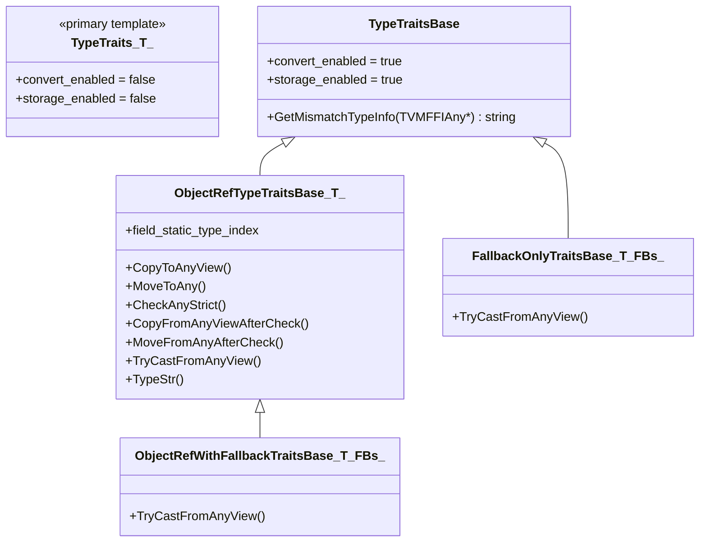

# TypeTraits Protocol

**TL;DR**
- `TypeTraits<T>` is the extensibility mechanism that defines how each C++ type converts to/from the `Any`/`AnyView` type-erased value system, with 7 required methods plus an optional 8th method `TypeSchema()` per specialization.
- Four helper base classes (`TypeTraitsBase`, `ObjectRefTypeTraitsBase<T>`, `FallbackOnlyTraitsBase<T, ...>`, `ObjectRefWithFallbackTraitsBase<T, ...>`) reduce boilerplate for common patterns.
- The protocol distinguishes between exact-match storage checks (`CheckAnyStrict`) and coercing conversions (`TryCastFromAnyView`), enabling containers to maintain type invariants while function arguments remain flexible.

## Problem Statement

### Background
- The `Any`/`AnyView` system needs to know how to convert between arbitrary C++ types and the 16-byte `TVMFFIAny` representation.
- Different types need different strategies: POD types store directly in the union, ObjectRef types store a refcounted pointer, some types convert through fallback chains.
- The conversion logic must be open for extension (new user types) without modifying core code.

### Solution
- A primary template `TypeTraits<T>` with `convert_enabled=false` by default; specializations opt in.
- Each specialization provides 7 methods that cover the full lifecycle: store, check, extract, convert.
- Helper bases provide reusable implementations for common patterns.

### Goals
- **Goal**: Extensible type conversion protocol for the FFI value system.
- **Goal**: Separate exact-match checking from coercing conversion.
- **Goal**: Compile-time type safety via SFINAE (`enable_if<TypeTraits<T>::convert_enabled>`).
- **Non-goal**: Not a general serialization framework; specifically for in-process FFI value passing.

## Design



### Key Classes, Fields and Interfaces

**Primary template** (disabled by default):
```cpp
template <typename, typename = void>
struct TypeTraits {
  static constexpr bool convert_enabled = false;
  static constexpr bool storage_enabled = false;
};
```

**`TypeTraitsBase`** — default values for enabled traits:
```cpp
struct TypeTraitsBase {
  static constexpr bool convert_enabled = true;
  static constexpr bool storage_enabled = true;
  static std::string GetMismatchTypeInfo(const TVMFFIAny* source) {
    return TypeIndexToTypeKey(source->type_index);
  }
};
```

**Required methods for a complete specialization** (inheriting from TypeTraitsBase):

| # | Method | Signature | Semantics |
|---|--------|-----------|-----------|
| 1 | `CopyToAnyView` | `(const T&, TVMFFIAny*) -> void` | Store T into an AnyView slot. For objects: store raw pointer, no IncRef. For POD: copy value. |
| 2 | `MoveToAny` | `(T, TVMFFIAny*) -> void` | Store T into an Any slot with ownership transfer. For objects: steal the refcount. For POD: same as copy. |
| 3 | `CheckAnyStrict` | `(const TVMFFIAny*) -> bool` | Return true if the TVMFFIAny was produced by MoveToAny of this exact type T. No coercion. |
| 4 | `CopyFromAnyViewAfterCheck` | `(const TVMFFIAny*) -> T` | Extract T from storage after CheckAnyStrict returned true. For objects: IncRef the pointer. |
| 5 | `MoveFromAnyAfterCheck` | `(TVMFFIAny*) -> T` | Extract T from storage with ownership transfer after CheckAnyStrict. For objects: steal the refcount, null source. |
| 6 | `TryCastFromAnyView` | `(const TVMFFIAny*) -> optional<T>` | Convert with coercion (e.g., int -> float, subclass -> parent). Return nullopt if impossible. |
| 7 | `TypeStr` | `() -> string` | Human-readable name (e.g., "int", "String", "Array"). |
| 8 | `TypeSchema` | `() -> string` | (Optional) JSON type schema string, e.g. `{"type":"int"}`, `{"type":"ffi.Array","args":[{"type":"int"}]}`. Added in 28fe3cc. Used by reflection metadata, stubgen, and Python `TypeSchema` class. |

**Static field**:
- `field_static_type_index` (int32_t): The type index used in reflection field annotations (e.g., `kTVMFFIInt` for int, `kTVMFFIObject` for generic objects).

**`ObjectRefTypeTraitsBase<T>`** — for all ObjectRef subtypes:
```cpp
template<typename T>
struct ObjectRefTypeTraitsBase : public TypeTraitsBase {
  static constexpr int32_t field_static_type_index = /* T::ContainerType's static index or kTVMFFIObject */;

  static void CopyToAnyView(const T& src, TVMFFIAny* result) {
    // Store raw TVMFFIObject* pointer without IncRef
    result->type_index = src.defined() ? src->type_index() : kTVMFFINone;
    result->v_obj = ObjectUnsafe::TVMFFIObjectPtrFromObjectRef(src);
  }
  static void MoveToAny(T src, TVMFFIAny* result) {
    // Steal the reference (no IncRef, null source)
    result->type_index = src.defined() ? src->type_index() : kTVMFFINone;
    result->v_obj = ObjectUnsafe::MoveObjectRefToTVMFFIObjectPtr(std::move(src));
  }
  static bool CheckAnyStrict(const TVMFFIAny* src) {
    // Check type_index >= kTVMFFIStaticObjectBegin AND IsInstance<ContainerType>
    return src->type_index >= kTVMFFIStaticObjectBegin &&
           details::IsObjectInstance<typename T::ContainerType>(src->type_index);
  }
  static std::optional<T> TryCastFromAnyView(const TVMFFIAny* src) {
    // For nullable: allow kTVMFFINone
    // Then check IsInstance
    if (src->type_index == kTVMFFINone && T::_type_is_nullable) return T(nullptr);
    if (CheckAnyStrict(src)) return CopyFromAnyViewAfterCheck(src);
    return std::nullopt;
  }
  static std::string TypeStr() { return T::ContainerType::_type_key; }
};
```

**`FallbackOnlyTraitsBase<T, FallbackTypes...>`** — for types that convert through a chain:
```cpp
template<typename T, typename... FallbackTypes>
struct FallbackOnlyTraitsBase : public TypeTraitsBase {
  static std::optional<T> TryCastFromAnyView(const TVMFFIAny* src) {
    // Try direct check first, then try each FallbackType in order
    // e.g., Optional<String> tries String first, then std::nullopt for None
  }
};
```

**Built-in specializations catalog**:

| C++ Type | Storage type_index | Coercion from | Notes |
|----------|--------------------|---------------|-------|
| `nullptr_t` | `kTVMFFINone` | — | |
| `bool` | `kTVMFFIBool` | `int` | |
| `int` / `int64_t` | `kTVMFFIInt` | `bool` | For `uint64_t`/`size_t`: runtime overflow check throws `OverflowError` if > `INT64_MAX` (86bbddf) |
| `float` / `double` | `kTVMFFIFloat` | `int`, `bool` | |
| `void*` | `kTVMFFIOpaquePtr` | — | |
| `DLDataType` | `kTVMFFIDataType` | — | |
| `DLDevice` | `kTVMFFIDevice` | — | |
| `const char*` | `kTVMFFIRawStr` | `String` | AnyView only; promoted to String in Any |
| `std::string` | via `String` | `const char*`, `String` | |
| `std::string_view` | `kTVMFFIRawStr` | `String` | AnyView only |
| `String` | `kTVMFFISmallStr` or `kTVMFFIStr` | `kTVMFFIRawStr` | Dual type indices; `field_static_type_index = kTVMFFIAny`; no longer uses `ObjectRefWithFallbackTraitsBase` |
| `Bytes` | `kTVMFFISmallBytes` or `kTVMFFIBytes` | `kTVMFFIByteArrayPtr` | Dual type indices; `field_static_type_index = kTVMFFIAny`; no longer uses `ObjectRefWithFallbackTraitsBase` |
| All `ObjectRef` subtypes | `>= kTVMFFIStaticObjectBegin` | Via IsInstance check | Note: `String`/`Bytes` are no longer ObjectRef subtypes |
| `Optional<T>` | depends on `T` | `None` or `T` | `Optional<String>`/`Optional<Bytes>` use `BytesBaseCell(nullopt)` sentinel (zero overhead) |
| `TypedFunction<FType>` | `kTVMFFIFunction` | `Function` | |
| `TensorView` | `kTVMFFIDLTensorPtr` | `Tensor` (via `TryCastFromAnyView`) | `storage_enabled=false` (AnyView only, non-owning view) |
| All `enum class` types (integral underlying) | `kTVMFFIInt` | `int`, `bool` | SFINAE auto-specialization via `is_integeral_enum_v<T>` two-phase guard (5fba9e8); no manual traits needed |

**STL-to-FFI bridging specializations** (in `tvm/ffi/extra/stl.h`, c3fc8f7):

The `stl.h` header provides `TypeTraits` specializations for 8 C++ STL types, enabling them as direct parameter and return types in FFI-exported functions. All STL specializations have `storage_enabled = false` (cannot be stored directly in `Any`; values are always copied through Object intermediaries).

Three internal base types support the STL specializations:
- `STLTypeTrait` (extends `TypeTraitsBase`): base with `storage_enabled = false` and helpers for moving/copying `ObjectPtr` to/from `TVMFFIAny`.
- `details::ListTemplate`: tag type whose `TypeTraits` extends `STLTypeTrait` with `field_static_type_index = kTVMFFIArray` and helpers `CopyToTuple`, `MoveToTuple`, `CopyToArray`, `MoveToArray`.
- `details::MapTemplate`: tag type whose `TypeTraits` extends `STLTypeTrait` with `field_static_type_index = kTVMFFIMap` and helpers `CopyToMap`, `MoveToMap`, `ConstructMap`.

| STL Type | Bridges via | `field_static_type_index` | Notes |
|----------|------------|--------------------------|-------|
| `std::array<T, N>` | `ArrayObj` | `kTVMFFIArray` | Size-checked (`N > 0` static assert) |
| `std::vector<T>` | `ArrayObj` | `kTVMFFIArray` | Dynamic length |
| `std::optional<T>` | Delegates to `TypeTraits<T>` | (from T) | Maps `None`/`kTVMFFINone` to `std::nullopt` |
| `std::variant<Args...>` | Delegates per alternative | (from first match) | First-match semantics on `TryCast` |
| `std::tuple<Args...>` | `ArrayObj` | `kTVMFFIArray` | Size-checked, heterogeneous |
| `std::map<K, V>` | `MapObj` | `kTVMFFIMap` | Ordered; no `reserve` |
| `std::unordered_map<K, V>` | `MapObj` | `kTVMFFIMap` | Unordered; `reserve` called |
| `std::function<Ret(Args...)>` | `TypedFunction<Ret(Args...)>` | `kTVMFFIFunction` | Wraps in lambda for type erasure |

Each specialization implements `CopyToAnyView`, `MoveToAny`, `TryCastFromAnyView`, `TypeStr`, `TypeSchema`. List-like and map-like specializations also implement `CheckAnyStrict`. All return `std::nullopt` from `TryCastFromAnyView` on type mismatch (catching `STLTypeMismatch` internally).

Key design note: `STLTypeMismatch` is an internal `std::exception` subclass used as a sentinel for early-return from nested `TryCast` chains inside STL type conversion. It never escapes the `TryCastFromAnyView` boundary -- it is caught and converted to `std::nullopt`.

Evidence: c3fc8f7 (initial), 88d5130 (use-after-move fix in tuple `CopyToTupleImpl` -- replaced fold expression with `std::apply`)

**`FunctionInfo<F>` specializations** -- compile-time callable introspection (in `function_details.h`):

The `FunctionInfo` trait extracts return type and argument types from callable types. It provides the `Sig` (human-readable signature string) and the typed-to-packed adapter for `TVM_FFI_DLL_EXPORT_TYPED_FUNC`. The full specialization set:

| Specialization | Matches | Notes |
|----------------|---------|-------|
| `FunctionInfo<T>` (primary) | Classes with `operator()` | Via `FunctionInfoHelper<decltype(&T::operator())>` |
| `FunctionInfo<R(Args...)>` | Bare function types | |
| `FunctionInfo<R(*)(Args...)>` | Function pointer types | |
| `FunctionInfo<R(&)(Args...)>` | Function reference types | Added in a23c5a0; fixes `TVM_FFI_DLL_EXPORT_TYPED_FUNC(name, (func))` where `decltype((func))` yields `R(&)(Args...)` |
| `FunctionInfo<R(Class::*)(Args...)>` | Pointer-to-member (Object) | Prepends `Class*` to args |
| `FunctionInfo<R(Class::*)(Args...) const>` | Const pointer-to-member (Object) | Prepends `const Class*` to args |
| `FunctionInfo<R(Class::*)(Args...)>` | Pointer-to-member (ObjectRef) | Prepends `Class` to args |
| `FunctionInfo<R(Class::*)(Args...) const>` | Const pointer-to-member (ObjectRef) | Prepends `const Class` to args |

### Contracts, Assumptions and Invariants
- **CheckAnyStrict vs TryCastFromAnyView**: `CheckAnyStrict(x)` being true implies `TryCastFromAnyView(x)` returns a value. The converse is NOT true (coercion may succeed when exact match fails).
- **Container invariant**: `Array<T>` guarantees `TypeTraits<T>::CheckAnyStrict(elem)` for all elements. This is stronger than just "convertible to T" — it means exact type match.
- **SFINAE gate**: All `Any`/`AnyView` constructors and `as`/`cast` methods use `enable_if<TypeTraits<T>::convert_enabled>` to produce compile errors for unregistered types.
- **TypeTraitsNoCR<T>**: Convenience alias that strips `const` and `&` before looking up traits, so `TypeTraits<const int&>` works.
- **`is_integeral_enum_v<T>`**: A two-phase variable template that safely checks whether `T` is an enum with an integral underlying type, avoiding `std::underlying_type_t<T>` instantiation for non-enum types (which causes a hard error on GCC 8.x). Primary template short-circuits to `false` when `std::is_enum_v<T>` is false; partial specialization evaluates `std::is_integral_v<std::underlying_type_t<T>>` only for actual enums.
- **TypeSchema JSON format**: `TypeTraits<T>::TypeSchema()` returns a JSON string of the form `{"type":"<type_key>"}` for simple types, or `{"type":"<type_key>","args":[...]}` for parameterized types (e.g., `Array<int>` produces `{"type":"ffi.Array","args":[{"type":"int"}]}`). For functions, `args[0]` is the return type, followed by parameter types. Packed functions have no `args` key.
- **uint64_t/size_t overflow guard** (86bbddf): `TypeTraits<Int>::CopyToAnyView` performs a runtime check for unsigned 64-bit integers. If `value > INT64_MAX`, it throws `OverflowError: "Integer value X is too large to fit in int64_t."` This prevents silent truncation when converting large unsigned values to the `int64_t`-based Any storage. Note: this affects all code paths that store `uint64_t`/`size_t` in `Any`/`AnyView`, including structural hash results.

### Extension Points
- **New POD types**: Specialize `TypeTraits<MyPOD>` inheriting `TypeTraitsBase`, implementing all 7 methods.
- **New ObjectRef types**: The SFINAE-based default specialization for `ObjectRef` subtypes automatically provides traits via `ObjectRefTypeTraitsBase`. No explicit specialization needed.
- **Custom coercion chains**: Use `FallbackOnlyTraitsBase` or `ObjectRefWithFallbackTraitsBase` to define types that try multiple conversion paths.

### Usage Examples

#### Implementing TypeTraits for a custom POD type
**Context**: Making a user-defined enum work with Any/AnyView.
```cpp
enum class Color : int32_t { Red = 0, Green = 1, Blue = 2 };

template<>
struct TypeTraits<Color> : public TypeTraitsBase {
  static constexpr int32_t field_static_type_index = TypeIndex::kTVMFFIInt;

  static void CopyToAnyView(const Color& src, TVMFFIAny* result) {
    result->type_index = kTVMFFIInt;
    result->v_int64 = static_cast<int64_t>(src);
  }
  static void MoveToAny(Color src, TVMFFIAny* result) {
    CopyToAnyView(src, result);
  }
  static bool CheckAnyStrict(const TVMFFIAny* src) {
    return src->type_index == kTVMFFIInt;
  }
  static Color CopyFromAnyViewAfterCheck(const TVMFFIAny* src) {
    return static_cast<Color>(src->v_int64);
  }
  static Color MoveFromAnyAfterCheck(TVMFFIAny* src) {
    return CopyFromAnyViewAfterCheck(src);
  }
  static std::optional<Color> TryCastFromAnyView(const TVMFFIAny* src) {
    if (src->type_index == kTVMFFIInt) return static_cast<Color>(src->v_int64);
    return std::nullopt;
  }
  static std::string TypeStr() { return "Color"; }
};

// Now Color works with Any:
Any val = Color::Green;
Color c = val.cast<Color>();  // OK
```

#### Exporting a function with STL types (C++ -> Python)
**Context**: Using `stl.h` to export a function that accepts and returns STL types. Python callers pass native lists/dicts; the FFI converts through Array/Map intermediaries automatically.
```cpp
#include <tvm/ffi/extra/stl.h>
#include <tvm/ffi/function.h>

auto sum_row(std::optional<std::vector<std::array<int, 2>>> arg)
    -> std::tuple<bool, std::vector<int>> {
  if (arg) {
    std::vector<int> result;
    result.reserve(arg->size());
    for (const auto& row : *arg)
      result.push_back(row[0] + row[1]);
    return {true, result};
  }
  return {false, {}};
}
TVM_FFI_DLL_EXPORT_TYPED_FUNC(sum_row, sum_row);
```
```python
mod = tvm_ffi.load_module(lib_path)
mod.sum_row([[1, 2], [3, 4]])   # returns (True, [3, 7])
mod.sum_row(None)                # returns (False, [])
```

## Alternatives & Trade-offs
### Runtime type registry (dynamic dispatch)
- Pros: No template metaprogramming, easier to add types from scripting languages.
- Cons: Runtime overhead per conversion, cannot provide compile-time type safety (SFINAE gates). The template approach gives zero-overhead conversion for known types.

### Fewer protocol methods (e.g., just serialize/deserialize)
- Pros: Simpler to implement per type.
- Cons: Loses the distinction between exact-match (CheckAnyStrict) and coercion (TryCastFromAnyView), which is critical for container type invariants. Also loses the ownership transfer semantics (Move vs Copy).

## Related Work
### Design Docs & ADRs
- [0002-any-value-system.md](.knowledge/designs/0002-any-value-system.md) — Any/AnyView that TypeTraits powers
- [0003-object-system.md](.knowledge/designs/0003-object-system.md) — ObjectRef types that use ObjectRefTypeTraitsBase
- [0001-unified-any-value.md](.knowledge/ADRs/0001-unified-any-value.md) — Unified value representation that TypeTraits converts to/from

### Evidence Matrix
- TypeTraits primary template and TypeTraitsBase -> `2025-05-06-7d34eb8.md` + `type_traits.h` lines 66-94
- 7 protocol methods listed -> `2025-05-06-7d34eb8.md` + `type_traits.h` lines 40-65
- ObjectRefTypeTraitsBase<T> -> `2025-05-06-7d34eb8.md` + `type_traits.h`
- FallbackOnlyTraitsBase and ObjectRefWithFallbackTraitsBase -> `2025-05-06-7d34eb8.md`
- Built-in specializations for nullptr_t, bool, int, float, etc. -> `type_traits.h` lines 116+
- TypeToFieldStaticTypeIndex helper -> `type_traits.h` lines 96-104
- Container storage invariant -> `type_traits.h` comment lines 60-65
- TensorView TypeTraits specialization (storage_enabled=false) -> `2025-10-01-1ec62367.md` (1ec6236)
- `is_integeral_enum_v<T>` two-phase SFINAE guard for GCC 8.x -> `2025-10-04-5fba9e8f.md` (5fba9e8)
- `TypeSchema()` 8th protocol method -> `2025-10-03-28fe3cc7.md` (28fe3cc)
- `FunctionInfo<R(&)(Args...)>` specialization for function reference types -> `2025-10-22-a23c5a03.md` (a23c5a0)
- STL-to-FFI bridging layer (`stl.h`) with 8 specializations -> `2025-11-30-c3fc8f7f.md` (c3fc8f7)
- Use-after-move fix in `CopyToTupleImpl` -> `2025-11-30-88d5130d.md` (88d5130)
- uint64_t/size_t overflow guard in `TypeTraits<Int>::CopyToAnyView` -> `2026-01-08-86bbddfdbaa9103016e3f39633b8b2402ea24428.md` (86bbddf) + `type_traits.h`
