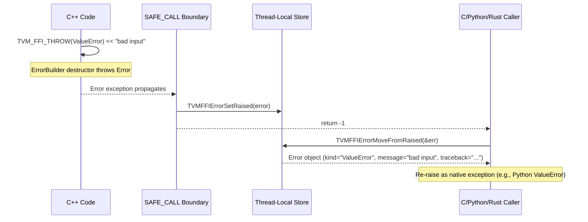
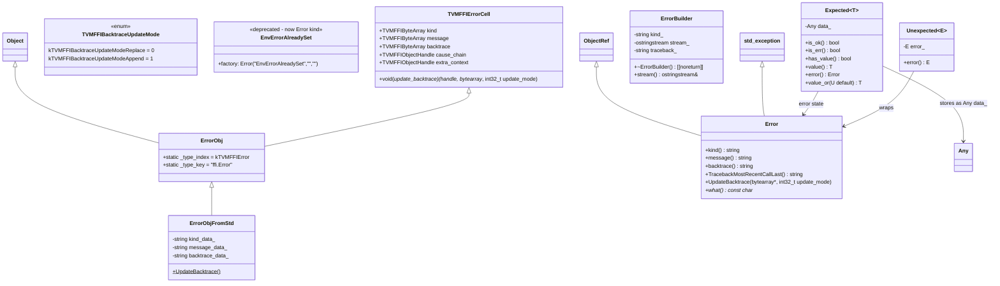

# Error Handling

**TL;DR**
- Errors are first-class objects (`ErrorObj : Object + TVMFFIErrorCell`) with kind, message, and backtrace fields, propagated across the C ABI boundary via thread-local storage (TLS) rather than return values.
- The `TVM_FFI_SAFE_CALL_BEGIN/END` macros create an exception boundary that catches C++ exceptions and stores them in TLS, returning integer error codes (0=success, -1=error).
- `TVM_FFI_THROW(ErrorKind)` provides stream-style error creation with automatic stack traceback capture.
- `Expected<T>` provides an exception-free alternative for C++ callers, analogous to Rust's `Result<T, Error>` or C++23's `std::expected`. See [ADR 0026](../ADRs/0026-expected-type-for-exception-free-ffi.md).

## Problem Statement

### Background
- C++ exceptions cannot cross C ABI boundaries or language boundaries (Python, Rust).
- Error information (kind, message, traceback) must be preserved across multiple language transitions (e.g., C++ -> Python -> C++ call chain).
- The FFI frequently has deeply nested call chains where passing error objects through parameters would be extremely complex.

### Solution
- Object-based errors (`Error : ObjectRef + std::exception`) that carry structured information.
- TLS-based error store: `TVMFFIErrorSetRaised` saves the error, `TVMFFIErrorMoveFromRaised` retrieves and clears it.
- Exception boundary macros that convert between C++ exceptions and C error codes.

### Goals
- **Goal**: Preserve error kind, message, and traceback across language boundaries.
- **Goal**: Simple error propagation in call chains (no parameter-passing needed).
- **Goal**: Stream-style error creation for natural C++ usage.
- **Non-goal**: Not a replacement for `std::error_code`; designed specifically for cross-language FFI error propagation.

## Design





### Key Classes, Fields and Interfaces

**`ErrorObj`** — object data class:
```cpp
class ErrorObj : public Object, public TVMFFIErrorCell {
public:
  // Inherits from TVMFFIErrorCell:
  //   TVMFFIByteArray kind, message, backtrace;
  //   void (*update_backtrace)(TVMFFIObjectHandle, const TVMFFIByteArray*, int32_t update_mode);
  //   TVMFFIObjectHandle cause_chain;     // optional owned handle to chained Error (0d157dc)
  //   TVMFFIObjectHandle extra_context;   // optional owned handle to arbitrary context object (0d157dc)
  static constexpr int32_t _type_index = kTVMFFIError;  // 67
  static constexpr const char* _type_key = "ffi.Error";
  // Default constructor: initializes cause_chain and extra_context to nullptr
  // Destructor: calls DecRefObjectHandle on non-null cause_chain and extra_context
};
```

**`Error`** — ref handle + std::exception:
```cpp
class Error : public ObjectRef, public std::exception {
public:
  Error(std::string kind, std::string message, std::string backtrace);
  Error(std::string kind, std::string message, std::string backtrace,
        std::optional<Error> cause_chain, std::optional<ObjectRef> extra_context);  // (0d157dc)
  std::string kind() const;
  std::string message() const;
  std::string backtrace() const;                   // most-recent-call-first (storage order)
  std::optional<Error> cause_chain() const;        // returns chained cause error if present (0d157dc)
  std::optional<ObjectRef> extra_context() const;  // returns extra context object if present (0d157dc)
  std::string TracebackMostRecentCallLast() const; // reverses lines for Python-style display
  void UpdateBacktrace(const TVMFFIByteArray* backtrace_str, int32_t update_mode);
  const char* what() const noexcept(true) override;
  // what() returns message-only: obj->message.data (no kind, no traceback).
  // This conforms to std::exception::what() noexcept convention and avoids TLS allocation.
  // Changed from full-message in 4bccb3e; callers needing full output must use FullMessage().

  std::string FullMessage() const;
  // FullMessage() returns: "Traceback (most recent call last):\n{TracebackMostRecentCallLast()}{kind}: {message}\n"
  // Allocates a std::string on each call. Replaces the old what() behavior.
};
```

**`EnvErrorAlreadySet`** — sentinel for frontend errors (**unified to Error kind in b1611e0**):
```cpp
// BEFORE (removed in b1611e0): struct EnvErrorAlreadySet : public std::exception {};
// NOW: a factory function returning a regular Error object:
inline Error EnvErrorAlreadySet() { return Error("EnvErrorAlreadySet", "", ""); }
// The signal is now carried as error.kind() == "EnvErrorAlreadySet" through
// the standard TLS error path. The separate exception struct, error code -2,
// and the dedicated catch clause in TVM_FFI_SAFE_CALL_END are all removed.
// Python/Cython call sites check error.kind after move_from_last_error().
```

**`Expected<T>`** — exception-free error handling (0a9d4b6):
```cpp
template <typename E = Error>
class Unexpected {
    explicit Unexpected(E error);
    const E& error() const& noexcept;
    E&& error() && noexcept;
};
template <typename E> Unexpected(E) -> Unexpected<E>;  // CTAD

template <typename T>
class Expected {
    Expected(T value);              // implicit from success value
    Expected(Error error);          // implicit from error
    Expected(Unexpected<E> unexpected); // from Unexpected wrapper
    bool is_ok() const;             // checks !data_.as<Error>().has_value()
    bool is_err() const;
    bool has_value() const;         // alias for is_ok()
    T value() const&;               // throws contained Error if is_err()
    T value() &&;
    Error error() const&;           // throws RuntimeError if is_ok()
    Error error() &&;
    T value_or(U&& default_value) const;
private:
    Any data_;                      // holds either T or Error
};
```

**`Function::CallExpected<T>`** — exception-free function call (0a9d4b6):
```cpp
template <typename T = Any, typename... Args>
Expected<T> Function::CallExpected(Args&&... args) const;
// Uses safe_call path (same as C ABI), catches exceptions and returns
// them as Expected<T> instead of throwing.
```

**`TypeTraits<Expected<T>>`** — Any interop for Expected (0a9d4b6):
```cpp
template <typename T>
struct TypeTraits<Expected<T>> : public TypeTraitsBase {
    // CheckAnyStrict: returns true if src matches T OR Error
    // CopyFromAnyViewAfterCheck: checks T first, then Error
    // TypeSchema: {"type":"Expected","args":[<T_schema>,{"type":"ffi.Error"}]}
};
```

**`ErrorBuilder`** — stream-style error construction:
```cpp
class ErrorBuilder {
  std::string kind_;
  std::ostringstream stream_;
  std::string traceback_;
  bool log_before_throw_;
public:
  ErrorBuilder(std::string kind, const TVMFFIByteArray* traceback, bool log_before_throw);
  [[noreturn]] ~ErrorBuilder() noexcept(false);  // throws Error in destructor
  std::ostringstream& stream();
};
```

**Key macros**:
```cpp
// Stream-style throw with auto-traceback:
#define TVM_FFI_THROW(ErrorKind)
  ErrorBuilder(#ErrorKind,
               TVMFFITraceback(__FILE__, __LINE__, TVM_FFI_FUNC_SIG, 0),
               TVM_FFI_ALWAYS_LOG_BEFORE_THROW).stream()
// TVMFFITraceback is called directly (the TVM_FFI_TRACEBACK_HERE macro was removed).
// cross_ffi_boundary=0 means stop at FFI boundary; =1 means cross boundary.
// TVM_FFI_ALWAYS_LOG_BEFORE_THROW defaults to 0; set to 1 for environments
// where exception tracebacks are unreliable (e.g., Web/Emscripten)
// Usage: TVM_FFI_THROW(ValueError) << "expected int, got " << type_key;

// Log to stderr then throw (for startup errors):
#define TVM_FFI_LOG_AND_THROW(ErrorKind)
  ErrorBuilder(#ErrorKind,
               TVMFFITraceback(__FILE__, __LINE__, TVM_FFI_FUNC_SIG, 0),
               true).stream()

// Exception boundary (b1611e0: removed EnvErrorAlreadySet catch and -2 return):
#define TVM_FFI_SAFE_CALL_BEGIN()  try { (void)0
#define TVM_FFI_SAFE_CALL_END()
  return 0;
  } catch (const Error& err) { SetSafeCallRaised(err); return -1; }
    catch (const std::exception& ex) { SetSafeCallRaised(Error("InternalError", ex.what(), "")); return -1; }

// Error-code-to-exception conversion (b1611e0: simplified to single check):
#define TVM_FFI_CHECK_SAFE_CALL(func)
  { int ret_code = (func);
    if (ret_code != 0) throw MoveFromSafeCallRaised(); }

// --- 3-tier CHECK macro hierarchy (35cbc32) ---

// Tier 1: CHECK with user-specified error kind
#define TVM_FFI_CHECK(cond, ErrorKind) \
  if (!(cond)) TVM_FFI_THROW(ErrorKind) << "Check failed: (" #cond << ") is false: "
#define TVM_FFI_CHECK_LT(x, y, ErrorKind) TVM_FFI_CHECK_BINARY_OP(_LT, <, x, y, ErrorKind)
#define TVM_FFI_CHECK_GT(x, y, ErrorKind) TVM_FFI_CHECK_BINARY_OP(_GT, >, x, y, ErrorKind)
#define TVM_FFI_CHECK_LE(x, y, ErrorKind) TVM_FFI_CHECK_BINARY_OP(_LE, <=, x, y, ErrorKind)
#define TVM_FFI_CHECK_GE(x, y, ErrorKind) TVM_FFI_CHECK_BINARY_OP(_GE, >=, x, y, ErrorKind)
#define TVM_FFI_CHECK_EQ(x, y, ErrorKind) TVM_FFI_CHECK_BINARY_OP(_EQ, ==, x, y, ErrorKind)
#define TVM_FFI_CHECK_NE(x, y, ErrorKind) TVM_FFI_CHECK_BINARY_OP(_NE, !=, x, y, ErrorKind)
#define TVM_FFI_CHECK_NOTNULL(x, ErrorKind) \
  // Asserts non-null, returns x. Usage: auto* p = TVM_FFI_CHECK_NOTNULL(ptr, ValueError);

// Tier 2: ICHECK -- thin wrappers that pass InternalError
#define TVM_FFI_ICHECK(x)           TVM_FFI_CHECK(x, InternalError)
#define TVM_FFI_ICHECK_LT(x, y)    TVM_FFI_CHECK_LT(x, y, InternalError)
#define TVM_FFI_ICHECK_GT(x, y)    TVM_FFI_CHECK_GT(x, y, InternalError)
// ... also _LE, _GE, _EQ, _NE, _NOTNULL

// Tier 3: DCHECK -- debug-only, compiled out under NDEBUG
#ifndef NDEBUG
#define TVM_FFI_DCHECK(x)          TVM_FFI_ICHECK(x)
#define TVM_FFI_DCHECK_LT(x, y)   TVM_FFI_ICHECK_LT(x, y)
// ... also _GT, _LE, _GE, _EQ, _NE, _NOTNULL
#else
#define TVM_FFI_DCHECK(x)          while (false) TVM_FFI_ICHECK(x)  // dead code
#define TVM_FFI_DCHECK_NOTNULL(x)  (x)  // no check, just returns x
// ... all comparison DCHECK macros similarly dead-coded
#endif

// Internal helper:
#define TVM_FFI_CHECK_BINARY_OP(name, op, x, y, ErrorKind)  // formats "Check failed: (x op y)..."
```

### Contracts, Assumptions and Invariants
- **TLS single-error invariant**: At most one error is stored in TLS at a time. `TVMFFIErrorMoveFromRaised` clears the stored error after retrieval.
- **Error kind is a string, not an enum**: This allows arbitrary error kinds (e.g., "ValueError", "TypeError", "InternalError") without a closed enumeration, supporting extensibility.
- **Backtrace is appendable**: `update_backtrace` with `kTVMFFIBacktraceUpdateModeAppend` allows each language layer to append its own stack frames as the error propagates upward. `kTVMFFIBacktraceUpdateModeReplace` replaces the entire backtrace.
- **Most-recent-call-first storage**: Backtrace strings are stored with the most recent call at the beginning. This enables efficient append-based construction during error propagation (new frames prepended). `TracebackMostRecentCallLast()` reverses lines for Python-style display (called by `what()`).
- **Two-way return code** (simplified in b1611e0): 0=success, -1=error in TLS (call `TVMFFIErrorMoveFromRaised`). The former `-2` code for `EnvErrorAlreadySet` is removed; frontend errors now flow through TLS as regular `Error` objects with `kind == "EnvErrorAlreadySet"`.
- **3-tier CHECK macro hierarchy** (35cbc32): `TVM_FFI_CHECK_*(x, y, ErrorKind)` is the most general form, accepting any error kind. `TVM_FFI_ICHECK_*` macros are thin wrappers that pass `InternalError`. `TVM_FFI_DCHECK_*` macros are debug-only (compiled out under `NDEBUG` via `while (false)` dead code). The hierarchy is: CHECK (general) -> ICHECK (InternalError convenience) -> DCHECK (debug-only InternalError). `DCHECK_NOTNULL(x)` is special: under `NDEBUG`, it expands to just `(x)` (no check, still returns the pointer).
- **Expected<T> discrimination**: `Expected<T>` stores its value as `Any data_`. Discrimination uses `data_.as<Error>()`: if it returns a value, the Expected is in error state; otherwise it holds a `T`. This means `Expected<T>` cannot be used with `T = Error` (static_assert enforced).
- **ErrorBuilder destructor throws**: The `[[noreturn]] ~ErrorBuilder()` destructor constructs and throws the `Error`. This is the mechanism behind the stream syntax. The destructor calls `FullMessage()` (not `what()`) for logging before throw (changed in 4bccb3e).
- **what() is message-only (4bccb3e)**: `Error::what()` returns only `obj->message.data` -- the bare message string without kind or traceback. This conforms to `std::exception::what()` noexcept convention and eliminates a `thread_local std::string` from the header, improving LLVM JIT compatibility. `Error::FullMessage()` returns the full formatted output (traceback + kind + message) that `what()` used to return.

**`TVMFFIErrorCreateWithCauseAndExtraContext`** (C API, 0d157dc):
```c
int TVMFFIErrorCreateWithCauseAndExtraContext(
    const TVMFFIByteArray* kind, const TVMFFIByteArray* message,
    const TVMFFIByteArray* backtrace, TVMFFIObjectHandle cause_chain,
    TVMFFIObjectHandle extra_context, TVMFFIObjectHandle* out);
```
- Creates an Error object with optional cause chain and extra context.
- `cause_chain` may be NULL (no chained cause). `extra_context` may be NULL (no context).
- Both handles are IncRef'd on construction; the caller retains ownership of the input handles.

**`TVMFFIErrorSetRaisedFromCStrParts`** (C API, 550e92f):
```c
TVM_FFI_DLL void TVMFFIErrorSetRaisedFromCStrParts(
    const char* kind,
    const char** message_parts,
    int32_t num_parts
);
```
- Constructs an error message by concatenating `num_parts` C strings from `message_parts` (single allocation). NULL entries are skipped.
- Designed for DSL compilers that report many similar errors sharing common substrings (e.g., function signatures), reducing binary size of error string storage.
- Calls `TVMFFIBacktrace` internally, same as `TVMFFIErrorSetRaisedFromCStr`.

### Extension Points
- **Custom error kinds**: Any string can be used as an error kind. Languages can map known kinds to native exception types (e.g., "ValueError" -> Python `ValueError`). The Python `register_error("MemoryError", MemoryError)` mapping was added in 00a9ad7 to support `MemoryError` propagation from allocator callbacks.
- **Allocator callback error ordering** (00a9ad7): In `TVMFFIEnvTensorAlloc`, the allocator's return code is checked before validating the output pointer. If `ret != 0`, the error set via the `SetError` callback propagates through TLS. Only when `ret == 0` is the pointer validated with `TVM_FFI_CHECK(RuntimeError)`. This ensures typed errors (e.g., `MemoryError: "out of GPU memory"`) reach the caller instead of being masked by a generic internal assertion.
- **Error cause chaining** (0d157dc): Errors can carry an optional `cause_chain` (another Error) and `extra_context` (arbitrary ObjectRef). `TVMFFIErrorCreateWithCauseAndExtraContext` is the C API for constructing chained errors. The `Error` C++ class exposes `cause_chain()` and `extra_context()` accessors returning `std::optional`. Both fields default to nullptr and are reference-counted (IncRef on construction, DecRef on destruction).
- **Composable error messages**: `TVMFFIErrorSetRaisedFromCStrParts` enables DSL compilers to reuse string fragments across many error messages, reducing binary size.
- **Traceback providers**: `TVMFFITraceback` can be backed by libbacktrace or custom implementations. Controlled by `TVM_FFI_USE_LIBBACKTRACE`. The `cross_ffi_boundary` parameter (0=stop at boundary, 1=cross) controls whether stack collection stops at `TVMFFIFunctionCall` or continues through the full stack. Internal helper `DetectFFIBoundary` identifies the boundary frame.
- **Frontend signal checking**: `TVMFFIEnvCheckSignals` is a hook that language runtimes register via `TVMFFIEnvRegisterCAPI` to check for pending signals (e.g., Python's `PyErr_CheckSignals`). Note: both functions have been relocated from core `c_api.h` to `extra/c_env_api.h` (see [ADR 0013](../ADRs/0013-env-api-naming-convention.md)).
- **Expected<T> as function return type**: `Expected<T>` has a full `TypeTraits` specialization, so it can participate in the Any type system as a function return value. `Function::CallExpected<T>` provides the exception-free call path using `safe_call`. Future extensions could add Python/Rust bindings for `Expected`. See [ADR 0026](../ADRs/0026-expected-type-for-exception-free-ffi.md).

### Usage Examples

#### Error creation and propagation across C ABI
**Context**: A C++ function throws an error that a Python caller catches.
```cpp
// C++ side: function that may fail
// Registered via GlobalDef:
// refl::GlobalDef().def("validate_shape", [](int64_t dim) -> void {
  if (dim <= 0) {
    TVM_FFI_THROW(ValueError) << "dimension must be positive, got " << dim;
  }
});

// The TVM_FFI_THROW macro:
// 1. Calls TVMFFITraceback(__FILE__, __LINE__, __func__) to get stack trace
// 2. Creates ErrorBuilder("ValueError", traceback, false)
// 3. Streams " dimension must be positive, got -1" into it
// 4. ErrorBuilder destructor constructs Error and throws it
// 5. FunctionObj::SafeCall catches it via TVM_FFI_SAFE_CALL_END
// 6. Calls TVMFFIErrorSetRaised(error) -> stores in TLS
// 7. Returns -1 to caller

// C/Python caller:
// ret = TVMFFIFunctionCall(func, args, 1, &result);
// if (ret == -1) {
//   TVMFFIErrorMoveFromRaised(&err_handle);
//   // err_handle->kind = "ValueError"
//   // err_handle->message = "dimension must be positive, got -1"
//   // err_handle->traceback = "File ..., line ..., in ..."
//   raise ValueError(err_handle->message)  // in Python
// }
```

#### Exception-free error handling with Expected<T>
**Context**: Using `Expected<T>` and `Function::CallExpected<T>` to handle errors without try/catch.
```cpp
#include <tvm/ffi/expected.h>

// Returning Expected from a function
Expected<int> divide(int a, int b) {
    if (b == 0) return Error("ValueError", "Division by zero");
    return a / b;
}

auto result = divide(10, 2);
assert(result.is_ok());
assert(result.value() == 5);
assert(divide(1, 0).is_err());

// Exception-free FFI function call
Function func = Function::GetGlobal("risky_function");
Expected<int> r = func.CallExpected<int>(arg1, arg2);
if (r.is_ok()) {
    use(r.value());
} else {
    log(r.error().what());
}

// Using value_or for defaults
int val = divide(1, 0).value_or(42);  // returns 42
```

#### Error cause chaining
**Context**: Wrapping an inner error with a higher-level error while preserving the original cause.
```cpp
Error original("TypeError", "original message", "backtrace0");
Error chained("ValueError", "wrapping error", "backtrace1",
              /*cause_chain=*/original, /*extra_context=*/std::nullopt);

auto cause = chained.cause_chain();
assert(cause.has_value());
assert(cause->kind() == "TypeError");
assert(!chained.extra_context().has_value());
```

#### 3-tier CHECK macro hierarchy
**Context**: Using CHECK macros with different error kinds and debug-only assertions.
```cpp
// Tier 1: CHECK with custom error kind (domain-specific errors)
TVM_FFI_CHECK(idx >= 0, IndexError) << "Negative index: " << idx;
TVM_FFI_CHECK_LT(idx, size, IndexError) << "Index out of bounds";
TVM_FFI_CHECK_NOTNULL(ptr, ValueError);  // returns ptr if non-null

// Tier 2: ICHECK for internal invariant assertions (always InternalError)
TVM_FFI_ICHECK_EQ(a, b) << "Values must match";

// Tier 3: DCHECK for performance-sensitive debug-only checks
// These are compiled out entirely in release builds (NDEBUG)
TVM_FFI_DCHECK_GE(size, 0) << "size invariant";
auto* p = TVM_FFI_DCHECK_NOTNULL(ptr);  // under NDEBUG: just (ptr), no check
```

## Alternatives & Trade-offs
### Return-value error propagation (Result<T, Error>)
- Pros: Explicit error handling, no hidden state (TLS), works well in Rust.
- Cons: Every function in a call chain must propagate the error through return values, making codegen for `C++ -> Python -> C++ -> Python` chains very complex. TLS avoids this by storing the error externally.

### errno-style global error code
- Pros: Minimal overhead, widely understood.
- Cons: Cannot carry structured error information (kind, message, traceback). Not thread-safe without TLS. TVM FFI needs rich error information for cross-language traceback assembly.

## Related Work
### Design Docs & ADRs
- [0001-c-abi-layer.md](.knowledge/designs/0001-c-abi-layer.md) — C ABI error return codes and TLS functions
- [0004-function-system.md](.knowledge/designs/0004-function-system.md) — SAFE_CALL macros in function calling path
- [0002-tls-error-propagation.md](.knowledge/ADRs/0002-tls-error-propagation.md) — Decision to use TLS for error propagation
- [0014-python-package.md](.knowledge/designs/0014-python-package.md) — Python `TracebackManager` that synthesizes Python frames from C++ traceback strings
- [ADR 0026](../ADRs/0026-expected-type-for-exception-free-ffi.md) — Decision to introduce Expected<T> for exception-free error handling

### Evidence Matrix
- ErrorObj/Error class definitions -> `2025-05-06-7d34eb8.md` + `error.h` lines 82-162
- ErrorBuilder stream mechanism -> `error.h` lines 166-198
- TVM_FFI_THROW macro -> `error.h` lines 215-216
- TVM_FFI_SAFE_CALL_BEGIN/END -> `function.h` lines 46-67
- TVM_FFI_CHECK_SAFE_CALL -> `function.h` lines 69-78
- EnvErrorAlreadySet sentinel -> `error.h` lines 65-77
- TVM_FFI_ICHECK macros -> `error.h` lines 276-291
- TLS functions (TVMFFIErrorSetRaised/MoveFromRaised) -> `c_api.h` lines 460-476
- TVMFFITraceback cross_ffi_boundary parameter, TVM_FFI_TRACEBACK_HERE removal -> `2025-08-24-2d41a5115f6a91e2781012a3379f9626bc9e18a1.md`
- traceback->backtrace rename, TVMFFIBacktraceUpdateMode, most-recent-first storage, TVMFFIErrorCreate error-safe signature -> `2025-09-22-6f020c11.md` (6f020c1)
- MemoryError registration, TVMFFIEnvTensorAlloc error ordering fix -> `2025-11-04-00a9ad7d.md` (00a9ad7)
- Error::what() -> message-only, Error::FullMessage() -> full output, TLS removal -> `2025-11-07-4bccb3eda0d543be67ec56204e045ca3e3b88641.md` (4bccb3e)
- Error cause chaining (cause_chain, extra_context on TVMFFIErrorCell/Error), TVMFFIErrorCreateWithCauseAndExtraContext -> `2026-01-11-0d157dc81551bdf57b26ae9cde62bf37fdc0f8ca.md` (0d157dc)
- EnvErrorAlreadySet unified to Error kind, -2 return code removed, SAFE_CALL/CHECK_SAFE_CALL simplified -> `2026-02-03-b1611e0cf669518dd01367806ab0bfda7b20841d.md` (b1611e0)
- Expected<T>, Unexpected<E>, Function::CallExpected<T>, TypeTraits<Expected<T>> -> `2026-02-06-0a9d4b681cb017e9103efa6cc20d687c065a26fe.md` (0a9d4b6)
- 3-tier CHECK hierarchy (CHECK/ICHECK/DCHECK), CHECK_NOTNULL, NDEBUG behavior -> `2026-02-19-35cbc3274cf4b02d8d2e34d2510be5b34d0046ea.md` (35cbc32) + `error.h`
