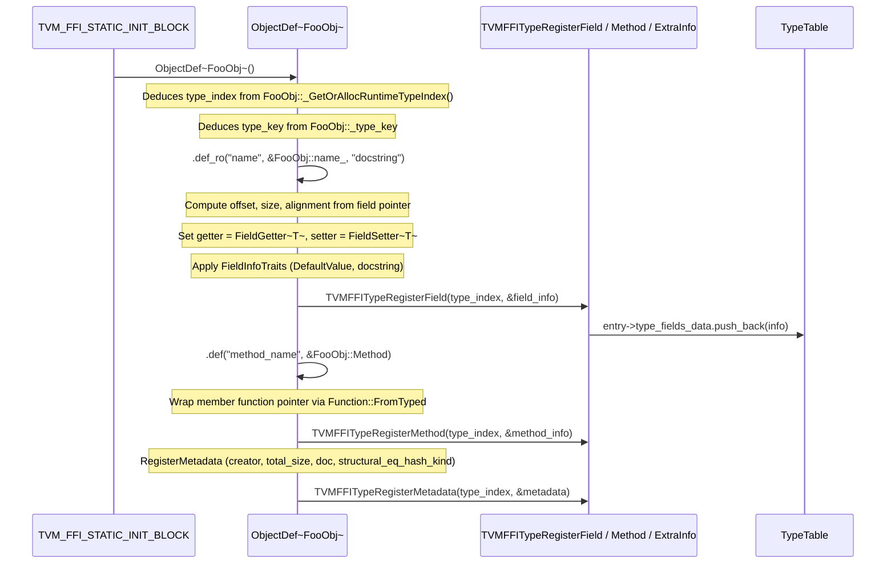
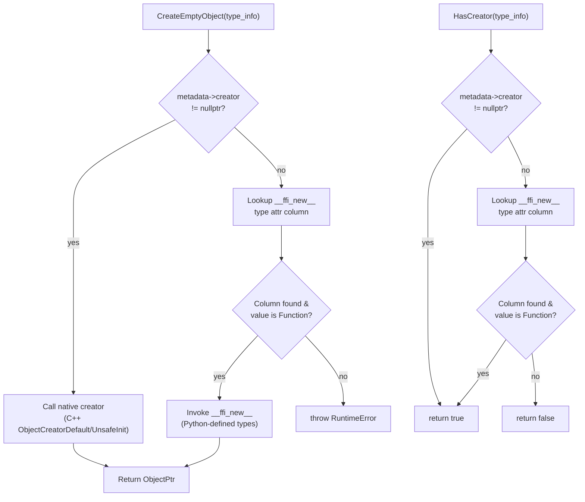
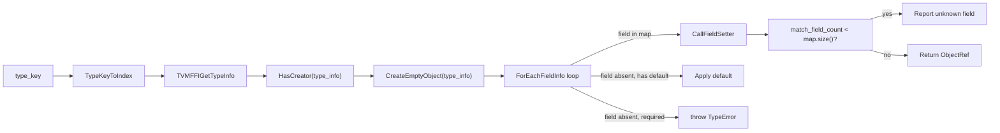
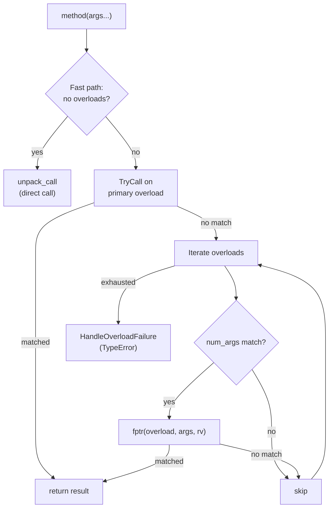
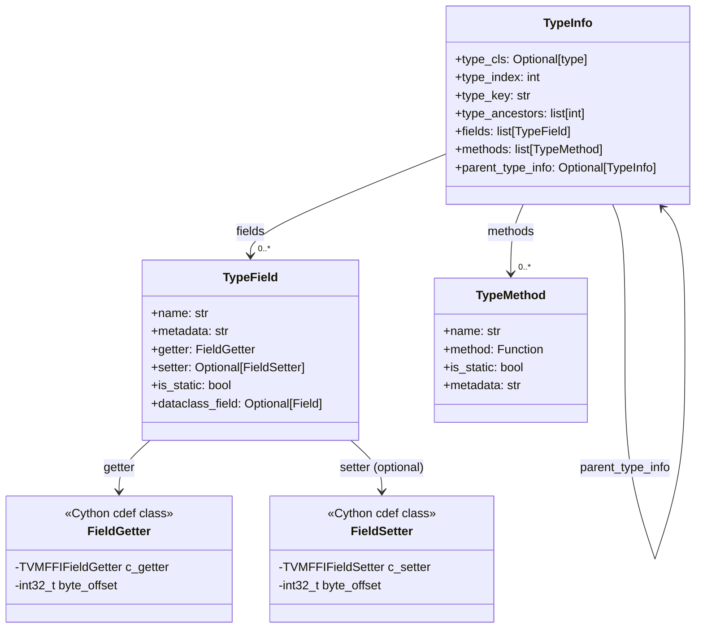
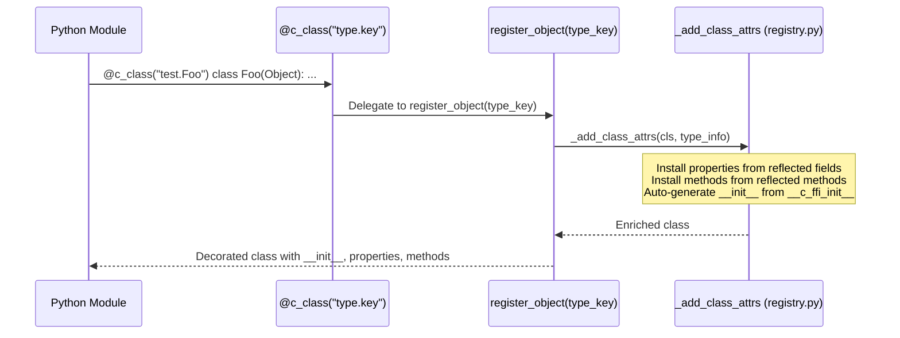

# Reflection System

**TL;DR**
- The reflection system allows runtime enumeration and access of object fields and methods by name. `ObjectDef<Class>` registers field/method metadata per type into the `TypeTable`. `GlobalDef` registers global functions with rich metadata.
- Field access uses byte offsets from the `Object` base pointer plus getter/setter function pointers. Method reflection stores `Function` objects as `TVMFFIAny` values. Both support docstrings, structured JSON metadata (renamed from `type_schema` in commit `ffa2dbf`), default values, and an extensible flags bitmask.
- `MakeObjectFromPackedArgs` provides generic object construction from packed keyword arguments, using reflection metadata to populate fields by name.

## Problem Statement

### Background

Language bindings need to access C++ object fields and methods without writing per-field C wrapper functions. Python `@register_object` classes need generic `__getattr__`/`__setattr__`. Serializers need to enumerate all fields of an object type.

### Solution

A registration-based reflection system where `ObjectDef<Class>()` registers field and method metadata into the global `TypeTable` during static initialization. At runtime, `TVMFFIGetTypeInfo(type_index)` returns `TVMFFITypeInfo` with `fields`, `methods`, and `metadata`.

### Goals

- **Goal**: Generic field/method access from any language binding without per-field C wrappers.
- **Goal**: Support readonly (`def_ro`) and readwrite (`def_rw`) fields with compile-time mutability enforcement.
- **Goal**: Type-annotated fields via structured JSON metadata strings (field `metadata`, formerly `type_schema`) for serialization and code generation.
- **Goal**: Method reflection for both instance and static methods.
- **Goal**: Reflection-based object construction (`MakeObjectFromPackedArgs`).
- **Non-goal**: Runtime schema modification (all registration happens during static initialization).

## Design

### Header Organization

The reflection system is split into two focused headers:
- **`registry.h`** (write-path): `ObjectDef<Class>`, `GlobalDef`, `TypeAttrDef<Class>`, `ReflectionDefBase`, `DefaultValue`, `AttachFieldFlag`, `EnsureTypeAttrColumn` -- used by `.cc` files that register metadata during static initialization.
- **`accessor.h`** (read-path): `FieldGetter`, `FieldSetter`, `GetFieldInfo`, `GetMethodInfo`, `GetMethod`, `ForEachFieldInfo`, `ForEachFieldInfoWithEarlyStop`, `TypeAttrColumn` -- used by code that queries reflection metadata at runtime.

### Registration Flow



### ObjectDef: Type-Level Registration

```cpp
TVM_FFI_STATIC_INIT_BLOCK() {
  ObjectDef<FooObj>()
    .def_ro("name", &FooObj::name_, "The name field")
    .def_rw("value", &FooObj::value_, DefaultValue(42))
    .def("compute", &FooObj::Compute)
    .def_static("create", &FooObj::Create);
}
```

`ObjectDef<Class>` deduces `type_index` and `type_key` from the `Class` template parameter. It inherits from `ReflectionDefBase` which provides shared helpers.

- `def_ro(name, field_ptr, extra...)`: Read-only field. Sets `flags & kTVMFFIFieldFlagBitMaskWritable = 0`.
- `def_rw(name, field_ptr, extra...)`: Read-write field. Requires `static_assert(Class::_type_mutable)`. Sets writable flag.
- `def(name, method_ptr, extra...)`: Instance method. Wraps via `Function::FromTyped`.
- `def_static(name, func, extra...)`: Static method. Sets `kTVMFFIFieldFlagBitMaskIsStaticMethod`.

Field pointers can be declared in a base class (`T BaseClass::*field_ptr`) with a `static_assert(std::is_base_of_v<BaseClass, Class>)` guard, enabling inherited field registration.

**Shallow copy registration** (commit `c73d61a` #438): `ObjectDef<Class>` automatically registers a `__ffi_shallow_copy__` type attribute for types that are copy-constructible. The shallow copy creates a new object via `make_object<Class>(*src)` (C++ copy constructor). This is exposed as a type attribute (not a method) so that Python can detect copy support at registration time and install `__copy__` accordingly. Non-copy-constructible types do not get `__ffi_shallow_copy__`, and Python `copy.copy()` raises `TypeError` for them.

**Auto-init registration** (commit `6b39efb` #482): `ObjectDef<Class>` auto-generates a packed `__ffi_init__` constructor in its destructor when no explicit `refl::init<Args...>` was registered. The auto-generated init analyzes reflected fields (positional ordering, `kw_only`, defaults) and supports both positional-only and KWARGS calling conventions. The KWARGS convention uses a sentinel object (`ffi.GetKwargsObject()`) as a marker in the packed argument list. Opt-out via `refl::init(false)` at class level suppresses auto-init; at field level it sets `kTVMFFIFieldFlagBitMaskInitOff`. See [ADR 0068](../ADRs/0068-auto-init-from-reflection.md) and `include/tvm/ffi/reflection/init.h`.

### GlobalDef: Global Function Registration

```cpp
TVM_FFI_STATIC_INIT_BLOCK() {
  reflection::GlobalDef()
    .def("ffi.MakeObjectFromPackedArgs", MakeObjectFromPackedArgs)
    .def("testing.nop", [](PackedArgs, Any*) {});
}
```

`GlobalDef` inherits from `ReflectionDefBase` and registers functions via `TVMFFIFunctionSetGlobalFromMethodInfo`, attaching `TVMFFIMethodInfo` metadata.

### MakeObjectFromPackedArgs: Reflection-Based Construction

```
ffi.MakeObjectFromPackedArgs(type_key_or_index, field1, val1, field2, val2, ...) -> Object
```

Protocol:
1. Resolve type_key/type_index to `TVMFFITypeInfo`.
2. Check `metadata->creator` exists; call it to default-construct an empty object.
3. Walk ancestor types from parent to child (using `type_ancestors[1..depth]`).
4. For each ancestor and the type itself, iterate `fields`: match by name, call `setter`, apply defaults for missing fields with `kTVMFFIFieldFlagBitMaskHasDefault`.
5. Report errors for missing required fields or unknown field names.

### Centralized Object Creation: `CreateEmptyObject` / `HasCreator`

As of commit `e268eb1` (#501), all reflection-based object creation is centralized in two inline helpers in `include/tvm/ffi/reflection/creator.h`:



- **`CreateEmptyObject(type_info)`**: Tries the native `metadata->creator` fast path first (C++ types), then falls back to the `__ffi_new__` type attribute (Python-defined types). Throws `RuntimeError` if neither path succeeds.
- **`HasCreator(type_info)`**: Same two-path check without side effects, used by callers that need to probe creatability (e.g., `ObjectDef` destructor deciding whether to register auto-init).

These replace four previously-duplicated creation patterns in `creator.h`, `init.h`, `reflection_extra.cc`, and `serialization.cc`. See [ADR 0070](../ADRs/0070-centralized-object-creation.md).

### ObjectCreator: Reflection-Based Construction from Map

`reflection::ObjectCreator` (`include/tvm/ffi/reflection/creator.h`) provides a C++-ergonomic alternative to `MakeObjectFromPackedArgs` for constructing objects from named fields. It accepts a `Map<String, Any>` instead of packed args.



Protocol:
1. **Construction**: Validates via `HasCreator(type_info)`. Throws `RuntimeError` if creatability check fails.
2. **`operator()(Map<String, Any>)`**: Calls `CreateEmptyObject` for default construction, then iterates fields via `ForEachFieldInfo`. For each field: if in map, calls `CallFieldSetter`; if absent with default, applies default; if absent and required, throws `TypeError`.
3. **Extra-field detection**: After the loop, if `match_field_count < fields.size()`, iterates map keys to find and report the first unknown field.

**Key invariant**: Field names in the map must exactly match registered field names.

**Relationship to MakeObjectFromPackedArgs**: `MakeObjectFromPackedArgs` accepts packed `(key, value, key, value, ...)` args suitable for the FFI calling convention. `ObjectCreator` accepts `Map<String, Any>` suitable for C++ callers. Both use `CreateEmptyObject` and `CallFieldSetter` for the underlying operations.

### TypeAttr: Extensible Per-Type Attributes

`TypeAttrDef<Class>` provides a parallel registration path alongside `ObjectDef<Class>` for extensible per-type attributes. See [0010-type-attr-columns](0010-type-attr-columns.md) for the full design. Key integration points with the reflection system:

- `TypeAttrDef<Class>` inherits from `ReflectionDefBase`, reusing `GetMethod<Class>` for wrapping member function pointers.
- `AttachFieldFlag` is a `FieldInfoTrait` for annotating per-field structural equal/hash behavior. Factory methods: `SEqHashDef()` (marks variable-binding region), `SEqHashIgnore()` (skips field during comparison).
- `EnsureTypeAttrColumn(name)` pre-creates a column for read-path code that needs to obtain the column pointer before any type registers values.

### ForEachFieldInfo: Ancestor-Chain Field Iteration

Two variants:
- `ForEachFieldInfo(type_info, callback)`: Callback returns `void`. Iterates all fields from root ancestor to leaf.
- `ForEachFieldInfoWithEarlyStop(type_info, callback)`: Callback returns `bool`. Returns `true` if any callback returns `true` (early termination).

Both skip `type_ancestors[0]` (root `Object`, which has no registered fields).

### Key Classes, Fields and Interfaces

- **`ObjectDef<Class>`** (`registry.h`): Type-level registration builder. Deduces type_index/type_key from Class.
- **`GlobalDef`** (`registry.h`): Global function registration builder. Methods: `def`, `def_packed`, `def_method`.
- **`ReflectionDefBase`** (`registry.h`): Shared base with `FieldGetter<T>`, `FieldSetter<T>`, `ObjectCreatorDefault<T>`, `GetMethod`, `ApplyFieldInfoTrait`, `ApplyMethodInfoTrait`, `ApplyExtraInfoTrait`.
- **`DefaultValue`** (`registry.h`): A field info trait that sets the default value and `kTVMFFIFieldFlagBitMaskHasDefault` flag. The value is stored in `TVMFFIFieldInfo::default_value_or_factory`.
- **`DefaultFactory`** (`registry.h`, commit `5e564cd` #446): A field info trait that stores a callable `() -> Any` factory function in `default_value_or_factory` and sets both `kTVMFFIFieldFlagBitMaskHasDefault` and `kTVMFFIFieldFlagBitMaskDefaultFromFactory` flags. Each time a default is needed (e.g., during `MakeObjectFromPackedArgs` or `ObjectCreator`), the factory is invoked to produce a fresh value. This prevents mutable default aliasing (e.g., all instances sharing the same `Array` default).
- **`SetFieldToDefault`** (`accessor.h`, commit `5e564cd` #446): Helper function that resolves a field's default -- calling the factory when `kTVMFFIFieldFlagBitMaskDefaultFromFactory` is set, or using the static value otherwise. Centralizes the three consumption sites (`creator.h`, `reflection_extra.cc`, `serialization.cc`).
- **`AttachFieldFlag`** (`registry.h`): A field info trait for attaching arbitrary flag bits to fields. Factory methods: `SEqHashDef()`, `SEqHashIgnore()`.
- **`repr`** (`registry.h`, commit `b648c5d` #454, renamed from uppercase `Repr` in `6b39efb` #482): A field info trait that controls whether a field appears in generic repr output. `repr(false)` sets the `kTVMFFIFieldFlagBitMaskReprOff` flag (bit 6) on the field, excluding it from the DFS-based `ffi.ReprPrint` output. By default, all fields are included. Usage: `refl::ObjectDef<FooObj>().def_ro("internal", &FooObj::internal_, refl::repr(false))`.
- **`compare`** (`registry.h`, commit `6b39efb` #482): A field info trait that controls whether a field participates in recursive comparison. `compare(false)` sets `kTVMFFIFieldFlagBitMaskCompareOff` (bit 7). Usage: `refl::ObjectDef<FooObj>().def_ro("cached", &FooObj::cached_, refl::compare(false))`.
- **`hash`** (`registry.h`, commit `6b39efb` #482): A field info trait that controls whether a field participates in recursive hashing. `hash(false)` sets `kTVMFFIFieldFlagBitMaskHashOff` (bit 8). Usage: `refl::ObjectDef<FooObj>().def_ro("cached", &FooObj::cached_, refl::hash(false))`.
- **`kw_only`** (`registry.h`, commit `6b39efb` #482): A field info trait that marks a field as keyword-only in the auto-generated `__ffi_init__`. `kw_only(true)` sets `kTVMFFIFieldFlagBitMaskKwOnly` (bit 10).
- **`init<>`** (`registry.h`, commit `6b39efb` #482): Zero-argument specialization that doubles as an `InfoTrait`. `init(false)` as a field trait sets `kTVMFFIFieldFlagBitMaskInitOff` (bit 9). As an `ObjectDef` constructor argument, suppresses auto-init generation entirely. CTAD guide: `init(bool) -> init<>`.
- **`default_value`** / **`default_factory`** (`registry.h`, commit `6b39efb` #482): Lowercase aliases for `DefaultValue` and `DefaultFactory` respectively, providing a consistent lowercase API.
- **`type_attr::kRepr`** (`registry.h`, commit `b648c5d` #454): String constant `"__ffi_repr__"` for the repr type attribute column. Types can register custom repr functions via `TypeAttrDef<T>().def("__ffi_repr__", custom_repr_fn)` with signature `(const T*, const Function& fn_repr) -> String`, where `fn_repr` is a callback for recursive repr of child values.
- **`type_attr::kHash`** (`registry.h`, commit `6b39efb` #482): String constant `"__ffi_hash__"`. Custom per-type recursive hash hook.
- **`type_attr::kEq`** (`registry.h`, commit `6b39efb` #482): String constant `"__ffi_eq__"`. Custom per-type recursive equality hook.
- **`type_attr::kCompare`** (`registry.h`, commit `6b39efb` #482): String constant `"__ffi_compare__"`. Custom per-type three-way comparison hook.
- **`MakeInit(type_index) -> Function`** (`init.h`, commit `6b39efb` #482): Creates a packed `__ffi_init__` constructor from reflection metadata. Supports positional and KWARGS calling conventions.
- **`RegisterAutoInit(type_index)`** (`init.h`, commit `6b39efb` #482): Calls `MakeInit` and registers the result as `__ffi_init__` method.
- **`TypeAttrDef<Class>`** (`registry.h`): Type-level attribute registration builder. Methods: `def(name, func)`, `attr(name, value)`.
- **`TypeAttrColumn`** (`accessor.h`): Read-path accessor for named attribute columns. `operator[](int32_t type_index) -> AnyView`.
- **`EnsureTypeAttrColumn(name)`** (`registry.h`): Pre-creates a named column.
- **`CreateEmptyObject(type_info)`** (`creator.h`, commit `e268eb1` #501): Centralized inline helper for reflection-based object creation. Two-path resolution: native `metadata->creator` fast path, then `__ffi_new__` type attribute fallback for Python-defined types. Throws `RuntimeError` if neither path succeeds. See [ADR 0070](../ADRs/0070-centralized-object-creation.md).
- **`HasCreator(type_info)`** (`creator.h`, commit `e268eb1` #501): Predicate checking whether a type supports reflection creation (native creator or `__ffi_new__` type attr). Used by `ObjectDef` destructor and `ObjectCreator` constructor.
- **`CallFieldSetter(field_info, field_addr, value)`** (`accessor.h`, commit `10dc59d` #500): Central dispatch helper for field assignment. Checks `kTVMFFIFieldFlagBitSetterIsFunctionObj` (bit 11): if clear, casts `setter` to `TVMFFIFieldSetter` (default fast path); if set, invokes via `TVMFFIFunctionCall` (runtime-defined setter). See [ADR 0071](../ADRs/0071-functionobj-dispatched-field-setter.md).
- **`FieldGetter`** (`accessor.h`): Wrapper that reads a field given `Object*` and `TVMFFIFieldInfo*`.
- **`FieldSetter`** (`accessor.h`): Wrapper that writes a field given `Object*`, `TVMFFIFieldInfo*`, and value.
- **`GetFieldInfo(type_key, field_name)`** (`accessor.h`): Looks up `TVMFFIFieldInfo` by type key and name.
- **`GetMethodInfo(type_key, method_name)`** (`accessor.h`): Looks up `TVMFFIMethodInfo`.
- **`GetMethod(type_key, method_name)`** (`accessor.h`): Returns the `Function` from method info.
- **`ForEachFieldInfo` / `ForEachFieldInfoWithEarlyStop`** (`accessor.h`): Ancestor-chain field iteration.
- **`GetFieldByteOffsetToObject<Class, T>`**: Computes byte offset from `Object*` to the field, accounting for multiple inheritance offsets.
- **`ObjectCreator`** (`include/tvm/ffi/reflection/creator.h`): Reflection-based object construction from `Map<String, Any>`. Uses `HasCreator`/`CreateEmptyObject` for creation and `CallFieldSetter` for field population. C++ alternative to `MakeObjectFromPackedArgs`.
- **`TVM_FFI_STATIC_INIT_BLOCK`** (`base_details.h`): Universal static-initialization macro using function-style syntax (`TVM_FFI_STATIC_INIT_BLOCK() { ... }`). On GCC/Clang, generates a named function with `__attribute__((constructor))`. On other compilers (MSVC), uses a forward-declared function invoked by a self-executing lambda assigned to a `static inline int` variable. Changed from brace-argument syntax (`TVM_FFI_STATIC_INIT_BLOCK({...})`) in commit `7b813f8`.
- **`OverloadObjectDef<Class>`** (`overload.h`): Drop-in replacement for `ObjectDef<Class>` that supports runtime overload resolution for methods with different argument types. Tracks registered methods in an internal map to detect and chain overloads.
- **`OverloadedFunction<Callable>`** (`overload.h`): Function object that dispatches to the primary callable or a vector of alternative overloads based on runtime argument types via `try_cast`. De-virtualizes dispatch via stored `FnPtr`.
- **`TypedOverload<Callable>`** (`overload.h`): Single-callable overload entry. Attempts `try_cast` on each argument; short-circuits on first mismatch.
- **`Function::FromPackedInplace<FuncType>`** (`function.h`): Creates a `FunctionObj` with the functor stored inline in the object's memory, avoiding an extra heap allocation. Supports `OverloadedFunction` and other stateful functors.

### Contracts, Assumptions and Invariants

- **Byte offset stability**: Once registered, the byte offset of a field must not change.
- **Getter/setter safety**: Use `TVM_FFI_SAFE_CALL_BEGIN/END` for error propagation.
- **String ownership**: Field names and docstrings are copied into `any_pool_` (vector of `Any`) for lifetime management.
- **Single-threaded registration**: Field/method registration happens during static init and is not thread-safe.
- **_type_mutable enforcement**: `def_rw` has `static_assert(Class::_type_mutable)` -- classes must explicitly opt in to writable fields.
- **Single-registration for metadata**: `RegisterTypeMetadata` (formerly `RegisterTypeExtraInfo`) throws on duplicate registration.
- **Three-tier creator resolution**: `ObjectDef<T>` constructor checks creators in order: (1) `std::is_default_constructible_v<Class>` -> `ObjectCreatorDefault<T>`, (2) `std::is_constructible_v<Class, UnsafeInit>` -> `ObjectCreatorUnsafeInit<T>`, (3) neither -> no creator registered. The `ObjectCreatorUnsafeInit<T>` fallback (commit `472e10c` #18284) enables reflection-based construction for types that opt into `UnsafeInit` but lack default constructors.
- **Single-registration for type attributes**: `TypeAttrDef` registration throws if the same attribute is registered twice for the same type_index.
- **Ancestor pointer iteration**: `ForEachFieldInfo` relies on `type_ancestors` being direct `TVMFFITypeInfo*` pointers.

### Extension Points

- **New FieldInfoTraits**: Implement `ApplyFieldInfoTrait` for custom field metadata (e.g., validators, serialization hints).
- **Computed properties**: The getter/setter function pointers can support non-field-backed properties.
- **Python dataclass integration**: `c_class` auto-generates `__init__`, `__getattr__`, `__setattr__` from reflection metadata. See the "Python c_class Decorator" section below.
- **New ExtraInfoTraits**: `ApplyExtraInfoTrait` for type-level metadata.
- **Overloaded methods**: `OverloadObjectDef<Class>` enables runtime overload resolution for methods. See the "Overload Dispatch" section below.

### Overload Dispatch (overload.h)

`include/tvm/ffi/reflection/overload.h` provides dynamic-style overload resolution for FFI object methods. When a method is registered multiple times (with different argument types), the system dispatches at runtime based on argument types using `try_cast`.



**Key classes:**

- **`OverloadBase`** (`overload.h`): Abstract base for all overload entries. Stores `num_args_`, a `last_mismatch_index_` cache for error reporting, and a name. Subclasses implement `GetTryCallPtr()`, `Register()`, and `GetMismatchMessage()`.
- **`TypedOverload<Callable>`** (`overload.h`): Concrete overload entry for a single typed callable. `TryCall()` checks `num_args`, then attempts `try_cast` on each argument into a `CaptureTuple` (tuple of `optional<decay_t<Args>>...`). If all arguments match, calls the underlying callable. Short-circuits on the first mismatch, recording the index in `last_mismatch_index_` for error messages.
- **`OverloadedFunction<Callable>`** (`overload.h`): Extends `TypedOverload` with a vector of additional `OverloadBase` entries. Acts as the primary overload and dispatcher. `operator()` first tries the primary overload (fast path with zero overhead when no overloads exist), then iterates registered overloads. De-virtualizes `fptr` by storing both the `unique_ptr<OverloadBase>` and the raw `FnPtr` side by side, reducing indirection.
- **`OverloadObjectDef<Class>`** (`overload.h`): Drop-in replacement for `ObjectDef<Class>` that supports method overloading. Maintains a `registered_fields_` map (`string -> OverloadBase*`). When `def()` or `def_static()` is called for an already-registered method name, it calls `Register()` on the existing overload function. Otherwise, it creates a new `OverloadedFunction` via `Function::FromPackedInplace`.
- **`Function::FromPackedInplace<FuncType>`** (`function.h`): Creates a `FunctionObj` that stores the functor inline (in the object's memory), avoiding an extra heap allocation. Added to support `OverloadedFunction` which needs to be stored as a `Function` while maintaining direct access to the overload dispatch state.

**Dispatch algorithm (per call):**
1. If no overloads have been registered, call the primary callable directly via `unpack_call` (zero overhead).
2. Otherwise, try the primary overload first via `TryCall`.
3. On mismatch, iterate the overloads vector. For each overload, first check `num_args_` (fast integer comparison) before calling the `fptr`.
4. If all overloads fail, collect mismatch messages from all overloads and throw `TypeError`.

**Argument matching:** Uses `try_cast<T>()` (lenient conversion) rather than `as<T>()` (strict). This means `int` values match `float` parameters, `String` matches `const char*`, etc. The matching is greedy (first match wins).

**Error reporting:** On failure, each overload's `GetMismatchMessage` reports which argument caused the mismatch (tracked by `last_mismatch_index_`), the expected type (`Type2Str<Type>::v()`), and the actual type (`GetMismatchTypeInfo`).

**Key invariants:**
- Overloads are tried in registration order (first-registered primary has priority).
- Fields (`def_ro`/`def_rw`) cannot be overloaded; only methods support overloading.
- The `CaptureTuple` ensures arguments are captured before calling, preventing partial evaluation.

**Key trade-off:** Using `try_cast` (lenient) for dispatch means overloads with overlapping lenient conversions (e.g., `f(int)` and `f(float)`) resolve to the first registered overload when an `int` argument is passed. This is a deliberate choice favoring simplicity over most-specific-match semantics.

### reflection::init<Args...>: Convenience Constructor Registration

`reflection::init<Args...>` (in `registry.h`) is a template struct that simplifies `__init__` method registration in reflection. Instead of writing a lambda, callers pass `init<Args...>` to `ObjectDef::def()`:

```cpp
// Before: manual lambda
refl::ObjectDef<FooObj>()
    .def_static("__init__", [](int64_t a, int32_t b) -> ObjectRef {
        return ObjectRef(make_object<FooObj>(a, b));
    });

// After: init<> convenience
refl::ObjectDef<FooObj>()
    .def(refl::init<int64_t, int32_t>());
```

**Two forms:**

1. **`init<Args...>`** (with template arguments): Wraps `make_object<Class>(args...)` and returns `ObjectRef`. Supports both `Object`-derived and `ObjectRef`-derived template parameters (using `ContainerType` alias for `ObjectRef` subclasses). Registered as `__init__` static method.

2. **`init<>`** (zero template arguments, via CTAD): Doubles as an `InfoTrait` controlling whether a field or class participates in auto-generated `__ffi_init__`:
   - `init(false)` as a field trait: sets `kTVMFFIFieldFlagBitMaskInitOff`, excluding the field from auto-init.
   - `init(false)` in `ObjectDef<T>(refl::init(false))`: suppresses auto-init generation entirely.

**Auto-init** (commit `6b39efb` #482): When no explicit `refl::init<Args...>` is registered, `ObjectDef<Class>` destructor auto-generates a packed `__ffi_init__` via `RegisterAutoInit(type_index_)`. The auto-generated init pre-computes field analysis (positional ordering with required-before-optional via `std::stable_partition`, keyword-only fields, name-to-index map) and supports KWARGS calling convention using the `ffi.GetKwargsObject()` sentinel. See [ADR 0068](../ADRs/0068-auto-init-from-reflection.md) and [0027-dataclass-operations](0027-dataclass-operations.md).

**Related: `kw_only`** (`registry.h`): An `InfoTrait` that marks a field as keyword-only in auto-generated `__ffi_init__`. Sets `kTVMFFIFieldFlagBitMaskKwOnly`. Usage: `refl::kw_only(true)`.

**TypeStr for Any/AnyView**: As of commit `38914fa` (#393), `Type2Str<Any&&>` and `Type2Str<AnyView&&>` specializations are provided in `any.h`, and a forward declaration of `Any` is added in `type_traits.h`. This enables `refl::init<Any>()` and `refl::init<AnyView>()` to compile, allowing reflection-based constructors to accept type-erased `Any` fields.

### Python TypeInfo Registry

The Python-side `TypeInfo` registry (introduced in `type_info.pxi`) surfaces C++ reflection metadata as Python dataclasses, enabling pure-Python introspection of type fields, methods, and inheritance.



**Lookup tables:**
- `TYPE_INDEX_TO_INFO` (`list`): Maps type_index to `TypeInfo` (or `None`). Parallel to `TYPE_INDEX_TO_CLS`.
- `TYPE_KEY_TO_INFO` (`dict[str, TypeInfo]`): Maps type_key string to `TypeInfo`.
- `TYPE_INDEX_TO_CLS` (`cdef list`): Fast-path parallel list mapping type_index directly to the Python class. Avoids `TypeInfo` attribute access in the `make_ret_object` hot path. **Invariant**: `len(TYPE_INDEX_TO_CLS) == len(TYPE_INDEX_TO_INFO)` and `TYPE_INDEX_TO_CLS[i] == TYPE_INDEX_TO_INFO[i].type_cls` when both are non-`None`.

**Lazy creation:** `_lookup_type_info_from_type_key(key)` creates `TypeInfo` on demand from C metadata even for types without a registered Python class (`type_cls=None`). This enables the `c_class` decorator to introspect parent types before their Python classes exist.

**Registration flow:** `_register_object_by_index(type_index, cls)` now returns a `TypeInfo` and populates both `TYPE_INDEX_TO_INFO` and `TYPE_INDEX_TO_CLS`. `_set_type_cls(type_index, cls)` provides deferred class registration for types whose `TypeInfo` was created lazily.

### Python c_class Decorator

The `tvm_ffi.dataclasses` package provides a Python decorator for declaring C++ FFI-backed types.

As of commit `b97ff1a` (#478), the Python-side field descriptor infrastructure (`_utils.py`, `field.py`) was removed. The `c_class` decorator is now a thin pass-through to `register_object`, relying entirely on C++ reflection for field metadata, `__init__` generation, and property installation. See [ADR 0065](../ADRs/0065-remove-python-field-descriptors.md) for the decision rationale.



**Key components:**
- **`c_class(type_key, **kwargs)`**: Thin wrapper around `register_object`. The `init`, `kw_only`, `repr` parameters were all removed. The decorator accepts (and ignores) extra keyword arguments for forward compatibility.
- **`_add_class_attrs(type_cls, type_info)`** (`registry.py`): Iterates `TypeInfo` fields and methods. Always overrides `__c_ffi_init__` per type (commit `b97ff1a` #478), preventing inherited base-class constructors from masking derived-class constructors. If the class lacks `__init__` and has `__c_ffi_init__`, auto-generates an `__init__` that delegates to it.

**Removed infrastructure** (commit `b97ff1a` #478):
- `_utils.py` (210 lines): `type_info_to_cls`, `fill_dataclass_field`, `method_init` exec-based codegen
- `field.py` (169 lines): `Field` class, `KW_ONLY` sentinel, default factory wiring
- `c_class.py` reduced from 190 to 36 lines
- `test_dataclasses_c_class.py` (151 lines): Tests for removed infrastructure

**Key invariants:**
- `__repr__` is delegated to the C++-side `ffi.ReprPrint` function (commit `b648c5d` #454). See [ADR 0061](../ADRs/0061-unified-repr-print.md).
- `__c_ffi_init__` is always overridden per type, ensuring derived classes do not inherit base-class constructors with wrong field counts.
- Inheritance chains are resolved via `parent_type_info`, enabling child classes to inherit parent fields.

### Metadata and JSON Type Schemas

As of commit `28fe3cc` (#36), the reflection system supports machine-readable type schemas and extensible metadata for fields, methods, and global functions. This forms the foundation for stub generation and tooling. See [0023-type-schema-and-stubgen](0023-type-schema-and-stubgen.md) for the full design.

**`TypeSchema<T>` (C++)**: A static method on every `TypeTraits` specialization that generates a JSON string describing the type (e.g., `{"type":"int"}`, `{"type":"ffi.Function","args":[ret, arg1, ...]}`).

**`Metadata` class (C++)**: Key-value pairs (`String` -> `Any`, values restricted to `int`/`bool`/`String`) attachable to fields, methods, and global functions via `InfoTrait::Apply()`. Serialized to JSON and stored in `TVMFFIFieldInfo.metadata` / `TVMFFIMethodInfo.metadata`.

**`TypeSchema` (Python)**: Dataclass in `type_info.pxi` that parses JSON schema strings. `repr(ty_map=None)` (commit `dd4fb0a` #94) enables type name remapping for stub generation.

**`get_global_func_metadata(name)` (Python)**: Retrieves metadata dict including `type_schema` for any registered global function.

### Auto-`__init__` Generation for Registered Objects

As of commit `0729193` (#174), when `register_object` processes a class that lacks `__init__`:
1. If `__ffi_init__` (registered via `def(init<Args...>())`) is available, auto-generates `__init__` that delegates to it.
2. Otherwise, generates an `__init__` that raises `RuntimeError`.

This prevents the previous failure mode where constructing without a defined init silently created an object with `chandle=None`, triggering segfaults on field access.

### Explicit-Registration-Only Object Types

As of commit `9ac3121` (#116), automatic static-inline type registration triggered by `TVM_FFI_DECLARE_OBJECT_INFO` macros was removed. Object types now require explicit registration via `reflection::ObjectDef<T>()` for dynamic casting to work. Built-in types are pre-registered in `object.cc`. See [ADR 0046](../ADRs/0046-explicit-object-registration.md).

**Rationale**: Static-inline registration caused per-DLL space overhead even for unused classes.

### Cython Lifetime Safety: ByteArrayArg

A use-after-free bug was discovered and fixed in `_type_info_create_from_type_key` (commit `8e471b0`): a temporary `ByteArrayArg` was destroyed before `TVMFFITypeKeyToIndex` finished reading its pointer. The fix assigns the temporary to a named `cdef` variable, extending its lifetime past the C API call.

**Failure mode**: Cython temporaries created inline in a function call expression are destroyed at the end of the full expression, potentially before the callee reads the pointed-to data. This is a general hazard for any Cython code that passes `ByteArrayArg` (or similar pointer-wrapping temporaries) to C functions.

**Mitigation**: Always assign `ByteArrayArg` to a named `cdef` variable before passing its pointer to a C API function.

## Alternatives & Trade-offs

### Alternative: Per-field registered global functions

- Pros: Simpler -- each field access is a named function call
- Cons: Combinatorial explosion: N types x M fields = N*M registered functions. The byte-offset approach uses generic getter/setter per C++ type.

### Alternative: Per-type __init__ functions instead of MakeObjectFromPackedArgs

- Pros: Per-type init can enforce custom validation
- Cons: Manual, N types = N functions. Reflection-based construction requires only default constructibility + field setters, eliminating boilerplate.

## Related Work

### Design Docs & ADRs

- [`.knowledge/designs/0003-object-system.md`](0003-object-system.md) -- `TypeTable` where reflection data is stored
- [`.knowledge/designs/0001-c-abi.md`](0001-c-abi.md) -- `TVMFFIFieldInfo`, `TVMFFIMethodInfo`, `TVMFFITypeMetadata`, `TVMFFITypeAttrColumn` C structs
- [`.knowledge/designs/0009-structural-equal-hash.md`](0009-structural-equal-hash.md) -- Primary consumer of TypeAttrColumn for custom dispatch
- [`.knowledge/designs/0010-type-attr-columns.md`](0010-type-attr-columns.md) -- TypeAttr column system details
- [`.knowledge/designs/0004-function-system.md`](0004-function-system.md) -- `GlobalDef` and `GlobalFunctionTable`
- [`.knowledge/designs/0014-python-bindings.md`](0014-python-bindings.md) -- Python bindings consuming `TypeInfo` for `@register_object` and `c_class`
- [`.knowledge/designs/0023-type-schema-and-stubgen.md`](0023-type-schema-and-stubgen.md) -- Type schema format and stub generation tool
- [`.knowledge/ADRs/0046-explicit-object-registration.md`](../ADRs/0046-explicit-object-registration.md) -- Decision to remove static inline type registration
- [`.knowledge/ADRs/0052-overload-dispatch-via-try-cast.md`](../ADRs/0052-overload-dispatch-via-try-cast.md) -- Decision to use try_cast-based dynamic dispatch for overloaded methods
- [`.knowledge/ADRs/0065-remove-python-field-descriptors.md`](../ADRs/0065-remove-python-field-descriptors.md) -- Decision to remove Python-side field descriptor infrastructure
- [`.knowledge/ADRs/0068-auto-init-from-reflection.md`](../ADRs/0068-auto-init-from-reflection.md) -- Decision to auto-generate `__ffi_init__` from ObjectDef destructor
- [`.knowledge/designs/0027-dataclass-operations.md`](0027-dataclass-operations.md) -- Unified dataclass operations consuming reflection metadata
- [`.knowledge/ADRs/0070-centralized-object-creation.md`](../ADRs/0070-centralized-object-creation.md) -- Centralized CreateEmptyObject/HasCreator
- [`.knowledge/ADRs/0071-functionobj-dispatched-field-setter.md`](../ADRs/0071-functionobj-dispatched-field-setter.md) -- FunctionObj-dispatched field setter
- [`.knowledge/ADRs/0073-register-object-auto-wires-init.md`](../ADRs/0073-register-object-auto-wires-init.md) -- register_object auto-wires __init__

### Evidence Matrix

- ObjectDef<Class> replaces ReflectionDef -> `.knowledge/commits/2025-06-15-1a856886c8c14c6271e156d1ce4d76335d42f0ff.md` + `1a85688`
- Method reflection (def/def_static) -> `.knowledge/commits/2025-06-05-11a4a02d83e41ca4ccaf81df59d14b75309f65e9.md` + `11a4a02`
- MakeObjectFromPackedArgs -> `.knowledge/commits/2025-06-16-a419ed175aac752a3df2ee73faad360a2824ecd8.md` + `a419ed1`
- GlobalDef -> `.knowledge/commits/2025-07-03-b333288162ba3a883dbf6b1ce23672f687d70163.md` + `b333288`
- ForEachFieldInfo -> `.knowledge/commits/2025-06-25-69f2484f915d95886502a1f620ea69aeed623c49.md` + `69f2484`
- ForEachFieldInfoWithEarlyStop -> `.knowledge/commits/2025-06-19-837800e772d8c1dfa3a00a9f23f096487c96bd37.md` + `837800e`
- Header split (registry.h + accessor.h) -> `.knowledge/commits/2025-07-14-e95b43b0a36325fc17ad3918e3572cf11fabae13.md` + `e95b43b`
- Base-class field pointer support -> `.knowledge/commits/2025-06-27-f7311e495820859fba26d19010fc5bda0275293d.md` + `f7311e4`
- TVM_FFI_STATIC_INIT_BLOCK -> `.knowledge/commits/2025-06-15-1a856886c8c14c6271e156d1ce4d76335d42f0ff.md` + `1a85688`
- TypeAttr introduction + TVMFFITypeMetadata rename -> `.knowledge/commits/2025-07-22-162d6009252dd44950a9aa9b890cbbce6b8e5155.md` + `162d600`
- AttachFieldFlag (SEqHashDef, SEqHashIgnore) -> `.knowledge/commits/2025-07-19-9445fe734839cffc8bdf881788528b7763f7be03.md` + `9445fe7`
- ObjectCreator class + Shape serialization -> `.knowledge/commits/2025-08-05-7cb92736b2ed95852ac71543937511acc7a3feec.md` + `7cb9273`
- AccessPath parent-tree refactor + MakeObjectFromPackedArgs moved to extra tier -> `.knowledge/commits/2025-08-06-f4ede982f00257881d9ba7fe82dd8abc07e14690.md` + `f4ede98`
- ObjectCreatorUnsafeInit<T> fallback for non-default-constructible types -> `.knowledge/commits/2025-09-08-472e10c4086e91fb788ffe1f0eee10df4bcf5db2.md` + `472e10c`
- TVM_FFI_STATIC_INIT_BLOCK syntax change to function-style (`TVM_FFI_STATIC_INIT_BLOCK() { ... }`) with compiler-branched backends -> `.knowledge/commits/2025-09-13-7b813f8bc6a548d9aebb24ec5d19c0aa8b89c6a7.md` + `7b813f8`
- reflection::init<Args...> template for __init__ registration -> `.knowledge/commits/2025-09-21-c01dadf31a66e74cdbfd7fdb1ffc81a75007965f.md` + `c01dadf`
- Python TypeInfo registry (TYPE_INDEX_TO_INFO, TYPE_KEY_TO_INFO, TypeInfo/TypeField/TypeMethod dataclasses) -> `.knowledge/commits/2025-09-19-53b2e00ef90a34f2dfa79014877dc6ca53e78c0f.md` + `53b2e00`
- c_class decorator introduction -> `.knowledge/commits/2025-09-21-e98b94e118dfa5ac4bcf3764a8b1695afee3d596.md` + `e98b94e`
- field(init=False) support and exec-based __init__ generation -> `.knowledge/commits/2025-09-24-daeb235a29c576d8702d447fa5f4773170bb1e8f.md` + `daeb235`
- field() mypy TypeVar fix -> `.knowledge/commits/2025-09-22-b5dd851f7019f4f63a19d9dce074ba62706f16e7.md` + `b5dd851`
- TYPE_INDEX_TO_CLS fast-path + _set_type_cls -> `.knowledge/commits/2025-09-23-035975a7e6804d1d23b07942d7704c30b3fadda0.md` + `035975a`
- Cython ByteArrayArg use-after-free fix in _type_info_create_from_type_key -> `.knowledge/commits/2025-09-25-8e471b01c8617e21404d8f6aaf80b57dd190f10f.md` + `8e471b0`
- type_schema -> metadata rename in TVMFFIFieldInfo and TVMFFIMethodInfo -> `.knowledge/commits/2025-10-01-ffa2dbf8bc18edb3114f18f619da08c4e3289de6.md` + `ffa2dbf`
- type_acenstors -> type_ancestors rename -> `.knowledge/commits/2025-09-25-98cb8af49ff599c217fce96c3d4f57c0f52b8ec4.md` + `98cb8af`
- Metadata and JSON type schemas for fields, methods, global funcs -> `.knowledge/commits/2025-10-03-28fe3cc7fc23b725ddefbb3ca1e1899a7dfd530c.md` + `28fe3cc`
- TypeSchema.repr(ty_map) for flexible type name overrides -> `.knowledge/commits/2025-10-08-dd4fb0ae92ab69b1cc0280e812a18a58273d4ae6.md` + `dd4fb0a`
- Self schema bug fix for member functions -> `.knowledge/commits/2025-10-07-368af824845424ea439b9f3d68bf4a710afb38b1.md` + `368af82`
- tvm_ffi.dtype usage in schema -> `.knowledge/commits/2025-10-07-c046b17108484780b8b13142e1c1a46e263ec979.md` + `c046b17`
- def(init<Args...>()) replaces def_static("__ffi_init__") -> `.knowledge/commits/2025-10-15-fc2630fac7acc17f966aae7fb724b23a9eec93c6.md` + `fc2630f`
- Remove static inline object registration in favor of ObjectDef -> `.knowledge/commits/2025-10-14-9ac312164e75c18e7b26214bba1f142de94913b4.md` + `9ac3121`
- Auto-generate __init__ from __ffi_init__ or raise error -> `.knowledge/commits/2025-10-19-0729193f475c7ab1059524fcfa6ffc742b0addac.md` + `0729193`
- ObjectRef::MemFn schema support -> `.knowledge/commits/2025-10-14-7b57a46648662b11b483f252787db22ab701231f.md` + `7b57a46`
- Overload dispatch (overload.h, OverloadObjectDef, OverloadedFunction, Function::FromPackedInplace) -> `.knowledge/commits/2025-12-23-84c5bdbcd11ae0e5bc921db4f35d3fd1d3ae762c.md` + `84c5bdb`
- Type2Str<Any&&> and Type2Str<AnyView&&> for reflection init -> `.knowledge/commits/2026-01-10-38914fa7a13fce9eb32462d649b0d2f1d11553d1.md` + `38914fa`
- __repr__ generation for @c_class -> `.knowledge/commits/2026-01-18-360648f30ccb14523ab6fbb81f37eb085b801f98.md` + `360648f`
- kw_only support for @c_class and field() -> `.knowledge/commits/2026-01-18-3a5bf5e68ad1b4108045ef6b336a13efcd2037d9.md` + `3a5bf5e`
- __ffi_shallow_copy__ auto-registration in ObjectDef -> `.knowledge/commits/2026-02-13-c73d61a423edf69483676f727cf272feebbe4d49.md` + `c73d61a`
- DefaultFactory support for field reflection -> `.knowledge/commits/2026-02-14-5e564cdfb932af63915fbeb5a5aa30671f55ae2c.md` + `5e564cd`
- Repr InfoTrait + kTVMFFIFieldFlagBitMaskReprOff + __ffi_repr__ type attr + removal of Python-side repr generation -> `.knowledge/commits/2026-02-18-b648c5d6b7981350c165096efbb98d00787e2900.md` + `b648c5d`
- Remove Python-side field descriptor infrastructure (field.py, _utils.py), simplify c_class to thin register_object wrapper -> `.knowledge/commits/2026-02-27-b97ff1ae2abd21f5b8a368d5e04f34b53e3985bf.md` + `b97ff1a`
- Auto-init from ObjectDef destructor + compare/hash/init/kw_only traits + KWARGS sentinel + MakeInit/RegisterAutoInit -> `.knowledge/commits/2026-02-27-6b39efbf381e48a8a42ab3779bc2adf587458fb3.md` + `6b39efb`
- Wire __init__ from C++ reflection in register_object and stubgen -> `.knowledge/commits/2026-03-01-6973d225eb3c67a7c306e36b20a100c5e9ff46f7.md` + `6973d22`
- Extend TVMFFIFieldInfo setter to support FunctionObj dispatch (CallFieldSetter, kTVMFFIFieldFlagBitSetterIsFunctionObj) -> `.knowledge/commits/2026-03-10-10dc59d196c8a88371a73a3fdc43d3400c0c0427.md` + `10dc59d`
- Centralize object creation with CreateEmptyObject/HasCreator (deduplicate 4 sites, __ffi_new__ fallback) -> `.knowledge/commits/2026-03-10-e268eb1d2d55ae97bdaab7ab52f381f436fd0c82.md` + `e268eb1`
