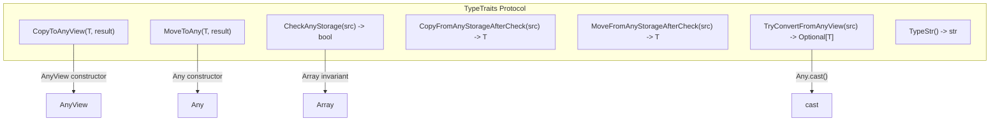

# TypeTraits Protocol: Compile-Time FFI Conversion

**TL;DR**
- `TypeTraits<T>` is a compile-time protocol (C++ template specialization) that governs how C++ types convert to and from `Any`/`AnyView`. Every FFI-compatible type must specialize this trait.
- The protocol distinguishes between exact storage checks (`CheckAnyStorage` -- strict type match) and implicit conversion (`TryConvertFromAnyView` -- allows widening, e.g., int to float). This distinction is critical for container invariants: `Array<int>` verifies all elements pass `CheckAnyStorage`, not just `TryConvertFromAnyView`.
- `FallbackOnlyTraitsBase` and `ObjectRefWithFallbackTraitsBase` enable ordered fallback conversion chains, allowing e.g., `String` to be constructed from `const char*` via a fallback path.

## Problem Statement

### Background
- The `Any`/`AnyView` system needs a uniform way to convert between arbitrary C++ types and the 16-byte `TVMFFIAny` representation.
- Some conversions are exact (int to kTVMFFIInt), while others involve implicit widening (int to float) or object construction (const char* to String).
- Container types like `Array<T>` need to verify that ALL elements are of the correct type, but "correct" means "exact storage match" (not "implicitly convertible").

### Solution
- Define `TypeTraits<T>` as a template struct with required static methods.
- Built-in specializations cover POD types (int, float, bool, void*, DLDataType, DLDevice), object references (any ObjectRef subclass), and compound types (Optional<T>, TypedFunction<R(Args...)>).
- `FallbackOnlyTraitsBase<T, FallbackTypes...>` provides ordered fallback conversion: try each FallbackType in order, calling `ConvertFallbackValue` on the first match.

### Goals
- Compile-time dispatch for type conversion (zero runtime overhead for type selection).
- Clear separation of "exact storage" vs "implicit conversion" semantics.
- Extensible: users can specialize `TypeTraits<T>` for new types.
- Non-goal: Runtime type registration for conversion (that's the reflection system's job).

## Design



### Key Classes, Fields and Interfaces

```python
class TypeTraits(Generic[T]):
    """Compile-time protocol defining how T converts to/from Any."""
    convert_enabled: bool = False  # Must be True for FFI participation
    storage_enabled: bool = False  # Must be True for use in containers (Array<T>)

    @staticmethod
    def CopyToAnyView(value: T, out: Ptr[TVMFFIAny]) -> None: ...
        # Writes type_index and value to out. Non-owning: no IncRef.
        # Interacts with: AnyView constructor

    @staticmethod
    def MoveToAny(value: T, out: Ptr[TVMFFIAny]) -> None: ...
        # Writes type_index and value to out. For objects: transfers ownership (no IncRef).
        # Interacts with: Any constructor/assignment

    @staticmethod
    def CheckAnyStrict(src: Ptr[TVMFFIAny]) -> bool: ...
        # Returns True iff src holds a value produced by MoveToAny of this T.
        # Renamed from CheckAnyStorage.
        # Invariant: STRICT match -- int CheckAnyStrict returns False for float storage
        # Interacts with: Array<T> invariant check, AnyView.as<T>() strict path

    @staticmethod
    def CopyFromAnyViewAfterCheck(src: Ptr[TVMFFIAny]) -> T: ...
        # Extract T from src, assuming CheckAnyStrict returned True.
        # Renamed from CopyFromAnyStorageAfterCheck.
        # For objects: IncRef (caller gets a new reference)

    @staticmethod
    def MoveFromAnyAfterCheck(src: Ptr[TVMFFIAny]) -> T: ...
        # Extract T from src and reset src to None.
        # Renamed from MoveFromAnyStorageAfterCheck.
        # For objects: transfers ownership (no extra IncRef/DecRef)
        # Interacts with: rvalue Any.cast<T>()

    @staticmethod
    def TryCastFromAnyView(src: Ptr[TVMFFIAny]) -> Optional[T]: ...
        # Returns T if conversion is possible, None otherwise.
        # Renamed from TryConvertFromAnyView.
        # Invariant: MAY perform implicit conversion (e.g., int->float)
        # Invariant: CheckAnyStrict(src)==True implies TryCastFromAnyView(src).has_value()
        # Invariant: TryCastFromAnyView(src).has_value() does NOT imply CheckAnyStrict(src)==True
        # Interacts with: Any.cast<T>(), AnyView.cast<T>(), AnyView.try_cast<T>()

    @staticmethod
    def TypeStr() -> str: ...
        # Human-readable type name for error messages (e.g., "int", "float", "object.String")

    @staticmethod
    def TypeSchema() -> str: ...
        # JSON type schema string for machine-readable type information (28fe3cc)
        # Format: {"type":"<key>"} for simple types, {"type":"<key>","args":[...]} for parameterized types
        # Type keys use StaticTypeKey constants (e.g., "int", "float", "bool", "ffi.String",
        #   "ffi.Array", "ffi.Map", "ffi.Function", "Variant", "Optional", "Tuple")
        # For ffi.Function: args[0] is return type, args[1:] are parameter types
        # Interacts with: details::TypeSchema<T> (base_details.h), Metadata system (reflection/registry.h)
        # Invariant: every TypeTraits specialization must provide this method for schema generation

    @staticmethod
    def GetMismatchTypeInfo(source: Ptr[TVMFFIAny]) -> str: ...
        # Default: TypeIndexToTypeKey(source.type_index)
        # Override for container types to give more detailed mismatch info

# === Built-in specializations ===

# Integer types (int8, int16, int32, int64, uint8, etc.):
#   CopyToAnyView: type_index=kTVMFFIInt, v_int64=static_cast<int64>(value)
#     NEW (86bbddfd): for unsigned types with sizeof >= 8 (uint64_t, size_t),
#     a runtime overflow guard checks src > INT64_MAX and throws OverflowError.
#     Invariant: code storing uint64_t values (e.g., hash results) must explicitly
#     static_cast<int64_t> before passing through Any/AnyView.
#   CheckAnyStorage: type_index==kTVMFFIInt (strict)
#   TryConvertFromAnyView: accepts kTVMFFIInt OR kTVMFFIBool (implicit conversion)

# Float types (float, double):
#   CopyToAnyView: type_index=kTVMFFIFloat, v_float64=static_cast<double>(value)
#   CheckAnyStorage: type_index==kTVMFFIFloat (strict)
#   TryConvertFromAnyView: accepts kTVMFFIFloat, kTVMFFIInt, kTVMFFIBool (widening)

# bool:
#   CopyToAnyView: type_index=kTVMFFIBool, v_int64=static_cast<int64>(value)
#   CheckAnyStorage: type_index==kTVMFFIBool
#   TryConvertFromAnyView: accepts kTVMFFIInt OR kTVMFFIBool

# StrictBool (prevents implicit int->bool):
#   TryConvertFromAnyView: accepts ONLY kTVMFFIBool (not kTVMFFIInt)
#   # Invariant: used in FallbackTypes to prevent int being silently treated as bool

# ObjectRef subclasses:
#   CopyToAnyView: type_index=obj.type_index, v_obj=obj header (non-owning)
#   MoveToAny: same but transfers ownership (no IncRef, caller loses reference)
#   CheckAnyStorage: type_index>=64 AND IsInstance<ContainerType>(type_index)
#   TryConvertFromAnyView: same as CheckAnyStorage (no implicit conversion for objects)
#   For nullable refs: kTVMFFINone is accepted as null/None
#   # Interacts with: Object.IsInstance, details::IsObjectInstance

# DLTensor* (special: storage_enabled=False):
#   CopyToAnyView: type_index=kTVMFFIDLTensorPtr, v_ptr=tensor
#   MoveToAny: THROWS RuntimeError -- DLTensor* does not retain ownership, use Tensor
#   TryConvertFromAnyView: accepts kTVMFFIDLTensorPtr or kTVMFFITensor (extracts DLTensor from Tensor)
#   # Invariant: cannot be stored in Any or containers

# TensorView (special: storage_enabled=False, added 1ec6236):
#   field_static_type_index = kTVMFFIDLTensorPtr (shares type index with DLTensor*)
#   CopyToAnyView: type_index=kTVMFFIDLTensorPtr, v_ptr=&tensor_ (pointer to internal DLTensor)
#   CheckAnyStrict: type_index == kTVMFFIDLTensorPtr
#   CopyFromAnyViewAfterCheck: constructs TensorView from DLTensor* in v_ptr
#   TryCastFromAnyView: accepts kTVMFFIDLTensorPtr (raw) OR kTVMFFITensor (extracts DLTensor* via TVMFFITensorGetDLTensorPtr)
#   MoveToAny / MoveFromAny: NOT provided (TensorView does not own data)
#   TypeStr: returns "DLTensor*" (via StaticTypeKey::kTVMFFIDLTensorPtr)
#   # Invariant: cannot be stored in Any or containers -- non-owning
#   # Interacts with: TypeTraits<DLTensor*> (same type_index but TensorView adds Tensor acceptance in TryCast)

# Optional<T>:
#   CopyToAnyView: if has_value, delegate to TypeTraits<T>; else write kTVMFFINone
#   CheckAnyStorage: kTVMFFINone OR TypeTraits<T>.CheckAnyStorage
#   TryConvertFromAnyView: kTVMFFINone -> Optional(nullopt), else delegate to T
#   # Interacts with: TypeTraits<T> for the contained type

class FallbackOnlyTraitsBase(Generic[T, *FallbackTypes]):
    """Traits that convert T only via ordered fallback types."""
    storage_enabled: bool = False  # Cannot store in containers
    # TryConvertFromAnyView: tries FallbackType1, then FallbackType2, ...
    #   for each: if TypeTraits<FallbackType>.TryConvertFromAnyView(src) succeeds,
    #   return TypeTraits<T>.ConvertFallbackValue(result)
    # Invariant: bool is forbidden as FallbackType (use StrictBool to avoid int->bool bugs)

class ObjectRefWithFallbackTraitsBase(Generic[TObjRef, *FallbackTypes]):
    """ObjectRef traits with additional fallback conversion paths."""
    # TryConvertFromAnyView: first try normal ObjectRef conversion,
    #   then try FallbackTypes in order
    # Interacts with: ObjectRefTypeTraitsBase (base object conversion)
    # NOTE: String and Bytes NO LONGER use this base. They have fully custom TypeTraits.

# TypeTraits<String> (custom — replaces ObjectRefWithFallbackTraitsBase):
#   field_static_type_index = kTVMFFIAny (union type, not a single object index)
#   CheckAnyStrict: kTVMFFISmallStr OR kTVMFFIStr
#   TryCastFromAnyView: accepts kTVMFFIRawStr, kTVMFFISmallStr, kTVMFFIStr
#   Interacts with: BytesBaseCell.CopyFromAnyView, BytesBaseCell.MoveFromAny

# TypeTraits<Bytes> (custom — replaces ObjectRefWithFallbackTraitsBase):
#   field_static_type_index = kTVMFFIAny (union type)
#   CheckAnyStrict: kTVMFFISmallBytes OR kTVMFFIBytes
#   TryCastFromAnyView: accepts kTVMFFIByteArrayPtr, kTVMFFISmallBytes, kTVMFFIBytes
#   Interacts with: BytesBaseCell.CopyFromAnyView, BytesBaseCell.MoveFromAny
```

### Contracts, Assumptions and Invariants
- **CheckAnyStrict vs TryCastFromAnyView**: `CheckAnyStrict` is strict (exact type match). `TryCastFromAnyView` allows implicit widening. `Array<T>` uses `CheckAnyStrict` to verify the invariant that all elements exactly match the expected type. `AnyView::as<T>()` uses `CheckAnyStrict` (strict, no conversion); `AnyView::cast<T>()` and `AnyView::try_cast<T>()` use `TryCastFromAnyView` (conversion-allowing).
- **Generic enum TypeTraits**: A partial specialization auto-derives `TypeTraits` for any `enum class` with integral underlying type, mapping to `kTVMFFIInt`. Per-enum manual specializations are no longer needed. The SFINAE guard uses `is_integeral_enum_v<T>`, a two-phase helper trait that safely gates `std::underlying_type_t<T>` behind `std::is_enum_v<T>` to avoid undefined behavior on GCC 8.x which eagerly evaluates `underlying_type_t` for non-enum types (fixed in `5fba9e8`).
- **StrictBool prevents int->bool**: `TypeTraits<StrictBool>::TryConvertFromAnyView` only accepts `kTVMFFIBool`, while `TypeTraits<bool>::TryConvertFromAnyView` also accepts `kTVMFFIInt`. The `StrictBool` type is used in `FallbackTypes` to prevent the common bug where `int` silently converts to `bool`.
- **No bool in FallbackTypes**: `static_assert` prevents using `bool` as a `FallbackType` -- use `StrictBool` instead.
- **Conversion consistency**: If `CheckAnyStorage(x)` returns true, then `TryConvertFromAnyView(x)` must also return a value. The reverse is not guaranteed.

### DType Trait: Compile-Time C++ Type to DLDataType Mapping (`extra/dtype.h`, c51e519b)

`tvm_ffi::dtype_trait<T>` is a sibling concept to `TypeTraits<T>`, but serving a different purpose:
- `TypeTraits<T>` maps C++ types to `Any`/`AnyView` FFI representation (for the type-erased value system).
- `dtype_trait<T>` maps C++ numeric types to `DLDataType` values (for tensor element types).

```python
class dtype_trait(Generic[T]):
    """Compile-time trait mapping C++ numeric type T to DLDataType."""
    value: DLDataType  # constexpr static, zero runtime cost
    # Invariant: CUDA/HIP types are forward-declared only (no vendor header dependency)
    # Extension: specialize for custom numeric types
    # Specializations: CPU (int8_t..int64_t, uint8_t..uint64_t, float, double, bool),
    #   CUDA (__half, __nv_bfloat16, __nv_fp8_e4m3, __nv_fp8_e5m2, __nv_fp8_e8m0,
    #         __nv_fp4_e2m1, __nv_fp4x2_e2m1),
    #   HIP (__hip_bfloat16, hip_bfloat16, __hip_fp8_e4m3, __hip_fp8_e4m3_fnuz,
    #        __hip_fp8_e5m2, __hip_fp8_e5m2_fnuz, __hip_fp4_e2m1, __hip_fp4x2_e2m1)
```

### STL Container Bridging (`stl.h`)

The optional header `include/tvm/ffi/extra/stl.h` provides `TypeTraits` specializations for standard C++ STL types, bridging them through existing TVM FFI containers at the ABI boundary. No new wire types are introduced -- STL types are always marshalled through `ArrayObj` (sequences), `MapObj` (maps), or `Function` (callables).

```python
# === Internal CRTP bases (tvm::ffi::details) ===

class STLTypeMismatch(Exception):
    """Sentinel exception for soft-failure during nested STL type conversion.
    Caught internally by TryCastFromAnyView to return nullopt instead of propagating."""
    # Invariant: never escapes to user code -- always caught at the TryCast boundary

class STLTypeTrait:
    """Base for all STL TypeTraits specializations."""
    storage_enabled: bool = False
    # Invariant: STL types are always copy-converted at the boundary, never stored directly
    # Extension: derive from this to add new STL type support

class ListTemplate:
    """Tag for sequence-like STL types (array, vector, tuple).
    Provides CopyToArray/MoveToArray/CopyToTuple/MoveToTuple helpers."""
    field_static_type_index: int = kTVMFFIArray
    # Interacts with: ArrayObj.Empty, ArrayObj.MutableBegin

class MapTemplate:
    """Tag for map-like STL types (map, unordered_map).
    Provides CopyToMap/MoveToMap/ConstructMap helpers."""
    field_static_type_index: int = kTVMFFIMap
    # Interacts with: MapObj.CreateFromRange (requires friend struct TypeTraits on MapObj)

# === Concrete specializations ===

# TypeTraits<std::array<T, N>>: array -> ArrayObj of size N; size checked on cast-back
# TypeTraits<std::vector<T>>:   vector -> ArrayObj; element-wise conversion
# TypeTraits<std::optional<T>>: has_value -> delegates to T, nullopt -> kTVMFFINone
# TypeTraits<std::variant<Args...>>: first-match semantics in declaration order
# TypeTraits<std::tuple<Args...>>: tuple -> ArrayObj of size sizeof...(Args)
# TypeTraits<std::map<K,V>>:    map -> MapObj via CreateFromRange
# TypeTraits<std::unordered_map<K,V>>: same as map but with pre-allocation
# TypeTraits<std::function<R(A...)>>: wraps in TypedFunction, then delegates
```

Key design decisions:
- **Soft-failure via STLTypeMismatch**: nested type conversion uses `STLTypeMismatch` exception (caught at the `TryCast` boundary) to return `nullopt` instead of hard errors. This enables composability when `std::variant` tries alternatives in order.
- **std::tuple uses std::apply** for exception-safe forwarding: each element is forwarded exactly once via `std::apply`, avoiding use-after-move UB that would occur with a fold expression (fixed in 88d5130d).
- **Zero-length arrays/tuples rejected**: `static_assert(N > 0)` prevents `std::array<T, 0>` and `std::tuple<>` from being used.

### Extension Points
- **Adding new FFI-compatible types**: Specialize `TypeTraits<MyType>` with all required static methods. Set `convert_enabled = true` and `storage_enabled = true` (or false if the type should not appear in containers).
- **Custom fallback chains**: Derive from `FallbackOnlyTraitsBase<T, FallbackType1, FallbackType2, ...>` and implement `ConvertFallbackValue(FallbackTypeN) -> T` for each fallback type.
- **Custom object conversion**: Derive from `ObjectRefWithFallbackTraitsBase<MyRef, FallbackTypes...>` to add fallback conversion paths for an ObjectRef type.
- **New STL type support**: Derive from `STLTypeTrait` and implement the full TypeTraits protocol. Use `ListTemplate` or `MapTemplate` CRTP base for sequence/map types.

### Usage Examples

#### Specializing TypeTraits for a new enum type
**Context**: Making a C++ enum type usable in the FFI by mapping it to/from int.

```cpp
enum class MyEnum : int { kFoo = 0, kBar = 1 };

template <>
struct TypeTraits<MyEnum> : public FallbackOnlyTraitsBase<MyEnum, int64_t> {
    static constexpr int32_t field_static_type_index = TypeIndex::kTVMFFIInt;
    static void CopyToAnyView(MyEnum src, TVMFFIAny* result) {
        result->type_index = TypeIndex::kTVMFFIInt;
        result->v_int64 = static_cast<int64_t>(src);
    }
    static void MoveToAny(MyEnum src, TVMFFIAny* result) { CopyToAnyView(src, result); }
    static bool CheckAnyStorage(const TVMFFIAny* src) {
        return src->type_index == TypeIndex::kTVMFFIInt;
    }
    static MyEnum ConvertFallbackValue(int64_t v) { return static_cast<MyEnum>(v); }
    static std::string TypeStr() { return "MyEnum"; }
};

// Now MyEnum works with Any/AnyView:
Any val = MyEnum::kBar;         // stored as kTVMFFIInt, v_int64=1
MyEnum e = val.cast<MyEnum>();  // extracts via FallbackOnlyTraitsBase -> int -> MyEnum
```

#### Using STL types in FFI-exported functions
**Context**: Defining a C++ function with STL parameter/return types and calling it from Python.

```cpp
// C++ side (compiled into a shared library)
#include <tvm/ffi/extra/stl.h>
#include <tvm/ffi/function.h>

auto sum_rows(std::optional<std::vector<std::array<int, 2>>> arg)
    -> std::optional<std::vector<int>> {
  if (!arg) return std::nullopt;
  std::vector<int> result;
  for (const auto& row : *arg)
    result.push_back(row[0] + row[1]);
  return result;
}
TVM_FFI_DLL_EXPORT_TYPED_FUNC(sum_rows, sum_rows);
```

```python
# Python side
mod = tvm_ffi.load_module("my_lib.so")
mod.sum_rows([[1, 2], [3, 4]])  # returns [3, 7]
mod.sum_rows(None)              # returns None
```

## Alternatives & Trade-offs

### Runtime type registry for conversions
- Pros: No need for compile-time template specialization, could support dynamic type registration
- Cons: Runtime dispatch overhead on every conversion, cannot be inlined or optimized by the compiler, harder to ensure type safety at compile time.

### Single conversion method (no CheckAnyStorage/TryConvertFromAnyView split)
- Pros: Simpler protocol with fewer methods to implement
- Cons: Cannot distinguish between "this Any exactly stores an int" (needed for container invariants) and "this Any can be converted to an int" (needed for user-facing casts). The split is essential for Array<T> correctness.

## Related Work
### Design Docs & ADRs
- [0003-any-system.md](../designs/0003-any-system.md) -- Any/AnyView that use TypeTraits for conversion
- [0007-containers.md](../designs/0007-containers.md) -- Array<T> uses CheckAnyStorage for element invariant
- [ADR 0001](../ADRs/0001-unified-any-object-abi.md) -- Unified 16-byte value design driving the need for TypeTraits

### Evidence Matrix
- TypeTraits protocol definition -> `commits/2025-05-06-7d34eb8abfe987bf0031e4d4ff479895d867a966.md` (commit 7d34eb8, `type_traits.h`)
- CheckAnyStorage vs TryConvertFromAnyView distinction -> `commits/2025-05-06-7d34eb8abfe987bf0031e4d4ff479895d867a966.md` (commit 7d34eb8, `TypeTraits` doc comment)
- FallbackOnlyTraitsBase/ObjectRefWithFallbackTraitsBase -> `commits/2025-05-06-7d34eb8abfe987bf0031e4d4ff479895d867a966.md` (commit 7d34eb8, `type_traits.h`)
- StrictBool to prevent int->bool -> `commits/2025-05-06-7d34eb8abfe987bf0031e4d4ff479895d867a966.md` (commit 7d34eb8, `type_traits.h`)
- TensorView TypeTraits specialization (kTVMFFIDLTensorPtr, non-owning) -> `commits/2025-10-01-1ec623678adea0ddba482d8d56d4ab2be440e694.md` (1ec6236)
- GCC 8.x enum TypeTraits SFINAE fix (is_integeral_enum_v two-phase trait) -> `commits/2025-10-04-5fba9e8ff31940855b4abfa664c3369513814aa4.md` (5fba9e8)
- TypeSchema() added to all TypeTraits specializations, TypeSchemaImpl<T> helper -> `commits/2025-10-03-28fe3cc7fc23b725ddefbb3ca1e1899a7dfd530c.md` (28fe3cc)
- STL TypeTraits bridging layer (stl.h) -> `commits/2025-11-30-c3fc8f7f0e95a97beed342b6ddec4c3f6add0441.md` (c3fc8f7f)
- std::tuple use-after-move fix via std::apply -> `commits/2025-11-30-88d5130d4c640ef157d80cb9b612df4c8050fed4.md` (88d5130d)
- dtype_trait<T> C++ type to DLDataType mapping -> `commits/2026-01-02-c51e519b2253c2c8754bebaf2f9af0434d89e1fc.md` (c51e519b)
- uint64_t overflow guard in TypeTraits<Int>::CopyToAnyView -> `commits/2026-01-08-86bbddfdbaa9103016e3f39633b8b2402ea24428.md` (86bbddfd)
