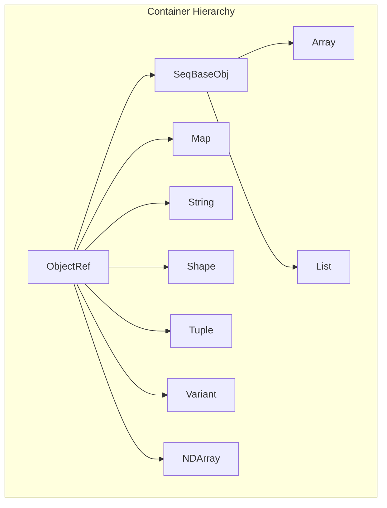

# Container Suite: Array, List, Map, String, Shape, Tuple, Variant, NDArray

**TL;DR**
- The container suite provides typed, ref-counted containers that store `Any` values internally: `Array<T>` (immutable array), `List<T>` (mutable array), `Map<K,V>` (immutable insertion-ordered map), `String` (immutable UTF-8 string), `Shape` (immutable int64 shape tuple), `Tuple` (fixed-size heterogeneous tuple), `Variant<T...>` (type-safe union), and `NDArray` (tensor wrapping DLTensor).
- `Array<T>` and `List<T>` share `SeqBaseObj` as a common base class, consolidating type-erased sequence operations. `Array<T>` is immutable; `List<T>` supports push_back, insert, erase, and setitem.
- `Map<K,V>` preserves insertion order (a breaking change from legacy unordered Map) using an open-addressing hash table with dense key/value arrays. `Map.get()` uses the `MISSING` singleton (from `ffi.GetInvalidObject`) as an internal sentinel.

## Problem Statement

### Background
- An FFI system needs standard container types that can be passed across language boundaries.
- Containers must be typed (e.g., `Array<int>`) at the C++ level while remaining type-erased at the ABI level (all stored as `Any` values internally).
- The Map type's ordering behavior is a cross-language concern: Python dicts preserve insertion order, so Map should too for consistency.

### Solution
- All containers are `ObjectRef` subclasses backed by `*Obj` data classes, participating in the standard ref-counting object system.
- `Array<T>` uses `InplaceArrayBase` to store elements contiguously after the object header, avoiding separate heap allocations.
- `Map<K,V>` uses open-addressing hash table with insertion-order tracking.
- `String`/`Bytes` are standalone value types (no longer `ObjectRef` subclasses) backed by `BytesBaseCell`, which stores a `TVMFFIAny` directly. Strings <=7 bytes use inline storage (`kTVMFFISmallStr`/`kTVMFFISmallBytes`); larger strings heap-allocate via `BytesObjStdImpl`.

### Goals
- Typed containers with compile-time element type checking.
- Immutable by default (Array, Map, String, Shape are immutable). `List<T>` is the mutable sequence counterpart.
- DLPack interop for NDArray (import/export `DLManagedTensor`).
- Non-goal: N/A. (Dict mutable map has been added.)

## Design



### Key Classes, Fields and Interfaces

```python
class SeqBaseObj(Object):
    """Shared base for ArrayObj and ListObj. Consolidates type-erased sequence data layout.
    Layout: TVMFFIObject + TVMFFISeqCell (data, size, capacity, data_deleter)."""
    data: void_ptr                       # Pointer to contiguous Any elements
    size: int64                          # Current element count
    capacity: int64                      # Allocated slot count
    data_deleter: Callable[[void_ptr], None]  # Frees data buffer
    # Invariant: size <= capacity
    # Invariant: data may be nullptr if capacity == 0
    # Interacts with: ArrayObj, ListObj (both inherit this layout)
    # Extension: new sequence containers can inherit SeqBaseObj

    def MutableBegin(self) -> Ptr[Any]: ...
        # Returns static_cast<Any*>(data)
    def MutableEnd(self) -> Ptr[Any]: ...
        # Returns MutableBegin() + size

# C ABI struct:
# struct TVMFFISeqCell {
#     void* data;
#     int64_t size;
#     int64_t capacity;
#     void (*data_deleter)(void*);
# }

class ArrayObj(SeqBaseObj):
    """Immutable array backed by contiguous Any elements. Inherits SeqBaseObj layout."""
    # data_, size_, capacity_, data_deleter_ inherited from SeqBaseObj
    _type_index: int = kTVMFFIArray  # 69
    _type_key: str = "ffi.Array"     # Renamed from "object.Array"
    # Invariant: all elements satisfy TypeTraits<T>::CheckAnyStrict for the declared T
    # Invariant: immutable after construction
    # Invariant: data_ == AddressOf(0) for inplace arrays; may differ for external allocation
    # Invariant: destructor calls Any::~Any() on each element then data_deleter_
    # Invariant: operator[] and SetItem require i in [0, size_); negative indices raise IndexError (ec56178e)
    # Extension: Array<Any> is the erased form; Array<int> stores kTVMFFIInt values directly

class Array(Generic[T], ObjectRef, Sequence[T]):
    """Immutable typed array. Elements stored as Any with type invariant.
    Python side inherits Sequence[T] for parameterized generics (df58a05)."""
    def __len__(self) -> int: ...

    @overload
    def __getitem__(self, idx: SupportsIndex, /) -> T: ...
    @overload
    def __getitem__(self, idx: slice, /) -> list[T]: ...
    # Invariant: slice returns list[T], NOT Array[T] (restored legacy behavior, 90dba57)

    def __contains__(self, value: object) -> bool: ...
        # Delegates to ffi.ArrayContains C++ FFI function (5bc7fcde)
        # Uses AnyEqual for cross-language consistency (not Python __eq__)
        # Interacts with: _ffi_api.ArrayContains (C++ FFI bridge)

    def __bool__(self) -> bool: ...
        # Returns True if non-empty, False if empty (46ab6448)
        # Implementation: len(self) > 0
        # Invariant: empty arrays are falsy, matching Python list behavior

    def __init__(self, elements: Iterable[T]) -> None: ...
    # Broadened from Sequence[T] to Iterable[T] (54f527f)

    def __add__(self, other: Iterable[T]) -> Array[T]: ...
    # Concatenation via itertools.chain; returns type(self)(...) (54f527f)
    def __radd__(self, other: Iterable[T]) -> Array[T]: ...

    def __iter__(self) -> Iterator[T]: ...

    # Interacts with: TypeTraits<T>.CheckAnyStorage (construction validates all elements)
    # Interacts with: InplaceArrayBase (contiguous storage, no separate allocation)

class ListObj(SeqBaseObj):
    """Mutable sequence container backed by a contiguous Any buffer. Inherits SeqBaseObj layout."""
    _type_index: int = kTVMFFIList  # 75
    _type_key: str = "ffi.List"
    _type_mutable: bool = True
    _type_final: bool = True
    # Invariant: size <= capacity; data_deleter != nullptr for heap buffer
    # Invariant: NOT thread-safe; no concurrent mutation
    # Invariant: reference cycles possible (List can contain itself) but NOT collected by refcount
    # Interacts with: serialization (cycle detection), structural equal/hash (cycle detection)
    # Extension: new container types can inherit SeqBaseObj for shared iteration

class List(Generic[T], ObjectRef, MutableSequence[T]):
    """Mutable typed list, analogous to Python list."""
    def __getitem__(self, i: int) -> T: ...
    def __setitem__(self, i: int, val: T) -> None: ...  # via C++ Set()
    def __len__(self) -> int: ...
    def push_back(self, item: T) -> None: ...   # C++ PushBack
    def pop_back(self) -> None: ...             # C++ PopBack; removes last element
    def insert(self, pos: iterator, val: T) -> None: ...
    def erase(self, pos: iterator) -> None: ...
    def resize(self, n: int) -> None: ...
    def reserve(self, n: int) -> None: ...
    def clear(self) -> None: ...
    def append(self, item: T) -> None: ...      # Python alias for push_back
    # Interacts with: Array<T> (shared SeqBaseObj base), serialization, structural equal/hash
    # Interacts with: TypeTraits<std::vector<T>> (accepts both kTVMFFIArray and kTVMFFIList)
    # Invariant: Python iteration, len, getitem, setitem all work via Cython bindings

# C ABI addition:
# kTVMFFIList = 75  (new type index in TypeIndex enum)

class MapObj(Object):
    """Immutable insertion-ordered map using open-addressing hash table."""
    data_: void_ptr                    # Explicit data pointer (ABI-stabilized)
    size_: uint64
    slots_: uint64                     # MSB is layout tag (1=SmallMap, 0=DenseMap); remaining 63 bits = slot count
    data_deleter_: Optional[Callable[[void_ptr], None]]  # Optional external data deleter
    kSmallTagMask: ClassVar[uint64] = 1 << 63
    def IsSmallMap(self) -> bool: ...  # (slots_ & kSmallTagMask) != 0
    _type_index: int = kTVMFFIMap  # 70
    _type_key: str = "ffi.Map"     # Renamed from "object.Map"
    # Invariant: preserves insertion order
    # Invariant: keys must be hashable and comparable via Any equality
    # Invariant: SmallMapObj::CreateFromRange deduplicates keys (last-write-wins)
    # Interacts with: ObjectPtrHash for object keys, SmallMapObj, DenseMapObj

class Map(Generic[K, V], ObjectRef, Mapping[K, V]):
    """Immutable ordered map. Python side inherits Mapping[K, V] (df58a05)."""
    def __len__(self) -> int: ...
    def __getitem__(self, key: K) -> V: ...
    def __contains__(self, key: object) -> bool: ...
    def __bool__(self) -> bool: ...
        # Returns True if non-empty, False if empty (46ab6448)
        # Invariant: empty maps are falsy, matching Python dict behavior
    def keys(self) -> KeysView[K]: ...
    def values(self) -> ValuesView[V]: ...
    def items(self) -> ItemsView[K, V]: ...
    def __iter__(self) -> Iterator[K]: ...

    @overload
    def get(self, key: K) -> V | None: ...
    @overload
    def get(self, key: K, default: V | _DefaultT) -> V | _DefaultT: ...
    # Uses sentinel-based MapGetItemOrMissing FFI call (438f643, replaces try/except KeyError)
    # A static MISSING singleton Object is returned on miss, compared via same_as()
    # Invariant: DenseMapObj::At throws KeyError (not IndexError) for missing keys (c88110e)
    # Invariant: iteration order == insertion order
    # Interacts with: MapGetItemOrMissing (C++ FFI), MISSING sentinel (container.py), Object.same_as()

# === MISSING sentinel for Map.get() and container checks ===

def GetInvalidObject() -> Object:
    """Return the global MISSING/invalid object singleton.
    Registered as global function: ffi.GetInvalidObject (renamed from ffi.MapGetMissingObject)."""
    # Invariant: singleton identity -- same object across all imports and calls
    # Interacts with: Map.get() (uses MISSING as sentinel for key-not-found)
    # Interacts with: tvm_ffi.core.MISSING (Python module-level singleton)

MISSING: Object  # Module-level singleton in tvm_ffi.core, initialized at Cython import time
    # Initialized via: _get_global_func("ffi.GetInvalidObject")()
    # Re-exported from tvm_ffi.container as: from .core import MISSING
    # Interacts with: Map.get(), Map.__contains__(), container MISSING checks
    # Invariant: MISSING.same_as(CONTAINER_MISSING) -- single identity across modules

class BytesBaseCell:
    """Internal backing cell for String and Bytes. Stores a TVMFFIAny directly.
    Enables dual-representation: inline (<=7 bytes, kTVMFFISmallStr/kTVMFFISmallBytes)
    or heap-allocated (kTVMFFIStr/kTVMFFIBytes)."""
    data_: TVMFFIAny
    # Invariant: if type_index is kTVMFFISmallStr/kTVMFFISmallBytes, data is inline in v_bytes
    # Invariant: if type_index >= kTVMFFIStaticObjectBegin, holds ref-counted heap object ptr
    # Invariant: if type_index is kTVMFFINone, cell is null (used by Optional<String>)
    def data(self) -> const_char_ptr: ...
    def size(self) -> size_t: ...
    def InitSpaceForSize(self, size: int, small_type_index: int, large_type_index: int) -> char_ptr: ...
        # If size <= 7: stores inline. If size > 7: heap-allocates.
    def MoveToAny(self, result: Ptr[TVMFFIAny]) -> None: ...
    @staticmethod
    def CopyFromAnyView(src: Ptr[TVMFFIAny]) -> BytesBaseCell: ...
    @staticmethod
    def MoveFromAny(src: Ptr[TVMFFIAny]) -> BytesBaseCell: ...
    # Interacts with: String, Bytes, Optional<String>, Optional<Bytes>

class String:
    """Immutable UTF-8 string. NO LONGER inherits ObjectRef -- standalone value type backed by BytesBaseCell."""
    data_: BytesBaseCell
    # Invariant: default-constructed String has type_index kTVMFFISmallStr, size 0
    # Invariant: always null-terminated
    # Invariant: sizeof(String) == 16 (same as TVMFFIAny)
    def __init__(self, s: str) -> None: ...  # small if len<=7, else heap
    npos: ClassVar[size_t] = static_cast_size_t(-1)  # sentinel for find() miss (bd12b26a)

    def data(self) -> const_char_ptr: ...
    def c_str(self) -> const_char_ptr: ...   # noexcept
    def size(self) -> size_t: ...            # noexcept

    def find(self, str: "String", pos: int = 0) -> size_t: ...
        # Overload 1: find substring given as String (bd12b26a)
    def find(self, str: "const char*", pos: int = 0) -> size_t: ...
        # Overload 2: find substring given as C string (bd12b26a)
    def find(self, str: "const char*", pos: int, count: int) -> size_t: ...
        # Overload 3: canonical implementation, delegates to std::string_view::find (bd12b26a)
        # Invariant: returns npos if not found or pos > size()

    def substr(self, pos: int = 0, count: size_t = npos) -> "String": ...
        # Invariant: raises std::out_of_range if pos > size() (bd12b26a)
        # Invariant: count is clamped to size() - pos (never overflows)
        # Interacts with: String(const char*, size_t) constructor

    def starts_with(self, prefix: Union[str, "String"]) -> bool: ...
        # Check if string starts with prefix (02d1a96)
        # Overloads: String, const char*, std::string_view, (const char*, size_t)
        # Invariant: returns True for empty prefix
        # Interacts with: std::memcmp for byte-level comparison

    def ends_with(self, suffix: Union[str, "String"]) -> bool: ...
        # Check if string ends with suffix (02d1a96)
        # Overloads: String, const char*, std::string_view, (const char*, size_t)
        # Invariant: returns True for empty suffix
        # Interacts with: std::memcmp for byte-level comparison

    # Interacts with: TypeTraits<String> (custom, no longer ObjectRefWithFallbackTraitsBase)
    # Interacts with: kTVMFFIRawStr -> String promotion in Any
    # Extension: comparison operators with std::string, const char*

class Bytes:
    """Immutable byte sequence. NO LONGER inherits ObjectRef -- standalone value type backed by BytesBaseCell."""
    data_: BytesBaseCell
    @staticmethod
    def memncmp(lhs: ptr, rhs: ptr, lhs_count: int, rhs_count: int) -> int: ...
    @staticmethod
    def memequal(lhs: ptr, rhs: ptr, lhs_count: int, rhs_count: int) -> bool: ...
        # Fast equality: short-circuits on size mismatch, then memcmp
    # Interacts with: TypeTraits<Bytes> (custom, no longer ObjectRefWithFallbackTraitsBase)

class Optional_String:
    """Specialized Optional<String> using BytesBaseCell nullopt sentinel."""
    # Invariant: sizeof(Optional<String>) == sizeof(String) (zero overhead)
    # Uses data_.data_.type_index == kTVMFFINone as null sentinel

class ShapeObj(Object, TVMFFIShapeCell):
    """Immutable int64 shape tuple. Layout: TVMFFIObject + TVMFFIShapeCell + inline int64s."""
    # data: const int64_t* (points to inline storage)
    # size: size_t (number of dimensions)
    _type_index: int = kTVMFFIShape  # 71
    _type_key: str = "object.Shape"
    # Invariant: immutable after construction

class Shape(ObjectRef):
    """Immutable shape ref."""
    def __len__(self) -> int: ...
    def __getitem__(self, index: int) -> int64: ...

class TupleObj(Object):
    """Fixed-size heterogeneous tuple of Any values."""
    # Uses InplaceArrayBase for contiguous Any storage
    # Invariant: size fixed at construction, elements can be any type

class Tuple(Generic[*Types], ObjectRef):
    """Heterogeneous tuple ref with C++17 structured binding support."""
    def __len__(self) -> int: ...
    def __getitem__(self, index: int) -> Any: ...

    def get(self: "const_ref", I: int) -> "Types[I]": ...
        # Const lvalue get -- copies element
    def get(self: "rvalue_ref", I: int) -> "Types[I]": ...
        # Rvalue-qualified get -- moves element if tuple has unique ownership (refcount==1),
        # copies otherwise. Uses ObjectRef::unique() for the decision.
        # Interacts with: ArrayObj::MutableBegin(), AnyUnsafe::MoveFromAnyAfterCheck

    # C++17 Structured binding protocol (5569e44):
    # std::tuple_size<Tuple<Types...>>::value == sizeof...(Types)
    # std::tuple_element<I, Tuple<Types...>>::type == tuple_element_t<I, tuple<Types...>>
    # ADL free functions: get<I>(const Tuple&) and get<I>(Tuple&&)
    # Invariant: specializations must be in namespace std for structured bindings
    # Extension: auto [a, b, c] = Tuple{1, 2.0f, String{"hello"}} works

    # CTAD deduction guide:
    # Tuple(UTypes&&...) -> Tuple<remove_cv_t<remove_reference_t<UTypes>>...>
    # Extension: allows Tuple{1, 2.0f, s} without explicit template args

class Variant(Generic[*Ts]):
    """Type-safe union. When all Ts are ObjectRef, backed by ObjectRef (sizeof==pointer);
    otherwise backed by Any (sizeof==16)."""
    # Compile-time selection via all_object_ref_v<Ts...>:
    #   True  -> inherits ObjectRef, stores ObjectPtr<Object> (one pointer)
    #   False -> stores Any (16 bytes)
    # Invariant: the stored value's type is one of Ts
    # Extension: enables pattern matching on sum types
    # Interacts with: ObjectPtrHash, ObjectPtrEqual (only for all-ObjectRef variants)

class TensorView:
    """Non-owning view of a Tensor. Stores a DLTensor by value (shallow copy, not data copy).
    Analogous to ShapeView for Shape. Added in 1ec6236.
    operator->() removed in 0dcd4d2; all access is through named methods."""
    # Internal: tensor_: DLTensor (value, not pointer -- struct is shallow-copied from source)

    def __init__(self, tensor: Tensor) -> None: ...
        # Implicit conversion from owning Tensor.
        # Invariant: tensor must be defined (non-null). Asserted via TVM_FFI_ICHECK.
    def __init__(self, tensor: Ptr[DLTensor]) -> None: ...
        # Implicit conversion from raw DLTensor pointer.
    # Move from Tensor: DELETED (prevents accidental ownership loss)
    #   TensorView(Tensor&&) = delete; operator=(Tensor&&) = delete

    def shape(self) -> ShapeView: ...                 # ShapeView(tensor_.shape, tensor_.ndim)
    def strides(self) -> ShapeView: ...               # ShapeView(tensor_.strides, tensor_.ndim)
        # Invariant: strides pointer must be non-null OR ndim == 0 (4fefeb0)
    def data_ptr(self) -> Ptr[void]: ...              # tensor_.data
    def device(self) -> DLDevice: ...                 # tensor_.device (0dcd4d2)
    def ndim(self) -> int32: ...                      # tensor_.ndim
    def numel(self) -> int64: ...                     # shape().Product()
    def dtype(self) -> DLDataType: ...                # tensor_.dtype
    def size(self, idx: int64) -> int64: ...           # tensor_.shape[idx] (0dcd4d2, negative indexing 573d76f)
        # Invariant: idx in [-ndim, ndim). Negative idx wraps: shape[ndim + idx]
        # Invariant: throws IndexError on out-of-range (bounds check enforced, e54d15d7)
    def stride(self, idx: int64) -> int64: ...        # tensor_.strides[idx] (0dcd4d2, negative indexing 573d76f)
        # Invariant: idx in [-ndim, ndim). Negative idx wraps: strides[ndim + idx]
        # Invariant: throws IndexError on out-of-range (bounds check enforced, e54d15d7)

    # Aten-style aliases (573d76f) -- PyTorch API compatibility:
    def dim(self) -> int32: ...                       # Redirects to ndim()
    def sizes(self) -> ShapeView: ...                 # Redirects to shape()
    def is_contiguous(self) -> bool: ...              # Redirects to IsContiguous()
    def byte_offset(self) -> uint64: ...              # tensor_.byte_offset (0dcd4d2)
    def IsContiguous(self) -> bool: ...               # delegates to tvm::ffi::IsContiguous(tensor_)

    # Invariant: non-owning -- caller must keep underlying tensor data alive
    # Invariant: API mirrors Tensor for easy substitution (0dcd4d2)
    # Invariant: operator->() is REMOVED -- use named methods instead
    # Interacts with: Tensor (implicit conversion Tensor -> TensorView)
    # Interacts with: ShapeView (shape() and strides() return ShapeView)
    # Interacts with: TypeTraits<TensorView> (FFI type conversion)
    # Interacts with: TVM_FFI_DLL_EXPORT_TYPED_FUNC (recommended parameter type for exported kernel ops)
    # Extension: use TensorView instead of Tensor in FFI function signatures to accept both owning and non-owning inputs

    def as_strided(self, shape: ShapeView, strides: ShapeView,
                   element_offset: Optional[int64] = None) -> TensorView:
        """Create a non-owning strided view. Caller must keep shape/strides arrays alive."""
        # Invariant: on direct-address devices (CPU, CUDA), byte_offset is folded into data pointer
        # Invariant: returned TensorView does NOT own shape/strides memory

# --- Strided Tensor APIs (8888eb4b) ---

# Tensor.as_strided(shape, strides, element_offset=None) -> Tensor
#   Creates a new owning Tensor as a strided view of this tensor.
#   Interacts with: TVMFFITensorCreateUnsafeView (C ABI)
#   Invariant: on direct-address devices, byte_offset is folded into data pointer (becomes 0)
#   Invariant: returned Tensor holds a ref to source via ViewNDAlloc closure

# Tensor.FromNDAllocStrided(alloc, shape, strides, dtype, device, ...) -> Tensor
#   Allocate a new tensor with explicit strides (e.g., column-major layout).
#   Interacts with: TensorObjFromNDAlloc prototype constructor, make_inplace_array_object
#   Invariant: shape.size() == strides.size()

# TVMFFITensorCreateUnsafeView(source, prototype, out) -> int  (C ABI)
#   Create a Tensor view sharing source data with metadata from prototype DLTensor.
#   Invariant: prototype.strides must be non-null
#   Invariant: caller must ensure prototype.data points to memory owned by source

# TypeTraits<TensorView> specialization:
#   storage_enabled = False  (cannot be stored in Any or containers -- non-owning)
#   field_static_type_index = kTVMFFIDLTensorPtr
#   CopyToAnyView: writes kTVMFFIDLTensorPtr + pointer to internal DLTensor
#   CheckAnyStrict: type_index == kTVMFFIDLTensorPtr
#   TryCastFromAnyView: accepts kTVMFFIDLTensorPtr (raw) OR kTVMFFITensor (extracts DLTensor* from Tensor)
#   MoveToAny / MoveFromAny: NOT provided (TensorView does not own data)
#   Interacts with: TypeTraits<DLTensor*> (same type_index), TVMFFITensorGetDLTensorPtr

class ShapeView:
    """Lightweight non-owning view over int64_t shape data. Backed by TVMFFIShapeCell. Added in 8ca0719."""
    # Internal: cell_: TVMFFIShapeCell (data pointer + size)

    def __init__(self) -> None: ...               # null view (data=nullptr, size=0)
    def __init__(self, data: Ptr[int64], size: int) -> None: ...
    def __init__(self, init_list: InitializerList[int64]) -> None: ...

    def data(self) -> Ptr[int64]: ...
    def size(self) -> int: ...
    def __getitem__(self, idx: int) -> int64: ...  # unchecked
    def at(self, idx: int) -> int64: ...           # bounds-checked, raises IndexError
    def Product(self) -> int64: ...                # product of all dimensions
    def begin(self) -> Ptr[int64]: ...
    def end(self) -> Ptr[int64]: ...
    def empty(self) -> bool: ...

    # Invariant: non-owning -- caller must keep underlying data alive
    # Invariant: API mirrors Shape for easy substitution
    # Interacts with: Shape (implicit conversion Shape -> ShapeView via operator ShapeView())
    # Interacts with: Tensor::shape(), Tensor::strides() (return ShapeView)
    # Extension: pass ShapeView instead of Shape to avoid heap allocation in hot paths

class TensorObj(Object):
    """Managed tensor wrapping DLTensor with ref-counted ownership.
    Layout: TVMFFIObject + DLTensor fields + inplace int64[] tail (shape+strides).
    Shape/strides stored as inplace int64_t arrays at tail via make_inplace_array_object (8ca0719).
    Renamed from NDArrayObj in 3a551d8."""
    _type_index: int = kTVMFFITensor  # 70 (was kTVMFFINDArray)
    _type_key: str = "ffi.Tensor"     # was "ffi.NDArray"
    # REMOVED (8ca0719): shape_data_: Optional[Shape]
    # REMOVED (8ca0719): strides_data_: Optional[Shape]
    # REMOVED (8ca0719): cached_dl_managed_tensor_versioned_: Atomic pointer
    # REMOVED (8ca0719): ~TensorObj() destructor
    # DLTensor.shape and DLTensor.strides now point to inplace int64[] after object struct
    # Invariant: strides is non-null for ndim > 0; may be null for ndim == 0 (scalar tensors, relaxed in 4fefeb0)
    # Invariant: DLTensor.shape/strides point into the tail-allocated int64 array
    # Interacts with: make_inplace_array_object (tail allocation for 2*ndim int64s)
    # Interacts with: DLPack (DLManagedTensor, DLManagedTensorVersioned)

class Tensor(ObjectRef):
    """Tensor ref with DLPack interop. Renamed from NDArray in 3a551d8.
    operator->() removed in 0dcd4d2; all access through named methods."""
    def shape(self) -> ShapeView: ...      # was Shape. No heap allocation (8ca0719).
    def strides(self) -> ShapeView: ...    # was Shape. No heap allocation (8ca0719).
        # Invariant: strides pointer must be non-null OR ndim == 0 (relaxed in 4fefeb0)
    def data_ptr(self) -> Ptr[void]: ...   # was: (*this)->data (8ca0719)
    def device(self) -> DLDevice: ...      # NEW accessor (0dcd4d2)
    def ndim(self) -> int32: ...           # was: (*this)->ndim (8ca0719)
    def numel(self) -> int64: ...          # calls shape().Product() (8ca0719)
    def dtype(self) -> DLDataType: ...     # was: (*this)->dtype (0dcd4d2)
    def size(self, idx: int64) -> int64: ...  # get()->shape[idx] (0dcd4d2, negative indexing 573d76f)
        # Invariant: idx in [-ndim, ndim). Negative idx wraps: shape[ndim + idx]
        # Invariant: throws IndexError on out-of-range (bounds check enforced, e54d15d7)
    def stride(self, idx: int64) -> int64: ...  # get()->strides[idx] (0dcd4d2, negative indexing 573d76f)
        # Invariant: idx in [-ndim, ndim). Negative idx wraps: strides[ndim + idx]
        # Invariant: throws IndexError on out-of-range (bounds check enforced, e54d15d7)
    def byte_offset(self) -> uint64: ...   # get()->byte_offset (0dcd4d2)

    # Aten-style aliases (573d76f) -- PyTorch API compatibility:
    def dim(self) -> int32: ...            # Redirects to ndim()
    def sizes(self) -> ShapeView: ...      # Redirects to shape()
    def is_contiguous(self) -> bool: ...   # Redirects to IsContiguous()
    def GetDLTensorPtr(self) -> Ptr[DLTensor]: ...  # NEW: explicit escape hatch for raw DLTensor* (0dcd4d2)
    def IsContiguous(self) -> bool: ...
    def IsAligned(self, alignment: int) -> bool: ...
        # Check if tensor data meets alignment requirement (added 1b824e8)
        # Interacts with: ffi::IsAligned, IsDirectAddressDevice
    @staticmethod
    def FromDLPack(managed: DLManagedTensor, alignment: int, contiguous: bool) -> Tensor: ...
    @staticmethod
    def FromNDAlloc(alloc, shape: ShapeView, dtype, device, ...) -> Tensor: ...
        # shape parameter changed from Shape to ShapeView (8ca0719)
        # Uses make_inplace_array_object with 2*ndim tail int64s
    def ToDLPack(self) -> DLManagedTensor: ...
    # Invariant: operator->() is REMOVED -- use named methods or GetDLTensorPtr() escape hatch
    # Interacts with: TVMFFITensorFromDLPack, TVMFFITensorToDLPack (C API, was TVMFFINDArray*)
    # Interacts with: Python Tensor class (Cython exposes strides property, 8377011)

def IsDirectAddressDevice(device: DLDevice) -> bool:
    """Check if device uses direct address mapping (pointer address indicates alignment).
    Covers: CPU, CUDA, CUDAHost, CUDAManaged, ROCm, ROCmHost. Added in 1b824e8."""
    # Interacts with: IsAligned (determines alignment check strategy)
    # Extension: add new device types here when they use direct memory addressing

def IsAligned(arr: DLTensor, alignment: int) -> bool:
    """Check alignment of DLTensor data.
    For direct-address devices: checks (data + byte_offset) % alignment.
    For indirect-buffer devices: checks byte_offset % alignment."""

class Shape(ObjectRef):
    def __init__(self, view: ShapeView) -> None: ...       # new: construct from ShapeView (8ca0719)
    def operator_ShapeView(self) -> ShapeView: ...         # new: implicit conversion to ShapeView (8ca0719)
    def __getitem__(self, idx: int) -> int64: ...          # changed: no longer bounds-checked (unchecked access, 8ca0719)
    def at(self, idx: int) -> int64: ...                   # changed: bounds checking moved here from __getitem__ (8ca0719)
    @staticmethod
    def StridesFromShape(shape: ShapeView) -> Shape:
        """Compute contiguous (row-major) strides from shape dimensions.
        Signature changed from (data: Ptr[int64], ndim: int64) to (shape: ShapeView) in 8ca0719."""
        # Interacts with: details::MakeStridesFromShape, FillStridesFromShape
        # Invariant: stride[i] = product(shape[i+1:]); stride[-1] == 1

def FillStridesFromShape(shape: ShapeView, out_strides: Ptr[int64]) -> None:
    """Fill strides in-place from shape. Does not allocate. Added in 8ca0719."""
    # Interacts with: TensorObjFromNDAlloc, TensorObjFromDLPack (inplace strides)

# Convenience overloads (0dcd4d2):
def GetDataSize(tensor: Tensor) -> int:
    """Overload for Tensor. Delegates to GetDataSize(numel, dtype)."""
def GetDataSize(tensor: TensorView) -> int:
    """Overload for TensorView. Delegates to GetDataSize(numel, dtype)."""
```

### Contracts, Assumptions and Invariants
- **Array element storage invariant**: For `Array<T>`, every element satisfies `TypeTraits<T>::CheckAnyStrict` (renamed from `CheckAnyStorage`). This means `Array<int>` stores only `kTVMFFIInt` values -- no implicit conversions.
- **SeqBaseObj shared layout**: `ArrayObj` and `ListObj` both inherit `SeqBaseObj`, which consolidates the `data`/`size`/`capacity`/`data_deleter` layout. `TVMFFISeqCell` is the C ABI struct. `TypeTraits<std::vector<T>>` accepts both `kTVMFFIArray` and `kTVMFFIList` type indices.
- **List mutability**: `List<T>` is mutable (`_type_mutable = true`). It supports push_back, pop_back, insert, erase, resize, reserve, clear, and setitem. It is NOT thread-safe.
- **List cycle handling**: `List` can contain itself (reference cycles). Serialization, JSON, structural equal, and structural hash all implement cycle detection for `List` to avoid infinite recursion. Cycles are NOT collected by the refcount allocator.
- **Container ABI stability**: `ArrayObj` and `MapObj` have explicit `data_` pointers and `data_deleter_` fields, decoupling element access from `InplaceArrayBase`. This enables future external allocation without ABI breaks.
- **MISSING sentinel**: `ffi.GetInvalidObject` returns a global singleton used by `Map.get()` as a sentinel for missing keys. The sentinel is initialized at Cython module load time and re-exported from `tvm_ffi.container`. Identity is checked via `same_as()`, not equality.
- **SmallMap key deduplication**: `MapObj::CreateFromRange` for the SmallMap path deduplicates keys using `InsertMaybeReHash` (last-write-wins), matching DenseMapObj behavior and Python dict semantics.
- **Map insertion order**: `Map<K,V>` preserves insertion order. Iteration produces key-value pairs in the order they were inserted. This matches Python `dict` behavior.
- **Immutability**: Array, Map, String, Shape, and Bytes are all immutable after construction. To "modify" them, create a new object (copy-on-write is a potential optimization in the allocator, not in the container itself).
- **String null-termination**: `String` data is always null-terminated, enabling safe use as a `const char*` via `.c_str()` or `.data()`.
- **Tensor DLPack contract**: `Tensor` (renamed from `NDArray`, commit `3a551d8`) wraps a `DLTensor` and manages its memory. Import/export via `DLManagedTensor` follows the DLPack ownership transfer protocol: the consumer calls the deleter when done.
- **Tensor strides invariant**: After commit `ca95b41`, `DLTensor.strides` is always populated for ndim > 0 tensors. For ndim == 0 (scalar) tensors, strides may be null because there are no dimensions requiring stride values; `ShapeView(nullptr, 0)` is valid and returns an empty view (relaxed in `4fefeb0`). `IsContiguous()` checks if strides match row-major pattern.
- **Relaxed DLPack import defaults**: `from_dlpack()` defaults to `require_alignment=0, require_contiguous=False` (commit `1b824e8`). Users opt in to checks via keyword arguments or call `Tensor::IsAligned()` explicitly.
- **Array/Map Python truthiness**: Empty `Array` and `Map` are falsy (`bool(Array([])) == False`), matching Python `list`/`dict` behavior (commit `46ab6448`).
- **ArrayObj negative index guard**: `ArrayObj::operator[]` and `SetItem` check `i < 0 || i >= size_`, throwing `IndexError` for negative indices. The `Array<T>` wrapper normalizes negative indices before delegating (commit `ec56178e`).
- **Tensor/TensorView bounds enforcement**: `size(idx)` and `stride(idx)` on both `Tensor` and `TensorView` throw `IndexError` when adjusted index is out of range (commit `e54d15d7`). Prior to this fix, out-of-range indices caused undefined behavior.

### Extension Points
- **Custom container types**: Follow the pattern: create `FooObj : SeqBaseObj` (for sequences) or `FooObj : Object` with `TVM_FFI_DECLARE_OBJECT_INFO_FINAL`, then `Foo : ObjectRef` with `TVM_FFI_DEFINE_OBJECT_REF_METHODS_NULLABLE`.
- **InplaceArrayBase**: Subclass for new array-like containers that need contiguous element storage without separate allocation.
- **SeqBaseObj**: New sequence containers can inherit from `SeqBaseObj` to share the `data`/`size`/`capacity`/`data_deleter` layout and iteration protocol.
- **Mutable containers**: `List<T>` (mutable array) and `Dict` (mutable map, c1af3b3) are both implemented on the same object system.
- **Dict internals**: `Dict` reuses `map_base.h` (extracted from Map in 5a6b211, ~1444 lines), which contains `SmallMapNode` and `DenseMapNode` hash table implementations. Dict supports `__setitem__`, `__delitem__`, `clear()`, `pop()`, `update()`. Keys must support AnyHash/AnyEqual protocol. Dict is serializable and participates in structural equal/hash and deep copy.
- **map_base.h factoring**: The hash-table internals shared by Map and Dict are in `include/tvm/ffi/container/map_base.h`. `map.h` is reduced to ~11 lines of Map-specific logic. `container_details.h` (128 lines of dead code) was removed.

### Usage Examples

#### Working with typed containers
**Context**: Creating and using Array, Map, and String in C++.

```cpp
// Array<int> -- all elements stored as kTVMFFIInt (no boxing)
Array<int> arr({1, 2, 3});
int first = arr[0];                  // type-checked extraction
// Array<ObjectRef> arr2 = arr;      // compile error: incompatible element types

// Map<String, int> -- insertion-ordered
Map<String, int> map({{String("a"), 1}, {String("b"), 2}});
int val = map[String("a")];         // val == 1
// Iteration: ("a", 1), ("b", 2) -- always in insertion order

// String -- immutable, interacts with kTVMFFIRawStr
String s("hello");
const char* cstr = s.data();        // null-terminated
Any any_str = s;                     // stored as kTVMFFIStr object
Any any_raw = AnyView("raw");       // kTVMFFIRawStr in AnyView
// Any owned_raw = "raw";           // auto-promoted to String in Any

// Tensor (renamed from NDArray) -- DLPack interop
Tensor t = Tensor::Empty(Shape({2, 3}), DLDataType({kDLFloat, 32, 1}), DLDevice({kDLCPU, 0}));
ShapeView strides = t.strides();    // {3, 1} -- row-major C-contiguous
bool aligned = t.IsAligned(8);      // check 8-byte alignment

// TensorView (added 1ec6236) -- non-owning view, preferred for FFI function parameters
TensorView view = t;                         // implicit conversion from Tensor
AnyView any_view = view;                     // kTVMFFIDLTensorPtr
TensorView view2 = any_view.as<TensorView>().value();  // round-trip
```

#### Working with List<T> (mutable sequence)
**Context**: Creating and mutating a List in Python and C++.

```python
# Python: List construction, mutation, iteration
import tvm_ffi

lst = tvm_ffi.List([1, 2, 3])
lst.append(4)          # push_back
lst[0] = 10            # setitem
assert len(lst) == 4
assert lst[0] == 10

for item in lst:       # iteration via Cython bindings
    print(item)

# Pickle round-trip (serialization handles List)
import pickle
lst2 = pickle.loads(pickle.dumps(lst))
```

```cpp
// C++: List construction and mutation
List<int> lst({1, 2, 3});
lst.push_back(4);
lst.Set(0, 10);                  // mutate element
assert(lst.size() == 4);
assert(lst[0].cast<int>() == 10);

// TypeTraits interop: std::vector accepts both Array and List
std::vector<int> vec = AnyView(lst).cast<std::vector<int>>();
```

#### Using MISSING sentinel for Map.get()
**Context**: Using the MISSING singleton for safe key lookup.

```python
from tvm_ffi.core import MISSING
import tvm_ffi

m = tvm_ffi.Map({"a": 1})
val = m.get("b")       # returns None (MISSING sentinel used internally)
assert val is None

# Direct sentinel check (internal pattern)
from tvm_ffi.container import MISSING as CONTAINER_MISSING
assert MISSING.same_as(CONTAINER_MISSING)  # same singleton identity
```

## Alternatives & Trade-offs

### STL containers (std::vector, std::unordered_map)
- Pros: Standard, well-optimized, familiar
- Cons: No stable ABI across compilers/platforms, no ref-counting, no cross-language access, std::unordered_map does not preserve insertion order.

### Boxed elements (every element separately heap-allocated)
- Pros: Simpler implementation, no InplaceArrayBase needed
- Cons: Terrible cache locality, extra allocations for every element. InplaceArrayBase stores elements contiguously after the object header, achieving cache-friendly layout.

## Related Work
### Design Docs & ADRs
- [0002-object-system.md](../designs/0002-object-system.md) -- All containers are Object subclasses
- [0006-type-traits.md](../designs/0006-type-traits.md) -- CheckAnyStorage used for Array<T> invariant
- [ADR 0004](../ADRs/0004-insertion-ordered-map.md) -- Decision to make Map insertion-ordered

### Evidence Matrix
- Array, Map, String, Shape, Tuple, Variant, NDArray initial design -> `commits/2025-05-06-7d34eb8abfe987bf0031e4d4ff479895d867a966.md` (7d34eb8)
- Container ABI stabilization (data_, data_deleter_) -> `commits/2025-06-18-7e0a4b35df078675af32624b9cd02d1b8da1353e.md` (7e0a4b3)
- Variant ObjectRef specialization -> `commits/2025-05-10-296e2f7e6cce7c477e7bd3a124e1a6bb0983bd71.md` (296e2f7)
- `ffi.*` type key rename -> `commits/2025-07-01-0966c368b097ec1b89e459a550716674198ac1d4.md` (0966c36)
- SmallMap key dedup fix -> `commits/2025-07-31-0342d85f15fa2563ce502c6adb20497e0bf02c5e.md` (0342d85)
- NDArray->Tensor rename (all layers) -> `commits/2025-09-06-3a551d83f7c05106fa8033a61970a5ce34aa8aef.md` (3a551d8)
- Always-non-null strides, `MakeStridesFromShape`, `stride_data_` -> `commits/2025-09-06-ca95b412d75c80466390fbd5e6b5ba77673d93cc.md` (ca95b41)
- `Tensor::strides()` accessor, `strides_data_` rename -> `commits/2025-09-06-6fa40b5829636d6f543ebe5dd67f623681eec880.md` (6fa40b5)
- Relaxed DLPack defaults, `IsDirectAddressDevice`, `Tensor::IsAligned` -> `commits/2025-09-08-1b824e88743a89343ad7493691bbdf5fdf2830c9.md` (1b824e8)
- `Shape::StridesFromShape`, `UnsafeInit` constructors for containers -> `commits/2025-09-08-472e10c4086e91fb788ffe1f0eee10df4bcf5db2.md` (472e10c)
- String optimization (memequal, StableHashBytes) -> `commits/2025-07-30-ba0ea87da5f51890b8801ceaad2f583d17265bc1.md` (ba0ea87)
- StringObj/BytesObj moved to details:: -> `commits/2025-08-01-f9d2bff8444250bdac336eeb1eee9cfba063008d.md` (f9d2bff)
- SSO: String/Bytes as value types, BytesBaseCell, kTVMFFISmallStr/SmallBytes -> `commits/2025-08-04-49e2ed4a169918d346fe8f96c208a4cec56cf3e8.md` (49e2ed4)
- Map MSB tag dispatch -> `commits/2025-08-09-03e8a6b8c995259d379358ab50ad81609a99083e.md` (03e8a6b)
- Array/Map generic parameterization (Sequence[T], Mapping[K,V]), @overload signatures, SupportsIndex, ItemsView.__contains__ -> `commits/2025-09-22-df58a05ec400dc5e91ac86146aedaf3a8273b7bd.md` (df58a05)
- Array concatenation (__add__/__radd__), Iterable constructor widening -> `commits/2025-09-23-54f527f4d3d1ae1b950e0fe1a52ccb7bfc6df249.md` (54f527f)
- Array slice returns list[T] (reverts PR #37 regression) -> `commits/2025-09-23-90dba57cf810e7fb6a5ad8316bcf4c53c699d51c.md` (90dba57)
- DenseMapObj::At KeyError fix (was IndexError, broke Map.get) -> `commits/2025-09-23-c88110e76e7bfb1c72e8a2bf371afaf7e018aa74.md` (c88110e)
- ShapeView, TensorObj inplace tail allocation, FillStridesFromShape, Tensor convenience accessors -> `commits/2025-09-27-8ca0719f74bef289d80c8704343ed7c1607db8f3.md` (8ca0719)
- TensorView non-owning view, TypeTraits<TensorView>, convention migration -> `commits/2025-10-01-1ec623678adea0ddba482d8d56d4ab2be440e694.md` (1ec6236)
- Relaxed strides invariant for zero-ndim (scalar) tensors -> `commits/2025-10-01-4fefeb0f5913fc41cf860f517b9320f1bf1d0e98.md` (4fefeb0)
- Tensor/TensorView size()/stride() bounds checking -> `commits/2026-01-02-e54d15d71c64da72e84cc831def06dc525e31e18.md` (e54d15d)
- Array.__contains__ via ffi.ArrayContains -> `commits/2026-01-02-5bc7fcdebd0fae2d3650a5b18ae69154c1c92d70.md` (5bc7fcd)
- ArrayObj negative index bounds check -> `commits/2026-01-03-ec56178e587a5ca585fecac60823b8e55fa267d7.md` (ec56178)
- Array/Map __bool__ for Python truthiness -> `commits/2026-01-05-46ab64481c60478f5ca3081b26607f4ae525f76a.md` (46ab644)
- String find()/substr()/npos -> `commits/2026-01-07-bd12b26ac36ae6e770d128710fba13108957ee52.md` (bd12b26)
- String::starts_with/ends_with methods -> `commits/2026-01-09-02d1a9600ac195fc320fe10fe42c978bcdb5e727.md` (02d1a96)
- List<T> mutable container, SeqBaseObj extraction, kTVMFFIList=75, cycle detection -> `commits/2026-02-13-9513c2f8a57f64ad7473d7cd06084719f6d5e70e.md` (9513c2f)
- ffi.GetInvalidObject (renamed from MapGetMissingObject), MISSING singleton in core.pyx -> `commits/2026-02-15-86c4042d66bf432a3c4a217be1eeab3568329b5b.md` (86c4042)
- map_base.h extraction (SmallMapNode/DenseMapNode shared by Map and Dict) -> `commits/2026-02-18-5a6b211612c4f0360f49a7a17a809d80460f557d.md` (5a6b211)
- Dict mutable container with full Python bindings, serialization, structural eq/hash -> `commits/2026-02-19-c1af3b337645bed13f573560910dee2743d7d3b1.md` (c1af3b3)
- Plus 4 supporting commits for namespace cleanup, Tuple fix, and GCC warning suppression
