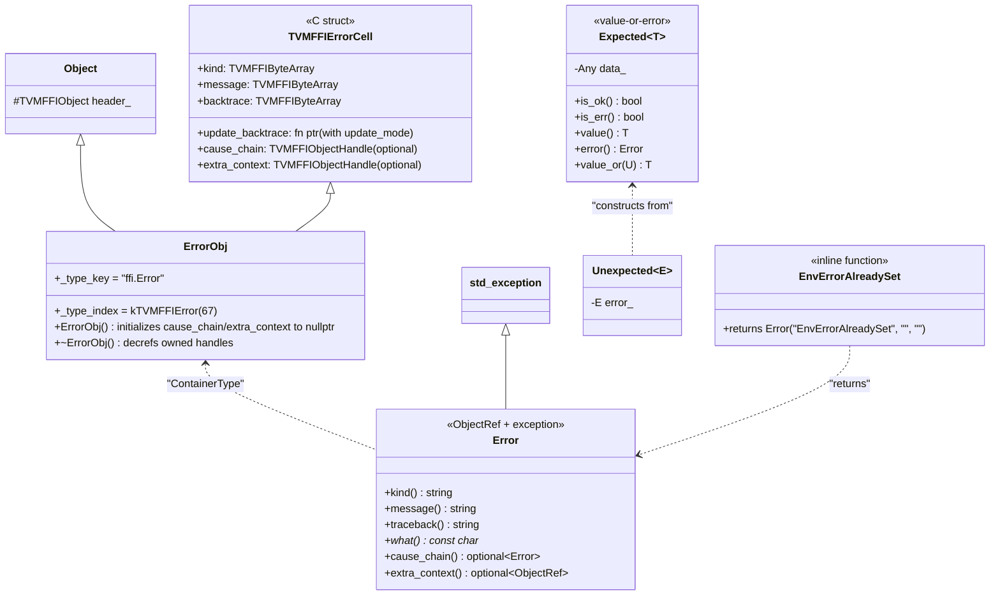

# Error Handling

**TL;DR**
- Errors are first-class `Object` subclasses (`ErrorObj` extends `Object` + `TVMFFIErrorCell`), carrying structured `kind`, `message`, `backtrace`, and optional `cause_chain`/`extra_context` fields. `Error` is simultaneously an `ObjectRef` (ref-counted) and a `std::exception` (throwable). (Note: the field was renamed from `traceback` to `backtrace` in commit `6f020c1` -- see [ADR 0039](../ADRs/0039-backtrace-rename-and-append-mode.md).)
- Exception transport across C ABI boundaries uses thread-local `SafeCallContext`: `TVM_FFI_SAFE_CALL_END` catches C++ exceptions and stores them in TLS via `SetSafeCallRaised`; the caller retrieves them via `TVMFFIErrorMoveFromRaised` and rethrows.
- `EnvErrorAlreadySet` is now an inline function returning `Error("EnvErrorAlreadySet", "", "")`. Previously it was a separate `std::exception` subclass that returned `-2` from safe_call; as of commit `b1611e0` (#425), it is unified into the standard Error object system with kind-based dispatch. See [ADR 0055](../ADRs/0055-env-error-already-set-to-error-kind.md).
- `Expected<T>` (commit `0a9d4b6` #399) provides exception-free error handling, similar to Rust's `Result<T, Error>` or C++23 `std::expected`. `Function::CallExpected<T>()` wraps any function call in a try/catch and returns errors as `Expected<T>` values. See [ADR 0056](../ADRs/0056-expected-type-for-exception-free-errors.md).
- As of commit `4c712ca` (#396), the error ABI supports cause chaining: an error can carry a linked chain of prior errors (`cause_chain`) and opaque additional context (`extra_context`). See [ADR 0053](../ADRs/0053-error-cause-chaining-abi.md).

## Problem Statement

### Background

C++ uses exceptions for error propagation, but exceptions cannot cross C ABI boundaries (undefined behavior). Python uses its own exception mechanism. The FFI needs to transport errors from C++ through C boundaries back to the calling language, preserving error category, message, and traceback.

### Solution

A three-layer error system:
1. **Object-based errors**: `ErrorObj` stores kind/message/traceback as `TVMFFIByteArray` fields.
2. **Exception boundary**: `TVM_FFI_SAFE_CALL_BEGIN/END` macros catch exceptions at C function boundaries and store them in thread-local `SafeCallContext`.
3. **Frontend signal**: `EnvErrorAlreadySet` bypasses the TLS error mechanism for errors that originate in the host environment.

### Goals

- **Goal**: Preserve error category, message, and traceback across C boundaries.
- **Goal**: Support error chaining (traceback can be updated as the error propagates).
- **Goal**: Support frontend-originated errors (Python KeyboardInterrupt, SIGINT) via `EnvErrorAlreadySet` (now unified as error kind).
- **Goal**: Provide exception-free error handling via `Expected<T>` for performance-sensitive or composable call sites.
- **Non-goal**: Structured exception hierarchies (error kinds are strings, not a class hierarchy).

## Design

### Error Object Model



### Exception Boundary: SAFE_CALL

As of commit `b1611e0` (#425), the `EnvErrorAlreadySet` catch arm was removed. All errors now flow through the `-1` path:

```cpp
#define TVM_FFI_SAFE_CALL_BEGIN() try { (void)0

#define TVM_FFI_SAFE_CALL_END()
  return 0;
  } catch (const Error& err) {
    SetSafeCallRaised(err);     // Store in TLS, return -1
    return -1;
  } catch (const std::exception& ex) {
    SetSafeCallRaised(Error("InternalError", ex.what()));
    return -1;
  }
```

The Python/Cython side detects `EnvErrorAlreadySet` by checking `error.kind == "EnvErrorAlreadySet"` after retrieving the error from TLS.

### Error Creation: TVM_FFI_THROW and TVM_FFI_LOG_AND_THROW

Two macros:
- **`TVM_FFI_THROW(Kind)`**: Creates `ErrorBuilder(#Kind, traceback, log_before_throw)` where `traceback` is obtained by calling `TVMFFITraceback(__FILE__, __LINE__, TVM_FFI_FUNC_SIG, 0)` directly. The `cross_ffi_boundary=0` stops the traceback at the FFI boundary. The `log_before_throw` flag is controlled by compile-time `TVM_FFI_ALWAYS_LOG_BEFORE_THROW` (default `0`).
- **`TVM_FFI_LOG_AND_THROW(Kind)`**: Same but forces `log_before_throw = true`, always logging to stderr before throwing. Used for startup-time errors (e.g., duplicate global function registration) where exceptions may be swallowed during static initialization.

The former `TVM_FFI_TRACEBACK_HERE` macro was removed in `2d41a51`; `TVM_FFI_THROW` and `TVM_FFI_LOG_AND_THROW` now call `TVMFFITraceback` directly with explicit `cross_ffi_boundary=0`.

`TVM_FFI_ALWAYS_LOG_BEFORE_THROW` is a compile-time toggle for environments where exception backtraces are unreliable (e.g., WASM, embedded). When set to `1`, every `TVM_FFI_THROW` invocation logs the full error message to stderr.

### Expected<T>: Exception-Free Error Handling (commit `0a9d4b6` #399)

`Expected<T>` enables exception-free error handling alongside the existing exception-based approach:

```cpp
Expected<int> divide(int a, int b) {
  if (b == 0) return Error("ValueError", "Division by zero", "");
  return a / b;
}

// Via CallExpected (wraps any function, catches exceptions):
Function func = Function::GetGlobal("risky_function");
Expected<int> result = func.CallExpected<int>(arg1, arg2);
if (result.is_ok()) {
  int value = result.value();
} else {
  Error err = result.error();
}
```

Key design properties:
- **Internal storage**: `Expected<T>` stores an `Any` that holds either T or Error. `is_ok()` checks `!data_.as<Error>().has_value()`.
- **TypeTraits transparency**: `Expected<T>` unwraps when serialized to `Any` -- Ok values become T, Err values become Error. This means functions returning `Expected<T>` work transparently across the FFI.
- **CallExpected**: Uses `safe_call` (not `cxx_call`) to catch all exceptions. On `ret_code == 0`, tries `result.try_cast<T>()` then `result.try_cast<Error>()`. On `ret_code != 0`, calls `MoveFromSafeCallRaised()`.
- **TypeSchema**: Produces `{"type":"Expected","args":[T_schema, {"type":"ffi.Error"}]}`.

See [ADR 0056](../ADRs/0056-expected-type-for-exception-free-errors.md) and [diagram 0017](../diagrams/0017-expected-call-flow.md).

### Key Classes, Fields and Interfaces

- **`ErrorObj`** (`include/tvm/ffi/error.h`): `Object` + `TVMFFIErrorCell`. Static index `kTVMFFIError = 67`. Type key: `"ffi.Error"`. Constructor initializes `cause_chain` and `extra_context` to `nullptr`; destructor decrefs both if non-null.
- **`ErrorObjFromStd`**: Concrete implementation owning `std::string` data for kind, message, traceback.
- **`Error`** (`include/tvm/ffi/error.h`): `ObjectRef` + `std::exception`. As of `4c712ca`, provides a 5-argument constructor accepting `optional<Error> cause_chain` and `optional<ObjectRef> extra_context`, plus accessors `cause_chain()` and `extra_context()` that return `std::optional`.
- **`TVMFFIErrorCreateWithCauseAndExtraContext`** (`c_api.h`): C API for creating an error with cause chain and extra context in one call. Arguments: `kind`, `message`, `backtrace`, `cause_chain` handle, `extra_context` handle, `out` handle. Returns 0 on success.
- **`EnvErrorAlreadySet`** (`include/tvm/ffi/error.h`): Inline function returning `Error("EnvErrorAlreadySet", "", "")`. Previously a struct inheriting `std::exception`; unified in commit `b1611e0` (#425). See [ADR 0055](../ADRs/0055-env-error-already-set-to-error-kind.md).
- **`Expected<T>`** (`include/tvm/ffi/expected.h`): Value-or-error container. Holds either success T or Error in an `Any`. `static_assert` prevents `Expected<Error>`.
- **`Unexpected<E>`** (`include/tvm/ffi/expected.h`): Wrapper for explicit error construction. CTAD support via deduction guide.
- **`Function::CallExpected<T>(Args...)`** (`include/tvm/ffi/function.h`): Exception-free function invocation returning `Expected<T>`.
- **`SafeCallContext`** (`src/ffi/error.cc`): Thread-local error storage.
- **`ErrorBuilder`**: Stream-based error builder with `[[noreturn]]` destructor.
- **`TVM_FFI_THROW(Kind)`**: Creates ErrorBuilder. Respects `TVM_FFI_ALWAYS_LOG_BEFORE_THROW`.
- **`TVM_FFI_LOG_AND_THROW(Kind)`**: Always logs to stderr before throwing.
- **`TVM_FFI_CHECK(cond, ErrorKind)`** (`include/tvm/ffi/error.h`): Assertion macro that throws a specified error kind (e.g., `ValueError`, `IndexError`) with the stringified condition when `cond` is false. Complements `TVM_FFI_ICHECK` which always throws `InternalError`. Final argument order is `(cond, ErrorKind)` (swapped from the initial `(ErrorKind, cond)` in commit `ae06434`).
- **`TVM_FFI_CHECK_*` comparison macros** (complete set as of `35cbc32` #465): `TVM_FFI_CHECK_EQ(x, y, ErrorKind)`, `TVM_FFI_CHECK_NE(x, y, ErrorKind)`, `TVM_FFI_CHECK_LT(x, y, ErrorKind)`, `TVM_FFI_CHECK_GT(x, y, ErrorKind)`, `TVM_FFI_CHECK_LE(x, y, ErrorKind)`, `TVM_FFI_CHECK_GE(x, y, ErrorKind)`. Each accepts `(lhs, rhs, ErrorKind)` and throws the specified error kind with a diagnostic message showing the actual values when the comparison fails.
- **`TVM_FFI_CHECK_NOTNULL(x, ErrorKind)`**: Throws ErrorKind if `x` is nullptr.
- **`TVM_FFI_ICHECK_*` internal macros**: `TVM_FFI_ICHECK(x)`, `TVM_FFI_ICHECK_EQ(x, y)`, `TVM_FFI_ICHECK_NE(x, y)`, `TVM_FFI_ICHECK_LT(x, y)`, `TVM_FFI_ICHECK_GT(x, y)`, `TVM_FFI_ICHECK_LE(x, y)`, `TVM_FFI_ICHECK_GE(x, y)`, `TVM_FFI_ICHECK_NOTNULL(x)`. These are wrappers that forward to the `TVM_FFI_CHECK_*` family with `InternalError` as the error kind.
- **`TVM_FFI_DCHECK_*` debug-only macros** (as of `35cbc32` #465): `TVM_FFI_DCHECK(x)`, `TVM_FFI_DCHECK_EQ(x, y)`, `TVM_FFI_DCHECK_NE(x, y)`, `TVM_FFI_DCHECK_LT(x, y)`, `TVM_FFI_DCHECK_GT(x, y)`, `TVM_FFI_DCHECK_LE(x, y)`, `TVM_FFI_DCHECK_GE(x, y)`, `TVM_FFI_DCHECK_NOTNULL(x)`. Identical to `TVM_FFI_ICHECK_*` in debug builds; compiled out to no-ops when `NDEBUG` is defined (release builds). The no-op implementation uses `while (false) TVM_FFI_ICHECK_*` to avoid unused-variable warnings while still consuming the arguments syntactically.
- **`TVM_FFI_ALWAYS_LOG_BEFORE_THROW`**: Compile-time flag (default `0`).

### Contracts, Assumptions and Invariants

- **TLS cleanup**: `MoveFromRaised` clears the TLS error slot.
- **Error-in-error**: `TVMFFIErrorCreate` uses `TVM_FFI_LOG_EXCEPTION_CALL_BEGIN/END` for its own error handling.
- **what() thread safety**: `Error::what()` stores its result in `thread_local std::string`.
- **Backtrace mutability**: `update_backtrace` is a function pointer allowing different implementations. As of commit `6f020c1`, it takes an additional `int32_t update_mode` parameter (`TVMFFIBacktraceUpdateMode`), supporting either `kTVMFFIBacktraceUpdateModeReplace` or `kTVMFFIBacktraceUpdateModeAppend`. Backtrace storage order is "most recent call first" (append-friendly during propagation up the stack).
- **TVMFFIErrorCreate ABI change**: `TVMFFIErrorCreate` returns `int` (error code) with an `out` parameter for the created error handle (was previously returning `TVMFFIObjectHandle` directly). This aligns with the standard C API error handling pattern and avoids panic on OOM during error creation.
- **Cause chain ownership**: `cause_chain` and `extra_context` are `TVMFFIObjectHandle` fields owned by the `ErrorCell`. `ErrorObj` destructor decrefs both handles. The handles are `nullptr` by default and only populated when an error is explicitly created with cause chaining.
- **Cause chain backward compatibility**: The `cause_chain` and `extra_context` fields are appended to the end of `TVMFFIErrorCell`. Existing code that only reads `kind`/`message`/`backtrace`/`update_backtrace` continues to work without modification, as C struct layout guarantees that appended fields do not affect offsets of preceding fields.
- **EnvErrorAlreadySet backward compatibility**: Python/Cython code still handles error code `-2` as a backward-compatibility shim (marked with TODO for removal). New code should only check `error.kind == "EnvErrorAlreadySet"`.
- **Expected<T> invariant**: `Expected<Error>` is statically disallowed (`static_assert`). The `is_ok()` method checks error-first via `data_.as<Error>().has_value()`, which correctly handles the case where `T` is a base class of `Error` (e.g., `Expected<ObjectRef>`).
- **CHECK macro layering**: `TVM_FFI_CHECK_*` is the base layer (accepts ErrorKind). `TVM_FFI_ICHECK_*` is a convenience alias forwarding to `TVM_FFI_CHECK_*` with `InternalError`. `TVM_FFI_DCHECK_*` wraps `TVM_FFI_ICHECK_*` but is stripped in release builds. This three-tier design separates domain-specific error kinds (CHECK), internal invariants (ICHECK), and debug-only assertions (DCHECK).
- **DCHECK no-op safety**: The `while (false)` pattern in release-mode DCHECKs ensures that arguments are parsed but never evaluated, preventing unused-variable warnings without side-effect execution.
- **DLPack allocator recovery on error path**: In `TVMFFIPyCallManager` (Cython helpers), when an FFI call raises an error and the DLPack managed tensor allocator was temporarily changed for tensor arguments, the recovery of the previous allocator is now correctly handled. Previously, the error code from `TVMFFIEnvSetDLPackManagedTensorAllocator` could overwrite the original call's error code. Fixed in `e1bd421` (#409). The fix also corrects `EnvContext::SetDLPackManagedTensorAllocator` to only return the cached local allocator (not the global fallback) when recovering.

### Extension Points

- **Custom error kinds**: Error kinds are strings, not a fixed enum.
- **Traceback enrichment**: Each C++ -> C -> C++ boundary can call `UpdateTraceback`.
- **libbacktrace toggle**: `TVM_FFI_USE_LIBBACKTRACE` and `TVM_FFI_BACKTRACE_ON_SEGFAULT` are compile-time flags.
- **Cause chaining**: Errors can carry a linked chain of prior errors via `cause_chain` and attach opaque context via `extra_context`. Future work can build Python `__cause__` / `__context__` integration on top of these fields.

## Alternatives & Trade-offs

### Alternative: Error codes everywhere (no exceptions in C++)

- Pros: Simpler, no exception overhead
- Cons: Every C++ function needs to check/propagate error codes. The dual call/safe_call design lets C++ use natural exceptions while providing error codes at the C boundary.

### Alternative: setjmp/longjmp for cross-boundary transport

- Pros: No TLS dependency
- Cons: longjmp skips destructors, corrupting RAII resources.

## Related Work

### Design Docs & ADRs

- [`.knowledge/designs/0004-function-system.md`](0004-function-system.md) -- `TVM_FFI_SAFE_CALL_BEGIN/END`
- [`.knowledge/designs/0001-c-abi.md`](0001-c-abi.md) -- `TVMFFIErrorCell` and error-related C API
- [`.knowledge/designs/0015-traceback-system.md`](0015-traceback-system.md) -- Cross-language traceback system with `TVMFFITraceback` boundary control
- [`.knowledge/designs/0014-python-bindings.md`](0014-python-bindings.md) -- Python-side Error class, TracebackManager, and error callback wiring
- [`.knowledge/ADRs/0005-safe-call-abi-boundary.md`](../ADRs/0005-safe-call-abi-boundary.md) -- Dual call/safe_call
- [`.knowledge/ADRs/0022-traceback-boundary-parameter.md`](../ADRs/0022-traceback-boundary-parameter.md) -- Decision to add `cross_ffi_boundary` parameter to TVMFFITraceback
- [`.knowledge/ADRs/0039-backtrace-rename-and-append-mode.md`](../ADRs/0039-backtrace-rename-and-append-mode.md) -- Rename traceback->backtrace, append-friendly storage, update_mode parameter
- [`.knowledge/ADRs/0053-error-cause-chaining-abi.md`](../ADRs/0053-error-cause-chaining-abi.md) -- Decision to extend ErrorCell with cause_chain and extra_context fields
- [`.knowledge/ADRs/0055-env-error-already-set-to-error-kind.md`](../ADRs/0055-env-error-already-set-to-error-kind.md) -- Decision to unify EnvErrorAlreadySet to error.kind
- [`.knowledge/ADRs/0056-expected-type-for-exception-free-errors.md`](../ADRs/0056-expected-type-for-exception-free-errors.md) -- Decision to add Expected<T> for exception-free error handling
- [`.knowledge/diagrams/0017-expected-call-flow.md`](../diagrams/0017-expected-call-flow.md) -- Expected<T> call flow and type system integration

### Evidence Matrix

- ErrorObj/Error class hierarchy -> `.knowledge/commits/2025-05-06-7d34eb8abfe987bf0031e4d4ff479895d867a966.md` + `7d34eb8`
- TVM_FFI_ALWAYS_LOG_BEFORE_THROW -> `.knowledge/commits/2025-05-11-076ac23e994e404c40a789ccc42a1497a31e1280.md` + `076ac23`
- ErrorObj type key ffi.Error -> `.knowledge/commits/2025-07-01-0966c368b097ec1b89e459a550716674198ac1d4.md` + `0966c36`
- TVMFFIErrorSetRaisedFromCStr rename -> `.knowledge/commits/2025-06-15-1a856886c8c14c6271e156d1ce4d76335d42f0ff.md` + `1a85688`
- TVM_FFI_TRACEBACK_HERE removal, direct TVMFFITraceback calls -> `.knowledge/commits/2025-08-24-2d41a5115f6a91e2781012a3379f9626bc9e18a1.md` + `2d41a51`
- Backtrace rename + append-friendly ordering + TVMFFIBacktraceUpdateMode + TVMFFIErrorCreate signature change -> `.knowledge/commits/2025-09-22-6f020c11c304ef11ac5d0dad904d41ebe42a3ffd.md` + `6f020c1`
- TVM_FFI_CHECK macro (ErrorKind, cond) -> `.knowledge/commits/2025-09-28-327e8cc63c9517df7ec9f1abc5f9c599c1b78c4d.md` + `327e8cc`
- TVM_FFI_CHECK argument order swap to (cond, ErrorKind) -> `.knowledge/commits/2025-09-29-ae06434d8363c9a668a63152bd35cb878209da9f.md` + `ae06434`
- Error cause chaining (cause_chain, extra_context, TVMFFIErrorCreateWithCauseAndExtraContext) -> `.knowledge/commits/2026-01-11-4c712ca3ec72ad18c10e42e5ef8b7f91ec23a803.md` + `4c712ca`
- Fix error propagation for tensor args (DLPack allocator recovery on error path) -> `.knowledge/commits/2026-01-13-e1bd42189949b360753f50784ceb5e64cb08254f.md` + `e1bd421`
- Unify EnvErrorAlreadySet to error.kind (remove -2, kind-based dispatch) -> `.knowledge/commits/2026-02-03-b1611e0cf669518dd01367806ab0bfda7b20841d.md` + `b1611e0`
- Expected<T> for exception-free error handling (Expected, Unexpected, CallExpected, TypeTraits) -> `.knowledge/commits/2026-02-06-0a9d4b681cb017e9103efa6cc20d687c065a26fe.md` + `0a9d4b6`
- Complete CHECK macro family (CHECK_EQ/NE, DCHECK_*, CHECK_NOTNULL with ErrorKind, ICHECK_* as aliases) -> `.knowledge/commits/2026-02-19-35cbc3274cf4b02d8d2e34d2510be5b34d0046ea.md` + `35cbc32`
