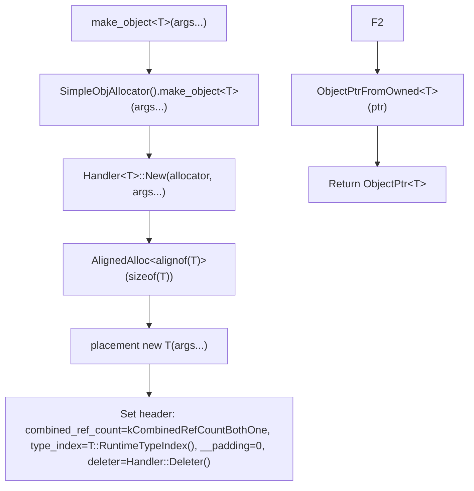
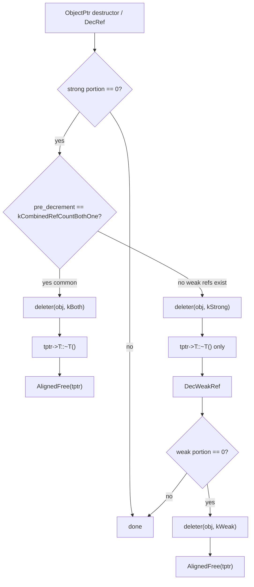

# Memory Allocation

**TL;DR**
- `make_object<T>(args...)` is the single entry point for allocating FFI objects, using `details::SimpleObjAllocator` (in `tvm::ffi::details` namespace) which allocates via `details::AlignedAlloc`/`AlignedFree` with proper alignment and sets up the object header (combined_ref_count, type_index, __padding, deleter) in one shot.
- `make_inplace_array_object<ArrayType, ElemType>(num_elems, args...)` allocates an object plus trailing element storage in a single allocation, used by containers like `Array` and `Shape`.
- The allocator design uses CRTP (`ObjAllocatorBase<Derived>`) to allow future allocator strategies (pool allocators, arena allocators) without changing call sites.

## Problem Statement

### Background
- FFI objects need a consistent allocation pattern: header setup, refcount initialization, type registration, and a type-specific deleter.
- Some objects (arrays, shapes) need trailing element storage allocated contiguously with the object header for cache efficiency.
- The allocation strategy should be swappable without changing the creation API.

### Solution
- A CRTP base `ObjAllocatorBase<Derived>` that implements the header-setup boilerplate.
- `SimpleObjAllocator` as the default, using aligned placement new and type-specific deleters.
- A separate `ArrayHandler` for inplace arrays that computes total allocation size and ensures alignment.

### Goals
- **Goal**: Correct header initialization for all object types.
- **Goal**: Single-allocation inplace arrays for cache-friendly containers.
- **Goal**: Pluggable allocator architecture for future optimization.
- **Non-goal**: Not a general-purpose allocator; only for FFI objects inheriting from `Object`.

## Design

**Allocation flow for `make_object<T>(args...)`**:


**Deletion flow** (two-counter with flag dispatch):


### Key Classes, Fields and Interfaces

**`ObjAllocatorBase<Derived>`** — CRTP base:
```cpp
template <typename Derived>
class ObjAllocatorBase {
public:
  template <typename T, typename... Args>
  ObjectPtr<T> make_object(Args&&... args) {
    using Handler = typename Derived::template Handler<T>;
    T* ptr = Handler::New(static_cast<Derived*>(this), std::forward<Args>(args)...);
    TVMFFIObject* ffi_ptr = ObjectUnsafe::GetHeader(ptr);
    ffi_ptr->combined_ref_count = details::kCombinedRefCountBothOne;
    ffi_ptr->type_index = T::RuntimeTypeIndex();
    ffi_ptr->__padding = 0;
    ffi_ptr->deleter = Handler::Deleter();
    return ObjectUnsafe::ObjectPtrFromOwned<T>(ptr);
  }

  template <typename ArrayType, typename ElemType, typename... Args>
  ObjectPtr<ArrayType> make_inplace_array(size_t num_elems, Args&&... args);
};
```

**`SimpleObjAllocator::Handler<T>`**:
```cpp
template <typename T>
class Handler {
public:
  template <typename... Args>
  static T* New(SimpleObjAllocator*, Args&&... args) {
    void* data = AlignedAlloc<alignof(T)>(sizeof(T));
    new (data) T(std::forward<Args>(args)...);
    return reinterpret_cast<T*>(data);
  }
  static FObjectDeleter Deleter() { return Deleter_; }
private:
  static void Deleter_(void* objptr, int flags) {
    T* tptr = ObjectUnsafe::RawObjectPtrFromUnowned<T>(static_cast<TVMFFIObject*>(objptr));
    if (flags & kTVMFFIObjectDeleterFlagBitMaskStrong) {
      tptr->T::~T();                               // explicit destructor
    }
    if (flags & kTVMFFIObjectDeleterFlagBitMaskWeak) {
      AlignedFree(tptr);                            // free aligned storage
    }
  }
};
```

**`SimpleObjAllocator::ArrayHandler<ArrayType, ElemType>`**:
```cpp
template <typename ArrayType, typename ElemType>
class ArrayHandler {
  static_assert(alignof(ArrayType) % alignof(ElemType) == 0);  // alignment constraint

  template <typename... Args>
  static ArrayType* New(SimpleObjAllocator*, size_t num_elems, Args&&... args) {
    size_t size = sizeof(ArrayType) + sizeof(ElemType) * num_elems;
    constexpr size_t align = alignof(ArrayType);
    size_t aligned_size = (size + (align - 1)) & ~(align - 1);
    void* data = AlignedAlloc<align>(aligned_size);
    new (data) ArrayType(std::forward<Args>(args)...);
    return reinterpret_cast<ArrayType*>(data);
  }
};
```

**Free functions**:
```cpp
template <typename T, typename... Args>
ObjectPtr<T> make_object(Args&&... args);
// Equivalent to: SimpleObjAllocator().make_object<T>(std::forward<Args>(args)...)

template <typename ArrayType, typename ElemType, typename... Args>
ObjectPtr<ArrayType> make_inplace_array_object(size_t num_elems, Args&&... args);
// Equivalent to: SimpleObjAllocator().make_inplace_array<ArrayType, ElemType>(num_elems, ...)
```

### Contracts, Assumptions and Invariants
- **Explicit destructor call**: The deleter calls `tptr->T::~T()` (fully qualified), NOT `tptr->~T()`. This ensures the correct destructor runs without requiring a virtual destructor, which is important because `Object` does NOT have a virtual destructor.
- **Aligned allocation**: `details::AlignedAlloc<alignof(T)>(sizeof(T))` ensures proper alignment for all object types. On POSIX, delegates to `malloc` (when `align <= alignof(max_align_t)`) or `posix_memalign`; on MSVC, uses `_aligned_malloc`. `AlignedFree` matches. The former `StorageType` wrapper struct has been removed.
- **Inplace array element alignment**: `alignof(ArrayType) % alignof(ElemType) == 0` and `sizeof(ArrayType) % alignof(ElemType) == 0` — elements must fit naturally after the object header without padding gaps.
- **Refcount starts at kCombinedRefCountBothOne**: `combined_ref_count` is initialized to `kCombinedRefCountBothOne` (strong=1, weak=1 packed into u64). The returned `ObjectPtr` already owns one strong reference. No IncRef is needed after `make_object`. The initial weak=1 represents the "strong reference group" -- it is decremented when the last strong reference dies. The `__padding` field is also zeroed.
- **Type index from RuntimeTypeIndex()**: The type_index is set using the static function, which may trigger lazy type registration for dynamic types.

### Extension Points
- **Arena allocator**: Implement `ArenaAllocator::Handler<T>` with `deleter=nullptr` (arena owns all memory, objects are never individually freed).
- **Thread-local object pools**: Implement `PoolAllocator::Handler<T>` that returns objects from a pre-allocated pool and recycles them on delete.
- **Per-type specialization**: The `Handler<T>` template can be partially specialized for specific types that need custom allocation strategies.

### Usage Examples

#### Allocating a standard object
**Context**: Creating an object and transferring ownership to a ref handle.
```cpp
// Simple allocation
ObjectPtr<TIntObj> ptr = make_object<TIntObj>(42);
assert(ptr->value == 42);
assert(ptr.use_count() == 1);

// Wrap in ref handle
TInt ref(ptr);                  // IncRef: use_count == 2
assert(ptr.use_count() == 2);
ptr.reset();                    // DecRef: use_count == 1
assert(ref.use_count() == 1);

// Inplace array allocation (for containers like Array)
ObjectPtr<ArrayObj> arr = make_inplace_array_object<ArrayObj, Any>(10);
// Allocates ArrayObj header + 10 * sizeof(Any) in one allocation
```

## Alternatives & Trade-offs
### std::make_shared
- Pros: Standard, well-understood, single allocation.
- Cons: Cannot cross C ABI (shared_ptr has no standard ABI). Cannot use explicit destructor pattern (requires virtual dtor or type-erasure). The `SimpleObjAllocator` approach gives full control over the allocation layout and deletion strategy.

### malloc + manual init
- Pros: Simplest, no templates needed.
- Cons: Error-prone (forgetting to init header fields), no type safety. The `make_object` API ensures all header fields are correctly initialized.

## Related Work
### Design Docs & ADRs
- [0003-object-system.md](.knowledge/designs/0003-object-system.md) -- Object lifecycle, strong+weak refcounting, WeakObjectPtr
- [0008-containers.md](.knowledge/designs/0008-containers.md) -- Containers that use make_inplace_array_object
- [0015-weak-rc-abi-design.md](.knowledge/ADRs/0015-weak-rc-abi-design.md) -- Weak RC ABI design decision

### Evidence Matrix
- make_object free function -> `memory.h` lines 196-199
- ObjAllocatorBase CRTP base -> `memory.h` lines 63-104
- SimpleObjAllocator::Handler -> `memory.h` lines 107-146
- SimpleObjAllocator::ArrayHandler -> `memory.h` lines 149-193
- make_inplace_array_object -> `memory.h` lines 201-205
- Explicit destructor call pattern -> `memory.h` line 143
