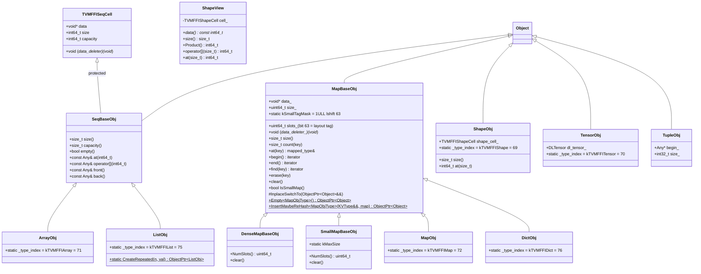

# Containers

**TL;DR**
- TVM FFI provides eight generic container types — `Array<T>` (immutable COW), `List<T>` (mutable sequence), `Map<K,V>` (insertion-order-preserving immutable), `Dict<K,V>` (mutable map with shared-reference semantics), `Shape` (immutable int64 tuple), `Tensor` (DLPack tensor, renamed from `NDArray`), `Tuple` (heterogeneous fixed-size), and `Variant<V...>` (compile-time type union) — all built on the Object system.
- `Array<T>` and `List<T>` share a common base class `SeqBaseObj` (backed by `TVMFFISeqCell` at the C ABI level), consolidating element storage, iteration, and access. `Map<K,V>` and `Dict<K,V>` share a common base class `MapBaseObj` (transparent to the FFI type system), with `Map` using COW semantics and `Dict` mutating in place. Both store key-value pairs with `AnyHash`/`AnyEqual` supporting custom per-type hash/equality via `__any_hash__`/`__any_equal__` type attributes.
- All containers are objects (inheriting from `Object`), so they can be stored in `Any`, passed through the packed function convention, and shared across language boundaries.

## Problem Statement

### Background
- The FFI needs structured containers that work uniformly across C++, Python, and Rust.
- Containers must store both POD values (int, float) and object references without boxing, leveraging the unified `Any` value system.
- Python-side containers should preserve insertion order (for deterministic IR printing) and support COW semantics (efficient for immutable IR transformations). Mutable containers (`List`, `Dict`) are also needed for imperative usage patterns.

### Solution
- Each container is an Object type with a static type index, stored in inplace-allocated arrays for cache efficiency.
- `Array<T>` uses COW semantics: shared arrays are copied on mutation.
- `Map<K,V>` uses a dense hash map that preserves insertion order.
- All container elements are stored as `Any` values, with TypeTraits enforcing type invariants.

### Goals
- **Goal**: Type-safe, cross-language containers that store POD and objects uniformly.
- **Goal**: COW semantics for efficient immutable data structures.
- **Goal**: Insertion-order preservation for Map (deterministic iteration).
- **Non-goal**: Not general-purpose STL replacements; designed for FFI value passing and IR construction.

## Design



> **Note**: `MapObj` and `DictObj` both inherit directly from `MapBaseObj` (not from `DenseMapBaseObj`/`SmallMapBaseObj`). The `DenseMapBaseObj` and `SmallMapBaseObj` classes provide the storage implementations, and `MapBaseObj` dispatches to the correct one at runtime via the MSB tag bit in `slots_`. `MapObj` and `DictObj` are thin subclasses that merely define their respective FFI type indices.

### Key Classes, Fields and Interfaces

**`SeqBaseObj`** (shared base for `ArrayObj` and `ListObj`, transparent to FFI type system, no type index):
```cpp
// TVMFFISeqCell is the C ABI struct defining shared memory layout
struct TVMFFISeqCell {
  void* data;                      // pointer to first element (Any[])
  int64_t size;                    // elements used
  int64_t capacity;                // elements allocated
  void (*data_deleter)(void*);     // optional deleter for data buffer
};

// SeqBaseObj consolidates element access, iteration, and lifecycle for Array and List
class SeqBaseObj : public Object, protected TVMFFISeqCell {
  size_t size() const;
  size_t capacity() const;
  bool empty() const;
  const Any& at(int64_t i) const;
  const Any& operator[](int64_t i) const;  // bounds-checked (negative indices adjusted)
  const Any& front() const;
  const Any& back() const;
  // Iterators: begin(), end(), rbegin(), rend()
  // Search: find(Any), contains(Any), count(Any)
};
```

**`Array<T>`** (immutable, COW, type index `kTVMFFIArray=71`):
```cpp
// ArrayObj now inherits from SeqBaseObj (was directly from Object)
class ArrayObj : public SeqBaseObj {
  // Fields data_, size_, capacity_, data_deleter_ are inherited from TVMFFISeqCell via SeqBaseObj
  // Elements are stored as Any values accessed via data
  // Invariant: TypeTraits<T>::CheckAnyStrict(elem) for all elements
};

template<typename T>
class Array : public ObjectRef {
  // Immutable: all mutation methods return new Array (COW)
  size_t size() const;
  T operator[](int64_t index) const;
  // COW mutation:
  void push_back(T value);           // copies if shared
  template<typename... Args>
  void emplace_back(Args&&... args); // variadic emplace into array
  void Set(int64_t index, T value);  // copies if shared
  static Array FromRange(int64_t begin, int64_t end);
};
```

**`List<T>`** (mutable sequence, type index `kTVMFFIList=75`, introduced in 9513c2f):
```cpp
// ListObj inherits from SeqBaseObj, sharing the TVMFFISeqCell layout
class ListObj : public SeqBaseObj {
  static ObjectPtr<ListObj> CreateRepeated(int64_t n, const Any& val);
  static constexpr int32_t _type_index = kTVMFFIList;  // = 75
  static constexpr const char* _type_key = "ffi.List";
};

template <typename T>
class List : public ObjectRef {
  List();                          // creates empty list
  size_t size() const;
  bool empty() const;
  T operator[](int64_t i) const;
  void push_back(T item);         // direct mutation (no COW)
  void pop_back();
  void insert(int64_t i, T item);
  void erase(int64_t i);
  void resize(int64_t n);
  void Set(int64_t i, T item);
  void clear();
  void reserve(int64_t n);
  void reverse();
  // Iterators, FromRange, static factories
};
```
Key difference from `Array<T>`: `List<T>` mutates in place (no COW). It is not thread-safe and can form reference cycles.

**Python `List`** (`container.py`, registered `"ffi.List"`, introduced in 9513c2f):
```python
@register_object("ffi.List")
class List(core.Object, MutableSequence[T]):
    def __init__(self, input_list: Iterable[T]) -> None: ...
    def __getitem__(self, idx): ...
    def __setitem__(self, idx, val): ...
    def __delitem__(self, idx): ...
    def append(self, val: T) -> None: ...
    def insert(self, idx: int, val: T) -> None: ...
    def pop(self, idx: int = -1) -> T: ...
    def extend(self, vals: Iterable[T]) -> None: ...
    def reverse(self) -> None: ...
    def __contains__(self, val: object) -> bool: ...
```

**`MapBaseObj`** (shared base for `MapObj` and `DictObj`, transparent to FFI type system -- no type index; extracted in 5a6b211):
```cpp
// MapBaseObj holds all map operations and storage fields. MapObj and DictObj are thin subclasses
// with distinct type indices. DenseMapBaseObj and SmallMapBaseObj provide the two storage layouts.
class MapBaseObj : public Object {
  // Public API (all map operations are defined here, not on MapObj/DictObj)
  size_t size() const;
  size_t count(const key_type& key) const;
  const mapped_type& at(const key_type& key) const;
  mapped_type& at(const key_type& key);          // mutable version (for Dict)
  iterator begin() const;
  iterator end() const;
  iterator find(const key_type& key) const;
  void erase(const iterator& position);
  void erase(const key_type& key);
  void clear();                                   // dispatches to SmallMapBaseObj/DenseMapBaseObj

protected:
  void InplaceSwitchTo(ObjectPtr<Object>&& other); // steal storage from other (for Dict rehash)

  // Templatized factories -- MapObjType sets header_.type_index = MapObjType::RuntimeTypeIndex()
  template <typename MapObjType> static ObjectPtr<Object> Empty();
  template <typename MapObjType, typename IterType>
  static ObjectPtr<Object> CreateFromRange(IterType first, IterType last);
  template <typename MapObjType>
  static ObjectPtr<Object> InsertMaybeReHash(KVType&& kv, const ObjectPtr<Object>& map);
  // ^ Returns new container if rehash needed, nullptr otherwise (changed from void+pointer in c1af3b3)
  template <typename MapObjType> static ObjectPtr<Object> CopyFrom(MapBaseObj* from);

  void* data_;
  uint64_t size_;
  uint64_t slots_;  // bit 63 (MSB) is the layout tag; use NumSlots() for logical count
  static constexpr uint64_t kSmallTagMask = static_cast<uint64_t>(1) << 63;
  bool IsSmallMap() const;  // (slots_ & kSmallTagMask) != 0
  void (*data_deleter_)(void*) = nullptr;
};

class SmallMapBaseObj : public MapBaseObj {
  uint64_t NumSlots() const;  // slots_ & ~kSmallTagMask
  void clear();               // destroys entries, resets size_ without deallocating
};

class DenseMapBaseObj : public MapBaseObj {
  uint64_t NumSlots() const;  // slots_ (MSB always clear)
  void clear();               // destroys entries, resets size_/iter heads without deallocating
};
```

**`MapObj`** (thin subclass, type index `kTVMFFIMap=72`; body is nearly empty after 5a6b211):
```cpp
class MapObj : public MapBaseObj {
  static constexpr int32_t _type_index = TypeIndex::kTVMFFIMap;  // 72
  static constexpr bool _type_final = true;
  TVM_FFI_DECLARE_OBJECT_INFO_STATIC(StaticTypeKey::kTVMFFIMap, MapObj, Object);
};
```

**`Map<K,V>`** (immutable, insertion-order-preserving):
```cpp
template<typename K, typename V>
class Map : public ObjectRef {
  size_t size() const;
  V at(const K& key) const;
  bool count(const K& key) const;
  void Set(K key, V value);          // COW on shared
  // Iteration preserves insertion order
  iterator begin() const;
  iterator end() const;
};
```

**`DictObj`** (mutable map, type index `kTVMFFIDict=76`, introduced in c1af3b3):
```cpp
class DictObj : public MapBaseObj {
  static constexpr int32_t _type_index = TypeIndex::kTVMFFIDict;  // 76
  static constexpr bool _type_final = true;
  TVM_FFI_DECLARE_OBJECT_INFO_STATIC(StaticTypeKey::kTVMFFIDict, DictObj, Object);
  // sizeof(DictObj) == sizeof(MapBaseObj) -- no additional fields
};
```

**`Dict<K,V>`** (mutable, shared-reference semantics, introduced in c1af3b3):
```cpp
template <typename K, typename V> class Dict : public ObjectRef {
  Dict();                                    // creates empty dict
  V at(const K& key) const;
  V operator[](const K& key) const;
  size_t size() const;
  size_t count(const K& key) const;
  bool empty() const;
  void clear();                             // in-place clear
  void Set(const K& key, const V& value);   // in-place insert/update
  void erase(const K& key);                 // in-place erase
  std::optional<V> Get(const K& key) const; // returns nullopt if not found
  iterator begin() const;
  iterator end() const;
  iterator find(const K& key) const;
};
```
Key difference from `Map<K,V>`: `Dict<K,V>` mutates in place (no COW). All handles sharing the same `DictObj` see mutations immediately, analogous to `List<T>` vs `Array<T>`.

**`MapTypeTraitsBase<Derived, MapRef, K, V>`** (CRTP for shared Map/Dict TypeTraits, introduced in c1af3b3):
```cpp
template <typename Derived, typename MapRef, typename K, typename V>
struct MapTypeTraitsBase {
  // Shared logic: CheckAnyStrict, GetMismatchTypeInfo, TryCastFromAnyView, TypeStr
  // TryCastFromAnyView accepts both kPrimaryTypeIndex and kOtherTypeIndex
  // Derived must expose: kPrimaryTypeIndex, kOtherTypeIndex, kTypeName
};
// TypeTraits<Map<K,V>>: kPrimaryTypeIndex=kTVMFFIMap, kOtherTypeIndex=kTVMFFIDict
// TypeTraits<Dict<K,V>>: kPrimaryTypeIndex=kTVMFFIDict, kOtherTypeIndex=kTVMFFIMap
// This enables cross-conversion: Map accepts Dict and vice versa.
```

**Python `Dict`** (`container.py`, registered `"ffi.Dict"`, introduced in c1af3b3):
```python
@register_object("ffi.Dict")
class Dict(core.Object, MutableMapping[K, V]):
    def __init__(self, input_dict: Mapping[K, V] | None = None) -> None: ...
    def __getitem__(self, k: K) -> V: ...
    def __setitem__(self, k: K, v: V) -> None: ...
    def __delitem__(self, k: K) -> None: ...
    def __contains__(self, k: object) -> bool: ...
    def __len__(self) -> int: ...
    def __bool__(self) -> bool: ...
    def keys(self) -> KeysView[K]: ...
    def values(self) -> ValuesView[V]: ...
    def items(self) -> ItemsView[K, V]: ...
    def get(self, key: K, default=None) -> V | None: ...  # sentinel-based
    def pop(self, key: K, *args) -> V: ...
    def clear(self) -> None: ...
    def update(self, other: Mapping[K, V]) -> None: ...
```

**`Shape`** (immutable int64 tuple, type index `kTVMFFIShape=69`):
```cpp
class ShapeObj : public Object, public TVMFFIShapeCell {
  // TVMFFIShapeCell: { const int64_t* data; size_t size; }
  // Elements stored in trailing allocation
};

class Shape : public ObjectRef {
  size_t size() const;
  int64_t operator[](size_t index) const;
  // Construction: Shape({1, 2, 3}) or Shape(std::vector<int64_t>)
};
```

**`ShapeView`** (non-owning view over shape data, added in 8ca0719):
```cpp
class ShapeView {
  TVMFFIShapeCell cell_;
public:
  ShapeView();                                              // default: {nullptr, 0}
  ShapeView(const int64_t* data, size_t size);
  ShapeView(const std::initializer_list<int64_t>& other);
  const int64_t* data() const;
  size_t size() const;
  int64_t Product() const;
  int64_t operator[](size_t idx) const;                     // unchecked
  int64_t at(size_t idx) const;                             // bounds-checked
  // Iterators: begin(), end(), empty(), front(), back()
  // Implicit conversions: Shape -> ShapeView (zero-copy), ShapeView -> Shape (copy)
};
```

**`Tensor`** (DLPack tensor wrapper, type index `kTVMFFITensor=70`, renamed from `NDArray` in commit 3a551d8):
```cpp
class TensorObj : public Object, public DLTensor {
  // Inherits DLTensor fields: data, shape, strides, dtype, device, ndim, byte_offset
  // Shape/strides are stored inplace via trailing allocation in TensorObjFromNDAlloc/FromDLPack subclasses
  // Former fields removed: Optional<Shape> strides_data_, cached_dl_managed_tensor_versioned_ (8ca0719)
};

class Tensor : public ObjectRef {
  // Method-based API (operator->() removed in 0dcd4d2, replaced by named methods)
  void* data_ptr() const;              // replaces (*this)->data
  DLDevice device() const;             // replaces (*this)->device
  int32_t ndim() const;                // replaces (*this)->ndim
  DLDataType dtype() const;            // replaces (*this)->dtype
  int64_t size(int64_t idx) const;     // per-dimension shape; negative index wraps (573d76f)
  int64_t stride(int64_t idx) const;   // per-dimension stride; negative index wraps (573d76f)
  uint64_t byte_offset() const;
  int64_t numel() const;               // shape().Product()
  ShapeView shape() const;             // returns ShapeView (8ca0719)
  ShapeView strides() const;           // returns ShapeView (8ca0719)
  const DLTensor* GetDLTensorPtr() const; // explicit escape hatch for raw DLTensor*
  bool IsContiguous() const;
  bool IsAligned(size_t alignment) const;
  // ATen-style aliases (573d76f)
  int32_t dim();                        // redirects to ndim()
  ShapeView sizes() const;              // redirects to shape()
  bool is_contiguous() const;           // redirects to IsContiguous()
  // DLPack interop
  static Tensor FromDLPack(DLManagedTensor*, int32_t require_alignment=0, int32_t require_contiguous=0);
  DLManagedTensor* ToDLPack() const;
  static Tensor FromDLPackVersioned(DLManagedTensorVersioned*, int32_t require_alignment=0, int32_t require_contiguous=0);
  DLManagedTensorVersioned* ToDLPackVersioned() const;  // no longer cached; fresh alloc per call (8ca0719)
  // Allocation
  template<typename T> static Tensor FromNDAlloc(T alloc, ShapeView shape, DLDataType dtype, DLDevice device);
  static Tensor FromEnvAlloc(int (*env_alloc)(DLTensor*, TVMFFIObjectHandle*),
                              ShapeView shape, DLDataType dtype, DLDevice device); // f679fe5
  // Strided view creation (8888eb4):
  Tensor as_strided(ShapeView shape, ShapeView strides,
                    std::optional<int64_t> element_offset = std::nullopt) const;
  // Static factory: allocate strided tensor via custom allocator (8888eb4):
  template <typename TNDAlloc, typename... ExtraArgs>
  static Tensor FromNDAllocStrided(
      TNDAlloc alloc, ShapeView shape, ShapeView strides,
      DLDataType dtype, DLDevice device, ExtraArgs&&... extra_args);
};

// Free functions (tensor.h)
inline bool IsDirectAddressDevice(const DLDevice& device);
size_t GetDataSize(const Tensor& tensor);      // 0dcd4d2
size_t GetDataSize(const TensorView& tensor);  // 0dcd4d2
```

**`Tuple<Types...>`** (heterogeneous fixed-size tuple, dynamic type index):
```cpp
class TupleObj : public Object {
  Any* begin_;
  int32_t size_;
  // Elements stored in trailing allocation
};

template <typename... Types>
class Tuple : public ObjectRef {
  size_t size() const;
  Any operator[](size_t index) const;
  template <size_t I> auto get() const&;   // copy element
  template <size_t I> auto get() &&;       // move element out if unique(), copy otherwise (227bdd0)
};

// CTAD guide (227bdd0):
template <typename... UTypes>
Tuple(UTypes&&...) -> Tuple<std::remove_cv_t<std::remove_reference_t<UTypes>>...>;

// ADL-friendly free functions for structured bindings (227bdd0):
template <size_t I, typename... Types>
auto get(const Tuple<Types...>& t) -> std::tuple_element_t<I, std::tuple<Types...>>;
template <size_t I, typename... Types>
auto get(Tuple<Types...>&& t) -> std::tuple_element_t<I, std::tuple<Types...>>;

// std specializations (227bdd0):
namespace std {
  template <typename... Types>
  struct tuple_size<tvm::ffi::Tuple<Types...>>
      : integral_constant<size_t, sizeof...(Types)> {};
  template <size_t I, typename... Types>
  struct tuple_element<I, tvm::ffi::Tuple<Types...>>
      : tuple_element<I, tuple<Types...>> {};
}
```

**`TensorView`** (non-owning tensor view, maps to `kTVMFFIDLTensorPtr`, added in 1ec6236):
```cpp
class TensorView {
public:
  TensorView(const Tensor& tensor);       // implicit from owning Tensor (asserts defined)
  TensorView(const DLTensor* tensor);      // implicit from raw DLTensor* (asserts non-null)
  TensorView(const TensorView&) = default;
  TensorView(TensorView&&) = default;
  TensorView& operator=(const Tensor& tensor);
  TensorView(Tensor&& tensor) = delete;           // prevents accidental rvalue capture
  TensorView& operator=(Tensor&& tensor) = delete; // prevents accidental rvalue capture

  // Method-based API (operator->() removed in 0dcd4d2)
  void* data_ptr() const;
  DLDevice device() const;
  int32_t ndim() const;
  DLDataType dtype() const;
  int64_t size(int64_t idx) const;      // per-dimension shape; negative index wraps (573d76f)
  int64_t stride(int64_t idx) const;    // per-dimension stride; negative index wraps (573d76f)
  uint64_t byte_offset() const;
  int64_t numel() const;               // shape().Product()
  ShapeView shape() const;
  ShapeView strides() const;           // asserts strides != nullptr || ndim == 0
  bool IsContiguous() const;
  // ATen-style aliases (573d76f)
  int32_t dim();                        // redirects to ndim()
  ShapeView sizes() const;              // redirects to shape()
  bool is_contiguous() const;           // redirects to IsContiguous()
  // Strided view creation (8888eb4) -- caller must keep shape/strides arrays alive:
  TensorView as_strided(ShapeView shape, ShapeView strides,
                        std::optional<int64_t> element_offset = std::nullopt) const;
private:
  DLTensor tensor_;  // shallow copy of the DLTensor struct (pointers, not data)
};
```
- `TypeTraits<TensorView>` sets `storage_enabled = false` and `field_static_type_index = kTVMFFIDLTensorPtr`. Cannot be stored in `Any` (only `AnyView`).
- `TryCastFromAnyView` accepts both `kTVMFFIDLTensorPtr` (raw pointer) and `kTVMFFITensor` (coercion from owning `Tensor`).
- **Convention**: `TensorView` is the recommended parameter type for FFI-exported kernel functions, since callers may not always hold an owning reference.

**`Variant<V...>`** (compile-time union, conditionally inherits from ObjectRef):
```cpp
template<typename... V>
class Variant : public details::VariantBase<details::all_object_ref_v<V...>> {
  // When all V... are ObjectRef subtypes: inherits ObjectRef, sizeof == sizeof(ObjectRef)
  // When any V is a POD type: backed by Any storage, sizeof == sizeof(Any)
  template<typename T> bool is() const;
  template<typename T> T get() const;
  bool same_as(const Variant& other) const;
};
```

### Contracts, Assumptions and Invariants
- **Element type invariant (Array<T>)**: Every element satisfies `TypeTraits<T>::CheckAnyStrict`. This is checked at insertion time.
- **List<T> is mutable, not COW** (9513c2f): `List<T>` mutates its backing storage directly without copy-on-write. It is not thread-safe. Multiple references to the same `List` share the same underlying data, and mutations through any reference are visible to all.
- **List<T> can form reference cycles** (9513c2f): Because `List` is mutable and stores `Any` values, it can form reference cycles (e.g., a List containing itself). Serialization, structural hash, and structural equal all handle `List` with explicit cycle detection.
- **`TypeTraits<std::vector<T>>` accepts both Array and List** (9513c2f): `TryCastFromAnyView` for `std::vector<T>` accepts both `kTVMFFIArray` and `kTVMFFIList` type indices, allowing C++ code to accept either container type when expecting a vector.
- **Dict<K,V> is mutable, not COW** (c1af3b3): `Dict<K,V>` mutates its backing `DictObj` directly without copy-on-write. Multiple references to the same `Dict` share the same data; mutations through any reference are visible to all. This is analogous to `List<T>` vs `Array<T>`.
- **Dict rehash via InplaceSwitchTo** (c1af3b3): When `Dict::Set` triggers a rehash (via `InsertMaybeReHash`), the returned new container's storage is stolen into the existing `DictObj` via `MapBaseObj::InplaceSwitchTo`, so all existing `Dict` handles continue pointing to the same `DictObj` object. This preserves reference identity across rehashes.
- **InsertMaybeReHash return-value contract** (c1af3b3): `InsertMaybeReHash<MapObjType>(kv, map)` returns a new `ObjectPtr<Object>` if rehashing produced a new container, or `nullptr` if the insert was in-place. Map uses the returned pointer for COW swap; Dict uses `InplaceSwitchTo` to steal the new storage.
- **Map<->Dict cross-conversion** (c1af3b3): `TypeTraits<Map<K,V>>::TryCastFromAnyView` accepts both `kTVMFFIMap` and `kTVMFFIDict` type indices (and vice versa for `Dict`). This is achieved through the `MapTypeTraitsBase` CRTP which accepts both `kPrimaryTypeIndex` and `kOtherTypeIndex`.
- **COW semantics**: Mutation methods on `Array` and `Map` check `unique()` before modifying in place; if shared (refcount > 1), they copy the data first.
- **Insertion order (Map)**: Iteration order matches insertion order. The dense hashmap implementation uses a linear probe table with separate insertion-ordered storage.
- **Key uniqueness (Map)**: Each key appears at most once. `MapObj::CreateFromRange` deduplicates entries with duplicate keys using last-writer-wins semantics. For small maps (`cap >= 2`), this routes through `SmallMapObj::InsertMaybeReHash` rather than bulk copy, ensuring deduplication. For `cap < 2`, duplicates are impossible.
- **`Array<T>::operator[]` returns `const T`** (temporary, 07546c7): The return type was changed from `T` to `const T` as a temporary workaround for a flashinfer implicit conversion dependency. This affects const-qualification of the return value but not the actual value returned. Intended to revert once downstream patches land.
- **Map layout tag invariant**: Bit 63 of `MapObj::slots_` is reserved as the SmallMap/DenseMap layout discriminator. `IsSmallMap()` returns `(slots_ & kSmallTagMask) != 0`. All internal code must use `NumSlots()` (not raw `slots_`) to read the logical slot count, since `SmallMapObj` masks off the tag bit. See [ADR 0012](../ADRs/0012-msb-tag-map-layout.md).
- **Shape immutability**: `Shape` values are fully immutable once constructed; elements are stored in trailing allocation with `make_inplace_array_object`.
- **Tensor ownership**: `FromDLPack` takes ownership of the `DLManagedTensor` and calls its deleter when the Tensor is freed.
- **Tensor strides are always non-null for ndim > 0**: All Tensors with `ndim > 0` constructed through TVM FFI always populate `DLTensor::strides` with explicit row-major contiguous strides via `Shape::StridesFromShape(data, ndim)`. When importing via `FromDLPack`, if the incoming tensor has `strides == nullptr` and `ndim > 0`, strides are synthesized; if non-null, incoming strides are preserved as-is. **Zero-dimensional (scalar) tensors may have null strides**, since they have no stride values; `strides()` returns an empty `ShapeView(nullptr, 0)` in this case. The static method `Shape::StridesFromShape(const int64_t* data, int64_t ndim) -> Shape` computes `strides[i] = product(shape[i+1:])`.
- **Strided view ownership** (8888eb4): `Tensor::as_strided` creates a new `TensorObj` that holds a strong reference to the source tensor (via `ViewNDAlloc`), copies shape/strides into its own inplace allocation. `TensorView::as_strided` creates a lightweight non-owning view where the caller must keep shape/strides arrays alive. For direct-address devices (CPU), `element_offset` is folded into the `data` pointer directly; for non-direct-address devices, `byte_offset` is incremented.
- **`TVMFFITensorCreateUnsafeView`** (C ABI, 8888eb4): `int TVMFFITensorCreateUnsafeView(TVMFFIObjectHandle source, const DLTensor* prototype, TVMFFIObjectHandle* out)` creates a view tensor sharing source data with custom metadata (shape, strides, dtype, device, byte_offset).
- **TensorView is non-owning**: `TensorView` holds a shallow copy of the `DLTensor` struct (pointers to data/shape/strides, not the data itself). It cannot outlive the `Tensor` or `DLTensor*` it was constructed from. Passing a temporary `Tensor` rvalue is forbidden at compile time (`Tensor&&` constructors are deleted).
- **Failure mode -- strides nullptr check**: Downstream callers that tested `strides == nullptr` as a contiguity check must be updated to use `IsContiguous()` which handles non-null strides correctly.
- **Variant conditional inheritance**: `Variant<V...>` inherits from `ObjectRef` when all `V...` are ObjectRef subtypes (`VariantBase<true>`), enabling direct use in ObjectRef-expecting APIs. When any `V` is a POD type, it falls back to `Any`-backed storage (`VariantBase<false>`).
- **Variant type safety**: The stored value's type_index is used for `is<T>()` checks via `IsInstance`.
- **IterAdapter/ReverseIterAdapter InputIterator conformance** (14f3c82): `reference` is `const ResultType` (not `ResultType&`) and `pointer` is `const ResultType*` (not `ResultType*`). `operator*` returns `reference`. This is correct because the converter returns by value (prvalue), so the iterator is an input iterator, not forward. Prior to this fix, `reference` was `ResultType&` (mutable lvalue reference) while `operator*` returned `const value_type` (const prvalue), violating the InputIterator requirement that `*it` returns `reference`.
- **Tuple structured binding protocol** (227bdd0): `Tuple<Types...>` supports C++17 structured bindings via `std::tuple_size`, `std::tuple_element`, and ADL `get` overloads. The rvalue `get() &&` overload moves the element out when `this->unique()` (ref count is 1), falling back to copy when shared. This is consistent with the COW mutation convention elsewhere (check `unique()` before mutating).
- **FFI namespace isolation**: No `tvm::ffi` symbol is re-exported into `tvm::` via `using` declarations in FFI headers (all `using ffi::X` aliases removed in commit e9d2946). All FFI types (`Array`, `Map`, `String`, `Bytes`, `Variant`, `Optional`, `make_object`, `GetRef`, `GetObjectPtr`) must be accessed through `tvm::ffi::`. This is the convention going forward, preparing for full FFI package isolation.

**`String::find()` and `String::substr()`** (bd12b26):
```cpp
class String {
  // ...
  static constexpr size_t npos = static_cast<size_t>(-1);
  size_t find(const String& str, size_t pos = 0) const;
  size_t find(const char* str, size_t pos = 0) const;
  size_t find(const char* str, size_t pos, size_t count) const;
  // Delegates to std::string_view::find
  String substr(size_t pos = 0, size_t count = npos) const;
  // Throws std::out_of_range if pos > size()
};
```

**`String::starts_with` / `String::ends_with`** (02d1a96):
```cpp
class String {
  // ...
  // 4 overloads each, all delegating to the (const char*, size_t) core
  bool starts_with(const String& prefix) const;
  bool starts_with(std::string_view prefix) const;
  bool starts_with(const char* prefix) const;
  bool starts_with(const char* prefix, size_t count) const;  // core: false if count > size(), else memcmp
  bool ends_with(const String& suffix) const;
  bool ends_with(std::string_view suffix) const;
  bool ends_with(const char* suffix) const;
  bool ends_with(const char* suffix, size_t count) const;    // core: false if count > size(), else memcmp at end
};
```
Mirrors C++20 `std::string::starts_with`/`ends_with`. Core implementation uses `std::memcmp`.

**`ffi.ArrayContains`** (global function, 5bc7fcd):
```cpp
// (const ArrayObj*, const Any&) -> bool
// Uses AnyEqual for element comparison, std::any_of for iteration
```

**Python `Array[T]`** (parameterized generic, registered `"ffi.Array"`):
```python
class Array(core.Object, Sequence[T]):
    def __init__(self, input_list: Iterable[T]) -> None: ...  # widened from Sequence
    @overload
    def __getitem__(self, idx: SupportsIndex, /) -> T: ...
    @overload
    def __getitem__(self, idx: slice, /) -> list[T]: ...      # returns list, not Array
    def __len__(self) -> int: ...
    def __iter__(self) -> Iterator[T]: ...
    def __contains__(self, value: object) -> bool: ...         # linear search via ffi.ArrayContains (5bc7fcd)
    def __bool__(self) -> bool: ...                            # len(self) > 0 (46ab644)
    def __add__(self, other: Iterable[T]) -> Array[T]: ...     # concatenation
    def __radd__(self, other: Iterable[T]) -> Array[T]: ...    # reverse concatenation
```

**Python `Map[K, V]`** (parameterized generic, registered `"ffi.Map"`):
```python
class Map(core.Object, Mapping[K, V]):
    def __getitem__(self, k: K) -> V: ...
    def keys(self) -> KeysView[K]: ...
    def values(self) -> ValuesView[V]: ...
    def items(self) -> ItemsView[K, V]: ...
    def __bool__(self) -> bool: ...                            # len(self) > 0 (46ab644)
    @overload
    def get(self, key: K) -> V | None: ...
    @overload
    def get(self, key: K, default: V | _DefaultT) -> V | _DefaultT: ...
```

### Contracts (continued)
- **Sentinel-based `Map.get`** (438f643, 86c4042): `Map.get(key, default)` uses `ffi.MapGetItemOrMissing` which returns a singleton `GetInvalidObject()` sentinel instead of raising `KeyError` on cache misses. The Python side checks `MISSING.same_as(ret)` (identity comparison). This eliminates expensive exception creation in hot paths and avoids reference cycles from exception objects. Internal FFI functions: `ffi.MapGetItemOrMissing(MapObj*, Any) -> Any`, `ffi.GetInvalidObject() -> ObjectRef` (renamed from `ffi.MapGetMissingObject` in 86c4042 to reflect general-purpose usage beyond Map). Python exports: `tvm_ffi.core.MISSING` and `tvm_ffi.container.MISSING`.
- **`DenseMapObj::At` throws `KeyError`**: When a key is missing, `At` throws `TVM_FFI_THROW(KeyError)`, not `IndexError`. This is consumed by Python `Map.get`'s `except KeyError:` handler. Prior to commit c88110e, `IndexError` was incorrectly used.
- **`Array.__getitem__(slice)` returns `list[T]`**: Slicing returns a plain Python `list`, not an `Array`. This matches original TVM behavior. The `getitem_helper` utility produces lists for slices.
- **`Array.__init__` accepts `Iterable[T]`**: Widened from `Sequence[T]` to support any iterable (including generators and `itertools.chain` results).
- **Tensor/TensorView bounds checking** (e54d15d): `Tensor::size(idx)`, `Tensor::stride(idx)`, `TensorView::size(idx)`, and `TensorView::stride(idx)` validate `0 <= adjusted_idx < ndim` after negative index adjustment. Out-of-range indices throw `IndexError` (previously UB from buffer overread).
- **ArrayObj negative index bounds checking** (ec56178): `ArrayObj::operator[]` and `ArrayObj::SetItem` now check `i < 0 || i >= size_`. Previously, negative indices bypassed the bounds check (only `i >= size_` was tested), leading to UB.
- **Python container truthiness** (46ab644): `Array.__bool__` and `Map.__bool__` return `len(self) > 0`. Previously `bool(Array([]))` returned `True` (falling through to default Object truthiness).
- **Python containers are parameterizable generics**: `Array[T]`, `Map[K, V]`, `KeysView[K]`, `ValuesView[V]`, `ItemsView[K, V]` support subscript syntax for static type checkers. All container annotations should use parameterized forms.

### Extension Points
- **New container types**: Define a new ObjectObj subclass with inplace storage and register with a dynamic type index. For map-like containers, inherit from `MapBaseObj` and use the templatized factory pattern (`Empty<NewMapType>()`, `InsertMaybeReHash<NewMapType>(...)`) to reuse the hash-map machinery with a distinct type index, as demonstrated by `DictObj`.
- **Custom hash/equal for Map via type attributes** (39d9b2b): Object types can register custom `AnyHash`/`AnyEqual` behavior via type attribute columns `__any_hash__` and `__any_equal__`, enabling Object types as Map keys with custom semantics. Each attribute can be either a raw function pointer (`kTVMFFIOpaquePtr`, fast path) or an `ffi.Function` object (general path). For built-in key types, `AnyEqual` uses `Bytes::memequal` for string keys (fast O(1) size-mismatch rejection + memcmp). `AnyHash` uses `StableHashBytes` with alignment-aware fast path for 8-byte aligned data. Without custom registration, Object keys fall back to pointer-based comparison.
- **Tensor device support**: New devices can be supported by implementing the appropriate `DLDeviceType` and memory management. `IsDirectAddressDevice` can be extended for new device types.

### Usage Examples

#### Working with Array and Map
**Context**: Creating and using typed containers in C++.
```cpp
// Array creation and access
Array<int> arr = {1, 2, 3};
assert(arr.size() == 3);
assert(arr[0] == 1);

// COW: mutation creates a copy if shared
Array<int> arr2 = arr;          // shared (refcount 2)
arr2.push_back(4);              // COW: arr2 is now a separate copy
assert(arr.size() == 3);        // original unchanged
assert(arr2.size() == 4);

// Map with insertion order
Map<String, int> m;
m.Set("b", 2);
m.Set("a", 1);
// Iteration: "b"->2, "a"->1 (insertion order preserved)

// Containers stored in Any
Any val = arr;
Array<int> restored = val.cast<Array<int>>();
```

#### Mutable List (C++ and Python)
**Context**: Using `List<T>` as a mutable sequence container, contrasted with COW `Array<T>`.
```cpp
// C++: List creation and in-place mutation
List<int> l = {1, 2, 3};
l.push_back(4);
l.Set(0, 10);            // direct mutation, no copy
assert(l[0] == 10);
l.erase(1);              // remove element at index 1
l.reverse();
```
```python
# Python: List as MutableSequence
lst = tvm_ffi.List([1, 2, 3])
lst.append(4)
lst[0] = 10
del lst[1]
lst.reverse()
```

#### Mutable Dict (C++ and Python)
**Context**: Using `Dict<K,V>` as a mutable map container with shared-reference semantics, contrasted with COW `Map<K,V>`.
```cpp
// C++: Dict creation and in-place mutation
Dict<String, int> d;
d.Set("a", 1);
d.Set("b", 2);
assert(d.size() == 2);
assert(d.at("a") == 1);

// Shared reference semantics -- no COW
Dict<String, int> d2 = d;  // shared handle, same DictObj
d2.Set("c", 3);            // mutation visible to both handles
assert(d.size() == 3);     // d also sees the new entry

// Optional get (returns std::nullopt if missing)
auto val = d.Get("missing");  // returns std::nullopt

// Erase and clear
d.erase("a");
d.clear();
```
```python
# Python: Dict as MutableMapping
import tvm_ffi

d = tvm_ffi.Dict({"a": 1, "b": 2})
d["c"] = 3
assert len(d) == 3
assert d["a"] == 1

val = d.get("missing", -1)  # returns -1 (sentinel-based)

del d["b"]
popped = d.pop("c")  # returns 3
d.clear()
```

#### Custom AnyHash/AnyEqual for Map keys
**Context**: Registering custom hash/equal for an Object type to use it as a Map key.
```cpp
// Define custom hash/equal functions
int64_t MyObjHash(const Any& a) { return /* custom hash */; }
bool MyObjEqual(const Any& a, const Any& b) { return /* custom equal */; }

// Register via type attribute columns (fast-path function pointer)
TVMFFIByteArray hash_attr = {"__any_hash__", 13};
TVMFFIAny hash_val;
hash_val.type_index = TypeIndex::kTVMFFIOpaquePtr;
hash_val.v_ptr = reinterpret_cast<void*>(&MyObjHash);
TVMFFITypeRegisterAttr(MyObj::_type_index, &hash_attr, &hash_val);

// Similarly for __any_equal__
// Now MyObj instances can be used as Map<MyObj, V> keys
```

#### Tuple structured bindings and move semantics
**Context**: Using C++17 structured bindings with `Tuple`, and moving elements out when uniquely owned.
```cpp
using namespace tvm::ffi;

// CTAD (class template argument deduction)
auto t = Tuple{1, 2.0f, String{"hello"}};
auto [a, b, c] = t;  // a=1, b=2.0f, c="hello"

// Move semantics: element moved out when unique
auto p = Tuple{Array<int>{0}};
assert(p.use_count() == 1);
auto [arr] = std::move(p);  // arr gets sole ownership
assert(arr.use_count() == 1);

// ADL-friendly get
auto q = Tuple{42, String{"world"}};
using std::get;
auto val = get<0>(q);  // ADL finds tvm::ffi::get
```

## Alternatives & Trade-offs
### std::vector / std::unordered_map
- Pros: Standard, well-optimized, familiar.
- Cons: Cannot cross C ABI boundary (no standard ABI). Cannot be stored in `Any`. Cannot be shared across languages. The Object-based containers work uniformly across C++, Python, Rust.

### Immutable-only containers (no COW)
- Pros: Simpler reasoning about aliasing.
- Cons: Every mutation requires a full copy, even when the container is uniquely owned. COW gives the best of both worlds: zero-copy for shared reads, copy only on actual mutation of shared data.

## Related Work
### Design Docs & ADRs
- [0002-any-value-system.md](.knowledge/designs/0002-any-value-system.md) — Elements stored as Any values
- [0003-object-system.md](.knowledge/designs/0003-object-system.md) — Containers are Objects with refcounting
- [0007-memory-allocation.md](.knowledge/designs/0007-memory-allocation.md) — make_inplace_array_object for container allocation
- [0003-insertion-order-map.md](.knowledge/ADRs/0003-insertion-order-map.md) — Decision to use insertion-order Map
- [0006-container-data-pointer.md](.knowledge/ADRs/0006-container-data-pointer.md) -- Decision to add explicit data_ + data_deleter_ to containers
- [0012-msb-tag-map-layout.md](.knowledge/ADRs/0012-msb-tag-map-layout.md) -- Decision to use MSB tag bit for SmallMap/DenseMap dispatch
- [0027-dict-mutable-map.md](.knowledge/ADRs/0027-dict-mutable-map.md) -- Decision to introduce Dict as mutable variant of Map sharing MapBaseObj

### Evidence Matrix
- Array<T> / ArrayObj definition -> `2025-05-06-7d34eb8.md` + `container/array.h`
- Map<K,V> / MapObj definition -> `2025-05-06-7d34eb8.md` + `container/map.h`
- Shape / ShapeObj definition -> `2025-05-06-7d34eb8.md` + `container/shape.h`
- Type index reorder (Shape=69, Tensor=70, Array=71, Map=72) -> `2025-08-30-777cf8d5.md` (777cf8d)
- NDArray-to-Tensor rename across full stack -> `2025-09-06-3a551d83.md` (3a551d8)
- Tensor::strides() accessor + stride_data_ -> strides_data_ rename -> `2025-09-06-6fa40b58.md` (6fa40b5)
- Shape::StridesFromShape + UnsafeInit integration -> `2025-09-08-472e10c4.md` (472e10c)
- IsDirectAddressDevice + Tensor::IsAligned + relaxed from_dlpack defaults -> `2025-09-08-1b824e88.md` (1b824e8)
- FFI namespace isolation (remove using ffi::X from tvm::) -> `2025-09-08-e9d29465.md` (e9d2946)
- Plus 4 supporting commits (initial design, MSB tag, tuple namespace, stride invariant)
- Array[T]/Map[K,V] parameterizable generics, @overload signatures -> `2025-09-22-df58a05e.md` (df58a05)
- Map.get KeyError fix (was IndexError) -> `2025-09-23-c88110e7.md` (c88110e)
- Array.__add__/__radd__ concatenation, __init__ accepts Iterable -> `2025-09-23-54f527f4.md` (54f527f)
- Array slice returns list[T] (reverts Array[T] regression) -> `2025-09-23-90dba57c.md` (90dba57)
- TensorView class and TypeTraits specialization -> `2025-10-01-1ec62367.md` (1ec6236)
- Zero-dim tensor stride null-check relaxation -> `2025-10-01-4fefeb0f.md` (4fefeb0)
- ATen aliases (dim/sizes/is_contiguous) + negative-index size/stride (int64_t) -> `2025-10-17-573d76f2.md` (573d76f)
- IterAdapter/ReverseIterAdapter InputIterator conformance fix -> `2025-11-04-14f3c82e.md` (14f3c82)
- Tuple structured bindings, CTAD, move-out semantics -> `2025-11-04-227bdd0c.md` (227bdd0)
- Tensor `as_strided`, `FromNDAllocStrided`, `TVMFFITensorCreateUnsafeView` -> `2025-12-12-8888eb4b.md` (8888eb4)
- Sentinel-based `Map.get` via `MapGetItemOrMissing` -> `2025-12-12-438f6439.md` (438f643)
- Tensor/TensorView size/stride bounds checking -> `2026-01-02-e54d15d71c64da72e84cc831def06dc525e31e18.md` (e54d15d) + `tensor.h`
- Array.__contains__ via ffi.ArrayContains -> `2026-01-02-5bc7fcdebd0fae2d3650a5b18ae69154c1c92d70.md` (5bc7fcd) + `container.cc`, `container.py`
- ArrayObj negative index bounds fix -> `2026-01-03-ec56178e587a5ca585fecac60823b8e55fa267d7.md` (ec56178) + `container/array.h`
- Array.__bool__ / Map.__bool__ -> `2026-01-05-46ab64481c60478f5ca3081b26607f4ae525f76a.md` (46ab644) + `container.py`
- String::find, String::substr, String::npos -> `2026-01-07-bd12b26ac36ae6e770d128710fba13108957ee52.md` (bd12b26) + `string.h`
- String::starts_with, String::ends_with (4 overloads each, memcmp-based) -> `2026-01-09-02d1a9600ac195fc320fe10fe42c978bcdb5e727.md` (02d1a96) + `string.h`
- List<T> / ListObj / SeqBaseObj / TVMFFISeqCell introduction -> `2026-02-13-9513c2f8a57f64ad7473d7cd06084719f6d5e70e.md` (9513c2f) + `container/list.h`, `container/seq_base.h`
- `ffi.MapGetMissingObject` renamed to `ffi.GetInvalidObject` -> `2026-02-15-86c4042d66bf432a3c4a217be1eeab3568329b5b.md` (86c4042) + `container.cc`
- Custom AnyHash/AnyEqual via `__any_hash__`/`__any_equal__` type attrs -> `2026-02-15-39d9b2b400646be720e98f001353cc0d8d4b0234.md` (39d9b2b) + `any.h`
- MapBaseObj hierarchy extraction, InplaceArrayBase removal, clear(), templatized factories -> `2026-02-18-5a6b211612c4f0360f49a7a17a809d80460f557d.md` (5a6b211) + `map_base.h`, `array.h`
- Dict<K,V> / DictObj, InplaceSwitchTo, MapTypeTraitsBase, InsertMaybeReHash return-value change -> `2026-02-19-c1af3b337645bed13f573560910dee2743d7d3b1.md` (c1af3b3) + `dict.h`, `map_base.h`
- Array<T>::operator[] const T return workaround -> `2026-02-20-07546c750337c73e1d74cf4e1a29c32fbee0c139.md` (07546c7) + `array.h`
- Plus 2 supporting commits: GCC String::Concat warning fix (0f45528), init_once test (4f91e9c)
