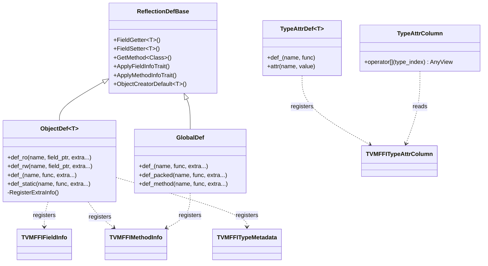

# Reflection System: Runtime Field, Method, and Type Attribute Access

**TL;DR**
- The reflection system enables cross-language access to C++ object fields and methods at runtime. Fields and methods are registered via `ObjectDef<T>` (a nanobind/pybind-style builder), which populates the global type table with getter/setter/method function pointers.
- `GlobalDef` (extending the same `ReflectionDefBase`) is the sole mechanism for registering global functions, replacing the removed `TVM_FFI_REGISTER_GLOBAL` macro.
- `TypeAttrDef<T>` and `TypeAttrColumn` provide an extensible column-oriented per-type attribute store for dispatch tables, custom structural equality, and other per-type metadata.
- `ffi.MakeObjectFromPackedArgs` enables Python-side construction of C++ objects using reflection metadata, traversing the ancestor chain to populate inherited fields.

## Problem Statement

### Background
- Cross-language field access on C++ objects requires a runtime mechanism since Python/Rust cannot directly read C++ memory layout.
- Generating per-type binding code for every Object field is impractical at scale (hundreds of types, thousands of fields).
- Global function registration needs richer metadata (type schemas, docstrings) than the legacy `TVM_FFI_REGISTER_GLOBAL` macro provided.
- Per-type extensible attributes (dispatch tables, custom comparison functions) need a uniform registration mechanism.

### Solution
- `ObjectDef<T>` is a templatized builder that auto-derives type_index/type_key from `T` and registers field metadata (`TVMFFIFieldInfo`), method metadata (`TVMFFIMethodInfo`), and type metadata (`TVMFFITypeMetadata`) in the global type table.
- `GlobalDef` registers global functions with full metadata via `TVMFFIFunctionSetGlobalFromMethodInfo`.
- `TypeAttrDef<T>` registers per-type attributes in named columns, looked up at runtime by `TypeAttrColumn`.
- All registration happens at static initialization time via `TVM_FFI_STATIC_INIT_BLOCK`.

### Goals
- Runtime field/method access from any language without per-type binding code.
- Type-safe getter/setter/method with proper error messages on type mismatch.
- Extensible per-type attributes via column-oriented storage.
- Reflection-based object construction from packed keyword arguments.
- A full serialization framework (ToJSONGraph/FromJSONGraph) is now built on top of reflection primitives. See [0010-json-and-serialization.md](../designs/0010-json-and-serialization.md).

## Design



### Key Classes, Fields and Interfaces

```python
class ReflectionDefBase:
    """Base class holding shared reflection utilities for field/method registration.
    Extracted from ObjectDef to enable reuse by GlobalDef and future builders."""

    @staticmethod
    def FieldGetter(field: void_ptr, result: Ptr[TVMFFIAny]) -> int:  # templated on T
        """Read a field value into an Any result."""
        # TVM_FFI_SAFE_CALL_BEGIN()
        # *result = Any(*reinterpret_cast<T*>(field))
        # TVM_FFI_SAFE_CALL_END()
        # Interacts with: TypeTraits<T>.MoveToAny (via Any constructor)

    @staticmethod
    def FieldSetter(field: void_ptr, value: Ptr[TVMFFIAny]) -> int:  # templated on T
        """Write a value into a field."""
        # TVM_FFI_SAFE_CALL_BEGIN()
        # *reinterpret_cast<T*>(field) = AnyView.CopyFromTVMFFIAny(*value).cast<T>()
        # TVM_FFI_SAFE_CALL_END()
        # Interacts with: AnyView.cast<T>() -> TypeTraits<T>.TryCastFromAnyView

    @staticmethod
    def ObjectCreatorDefault(result: Ptr[TVMFFIObjectHandle]) -> int:  # templated on T
        """Default creator: make_object<T>() and return handle."""
        # Invariant: T must be default-constructible

    @staticmethod
    def WrapFunction(func: MemberFuncPtr) -> Function:
        """Wrap a member function as ffi::Function. Extracted from GetMethod in 84c5bdbc
        to make it reusable by OverloadObjectDef. Dispatches via if constexpr:
          ObjectRef-derived Class: first arg is Class by value
          Object-derived Class: first arg is const Class*"""
        # Interacts with: Function.FromTyped
        # Extension: reused by OverloadObjectDef for overload-aware method wrapping

    @staticmethod
    def GetMethod(name: str, func: MemberFuncPtr) -> Function:
        """Wrap a member function as ffi::Function and set its name.
        Now delegates to WrapFunction + name assignment (84c5bdbc)."""
        # Interacts with: WrapFunction, Function.FromTyped

class ObjectDef(ReflectionDefBase, Generic[Class]):
    """Builder that registers field, method, and metadata for an object type.
    Auto-derives type_index from Class._GetOrAllocRuntimeTypeIndex() and
    type_key from Class._type_key."""
    type_index_: int32
    type_key_: str

    def __init__(self, *extra_args):
        """Registers TVMFFITypeMetadata (creator, total_size, doc) on construction."""
        # Calls RegisterExtraInfo(*extra_args)
        # Interacts with: TVMFFITypeRegisterMetadata, ObjectCreatorDefault<Class>
        # Invariant: if Class is default-constructible, creator is auto-set

    def def_ro(self, name: str, field_ptr: MemberPtr[BaseClass, T],
               *extra: Union[str, InfoTrait]) -> ObjectDef:
        """Register a read-only field with optional docstring, default, flags, and metadata.
        Auto-injects type_schema from TypeSchema<T>::v()."""
        # Invariant: static_assert(is_base_of_v<BaseClass, Class>)
        # Interacts with: TVMFFITypeRegisterField, Metadata

    def def_rw(self, name: str, field_ptr: MemberPtr[BaseClass, T],
               *extra: Union[str, InfoTrait]) -> ObjectDef:
        """Register a read-write field.
        Auto-injects type_schema from TypeSchema<T>::v()."""
        # Invariant: static_assert(Class._type_mutable) -- enforced at compile time
        # Invariant: static_assert(is_base_of_v<BaseClass, Class>)
        # Interacts with: TVMFFITypeRegisterField, Metadata

    def def_(self, name: str, func: Callable,
             *extra: Union[str, InfoTrait]) -> ObjectDef:
        """Register an instance method (self is first arg).
        Auto-injects type_schema from FunctionInfo<Func>::TypeSchema()."""
        # Interacts with: TVMFFITypeRegisterMethod, Function.FromTyped, Metadata

    def def_static(self, name: str, func: Callable,
                   *extra: Union[str, InfoTrait]) -> ObjectDef:
        """Register a static method (no self).
        Auto-injects type_schema from FunctionInfo<Func>::TypeSchema()."""
        # Interacts with: TVMFFITypeRegisterMethod, kTVMFFIFieldFlagBitMaskIsStaticMethod

# === Constructor registration: refl::init<Args...> tag struct (fc2630f) ===
# Replaces the old free-function refl::init<T, Args...> (c01dadf, removed in fc2630f).
# Now a tag struct -- the object type T is deduced from ObjectDef<T>, not explicitly passed.
# Aligns with nanobind/pybind11 constructor registration style.

class init(Generic[*Args]):
    """Tag type for registering a constructor on ObjectDef.
    Instantiated as init<int64_t, int32_t>() etc.
    The object type T is NOT a template parameter -- it is deduced from ObjectDef<T>."""
    # Invariant: Args must match an existing constructor of the target Class
    # Interacts with: ObjectDef.def() overload, ffi::make_object<Class>(args...)

    # Private:
    @staticmethod
    def execute(*args: Args) -> ObjectRef:  # templated on Class (friend of ObjectDef)
        """Constructs ObjectRef(make_object<Class>(args...))."""
        # Interacts with: ffi::make_object<Class>, ObjectRef constructor

# ObjectDef::def(init<Args...>) overload (fc2630f):
# class ObjectDef(ReflectionDefBase, Generic[Class]):
#     INIT_METHOD_NAME: ClassVar[str] = "__ffi_init__"  # private constexpr
#
#     def def(self, init_func: init[*Args], *extra: Union[str, InfoTrait]) -> ObjectDef:
#         """Register __ffi_init__ as a static method that constructs Class from Args.
#         Equivalent to: self.def_static("__ffi_init__", init<Args...>::execute<Class>, *extra)"""
#         # Interacts with: RegisterMethod(INIT_METHOD_NAME, is_static=True, ...)
#         # Invariant: only one __ffi_init__ per type (last registration wins)
#         # Extension: pass Metadata or docstring as extra args
#
# Convention: "__ffi_init__" is the standard static method name for FFI constructors.
# On the Python side, Object.__ffi_init__ dispatches to type(self).__c_ffi_init__,
# which is the renamed C++ __ffi_init__ (renamed during _add_class_attrs).
# Interacts with: Object.__init_handle_by_constructor__ (Python-side handle init)

# Macro expansion (pseudocode for TVM_FFI_STATIC_INIT_BLOCK()):
# New function-body syntax (7b813f8): TVM_FFI_STATIC_INIT_BLOCK() { Body }
#
# On GCC/Clang (__GNUC__):
#   __attribute__((constructor))
#   static void __TVMFFIStaticInitFunc<N>() { Body }
#
# On other compilers (MSVC, etc.):
#   static void __TVMFFIStaticInitFunc<N>();
#   [[maybe_unused]] static inline int __TVMFFIStaticInitReg<N> = []() {
#       __TVMFFIStaticInitFunc<N>(); return 0;
#   }();
#   static void __TVMFFIStaticInitFunc<N>() { Body }
#
# Replaces: TVM_FFI_REFLECTION_DEF (removed)
# Extension: general-purpose static init, not reflection-specific

class GlobalDef(ReflectionDefBase):
    """Builder for registering global functions. Replaces TVM_FFI_REGISTER_GLOBAL."""

    def def_(self, name: str, func: Callable, *extra) -> GlobalDef:
        """Register a typed global function with metadata."""
        # Auto-extracts FunctionInfo<Func>::TypeSchema() and prepends as ("type_schema", schema)
        # Wraps via Function.FromTyped, registers via TVMFFIFunctionSetGlobalFromMethodInfo
        # Interacts with: ReflectionDefBase.ApplyMethodInfoTrait (docstrings, metadata)

    def def_packed(self, name: str, func: PackedCallable, *extra) -> GlobalDef:
        """Register a packed-signature global function."""
        # Wraps via Function.FromPacked
        # type_schema is TypeSchemaImpl<Function>::v() (untyped function schema)

    def def_method(self, name: str, func: MemberFuncPtr, *extra) -> GlobalDef:
        """Expose a class method as a global function (self becomes first arg)."""
        # Uses GetMethod to dispatch ObjectRef by-value vs Object by-pointer
        # Auto-extracts type schema from member function pointer

    # Private:
    # RegisterFunc(name, func, type_schema, extra...):
    #   Creates MethodInfoBuilder (extends TVMFFIMethodInfo with metadata_ vector)
    #   Prepends ("type_schema", type_schema) to metadata_
    #   Applies extra args via ApplyMethodInfoTrait (docstrings, Metadata, etc.)
    #   Serializes metadata_ via Metadata::ToJSON -> info.metadata
    #   Calls TVMFFIFunctionSetGlobalFromMethodInfo

# === InfoTrait hierarchy (renamed from FieldInfoTrait in 28fe3cc) ===

class InfoTrait:
    """Base trait for field/method metadata. Renamed from FieldInfoTrait."""
    # Subclasses: DefaultValue, AttachFieldFlag, Metadata

class Metadata(InfoTrait):
    """User-supplied key-value metadata attached to a field, method, or global function."""
    dict_: list[tuple[String, Any]]  # key-value pairs

    def __init__(self, initializer_list: list[tuple[String, Any]]): ...
        # e.g., Metadata{{"description", "Adds two"}, {"version", 1}}

    def Apply(self, info: FieldInfoBuilder) -> None:
        """Copy metadata pairs into FieldInfoBuilder.metadata_"""
    def Apply(self, info: MethodInfoBuilder) -> None:
        """Copy metadata pairs into MethodInfoBuilder.metadata_"""

    @staticmethod
    def ToJSON(metadata: list[tuple[String, Any]]) -> str:
        """Serialize metadata to JSON string. Supports int, bool, String values only.
        Throws TypeError for other value types."""
        # Interacts with: EscapeString (string.h) for string value escaping

class FieldInfoBuilder(TVMFFIFieldInfo):
    """Builder extending TVMFFIFieldInfo with temporary metadata storage."""
    metadata_: list[tuple[String, Any]]
    # Used by ObjectDef.RegisterField: type_schema prepended, traits applied, then ToJSON

class MethodInfoBuilder(TVMFFIMethodInfo):
    """Builder extending TVMFFIMethodInfo with temporary metadata storage."""
    metadata_: list[tuple[String, Any]]
    # Used by GlobalDef.RegisterFunc and ObjectDef.RegisterMethod

class DefaultValue(InfoTrait):
    """Trait to set a field's static default value during registration."""
    value_: Any
    def Apply(self, info: FieldInfoBuilder) -> None:
        """Sets default_value_or_factory and HasDefault flag."""
        # Interacts with: kTVMFFIFieldFlagBitMaskHasDefault

class DefaultFactory(InfoTrait):
    """Trait for fields whose default is a callable () -> Any producing fresh values each time.
    Solves the mutable default problem: Array, Map, List fields get independent instances per object.
    Added in 5e564cd."""
    factory_: Function  # Callable that produces a new default value on each invocation
    def __init__(self, factory: Function): ...
    def Apply(self, info: FieldInfoBuilder) -> None:
        """Sets default_value_or_factory to the factory function and sets both
        kTVMFFIFieldFlagBitMaskHasDefault and kTVMFFIFieldFlagBitMaskDefaultFromFactory flags."""
        # Interacts with: kTVMFFIFieldFlagBitMaskDefaultFromFactory = 1 << 5
        # Invariant: factory is called once per object creation, producing independent instances

def SetFieldToDefault(field_info: Ptr[TVMFFIFieldInfo], field_addr: void_ptr) -> None:
    """Centralized helper to resolve a field's default value during object creation.
    If kTVMFFIFieldFlagBitMaskDefaultFromFactory is set: calls the factory function.
    Otherwise: copies the static default_value_or_factory directly.
    Used by ObjectCreator, MakeObjectFromPackedArgs, and serialization deserializer.
    Added in 5e564cd."""
    # Interacts with: TVMFFIFieldInfo.default_value_or_factory, ObjectCreator, serialization
    # Invariant: factory callable has signature () -> Any

# C ABI changes (5e564cd):
# TVMFFIFieldInfo.default_value renamed to default_value_or_factory
# kTVMFFIFieldFlagBitMaskDefaultFromFactory = 1 << 5 (new flag bit)

class AttachFieldFlag(InfoTrait):
    """Trait to attach field-level flags during registration."""
    @staticmethod
    def SEqHashDef() -> AttachFieldFlag: ...
    @staticmethod
    def SEqHashIgnore() -> AttachFieldFlag: ...
    # Interacts with: kTVMFFIFieldFlagBitMaskSEqHashDef/Ignore

# === Overload dispatch layer (reflection/overload.h, 84c5bdbc) ===

class OverloadBase:
    """Abstract base for one overload entry in a dispatch chain."""
    num_args_: int32             # expected argument count
    name_: str                   # method name (for error messages)
    name_ptr_: Optional[Ptr[str]]  # nullptr if name was empty
    last_mismatch_index_: int32  # cache for last failed arg position (kAllMatched = -1)

    def Register(self, overload: UniquePtr[OverloadBase]) -> None: ...
        # Invariant: only OverloadedFunction implements this; TypedOverload raises
    def GetTryCallPtr(self) -> FnPtr: ...
        # Returns de-virtualized function pointer for fast dispatch
    def GetMismatchMessage(self, os: ostream, args: Ptr[AnyView], num_args: int32) -> None: ...
        # Formats type-mismatch error for this overload
    # Interacts with: OverloadedFunction, TypedOverload

class TypedOverload(Generic[Callable], OverloadBase):
    """Concrete overload entry. Attempts a typed call using optional-based argument capture."""
    f_: Callable

    def TryCall(self, args: Ptr[AnyView], num_args: int32, rv: Ptr[Any]) -> bool:
        """Returns True if args match this overload's signature and call succeeded."""
        # 1. Check num_args == kNumArgs
        # 2. Populate CaptureTuple via TrySetAux (fold-expression short-circuit)
        # 3. Call f_ with unpacked captures
        # Invariant: CaptureTuple = tuple<optional<decay_t<Arg>>...>
        # Invariant: optionals only dereferenced after TrySetAux returns True
        # Interacts with: AnyView.try_cast<T>() for type matching

class OverloadedFunction(Generic[Callable], TypedOverload[Callable]):
    """Primary overload entry that owns additional overload entries."""
    overloads_: list[tuple[UniquePtr[OverloadBase], FnPtr]]

    def __call__(self, args: Ptr[AnyView], num_args: int32, rv: Ptr[Any]) -> None:
        """Dispatch: try primary (fast path), then iterate registered overloads."""
        # Fast path: if overloads_.empty(), call unpack_call directly (no overhead)
        # Slow path: try self.TryCall, then linear scan overloads by num_args then fptr
        # On failure: HandleOverloadFailure with per-overload mismatch messages
        # Interacts with: unpack_call (fast path), TypeError (on no match)

    def Register(self, overload: UniquePtr[OverloadBase]) -> None:
        """Add a new overload to the dispatch chain."""
        # Stores (overload, overload->GetTryCallPtr()) for de-virtualized dispatch

class OverloadObjectDef(Generic[Class]):
    """Reflection builder supporting overloaded method registration.
    Wraps ObjectDef<Class> via private inheritance; same API surface for fields."""

    def def_ro(self, name: str, field_ptr, *extra) -> OverloadObjectDef: ...
        # Delegates to ObjectDef.def_ro (no overloading for properties)
    def def_rw(self, name: str, field_ptr, *extra) -> OverloadObjectDef: ...
        # Delegates to ObjectDef.def_rw (no overloading for properties)
    def def_(self, name: str, func: Callable, *extra) -> OverloadObjectDef: ...
        # Overload-aware: if name already registered, appends to existing OverloadedFunction
        # Otherwise: creates new OverloadedFunction via Function::FromPackedInplace
        # Interacts with: registered_fields_ map, GetOverloadMethod, NewOverload
    def def_static(self, name: str, func: Callable, *extra) -> OverloadObjectDef: ...
        # Same overload logic as def_, with is_static=True
    def def_(self, init_func: init[*Args], *extra) -> OverloadObjectDef: ...
        # Registers overloadable __ffi_init__ constructor
        # Interacts with: init<Args...>::execute<Class>

    # Private:
    registered_fields_: dict[str, Ptr[OverloadBase]]
        # Maps method name -> OverloadBase* (owned by Function in type table)
        # Invariant: raw pointer lifetime managed by Function returned from FromPackedInplace
        # Interacts with: Function::FromPackedInplace (mutable callable access)

class TypeAttrDef(Generic[Class]):
    """Builder for registering per-type attributes. Parallels ObjectDef for fields/methods."""
    type_index_: int32
    type_key_: str

    def def_(self, name: str, func: Callable) -> TypeAttrDef:
        """Register a function-valued type attribute (method bound to Class)."""
        # Interacts with: ReflectionDefBase.GetMethod, TVMFFITypeRegisterAttr

    def attr(self, name: str, value: T) -> TypeAttrDef:
        """Register a constant-valued type attribute."""
        # Interacts with: TVMFFITypeRegisterAttr

class TypeAttrColumn:
    """Read accessor for a named type attribute column."""
    column_: Ptr[TVMFFITypeAttrColumn]

    def __init__(self, attr_name: str):
        """Look up column by name. Raises RuntimeError if not found."""
        # Interacts with: TVMFFIGetTypeAttrColumn

    def __getitem__(self, type_index: int32) -> AnyView:
        """Get attribute value for a type. Returns empty AnyView if out of bounds."""
        # Invariant: bounds-checked against column_.size

class FieldGetter:
    """Wrapper to get a field value from an object."""
    field_info_: Ptr[TVMFFIFieldInfo]
    def __init__(self, type_key: str, field_name: str): ...
    def __call__(self, obj: Object) -> Any: ...

class FieldSetter:
    """Wrapper to set a field value on an object."""
    field_info_: Ptr[TVMFFIFieldInfo]
    def __init__(self, type_key: str, field_name: str): ...
    def __call__(self, obj: Object, value: AnyView) -> None: ...

def GetFieldInfo(type_key: str, field_name: str) -> Ptr[TVMFFIFieldInfo]: ...
def GetMethodInfo(type_key: str, method_name: str) -> Ptr[TVMFFIMethodInfo]: ...
def GetMethod(type_key: str, method_name: str) -> Function: ...

def ForEachFieldInfo(type_info: Ptr[TVMFFITypeInfo],
                     callback: Callable[[Ptr[TVMFFIFieldInfo]], None]) -> None:
    """Visit each field of a type, including inherited fields from all ancestors."""
    # Iterates ancestors in parent-to-child order (depth 1..type_depth-1, skipping root)
    # Invariant: callback must return void (static_assert enforced)
    # Interacts with: TVMFFITypeInfo.type_ancestors (pointer-based, no lookup)

def ForEachFieldInfoWithEarlyStop(type_info: Ptr[TVMFFITypeInfo],
                                   callback: Callable[[Ptr[TVMFFIFieldInfo]], bool]) -> bool:
    """Traverse fields with early termination. Returns True on early stop."""
    # Same traversal order as ForEachFieldInfo
    # Stops when callback returns True

def EnsureTypeAttrColumn(name: str) -> None:
    """Pre-create a column without storing a value. Idempotent."""

class ObjectCreator:
    """Reflection-based creator: constructs objects from Map<String, Any> field maps.
    Complementary to MakeObjectFromPackedArgs (positional packed args)."""
    # Interacts with: TVMFFITypeInfo, TVMFFITypeMetadata.creator, ForEachFieldInfo
    # Invariant: type must have reflection registered and default constructor
    # Invariant: all required fields must be present; no unknown fields allowed

    def __init__(self, type_key: str): ...
        # Resolves type_key -> type_index -> TVMFFITypeInfo
    def __init__(self, type_info: Ptr[TVMFFITypeInfo]): ...
        # Direct construction from type info
    def __call__(self, fields: Map[String, Any]) -> Any: ...
        # 1. Call metadata->creator to allocate empty object
        # 2. ForEachFieldInfo: set fields from map, use defaults, or raise TypeError
        # 3. Verify no extra fields (match_field_count == fields.size())
    # Extension: use alongside MakeObjectFromPackedArgs for different construction patterns

# === Auto-copy support and DeepCopy (c73d61a) ===

# Well-known type attribute names for copy protocol:
# type_attr::kInit = "__ffi_init__"           # constructor method name
# type_attr::kShallowCopy = "__ffi_shallow_copy__"  # shallow copy method name

# ObjectDef<T>::AutoRegisterCopy() -- called automatically in ObjectDef constructor:
# If T is copy-constructible (std::is_copy_constructible_v<T>):
#   1. Registers method "__ffi_shallow_copy__" that returns ObjectRef(make_object<T>(*self))
#   2. Registers it as a type attribute via TVMFFITypeRegisterAttr
# This enables Python copy.copy() and copy.deepcopy() on all copy-constructible reflected types.

def DeepCopy(value: Any) -> Any:
    """Memoized deep copy of an FFI object graph. Registered as ffi.DeepCopy.
    Recursively copies all reachable objects. Shared references are preserved
    (same pointer copied once, all references point to the same copy).
    Cycles handled for List (mutable containers). Added in c73d61a."""
    # Dispatch:
    #   Primitives, String, Bytes: returned as-is (immutable)
    #   Array, Map: recursively deep-copied element-by-element
    #   List: recursively deep-copied with cycle detection (mutable)
    #   Objects with __ffi_shallow_copy__: shallow copy then recursively deep-copy fields
    #   Objects without __ffi_shallow_copy__: raises TypeError
    # Interacts with: type_attr::kShallowCopy, ObjectDeepCopier (internal memoization table)
    # Invariant: shared references in the object graph are preserved (same source -> same copy)
    # Extension: any copy-constructible ObjectDef type auto-supports deep copy

# Python-side integration (c73d61a):
# All FFI Object subclasses auto-get:
#   __copy__(self)      -> calls self.__ffi_shallow_copy__()
#   __deepcopy__(self, memo=None) -> calls ffi.DeepCopy(self)
#   __replace__(self, **kwargs)   -> copy + setattr for each kwarg
# Non-copyable types raise TypeError with clear message.

def MakeObjectFromPackedArgs(type_key: str, *field_name_value_pairs) -> ObjectRef:
    """Create an object from type_key and keyword field assignments.
    Registered as global function: ffi.MakeObjectFromPackedArgs"""
    # 1. Look up type_index from type_key
    # 2. Call TVMFFITypeMetadata.creator to get empty object
    # 3. Walk ancestor chain (parent-to-child), set fields by name
    # 4. Fields not provided use default_value; missing required fields raise TypeError
    # Invariant: args must be (type_key, name1, val1, name2, val2, ...)

# === Type schema support (28fe3cc) ===

class TypeSchemaImpl(Generic[T]):
    """C++ template generating JSON type schema strings.
    Forward-declared in base_details.h, defined in function_details.h.
    TypeSchema<T> alias strips const/reference qualifiers."""

    @staticmethod
    def v() -> str:
        """Returns JSON schema string for type T."""
        # Primary template: delegates to TypeTraits<T>::TypeSchema()
        # Specializations: void -> {"type":"None"}, Any/AnyView -> {"type":"Any"}
        # Interacts with: every TypeTraits<T> specialization

# ffi.GetGlobalFuncMetadata (function.cc, 28fe3cc):
#   Global function: takes function name (String), returns metadata JSON (String)
#   Implementation: GlobalFunctionTable::Global()->Get(name)->metadata_data
#   Throws RuntimeError if function not found
#   Interacts with: get_global_func_metadata (Python wrapper in registry.py)
```

### Contracts, Assumptions and Invariants
- **Offset from Object header**: The offset stored in `TVMFFIFieldInfo` is relative to the `Object` base, computed as `field_offset_in_class - Object_header_offset_in_class`.
- **Getter/setter wrapped in safe_call**: Both `FieldGetter<T>` and `FieldSetter<T>` use `TVM_FFI_SAFE_CALL_BEGIN/END`.
- **Writability via flags**: The `kTVMFFIFieldFlagBitMaskWritable` flag controls writability. Setter function pointers are always populated (needed for serialization); writability enforcement is at the binding layer.
- **_type_mutable compile-time guard**: `def_rw` enforces `static_assert(Class::_type_mutable)`, preventing read-write fields on types not marked mutable.
- **Inherited field registration**: `def_ro`/`def_rw` accept `MemberPtr[BaseClass, T]` with `static_assert(is_base_of_v<BaseClass, Class>)`, enabling registration of parent class fields.
- **GlobalDef as sole global registration**: `TVM_FFI_REGISTER_GLOBAL` is removed (commit 26b68b0). All global function registration uses `GlobalDef`.
- **Automatic type_schema injection**: Every field, method, and global function registration automatically prepends a `"type_schema"` key to the metadata JSON. User-supplied `Metadata` entries are appended after the type_schema (28fe3cc).
- **Metadata value type restriction**: `Metadata::ToJSON` only supports `int`, `bool`, and `String` values. Other types throw `TypeError` (28fe3cc).
- **Builder intermediaries**: `FieldInfoBuilder` and `MethodInfoBuilder` extend the C structs with a temporary `metadata_` vector. The vector is serialized to JSON just before the C API call, and the resulting string is assigned to the `metadata` field of the C struct (28fe3cc).
- **DefaultFactory vs DefaultValue**: `DefaultValue` stores a static default. `DefaultFactory` stores a callable that is invoked per object creation. The `kTVMFFIFieldFlagBitMaskDefaultFromFactory` bit distinguishes them. All default-consumption sites (ObjectCreator, MakeObjectFromPackedArgs, serialization deserializer) share the centralized `SetFieldToDefault` helper (5e564cd).
- **Auto-copy for copy-constructible types**: `ObjectDef<T>` automatically registers `__ffi_shallow_copy__` if `std::is_copy_constructible_v<T>` is true. This is done in the constructor via `AutoRegisterCopy()`. Non-copyable types do not get the attribute and will raise `TypeError` on copy attempts (c73d61a).
- **DeepCopy memoization**: `ffi.DeepCopy` uses an internal memoization table keyed by source object pointer. Every unique source object is copied exactly once; all references to it in the graph share the same copy (c73d61a).

### Extension Points
- **Custom info traits**: Subclass `InfoTrait` (renamed from `FieldInfoTrait` in 28fe3cc) and implement `Apply(FieldInfoBuilder*)` and/or `Apply(MethodInfoBuilder*)` for new per-field/method metadata.
- **User-supplied metadata**: Pass `Metadata{{"key", value}, ...}` as extra args to `def_ro`/`def_rw`/`def_`/`def_static`/`GlobalDef::def_`. Metadata values must be int, bool, or String.
- **Type attributes via TypeAttrDef**: Register arbitrary per-type dispatch functions or constants, accessed at runtime via `TypeAttrColumn`.
- **Custom object creators**: Override the default `ObjectCreatorDefault<T>` by passing a custom creator in `ObjectDef` extra args.
- **Registry split**: `reflection/registry.h` contains registration builders; `reflection/accessor.h` contains runtime accessors (FieldGetter, FieldSetter, GetFieldInfo, ForEachFieldInfo).
- **Type schema for custom TypeTraits**: Any custom `TypeTraits<T>` specialization should add `static std::string TypeSchema()` returning a JSON object string to participate in schema generation (28fe3cc).

### Usage Examples

#### Registering fields, methods, and type attributes
**Context**: A C++ type with the ObjectDef-based reflection API, including defaults, docstrings, and custom type attributes.

```cpp
// C++ side: define and register
class TFloatObj : public Object {
 public:
  double value;
  static constexpr bool _type_mutable = true;
  double Add(double other) const { return value + other; }
  TVM_FFI_DECLARE_OBJECT_INFO_FINAL("test.Float", TFloatObj, Object);
};

TVM_FFI_STATIC_INIT_BLOCK() {
  namespace refl = tvm::ffi::reflection;
  refl::ObjectDef<TFloatObj>()
      .def_rw("value", &TFloatObj::value,
              "float value field",                    // docstring
              refl::DefaultValue(10.0),               // default
              refl::Metadata{{"unit", "meters"}})     // user metadata (28fe3cc)
      .def("add", &TFloatObj::Add, "add method",
           refl::Metadata{{"deprecated", false}});    // method metadata

  // Type attributes for dispatch
  refl::TypeAttrDef<TFloatObj>()
      .attr("test.size", sizeof(TFloatObj));

  // Global function registration (replaces TVM_FFI_REGISTER_GLOBAL)
  refl::GlobalDef()
      .def("test.add_floats", [](double a, double b) { return a + b; },
           refl::Metadata{{"description", "Add two floats"}, {"version", 1}});
  // Metadata JSON: {"type_schema":"...","description":"Add two floats","version":1}
}
```

#### Creating objects from Python via packed args
**Context**: Python-side construction using reflection metadata.

```python
# Python side (conceptual):
make = get_global_func("ffi.MakeObjectFromPackedArgs")
obj = make("test.Float", "value", 3.14)
# Calls TVMFFITypeMetadata.creator -> empty TFloatObj
# Sets "value" field via FieldSetter -> 3.14
```

#### Registering overloaded constructors and methods
**Context**: Using `OverloadObjectDef` to register multiple overloads of the same method name with runtime dispatch by argument count and type (84c5bdbc).

```cpp
struct TestOverloadObj : public Object {
  explicit TestOverloadObj(int32_t x) : type(Type::INT) {}
  explicit TestOverloadObj(float y) : type(Type::FLOAT) {}
  static int AddOneInt(int x) { return x + 1; }
  static float AddOneFloat(float x) { return x + 1.0f; }
  enum class Type { INT, FLOAT } type;
  TVM_FFI_DECLARE_OBJECT_INFO("test.TestOverloadObj", TestOverloadObj, Object);
};

TVM_FFI_STATIC_INIT_BLOCK() {
  namespace refl = tvm::ffi::reflection;
  refl::OverloadObjectDef<TestOverloadObj>()
      .def(refl::init<int32_t>())           // __ffi_init__(int32_t)
      .def(refl::init<float>())             // __ffi_init__(float) -- overload
      .def_static("add_one", &TestOverloadObj::AddOneInt)
      .def_static("add_one", &TestOverloadObj::AddOneFloat);  // overload
}

// Runtime dispatch selects correct overload by argument type
Function init = reflection::GetMethod("test.TestOverloadObj", "__ffi_init__");
Any obj_int = init(10);      // dispatches to int32_t constructor
Any obj_flt = init(3.14f);   // dispatches to float constructor
```

#### Registering factory defaults for mutable fields
**Context**: C++ type with a mutable container field that needs independent default instances per object (5e564cd).

```cpp
// C++ side: mutable default via DefaultFactory
refl::ObjectDef<MyObj>()
    .def_ro("items", &MyObj::items,
            refl::DefaultFactory(
                Function::FromTyped([]() -> Array<ObjectRef> { return Array<ObjectRef>(); })))
    .def_ro("count", &MyObj::count, refl::DefaultValue(int64_t(0)));

// Each MyObj created without explicit "items" gets a fresh empty Array.
// Without DefaultFactory, all instances would share the same Array reference.
```

#### Using copy and deepcopy on FFI objects
**Context**: Python-side copy semantics for reflected FFI objects (c73d61a).

```python
import copy
from tvm_ffi import testing

obj = testing.TestObj(x=1, y="hello")
shallow = copy.copy(obj)            # calls __ffi_shallow_copy__ (auto-registered)
deep = copy.deepcopy(obj)           # calls ffi.DeepCopy (memoized graph copy)
replaced = obj.__replace__(x=2)     # shallow copy + setattr

# Shared references preserved in deepcopy:
inner = testing.TestObj(x=10, y="inner")
a = testing.TestContainer(first=inner, second=inner)
b = copy.deepcopy(a)
assert b.first.same_as(b.second)    # same copy, not two separate copies
```

## Alternatives & Trade-offs

### Code generation (generate per-type bindings)
- Pros: Zero runtime overhead for field access, compile-time type checking
- Cons: Requires a code generation step, increases binary size, must regenerate when types change.

### Virtual method VisitAttrs (legacy TVM approach)
- Pros: No global registration needed
- Cons: Requires every type to implement VisitAttrs, cannot be extended after compilation, no direct byte-offset access, no method or type attribute support.

## Related Work
### Design Docs & ADRs
- [0002-object-system.md](../designs/0002-object-system.md) -- Object base class, type registration
- [0001-c-abi.md](../designs/0001-c-abi.md) -- TVMFFIFieldInfo, TVMFFIMethodInfo, TVMFFITypeMetadata, TVMFFITypeAttrColumn
- [0006-type-traits.md](../designs/0006-type-traits.md) -- TypeTraits used in getter/setter for conversion
- [0009-structural-equal-hash.md](../designs/0009-structural-equal-hash.md) -- Uses TypeAttrColumn for custom eq/hash dispatch
- [ADR 0005](../ADRs/0005-reflection-driven-structural-equality.md) -- Decision to use reflection for structural equality

### Evidence Matrix
- ObjectDef<T> replacing ReflectionDef, TVM_FFI_STATIC_INIT_BLOCK -> `commits/2025-06-16-a419ed175aac752a3df2ee73faad360a2824ecd8.md` (a419ed1)
- Method reflection via def()/def_static(), nanobind-style API -> `commits/2025-06-15-1a856886c8c14c6271e156d1ce4d76335d42f0ff.md` (1a85688)
- ReflectionDefBase extraction, MakeObjectFromPackedArgs -> `commits/2025-06-17-e9094866e1e58535f2456b92c1072449f6a2716a.md` (e909486)
- TypeAttrDef/TypeAttrColumn, TVMFFITypeMetadata rename -> `commits/2025-07-22-162d6009252dd44950a9aa9b890cbbce6b8e5155.md` (162d600)
- GlobalDef introduction -> `commits/2025-07-03-b333288162ba3a883dbf6b1ce23672f687d70163.md` (b333288)
- TVM_FFI_REGISTER_GLOBAL removal -> `commits/2025-07-15-26b68b0256fb40baa8aeb55847050d13b064f441.md` (26b68b0)
- ForEachFieldInfo, type_ancestors pointer-based -> `commits/2025-06-19-837800e772d8c1dfa3a00a9f23f096487c96bd37.md` (837800e)
- ForEachFieldInfoWithEarlyStop -> `commits/2025-06-25-69f2484f915d95886502a1f620ea69aeed623c49.md` (69f2484)
- Inherited field registration, generic enum TypeTraits -> `commits/2025-06-27-f7311e495820859fba26d19010fc5bda0275293d.md` (f7311e4)
- Split reflection.h into registry.h/accessor.h -> `commits/2025-07-14-e95b43b0a36325fc17ad3918e3572cf11fabae13.md` (e95b43b)
- ObjectCreator (Map-based construction), GetMethod template param removal -> `commits/2025-08-05-7cb92736b2ed95852ac71543937511acc7a3feec.md` (7cb9273), `commits/2025-08-06-f4ede982f00257881d9ba7fe82dd8abc07e14690.md` (f4ede98)
- refl::init<T, Args...> convenience helper, __ffi_init__ naming convention -> `commits/2025-09-21-c01dadf31a66e74cdbfd7fdb1ffc81a75007965f.md` (c01dadf)
- type_acenstors -> type_ancestors rename -> `commits/2025-09-25-98cb8af49ff599c217fce96c3d4f57c0f52b8ec4.md` (98cb8af)
- Metadata, TypeSchema, InfoTrait, FieldInfoBuilder/MethodInfoBuilder, ffi.GetGlobalFuncMetadata -> `commits/2025-10-03-28fe3cc7fc23b725ddefbb3ca1e1899a7dfd530c.md` (28fe3cc)
- OverloadObjectDef, OverloadBase/TypedOverload/OverloadedFunction dispatch chain, WrapFunction extraction, Function::FromPackedInplace -> `commits/2025-12-23-84c5bdbcd11ae0e5bc921db4f35d3fd1d3ae762c.md` (84c5bdb)
- DeepCopy, AutoRegisterCopy, __ffi_shallow_copy__, __copy__/__deepcopy__/__replace__ on Python FFI objects -> `commits/2026-02-13-c73d61a423edf69483676f727cf272feebbe4d49.md` (c73d61a)
- DefaultFactory trait, SetFieldToDefault helper, kTVMFFIFieldFlagBitMaskDefaultFromFactory, default_value_or_factory rename -> `commits/2026-02-14-5e564cdfb932af63915fbeb5a5aa30671f55ae2c.md` (5e564cd)
- Consolidated repr_print, deep_copy, recursive compare/hash into dataclass.cc; reflection/init.h for auto-generated __ffi_init__ -> `commits/2026-02-27-6b39efbf381e48a8a42ab3779bc2adf587458fb3.md` (6b39efb)
- DFS-based ffi.ReprPrint, TVMFFIObjectDefGetReprPrint C ABI entry -> `commits/2026-02-18-b648c5d6b7981350c165096efbb98d00787e2900.md` (b648c5d)
- __ffi_convert__ protocol via ObjectDef::def_convert, type_converter.pxi -> `commits/2026-03-08-5f5ca5abd1bcec24219f34cfe379699e809f6f66.md` (5f5ca5a)
- FunctionObj setter dispatch in TVMFFIFieldInfo -> `commits/2026-03-04-4bb487efe6708220b879759facabb4a042e5928a.md` (4bb487e)
- begin_index in TypeAttrColumn for parent field layout -> `commits/2026-02-22-c85fd42df6eae4ae0ec1aaa4ebb67ac859758cf5.md` (c85fd42)
